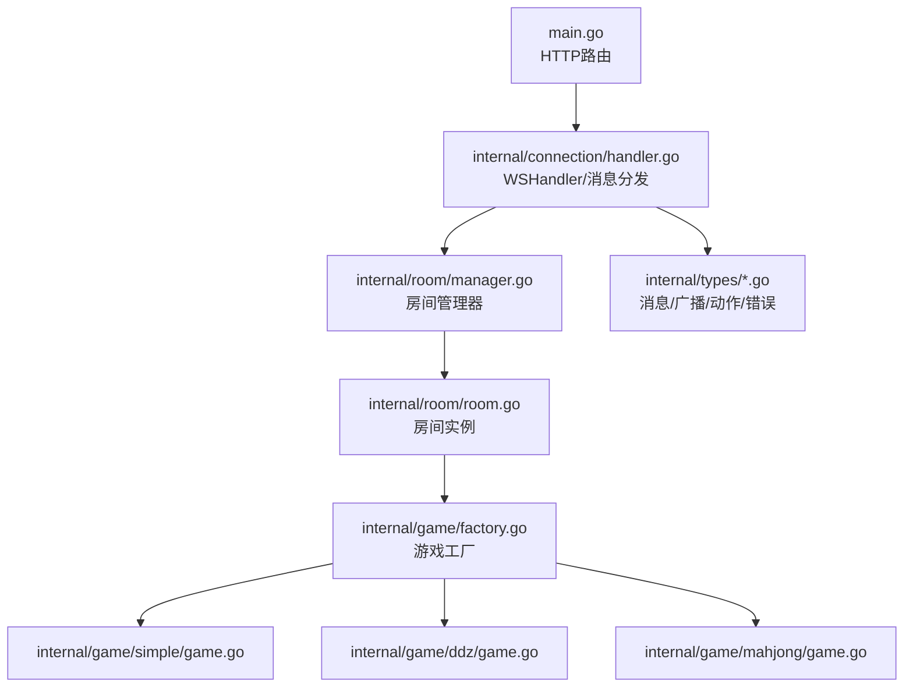
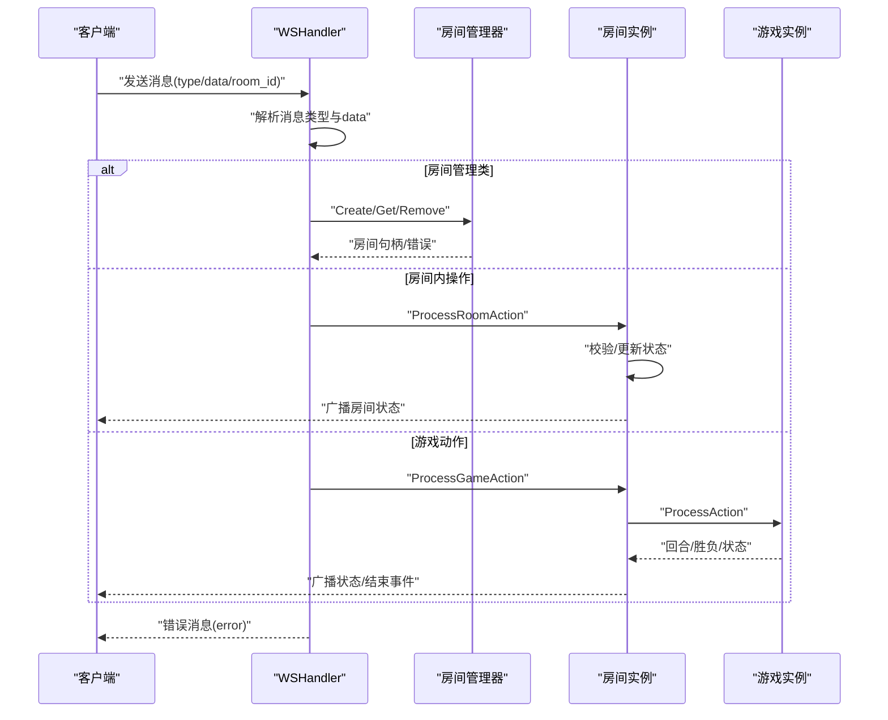
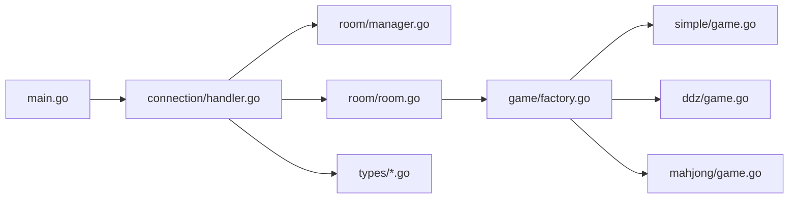

# API参考

<cite>
**本文档引用的文件**
- [main.go](file://main.go)
- [client.html](file://client.html)
- [internal/connection/handler.go](file://internal/connection/handler.go)
- [internal/types/message.go](file://internal/types/message.go)
- [internal/types/broadcast.go](file://internal/types/broadcast.go)
- [internal/types/game_action.go](file://internal/types/game_action.go)
- [internal/types/room_action.go](file://internal/types/room_action.go)
- [internal/types/error.go](file://internal/types/error.go)
- [internal/room/room.go](file://internal/room/room.go)
- [internal/room/manager.go](file://internal/room/manager.go)
- [internal/game/factory.go](file://internal/game/factory.go)
- [internal/game/simple/game.go](file://internal/game/simple/game.go)
- [internal/game/ddz/game.go](file://internal/game/ddz/game.go)
- [internal/game/mahjong/game.go](file://internal/game/mahjong/game.go)
- [README.md](file://README.md)
</cite>

## 目录
1. [简介](#简介)
2. [项目结构](#项目结构)
3. [核心组件](#核心组件)
4. [架构总览](#架构总览)
5. [详细组件分析](#详细组件分析)
6. [依赖关系分析](#依赖关系分析)
7. [性能考虑](#性能考虑)
8. [故障排查指南](#故障排查指南)
9. [结论](#结论)
10. [附录](#附录)

## 简介
本文件为卡牌游戏服务器的完整API参考文档，覆盖WebSocket消息协议、房间操作API、游戏动作API、错误处理机制、消息序列化与反序列化实现细节，并提供请求/响应示例、错误场景演示、最佳实践与性能优化建议，以及前端集成指南与调试技巧。

## 项目结构
- 服务入口：HTTP路由绑定WebSocket处理器
- 连接层：WebSocket升级、心跳、读写泵、消息分发
- 房间层：房间生命周期、玩家管理、广播、断线重连
- 游戏层：统一Game接口，多种游戏实现（简单牌、斗地主、麻将）
- 类型层：消息、广播、动作、错误码等统一定义

**图表来源**
- [main.go](file://main.go#L10-L14)
- [internal/connection/handler.go](file://internal/connection/handler.go#L19-L158)
- [internal/room/manager.go](file://internal/room/manager.go#L47-L82)
- [internal/room/room.go](file://internal/room/room.go#L35-L56)
- [internal/game/factory.go](file://internal/game/factory.go#L11-L23)

**章节来源**
- [README.md](file://README.md#L20-L50)
- [main.go](file://main.go#L10-L14)

## 核心组件
- WebSocket处理器：负责连接建立、消息解析、路由到房间与游戏处理、错误统一返回
- 房间管理器：全局房间与玩家追踪，提供创建、获取、删除房间能力
- 房间实例：维护房间状态、玩家与座位、准备状态、断线处理、广播通道
- 游戏工厂：根据game_type创建对应游戏实例
- 类型系统：统一消息结构、广播事件、房间/游戏动作类型、错误码

**章节来源**
- [internal/connection/handler.go](file://internal/connection/handler.go#L19-L158)
- [internal/room/manager.go](file://internal/room/manager.go#L47-L82)
- [internal/room/room.go](file://internal/room/room.go#L14-L56)
- [internal/game/factory.go](file://internal/game/factory.go#L11-L23)
- [internal/types/message.go](file://internal/types/message.go#L32-L77)
- [internal/types/broadcast.go](file://internal/types/broadcast.go#L17-L47)
- [internal/types/game_action.go](file://internal/types/game_action.go#L3-L18)
- [internal/types/room_action.go](file://internal/types/room_action.go#L3-L9)
- [internal/types/error.go](file://internal/types/error.go#L3-L12)

## 架构总览
WebSocket消息在服务端按类型分发至房间或游戏处理逻辑，房间负责广播状态与事件，游戏负责业务规则校验与状态推进。

**图表来源**
- [internal/connection/handler.go](file://internal/connection/handler.go#L130-L156)
- [internal/room/room.go](file://internal/room/room.go#L296-L316)
- [internal/room/room.go](file://internal/room/room.go#L462-L523)

**章节来源**
- [internal/connection/handler.go](file://internal/connection/handler.go#L19-L158)
- [internal/room/room.go](file://internal/room/room.go#L296-L523)

## 详细组件分析

### WebSocket消息协议
- 连接地址：ws://localhost:8080/ws?player=玩家ID
- 通用消息结构：
  - type：消息类型（见“消息类型枚举”）
  - room_id：房间ID（部分消息必填）
  - player_id：发送方玩家ID（服务端填充）
  - data：消息体（按type与data结构定义）

消息类型枚举
- 房间管理：room.create、room.join、room.leave
- 房间内操作：room.action
- 游戏动作：game.action
- 聊天：chat
- 服务端广播：broadcast
- 服务端错误：error

消息体结构
- room.create：data.game_type（必填）
- room.join：data.room_id（必填）
- room.action：data.action（ready/sit）、data.data（随action变化）
- game.action：data.action（见“游戏动作类型”）、data.card（随游戏）
- chat：data.content（必填）

错误消息结构
- data.code：错误码
- data.message：错误描述

**章节来源**
- [README.md](file://README.md#L77-L103)
- [internal/types/message.go](file://internal/types/message.go#L13-L30)
- [internal/types/message.go](file://internal/types/message.go#L32-L77)
- [internal/types/broadcast.go](file://internal/types/broadcast.go#L17-L20)
- [internal/types/error.go](file://internal/types/error.go#L3-L12)

### 房间操作API
- 创建房间
  - 请求：type=room.create，data={game_type}
  - 成功：返回房间ID并自动加入
  - 失败：错误码400/409/500
- 加入房间
  - 请求：type=room.join，data={room_id}
  - 成功：加入房间并广播状态
  - 失败：错误码400/404/409/411/500
- 离开房间
  - 请求：type=room.leave（服务端内部使用）
  - 行为：移除玩家、清理座位、广播状态
- 房间内操作
  - 准备/取消准备：data={action:"ready", data:{ready:true/false}}
  - 选座：data={action:"sit", data:{seat_number:0..N-1}}

房间状态
- waiting：等待中（可加入、可准备）
- playing：游戏中
- paused：游戏暂停（有玩家断线）
- gameover：游戏结束

**章节来源**
- [internal/connection/handler.go](file://internal/connection/handler.go#L160-L221)
- [internal/connection/handler.go](file://internal/connection/handler.go#L223-L282)
- [internal/room/room.go](file://internal/room/room.go#L296-L388)
- [internal/types/message.go](file://internal/types/message.go#L3-L11)
- [internal/types/room_action.go](file://internal/types/room_action.go#L3-L9)

### 游戏动作API
- 简易牌（simple）
  - 动作：play_card（出牌）
  - 数据：data={action:"play_card", card: 数字}
- 斗地主（ddz）
  - 动作：call_landlord（叫地主，分数0~3）
  - 数据：data={action:"call_landlord", card: 分数}
  - 动作：play_cards（出牌）
  - 数据：data={action:"play_cards", card:[{value:数值}...]}
  - 动作：pass（跳过）
  - 数据：data={action:"pass"}
- 麻将（mahjong）
  - 动作：discard（出牌）
  - 数据：data={action:"discard", card:{suit,rank}}
  - 动作：chow（吃）
  - 数据：data={action:"chow", card:[{suit,rank}...]}（需提供两张手牌）
  - 动作：pong（碰）
  - 数据：data={action:"pong", card:{suit,rank}}
  - 动作：kong（杠）
  - 数据：data={action:"kong", card:{suit,rank}}
  - 动作：win（胡）
  - 数据：data={action:"win"}

执行结果
- 服务器广播：game_started、state_update、game_over
- 简易牌：每出牌后广播状态；最先出完牌的玩家获胜
- 斗地主：叫分阶段与出牌阶段；地主确定后进入出牌；最先出完牌的阵营获胜
- 麻将：出牌后进入等待响应阶段，其他玩家可胡/杠/碰/吃；满足番数条件可胡牌

**章节来源**
- [internal/types/game_action.go](file://internal/types/game_action.go#L3-L18)
- [internal/game/simple/game.go](file://internal/game/simple/game.go#L37-L64)
- [internal/game/ddz/game.go](file://internal/game/ddz/game.go#L125-L293)
- [internal/game/mahjong/game.go](file://internal/game/mahjong/game.go#L142-L180)
- [internal/game/mahjong/game.go](file://internal/game/mahjong/game.go#L293-L388)
- [internal/types/broadcast.go](file://internal/types/broadcast.go#L6-L15)

### 消息序列化与反序列化
- 客户端发送：JSON字符串
- 服务端接收：conn.ReadMessage()
- 服务端解析：
  - 先反序列化为map[string]interface{}，读取type字段
  - 再按type反序列化到具体结构体（CreateRoomData/JoinRoomData/GameActionData/ChatData等）
- 服务端发送：conn.WriteJSON(types.Message)

注意
- data字段采用延迟解析（先转为字节数组再按具体类型反序列化）
- 错误消息统一为type:error，data为ErrorData

**章节来源**
- [internal/connection/handler.go](file://internal/connection/handler.go#L103-L156)
- [internal/connection/handler.go](file://internal/connection/handler.go#L423-L429)

### 错误处理机制
错误码定义
- 400：ErrInvalidDataCode（数据格式错误/缺少字段）
- 403：ErrJoinFailedCode（加入房间失败）
- 404：ErrRoomNotFoundCode（房间不存在）
- 409：ErrAlreadyInRoomCode（已在房间中）
- 410：ErrPlayerAlreadyConnectedCode（玩家已在其他连接中）
- 411：ErrPlayerNotInRoomCode（玩家不在房间中）
- 500：ErrInternalCode（内部错误）
- 501：ErrNotImplementedCode（未实现）

错误消息格式
- type:error
- data.code：错误码
- data.message：错误描述

常见错误场景
- 缺少type或data字段
- 房间不存在或房间已满
- 玩家重复连接或不在房间中
- 游戏阶段非法（非当前回合、暂停中、已结束）

**章节来源**
- [internal/types/error.go](file://internal/types/error.go#L3-L12)
- [internal/connection/handler.go](file://internal/connection/handler.go#L110-L120)
- [internal/connection/handler.go](file://internal/connection/handler.go#L423-L429)

### 广播与事件
事件类型
- room_state_changed：房间状态变更（玩家加入/离开/准备/选座等）
- game_started：游戏开始
- state_update：游戏状态更新（出牌等）
- chat：聊天消息
- game_over：游戏结束

广播内容
- room_state_changed：包含房间ID、状态、玩家列表（含座位与准备状态）、附加消息
- game_started/state_update：包含各玩家手牌或手牌数量（按游戏而定）
- chat：包含房间ID、玩家ID、内容
- game_over：包含获胜者

**章节来源**
- [internal/types/broadcast.go](file://internal/types/broadcast.go#L3-L15)
- [internal/types/broadcast.go](file://internal/types/broadcast.go#L17-L47)
- [internal/room/room.go](file://internal/room/room.go#L404-L458)
- [internal/room/room.go](file://internal/room/room.go#L525-L538)

### 断线重连与超时
- 断线保护：游戏中/暂停时断线标记为离线，暂停游戏
- 30秒超时：若断线超过30秒，游戏结束并广播结果
- 重连：断线玩家在30秒内重连，恢复连接并恢复游戏

**章节来源**
- [internal/room/room.go](file://internal/room/room.go#L133-L168)
- [internal/room/room.go](file://internal/room/room.go#L170-L220)
- [internal/room/room.go](file://internal/room/room.go#L222-L257)

## 依赖关系分析
- main.go -> connection.WSHandler
- connection -> room.Manager/Room + types
- room -> game.Factory + types
- game.Factory -> simple/ddz/mahjong

**图表来源**
- [main.go](file://main.go#L10-L14)
- [internal/connection/handler.go](file://internal/connection/handler.go#L9-L12)
- [internal/room/manager.go](file://internal/room/manager.go#L47-L52)
- [internal/room/room.go](file://internal/room/room.go#L35-L56)
- [internal/game/factory.go](file://internal/game/factory.go#L11-L23)

**章节来源**
- [main.go](file://main.go#L10-L14)
- [internal/connection/handler.go](file://internal/connection/handler.go#L9-L12)
- [internal/room/manager.go](file://internal/room/manager.go#L47-L52)
- [internal/room/room.go](file://internal/room/room.go#L35-L56)
- [internal/game/factory.go](file://internal/game/factory.go#L11-L23)

## 性能考虑
- 广播通道缓冲：房间广播通道容量较大，避免阻塞
- 广播发送：非阻塞发送，丢弃队列满的消息，避免单个客户端拖慢整体
- 防抖：同一玩家100ms内重复操作会被忽略，降低无效计算
- 个性化广播：按玩家生成状态，减少无关信息传输
- 心跳与清理：连接断开时及时清理资源，避免内存泄漏

**章节来源**
- [internal/room/room.go](file://internal/room/room.go#L44-L46)
- [internal/room/room.go](file://internal/room/room.go#L568-L612)
- [internal/room/room.go](file://internal/room/room.go#L476-L482)
- [internal/room/room.go](file://internal/room/room.go#L534-L538)

## 故障排查指南
- 连接失败
  - 检查URL参数player是否缺失
  - 检查是否重复连接同一playerID
- 房间相关错误
  - 房间不存在：确认room_id是否正确
  - 已在房间中：先离开当前房间
  - 房间已满：等待新房间或更换房间
- 游戏动作错误
  - 非当前回合：等待轮到自己
  - 暂停中：等待断线玩家重连
  - 已结束：等待新局开始
- 调试建议
  - 前端开启控制台日志查看收到的消息
  - 关注广播事件：room_state_changed、state_update、game_over
  - 使用测试客户端验证基本流程

**章节来源**
- [internal/connection/handler.go](file://internal/connection/handler.go#L35-L44)
- [internal/connection/handler.go](file://internal/connection/handler.go#L260-L268)
- [internal/room/room.go](file://internal/room/room.go#L466-L474)
- [client.html](file://client.html#L145-L208)

## 结论
本API参考文档系统性地覆盖了WebSocket消息协议、房间与游戏动作、错误处理、序列化与广播机制，并提供了前端集成与调试建议。遵循本文档可快速实现稳定可靠的卡牌游戏联机体验。

## 附录

### 请求/响应示例与错误场景
- 创建房间
  - 请求：{"type":"room.create","data":{"game_type":"ddz"}}
  - 成功：{"type":"broadcast","data":{"event":"room_state_changed","content":{...}}}
  - 失败：{"type":"error","data":{"code":400,"message":"缺少游戏类型参数"}}
- 加入房间
  - 请求：{"type":"room.join","room_id":"abc123","data":{"room_id":"abc123"}}
  - 成功：{"type":"broadcast","data":{"event":"room_state_changed","content":{...}}}
  - 失败：{"type":"error","data":{"code":404,"message":"房间不存在: ..."}}
- 出牌（简易牌）
  - 请求：{"type":"game.action","room_id":"abc123","data":{"action":"play_card","card":1}}
  - 成功：{"type":"broadcast","data":{"event":"state_update","content":{...}}}
  - 失败：{"type":"error","data":{"code":400,"message":"不是你的回合"}}
- 聊天
  - 请求：{"type":"chat","room_id":"abc123","data":{"content":"你好"}}
  - 成功：{"type":"broadcast","data":{"event":"chat","content":{"room_id":"abc123","player_id":"...","content":"你好"}}}

**章节来源**
- [internal/connection/handler.go](file://internal/connection/handler.go#L130-L156)
- [internal/connection/handler.go](file://internal/connection/handler.go#L335-L381)
- [internal/connection/handler.go](file://internal/connection/handler.go#L284-L333)
- [internal/types/broadcast.go](file://internal/types/broadcast.go#L6-L15)

### 最佳实践与性能优化建议
- 前端
  - 使用唯一playerID，避免重复连接
  - 监听广播事件，保持UI与服务端状态同步
  - 对频繁操作做去抖（如出牌）
- 后端
  - 控制广播通道容量与发送策略
  - 严格校验消息类型与字段
  - 合理使用个性化广播，避免泄露对手手牌

**章节来源**
- [client.html](file://client.html#L134-L151)
- [client.html](file://client.html#L252-L260)
- [internal/room/room.go](file://internal/room/room.go#L568-L612)
- [internal/room/room.go](file://internal/room/room.go#L476-L482)