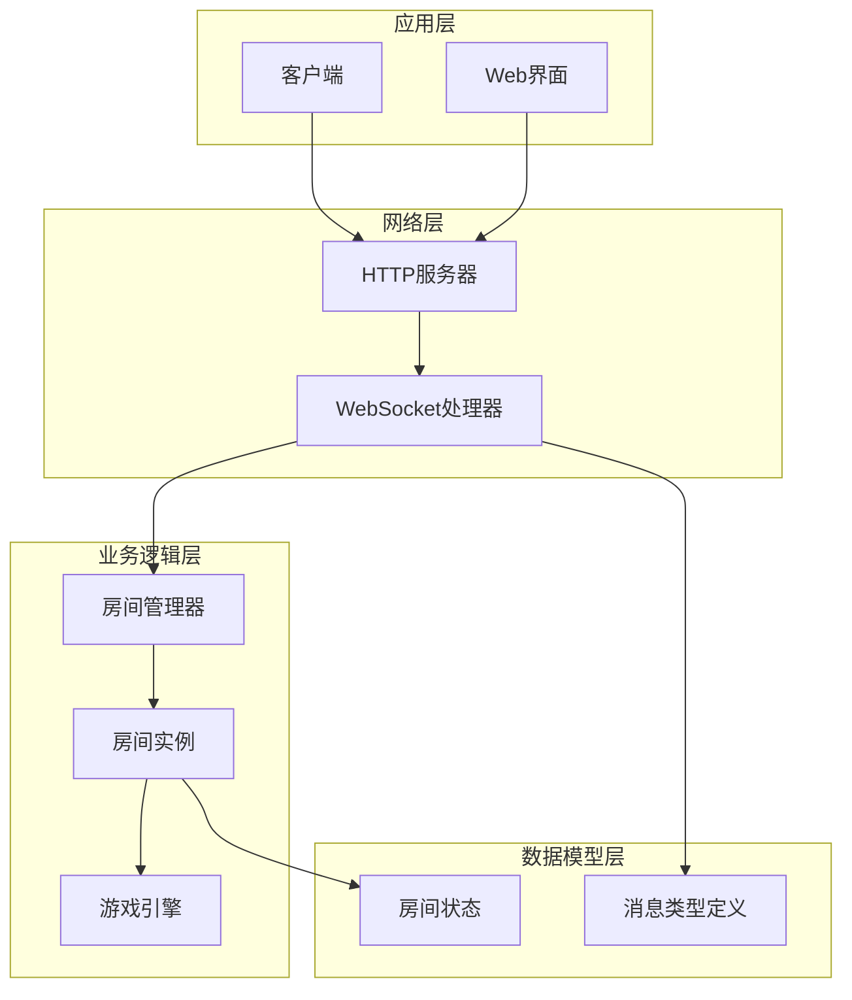
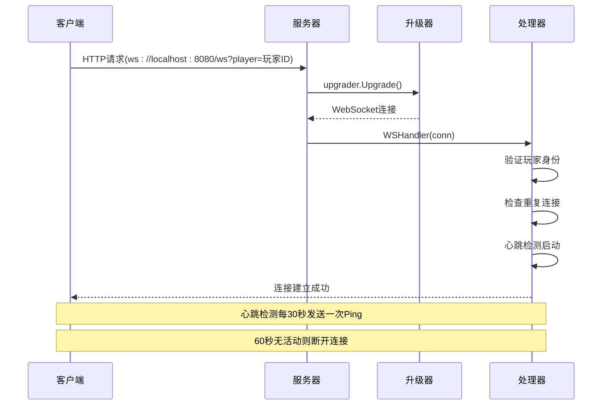
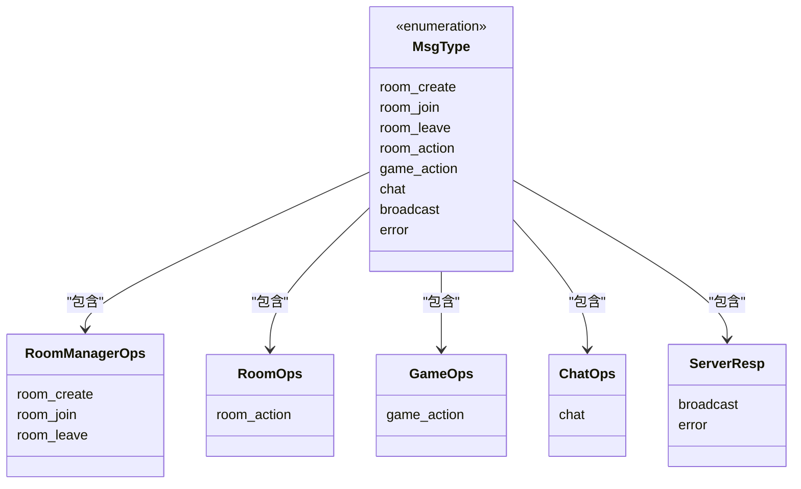
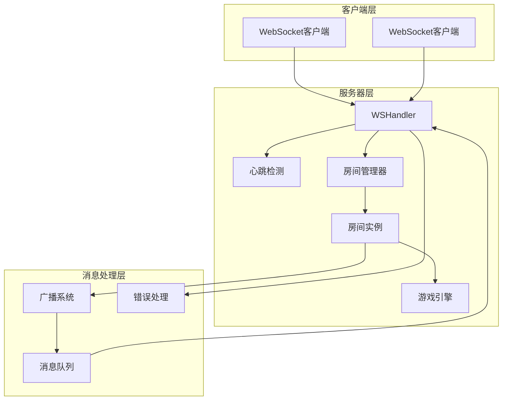
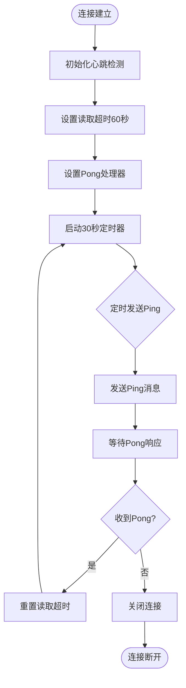
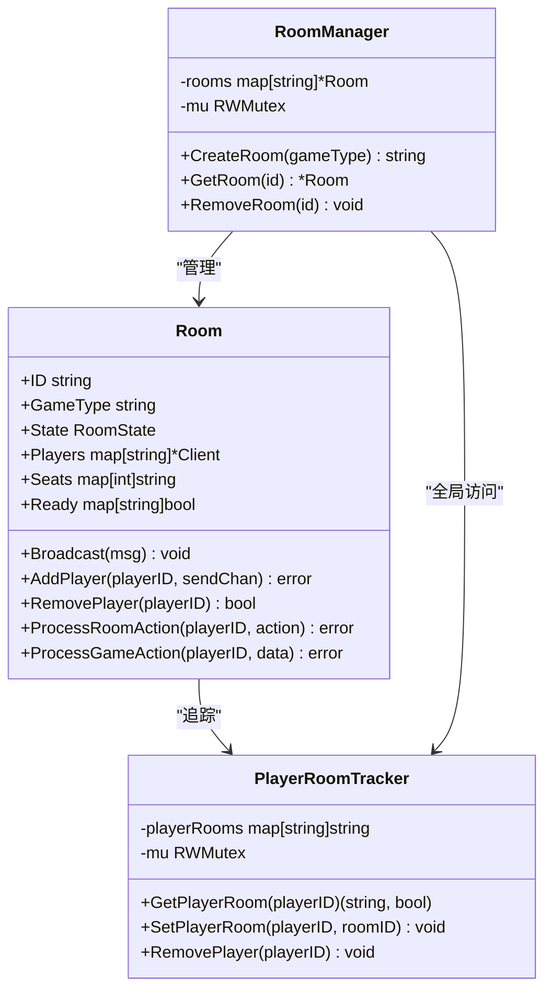
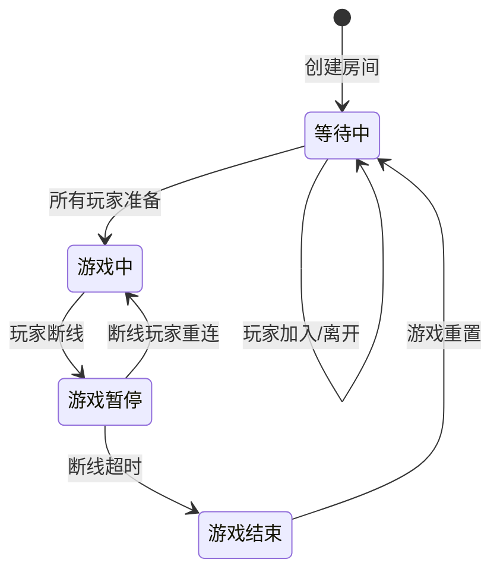
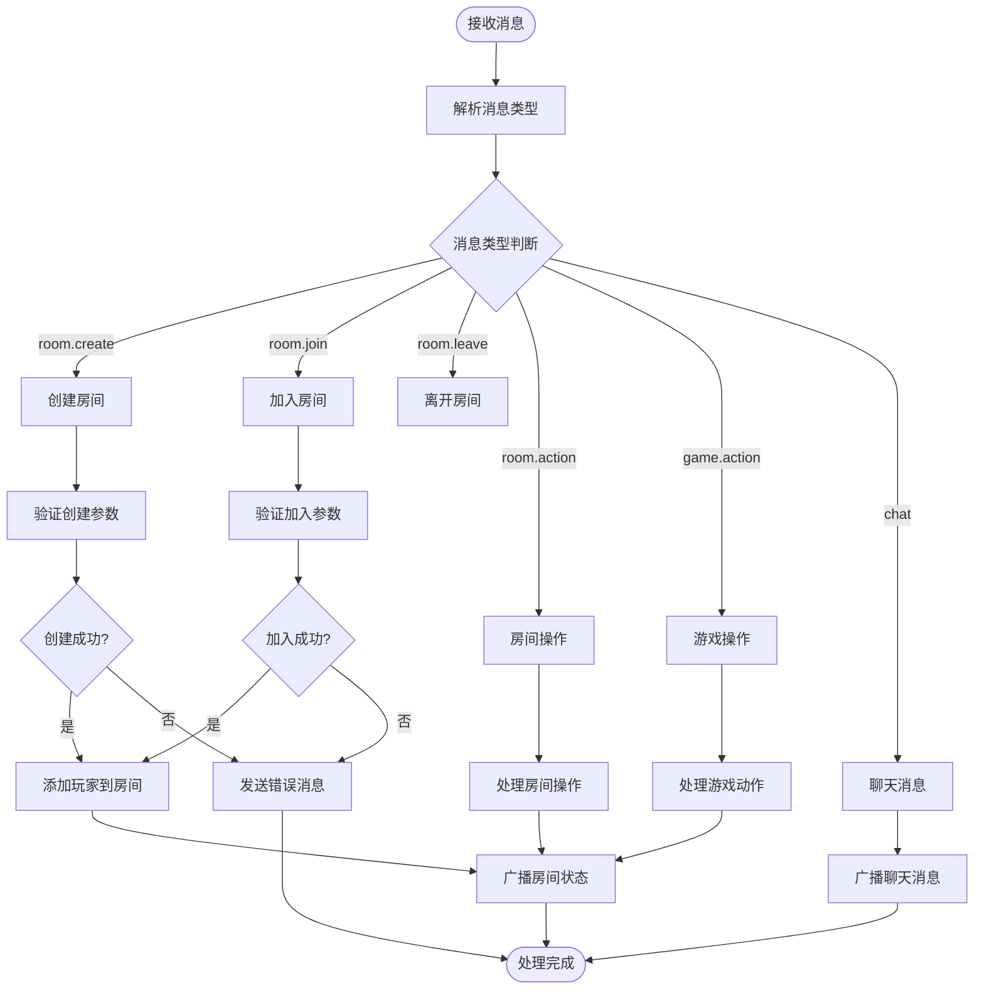
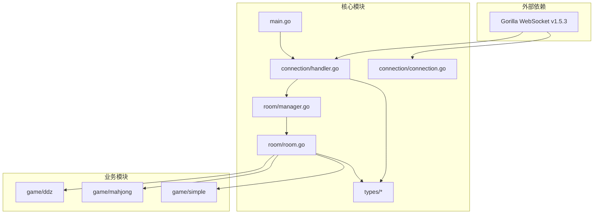

# WebSocket协议

<cite>
**本文档引用的文件**
- [main.go](file://main.go)
- [connection.go](file://internal/connection/connection.go)
- [handler.go](file://internal/connection/handler.go)
- [message.go](file://internal/types/message.go)
- [broadcast.go](file://internal/types/broadcast.go)
- [error.go](file://internal/types/error.go)
- [room_action.go](file://internal/types/room_action.go)
- [game_action.go](file://internal/types/game_action.go)
- [room_manager.go](file://internal/room/manager.go)
- [room.go](file://internal/room/room.go)
- [client.html](file://client.html)
</cite>

## 目录
1. [简介](#简介)
2. [项目结构](#项目结构)
3. [核心组件](#核心组件)
4. [架构概览](#架构概览)
5. [详细组件分析](#详细组件分析)
6. [依赖关系分析](#依赖关系分析)
7. [性能考虑](#性能考虑)
8. [故障排除指南](#故障排除指南)
9. [结论](#结论)

## 简介

本WebSocket协议文档详细说明了基于Go语言开发的卡牌游戏服务器的通信协议。该协议支持多人实时对战，包含房间管理、游戏逻辑处理、聊天功能等完整功能模块。协议采用JSON消息格式，通过统一的消息结构实现不同类型消息的标准化传输。

## 项目结构

项目采用分层架构设计，主要分为以下层次：



**图表来源**
- [main.go](file://main.go#L10-L14)
- [handler.go](file://internal/connection/handler.go#L19-L24)
- [room_manager.go](file://internal/room/manager.go#L47-L52)

**章节来源**
- [main.go](file://main.go#L1-L15)
- [handler.go](file://internal/connection/handler.go#L1-L18)

## 核心组件

### WebSocket连接建立流程

WebSocket连接通过HTTP升级建立，支持断线重连和心跳检测机制：



**图表来源**
- [handler.go](file://internal/connection/handler.go#L19-L24)
- [connection.go](file://internal/connection/connection.go#L34-L61)

### 统一消息结构Message

所有消息都遵循统一的Message结构：

| 字段名 | 类型 | 必填 | 描述 | 示例 |
|--------|------|------|------|------|
| type | MsgType | 是 | 消息类型枚举 | "room.create" |
| room_id | string | 否 | 房间ID，房间相关操作必需 | "room_123" |
| player_id | string | 否 | 玩家ID，服务器自动填充 | "player_abc" |
| data | interface{} | 否 | 消息载荷，根据type类型而定 | 见下表 |

**章节来源**
- [message.go](file://internal/types/message.go#L32-L38)

### 消息类型枚举MsgType

协议支持以下消息类型：



**图表来源**
- [message.go](file://internal/types/message.go#L16-L30)

**章节来源**
- [message.go](file://internal/types/message.go#L13-L30)

## 架构概览

系统采用事件驱动架构，通过消息队列实现异步处理：



**图表来源**
- [handler.go](file://internal/connection/handler.go#L95-L157)
- [room.go](file://internal/room/room.go#L98-L131)

## 详细组件分析

### 连接管理组件

连接管理负责WebSocket连接的生命周期管理：

```mermaid
classDiagram
class ConnectionManager {
-connectedPlayers map[string]bool
-connectedPlayersMu RWMutex
+isPlayerConnected(playerID) bool
+setPlayerConnected(playerID, connected) void
+heartbeat(conn, playerID) chan struct{}
}
class WSHandler {
-upgrader Upgrader
-playerID string
-currentRoomID string
-send chan Message
+WSHandler(w, r) void
+handleCreateRoom() void
+handleJoinRoom() void
+handleChat() void
+handleGameAction() void
+handleRoomAction() void
}
ConnectionManager --> WSHandler : "心跳检测"
WSHandler --> ConnectionManager : "连接状态管理"
```

**图表来源**
- [connection.go](file://internal/connection/connection.go#L10-L30)
- [handler.go](file://internal/connection/handler.go#L15-L28)

#### 心跳检测机制

心跳检测采用双向机制确保连接健康：



**图表来源**
- [connection.go](file://internal/connection/connection.go#L32-L61)

**章节来源**
- [connection.go](file://internal/connection/connection.go#L32-L61)

### 房间管理系统

房间管理器负责房间的创建、查找和销毁：



**图表来源**
- [room_manager.go](file://internal/room/manager.go#L47-L52)
- [room.go](file://internal/room/room.go#L14-L27)

#### 房间状态管理

房间状态机支持四种状态转换：



**图表来源**
- [message.go](file://internal/types/message.go#L6-L11)
- [room.go](file://internal/room/room.go#L134-L168)

**章节来源**
- [room_manager.go](file://internal/room/manager.go#L47-L83)
- [room.go](file://internal/room/room.go#L14-L27)

### 消息处理组件

消息处理器根据消息类型执行相应操作：



**图表来源**
- [handler.go](file://internal/connection/handler.go#L128-L156)
- [room.go](file://internal/room/room.go#L296-L316)

**章节来源**
- [handler.go](file://internal/connection/handler.go#L128-L156)

### 数据模型定义

#### 房间操作数据结构

| 数据类型 | 字段定义 | 用途 |
|----------|----------|------|
| RoomActionData | Action(RoomActionType), Data(interface{}) | 统一房间操作数据 |
| RoomActionReadyData | Ready(bool) | 准备/取消准备操作 |
| RoomActionSitData | SeatNumber(int) | 选择座位操作 |

#### 游戏动作数据结构

| 数据类型 | 字段定义 | 用途 |
|----------|----------|------|
| GameActionData | Action(GameActionType), Card(interface{}) | 统一游戏动作数据 |
| GameActionType | play_card, pass, call_landlord, discard, chow, pong, kong, win | 游戏动作枚举 |

#### 广播消息数据结构

| 数据类型 | 字段定义 | 用途 |
|----------|----------|------|
| BroadcastData | Event(Event), Content(interface{}) | 通用广播数据 |
| ChatContent | RoomID(string), PlayerID(string), Content(string) | 聊天广播内容 |
| RoomStateContent | RoomID(string), State(RoomState), Players([]PlayerSeatInfo), Message(string) | 房间状态广播内容 |

**章节来源**
- [message.go](file://internal/types/message.go#L52-L77)
- [broadcast.go](file://internal/types/broadcast.go#L17-L47)

## 依赖关系分析

系统各组件之间的依赖关系如下：



**图表来源**
- [main.go](file://main.go#L3-L8)
- [handler.go](file://internal/connection/handler.go#L3-L12)

**章节来源**
- [main.go](file://main.go#L1-L15)
- [handler.go](file://internal/connection/handler.go#L1-L13)

## 性能考虑

### 消息队列设计

系统采用带缓冲的消息队列确保消息处理的稳定性：

- **发送队列容量**: 256条消息，防止客户端拥堵影响服务器性能
- **广播队列容量**: 512条消息，支持大量玩家同时在线
- **非阻塞发送**: 使用select语句避免单个客户端阻塞影响整体性能

### 心跳检测优化

- **心跳间隔**: 30秒发送一次Ping，平衡网络负载和连接健康检测
- **超时时间**: 60秒无活动自动断开，及时清理僵尸连接
- **Pong处理**: 收到Pong后重置超时，确保活跃连接持续保持

### 房间管理优化

- **并发控制**: 使用RWMutex确保房间操作的线程安全
- **断线处理**: 30秒断线超时机制，避免长时间占用资源
- **内存管理**: 房间空闲时自动清理，释放系统资源

## 故障排除指南

### 常见错误类型

| 错误码 | 错误类型 | 可能原因 | 解决方案 |
|--------|----------|----------|----------|
| 400 | ErrInvalidDataCode | 消息格式错误或参数缺失 | 检查消息结构和必填字段 |
| 403 | ErrJoinFailedCode | 加入房间失败 | 确认房间存在且未满员 |
| 404 | ErrRoomNotFoundCode | 房间不存在 | 检查房间ID是否正确 |
| 409 | ErrAlreadyInRoomCode | 玩家已在房间中 | 先离开当前房间再加入 |
| 410 | ErrPlayerAlreadyConnectedCode | 玩家重复连接 | 检查连接状态，避免重复登录 |
| 411 | ErrPlayerNotInRoomCode | 玩家不在房间中 | 确认玩家已加入房间 |
| 500 | ErrInternalCode | 服务器内部错误 | 查看服务器日志获取详细信息 |

### 连接问题诊断

1. **连接失败**
   - 检查服务器是否正常运行
   - 验证URL路径 `/ws` 是否正确
   - 确认查询参数 `player` 是否包含有效玩家ID

2. **心跳超时**
   - 检查网络连接稳定性
   - 确认客户端能够正常接收Pong响应
   - 验证防火墙设置是否允许WebSocket通信

3. **断线重连**
   - 系统会自动检测断线状态
   - 重连时房间状态会恢复到断线前状态
   - 30秒超时后未重连将导致游戏结束

**章节来源**
- [error.go](file://internal/types/error.go#L3-L12)
- [handler.go](file://internal/connection/handler.go#L36-L44)

## 结论

本WebSocket协议设计实现了完整的实时对战游戏通信需求。通过统一的消息结构、清晰的状态管理和完善的错误处理机制，系统能够稳定支持多玩家在线对战。协议的关键优势包括：

- **标准化消息格式**: 统一的Message结构确保消息处理的一致性
- **完善的房间管理**: 支持房间创建、加入、离开等完整生命周期
- **健壮的心跳检测**: 60秒超时机制确保连接健康
- **优雅的断线处理**: 30秒断线超时和重连机制提升用户体验
- **扩展性强**: 支持多种游戏类型和消息类型的扩展

该协议为后续的功能扩展和性能优化提供了良好的基础架构。