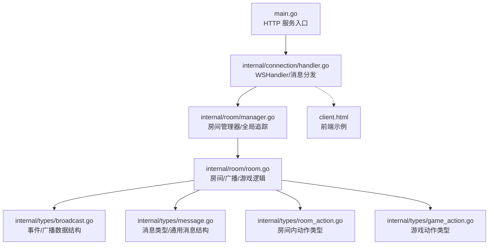
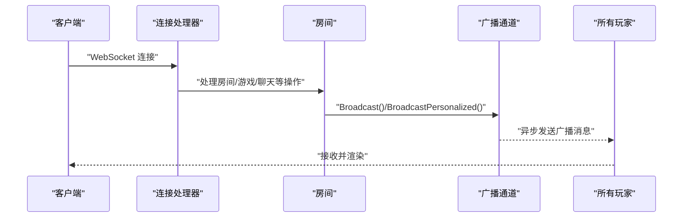
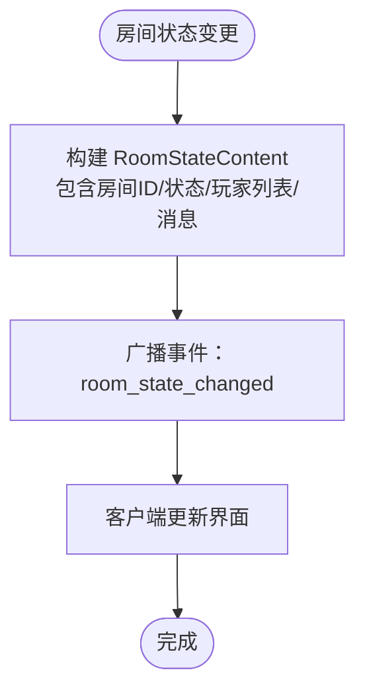
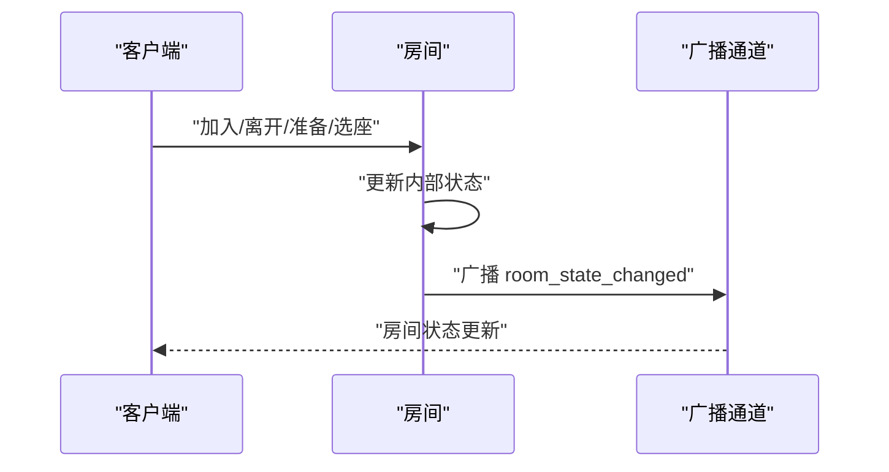
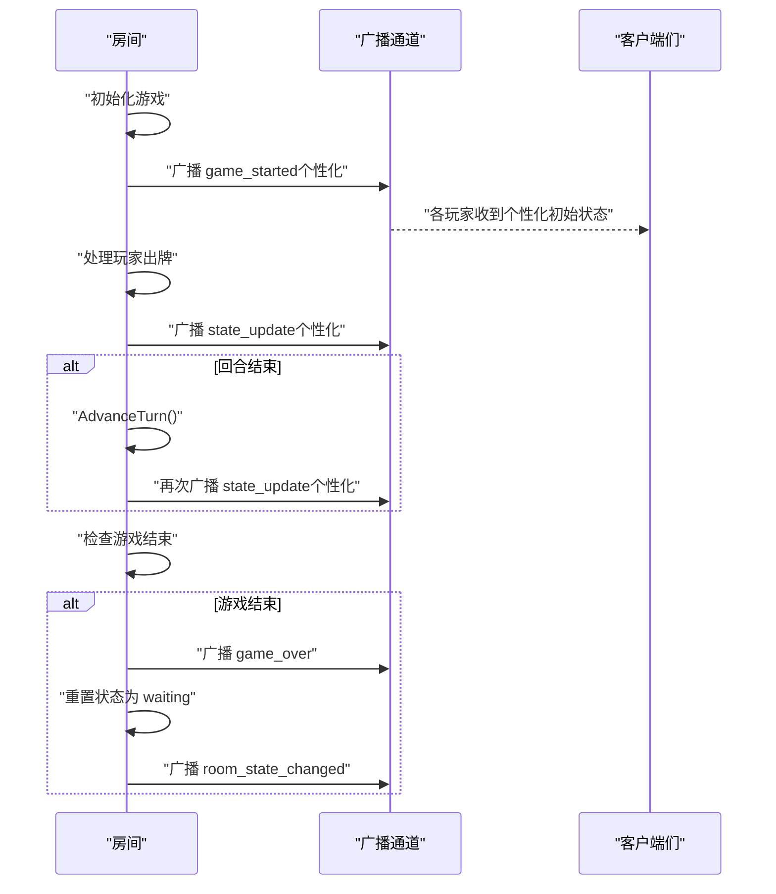
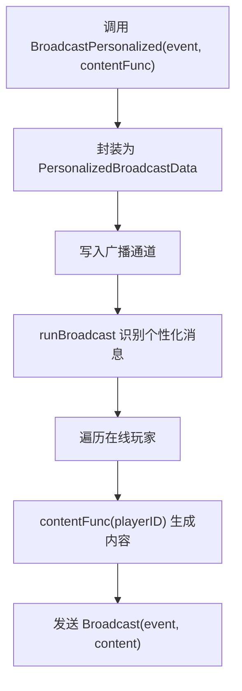
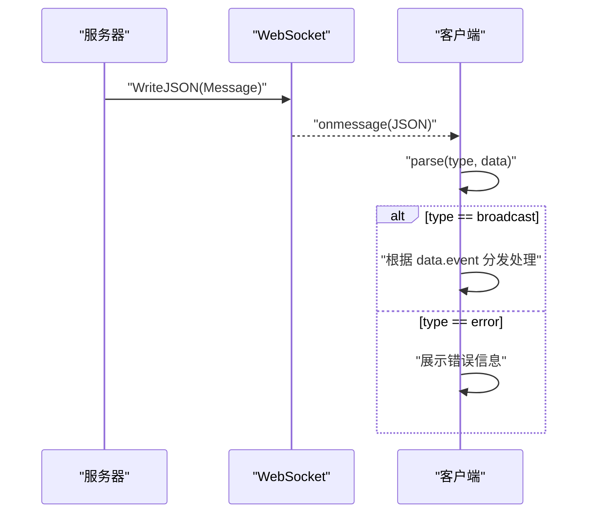
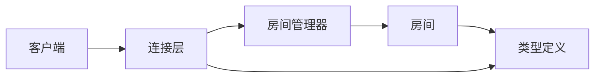

# 广播消息

<cite>
**本文引用的文件**
- [main.go](file://main.go)
- [internal/connection/handler.go](file://internal/connection/handler.go)
- [internal/room/room.go](file://internal/room/room.go)
- [internal/room/manager.go](file://internal/room/manager.go)
- [internal/types/broadcast.go](file://internal/types/broadcast.go)
- [internal/types/message.go](file://internal/types/message.go)
- [internal/types/room_action.go](file://internal/types/room_action.go)
- [internal/types/game_action.go](file://internal/types/game_action.go)
- [client.html](file://client.html)
</cite>

## 目录
1. [简介](#简介)
2. [项目结构](#项目结构)
3. [核心组件](#核心组件)
4. [架构总览](#架构总览)
5. [详细组件分析](#详细组件分析)
6. [依赖关系分析](#依赖关系分析)
7. [性能与网络传输考虑](#性能与网络传输考虑)
8. [故障排查指南](#故障排查指南)
9. [结论](#结论)
10. [附录](#附录)

## 简介
本文件系统性地文档化“广播消息（broadcast）”在卡牌游戏服务器中的使用方式与实现细节。重点覆盖以下方面：
- 广播消息类型与事件枚举
- 房间状态变化广播（waiting、playing、paused、gameover）
- 玩家操作结果广播（加入、离开、准备状态变化等）
- 游戏进程广播（开始、回合切换、胜负结果等）
- 个性化广播机制（私信、特定玩家状态更新等定向消息）
- 广播消息的序列化格式与接收处理流程
- 性能优化建议与网络传输注意事项

## 项目结构
围绕广播消息的关键模块与文件如下：
- 服务器入口与路由：main.go
- WebSocket 连接与消息分发：internal/connection/handler.go
- 房间与广播实现：internal/room/room.go
- 房间管理器与全局追踪：internal/room/manager.go
- 广播与消息类型定义：internal/types/broadcast.go、internal/types/message.go
- 房间内与游戏动作类型：internal/types/room_action.go、internal/types/game_action.go
- 示例前端客户端：client.html



图表来源
- [main.go](file://main.go#L10-L14)
- [internal/connection/handler.go](file://internal/connection/handler.go#L19-L158)
- [internal/room/room.go](file://internal/room/room.go#L35-L57)
- [internal/room/manager.go](file://internal/room/manager.go#L47-L52)
- [internal/types/broadcast.go](file://internal/types/broadcast.go#L17-L47)
- [internal/types/message.go](file://internal/types/message.go#L32-L77)
- [internal/types/room_action.go](file://internal/types/room_action.go#L3-L9)
- [internal/types/game_action.go](file://internal/types/game_action.go#L3-L18)
- [client.html](file://client.html#L134-L208)

章节来源
- [main.go](file://main.go#L10-L14)
- [internal/connection/handler.go](file://internal/connection/handler.go#L19-L158)
- [internal/room/room.go](file://internal/room/room.go#L35-L57)
- [internal/room/manager.go](file://internal/room/manager.go#L47-L52)
- [internal/types/broadcast.go](file://internal/types/broadcast.go#L17-L47)
- [internal/types/message.go](file://internal/types/message.go#L32-L77)
- [internal/types/room_action.go](file://internal/types/room_action.go#L3-L9)
- [internal/types/game_action.go](file://internal/types/game_action.go#L3-L18)
- [client.html](file://client.html#L134-L208)

## 核心组件
- 广播事件枚举与数据结构
  - 事件类型：房间状态变化、游戏开始、游戏结束、状态更新、聊天
  - 广播数据结构：包含事件名与内容
  - 个性化广播：按玩家生成差异化内容
- 房间广播实现
  - 普通广播：向所有在线玩家发送
  - 个性化广播：针对每个玩家生成专属内容
  - 广播通道与异步发送，保证消息顺序与可靠性
- 连接层消息分发
  - WebSocket 接入、心跳、消息解析与错误返回
  - 将聊天消息转换为广播事件
- 房间状态与游戏流程
  - 房间状态机：waiting、playing、paused、gameover
  - 玩家加入/离开/准备/选座触发房间状态广播
  - 游戏开始、回合切换、胜负结果触发相应广播

章节来源
- [internal/types/broadcast.go](file://internal/types/broadcast.go#L3-L15)
- [internal/types/broadcast.go](file://internal/types/broadcast.go#L17-L47)
- [internal/room/room.go](file://internal/room/room.go#L98-L131)
- [internal/room/room.go](file://internal/room/room.go#L568-L656)
- [internal/connection/handler.go](file://internal/connection/handler.go#L284-L333)

## 架构总览
广播消息在系统中的流转路径如下：
- 客户端通过 WebSocket 连接服务器
- 服务器根据消息类型分发至房间或游戏逻辑
- 房间根据业务事件构造广播消息并通过广播通道异步发送
- 客户端接收广播消息并渲染界面



图表来源
- [internal/connection/handler.go](file://internal/connection/handler.go#L19-L158)
- [internal/room/room.go](file://internal/room/room.go#L98-L131)
- [internal/room/room.go](file://internal/room/room.go#L568-L656)

## 详细组件分析

### 广播事件与数据模型
- 事件枚举
  - 房间级别：房间状态变化
  - 游戏级别：游戏开始、游戏结束、状态更新
  - 聊天：聊天消息
- 广播数据结构
  - 包含事件名与内容
  - 个性化广播通过函数延迟生成内容
- 聊天内容结构
  - 包含房间号、玩家ID、消息内容

```mermaid
classDiagram
class BroadcastData {
+Event
+Content
}
class PersonalizedBroadcastData {
+Event
+ContentFunc(playerID) interface{}
}
class ChatContent {
+RoomID
+PlayerID
+Content
}
BroadcastData --> ChatContent : "Content 可为聊天内容"
PersonalizedBroadcastData --> BroadcastData : "用于个性化广播"
```

图表来源
- [internal/types/broadcast.go](file://internal/types/broadcast.go#L17-L32)
- [internal/types/broadcast.go](file://internal/types/broadcast.go#L22-L26)
- [internal/types/broadcast.go](file://internal/types/broadcast.go#L28-L32)

章节来源
- [internal/types/broadcast.go](file://internal/types/broadcast.go#L3-L15)
- [internal/types/broadcast.go](file://internal/types/broadcast.go#L17-L47)

### 房间状态变化广播
- 触发时机
  - 玩家加入/离开
  - 准备/取消准备
  - 选座
  - 断线/重连
  - 游戏暂停/恢复/结束
- 广播内容
  - 房间ID、当前状态、在线玩家列表（含座位号与准备状态）、附加消息
- 关键实现点
  - 房间状态变更时构建 RoomStateContent 并广播
  - 断线时将状态切换为 paused 并广播暂停消息
  - 重连成功后恢复状态并广播



图表来源
- [internal/room/room.go](file://internal/room/room.go#L404-L459)
- [internal/room/room.go](file://internal/room/room.go#L133-L168)
- [internal/room/room.go](file://internal/room/room.go#L222-L257)

章节来源
- [internal/room/room.go](file://internal/room/room.go#L92-L96)
- [internal/room/room.go](file://internal/room/room.go#L318-L348)
- [internal/room/room.go](file://internal/room/room.go#L350-L388)
- [internal/room/room.go](file://internal/room/room.go#L404-L459)
- [internal/room/room.go](file://internal/room/room.go#L133-L168)
- [internal/room/room.go](file://internal/room/room.go#L222-L257)

### 玩家操作结果广播
- 加入房间
  - 成功加入后广播房间状态变化，包含“玩家加入”消息
- 离开房间
  - 正常离开时广播房间状态变化，包含“玩家离开”消息
- 准备状态变化
  - 准备/取消准备时广播房间状态变化，包含对应消息
- 选座
  - 更换座位时广播房间状态变化，包含“选择座位”消息
- 断线与重连
  - 断线时暂停游戏并广播；重连成功后恢复并广播



图表来源
- [internal/room/room.go](file://internal/room/room.go#L92-L96)
- [internal/room/room.go](file://internal/room/room.go#L259-L294)
- [internal/room/room.go](file://internal/room/room.go#L318-L348)
- [internal/room/room.go](file://internal/room/room.go#L350-L388)
- [internal/room/room.go](file://internal/room/room.go#L133-L168)

章节来源
- [internal/room/room.go](file://internal/room/room.go#L92-L96)
- [internal/room/room.go](file://internal/room/room.go#L259-L294)
- [internal/room/room.go](file://internal/room/room.go#L318-L348)
- [internal/room/room.go](file://internal/room/room.go#L350-L388)

### 游戏进程广播
- 游戏开始
  - 所有玩家准备后自动开始，广播 game_started，并携带个性化初始状态
- 回合切换
  - 出牌后立即广播 state_update；若回合结束则再次广播
- 胜负结果
  - 游戏结束后广播 game_over，随后房间回到 waiting 并广播房间状态变化



图表来源
- [internal/room/room.go](file://internal/room/room.go#L540-L566)
- [internal/room/room.go](file://internal/room/room.go#L525-L538)
- [internal/room/room.go](file://internal/room/room.go#L461-L523)

章节来源
- [internal/room/room.go](file://internal/room/room.go#L540-L566)
- [internal/room/room.go](file://internal/room/room.go#L525-L538)
- [internal/room/room.go](file://internal/room/room.go#L461-L523)

### 个性化广播机制
- 适用场景
  - 私信：通过聊天事件广播
  - 特定玩家状态更新：如游戏开始、状态更新时按玩家生成专属内容
- 实现方式
  - BroadcastPersonalized 接收事件与内容生成函数
  - runBroadcast 识别个性化消息，逐个玩家调用生成函数并发送
- 注意事项
  - 个性化消息不会发送给断线玩家
  - 非阻塞发送，避免单个客户端阻塞影响整体广播



图表来源
- [internal/room/room.go](file://internal/room/room.go#L109-L131)
- [internal/room/room.go](file://internal/room/room.go#L614-L656)

章节来源
- [internal/room/room.go](file://internal/room/room.go#L109-L131)
- [internal/room/room.go](file://internal/room/room.go#L614-L656)

### 广播消息序列化与接收处理
- 服务器侧
  - 广播消息统一为 types.Message，包含 type、room_id、player_id、data
  - data 为 types.BroadcastData 或 types.PersonalizedBroadcastData
  - 通过 WebSocket 连接异步发送
- 客户端侧
  - 监听 WebSocket 消息，区分 error 与 broadcast
  - 根据 data.event 分发到对应处理逻辑（房间状态、聊天、游戏状态、胜负结果）



图表来源
- [internal/types/message.go](file://internal/types/message.go#L32-L38)
- [internal/connection/handler.go](file://internal/connection/handler.go#L431-L435)
- [client.html](file://client.html#L145-L208)

章节来源
- [internal/types/message.go](file://internal/types/message.go#L32-L38)
- [internal/connection/handler.go](file://internal/connection/handler.go#L431-L435)
- [client.html](file://client.html#L145-L208)

## 依赖关系分析
- 连接层依赖房间管理器与房间对象，负责消息解析与错误返回
- 房间对象维护广播通道与玩家集合，负责状态机与广播
- 类型定义模块提供事件、消息、动作等基础结构



图表来源
- [internal/connection/handler.go](file://internal/connection/handler.go#L19-L158)
- [internal/room/manager.go](file://internal/room/manager.go#L47-L52)
- [internal/room/room.go](file://internal/room/room.go#L35-L57)
- [internal/types/broadcast.go](file://internal/types/broadcast.go#L17-L47)
- [internal/types/message.go](file://internal/types/message.go#L32-L77)

章节来源
- [internal/connection/handler.go](file://internal/connection/handler.go#L19-L158)
- [internal/room/manager.go](file://internal/room/manager.go#L47-L52)
- [internal/room/room.go](file://internal/room/room.go#L35-L57)
- [internal/types/broadcast.go](file://internal/types/broadcast.go#L17-L47)
- [internal/types/message.go](file://internal/types/message.go#L32-L77)

## 性能与网络传输考虑
- 广播通道容量与异步发送
  - 房间广播通道容量较大，减少阻塞风险
  - 异步发送避免阻塞主线程
- 非阻塞发送与丢弃策略
  - 广播通道采用非阻塞发送，当队列满时丢弃，避免影响其他玩家
- 个性化广播的延迟计算
  - 按玩家生成内容，避免重复序列化
- 防抖与断线处理
  - 游戏动作防抖（短时间重复操作去重）
  - 断线暂停与超时处理，保障公平性
- 建议
  - 控制广播内容大小，优先发送必要字段
  - 对高频事件合并或节流
  - 客户端侧对消息队列进行背压处理

章节来源
- [internal/room/room.go](file://internal/room/room.go#L44-L46)
- [internal/room/room.go](file://internal/room/room.go#L568-L656)
- [internal/room/room.go](file://internal/room/room.go#L476-L482)
- [internal/room/room.go](file://internal/room/room.go#L161-L168)

## 故障排查指南
- 常见问题
  - 消息格式错误：客户端发送的数据不符合预期，服务器返回 error
  - 玩家不在房间：执行房间/游戏操作前需校验房间归属
  - 房间不存在：加入房间时房间ID无效
  - 游戏暂停：断线导致游戏暂停，等待重连
- 定位方法
  - 查看服务器日志中的广播发送与丢弃警告
  - 检查广播通道是否关闭或队列溢出
  - 确认房间状态与玩家状态一致性

章节来源
- [internal/connection/handler.go](file://internal/connection/handler.go#L423-L429)
- [internal/connection/handler.go](file://internal/connection/handler.go#L284-L333)
- [internal/connection/handler.go](file://internal/connection/handler.go#L335-L381)
- [internal/connection/handler.go](file://internal/connection/handler.go#L383-L421)
- [internal/room/room.go](file://internal/room/room.go#L568-L656)

## 结论
本系统通过统一的广播事件与数据结构，实现了房间状态、玩家操作与游戏进程的完整信息同步。房间级与游戏级广播配合个性化广播，既保证了全局一致性，又兼顾了玩家体验。结合异步广播与防抖、断线处理等机制，系统在复杂状态下仍保持稳定与高效。

## 附录
- 事件与消息类型参考
  - 事件：房间状态变化、游戏开始、游戏结束、状态更新、聊天
  - 消息类型：房间管理、房间内操作、游戏动作、聊天、广播、错误
- 前端对接要点
  - 监听 broadcast 事件，按 event 分发处理
  - 错误类型统一处理，提示用户

章节来源
- [internal/types/broadcast.go](file://internal/types/broadcast.go#L3-L15)
- [internal/types/message.go](file://internal/types/message.go#L13-L30)
- [client.html](file://client.html#L153-L208)