# 房间操作API

<cite>
**本文档引用的文件**
- [message.go](file://internal/types/message.go)
- [room_action.go](file://internal/types/room_action.go)
- [broadcast.go](file://internal/types/broadcast.go)
- [error.go](file://internal/types/error.go)
- [room.go](file://internal/room/room.go)
- [manager.go](file://internal/room/manager.go)
- [handler.go](file://internal/connection/handler.go)
- [factory.go](file://internal/game/factory.go)
- [game.go](file://internal/game/interfaces/game.go)
- [simple.go](file://internal/game/simple/game.go)
- [README.md](file://README.md)
</cite>

## 目录
1. [简介](#简介)
2. [项目结构](#项目结构)
3. [核心组件](#核心组件)
4. [架构概览](#架构概览)
5. [详细组件分析](#详细组件分析)
6. [依赖关系分析](#依赖关系分析)
7. [性能考虑](#性能考虑)
8. [故障排除指南](#故障排除指南)
9. [结论](#结论)

## 简介

房间操作API是卡牌游戏服务器的核心通信协议，负责管理房间生命周期、玩家交互和游戏状态同步。该API基于WebSocket协议，采用统一的消息格式，支持多种游戏类型的房间管理功能。

## 项目结构

卡牌游戏服务器采用模块化架构设计，主要包含以下核心模块：

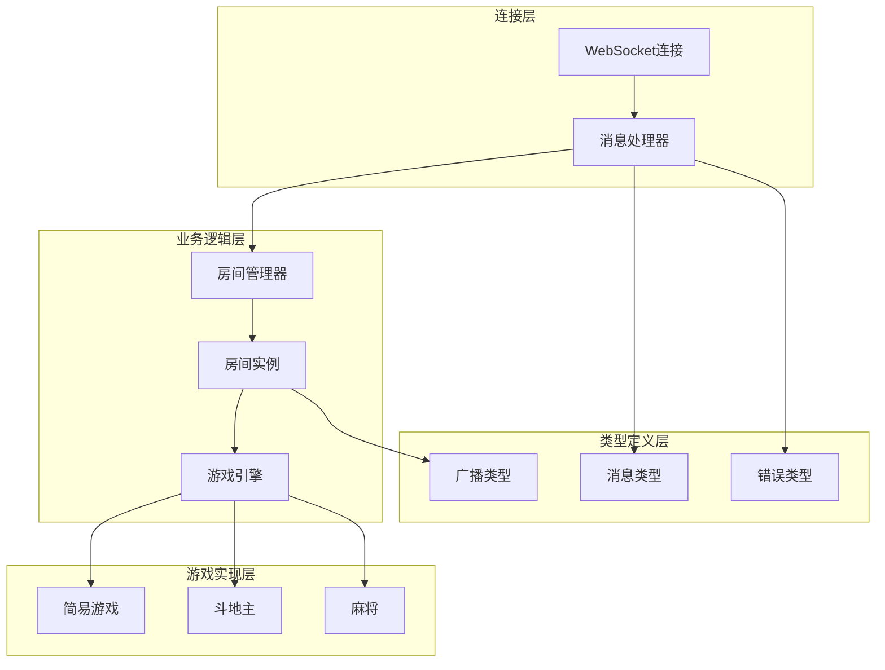

**图表来源**
- [handler.go](file://internal/connection/handler.go#L1-L50)
- [room.go](file://internal/room/room.go#L1-L30)
- [manager.go](file://internal/room/manager.go#L47-L53)

**章节来源**
- [README.md](file://README.md#L20-L50)
- [handler.go](file://internal/connection/handler.go#L1-L50)

## 核心组件

### 消息类型系统

系统定义了统一的消息结构，支持多种消息类型的扩展：

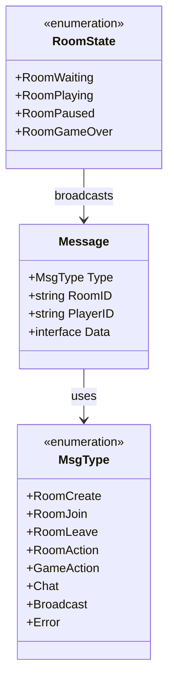

**图表来源**
- [message.go](file://internal/types/message.go#L13-L30)
- [message.go](file://internal/types/message.go#L3-L11)

### 房间管理器

房间管理器负责全局房间的创建、查找和销毁：

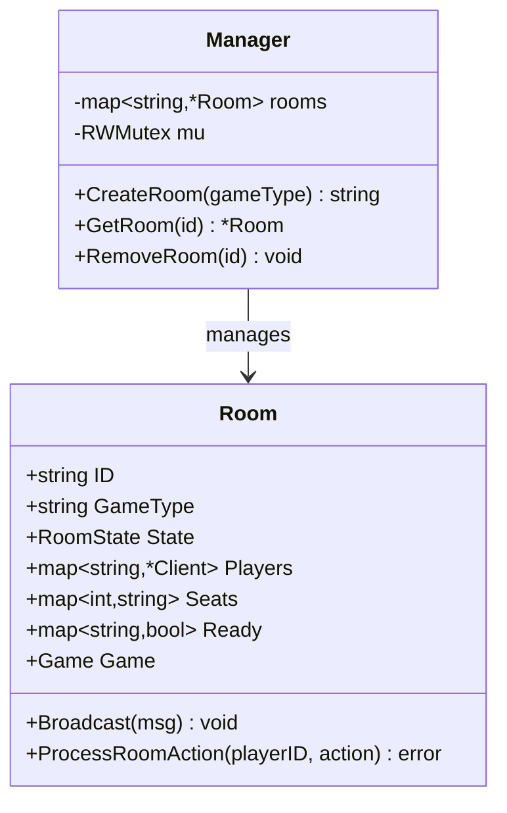

**图表来源**
- [manager.go](file://internal/room/manager.go#L47-L83)
- [room.go](file://internal/room/room.go#L14-L27)

**章节来源**
- [message.go](file://internal/types/message.go#L13-L30)
- [manager.go](file://internal/room/manager.go#L47-L83)
- [room.go](file://internal/room/room.go#L14-L27)

## 架构概览

系统采用分层架构，通过WebSocket实现客户端与服务器的实时通信：

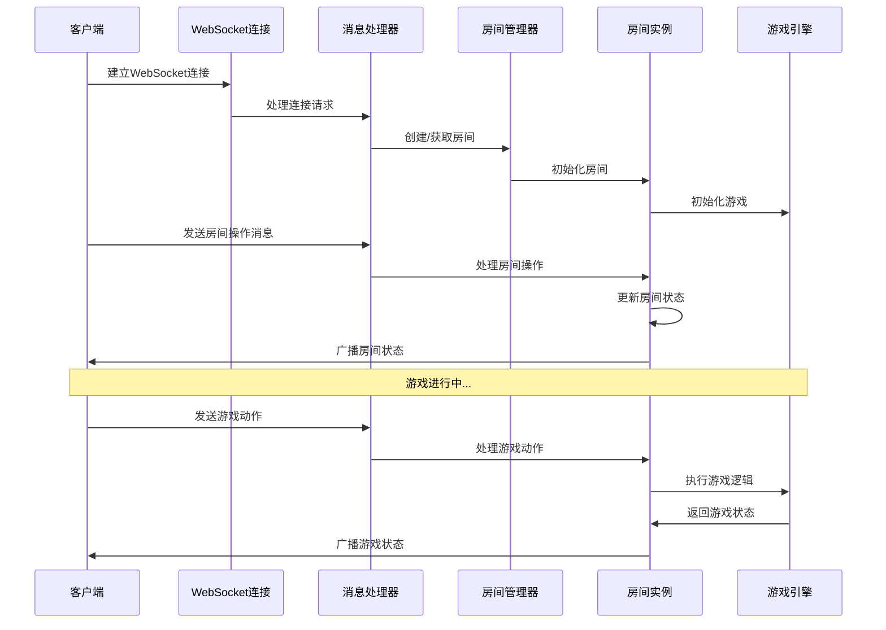

**图表来源**
- [handler.go](file://internal/connection/handler.go#L19-L158)
- [room.go](file://internal/room/room.go#L296-L316)

## 详细组件分析

### 房间创建消息 (room.create)

房间创建消息用于创建新的游戏房间，支持多种游戏类型。

#### 请求格式

| 字段名 | 类型 | 必填 | 描述 | 约束条件 |
|--------|------|------|------|----------|
| type | string | 是 | 消息类型 | 必须为 "room.create" |
| data | object | 是 | 创建数据 | 包含 game_type 字段 |
| data.game_type | string | 是 | 游戏类型 | 必须为 "simple"、"ddz" 或 "mahjong" |

#### 游戏类型取值范围

系统支持以下三种游戏类型：

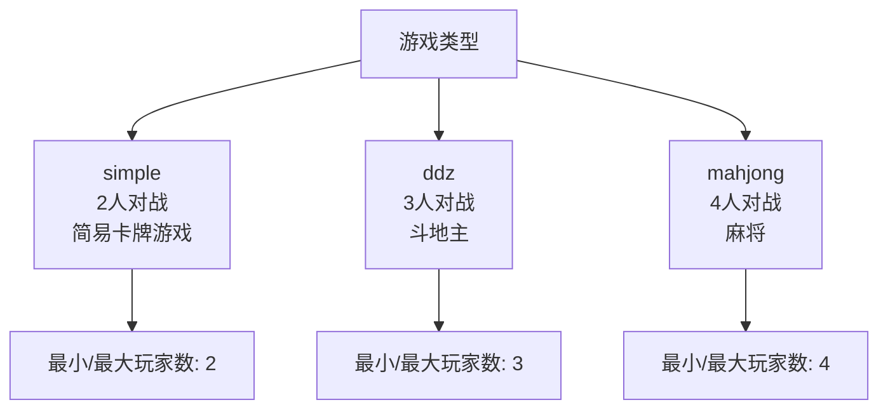

**图表来源**
- [factory.go](file://internal/game/factory.go#L11-L23)
- [simple.go](file://internal/game/simple/game.go#L21-L22)

#### 处理流程

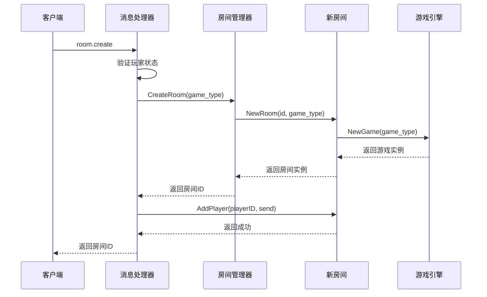

**图表来源**
- [handler.go](file://internal/connection/handler.go#L160-L221)
- [manager.go](file://internal/room/manager.go#L54-L64)

**章节来源**
- [message.go](file://internal/types/message.go#L40-L42)
- [handler.go](file://internal/connection/handler.go#L160-L221)
- [factory.go](file://internal/game/factory.go#L11-L23)

### 房间加入消息 (room.join)

房间加入消息用于现有玩家加入指定房间。

#### 请求格式

| 字段名 | 类型 | 必填 | 描述 | 约束条件 |
|--------|------|------|------|----------|
| type | string | 是 | 消息类型 | 必须为 "room.join" |
| room_id | string | 是 | 房间标识符 | 必须存在且有效 |
| data | object | 是 | 加入数据 | 包含 room_id 字段 |
| data.room_id | string | 是 | 房间ID | 必须存在且有效 |

#### 有效性验证

房间ID验证流程如下：

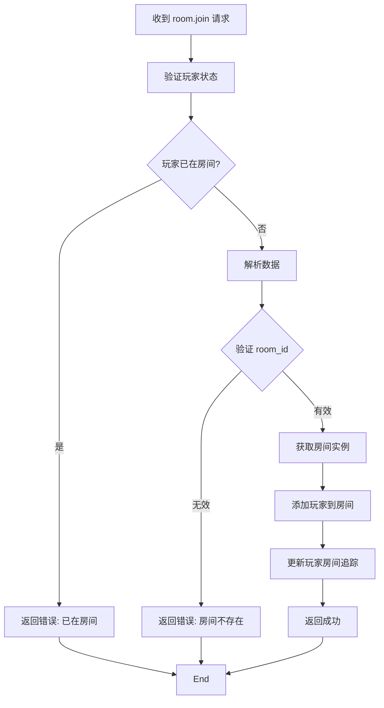

**图表来源**
- [handler.go](file://internal/connection/handler.go#L223-L282)

**章节来源**
- [message.go](file://internal/types/message.go#L44-L46)
- [handler.go](file://internal/connection/handler.go#L223-L282)

### 房间离开消息 (room.leave)

房间离开消息用于玩家主动离开房间。

#### 处理流程

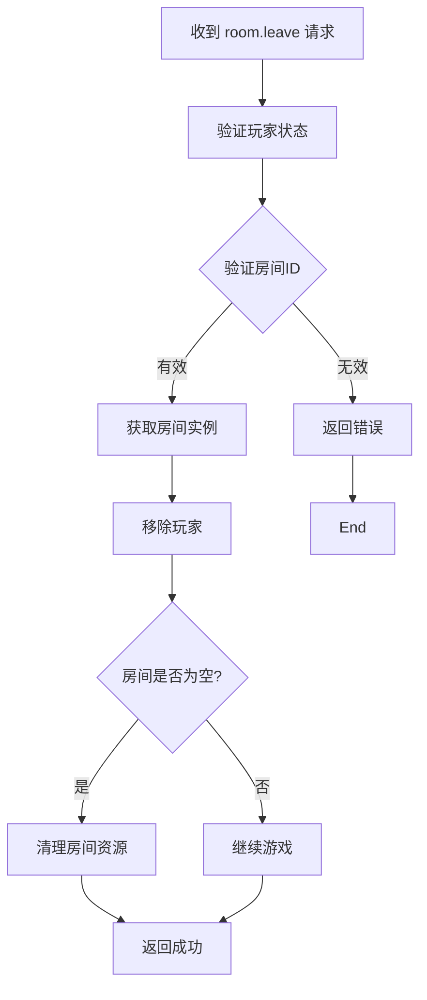

**图表来源**
- [room.go](file://internal/room/room.go#L259-L294)

**章节来源**
- [room.go](file://internal/room/room.go#L259-L294)

### 房间内操作消息 (room.action)

房间内操作消息用于处理房间内的各种操作，包括准备和选座。

#### 统一数据结构

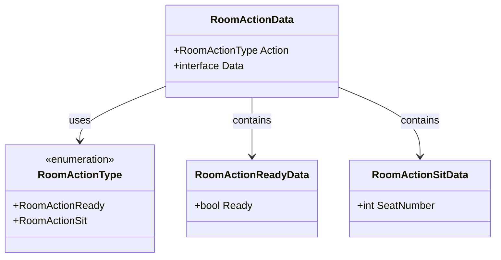

**图表来源**
- [message.go](file://internal/types/message.go#L58-L72)
- [room_action.go](file://internal/types/room_action.go#L3-L9)

#### 准备操作 (ready)

准备操作用于玩家标记自己的准备状态：

| 字段名 | 类型 | 必填 | 描述 | 约束条件 |
|--------|------|------|------|----------|
| action | string | 是 | 操作类型 | 必须为 "ready" |
| data.ready | bool | 是 | 准备状态 | true=准备, false=取消准备 |

#### 选座操作 (sit)

选座操作用于玩家选择座位：

| 字段名 | 类型 | 必填 | 描述 | 约束条件 |
|--------|------|------|------|----------|
| action | string | 是 | 操作类型 | 必须为 "sit" |
| data.seat_number | int | 是 | 座位号 | 必须在 0..(MaxPlayers-1) 范围内 |

#### 处理流程

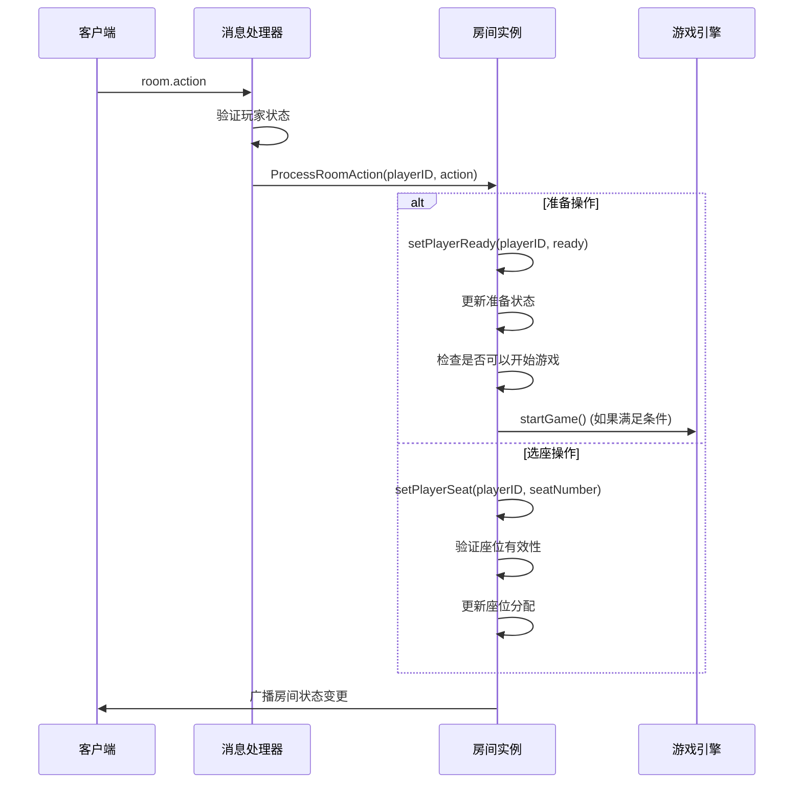

**图表来源**
- [handler.go](file://internal/connection/handler.go#L383-L421)
- [room.go](file://internal/room/room.go#L296-L316)

**章节来源**
- [message.go](file://internal/types/message.go#L58-L72)
- [room_action.go](file://internal/types/room_action.go#L3-L9)
- [room.go](file://internal/room/room.go#L296-L388)

## 依赖关系分析

系统各组件之间的依赖关系如下：

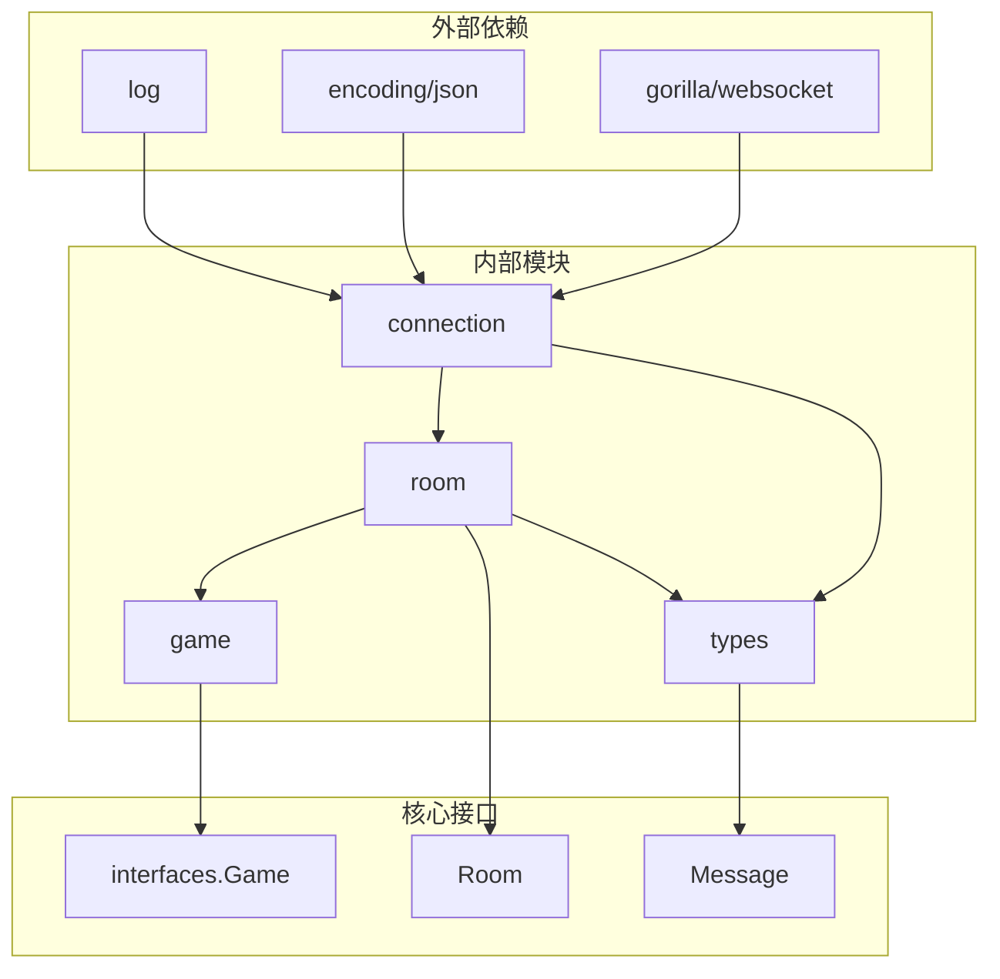

**图表来源**
- [handler.go](file://internal/connection/handler.go#L3-L13)
- [room.go](file://internal/room/room.go#L3-L12)

**章节来源**
- [handler.go](file://internal/connection/handler.go#L3-L13)
- [room.go](file://internal/room/room.go#L3-L12)

## 性能考虑

### 广播机制优化

系统采用异步广播机制，通过通道缓冲区避免阻塞：

- **广播通道缓冲**: 512个消息缓冲，防止大量玩家同时接收消息时的阻塞
- **个性化广播**: 使用函数式编程模式，按玩家生成个性化内容
- **消息队列管理**: 每个玩家256个消息缓冲，防止客户端慢导致的内存泄漏

### 错误处理策略

系统实现了多层次的错误处理机制：

- **输入验证**: 所有消息在处理前进行严格的类型和格式验证
- **状态检查**: 每个操作都会检查当前房间状态和玩家状态
- **资源清理**: 连接断开时自动清理房间资源和玩家追踪信息

## 故障排除指南

### 常见错误类型

系统定义了标准的错误码和错误消息：

| 错误码 | 错误类型 | 描述 | 常见原因 |
|--------|----------|------|----------|
| 400 | ErrInvalidDataCode | 数据格式错误 | JSON解析失败或字段缺失 |
| 403 | ErrJoinFailedCode | 加入房间失败 | 房间已满或游戏进行中 |
| 404 | ErrRoomNotFoundCode | 房间不存在 | 房间ID无效或已被销毁 |
| 409 | ErrAlreadyInRoomCode | 玩家已在房间中 | 同一玩家多次连接 |
| 410 | ErrPlayerAlreadyConnectedCode | 玩家已连接 | 重复连接同一玩家ID |
| 411 | ErrPlayerNotInRoomCode | 玩家不在房间中 | 操作时玩家已离开房间 |
| 500 | ErrInternalCode | 内部错误 | 服务器异常或游戏引擎错误 |

### 错误处理流程

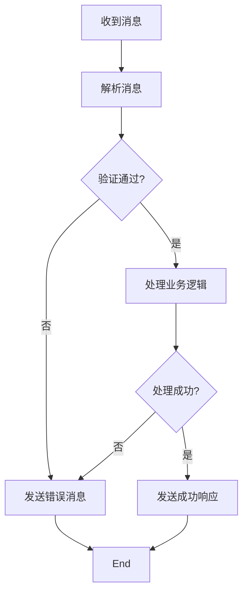

**图表来源**
- [handler.go](file://internal/connection/handler.go#L423-L429)

**章节来源**
- [error.go](file://internal/types/error.go#L3-L12)
- [handler.go](file://internal/connection/handler.go#L423-L429)

## 结论

房间操作API提供了完整的房间管理功能，支持多种游戏类型和复杂的房间状态管理。系统采用模块化设计，具有良好的扩展性和维护性。通过统一的消息格式和严格的错误处理机制，确保了系统的稳定性和可靠性。

主要特点包括：
- **灵活的游戏类型支持**: 通过工厂模式支持多种游戏类型
- **完善的房间状态管理**: 支持等待、游戏中、暂停、结束等状态
- **实时通信保障**: 基于WebSocket的双向通信
- **健壮的错误处理**: 标准化的错误码和错误消息
- **高效的广播机制**: 异步广播确保消息及时送达

该API为卡牌游戏的开发提供了坚实的基础，可以根据需要进一步扩展更多游戏类型和功能特性。