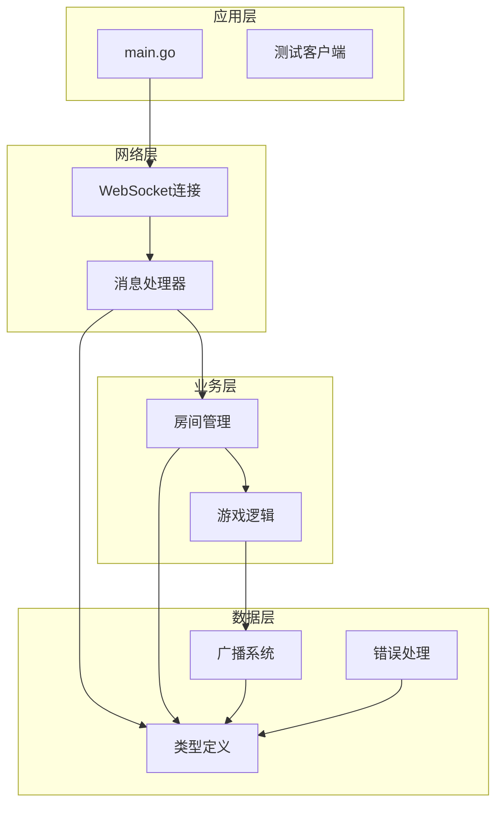
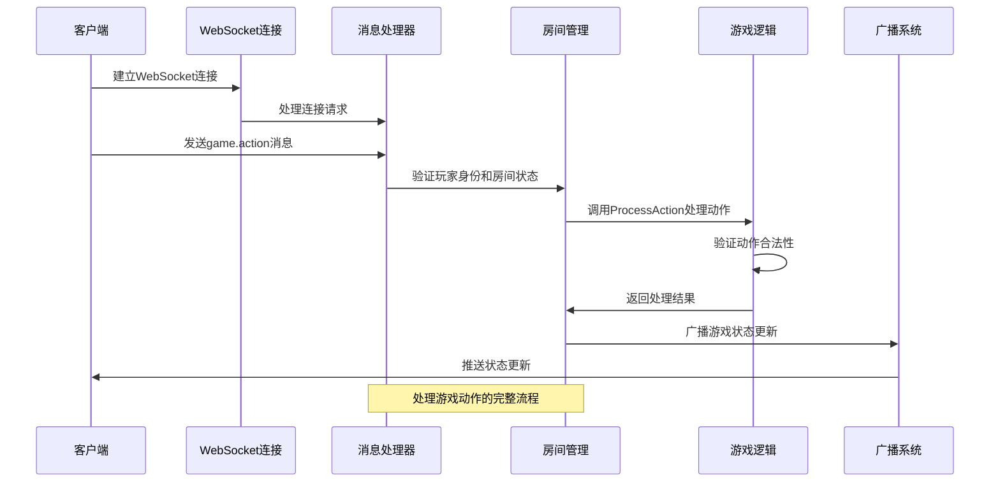
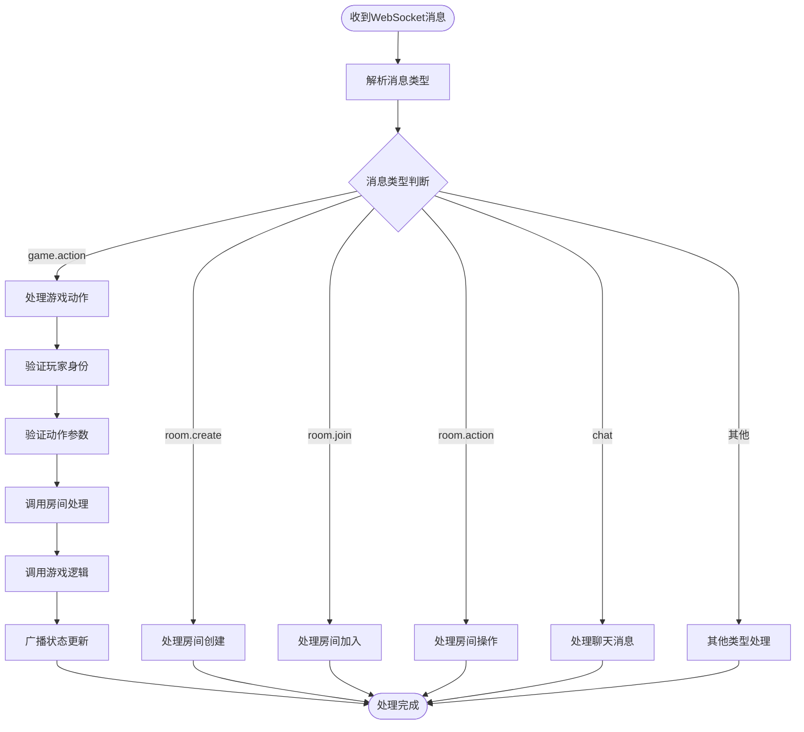
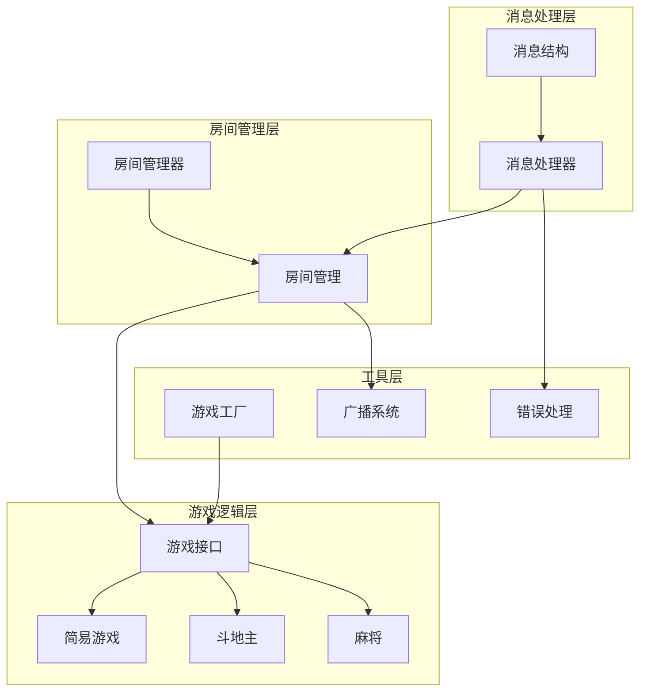
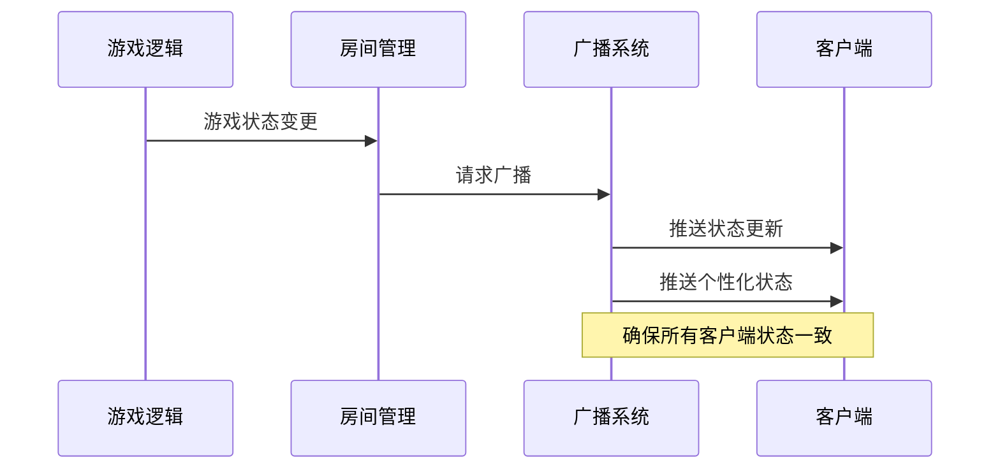

# 游戏动作API

<cite>
**本文档引用的文件**
- [internal/types/game_action.go](file://internal/types/game_action.go)
- [internal/types/message.go](file://internal/types/message.go)
- [internal/types/broadcast.go](file://internal/types/broadcast.go)
- [internal/types/error.go](file://internal/types/error.go)
- [internal/connection/handler.go](file://internal/connection/handler.go)
- [internal/room/room.go](file://internal/room/room.go)
- [internal/room/manager.go](file://internal/room/manager.go)
- [internal/game/factory.go](file://internal/game/factory.go)
- [internal/game/interfaces/game.go](file://internal/game/interfaces/game.go)
- [internal/game/simple/game.go](file://internal/game/simple/game.go)
- [internal/game/ddz/game.go](file://internal/game/ddz/game.go)
- [internal/game/mahjong/game.go](file://internal/game/mahjong/game.go)
- [README.md](file://README.md)
</cite>

## 目录
1. [简介](#简介)
2. [项目结构](#项目结构)
3. [核心组件](#核心组件)
4. [架构概览](#架构概览)
5. [详细组件分析](#详细组件分析)
6. [依赖关系分析](#依赖关系分析)
7. [性能考虑](#性能考虑)
8. [故障排除指南](#故障排除指南)
9. [结论](#结论)
10. [附录](#附录)

## 简介

本文件详细说明游戏动作API的设计与实现，重点涵盖统一数据结构GameActionData、动作类型枚举、不同游戏类型的特定动作规范，以及完整的动作处理流程。该API支持多种游戏类型，包括simple（简易）、ddz（斗地主）、mahjong（麻将）等，并提供了统一的接口来处理各种游戏动作。

## 项目结构

该项目采用模块化设计，主要分为以下层次：



**图表来源**
- [internal/connection/handler.go](file://internal/connection/handler.go#L19-L158)
- [internal/room/room.go](file://internal/room/room.go#L35-L57)

**章节来源**
- [README.md](file://README.md#L20-L50)

## 核心组件

### GameActionData统一数据结构

GameActionData是所有游戏动作的统一数据载体，定义如下：

```mermaid
classDiagram
class GameActionData {
+GameActionType Action
+interface{} Card
}
class GameActionType {
<<enumeration>>
"play_card"
"play_cards"
"pass"
"call_landlord"
"discard"
"chow"
"pong"
"kong"
"win"
}
GameActionData --> GameActionType : "使用"
```

**图表来源**
- [internal/types/game_action.go](file://internal/types/game_action.go#L5-L18)
- [internal/types/message.go](file://internal/types/message.go#L52-L56)

### 消息类型系统

系统支持多种消息类型，其中游戏动作使用`game.action`类型：

```mermaid
classDiagram
class MsgType {
<<enumeration>>
"room.create"
"room.join"
"room.leave"
"room.action"
"game.action"
"chat"
"broadcast"
"error"
}
class Message {
+MsgType Type
+string RoomID
+string PlayerID
+interface{} Data
}
Message --> MsgType : "使用"
```

**图表来源**
- [internal/types/message.go](file://internal/types/message.go#L14-L30)
- [internal/types/message.go](file://internal/types/message.go#L33-L38)

**章节来源**
- [internal/types/game_action.go](file://internal/types/game_action.go#L1-L19)
- [internal/types/message.go](file://internal/types/message.go#L1-L78)

## 架构概览

系统采用分层架构，从底层到高层依次为：网络层、业务层、游戏逻辑层和数据层。



**图表来源**
- [internal/connection/handler.go](file://internal/connection/handler.go#L335-L381)
- [internal/room/room.go](file://internal/room/room.go#L462-L523)

## 详细组件分析

### WebSocket消息处理流程

消息处理采用统一的入口函数，根据消息类型分派到相应的处理器：



**图表来源**
- [internal/connection/handler.go](file://internal/connection/handler.go#L130-L156)
- [internal/connection/handler.go](file://internal/connection/handler.go#L335-L381)

**章节来源**
- [internal/connection/handler.go](file://internal/connection/handler.go#L19-L158)

### 房间管理与状态控制

房间管理负责维护游戏状态和玩家连接：

```mermaid
classDiagram
class Room {
+string ID
+string GameType
+RoomState State
+map[string]*Client Players
+map[int]string Seats
+map[string]bool Ready
+map[string]time.Time OfflinePlayers
+Game Game
+ProcessGameAction(playerID, data) error
+broadcastState() void
+startGame() error
}
class Client {
+string PlayerID
+int SeatNumber
+chan Message Send
}
class RoomState {
<<enumeration>>
"waiting"
"playing"
"paused"
"gameover"
}
Room --> Client : "管理"
Room --> RoomState : "使用"
```

**图表来源**
- [internal/room/room.go](file://internal/room/room.go#L14-L27)
- [internal/room/room.go](file://internal/room/room.go#L29-L33)

**章节来源**
- [internal/room/room.go](file://internal/room/room.go#L1-L657)

### 游戏工厂与多游戏支持

系统通过工厂模式支持多种游戏类型：

```mermaid
classDiagram
class GameFactory {
+NewGame(gameType string) Game
}
class Game {
<<interface>>
+ID() string
+Init(players []string) error
+ProcessAction(playerID string, action interface{}) (bool, error)
+CurrentTurn() string
+AdvanceTurn() void
+GetState() interface{}
+GetStateForPlayer(playerID string) interface{}
+IsGameOver() bool
+Winner() string
+MaxPlayers() int
+MinPlayers() int
}
class SimpleGame {
+ID() string
+Init(players []string) error
+ProcessAction(playerID string, action interface{}) (bool, error)
}
class DdzGame {
+ID() string
+Init(players []string) error
+ProcessAction(playerID string, action interface{}) (bool, error)
}
class MahjongGame {
+ID() string
+Init(players []string) error
+ProcessAction(playerID string, action interface{}) (bool, error)
}
GameFactory --> Game : "创建"
SimpleGame ..|> Game
DdzGame ..|> Game
MahjongGame ..|> Game
```

**图表来源**
- [internal/game/factory.go](file://internal/game/factory.go#L11-L23)
- [internal/game/interfaces/game.go](file://internal/game/interfaces/game.go#L4-L16)

**章节来源**
- [internal/game/factory.go](file://internal/game/factory.go#L1-L24)
- [internal/game/interfaces/game.go](file://internal/game/interfaces/game.go#L1-L23)

### 简易游戏动作规范

简易游戏是最简单的2人对战游戏，支持基本的出牌动作：

| 动作类型 | 参数格式 | 验证规则 | 功能描述 |
|---------|----------|----------|----------|
| play_card | 数字 | 必须为数字类型 | 出一张牌，必须大于上一张牌 |
| pass | 无 | 无 | 跳过本轮出牌 |

**章节来源**
- [internal/game/simple/game.go](file://internal/game/simple/game.go#L37-L65)

### 斗地主动作规范

斗地主支持复杂的牌型和动作：

| 动作类型 | 参数格式 | 验证规则 | 功能描述 |
|---------|----------|----------|----------|
| call_landlord | 数字(0-3) | 必须为0-3之间的整数 | 叫分动作，0表示不叫，1-3表示相应分数 |
| play_cards | 牌组数组 | 必须为合法牌型且能压制上家 | 出牌动作，支持单张、对子、三张、顺子等 |
| pass | 无 | 无 | 跳过本轮出牌，最多连续pass两次 |

牌型识别支持：单张、对子、三张、炸弹、王炸、三带一、三带对、顺子、连对、飞机、飞机带翅膀、四带二等。

**章节来源**
- [internal/game/ddz/game.go](file://internal/game/ddz/game.go#L125-L293)
- [internal/game/ddz/game.go](file://internal/game/ddz/game.go#L381-L463)

### 麻将动作规范

麻将支持复杂的组合动作：

| 动作类型 | 参数格式 | 验证规则 | 功能描述 |
|---------|----------|----------|----------|
| discard | 牌对象 | 必须为手牌中的牌 | 出牌动作，触发其他玩家响应 |
| chow | 2张牌数组 | 必须为下家打出牌的连续3张 | 吃牌动作，只能吃下家的牌 |
| pong | 牌对象 | 必须为手牌中有3张相同的牌 | 碰牌动作 |
| kong | 牌对象 | 必须为手牌中有4张相同牌或补杠 | 杠牌动作，支持暗杠、明杠、补杠 |
| win | 无 | 必须满足胡牌条件且番数≥8 | 胡牌动作，支持自摸和点炮 |

麻将采用等待响应机制，其他玩家可以同时做出响应，按优先级处理。

**章节来源**
- [internal/game/mahjong/game.go](file://internal/game/mahjong/game.go#L142-L161)
- [internal/game/mahjong/game.go](file://internal/game/mahjong/game.go#L293-L388)

## 依赖关系分析

系统采用松耦合设计，各组件间通过接口交互：



**图表来源**
- [internal/connection/handler.go](file://internal/connection/handler.go#L1-L15)
- [internal/room/room.go](file://internal/room/room.go#L1-L12)
- [internal/game/factory.go](file://internal/game/factory.go#L1-L9)

**章节来源**
- [internal/connection/handler.go](file://internal/connection/handler.go#L1-L474)
- [internal/room/room.go](file://internal/room/room.go#L1-L657)

## 性能考虑

系统在多个层面进行了性能优化：

### 并发处理机制

1. **通道缓冲**：广播通道容量为512，避免阻塞
2. **防抖机制**：同一玩家100ms内的重复操作会被忽略
3. **异步广播**：使用goroutine处理广播，不影响主流程
4. **读写锁**：房间状态使用读写锁，提高并发性能

### 内存管理

1. **对象池**：大量使用切片和映射，避免频繁分配
2. **引用传递**：大型数据结构使用指针传递
3. **延迟初始化**：房间和游戏对象按需创建

### 网络优化

1. **心跳检测**：30秒心跳超时，及时清理无效连接
2. **断线重连**：支持30秒内的断线重连
3. **消息队列**：客户端消息队列容量256，避免内存溢出

## 故障排除指南

### 常见错误类型

系统定义了标准的错误码：

| 错误码 | 错误类型 | 描述 | 处理建议 |
|--------|----------|------|----------|
| 400 | ErrInvalidDataCode | 数据格式错误 | 检查消息格式和必填字段 |
| 403 | ErrJoinFailedCode | 加入房间失败 | 检查房间状态和权限 |
| 404 | ErrRoomNotFoundCode | 房间不存在 | 确认房间ID正确性 |
| 409 | ErrAlreadyInRoomCode | 玩家已在房间中 | 先离开当前房间再加入 |
| 410 | ErrPlayerAlreadyConnectedCode | 玩家已在连接中 | 检查重复连接问题 |
| 411 | ErrPlayerNotInRoomCode | 玩家不在房间中 | 验证房间ID和玩家ID |
| 500 | ErrInternalCode | 内部错误 | 查看服务器日志 |

### 调试技巧

1. **启用日志**：查看详细的处理流程日志
2. **检查状态**：确认房间状态和玩家状态
3. **验证参数**：确保动作参数符合游戏规则
4. **监控资源**：观察内存和CPU使用情况

**章节来源**
- [internal/types/error.go](file://internal/types/error.go#L1-L13)
- [internal/connection/handler.go](file://internal/connection/handler.go#L423-L429)

## 结论

本游戏动作API设计合理，具有以下特点：

1. **统一性**：通过GameActionData提供统一的数据结构
2. **扩展性**：基于接口设计，易于添加新的游戏类型
3. **健壮性**：完善的错误处理和状态管理
4. **性能**：多层优化确保高并发下的稳定运行

系统支持多种游戏类型，从简单的2人对战到复杂的4人麻将，都能提供一致的API体验。通过合理的架构设计和性能优化，能够满足在线卡牌游戏的高性能需求。

## 附录

### API使用示例

由于代码库中未包含具体的客户端示例，以下是基于现有实现的使用指导：

#### 基本消息格式
```json
{
  "type": "game.action",
  "room_id": "房间ID",
  "data": {
    "action": "动作类型",
    "card": "动作参数"
  }
}
```

#### 不同游戏的动作示例

**简易游戏**：
```json
{
  "action": "play_card",
  "card": 5
}
```

**斗地主**：
```json
{
  "action": "play_cards",
  "card": [
    {"value": 14, "suit": "wan"},
    {"value": 15, "suit": "wan"}
  ]
}
```

**麻将**：
```json
{
  "action": "discard",
  "card": {"suit": "wan", "rank": 5}
}
```

### 状态更新机制

系统通过广播机制实时更新所有客户端的状态：



**图表来源**
- [internal/room/room.go](file://internal/room/room.go#L528-L538)
- [internal/room/room.go](file://internal/room/room.go#L614-L656)