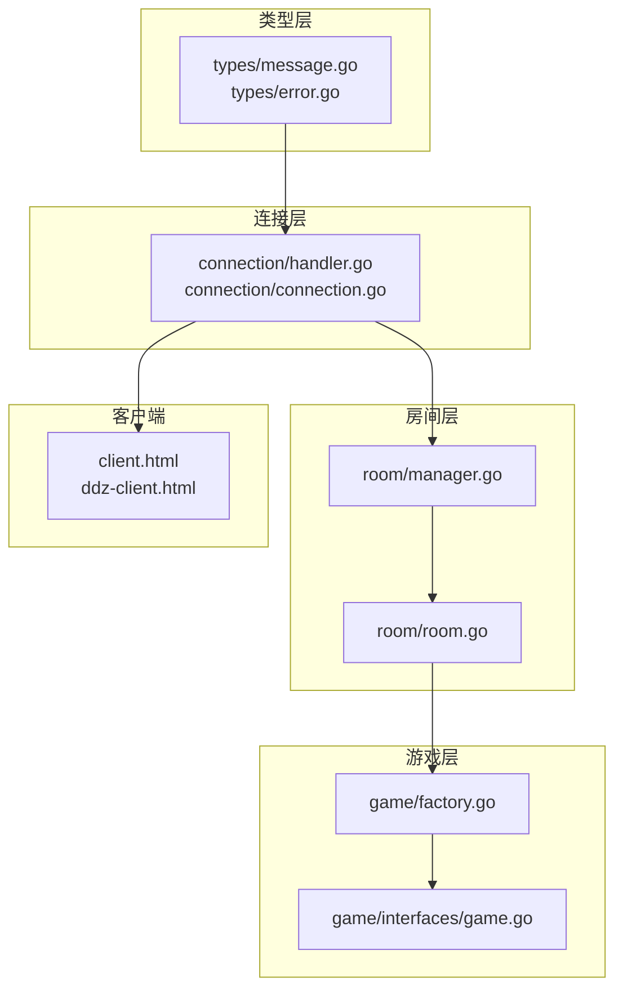
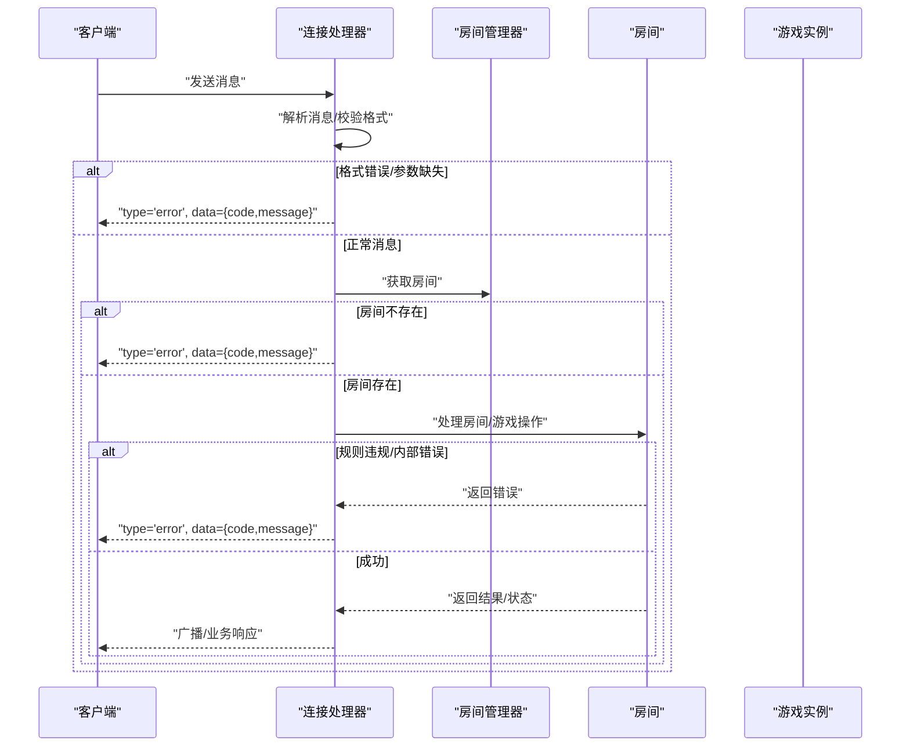
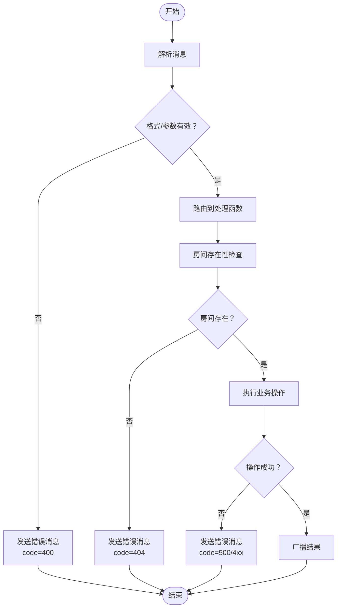
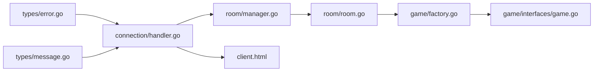

# 错误处理机制

<cite>
**本文档引用的文件**
- [internal/types/error.go](file://internal/types/error.go)
- [internal/types/message.go](file://internal/types/message.go)
- [internal/connection/handler.go](file://internal/connection/handler.go)
- [internal/connection/connection.go](file://internal/connection/connection.go)
- [internal/room/manager.go](file://internal/room/manager.go)
- [internal/room/room.go](file://internal/room/room.go)
- [internal/game/factory.go](file://internal/game/factory.go)
- [internal/game/interfaces/game.go](file://internal/game/interfaces/game.go)
- [client.html](file://client.html)
- [ddz-client.html](file://ddz-client.html)
</cite>

## 目录
1. [简介](#简介)
2. [项目结构](#项目结构)
3. [核心组件](#核心组件)
4. [架构概览](#架构概览)
5. [详细组件分析](#详细组件分析)
6. [依赖关系分析](#依赖关系分析)
7. [性能考虑](#性能考虑)
8. [故障排查指南](#故障排查指南)
9. [结论](#结论)

## 简介
本文件系统性地梳理了该牌类游戏服务器的错误处理机制，重点覆盖以下方面：
- 错误消息格式 ErrorData 的字段定义与使用规范
- 错误码定义与对应错误信息格式
- 错误触发时机（消息格式错误、权限验证失败、游戏规则违反、系统内部错误等）
- 错误消息发送机制（sendErrorMessage 函数与错误传播流程）
- 常见错误场景处理示例（无效房间ID、重复操作、超时处理等）
- 错误恢复策略与客户端重试机制
- 错误日志记录与调试信息收集最佳实践

## 项目结构
该项目采用按功能模块划分的层次化组织方式：
- types：定义统一消息结构、错误数据结构、消息类型枚举等
- connection：WebSocket 连接处理、消息解析、错误发送、心跳检测
- room：房间管理、玩家追踪、房间状态广播、断线处理
- game：游戏工厂与各游戏类型实现
- 客户端：HTML 页面，负责连接、消息收发与错误展示

图表来源
- [internal/types/message.go](file://internal/types/message.go#L32-L77)
- [internal/connection/handler.go](file://internal/connection/handler.go#L19-L158)
- [internal/room/manager.go](file://internal/room/manager.go#L47-L82)
- [internal/room/room.go](file://internal/room/room.go#L14-L57)
- [internal/game/factory.go](file://internal/game/factory.go#L11-L23)
- [internal/game/interfaces/game.go](file://internal/game/interfaces/game.go#L3-L22)
- [client.html](file://client.html#L134-L208)

章节来源
- [internal/types/message.go](file://internal/types/message.go#L1-L78)
- [internal/connection/handler.go](file://internal/connection/handler.go#L1-L474)
- [internal/room/manager.go](file://internal/room/manager.go#L1-L83)
- [internal/room/room.go](file://internal/room/room.go#L1-L657)
- [internal/game/factory.go](file://internal/game/factory.go#L1-L24)
- [internal/game/interfaces/game.go](file://internal/game/interfaces/game.go#L1-L23)
- [client.html](file://client.html#L1-L274)

## 核心组件
- 错误数据结构 ErrorData：包含 code 和 message 两个字段，用于统一错误响应格式
- 错误码常量：集中定义于 types 包，涵盖数据校验、权限、房间、内部错误等类别
- 消息类型枚举 MsgType：定义标准消息类型，其中 Error 作为错误响应类型
- sendErrorMessage：统一错误发送函数，将 ErrorData 以 Error 类型消息发送给客户端
- 连接处理器 WSHandler：负责消息解析、类型判断、参数校验，并在异常时调用 sendErrorMessage
- 房间与玩家追踪：提供房间存在性检查、玩家房间归属验证、断线处理与超时机制
- 客户端错误处理：统一监听 type='error' 的消息并展示错误信息

章节来源
- [internal/types/message.go](file://internal/types/message.go#L74-L77)
- [internal/types/error.go](file://internal/types/error.go#L3-L12)
- [internal/connection/handler.go](file://internal/connection/handler.go#L423-L429)
- [client.html](file://client.html#L153-L208)

## 架构概览
错误处理贯穿连接层、房间层与游戏层，形成“统一错误响应”的闭环：
- 连接层负责消息格式校验与参数完整性检查，失败时发送 Error 类型消息
- 房间层负责房间存在性与玩家归属验证，失败时发送 Error 类型消息
- 游戏层负责游戏规则校验与状态约束，失败时发送 Error 类型消息
- 客户端统一接收并展示错误信息，支持用户重试与状态恢复

图表来源
- [internal/connection/handler.go](file://internal/connection/handler.go#L109-L157)
- [internal/room/manager.go](file://internal/room/manager.go#L66-L74)
- [internal/room/room.go](file://internal/room/room.go#L462-L523)
- [internal/types/message.go](file://internal/types/message.go#L27-L30)

## 详细组件分析

### 错误数据结构与错误码定义
- ErrorData 字段
  - code：整数型错误码，用于区分错误类型与严重程度
  - message：字符串型错误描述，便于前端展示与用户理解
- 错误码常量（集中定义于 types 包）
  - 数据校验类：ErrInvalidDataCode（400）
  - 权限/状态类：ErrJoinFailedCode（403）、ErrPlayerNotInRoomCode（411）
  - 房间类：ErrRoomNotFoundCode（404）、ErrAlreadyInRoomCode（409）、ErrPlayerAlreadyConnectedCode（410）
  - 系统/内部类：ErrInternalCode（500）、ErrNotImplementedCode（501）

使用规范
- code 应与 HTTP 状态码语义保持一致，便于前后端约定与监控
- message 应简洁明确，必要时包含上下文信息（如房间ID、玩家ID等）
- 所有错误响应均以 ErrorData 形式封装，并通过 Error 类型消息发送

章节来源
- [internal/types/message.go](file://internal/types/message.go#L74-L77)
- [internal/types/error.go](file://internal/types/error.go#L3-L12)

### 错误触发时机与处理流程

#### 1) 消息格式错误
- 触发点：WSHandler 读取消息后，JSON 解析失败或缺少 type 字段
- 处理：调用 sendErrorMessage 发送 code=400 的错误消息
- 示例路径
  - [internal/connection/handler.go](file://internal/connection/handler.go#L109-L120)
  - [internal/connection/handler.go](file://internal/connection/handler.go#L423-L429)

#### 2) 权限验证失败
- 触发点：重复连接（同一 playerID 已连接）、玩家不在房间中、房间状态不允许加入
- 处理：根据具体场景发送相应错误码（410、411、403 等）
- 示例路径
  - [internal/connection/handler.go](file://internal/connection/handler.go#L35-L44)
  - [internal/connection/handler.go](file://internal/connection/handler.go#L284-L292)
  - [internal/connection/handler.go](file://internal/connection/handler.go#L335-L342)

#### 3) 房间相关错误
- 触发点：房间不存在、房间已满、玩家已在其他房间
- 处理：发送对应错误码（404、409、403 等），并在客户端提示
- 示例路径
  - [internal/connection/handler.go](file://internal/connection/handler.go#L260-L268)
  - [internal/room/manager.go](file://internal/room/manager.go#L66-L74)
  - [internal/room/room.go](file://internal/room/room.go#L59-L96)

#### 4) 游戏规则违反与内部错误
- 触发点：游戏动作处理中违反规则、房间状态异常（暂停/结束）、游戏内部错误
- 处理：sendErrorMessage 返回 500 或更具体的错误码
- 示例路径
  - [internal/room/room.go](file://internal/room/room.go#L462-L523)
  - [internal/connection/handler.go](file://internal/connection/handler.go#L374-L380)

#### 5) 系统内部错误
- 触发点：房间创建失败、游戏实例初始化失败、未知游戏类型
- 处理：统一返回 500 错误码
- 示例路径
  - [internal/room/room.go](file://internal/room/room.go#L35-L57)
  - [internal/game/factory.go](file://internal/game/factory.go#L12-L23)

#### 6) 心跳超时与断线处理
- 触发点：心跳检测超时、玩家断线、断线超时
- 处理：房间标记断线、暂停/结束游戏、清理资源
- 示例路径
  - [internal/connection/connection.go](file://internal/connection/connection.go#L32-L61)
  - [internal/room/room.go](file://internal/room/room.go#L133-L220)

图表来源
- [internal/connection/handler.go](file://internal/connection/handler.go#L109-L157)
- [internal/room/manager.go](file://internal/room/manager.go#L66-L74)
- [internal/room/room.go](file://internal/room/room.go#L462-L523)

### 错误消息发送机制
- sendErrorMessage 函数
  - 接收 ErrorData，构造 type='error' 的 Message 并通过 WebSocket 发送
  - 作用：统一错误输出格式，便于客户端一致处理
- writePump
  - 异步发送通道中的消息，保证错误消息及时送达
- 客户端错误处理
  - 监听 type='error' 的消息，展示 message 字段并提示用户重试

示例路径
- [internal/connection/handler.go](file://internal/connection/handler.go#L423-L429)
- [internal/connection/handler.go](file://internal/connection/handler.go#L431-L435)
- [client.html](file://client.html#L153-L208)

章节来源
- [internal/connection/handler.go](file://internal/connection/handler.go#L423-L435)
- [client.html](file://client.html#L153-L208)

### 常见错误场景处理示例

#### 场景一：无效房间ID
- 触发条件：join_room 消息缺少 room_id 或房间不存在
- 处理流程：参数校验失败发送 400；房间查询失败发送 404
- 示例路径
  - [internal/connection/handler.go](file://internal/connection/handler.go#L251-L258)
  - [internal/connection/handler.go](file://internal/connection/handler.go#L260-L268)

#### 场景二：重复操作（同一玩家短时间内重复操作）
- 触发条件：游戏动作在 100ms 内重复
- 处理流程：忽略重复操作，不发送错误消息，但记录日志
- 示例路径
  - [internal/room/room.go](file://internal/room/room.go#L476-L482)

#### 场景三：断线超时处理
- 触发条件：断线超过 30 秒
- 处理流程：标记断线玩家、暂停/结束游戏、广播结果、清理资源
- 示例路径
  - [internal/room/room.go](file://internal/room/room.go#L161-L168)
  - [internal/room/room.go](file://internal/room/room.go#L170-L220)

#### 场景四：客户端重试机制
- 客户端建议策略：捕获错误消息后，提示用户重试或稍后重试
- 示例路径
  - [client.html](file://client.html#L153-L208)

章节来源
- [internal/connection/handler.go](file://internal/connection/handler.go#L251-L268)
- [internal/room/room.go](file://internal/room/room.go#L476-L482)
- [internal/room/room.go](file://internal/room/room.go#L161-L220)
- [client.html](file://client.html#L153-L208)

### 错误恢复策略与客户端重试机制
- 服务端层面
  - 心跳超时自动断开连接，清理资源
  - 断线超时后结束游戏并广播结果
  - 房间空闲时自动清理广播通道
- 客户端层面
  - 统一监听错误消息并提示
  - 建议在业务层实现指数退避重试（例如：1s、2s、4s、8s）
  - 对于断线场景，提示用户稍后重试或重新进入房间

章节来源
- [internal/connection/connection.go](file://internal/connection/connection.go#L32-L61)
- [internal/room/room.go](file://internal/room/room.go#L170-L220)
- [client.html](file://client.html#L153-L208)

### 错误日志记录与调试信息收集最佳实践
- 日志级别
  - 错误：使用 log.Printf 输出错误详情（含房间ID、玩家ID、错误原因）
  - 警告：消息队列满、panic 恢复等
  - 信息：连接建立/断开、房间状态变更、游戏开始/结束
- 调试要点
  - 在 sendErrorMessage 前后记录上下文信息
  - 在房间广播与个性化广播中捕获 panic 并记录
  - 在心跳检测中记录 ping/pong 成功与失败情况
- 建议
  - 为每条错误消息附带 traceId 或关联房间/玩家信息
  - 对重复错误进行聚合统计，便于定位热点问题

章节来源
- [internal/connection/handler.go](file://internal/connection/handler.go#L35-L44)
- [internal/room/room.go](file://internal/room/room.go#L568-L612)
- [internal/connection/connection.go](file://internal/connection/connection.go#L32-L61)

## 依赖关系分析

图表来源
- [internal/types/error.go](file://internal/types/error.go#L1-L13)
- [internal/types/message.go](file://internal/types/message.go#L1-L78)
- [internal/connection/handler.go](file://internal/connection/handler.go#L1-L474)
- [internal/room/manager.go](file://internal/room/manager.go#L1-L83)
- [internal/room/room.go](file://internal/room/room.go#L1-L657)
- [internal/game/factory.go](file://internal/game/factory.go#L1-L24)
- [internal/game/interfaces/game.go](file://internal/game/interfaces/game.go#L1-L23)
- [client.html](file://client.html#L1-L274)

章节来源
- [internal/types/error.go](file://internal/types/error.go#L1-L13)
- [internal/types/message.go](file://internal/types/message.go#L1-L78)
- [internal/connection/handler.go](file://internal/connection/handler.go#L1-L474)
- [internal/room/manager.go](file://internal/room/manager.go#L1-L83)
- [internal/room/room.go](file://internal/room/room.go#L1-L657)
- [internal/game/factory.go](file://internal/game/factory.go#L1-L24)
- [internal/game/interfaces/game.go](file://internal/game/interfaces/game.go#L1-L23)
- [client.html](file://client.html#L1-L274)

## 性能考虑
- 消息通道缓冲：send 通道容量为 256，广播通道容量为 512，避免阻塞导致客户端卡顿
- 广播发送非阻塞：使用 select 避免单个客户端阻塞影响整体广播
- panic 恢复：在广播与个性化广播中捕获 panic，防止进程崩溃
- 心跳检测：60 秒读超时与 30 秒 ping 间隔平衡网络稳定性与资源消耗

章节来源
- [internal/connection/handler.go](file://internal/connection/handler.go#L28-L29)
- [internal/room/room.go](file://internal/room/room.go#L568-L612)
- [internal/connection/connection.go](file://internal/connection/connection.go#L32-L61)

## 故障排查指南
- 常见问题定位
  - 消息格式错误：检查客户端发送的 JSON 结构与字段名称
  - 房间不存在：确认 room_id 是否正确，房间是否已被清理
  - 玩家不在房间：确认玩家是否已加入房间，房间状态是否允许操作
  - 游戏暂停/结束：确认房间状态，断线超时可能导致游戏结束
- 日志分析
  - 关注连接建立/断开、房间状态变更、广播发送、panic 恢复等关键日志
  - 对重复错误进行聚合，定位高频问题
- 客户端交互
  - 统一错误展示，提示用户重试或稍后重试
  - 对断线场景，引导用户重新进入房间

章节来源
- [internal/connection/handler.go](file://internal/connection/handler.go#L109-L157)
- [internal/room/room.go](file://internal/room/room.go#L568-L612)
- [client.html](file://client.html#L153-L208)

## 结论
该系统的错误处理机制以统一的 ErrorData 结构为核心，结合明确的错误码定义与严格的触发时机控制，形成了从连接层到房间层再到游戏层的完整错误闭环。通过 sendErrorMessage 的统一发送与客户端的一致化处理，实现了良好的用户体验与可观测性。建议在后续迭代中进一步完善错误分类与日志结构，提升自动化监控与问题定位效率。