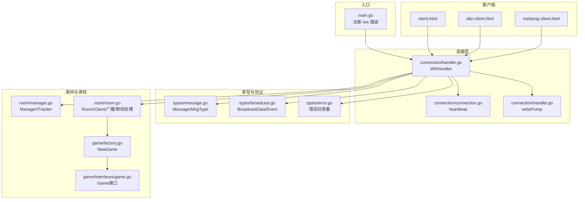
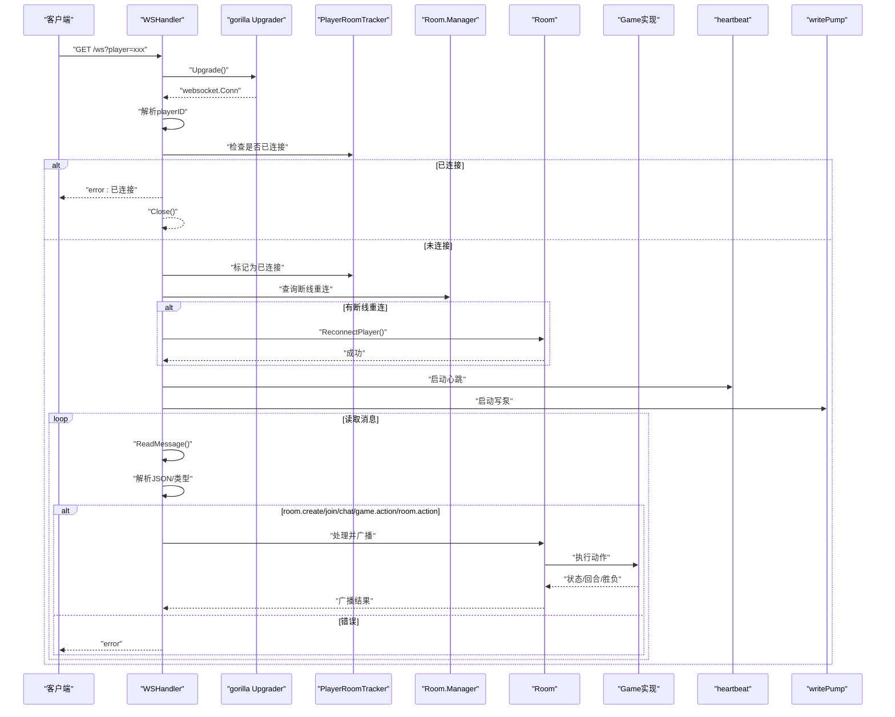
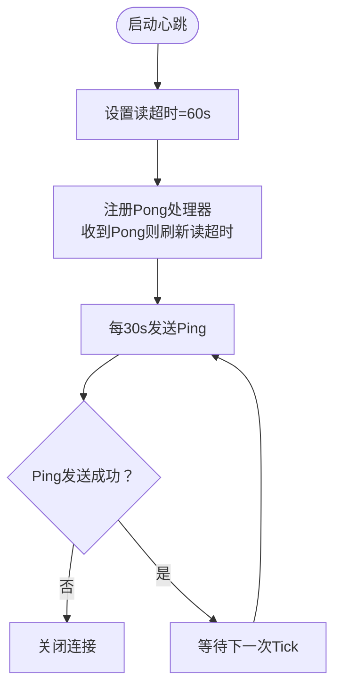
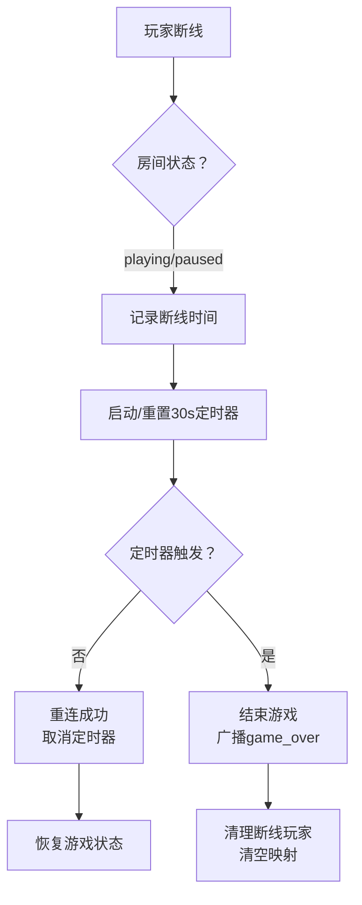
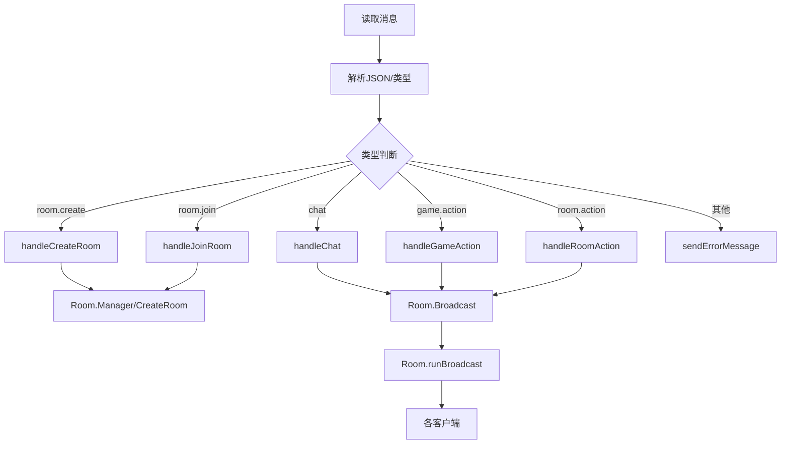
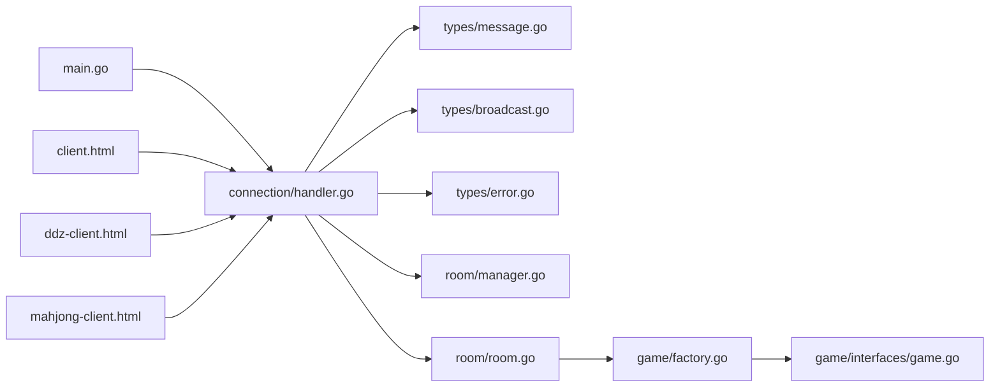

# WebSocket通信

<cite>
**本文引用的文件**
- [main.go](file://main.go)
- [connection.go](file://internal/connection/connection.go)
- [handler.go](file://internal/connection/handler.go)
- [message.go](file://internal/types/message.go)
- [broadcast.go](file://internal/types/broadcast.go)
- [error.go](file://internal/types/error.go)
- [manager.go](file://internal/room/manager.go)
- [room.go](file://internal/room/room.go)
- [factory.go](file://internal/game/factory.go)
- [game.go](file://internal/game/interfaces/game.go)
- [client.html](file://client.html)
- [ddz-client.html](file://ddz-client.html)
- [mahjong-client.html](file://mahjong-client.html)
</cite>

## 目录
1. [简介](#简介)
2. [项目结构](#项目结构)
3. [核心组件](#核心组件)
4. [架构总览](#架构总览)
5. [详细组件分析](#详细组件分析)
6. [依赖关系分析](#依赖关系分析)
7. [性能考量](#性能考量)
8. [故障排查指南](#故障排查指南)
9. [结论](#结论)
10. [附录](#附录)

## 简介
本文件面向开发者与运维人员，系统性梳理该WebSocket通信系统的实现与使用方式，覆盖以下主题：
- WebSocket连接建立流程（HTTP升级握手、连接认证与会话管理）
- 心跳检测机制（心跳间隔、超时策略）
- 断线检测与自动重连（离线标记、超时处理、恢复策略）
- 消息协议格式（统一消息结构、消息类型、字段说明）
- 消息路由与处理（解析、类型识别、处理器分发）
- 客户端与服务器交互流程（含序列图）
- 最佳实践与性能优化建议

## 项目结构
系统采用按职责分层的组织方式：
- 入口与路由：main.go 注册 /ws 路由
- 连接层：internal/connection 提供 WSHandler、心跳、写泵、错误发送
- 类型与协议：internal/types 定义消息结构、广播事件、错误码
- 房间与游戏：internal/room 管理房间生命周期、广播、断线处理；internal/game 提供游戏工厂与接口
- 客户端：提供三种前端示例（通用、斗地主、麻将）



图表来源
- [main.go](file://main.go#L10-L14)
- [handler.go](file://internal/connection/handler.go#L19-L158)
- [connection.go](file://internal/connection/connection.go#L32-L61)
- [message.go](file://internal/types/message.go#L13-L38)
- [broadcast.go](file://internal/types/broadcast.go#L3-L20)
- [manager.go](file://internal/room/manager.go#L47-L82)
- [room.go](file://internal/room/room.go#L14-L57)
- [factory.go](file://internal/game/factory.go#L11-L23)
- [game.go](file://internal/game/interfaces/game.go#L3-L22)
- [client.html](file://client.html#L134-L151)
- [ddz-client.html](file://ddz-client.html#L206-L245)
- [mahjong-client.html](file://mahjong-client.html#L453-L504)

章节来源
- [main.go](file://main.go#L10-L14)
- [handler.go](file://internal/connection/handler.go#L19-L158)
- [connection.go](file://internal/connection/connection.go#L32-L61)
- [message.go](file://internal/types/message.go#L13-L38)
- [broadcast.go](file://internal/types/broadcast.go#L3-L20)
- [manager.go](file://internal/room/manager.go#L47-L82)
- [room.go](file://internal/room/room.go#L14-L57)
- [factory.go](file://internal/game/factory.go#L11-L23)
- [game.go](file://internal/game/interfaces/game.go#L3-L22)
- [client.html](file://client.html#L134-L151)
- [ddz-client.html](file://ddz-client.html#L206-L245)
- [mahjong-client.html](file://mahjong-client.html#L453-L504)

## 核心组件
- WebSocket处理器：负责HTTP升级、鉴权、会话管理、消息路由、错误反馈、心跳与写泵
- 心跳模块：基于gorilla/websocket的Ping/Pong与读超时，实现60秒无活动关闭连接
- 房间管理：全局房间管理器、玩家房间追踪器、房间生命周期与广播
- 消息协议：统一Message结构、消息类型枚举、广播事件枚举、错误码
- 游戏工厂：根据game_type创建不同游戏实例，遵循Game接口

章节来源
- [handler.go](file://internal/connection/handler.go#L19-L158)
- [connection.go](file://internal/connection/connection.go#L32-L61)
- [manager.go](file://internal/room/manager.go#L17-L82)
- [room.go](file://internal/room/room.go#L14-L57)
- [message.go](file://internal/types/message.go#L13-L38)
- [broadcast.go](file://internal/types/broadcast.go#L3-L20)
- [factory.go](file://internal/game/factory.go#L11-L23)
- [game.go](file://internal/game/interfaces/game.go#L3-L22)

## 架构总览
WebSocket连接建立与消息流转的关键路径如下：



图表来源
- [handler.go](file://internal/connection/handler.go#L19-L158)
- [connection.go](file://internal/connection/connection.go#L32-L61)
- [manager.go](file://internal/room/manager.go#L66-L74)
- [room.go](file://internal/room/room.go#L223-L257)
- [factory.go](file://internal/game/factory.go#L11-L23)
- [game.go](file://internal/game/interfaces/game.go#L3-L22)

## 详细组件分析

### 连接建立与握手
- HTTP升级：使用gorilla/websocket的Upgrader，CheckOrigin允许任意源
- URL参数：player=xxx 作为玩家ID；若缺省则生成随机ID
- 会话管理：维护connectedPlayers映射，防止同一playerID重复连接
- 断线重连：若房间处于暂停且玩家断线，则尝试ReconnectPlayer

章节来源
- [handler.go](file://internal/connection/handler.go#L15-L88)
- [connection.go](file://internal/connection/connection.go#L10-L30)

### 心跳检测机制
- 读超时：每次收到Pong后将读超时延长至60秒
- Ping周期：每30秒发送一次Ping
- 超时关闭：发送Ping失败或60秒内无活动则关闭连接
- 心跳通道：heartbeat返回done通道，WSHandler在select中监听心跳超时



图表来源
- [connection.go](file://internal/connection/connection.go#L32-L61)

章节来源
- [connection.go](file://internal/connection/connection.go#L32-L61)

### 断线检测与自动重连
- 离线标记：房间内游戏进行中或暂停时，MarkPlayerOffline记录断线时间
- 超时策略：30秒断线超时定时器，到期后结束游戏并清理断线玩家
- 重连恢复：ReconnectPlayer更新Send通道、取消断线标记、恢复游戏状态
- 连接断开清理：defer中清理房间状态、移除玩家追踪、关闭连接



图表来源
- [room.go](file://internal/room/room.go#L133-L220)
- [room.go](file://internal/room/room.go#L222-L257)

章节来源
- [room.go](file://internal/room/room.go#L133-L220)
- [room.go](file://internal/room/room.go#L222-L257)

### 消息协议与路由
- 统一消息结构：Message{type, room_id, player_id, data}
- 消息类型：room.create/join/leave、room.action、game.action、chat、broadcast、error
- 广播事件：room_state_changed、game_started、game_over、state_update、chat
- 错误码：统一错误码常量，便于客户端一致处理

```mermaid
classDiagram
class Message {
+MsgType type
+string room_id
+string player_id
+interface data
}
class MsgType {
<<enumeration>>
"room.create"
"room.join"
"room.leave"
"room.action"
"game.action"
"chat"
"broadcast"
"error"
}
class BroadcastData {
+Event event
+interface content
}
class Event {
<<enumeration>>
"room_state_changed"
"game_started"
"game_over"
"state_update"
"chat"
}
class ErrorData {
+int code
+string message
}
Message --> MsgType
Message --> BroadcastData : "broadcast"
BroadcastData --> Event
Message --> ErrorData : "error"
```

图表来源
- [message.go](file://internal/types/message.go#L13-L38)
- [broadcast.go](file://internal/types/broadcast.go#L3-L20)
- [error.go](file://internal/types/error.go#L3-L12)

章节来源
- [message.go](file://internal/types/message.go#L13-L38)
- [broadcast.go](file://internal/types/broadcast.go#L3-L20)
- [error.go](file://internal/types/error.go#L3-L12)

### 消息路由与处理流程
- 读取消息：循环读取客户端消息，解析JSON
- 类型识别：根据msg.Type分派到对应处理器
- 数据解析：按类型反序列化data字段
- 处理器分发：create/join/chat/game.action/room.action分别调用房间与游戏逻辑
- 错误反馈：统一sendErrorMessage发送error消息



图表来源
- [handler.go](file://internal/connection/handler.go#L95-L157)
- [handler.go](file://internal/connection/handler.go#L160-L421)
- [room.go](file://internal/room/room.go#L568-L612)

章节来源
- [handler.go](file://internal/connection/handler.go#L95-L157)
- [handler.go](file://internal/connection/handler.go#L160-L421)
- [room.go](file://internal/room/room.go#L568-L612)

### 房间与游戏集成
- 房间管理：Manager.CreateRoom/GetRoom/RemoveRoom；PlayerRoomTracker追踪玩家房间
- 房间状态：waiting/playing/paused/gameover；RoomState枚举
- 广播机制：普通广播与个性化广播（针对每个玩家生成差异化内容）
- 游戏工厂：根据game_type创建具体游戏实例，遵循Game接口

章节来源
- [manager.go](file://internal/room/manager.go#L47-L82)
- [room.go](file://internal/room/room.go#L14-L57)
- [message.go](file://internal/types/message.go#L3-L11)
- [factory.go](file://internal/game/factory.go#L11-L23)
- [game.go](file://internal/game/interfaces/game.go#L3-L22)

### 客户端交互示例
- 通用客户端：连接后发送room.create/room.join/chat/game.action等消息
- 斗地主客户端：包含心跳（每30秒发送ping）、准备/出牌/不出/清空选择等交互
- 麻将客户端：支持机器人接入、房间状态与游戏状态更新、聊天

章节来源
- [client.html](file://client.html#L134-L151)
- [ddz-client.html](file://ddz-client.html#L206-L245)
- [mahjong-client.html](file://mahjong-client.html#L453-L504)

## 依赖关系分析



图表来源
- [handler.go](file://internal/connection/handler.go#L3-L12)
- [message.go](file://internal/types/message.go#L1-L78)
- [broadcast.go](file://internal/types/broadcast.go#L1-L48)
- [error.go](file://internal/types/error.go#L1-L13)
- [manager.go](file://internal/room/manager.go#L1-L83)
- [room.go](file://internal/room/room.go#L1-L657)
- [factory.go](file://internal/game/factory.go#L1-L24)
- [game.go](file://internal/game/interfaces/game.go#L1-L23)
- [main.go](file://main.go#L1-L15)
- [client.html](file://client.html#L1-L274)
- [ddz-client.html](file://ddz-client.html#L1-L678)
- [mahjong-client.html](file://mahjong-client.html#L1-L800)

章节来源
- [handler.go](file://internal/connection/handler.go#L3-L12)
- [message.go](file://internal/types/message.go#L1-L78)
- [broadcast.go](file://internal/types/broadcast.go#L1-L48)
- [error.go](file://internal/types/error.go#L1-L13)
- [manager.go](file://internal/room/manager.go#L1-L83)
- [room.go](file://internal/room/room.go#L1-L657)
- [factory.go](file://internal/game/factory.go#L1-L24)
- [game.go](file://internal/game/interfaces/game.go#L1-L23)
- [main.go](file://main.go#L1-L15)
- [client.html](file://client.html#L1-L274)
- [ddz-client.html](file://ddz-client.html#L1-L678)
- [mahjong-client.html](file://mahjong-client.html#L1-L800)

## 性能考量
- 写通道缓冲：房间广播通道容量较大（默认512），避免阻塞；客户端写通道容量256
- 广播并发：runBroadcast遍历在线玩家非阻塞发送，丢弃已满队列消息
- 防抖控制：游戏动作100ms内重复操作忽略，降低无效广播
- 心跳与读超时：30s心跳+60s读超时，平衡网络波动与资源占用
- 个性化广播：针对每个玩家生成差异化内容，避免泄露对手隐私

章节来源
- [room.go](file://internal/room/room.go#L44-L612)
- [room.go](file://internal/room/room.go#L476-L482)
- [connection.go](file://internal/connection/connection.go#L47-L57)

## 故障排查指南
- 连接失败
  - 检查URL参数player是否正确传递
  - 确认服务器端口监听与路由注册
- 重复连接
  - 服务器端connectedPlayers映射导致拒绝
- 心跳超时
  - 客户端网络不稳定或长时间无消息
  - 服务器端读超时60s，需确保Pong及时返回
- 房间操作错误
  - 缺少room_id或玩家不在房间中
  - 游戏进行中不允许某些操作
- 广播异常
  - 房间广播通道关闭或客户端Send通道关闭
  - 客户端消息队列满，丢弃部分消息

章节来源
- [handler.go](file://internal/connection/handler.go#L30-L88)
- [handler.go](file://internal/connection/handler.go#L284-L333)
- [room.go](file://internal/room/room.go#L568-L612)
- [connection.go](file://internal/connection/connection.go#L40-L45)

## 结论
该WebSocket通信系统以清晰的分层设计实现了稳定的实时通信能力：
- 通过gorilla/websocket完成升级与心跳
- 基于房间与游戏抽象实现多玩法支持
- 统一消息协议与广播机制保证状态一致性
- 断线检测与自动重连提升用户体验
- 客户端示例覆盖多种游戏场景

建议在生产环境中进一步完善：
- TLS与鉴权
- 心跳与超时参数化配置
- 广播通道背压与限流
- 客户端重连策略与退避算法

## 附录

### 消息协议字段说明
- Message
  - type：消息类型（见MsgType）
  - room_id：房间ID（可选）
  - player_id：玩家ID（可选）
  - data：消息体（可选）
- MsgType
  - room.create/join/leave：房间管理
  - room.action：房间内操作（准备、选座等）
  - game.action：游戏动作（出牌、叫分等）
  - chat：聊天消息
  - broadcast：广播消息
  - error：错误消息
- BroadcastData
  - event：事件名（见Event）
  - content：事件内容
- Event
  - room_state_changed：房间状态变更
  - game_started：游戏开始
  - game_over：游戏结束
  - state_update：状态更新
  - chat：聊天消息

章节来源
- [message.go](file://internal/types/message.go#L13-L38)
- [broadcast.go](file://internal/types/broadcast.go#L3-L20)