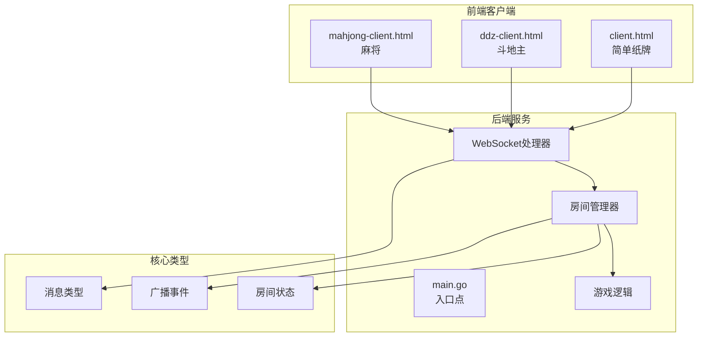
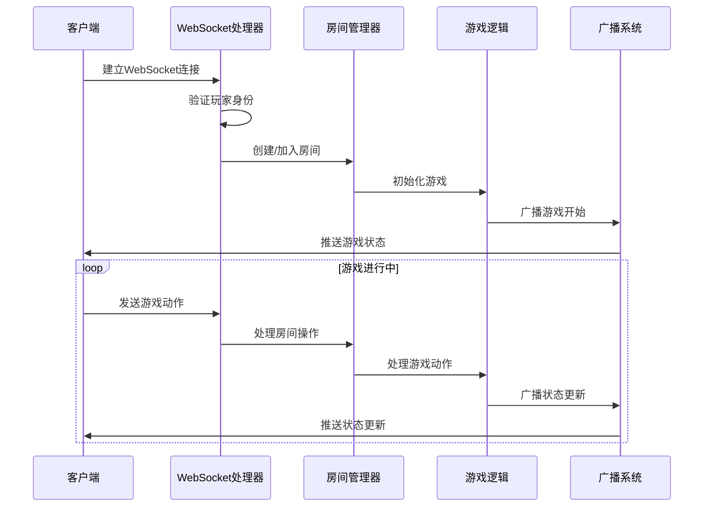
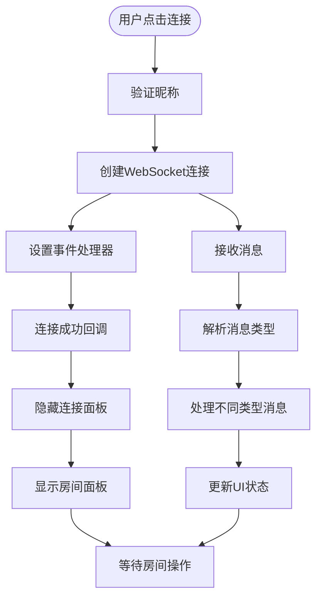
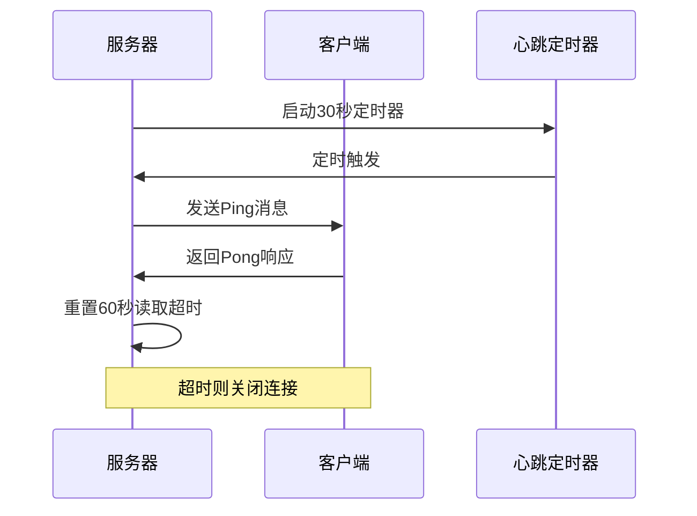
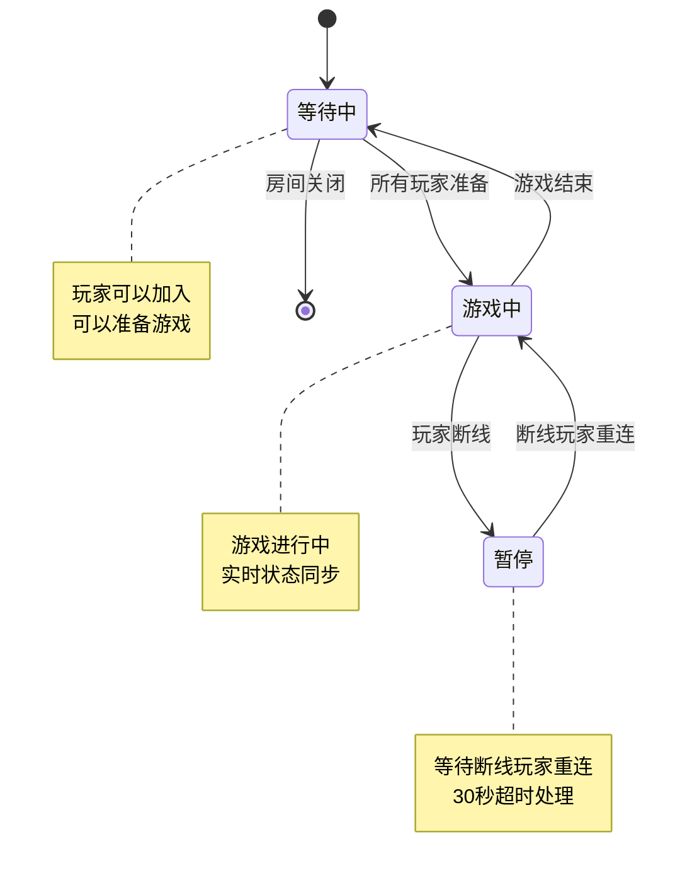
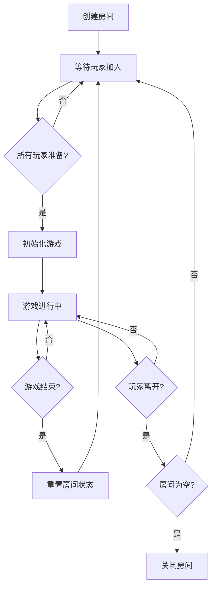
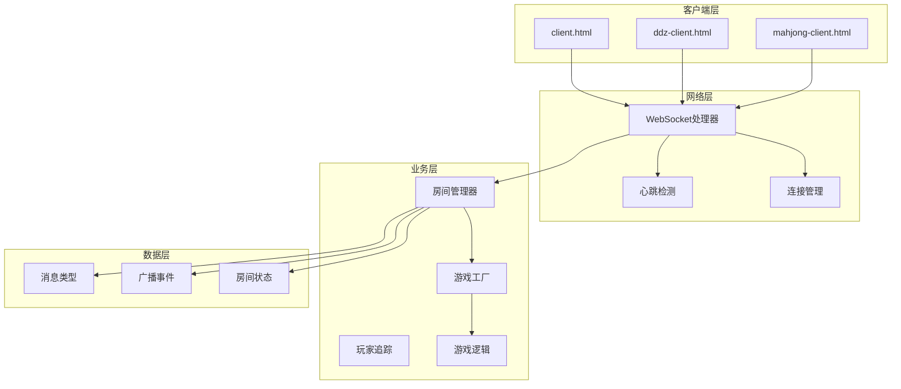

# 客户端集成

<cite>
**本文档引用的文件**
- [client.html](file://client.html)
- [ddz-client.html](file://ddz-client.html)
- [mahjong-client.html](file://mahjong-client.html)
- [main.go](file://main.go)
- [connection.go](file://internal/connection/connection.go)
- [handler.go](file://internal/connection/handler.go)
- [message.go](file://internal/types/message.go)
- [broadcast.go](file://internal/types/broadcast.go)
- [room.go](file://internal/room/room.go)
- [manager.go](file://internal/room/manager.go)
- [game.go](file://internal/game/simple/game.go)
- [game.go](file://internal/game/ddz/game.go)
- [game.go](file://internal/game/mahjong/game.go)
</cite>

## 目录
1. [简介](#简介)
2. [项目结构](#项目结构)
3. [核心组件](#核心组件)
4. [架构概览](#架构概览)
5. [详细组件分析](#详细组件分析)
6. [依赖关系分析](#依赖关系分析)
7. [性能考虑](#性能考虑)
8. [故障排除指南](#故障排除指南)
9. [结论](#结论)
10. [附录](#附录)

## 简介

这是一个基于Go语言开发的实时卡牌游戏服务器，提供了三个完整的HTML客户端实现，支持简单的纸牌游戏、斗地主和国标麻将。该项目采用WebSocket协议实现实时通信，具有完善的房间管理系统、游戏逻辑处理和状态同步机制。

## 项目结构

项目采用清晰的分层架构设计，主要包含以下模块：



**图表来源**
- [main.go](file://main.go#L1-L15)
- [connection.go](file://internal/connection/connection.go#L1-L62)
- [handler.go](file://internal/connection/handler.go#L1-L474)

**章节来源**
- [main.go](file://main.go#L1-L15)
- [client.html](file://client.html#L1-L274)
- [ddz-client.html](file://ddz-client.html#L1-L678)
- [mahjong-client.html](file://mahjong-client.html#L1-L800)

## 核心组件

### WebSocket连接管理

系统使用gorilla/websocket库实现高效的WebSocket通信，支持心跳检测和断线重连功能。

### 房间管理系统

- **房间创建与管理**：支持动态创建房间，跟踪房间状态
- **玩家管理**：管理玩家加入、离开和座位分配
- **状态同步**：实时广播房间状态变化

### 游戏逻辑引擎

- **简单纸牌**：基础的纸牌对战游戏
- **斗地主**：完整的三人斗地主游戏逻辑
- **国标麻将**：复杂的四人麻将游戏，包含多种牌型判断

**章节来源**
- [connection.go](file://internal/connection/connection.go#L1-L62)
- [handler.go](file://internal/connection/handler.go#L1-L474)
- [room.go](file://internal/room/room.go#L1-L657)

## 架构概览

系统采用经典的C/S架构，前端HTML客户端通过WebSocket与后端Go服务器通信：



**图表来源**
- [handler.go](file://internal/connection/handler.go#L19-L158)
- [room.go](file://internal/room/room.go#L462-L523)
- [broadcast.go](file://internal/types/broadcast.go#L6-L15)

## 详细组件分析

### WebSocket连接实现

#### 连接建立流程



**图表来源**
- [client.html](file://client.html#L134-L151)
- [ddz-client.html](file://ddz-client.html#L206-L245)

#### 心跳检测机制

服务器端实现了60秒的心跳检测机制，客户端每30秒发送ping消息：



**图表来源**
- [connection.go](file://internal/connection/connection.go#L32-L61)

**章节来源**
- [client.html](file://client.html#L134-L151)
- [ddz-client.html](file://ddz-client.html#L222-L227)
- [connection.go](file://internal/connection/connection.go#L32-L61)

### 房间管理系统

#### 房间状态流转



**图表来源**
- [room.go](file://internal/room/room.go#L40-L11)
- [manager.go](file://internal/room/manager.go#L9-L15)

#### 房间操作流程



**图表来源**
- [room.go](file://internal/room/room.go#L318-L348)
- [room.go](file://internal/room/room.go#L540-L566)

**章节来源**
- [room.go](file://internal/room/room.go#L1-L657)
- [manager.go](file://internal/room/manager.go#L1-L83)

### 游戏逻辑实现

#### 简单纸牌游戏

简单纸牌游戏是最基础的实现，支持2人对战：

```mermaid
classDiagram
class SimpleGame {
+players []string
+turnIndex int
+lastCard int
+hands map[string][]int
+gameOver bool
+winner string
+ID() string
+Init(players []string) error
+ProcessAction(playerID, action) bool, error
+CurrentTurn() string
+AdvanceTurn() void
+GetState() interface{}
+GetStateForPlayer(playerID) interface{}
+IsGameOver() bool
+Winner() string
+MaxPlayers() int
+MinPlayers() int
}
class Action {
+Type string
+Data interface{}
}
SimpleGame --> Action : "处理动作"
```

**图表来源**
- [game.go](file://internal/game/simple/game.go#L8-L15)
- [game.go](file://internal/game/simple/game.go#L18-L22)

#### 斗地主游戏

斗地主实现了完整的三人游戏逻辑，包含叫地主、出牌、牌型判断等功能：

```mermaid
classDiagram
class DdzGame {
+players []string
+playerSeats map[string]int
+hands map[string]Hand
+bottomCards Hand
+landlord string
+calls map[string]int
+phase string
+lastPlay Play
+gameOver bool
+ID() string
+Init(players []string) error
+ProcessAction(playerID, action) bool, error
+CurrentTurn() string
+GetState() interface{}
+GetStateForPlayer(playerID) interface{}
+IsGameOver() bool
+Winner() string
+MaxPlayers() int
+MinPlayers() int
}
class Card {
+Value int
+Suit string
}
class Hand {
+Len() int
+Swap(i, j) void
+Less(i, j) bool
}
class Play {
+Type string
+Cards Hand
+Value int
}
DdzGame --> Card : "使用"
DdzGame --> Hand : "管理手牌"
DdzGame --> Play : "记录上家出牌"
```

**图表来源**
- [game.go](file://internal/game/ddz/game.go#L20-L35)
- [game.go](file://internal/game/ddz/game.go#L13-L16)

#### 麻将游戏

麻将实现了最复杂的四人游戏逻辑，包含多种牌型判断和响应机制：

```mermaid
classDiagram
class MahjongGame {
+players []string
+playerSeats map[string]int
+hands [4]Tiles
+melds [4][]Meld
+discards [4]Tiles
+wall Tiles
+dealerSeat int
+currentSeat int
+phase string
+lastDiscard *Tile
+pendingActions map[int][]string
+gameOver bool
+ID() string
+Init(players []string) error
+ProcessAction(playerID, action) bool, error
+CurrentTurn() string
+GetState() interface{}
+GetStateForPlayer(playerID) interface{}
+IsGameOver() bool
+Winner() string
+MaxPlayers() int
+MinPlayers() int
}
class Tile {
+Suit string
+Rank int
+IsHonor() bool
+Equal(tile) bool
+ToMap() map[string]interface{}
}
class Meld {
+Type string
+Tiles Tiles
+FromPlayer int
}
MahjongGame --> Tile : "使用"
MahjongGame --> Meld : "管理副露"
```

**图表来源**
- [game.go](file://internal/game/mahjong/game.go#L52-L77)

**章节来源**
- [game.go](file://internal/game/simple/game.go#L1-L102)
- [game.go](file://internal/game/ddz/game.go#L1-L841)
- [game.go](file://internal/game/mahjong/game.go#L1-L805)

### 消息通信协议

系统定义了统一的消息格式和事件类型：

```mermaid
classDiagram
class Message {
+Type MsgType
+RoomID string
+PlayerID string
+Data interface{}
}
class MsgType {
<<enumeration>>
+RoomCreate
+RoomJoin
+RoomLeave
+RoomAction
+GameAction
+Chat
+Broadcast
+Error
}
class BroadcastData {
+Event Event
+Content interface{}
}
class Event {
<<enumeration>>
+RoomStateChanged
+GameStarted
+GameFinished
+StateUpdate
+ChatMessage
}
Message --> MsgType : "使用"
Message --> BroadcastData : "包含"
BroadcastData --> Event : "使用"
```

**图表来源**
- [message.go](file://internal/types/message.go#L13-L30)
- [broadcast.go](file://internal/types/broadcast.go#L3-L15)

**章节来源**
- [message.go](file://internal/types/message.go#L1-L78)
- [broadcast.go](file://internal/types/broadcast.go#L1-L48)

## 依赖关系分析

系统采用模块化设计，各组件之间耦合度低，职责清晰：



**图表来源**
- [handler.go](file://internal/connection/handler.go#L15-L17)
- [room.go](file://internal/room/room.go#L47-L52)
- [manager.go](file://internal/room/manager.go#L54-L63)

**章节来源**
- [handler.go](file://internal/connection/handler.go#L1-L474)
- [room.go](file://internal/room/room.go#L1-L657)
- [manager.go](file://internal/room/manager.go#L1-L83)

## 性能考虑

### WebSocket优化

1. **心跳机制**：30秒ping，60秒超时，平衡资源消耗和连接稳定性
2. **消息队列**：使用带缓冲的channel避免阻塞
3. **广播优化**：批量发送，避免单个客户端阻塞影响其他用户

### 内存管理

1. **连接池**：使用map跟踪已连接玩家，防止重复连接
2. **房间清理**：房间空时自动清理资源
3. **断线处理**：30秒超时自动清理断线玩家

### 并发控制

1. **读写锁**：房间状态使用RWMutex提高并发性能
2. **通道通信**：使用channel实现线程安全的消息传递
3. **防抖机制**：100ms内重复操作去重

## 故障排除指南

### 常见连接问题

**问题**：WebSocket连接失败
- 检查服务器是否启动（默认端口8080）
- 确认浏览器支持WebSocket
- 查看浏览器开发者工具Network标签

**问题**：连接后立即断开
- 检查心跳机制是否正常工作
- 确认服务器日志中的错误信息
- 验证客户端版本兼容性

### 游戏状态异常

**问题**：游戏状态不同步
- 检查客户端是否正确处理广播消息
- 确认房间状态转换逻辑
- 验证消息序列化/反序列化

**问题**：玩家无法出牌
- 检查当前回合判断逻辑
- 确认动作权限验证
- 验证牌型判断算法

### 性能问题

**问题**：页面响应缓慢
- 检查WebSocket消息处理效率
- 优化UI更新频率
- 减少不必要的DOM操作

**问题**：内存泄漏
- 确认WebSocket连接正确关闭
- 检查定时器是否正确清理
- 验证事件监听器是否移除

**章节来源**
- [connection.go](file://internal/connection/connection.go#L32-L61)
- [room.go](file://internal/room/room.go#L170-L220)

## 结论

这个客户端集成项目展示了如何构建一个完整的实时卡牌游戏系统。通过清晰的架构设计、完善的错误处理和优化的性能考虑，为开发者提供了可扩展的基础框架。

主要特点：
- **模块化设计**：各组件职责明确，易于维护和扩展
- **实时通信**：基于WebSocket的高效双向通信
- **状态同步**：完整的房间管理和游戏状态同步机制
- **多游戏支持**：支持简单纸牌、斗地主和麻将三种游戏
- **错误处理**：完善的错误处理和故障恢复机制

## 附录

### 开发者指南

#### 自定义游戏客户端开发步骤

1. **分析现有客户端**：参考现有的三个客户端实现
2. **定义消息格式**：遵循统一的消息协议
3. **实现连接逻辑**：处理WebSocket连接和心跳
4. **开发UI界面**：根据游戏规则设计界面
5. **集成游戏逻辑**：调用服务器提供的API
6. **测试和调试**：使用浏览器开发者工具调试

#### 浏览器兼容性

- **现代浏览器**：Chrome、Firefox、Safari、Edge完全支持
- **移动设备**：iOS Safari和Android Chrome支持良好
- **WebSocket支持**：所有主流浏览器都支持WebSocket

#### 移动端适配建议

1. **响应式设计**：使用CSS媒体查询适配不同屏幕尺寸
2. **触摸交互**：优化触摸操作体验
3. **性能优化**：减少DOM操作，使用虚拟滚动
4. **离线处理**：实现基本的离线状态提示

#### 调试工具使用

1. **浏览器开发者工具**：Network标签查看WebSocket通信
2. **服务器日志**：查看Go服务器的运行日志
3. **消息监控**：使用浏览器插件监控WebSocket消息
4. **性能分析**：使用Performance标签分析页面性能