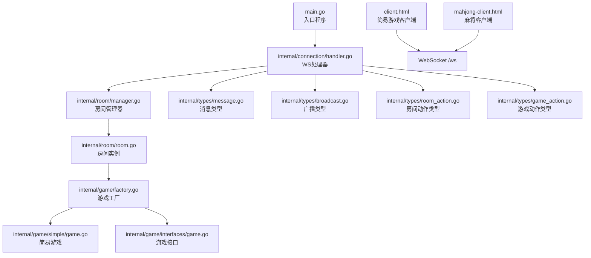
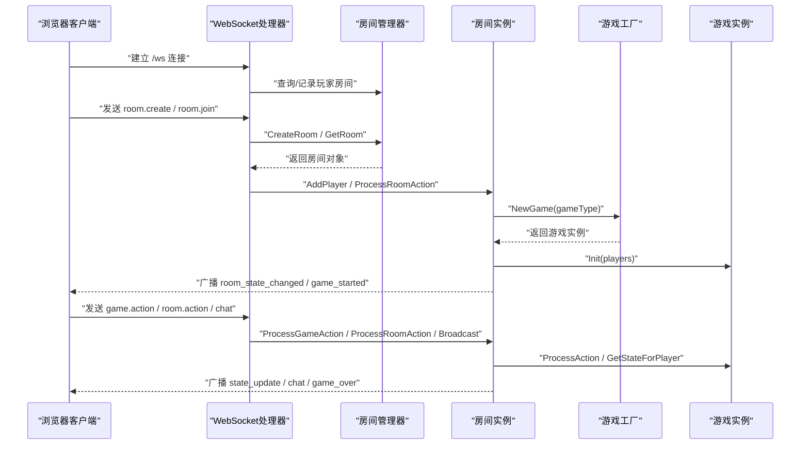
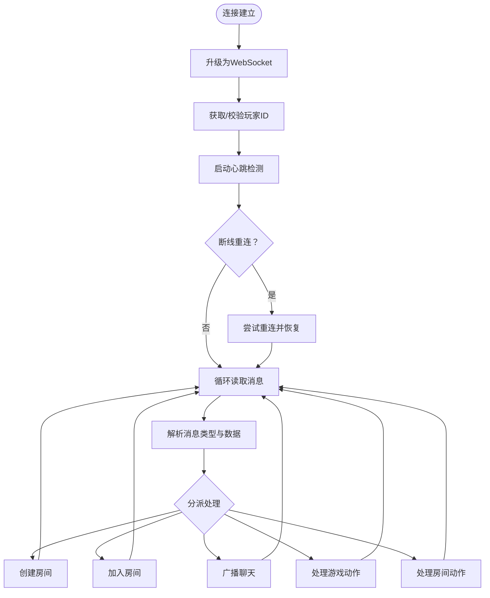
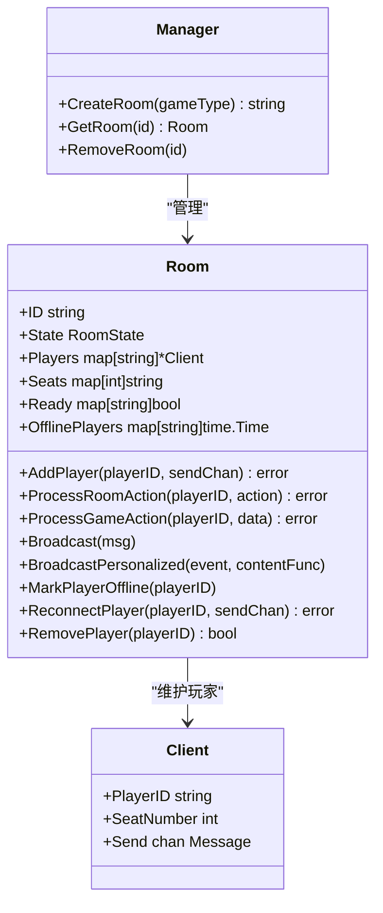
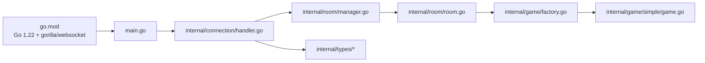

# 快速开始

<cite>
**本文引用的文件**
- [README.md](file://README.md)
- [main.go](file://main.go)
- [go.mod](file://go.mod)
- [client.html](file://client.html)
- [mahjong-client.html](file://mahjong-client.html)
- [internal/connection/handler.go](file://internal/connection/handler.go)
- [internal/connection/connection.go](file://internal/connection/connection.go)
- [internal/room/manager.go](file://internal/room/manager.go)
- [internal/room/room.go](file://internal/room/room.go)
- [internal/types/message.go](file://internal/types/message.go)
- [internal/types/broadcast.go](file://internal/types/broadcast.go)
- [internal/types/room_action.go](file://internal/types/room_action.go)
- [internal/types/game_action.go](file://internal/types/game_action.go)
- [internal/game/factory.go](file://internal/game/factory.go)
- [internal/game/simple/game.go](file://internal/game/simple/game.go)
- [internal/game/interfaces/game.go](file://internal/game/interfaces/game.go)
</cite>

## 目录
1. [简介](#简介)
2. [项目结构](#项目结构)
3. [核心组件](#核心组件)
4. [架构总览](#架构总览)
5. [详细组件分析](#详细组件分析)
6. [依赖关系分析](#依赖关系分析)
7. [性能与并发特性](#性能与并发特性)
8. [故障排除指南](#故障排除指南)
9. [结论](#结论)
10. [附录：从零开始的完整操作流程](#附录从零开始的完整操作流程)

## 简介
本指南面向初学者，帮助你在本地快速搭建并运行卡牌游戏服务器，涵盖环境准备、项目克隆、依赖安装、编译与运行、服务器启动与访问、使用HTML客户端进行基础测试（连接WebSocket、创建房间、加入游戏等），以及常见问题排查。项目基于Go 1.22+与WebSocket，支持斗地主、麻将、简易卡牌游戏等多种玩法。

## 项目结构
项目采用模块化设计，核心入口为HTTP路由绑定WebSocket处理器，房间管理与游戏逻辑分别位于独立模块，类型定义集中于types包，便于扩展新游戏。



图表来源
- [main.go](file://main.go#L10-L14)
- [internal/connection/handler.go](file://internal/connection/handler.go#L19-L158)
- [internal/room/manager.go](file://internal/room/manager.go#L47-L82)
- [internal/room/room.go](file://internal/room/room.go#L35-L56)
- [internal/game/factory.go](file://internal/game/factory.go#L11-L23)
- [internal/game/simple/game.go](file://internal/game/simple/game.go#L17-L19)
- [internal/game/interfaces/game.go](file://internal/game/interfaces/game.go#L3-L22)
- [internal/types/message.go](file://internal/types/message.go#L13-L38)
- [internal/types/broadcast.go](file://internal/types/broadcast.go#L3-L15)
- [internal/types/room_action.go](file://internal/types/room_action.go#L3-L9)
- [internal/types/game_action.go](file://internal/types/game_action.go#L3-L18)
- [client.html](file://client.html#L134-L151)
- [mahjong-client.html](file://mahjong-client.html#L453-L454)

章节来源
- [README.md](file://README.md#L20-L50)
- [main.go](file://main.go#L10-L14)

## 核心组件
- 服务器入口与路由
  - 入口文件在根目录，绑定WebSocket端点“/ws”，监听8080端口。
- WebSocket处理器
  - 负责升级HTTP连接为WebSocket，校验玩家身份，处理消息类型（创建房间、加入房间、聊天、游戏动作、房间动作），并进行断线重连与心跳检测。
- 房间管理
  - 提供房间创建、获取、删除；追踪玩家所在房间；广播房间状态；处理房间内准备/选座等操作；处理断线与重连。
- 游戏工厂与接口
  - 工厂根据游戏类型创建具体游戏实例；所有游戏实现统一接口，保证扩展性。
- HTML客户端
  - 提供简易游戏与麻将的前端测试页面，内置WebSocket连接、房间操作、聊天、游戏状态展示与交互。

章节来源
- [main.go](file://main.go#L10-L14)
- [internal/connection/handler.go](file://internal/connection/handler.go#L19-L158)
- [internal/room/manager.go](file://internal/room/manager.go#L47-L82)
- [internal/room/room.go](file://internal/room/room.go#L35-L56)
- [internal/game/factory.go](file://internal/game/factory.go#L11-L23)
- [internal/game/interfaces/game.go](file://internal/game/interfaces/game.go#L3-L22)
- [client.html](file://client.html#L134-L151)
- [mahjong-client.html](file://mahjong-client.html#L453-L454)

## 架构总览
下图展示了从浏览器到服务器的典型交互路径：客户端通过WebSocket连接服务器，服务器根据消息类型分派到房间与游戏逻辑，最终通过广播通道将状态同步给所有在线玩家。



图表来源
- [internal/connection/handler.go](file://internal/connection/handler.go#L19-L158)
- [internal/room/manager.go](file://internal/room/manager.go#L54-L74)
- [internal/room/room.go](file://internal/room/room.go#L35-L56)
- [internal/game/factory.go](file://internal/game/factory.go#L11-L23)
- [internal/types/message.go](file://internal/types/message.go#L13-L38)
- [internal/types/broadcast.go](file://internal/types/broadcast.go#L6-L15)

## 详细组件分析

### WebSocket处理器与心跳、断线重连
- 连接升级与玩家校验
  - 从URL查询参数获取玩家ID，若缺失则生成随机ID；同一玩家ID不允许重复连接。
- 心跳检测
  - 每30秒发送Ping，60秒无响应则关闭连接。
- 断线重连
  - 若玩家处于暂停状态且存在历史房间，尝试重连并恢复游戏。
- 消息分发
  - 根据消息类型解析并分派至房间创建/加入、聊天、游戏动作、房间动作处理函数。



图表来源
- [internal/connection/handler.go](file://internal/connection/handler.go#L19-L158)
- [internal/connection/connection.go](file://internal/connection/connection.go#L32-L61)

章节来源
- [internal/connection/handler.go](file://internal/connection/handler.go#L19-L158)
- [internal/connection/connection.go](file://internal/connection/connection.go#L10-L30)
- [internal/connection/connection.go](file://internal/connection/connection.go#L32-L61)

### 房间管理与状态广播
- 房间生命周期
  - 创建房间、获取房间、删除房间；房间状态包括等待、游戏中、暂停、结束。
- 玩家管理
  - 分配座位、准备状态、断线标记与清理；支持断线超时（30秒）与自动结算。
- 广播机制
  - 使用带缓冲的广播通道，按玩家个性化状态推送，避免阻塞；断线玩家跳过发送。



图表来源
- [internal/room/manager.go](file://internal/room/manager.go#L47-L82)
- [internal/room/room.go](file://internal/room/room.go#L14-L33)

章节来源
- [internal/room/manager.go](file://internal/room/manager.go#L17-L45)
- [internal/room/manager.go](file://internal/room/manager.go#L54-L82)
- [internal/room/room.go](file://internal/room/room.go#L35-L56)
- [internal/room/room.go](file://internal/room/room.go#L98-L131)
- [internal/room/room.go](file://internal/room/room.go#L133-L220)
- [internal/room/room.go](file://internal/room/room.go#L222-L257)
- [internal/room/room.go](file://internal/room/room.go#L259-L294)
- [internal/room/room.go](file://internal/room/room.go#L461-L523)
- [internal/room/room.go](file://internal/room/room.go#L525-L538)
- [internal/room/room.go](file://internal/room/room.go#L540-L566)
- [internal/room/room.go](file://internal/room/room.go#L568-L612)
- [internal/room/room.go](file://internal/room/room.go#L614-L656)

### 游戏工厂与简易游戏示例
- 工厂模式
  - 根据game_type创建对应游戏实例（simple/ddz/mahjong）。
- 简易游戏
  - 2人对战，回合制出牌，测试用途放宽规则以便快速验证。

```mermaid
classDiagram
class Game {
+ID() string
+Init(players []string) error
+ProcessAction(playerID, action) (bool, error)
+CurrentTurn() string
+AdvanceTurn()
+GetState() interface{}
+GetStateForPlayer(playerID) interface{}
+IsGameOver() bool
+Winner() string
+MaxPlayers() int
+MinPlayers() int
}
class SimpleGame {
+Init(players)
+ProcessAction(playerID, action)
+GetState()
+GetStateForPlayer(playerID)
}
Game <|.. SimpleGame : "实现"
```

图表来源
- [internal/game/interfaces/game.go](file://internal/game/interfaces/game.go#L3-L22)
- [internal/game/simple/game.go](file://internal/game/simple/game.go#L8-L15)
- [internal/game/simple/game.go](file://internal/game/simple/game.go#L26-L35)
- [internal/game/simple/game.go](file://internal/game/simple/game.go#L37-L65)
- [internal/game/simple/game.go](file://internal/game/simple/game.go#L75-L89)
- [internal/game/factory.go](file://internal/game/factory.go#L11-L23)

章节来源
- [internal/game/factory.go](file://internal/game/factory.go#L11-L23)
- [internal/game/simple/game.go](file://internal/game/simple/game.go#L17-L19)
- [internal/game/simple/game.go](file://internal/game/simple/game.go#L26-L35)
- [internal/game/simple/game.go](file://internal/game/simple/game.go#L37-L65)
- [internal/game/simple/game.go](file://internal/game/simple/game.go#L75-L89)

### 消息类型与协议
- 消息结构
  - 统一Message结构，包含type、room_id、player_id、data。
- 消息类型
  - 客户端→服务器：room.create、room.join、room.action、game.action、chat。
  - 服务器→客户端：broadcast（含room_state_changed、game_started、state_update、chat、game_over）、error。
- 动作类型
  - 房间动作：ready、sit。
  - 游戏动作：play_card、pass、call_landlord、discard、chow、pong、kong、win等。

章节来源
- [internal/types/message.go](file://internal/types/message.go#L13-L38)
- [internal/types/message.go](file://internal/types/message.go#L40-L50)
- [internal/types/message.go](file://internal/types/message.go#L52-L62)
- [internal/types/message.go](file://internal/types/message.go#L64-L72)
- [internal/types/broadcast.go](file://internal/types/broadcast.go#L6-L15)
- [internal/types/room_action.go](file://internal/types/room_action.go#L6-L9)
- [internal/types/game_action.go](file://internal/types/game_action.go#L6-L18)

## 依赖关系分析
- 语言与版本
  - Go 1.22+，使用gorilla/websocket作为WebSocket库。
- 模块耦合
  - main.go仅负责路由绑定；连接层与房间层解耦，房间层通过工厂注入游戏实例；类型定义集中，便于跨层复用。
- 外部依赖
  - WebSocket库，无其他外部数据库或缓存依赖，便于本地快速部署。



图表来源
- [go.mod](file://go.mod#L1-L6)
- [main.go](file://main.go#L10-L14)
- [internal/connection/handler.go](file://internal/connection/handler.go#L19-L158)
- [internal/room/manager.go](file://internal/room/manager.go#L54-L74)
- [internal/room/room.go](file://internal/room/room.go#L35-L56)
- [internal/game/factory.go](file://internal/game/factory.go#L11-L23)
- [internal/game/simple/game.go](file://internal/game/simple/game.go#L17-L19)
- [internal/types/message.go](file://internal/types/message.go#L13-L38)

章节来源
- [go.mod](file://go.mod#L1-L6)
- [main.go](file://main.go#L10-L14)

## 性能与并发特性
- 并发模型
  - 每个连接拥有独立写通道与心跳协程；房间使用带缓冲的广播通道，避免单个客户端阻塞影响整体。
- 心跳与断线
  - 60秒读超时与Ping/Pong机制保障长连接健康；断线后暂停游戏并设置30秒超时，超时后自动结算。
- 防抖与状态同步
  - 玩家操作防抖（100ms）；广播个性化状态，确保所有客户端状态一致。

章节来源
- [internal/connection/connection.go](file://internal/connection/connection.go#L32-L61)
- [internal/room/room.go](file://internal/room/room.go#L461-L523)
- [internal/room/room.go](file://internal/room/room.go#L525-L538)
- [internal/room/room.go](file://internal/room/room.go#L133-L168)

## 故障排除指南
- 无法连接WebSocket
  - 确认服务器已启动且监听8080端口；检查浏览器控制台网络面板中的握手状态。
  - 参考：[main.go](file://main.go#L10-L14)
- 玩家重复登录被拒绝
  - 同一playerID不可重复连接，更换昵称或等待旧连接断开。
  - 参考：[internal/connection/handler.go](file://internal/connection/handler.go#L35-L44)
- 房间不存在或加入失败
  - 检查房间号是否正确；确认房间未满且未在游戏中。
  - 参考：[internal/connection/handler.go](file://internal/connection/handler.go#L223-L282)
- 游戏动作无效或报错
  - 确认消息格式与动作类型正确；确保在正确房间内且轮到你操作。
  - 参考：[internal/connection/handler.go](file://internal/connection/handler.go#L335-L381)
- 心跳超时导致断开
  - 检查网络稳定性；服务器会在60秒无响应后主动关闭连接。
  - 参考：[internal/connection/connection.go](file://internal/connection/connection.go#L32-L61)
- 断线后无法重连
  - 确保在暂停状态（有玩家断线）且30秒内重连；超时后游戏结束。
  - 参考：[internal/room/room.go](file://internal/room/room.go#L133-L168)

章节来源
- [main.go](file://main.go#L10-L14)
- [internal/connection/handler.go](file://internal/connection/handler.go#L35-L44)
- [internal/connection/handler.go](file://internal/connection/handler.go#L223-L282)
- [internal/connection/handler.go](file://internal/connection/handler.go#L335-L381)
- [internal/connection/connection.go](file://internal/connection/connection.go#L32-L61)
- [internal/room/room.go](file://internal/room/room.go#L133-L168)

## 结论
本项目提供了清晰的模块划分与稳定的WebSocket通信机制，配合房间与游戏工厂，易于扩展新的卡牌玩法。按照“附录”的完整操作流程，你可以快速完成环境准备、项目运行与基础测试。

## 附录：从零开始的完整操作流程

### 1. 环境准备
- 安装Go 1.22或更高版本
  - 参考：[go.mod](file://go.mod#L3)
- 安装浏览器（推荐Chrome/Firefox）用于测试HTML客户端
- 准备文本编辑器或IDE（可选）

章节来源
- [go.mod](file://go.mod#L3)

### 2. 克隆项目
- 使用git克隆仓库到本地
- 进入项目根目录

章节来源
- [README.md](file://README.md#L52-L60)

### 3. 安装依赖
- 在项目根目录执行依赖下载
  - 参考：[README.md](file://README.md#L54-L59)

章节来源
- [README.md](file://README.md#L54-L59)
- [go.mod](file://go.mod#L1-L6)

### 4. 编译与运行
- 直接运行入口文件启动服务器
  - 参考：[README.md](file://README.md#L61-L67)，[main.go](file://main.go#L10-L14)
- 服务器默认监听8080端口，WebSocket端点为/ws
  - 参考：[main.go](file://main.go#L10-L14)

章节来源
- [README.md](file://README.md#L61-L67)
- [main.go](file://main.go#L10-L14)

### 5. 访问与测试
- 打开浏览器访问以下测试页面（默认端口8080）
  - 简易游戏：http://localhost:8080/client.html
  - 斗地主：http://localhost:8080/ddz-client.html
  - 麻将：http://localhost:8080/mahjong-client.html
  - 参考：[README.md](file://README.md#L69-L76)

章节来源
- [README.md](file://README.md#L69-L76)

### 6. 基本操作演示
- 连接WebSocket
  - 在客户端输入昵称，点击“连接服务器”，确认连接状态
  - 参考：[client.html](file://client.html#L134-L151)，[mahjong-client.html](file://mahjong-client.html#L453-L454)
- 创建房间
  - 点击“创建新房间”，记录房间号并分享给好友
  - 参考：[client.html](file://client.html#L262)，[mahjong-client.html](file://mahjong-client.html#L312-L316)
- 加入房间
  - 在输入框粘贴房间号，点击“加入房间”
  - 参考：[client.html](file://client.html#L264)，[mahjong-client.html](file://mahjong-client.html#L317-L324)
- 聊天
  - 在聊天框输入消息并发送
  - 参考：[client.html](file://client.html#L266)，[mahjong-client.html](file://mahjong-client.html#L394-L403)
- 游戏操作
  - 简易游戏：点击手牌发送出牌请求
  - 麻将：根据提示进行出牌、吃、碰、杠、胡等操作
  - 参考：[client.html](file://client.html#L252-L260)，[mahjong-client.html](file://mahjong-client.html#L600-L642)

章节来源
- [client.html](file://client.html#L134-L151)
- [client.html](file://client.html#L252-L260)
- [client.html](file://client.html#L262-L266)
- [mahjong-client.html](file://mahjong-client.html#L312-L324)
- [mahjong-client.html](file://mahjong-client.html#L394-L403)
- [mahjong-client.html](file://mahjong-client.html#L600-L642)

### 7. 常见问题排查清单
- 服务器未启动或端口被占用
  - 检查8080端口占用情况，更换端口或释放占用进程
  - 参考：[main.go](file://main.go#L10-L14)
- 浏览器提示跨域或连接失败
  - 确保同域访问或允许跨域（开发阶段可临时放宽）
  - 参考：[internal/connection/handler.go](file://internal/connection/handler.go#L15-L17)
- 消息格式错误或动作无效
  - 检查消息字段与动作类型是否符合协议
  - 参考：[internal/types/message.go](file://internal/types/message.go#L13-L38)，[internal/types/game_action.go](file://internal/types/game_action.go#L6-L18)
- 断线后无法重连
  - 确保在暂停状态且30秒内重连
  - 参考：[internal/room/room.go](file://internal/room/room.go#L133-L168)

章节来源
- [main.go](file://main.go#L10-L14)
- [internal/connection/handler.go](file://internal/connection/handler.go#L15-L17)
- [internal/types/message.go](file://internal/types/message.go#L13-L38)
- [internal/types/game_action.go](file://internal/types/game_action.go#L6-L18)
- [internal/room/room.go](file://internal/room/room.go#L133-L168)