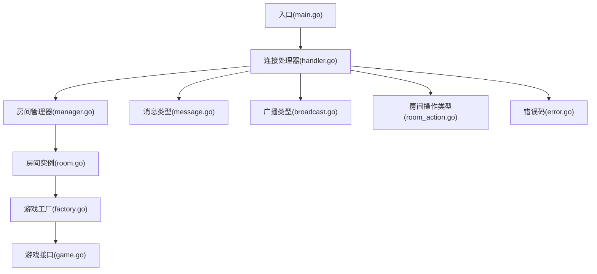
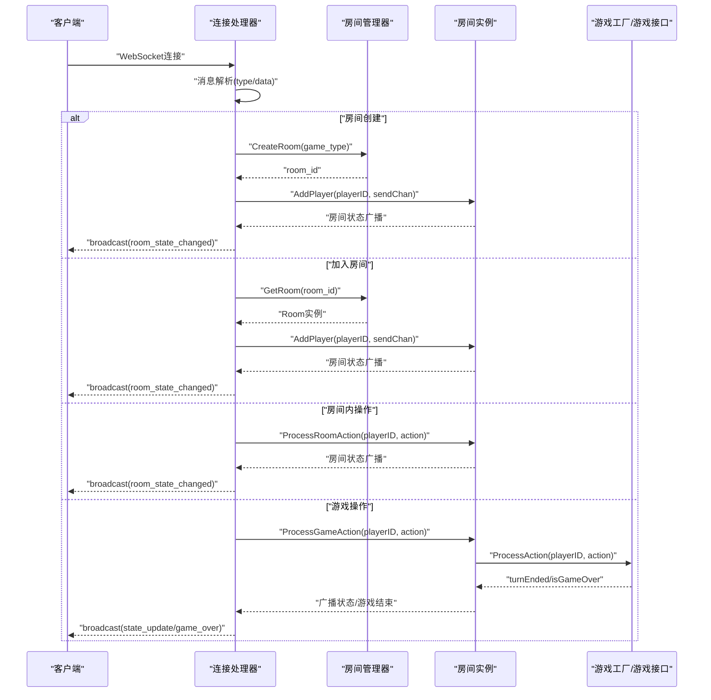
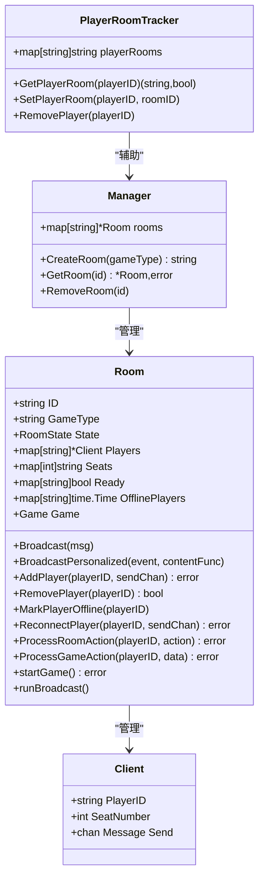
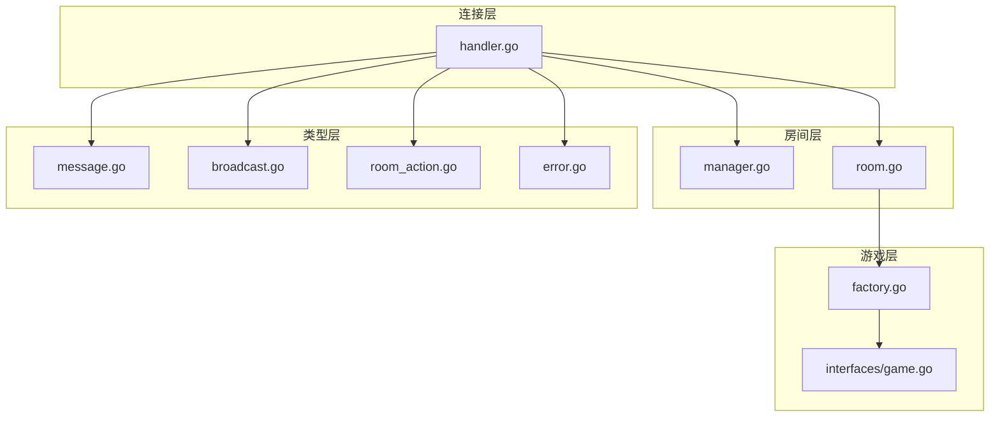

# 房间操作API

<cite>
**本文档引用的文件**
- [main.go](file://main.go)
- [README.md](file://README.md)
- [internal/connection/handler.go](file://internal/connection/handler.go)
- [internal/room/manager.go](file://internal/room/manager.go)
- [internal/room/room.go](file://internal/room/room.go)
- [internal/types/message.go](file://internal/types/message.go)
- [internal/types/broadcast.go](file://internal/types/broadcast.go)
- [internal/types/room_action.go](file://internal/types/room_action.go)
- [internal/types/error.go](file://internal/types/error.go)
- [internal/game/factory.go](file://internal/game/factory.go)
- [internal/game/interfaces/game.go](file://internal/game/interfaces/game.go)
- [client.html](file://client.html)
</cite>

## 目录
1. [简介](#简介)
2. [项目结构](#项目结构)
3. [核心组件](#核心组件)
4. [架构概览](#架构概览)
5. [详细组件分析](#详细组件分析)
6. [依赖关系分析](#依赖关系分析)
7. [性能考虑](#性能考虑)
8. [故障排除指南](#故障排除指南)
9. [结论](#结论)
10. [附录](#附录)

## 简介
本文件为房间操作API的完整技术文档，涵盖房间相关的所有API接口，包括创建房间、加入房间、离开房间、踢出玩家等操作的消息格式与处理逻辑。文档还详细说明了房间状态查询接口、房间配置管理API、安全验证机制、使用示例、API版本兼容性说明、并发处理策略与性能考虑，以及常见问题的故障排除指南。

## 项目结构
该项目采用模块化设计，主要分为以下层次：
- 入口层：HTTP路由与WebSocket升级
- 连接层：WebSocket连接管理与消息分发
- 房间管理层：全局房间管理与玩家追踪
- 房间实例层：房间状态、玩家座位、游戏逻辑协调
- 类型定义层：消息协议、事件类型、错误码
- 游戏工厂层：游戏类型注册与实例化

图表来源
- [main.go](file://main.go#L10-L14)
- [internal/connection/handler.go](file://internal/connection/handler.go#L19-L158)
- [internal/room/manager.go](file://internal/room/manager.go#L47-L82)
- [internal/room/room.go](file://internal/room/room.go#L35-L57)
- [internal/game/factory.go](file://internal/game/factory.go#L11-L23)
- [internal/types/message.go](file://internal/types/message.go#L32-L78)
- [internal/types/broadcast.go](file://internal/types/broadcast.go#L17-L48)
- [internal/types/room_action.go](file://internal/types/room_action.go#L3-L10)
- [internal/types/error.go](file://internal/types/error.go#L3-L12)

章节来源
- [main.go](file://main.go#L10-L14)
- [README.md](file://README.md#L20-L50)

## 核心组件
- WebSocket连接处理器：负责WebSocket升级、消息解析与分发、错误处理与资源清理。
- 房间管理器：全局房间管理、房间创建与查找、玩家房间追踪。
- 房间实例：房间状态维护、玩家加入/离开、座位分配、准备状态管理、游戏开始与结束、断线重连与超时处理、广播消息。
- 类型定义：统一消息结构、事件类型、房间操作类型、错误码。
- 游戏工厂：根据游戏类型创建对应游戏实例，支持扩展新游戏。

章节来源
- [internal/connection/handler.go](file://internal/connection/handler.go#L19-L158)
- [internal/room/manager.go](file://internal/room/manager.go#L47-L82)
- [internal/room/room.go](file://internal/room/room.go#L14-L657)
- [internal/types/message.go](file://internal/types/message.go#L32-L78)
- [internal/types/broadcast.go](file://internal/types/broadcast.go#L17-L48)
- [internal/types/room_action.go](file://internal/types/room_action.go#L3-L10)
- [internal/types/error.go](file://internal/types/error.go#L3-L12)
- [internal/game/factory.go](file://internal/game/factory.go#L11-L23)

## 架构概览
WebSocket连接建立后，客户端通过统一的消息协议与服务器交互。消息类型包括房间管理类、房间内操作类、游戏操作类、广播与错误类。服务器根据消息类型分派到相应的处理函数，房间实例负责房间状态与玩家管理，游戏工厂负责游戏逻辑的实例化与调度。

图表来源
- [internal/connection/handler.go](file://internal/connection/handler.go#L131-L156)
- [internal/room/manager.go](file://internal/room/manager.go#L54-L74)
- [internal/room/room.go](file://internal/room/room.go#L59-L96)
- [internal/room/room.go](file://internal/room/room.go#L297-L316)
- [internal/room/room.go](file://internal/room/room.go#L462-L523)
- [internal/game/factory.go](file://internal/game/factory.go#L11-L23)

## 详细组件分析

### WebSocket连接与消息处理
- 连接升级：通过gorilla/websocket进行升级，支持跨域。
- 玩家标识：从URL参数获取playerID，若缺失则生成随机ID；同一playerID不允许重复连接。
- 消息分发：根据消息类型解析data字段，分派到对应的处理函数。
- 断线处理：连接断开时清理玩家房间记录、标记断线或移除玩家、停止定时器、关闭广播通道。

章节来源
- [internal/connection/handler.go](file://internal/connection/handler.go#L19-L158)
- [internal/connection/handler.go](file://internal/connection/handler.go#L63-L88)

### 房间管理器
- 全局房间管理：维护房间映射，提供创建、查找、移除房间能力。
- 玩家房间追踪：维护playerID到roomID的映射，支持查询、设置、移除。
- 线程安全：使用互斥锁保护房间映射与玩家追踪表。

章节来源
- [internal/room/manager.go](file://internal/room/manager.go#L47-L82)
- [internal/room/manager.go](file://internal/room/manager.go#L17-L45)

### 房间实例
- 房间状态：waiting、playing、paused、gameover。
- 玩家管理：加入、离开、断线标记、重连、座位分配。
- 准备状态：准备/取消准备，自动开始游戏条件检查。
- 游戏开始：按座位顺序初始化游戏，个性化广播游戏开始。
- 游戏进行：处理游戏动作，防抖控制，回合切换，游戏结束广播。
- 广播机制：普通广播与个性化广播，过滤断线玩家，非阻塞发送。
- 断线保护：30秒断线超时，超时后清理断线玩家并结束游戏。

图表来源
- [internal/room/room.go](file://internal/room/room.go#L14-L657)
- [internal/room/manager.go](file://internal/room/manager.go#L47-L82)

章节来源
- [internal/room/room.go](file://internal/room/room.go#L14-L657)
- [internal/room/room.go](file://internal/room/room.go#L59-L96)
- [internal/room/room.go](file://internal/room/room.go#L134-L220)
- [internal/room/room.go](file://internal/room/room.go#L223-L257)
- [internal/room/room.go](file://internal/room/room.go#L297-L316)
- [internal/room/room.go](file://internal/room/room.go#L319-L348)
- [internal/room/room.go](file://internal/room/room.go#L351-L388)
- [internal/room/room.go](file://internal/room/room.go#L462-L523)
- [internal/room/room.go](file://internal/room/room.go#L540-L566)
- [internal/room/room.go](file://internal/room/room.go#L568-L656)

### 消息协议与事件类型
- 消息类型：room.create、room.join、room.leave、room.action、game.action、chat、broadcast、error。
- 房间状态：waiting、playing、paused、gameover。
- 事件类型：room_state_changed、game_started、game_over、state_update、chat。
- 错误码：400、403、404、409、410、411、500、501。

章节来源
- [internal/types/message.go](file://internal/types/message.go#L13-L30)
- [internal/types/message.go](file://internal/types/message.go#L3-L11)
- [internal/types/broadcast.go](file://internal/types/broadcast.go#L3-L15)
- [internal/types/error.go](file://internal/types/error.go#L3-L12)

### 房间操作API定义

#### 创建房间
- 请求格式
  - type: "room.create"
  - data: { game_type: string }
- 响应结构
  - 成功：broadcast(room_state_changed) 包含房间ID与初始状态
  - 失败：error(code, message)
- 处理逻辑
  - 校验玩家是否已在房间中
  - 参数校验（game_type不能为空）
  - 调用房间管理器创建房间
  - 将创建者加入房间并记录玩家房间映射

章节来源
- [internal/connection/handler.go](file://internal/connection/handler.go#L160-L221)
- [internal/room/manager.go](file://internal/room/manager.go#L54-L64)
- [internal/room/room.go](file://internal/room/room.go#L59-L96)

#### 加入房间
- 请求格式
  - type: "room.join"
  - data: { room_id: string }
- 响应结构
  - 成功：broadcast(room_state_changed) 包含房间状态
  - 失败：error(code, message)
- 处理逻辑
  - 校验玩家是否已在房间中
  - 参数校验（room_id不能为空）
  - 获取房间实例并加入
  - 记录玩家房间映射

章节来源
- [internal/connection/handler.go](file://internal/connection/handler.go#L223-L282)
- [internal/room/room.go](file://internal/room/room.go#L59-L96)

#### 离开房间
- 请求格式
  - type: "room.leave"
  - data: {}
- 响应结构
  - 成功：broadcast(room_state_changed) 包含玩家离开消息
  - 失败：error(code, message)
- 处理逻辑
  - 校验玩家是否在房间中
  - 调用房间实例移除玩家
  - 若房间为空，清理资源并从管理器移除

章节来源
- [internal/connection/handler.go](file://internal/connection/handler.go#L383-L421)
- [internal/room/room.go](file://internal/room/room.go#L259-L294)

#### 踢出玩家
- 当前实现
  - 服务器未提供显式的踢出玩家API
  - 可通过断线超时机制自动清理离线玩家
- 建议扩展
  - 新增踢出玩家消息类型与处理逻辑
  - 权限校验：仅房主或管理员可执行
  - 广播踢出通知并清理玩家房间映射

章节来源
- [internal/room/room.go](file://internal/room/room.go#L171-L220)

#### 房间内操作
- 操作类型
  - ready: 准备/取消准备
  - sit: 选择座位
- 请求格式
  - type: "room.action"
  - data: { action: "ready"|"sit", data: { ready: boolean }|{ seat_number: int } }
- 响应结构
  - 成功：broadcast(room_state_changed) 包含状态变更
  - 失败：error(code, message)
- 处理逻辑
  - 校验玩家是否在房间中
  - 解析操作数据并调用房间实例处理
  - 自动开始游戏条件满足时启动游戏

章节来源
- [internal/types/room_action.go](file://internal/types/room_action.go#L3-L10)
- [internal/connection/handler.go](file://internal/connection/handler.go#L383-L421)
- [internal/room/room.go](file://internal/room/room.go#L297-L316)
- [internal/room/room.go](file://internal/room/room.go#L319-L348)
- [internal/room/room.go](file://internal/room/room.go#L351-L388)

#### 游戏操作
- 请求格式
  - type: "game.action"
  - data: { action: string, card?: any }
- 响应结构
  - 成功：broadcast(state_update) 或 broadcast(game_over)
  - 失败：error(code, message)
- 处理逻辑
  - 校验玩家是否在房间中
  - 调用房间实例处理游戏动作
  - 防抖控制（100ms内重复操作忽略）
  - 回合结束时推进回合并广播状态

章节来源
- [internal/connection/handler.go](file://internal/connection/handler.go#L335-L381)
- [internal/room/room.go](file://internal/room/room.go#L462-L523)

#### 聊天消息
- 请求格式
  - type: "chat"
  - data: { content: string }
- 响应结构
  - 成功：broadcast(chat) 包含发送者与内容
  - 失败：error(code, message)
- 处理逻辑
  - 校验玩家是否在房间中
  - 广播聊天消息给所有在线玩家

章节来源
- [internal/connection/handler.go](file://internal/connection/handler.go#L284-L333)
- [internal/types/broadcast.go](file://internal/types/broadcast.go#L28-L32)

### 房间状态查询接口
- 房间详情获取
  - 通过房间状态广播消息中的RoomStateContent获取房间ID、状态、玩家列表与消息
- 玩家列表查询
  - PlayerSeatInfo数组包含player_id、seat_number、ready状态
- 座位状态检查
  - 通过Seats映射与PlayerSeatInfo中的seat_number判断座位占用情况

章节来源
- [internal/types/broadcast.go](file://internal/types/broadcast.go#L34-L47)
- [internal/room/room.go](file://internal/room/room.go#L433-L458)

### 房间配置管理API
- 最大玩家数量设置
  - 由具体游戏类型决定（通过Game接口的MaxPlayers/MinPlayers）
- 游戏类型选择
  - 创建房间时指定game_type："simple"|"ddz"|"mahjong"
- 房间属性修改
  - 当前实现未提供动态修改房间属性的API
  - 建议扩展：新增修改房间属性的消息类型与处理逻辑

章节来源
- [internal/game/factory.go](file://internal/game/factory.go#L11-L23)
- [internal/game/interfaces/game.go](file://internal/game/interfaces/game.go#L14-L15)

### 安全验证机制
- 身份认证
  - URL参数player=xxx作为玩家标识
  - 同一playerID不允许重复连接
- 权限检查
  - 房间内操作需验证玩家在房间中
  - 游戏操作需验证玩家在房间中且游戏未暂停/结束
- 操作授权
  - 准备/取消准备：仅房间等待中有效
  - 选座：仅房间等待中有效，座位号范围校验
  - 游戏动作：按游戏规则校验（由具体游戏实现）

章节来源
- [internal/connection/handler.go](file://internal/connection/handler.go#L35-L44)
- [internal/connection/handler.go](file://internal/connection/handler.go#L456-L473)
- [internal/room/room.go](file://internal/room/room.go#L66-L68)
- [internal/room/room.go](file://internal/room/room.go#L355-L357)

### 使用示例

#### 客户端集成（JavaScript）
- 连接服务器
  - ws = new WebSocket("ws://localhost:8080/ws?player=玩家ID")
- 创建房间
  - ws.send(JSON.stringify({ type: "room.create", data: { game_type: "simple" } }))
- 加入房间
  - ws.send(JSON.stringify({ type: "room.join", data: { room_id: "房间号" } }))
- 准备/取消准备
  - ws.send(JSON.stringify({ type: "room.action", room_id: "房间号", data: { action: "ready", data: { ready: true } } }))
- 选择座位
  - ws.send(JSON.stringify({ type: "room.action", room_id: "房间号", data: { action: "sit", data: { seat_number: 0 } } }))
- 出牌
  - ws.send(JSON.stringify({ type: "game.action", room_id: "房间号", data: { action: "play_card", card: "牌面" } }))
- 聊天
  - ws.send(JSON.stringify({ type: "chat", room_id: "房间号", data: { content: "消息内容" } }))

章节来源
- [client.html](file://client.html#L134-L151)
- [client.html](file://client.html#L252-L266)
- [README.md](file://README.md#L89-L95)

#### 服务器端处理逻辑
- 连接处理器：解析消息类型，分派到相应处理函数
- 房间管理器：创建/查找/移除房间
- 房间实例：维护房间状态、玩家管理、游戏逻辑协调
- 游戏工厂：根据游戏类型创建游戏实例

章节来源
- [internal/connection/handler.go](file://internal/connection/handler.go#L131-L156)
- [internal/room/manager.go](file://internal/room/manager.go#L54-L74)
- [internal/room/room.go](file://internal/room/room.go#L59-L96)
- [internal/game/factory.go](file://internal/game/factory.go#L11-L23)

### API版本兼容性说明与迁移指南
- 版本策略
  - 当前版本为基础实现，消息格式与事件类型保持稳定
- 兼容性
  - 消息类型与事件类型未引入破坏性变更
- 迁移建议
  - 新增房间属性修改API时，保持现有消息格式不变
  - 新增踢出玩家API时，建议使用新的消息类型避免与现有类型冲突

章节来源
- [README.md](file://README.md#L77-L103)

### 并发处理策略与性能考虑
- 并发模型
  - 房间实例使用互斥锁保护共享状态
  - 广播通道使用带缓冲的channel，异步发送保证顺序
  - 个性化广播通过ContentFunc生成每玩家专属内容
- 性能优化
  - 防抖控制：游戏动作100ms内重复操作忽略
  - 非阻塞发送：消息队列满时丢弃避免阻塞
  - 断线超时：30秒自动清理离线玩家
  - 广播过滤：跳过断线玩家与无Send channel的玩家

章节来源
- [internal/room/room.go](file://internal/room/room.go#L476-L482)
- [internal/room/room.go](file://internal/room/room.go#L589-L610)
- [internal/room/room.go](file://internal/room/room.go#L614-L655)

## 依赖关系分析

图表来源
- [internal/connection/handler.go](file://internal/connection/handler.go#L19-L158)
- [internal/room/manager.go](file://internal/room/manager.go#L47-L82)
- [internal/room/room.go](file://internal/room/room.go#L35-L57)
- [internal/types/message.go](file://internal/types/message.go#L32-L78)
- [internal/types/broadcast.go](file://internal/types/broadcast.go#L17-L48)
- [internal/types/room_action.go](file://internal/types/room_action.go#L3-L10)
- [internal/types/error.go](file://internal/types/error.go#L3-L12)
- [internal/game/factory.go](file://internal/game/factory.go#L11-L23)
- [internal/game/interfaces/game.go](file://internal/game/interfaces/game.go#L4-L16)

章节来源
- [internal/connection/handler.go](file://internal/connection/handler.go#L19-L158)
- [internal/room/room.go](file://internal/room/room.go#L35-L57)
- [internal/game/factory.go](file://internal/game/factory.go#L11-L23)

## 性能考虑
- 广播性能：使用带缓冲的channel与非阻塞发送，避免单个客户端阻塞影响整体广播
- 防抖机制：减少重复操作对游戏逻辑的影响
- 断线处理：及时清理离线玩家，避免资源浪费
- 线程安全：互斥锁保护共享状态，避免竞态条件

## 故障排除指南
- 常见错误码
  - 400：消息格式错误/参数无效
  - 403：加入房间失败（房间已满/游戏进行中）
  - 404：房间不存在
  - 409：玩家已在房间中
  - 410：玩家已在其他连接中登录
  - 411：玩家不在房间中
  - 500：内部错误
  - 501：未实现
- 排查步骤
  - 检查消息格式与必填字段
  - 确认玩家在正确的房间中
  - 查看房间状态是否允许当前操作
  - 检查网络连接与心跳机制

章节来源
- [internal/types/error.go](file://internal/types/error.go#L3-L12)
- [internal/connection/handler.go](file://internal/connection/handler.go#L110-L120)
- [internal/connection/handler.go](file://internal/connection/handler.go#L456-L473)

## 结论
本房间操作API提供了完整的房间生命周期管理、玩家管理、游戏协调与广播机制。通过统一的消息协议与严格的错误处理，确保了系统的稳定性与可扩展性。未来可进一步扩展房间属性修改与踢出玩家等功能，同时保持现有API的向后兼容性。

## 附录
- 测试客户端：提供简易游戏、斗地主、麻将三种测试客户端，便于快速验证API功能
- 快速开始：安装依赖后启动服务器，访问测试客户端进行联调

章节来源
- [README.md](file://README.md#L69-L76)
- [README.md](file://README.md#L61-L67)