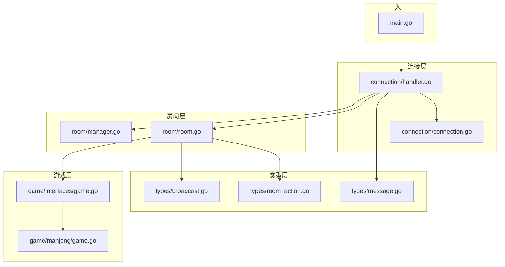
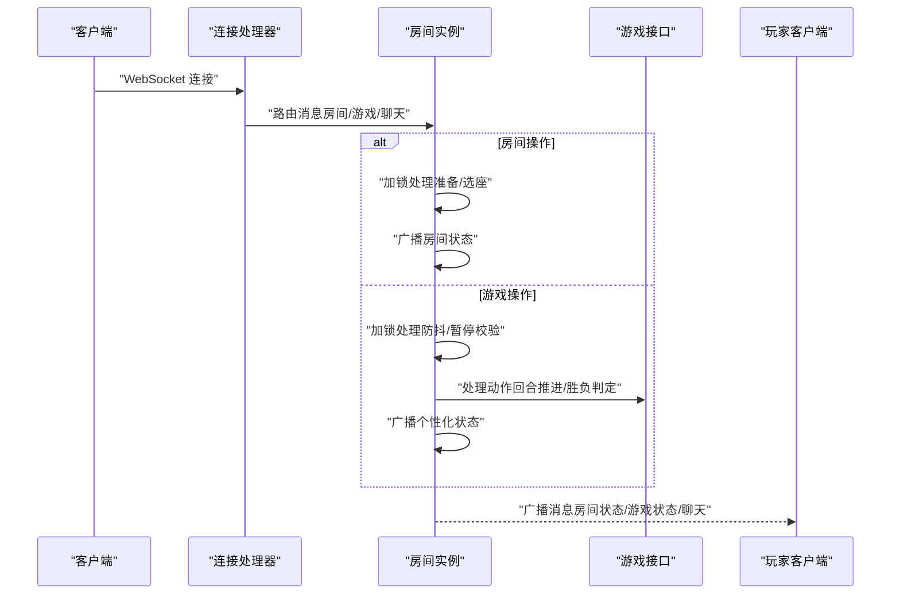
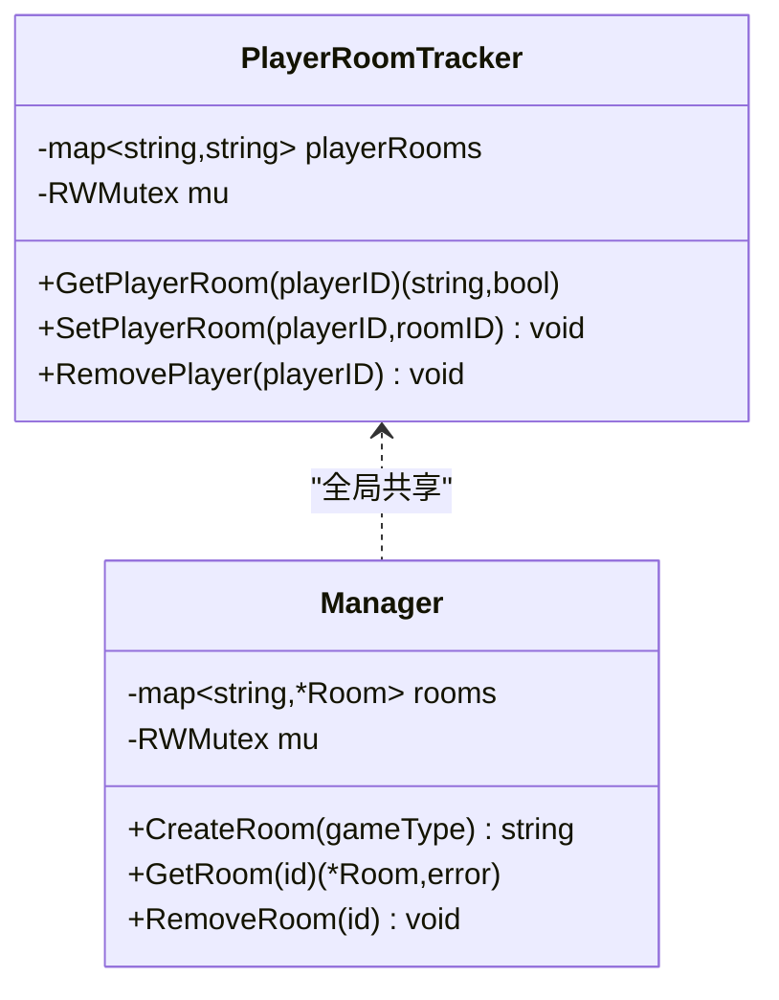
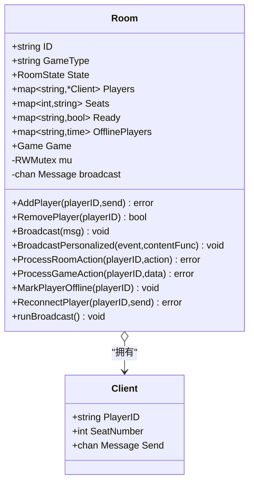
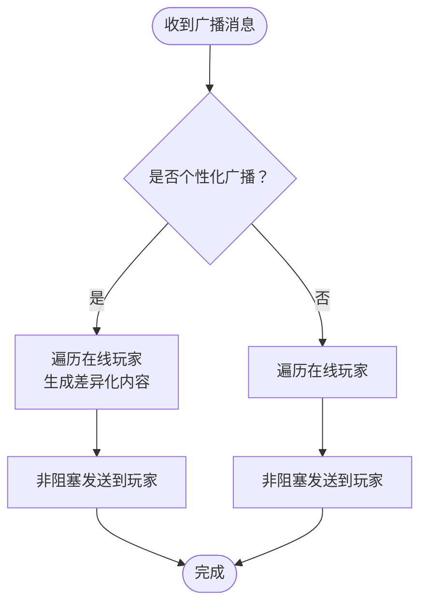
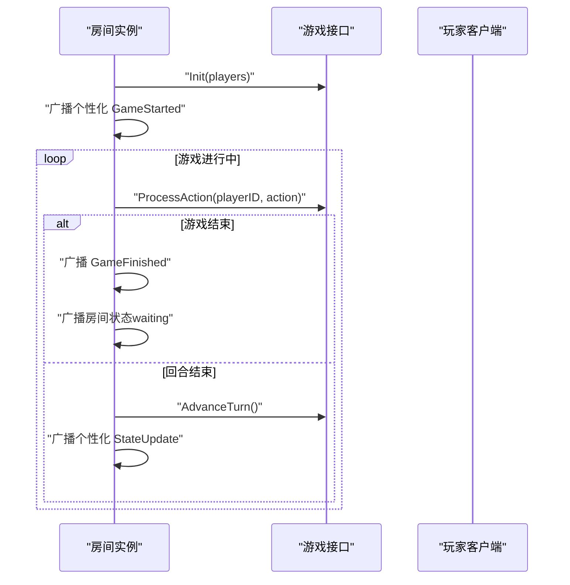
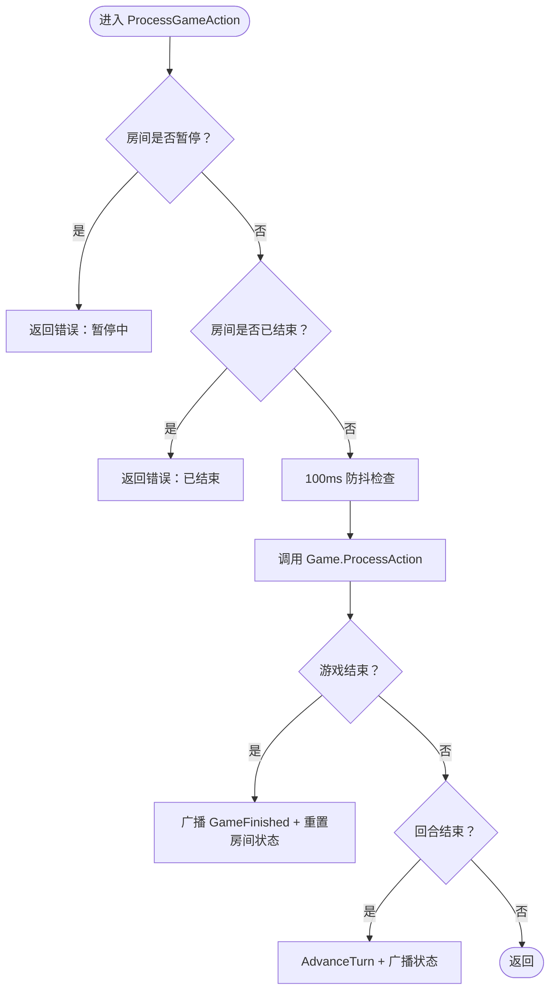
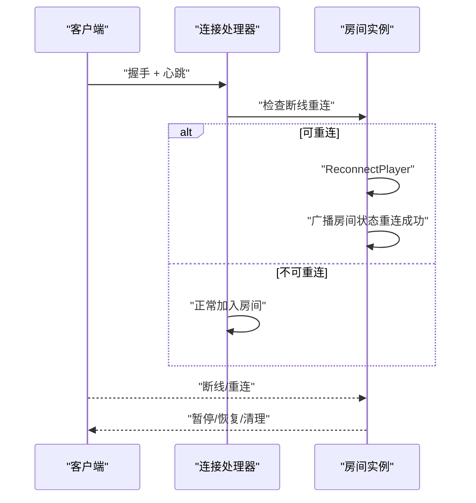
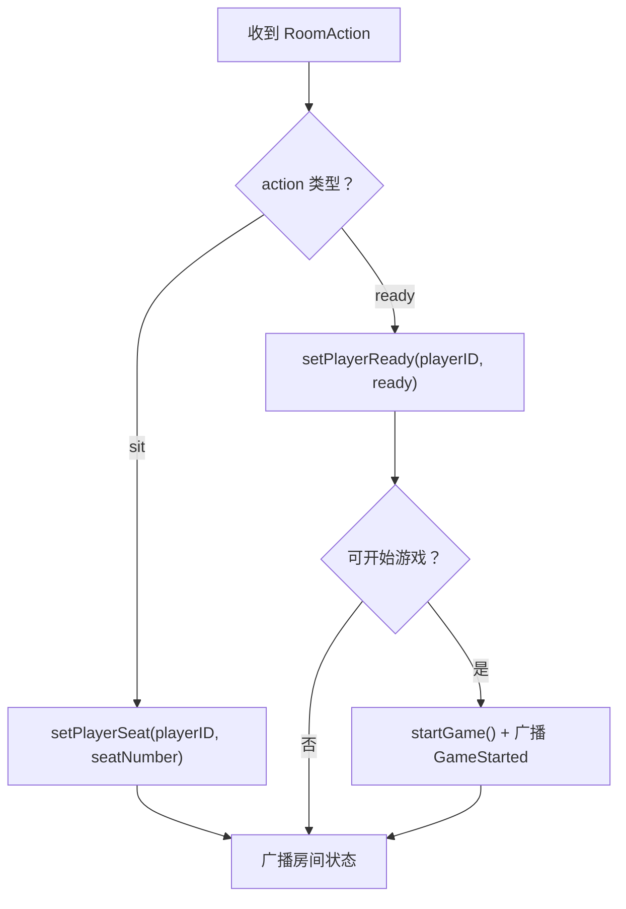
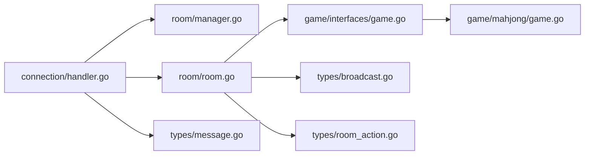

# 房间状态同步

<cite>
**本文引用的文件**
- [main.go](file://main.go)
- [README.md](file://README.md)
- [internal/connection/connection.go](file://internal/connection/connection.go)
- [internal/connection/handler.go](file://internal/connection/handler.go)
- [internal/room/manager.go](file://internal/room/manager.go)
- [internal/room/room.go](file://internal/room/room.go)
- [internal/types/message.go](file://internal/types/message.go)
- [internal/types/broadcast.go](file://internal/types/broadcast.go)
- [internal/types/room_action.go](file://internal/types/room_action.go)
- [internal/game/interfaces/game.go](file://internal/game/interfaces/game.go)
- [internal/game/mahjong/game.go](file://internal/game/mahjong/game.go)
</cite>

## 目录
1. [简介](#简介)
2. [项目结构](#项目结构)
3. [核心组件](#核心组件)
4. [架构总览](#架构总览)
5. [详细组件分析](#详细组件分析)
6. [依赖关系分析](#依赖关系分析)
7. [性能与优化](#性能与优化)
8. [故障恢复与排障](#故障恢复与排障)
9. [结论](#结论)
10. [附录](#附录)

## 简介
本文件围绕“房间状态同步”主题，系统性梳理并文档化卡牌游戏服务器中的状态一致性保障机制。重点覆盖以下方面：
- 状态变更传播路径与顺序保证
- 客户端同步与个性化消息广播
- 冲突与并发控制策略（锁、防抖、断线暂停）
- 广播系统设计（消息格式、目标筛选、可靠性）
- 状态快照与增量更新（房间状态、游戏状态）
- 性能优化（批量/非阻塞、延迟同步、带宽控制）
- 错误恢复（网络中断、重连、超时处理）
- 监控与调试（日志、状态检查）

## 项目结构
该项目采用模块化分层设计，核心模块如下：
- 连接层：WebSocket 连接管理、心跳、消息路由
- 房间层：房间生命周期、玩家管理、状态广播
- 类型层：消息与广播格式、房间状态枚举
- 游戏层：统一游戏接口与具体游戏实现

图表来源
- [main.go](file://main.go#L10-L14)
- [internal/connection/handler.go](file://internal/connection/handler.go#L19-L158)
- [internal/room/manager.go](file://internal/room/manager.go#L47-L82)
- [internal/room/room.go](file://internal/room/room.go#L14-L27)
- [internal/types/message.go](file://internal/types/message.go#L32-L78)
- [internal/types/broadcast.go](file://internal/types/broadcast.go#L1-L48)
- [internal/types/room_action.go](file://internal/types/room_action.go#L1-L10)
- [internal/game/interfaces/game.go](file://internal/game/interfaces/game.go#L3-L23)
- [internal/game/mahjong/game.go](file://internal/game/mahjong/game.go#L51-L81)

章节来源
- [README.md](file://README.md#L20-L50)
- [main.go](file://main.go#L10-L14)

## 核心组件
- 连接处理器：负责 WebSocket 握手、消息解析、路由到房间与游戏处理
- 房间管理器：全局房间集合、玩家追踪、房间生命周期
- 房间实例：房间状态、玩家集合、座位映射、准备状态、断线管理、广播通道
- 类型系统：消息结构、广播事件、房间状态枚举、房间操作类型
- 游戏接口：统一游戏行为（初始化、动作处理、回合推进、状态查询）

章节来源
- [internal/connection/handler.go](file://internal/connection/handler.go#L19-L158)
- [internal/room/manager.go](file://internal/room/manager.go#L17-L82)
- [internal/room/room.go](file://internal/room/room.go#L14-L27)
- [internal/types/message.go](file://internal/types/message.go#L3-L11)
- [internal/types/broadcast.go](file://internal/types/broadcast.go#L3-L15)
- [internal/types/room_action.go](file://internal/types/room_action.go#L3-L9)
- [internal/game/interfaces/game.go](file://internal/game/interfaces/game.go#L3-L23)

## 架构总览
房间状态同步的关键流程：
- 客户端通过 WebSocket 连接，消息经连接处理器解析后路由至房间
- 房间根据操作类型分别处理房间级操作（准备/选座）与游戏级操作（出牌等）
- 房间维护自身状态与玩家集合，通过广播通道异步向所有在线客户端推送状态
- 游戏层提供个性化状态视图（含私密信息），房间通过个性化广播逐玩家推送

图表来源
- [internal/connection/handler.go](file://internal/connection/handler.go#L130-L156)
- [internal/room/room.go](file://internal/room/room.go#L296-L523)
- [internal/game/interfaces/game.go](file://internal/game/interfaces/game.go#L4-L22)

## 详细组件分析

### 房间管理器与玩家追踪
- 全局玩家追踪器：维护 playerID -> roomID 的映射，读写锁保护
- 房间管理器：全局 rooms 映射，读写锁保护；提供创建、获取、移除房间
- 并发控制：所有公共方法均使用互斥锁，避免竞态

图表来源
- [internal/room/manager.go](file://internal/room/manager.go#L17-L82)

章节来源
- [internal/room/manager.go](file://internal/room/manager.go#L17-L82)

### 房间实例与状态机
- 房间状态：waiting、playing、paused、gameover
- 玩家集合：Players（playerID -> Client）、Seats（seatNumber -> playerID）、Ready（准备状态）
- 断线管理：OfflinePlayers（断线时间戳）、断线超时定时器、暂停/恢复逻辑
- 广播通道：带缓冲的广播队列，runBroadcast 异步消费并发送给在线客户端
- 个性化广播：针对每个玩家生成差异化内容，避免泄露对手私密信息

图表来源
- [internal/room/room.go](file://internal/room/room.go#L14-L27)
- [internal/room/room.go](file://internal/room/room.go#L29-L33)

章节来源
- [internal/room/room.go](file://internal/room/room.go#L14-L27)
- [internal/room/room.go](file://internal/room/room.go#L59-L96)
- [internal/room/room.go](file://internal/room/room.go#L98-L131)
- [internal/room/room.go](file://internal/room/room.go#L133-L168)
- [internal/room/room.go](file://internal/room/room.go#L222-L257)
- [internal/room/room.go](file://internal/room/room.go#L259-L294)
- [internal/room/room.go](file://internal/room/room.go#L296-L523)
- [internal/room/room.go](file://internal/room/room.go#L568-L656)

### 广播系统设计
- 消息格式：Message（type、room_id、player_id、data）
- 广播事件：房间状态变更、游戏开始、游戏结束、状态更新、聊天
- 目标筛选：runBroadcast 仅向非断线且存在 Send 通道的在线玩家发送
- 可靠性：recover 捕获 panic；默认分支丢弃以避免阻塞；日志告警
- 个性化广播：BroadcastPersonalized 将生成函数封装为特殊消息，逐玩家生成差异化内容

图表来源
- [internal/room/room.go](file://internal/room/room.go#L568-L656)
- [internal/types/broadcast.go](file://internal/types/broadcast.go#L17-L47)
- [internal/types/message.go](file://internal/types/message.go#L32-L38)

章节来源
- [internal/room/room.go](file://internal/room/room.go#L98-L131)
- [internal/room/room.go](file://internal/room/room.go#L568-L656)
- [internal/types/broadcast.go](file://internal/types/broadcast.go#L17-L47)
- [internal/types/message.go](file://internal/types/message.go#L32-L38)

### 状态快照与增量更新
- 房间状态快照：broadcastRoomStateInternal 构造 RoomStateContent，包含房间ID、状态、玩家座位信息、消息
- 游戏状态快照：startGame 与 broadcastState 使用个性化广播，按玩家维度返回其专属状态（含私密信息）
- 增量更新：游戏动作处理后立即广播状态更新；回合切换后再次广播，确保一致性

图表来源
- [internal/room/room.go](file://internal/room/room.go#L540-L566)
- [internal/room/room.go](file://internal/room/room.go#L525-L538)
- [internal/room/room.go](file://internal/room/room.go#L462-L523)
- [internal/game/interfaces/game.go](file://internal/game/interfaces/game.go#L6-L11)

章节来源
- [internal/room/room.go](file://internal/room/room.go#L404-L459)
- [internal/room/room.go](file://internal/room/room.go#L525-L566)
- [internal/game/interfaces/game.go](file://internal/game/interfaces/game.go#L6-L11)

### 并发状态更新与冲突解决
- 互斥锁：房间实例与管理器均使用 RWMutex，所有写操作加锁
- 防抖：游戏动作处理中对同一玩家设置时间戳，100ms 内重复操作忽略
- 断线暂停：游戏中断线将房间置为 paused，等待重连；超时后结束并清理
- 死锁避免：锁粒度明确，避免跨模块交叉锁；广播通道异步消费，减少持有锁的时间

图表来源
- [internal/room/room.go](file://internal/room/room.go#L462-L523)

章节来源
- [internal/room/room.go](file://internal/room/room.go#L462-L523)
- [internal/room/room.go](file://internal/room/room.go#L133-L168)
- [internal/room/room.go](file://internal/room/room.go#L170-L220)

### 客户端同步与重连处理
- 心跳检测：每30秒 ping，60秒无响应关闭连接
- 重连流程：连接建立时检查断线重连，若房间处于 paused 且匹配，执行 ReconnectPlayer
- 断线清理：连接断开时根据房间状态决定标记断线或直接移除；超时后清理所有断线玩家

图表来源
- [internal/connection/handler.go](file://internal/connection/handler.go#L50-L60)
- [internal/room/room.go](file://internal/room/room.go#L222-L257)
- [internal/connection/connection.go](file://internal/connection/connection.go#L32-L61)

章节来源
- [internal/connection/handler.go](file://internal/connection/handler.go#L50-L60)
- [internal/room/room.go](file://internal/room/room.go#L133-L168)
- [internal/room/room.go](file://internal/room/room.go#L222-L257)
- [internal/connection/connection.go](file://internal/connection/connection.go#L32-L61)

### 房间级操作与状态变更
- 准备/取消准备：仅在 waiting 状态允许；全部玩家准备后自动开始游戏
- 选座：仅在 waiting 状态允许；座位占用校验
- 房间状态广播：每次状态变更都会构造 RoomStateContent 并广播

图表来源
- [internal/room/room.go](file://internal/room/room.go#L296-L316)
- [internal/room/room.go](file://internal/room/room.go#L318-L348)
- [internal/room/room.go](file://internal/room/room.go#L350-L388)
- [internal/room/room.go](file://internal/room/room.go#L390-L402)
- [internal/room/room.go](file://internal/room/room.go#L540-L566)

章节来源
- [internal/room/room.go](file://internal/room/room.go#L296-L388)
- [internal/room/room.go](file://internal/room/room.go#L404-L459)

### 游戏接口与状态查询
- 统一接口：Init、ProcessAction、CurrentTurn、AdvanceTurn、GetState、GetStateForPlayer、IsGameOver、Winner、MaxPlayers、MinPlayers
- 个性化状态：GetStateForPlayer 返回包含私密信息的状态视图，供房间个性化广播

章节来源
- [internal/game/interfaces/game.go](file://internal/game/interfaces/game.go#L3-L23)

## 依赖关系分析
- 连接处理器依赖房间管理器与房间实例，负责消息路由与错误反馈
- 房间实例依赖游戏接口，通过接口抽象支持多种游戏
- 类型系统为广播与消息提供统一的数据契约
- 游戏实现遵循接口规范，提供各自的状态与动作处理

图表来源
- [internal/connection/handler.go](file://internal/connection/handler.go#L19-L158)
- [internal/room/manager.go](file://internal/room/manager.go#L47-L82)
- [internal/room/room.go](file://internal/room/room.go#L14-L27)
- [internal/game/interfaces/game.go](file://internal/game/interfaces/game.go#L3-L23)
- [internal/game/mahjong/game.go](file://internal/game/mahjong/game.go#L51-L81)
- [internal/types/message.go](file://internal/types/message.go#L32-L78)
- [internal/types/broadcast.go](file://internal/types/broadcast.go#L17-L47)
- [internal/types/room_action.go](file://internal/types/room_action.go#L3-L9)

章节来源
- [internal/connection/handler.go](file://internal/connection/handler.go#L19-L158)
- [internal/room/room.go](file://internal/room/room.go#L14-L27)
- [internal/game/interfaces/game.go](file://internal/game/interfaces/game.go#L3-L23)

## 性能与优化
- 异步广播：广播通道带缓冲，runBroadcast 异步消费，避免主线程阻塞
- 非阻塞发送：select 默认分支丢弃消息，防止慢消费者拖垮广播
- 防抖：游戏动作 100ms 防抖，降低重复操作带来的广播压力
- 个性化广播：按玩家生成差异化内容，避免全量冗余广播
- 带宽优化：房间状态仅包含必要字段；游戏状态通过接口抽象，按需返回
- 心跳与超时：心跳检测及时发现异常连接，避免资源泄漏

章节来源
- [internal/room/room.go](file://internal/room/room.go#L98-L131)
- [internal/room/room.go](file://internal/room/room.go#L568-L656)
- [internal/room/room.go](file://internal/room/room.go#L476-L482)
- [internal/connection/connection.go](file://internal/connection/connection.go#L32-L61)

## 故障恢复与排障
- 网络中断：心跳超时触发连接关闭；房间根据状态标记断线或清理
- 断线重连：重连成功后恢复游戏状态；若仍有断线玩家则保持暂停
- 超时处理：断线超时后结束游戏并清理房间资源
- 错误反馈：连接处理器统一发送 error 消息，便于前端定位问题
- 日志记录：广播、断线、重连、超时、状态变更均有详细日志

章节来源
- [internal/connection/handler.go](file://internal/connection/handler.go#L95-L157)
- [internal/room/room.go](file://internal/room/room.go#L133-L168)
- [internal/room/room.go](file://internal/room/room.go#L170-L220)
- [internal/room/room.go](file://internal/room/room.go#L222-L257)

## 结论
本系统通过“房间实例 + 广播通道 + 游戏接口”的组合，实现了高可靠、低耦合的房间状态同步机制。借助互斥锁、防抖、断线暂停与超时清理等策略，有效保障了状态一致性与用户体验。广播系统的异步化与非阻塞发送提升了吞吐能力，个性化广播兼顾了隐私与性能。建议后续可进一步引入消息有序与去重机制，以增强复杂场景下的稳定性。

## 附录

### 关键流程与示例路径
- 房间创建与加入：[internal/connection/handler.go](file://internal/connection/handler.go#L160-L221)
- 房间操作（准备/选座）：[internal/room/room.go](file://internal/room/room.go#L296-L388)
- 游戏动作处理与广播：[internal/room/room.go](file://internal/room/room.go#L462-L523)
- 广播通道与个性化广播：[internal/room/room.go](file://internal/room/room.go#L98-L131), [internal/room/room.go](file://internal/room/room.go#L568-L656)
- 心跳与断线重连：[internal/connection/connection.go](file://internal/connection/connection.go#L32-L61), [internal/connection/handler.go](file://internal/connection/handler.go#L50-L60)

### 监控与调试要点
- 观察日志：关注房间状态变更、断线标记、重连恢复、超时清理等关键事件
- 检查广播：确认广播通道缓冲与发送队列长度，避免积压
- 校验状态：核对 RoomStateContent 与 Game.GetStateForPlayer 输出是否符合预期
- 性能指标：统计广播耗时、消息丢失率、断线重连成功率