# 房间生命周期管理

<cite>
**本文档引用的文件**
- [internal/room/manager.go](file://internal/room/manager.go)
- [internal/room/room.go](file://internal/room/room.go)
- [internal/types/room_action.go](file://internal/types/room_action.go)
- [internal/types/message.go](file://internal/types/message.go)
- [internal/types/broadcast.go](file://internal/types/broadcast.go)
- [internal/game/factory.go](file://internal/game/factory.go)
- [internal/game/interfaces/game.go](file://internal/game/interfaces/game.go)
- [internal/connection/handler.go](file://internal/connection/handler.go)
- [internal/game/simple/game.go](file://internal/game/simple/game.go)
- [main.go](file://main.go)
</cite>

## 目录
1. [简介](#简介)
2. [项目结构](#项目结构)
3. [核心组件](#核心组件)
4. [架构概览](#架构概览)
5. [详细组件分析](#详细组件分析)
6. [依赖关系分析](#依赖关系分析)
7. [性能考虑](#性能考虑)
8. [故障排除指南](#故障排除指南)
9. [结论](#结论)

## 简介

房间生命周期管理系统是卡牌游戏服务器的核心基础设施，负责管理游戏房间的完整生命周期，包括房间创建、初始化、运行状态维护和销毁机制。该系统采用Go语言实现，具有高并发安全性、完善的错误处理机制和灵活的扩展性。

系统支持多种卡牌游戏类型，包括简单的数字游戏、斗地主和麻将等，每种游戏都有特定的规则和状态管理逻辑。房间管理器提供全局的房间生命周期控制，而具体的房间实例则负责维护房间内的状态和玩家交互。

## 项目结构

项目采用模块化的目录结构，按照功能领域进行组织：

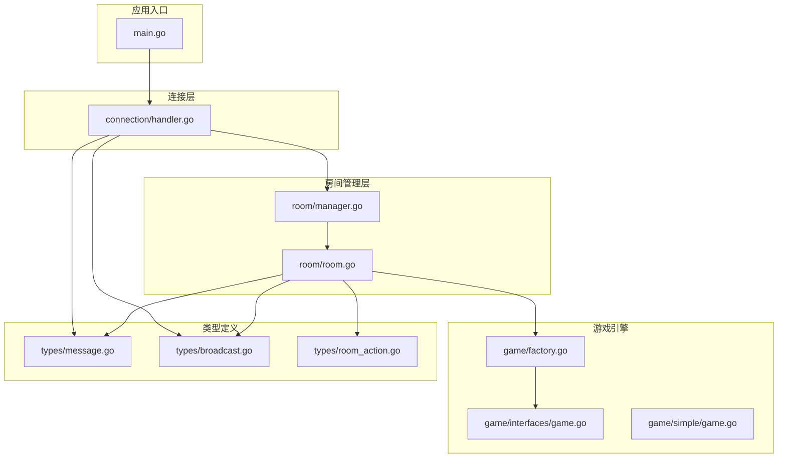

**图表来源**
- [main.go](file://main.go#L1-L15)
- [internal/connection/handler.go](file://internal/connection/handler.go#L1-L474)
- [internal/room/manager.go](file://internal/room/manager.go#L1-L83)
- [internal/room/room.go](file://internal/room/room.go#L1-L657)

**章节来源**
- [main.go](file://main.go#L1-L15)
- [internal/connection/handler.go](file://internal/connection/handler.go#L1-L474)

## 核心组件

### 房间管理器（Room Manager）

房间管理器是全局的房间生命周期控制器，提供房间的创建、查询和删除功能：

```mermaid
classDiagram
class Manager {
-rooms : map[string]*Room
-mu : RWMutex
+CreateRoom(gameType string) string
+GetRoom(id string) (*Room, error)
+RemoveRoom(id string) void
}
class PlayerRoomTracker {
-playerRooms : map[string]string
-mu : RWMutex
+GetPlayerRoom(playerID string) (string, bool)
+SetPlayerRoom(playerID, roomID string) void
+RemovePlayer(playerID string) void
}
class Room {
+ID : string
+GameType : string
+State : RoomState
+Players : map[string]*Client
+Seats : map[int]string
+Ready : map[string]bool
+OfflinePlayers : map[string]time.Time
+Game : Game
+mu : RWMutex
+broadcast : chan Message
+disconnectTimer : Timer
+AddPlayer(playerID string, sendChan chan Message) error
+RemovePlayer(playerID string) bool
+ProcessRoomAction(playerID string, action RoomActionData) error
+ProcessGameAction(playerID string, data GameActionData) error
+Broadcast(msg Message) void
+BroadcastPersonalized(event Event, contentFunc func(playerID string) interface{}) void
}
Manager --> Room : "管理"
PlayerRoomTracker --> Manager : "追踪玩家房间"
```

**图表来源**
- [internal/room/manager.go](file://internal/room/manager.go#L47-L83)
- [internal/room/room.go](file://internal/room/room.go#L14-L27)

### 房间状态管理

房间状态采用有限状态机模型，包含四种基本状态：

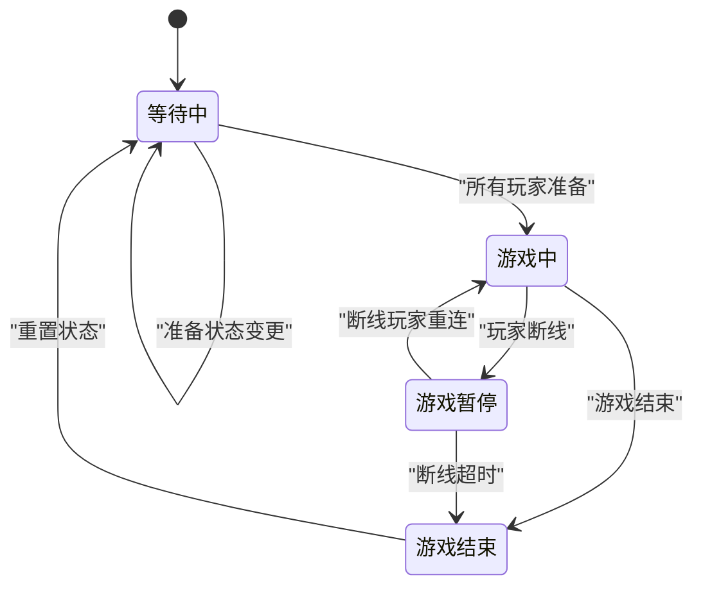

**图表来源**
- [internal/types/message.go](file://internal/types/message.go#L6-L11)
- [internal/room/room.go](file://internal/room/room.go#L540-L566)

**章节来源**
- [internal/room/manager.go](file://internal/room/manager.go#L1-L83)
- [internal/room/room.go](file://internal/room/room.go#L1-L657)

## 架构概览

系统采用分层架构设计，从下到上分为连接层、业务逻辑层和数据持久层：

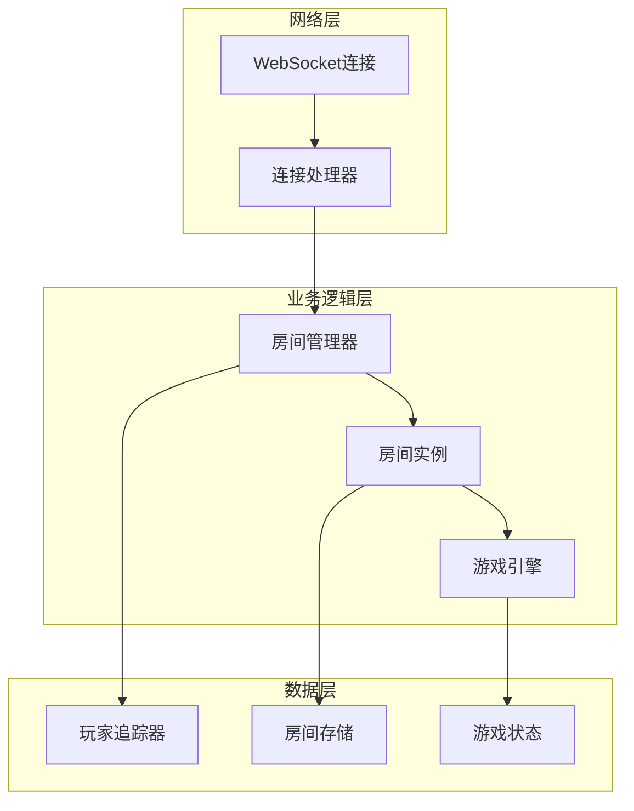

**图表来源**
- [internal/connection/handler.go](file://internal/connection/handler.go#L19-L158)
- [internal/room/manager.go](file://internal/room/manager.go#L47-L83)
- [internal/room/room.go](file://internal/room/room.go#L35-L57)

## 详细组件分析

### 房间创建流程

房间创建是一个原子性的操作，涉及多个步骤的协调：

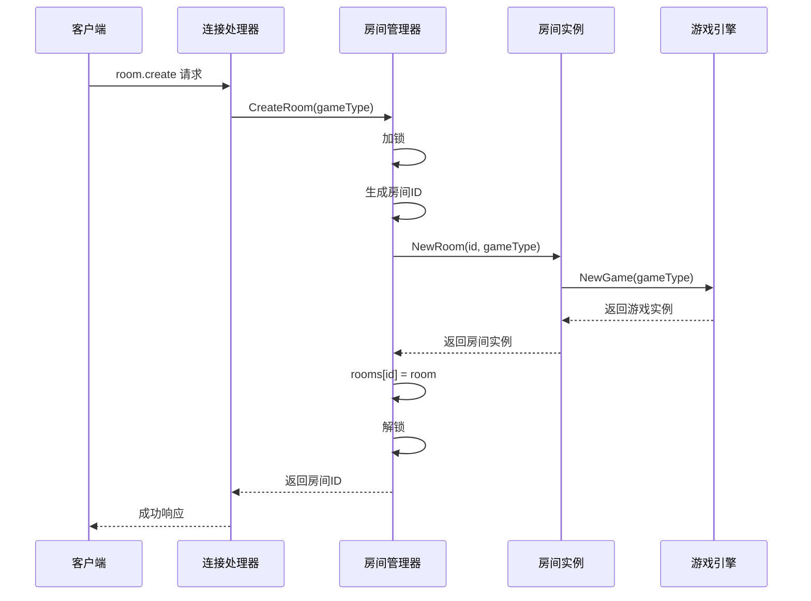

**图表来源**
- [internal/connection/handler.go](file://internal/connection/handler.go#L160-L221)
- [internal/room/manager.go](file://internal/room/manager.go#L54-L64)
- [internal/room/room.go](file://internal/room/room.go#L35-L57)

房间ID生成策略采用简单递增的方式：`room_{序号}`，其中序号基于当前房间数量加1。这种策略简单可靠，但在高并发环境下可能需要考虑更复杂的ID生成机制。

**章节来源**
- [internal/room/manager.go](file://internal/room/manager.go#L54-L64)
- [internal/room/room.go](file://internal/room/room.go#L35-L57)

### 房间初始化过程

房间初始化涉及游戏引擎的创建和状态设置：

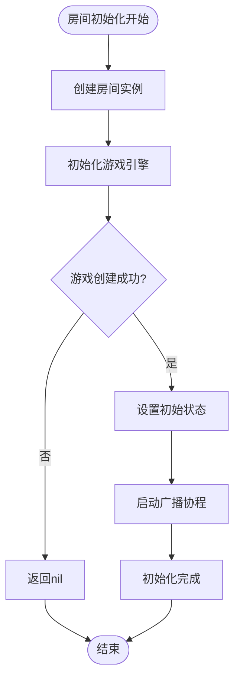

**图表来源**
- [internal/room/room.go](file://internal/room/room.go#L35-L57)
- [internal/game/factory.go](file://internal/game/factory.go#L12-L23)

### 玩家管理机制

房间提供完整的玩家生命周期管理：

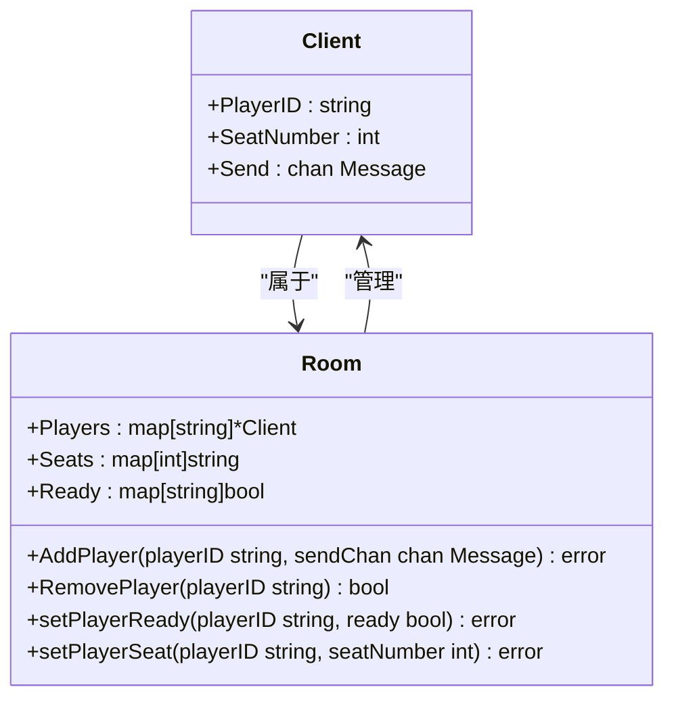

**图表来源**
- [internal/room/room.go](file://internal/room/room.go#L29-L33)
- [internal/room/room.go](file://internal/room/room.go#L59-L96)

**章节来源**
- [internal/room/room.go](file://internal/room/room.go#L59-L96)

### 游戏状态转换逻辑

游戏状态转换遵循严格的规则，确保游戏逻辑的一致性：

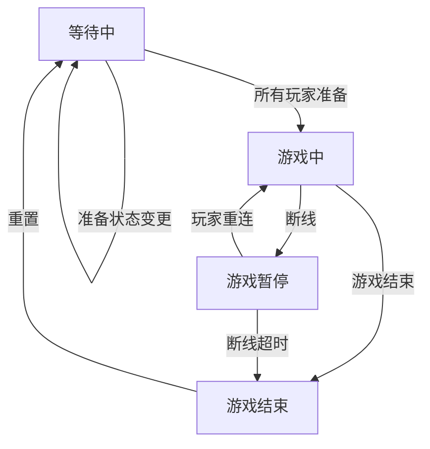

**图表来源**
- [internal/room/room.go](file://internal/room/room.go#L540-L566)
- [internal/room/room.go](file://internal/room/room.go#L171-L220)

**章节来源**
- [internal/room/room.go](file://internal/room/room.go#L540-L566)
- [internal/room/room.go](file://internal/room/room.go#L171-L220)

### 并发安全机制

系统采用读写锁确保并发访问的安全性：

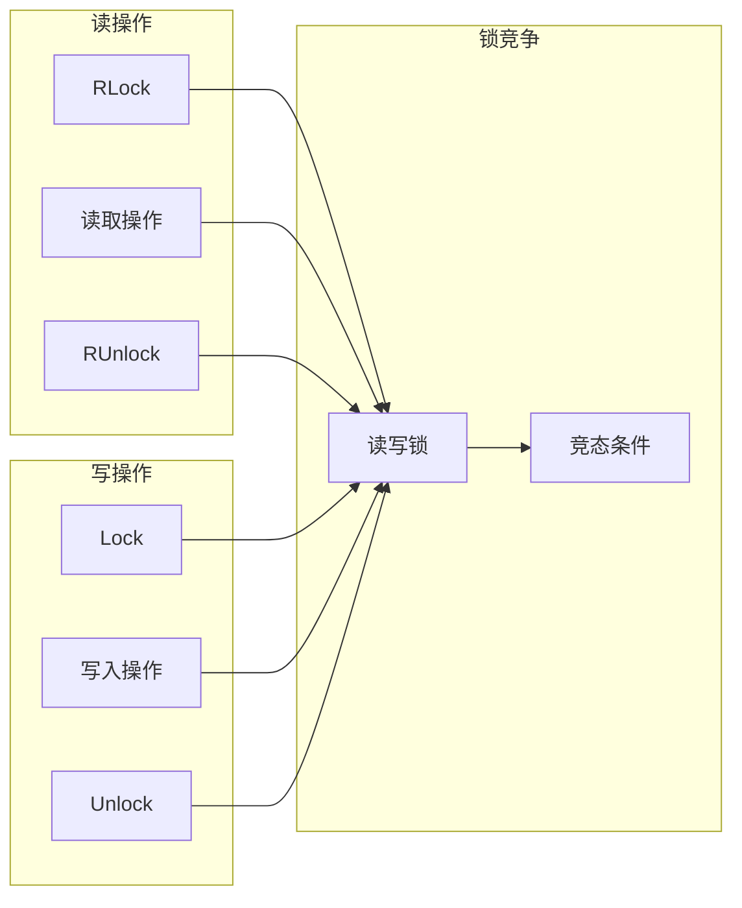

**图表来源**
- [internal/room/manager.go](file://internal/room/manager.go#L49-L49)
- [internal/room/room.go](file://internal/room/room.go#L23-L23)

系统中的关键并发保护点：
- 房间管理器使用读写锁保护房间映射
- 房间实例使用读写锁保护房间状态
- 玩家追踪器使用读写锁保护玩家房间映射

**章节来源**
- [internal/room/manager.go](file://internal/room/manager.go#L18-L45)
- [internal/room/room.go](file://internal/room/room.go#L14-L27)

### 错误处理和异常恢复

系统实现了多层次的错误处理机制：

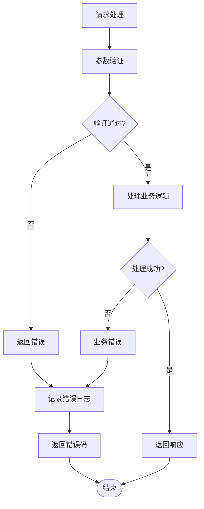

**图表来源**
- [internal/connection/handler.go](file://internal/connection/handler.go#L160-L221)
- [internal/room/room.go](file://internal/room/room.go#L59-L96)

**章节来源**
- [internal/connection/handler.go](file://internal/connection/handler.go#L160-L221)
- [internal/room/room.go](file://internal/room/room.go#L59-L96)

## 依赖关系分析

系统采用清晰的依赖层次结构：

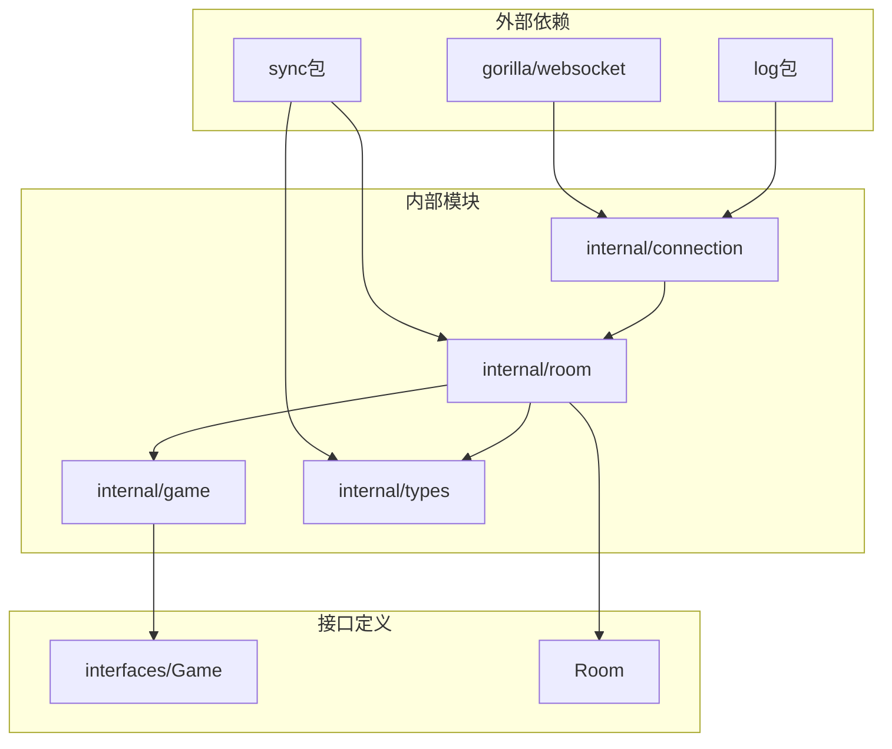

**图表来源**
- [internal/connection/handler.go](file://internal/connection/handler.go#L3-L13)
- [internal/room/room.go](file://internal/room/room.go#L3-L12)
- [internal/game/interfaces/game.go](file://internal/game/interfaces/game.go#L4-L16)

**章节来源**
- [internal/connection/handler.go](file://internal/connection/handler.go#L3-L13)
- [internal/room/room.go](file://internal/room/room.go#L3-L12)

## 性能考虑

### 广播机制优化

房间实现了高效的广播机制，支持普通广播和个性化广播：

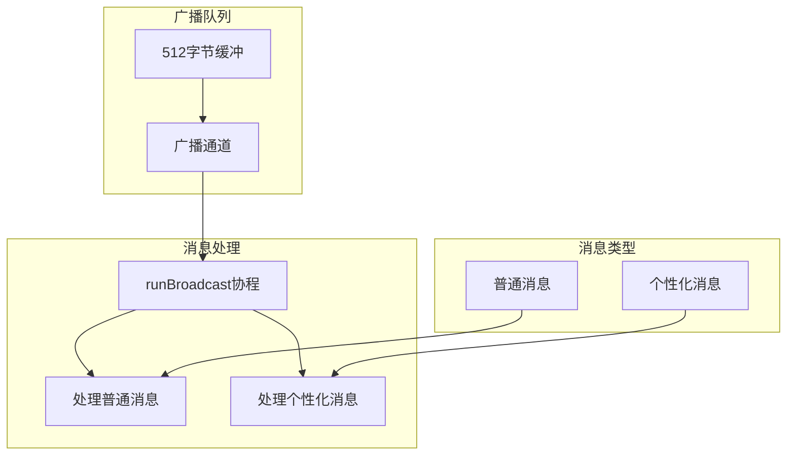

**图表来源**
- [internal/room/room.go](file://internal/room/room.go#L44-L56)
- [internal/room/room.go](file://internal/room/room.go#L568-L612)

### 内存管理策略

系统采用及时清理策略避免内存泄漏：

- 房间空闲时自动关闭广播通道
- 断线超时后清理所有断线玩家
- 连接断开时自动清理房间资源

**章节来源**
- [internal/room/room.go](file://internal/room/room.go#L212-L220)
- [internal/room/room.go](file://internal/room/room.go#L284-L294)

## 故障排除指南

### 常见问题诊断

1. **房间创建失败**
   - 检查游戏类型是否受支持
   - 验证房间管理器是否有足够的内存
   - 查看日志中的错误信息

2. **玩家加入失败**
   - 确认房间状态不是游戏中
   - 检查房间是否已满
   - 验证玩家ID是否唯一

3. **断线处理异常**
   - 检查断线定时器是否正确启动
   - 验证断线超时时间配置
   - 确认广播通道状态

**章节来源**
- [internal/room/room.go](file://internal/room/room.go#L134-L220)
- [internal/room/room.go](file://internal/room/room.go#L223-L257)

### 日志分析

系统提供了详细的日志记录，便于问题诊断：

- 房间创建和销毁日志
- 玩家加入和离开日志  
- 游戏状态变更日志
- 错误处理和异常日志

**章节来源**
- [internal/room/room.go](file://internal/room/room.go#L54-L56)
- [internal/room/room.go](file://internal/room/room.go#L154-L156)
- [internal/room/room.go](file://internal/room/room.go#L180-L195)

## 结论

房间生命周期管理系统是一个设计精良的并发系统，具有以下特点：

1. **模块化设计**：清晰的职责分离和接口定义
2. **并发安全**：完善的读写锁机制确保线程安全
3. **扩展性强**：支持多种游戏类型的灵活扩展
4. **错误处理完善**：多层次的错误处理和恢复机制
5. **性能优化**：高效的广播机制和内存管理策略

该系统为卡牌游戏提供了稳定可靠的基础设施，能够支持高并发的多人游戏场景。通过合理的架构设计和实现细节，确保了系统的可靠性、可维护性和可扩展性。