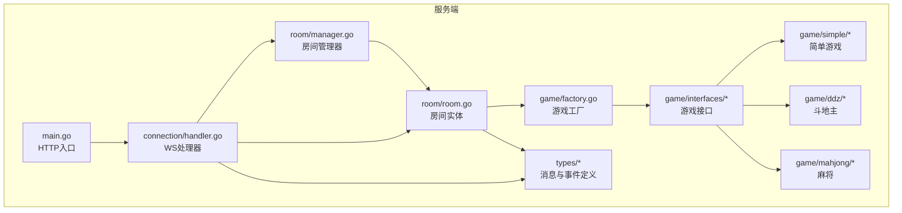
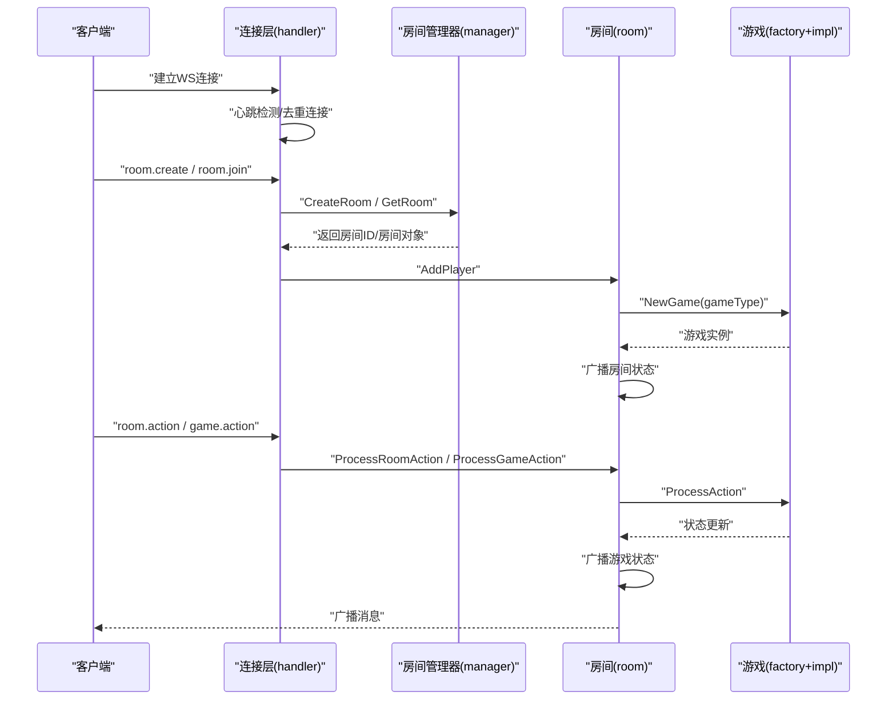
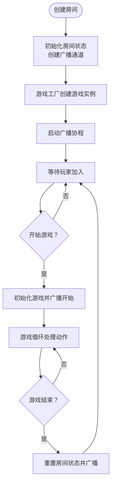
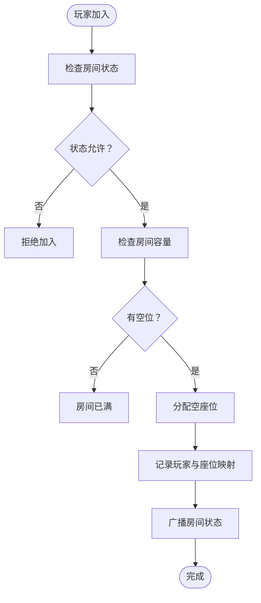
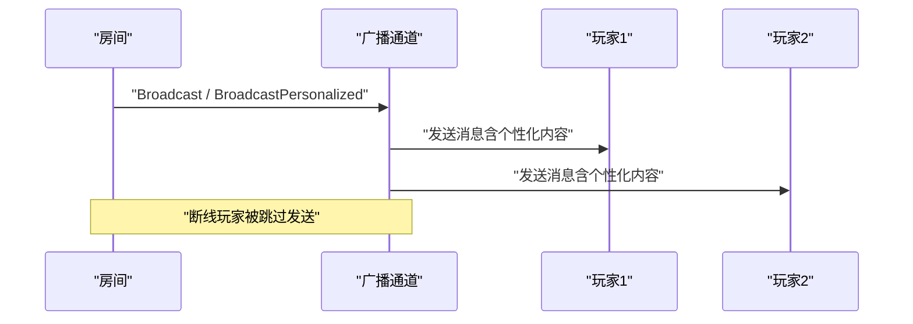
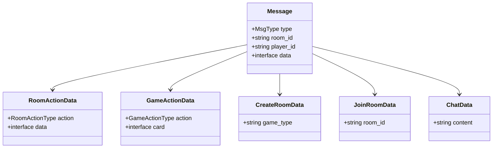
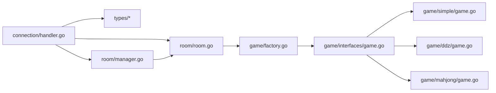

# 房间管理系统

<cite>
**本文档引用的文件**
- [manager.go](file://internal/room/manager.go)
- [room.go](file://internal/room/room.go)
- [room_action.go](file://internal/types/room_action.go)
- [message.go](file://internal/types/message.go)
- [broadcast.go](file://internal/types/broadcast.go)
- [factory.go](file://internal/game/factory.go)
- [game.go](file://internal/game/interfaces/game.go)
- [simple_game.go](file://internal/game/simple/game.go)
- [ddz_game.go](file://internal/game/ddz/game.go)
- [mahjong_game.go](file://internal/game/mahjong/game.go)
- [connection.go](file://internal/connection/connection.go)
- [handler.go](file://internal/connection/handler.go)
- [main.go](file://main.go)
</cite>

## 目录
1. [简介](#简介)
2. [项目结构](#项目结构)
3. [核心组件](#核心组件)
4. [架构概览](#架构概览)
5. [详细组件分析](#详细组件分析)
6. [依赖关系分析](#依赖关系分析)
7. [性能与并发安全](#性能与并发安全)
8. [故障排查指南](#故障排查指南)
9. [结论](#结论)
10. [附录](#附录)

## 简介
本项目是一个基于 WebSocket 的卡牌游戏房间管理系统，支持多种游戏类型（简单游戏、斗地主、麻将）。系统提供房间生命周期管理、玩家管理、房间状态同步、断线重连、并发安全等能力，并通过统一的消息协议与客户端交互。

## 项目结构
项目采用模块化组织，核心目录与职责如下：
- internal/room：房间管理与房间生命周期控制
- internal/game：游戏抽象与具体游戏实现
- internal/types：消息协议与事件定义
- internal/connection：WebSocket 连接与消息处理
- main.go：HTTP 服务入口

**图表来源**
- [main.go](file://main.go#L10-L14)
- [handler.go](file://internal/connection/handler.go#L19-L158)
- [manager.go](file://internal/room/manager.go#L47-L82)
- [room.go](file://internal/room/room.go#L35-L57)
- [factory.go](file://internal/game/factory.go#L11-L23)
- [game.go](file://internal/game/interfaces/game.go#L3-L16)

**章节来源**
- [main.go](file://main.go#L10-L14)
- [handler.go](file://internal/connection/handler.go#L19-L158)

## 核心组件
- 房间管理器（Manager）：全局房间集合的增删查与并发保护
- 房间实体（Room）：房间状态、玩家列表、座位分配、准备状态、断线处理、广播通道
- 游戏工厂（NewGame）：根据游戏类型创建具体游戏实例
- 消息与事件（types）：统一消息结构、房间状态事件、广播事件
- 连接层（connection）：WebSocket 升级、心跳、消息路由、断线处理

**章节来源**
- [manager.go](file://internal/room/manager.go#L47-L82)
- [room.go](file://internal/room/room.go#L14-L27)
- [factory.go](file://internal/game/factory.go#L11-L23)
- [message.go](file://internal/types/message.go#L32-L78)
- [broadcast.go](file://internal/types/broadcast.go#L17-L48)
- [connection.go](file://internal/connection/connection.go#L10-L31)

## 架构概览
系统采用“连接层-房间层-游戏层”的分层架构：
- 连接层负责 WebSocket 生命周期与消息路由
- 房间层负责房间状态与玩家管理
- 游戏层负责具体游戏规则与状态

**图表来源**
- [handler.go](file://internal/connection/handler.go#L160-L221)
- [manager.go](file://internal/room/manager.go#L54-L64)
- [room.go](file://internal/room/room.go#L59-L96)
- [factory.go](file://internal/game/factory.go#L11-L23)

## 详细组件分析

### 房间生命周期管理
- 创建房间：房间管理器根据游戏类型创建房间实例，初始化房间状态与广播通道
- 初始化：房间创建时通过游戏工厂创建具体游戏实例，并启动广播协程
- 状态维护：房间状态包括等待中、游戏中、暂停（断线）、游戏结束
- 销毁流程：房间空闲时关闭广播通道并清理资源

**图表来源**
- [room.go](file://internal/room/room.go#L35-L57)
- [room.go](file://internal/room/room.go#L540-L566)
- [room.go](file://internal/room/room.go#L462-L523)

**章节来源**
- [manager.go](file://internal/room/manager.go#L54-L64)
- [room.go](file://internal/room/room.go#L35-L57)
- [room.go](file://internal/room/room.go#L540-L566)

### 玩家管理机制
- 加入房间：校验房间状态与容量，分配空座位，记录玩家与座位映射
- 离开房间：释放座位与准备状态，清理断线映射，必要时触发房间清理
- 座位分配：按顺序查找空座位，支持手动选座
- 权限控制：房间状态限制（游戏中不可加入/换座），断线期间暂停游戏

**图表来源**
- [room.go](file://internal/room/room.go#L59-L96)
- [room.go](file://internal/room/room.go#L350-L388)

**章节来源**
- [room.go](file://internal/room/room.go#L59-L96)
- [room.go](file://internal/room/room.go#L259-L294)

### 房间状态同步机制
- 广播通道：房间维护一个带缓冲的广播通道，异步发送消息
- 个性化广播：针对每个玩家生成个性化状态，避免泄露对手手牌
- 事件类型：房间状态变更、游戏开始、游戏结束、状态更新、聊天消息
- 断线处理：断线玩家被隔离，暂停游戏，超时自动结束并清理

**图表来源**
- [room.go](file://internal/room/room.go#L98-L131)
- [room.go](file://internal/room/room.go#L526-L538)
- [room.go](file://internal/room/room.go#L568-L612)
- [room.go](file://internal/room/room.go#L614-L656)

**章节来源**
- [room.go](file://internal/room/room.go#L98-L131)
- [room.go](file://internal/room/room.go#L526-L538)
- [room.go](file://internal/room/room.go#L568-L612)

### 房间操作API与消息格式
- 创建房间：消息类型 room.create，数据包含 game_type
- 加入房间：消息类型 room.join，数据包含 room_id
- 房间内操作：消息类型 room.action，支持 ready 与 sit
- 游戏动作：消息类型 game.action，携带动作类型与数据
- 聊天：消息类型 chat，数据包含内容
- 服务端响应：广播 broadcast 与错误 error

**图表来源**
- [message.go](file://internal/types/message.go#L32-L78)
- [room_action.go](file://internal/types/room_action.go#L3-L9)

**章节来源**
- [message.go](file://internal/types/message.go#L13-L30)
- [message.go](file://internal/types/message.go#L32-L78)
- [room_action.go](file://internal/types/room_action.go#L3-L9)

### 房间容量限制与游戏类型
- 简单游戏：2人局
- 斗地主：3人局
- 麻将：4人局
- 游戏类型选择：通过游戏工厂按字符串创建对应游戏实例

**章节来源**
- [simple_game.go](file://internal/game/simple/game.go#L21-L22)
- [ddz_game.go](file://internal/game/ddz/game.go#L47-L48)
- [mahjong_game.go](file://internal/game/mahjong/game.go#L83-L85)
- [factory.go](file://internal/game/factory.go#L11-L23)

### 数据结构设计
- 房间状态：RoomState 枚举（waiting/playing/paused/gameover）
- 玩家列表：map[string]*Client（玩家ID -> 客户端）
- 座位信息：map[int]string（座位号 -> 玩家ID）
- 准备状态：map[string]bool（玩家ID -> 是否准备）
- 断线映射：map[string]time.Time（玩家ID -> 断线时间）
- 广播通道：chan types.Message（异步广播）

**章节来源**
- [room.go](file://internal/room/room.go#L14-L27)
- [broadcast.go](file://internal/types/broadcast.go#L34-L47)

## 依赖关系分析

**图表来源**
- [handler.go](file://internal/connection/handler.go#L9-L12)
- [manager.go](file://internal/room/manager.go#L3-L7)
- [room.go](file://internal/room/room.go#L3-L12)
- [factory.go](file://internal/game/factory.go#L3-L9)
- [game.go](file://internal/game/interfaces/game.go#L3-L16)

**章节来源**
- [handler.go](file://internal/connection/handler.go#L9-L12)
- [room.go](file://internal/room/room.go#L3-L12)

## 性能与并发安全
- 并发模型：房间使用 RWMutex 保护共享状态；广播通道异步发送，避免阻塞
- 心跳检测：60秒无活动自动断开，防止僵尸连接
- 断线处理：30秒断线超时自动结束游戏并清理房间
- 队列保护：广播通道与发送通道均设置缓冲，防止单个客户端阻塞影响整体
- 防抖：游戏动作100ms防抖，避免重复操作

**章节来源**
- [room.go](file://internal/room/room.go#L23-L26)
- [room.go](file://internal/room/room.go#L476-L482)
- [connection.go](file://internal/connection/connection.go#L32-L61)

## 故障排查指南
- 房间不存在：检查房间ID是否正确，确认房间管理器中是否存在
- 房间已满：确认游戏类型与最大人数限制，等待有人离开
- 玩家已在房间：同一玩家ID不允许重复连接，需先离开当前房间
- 游戏暂停：断线导致暂停，等待断线玩家重连或超时
- 消息格式错误：检查消息字段与类型，确保符合 types.Message 规范

**章节来源**
- [manager.go](file://internal/room/manager.go#L66-L74)
- [room.go](file://internal/room/room.go#L66-L73)
- [handler.go](file://internal/connection/handler.go#L160-L221)
- [handler.go](file://internal/connection/handler.go#L335-L381)

## 结论
本房间管理系统通过清晰的分层架构与严格的并发控制，实现了稳定的房间生命周期管理、玩家管理与状态同步。系统支持多游戏类型扩展，具备断线重连与超时处理能力，适合进一步扩展为完整的多人卡牌游戏平台。

## 附录

### 开发者扩展指南
- 新增游戏类型：实现 game/interfaces/Game 接口，注册到 game/factory.go 的 switch 分支
- 自定义房间行为：在 room/room.go 中扩展 ProcessRoomAction 分支
- 自定义消息协议：在 types/* 中新增消息结构与事件类型
- 自定义广播策略：在 room/room.go 中扩展广播通道与个性化广播逻辑

**章节来源**
- [game.go](file://internal/game/interfaces/game.go#L3-L16)
- [factory.go](file://internal/game/factory.go#L11-L23)
- [room.go](file://internal/room/room.go#L296-L316)
- [message.go](file://internal/types/message.go#L32-L78)
- [broadcast.go](file://internal/types/broadcast.go#L17-L48)