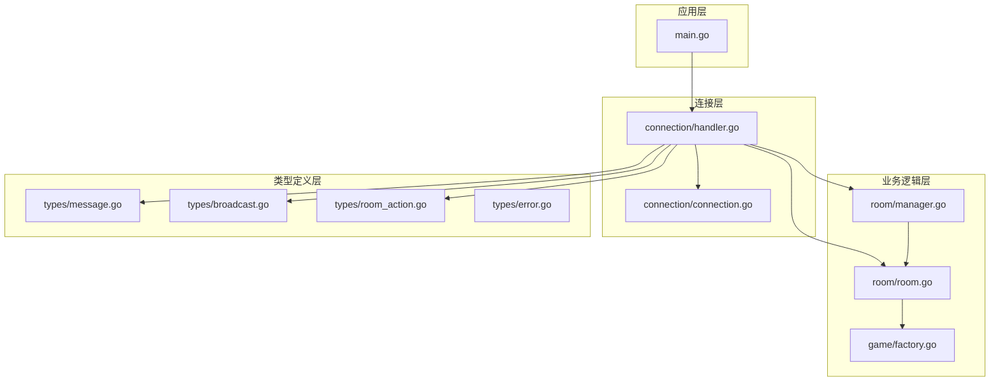
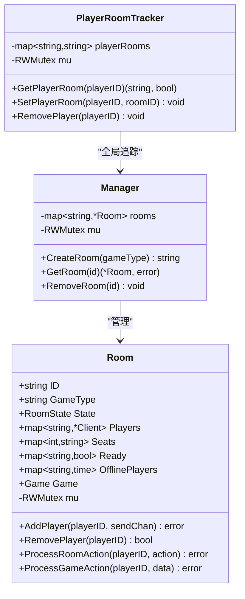
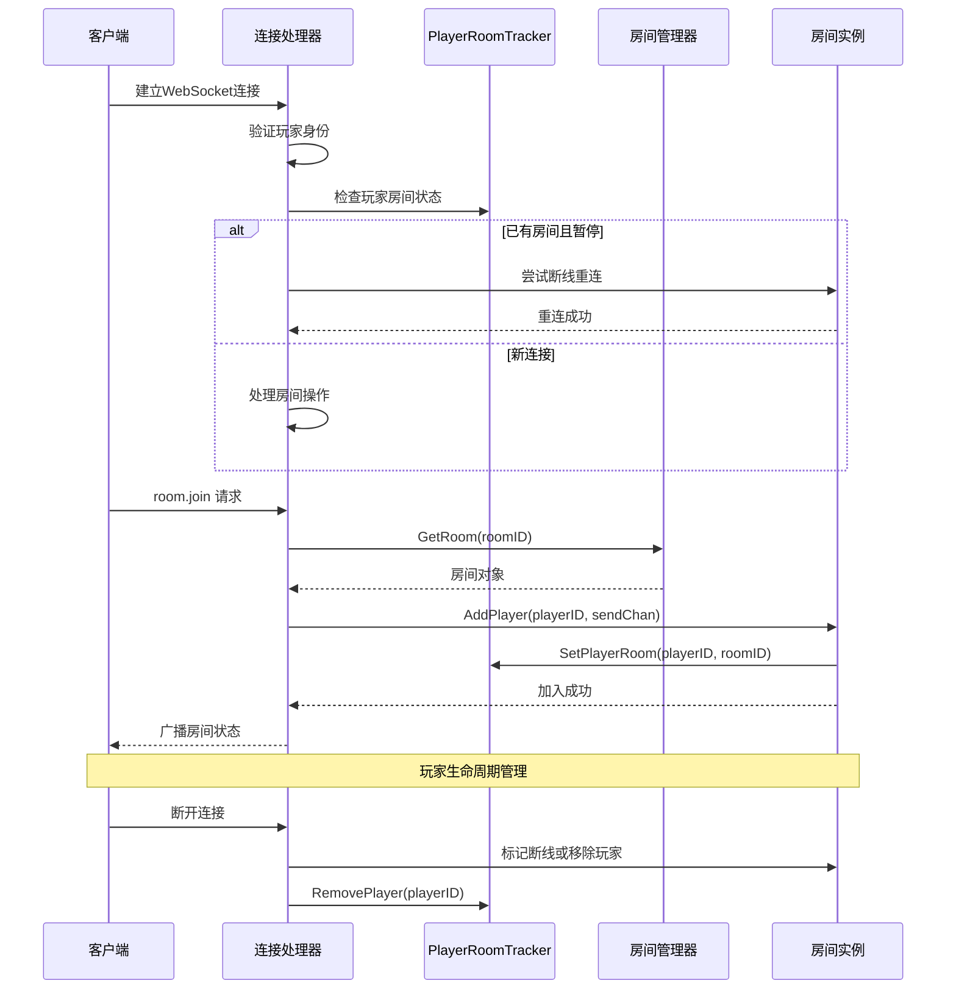
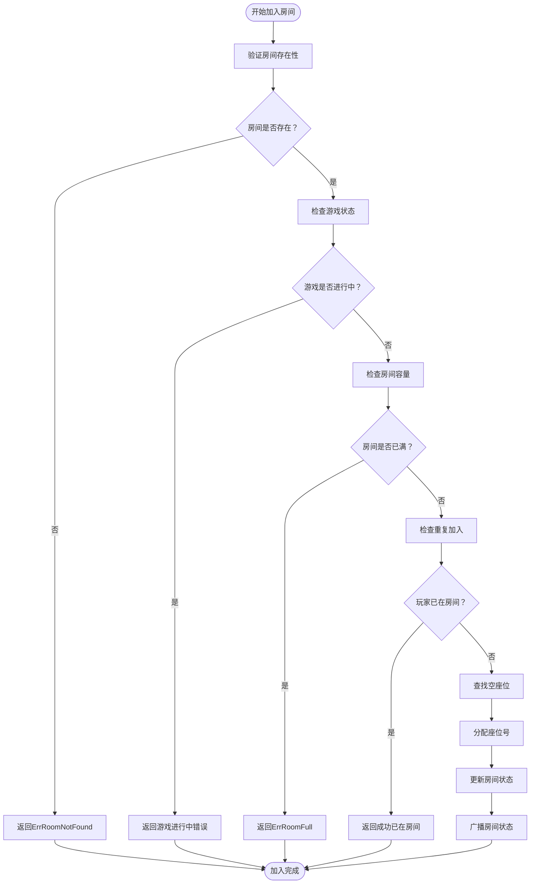
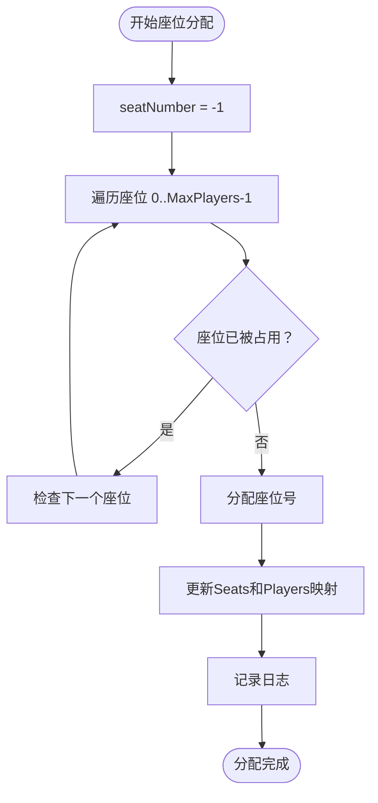
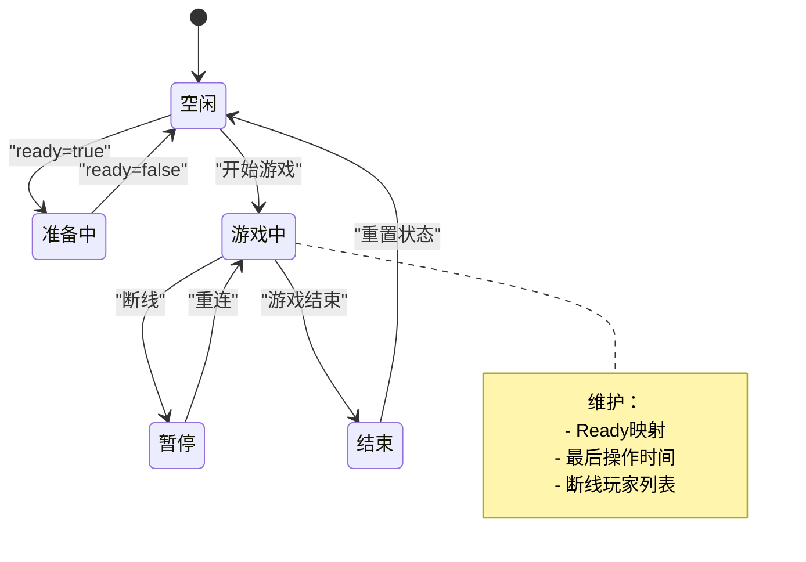
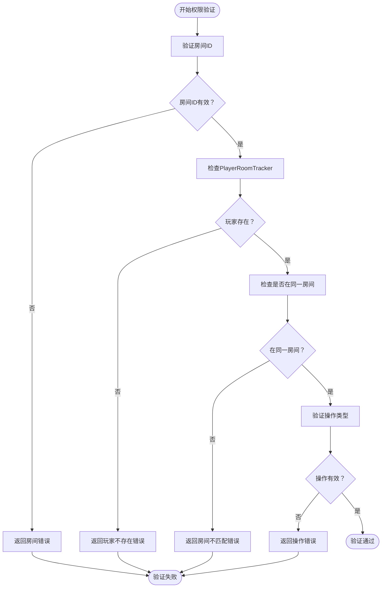
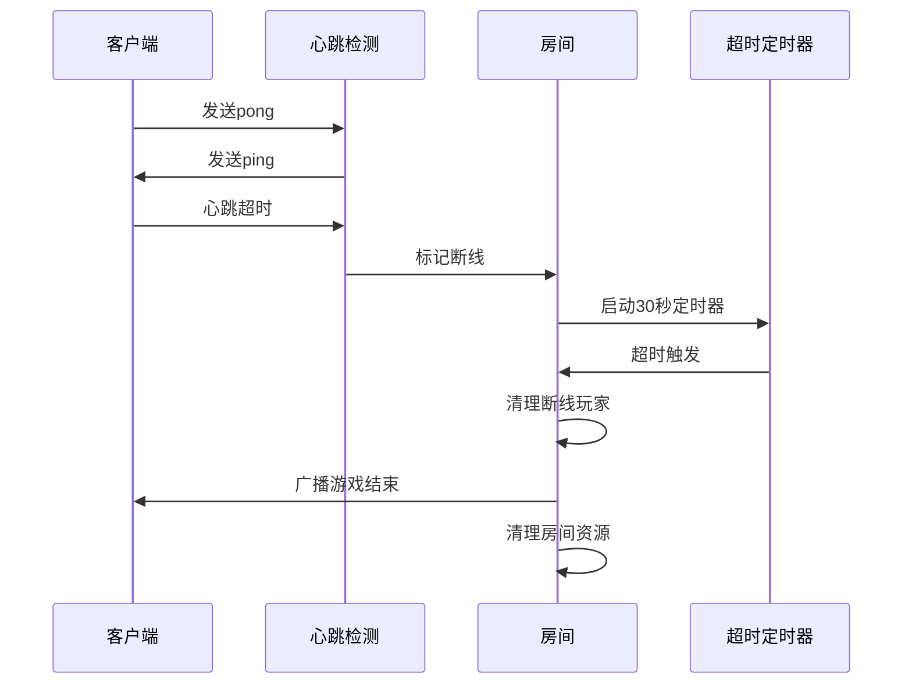
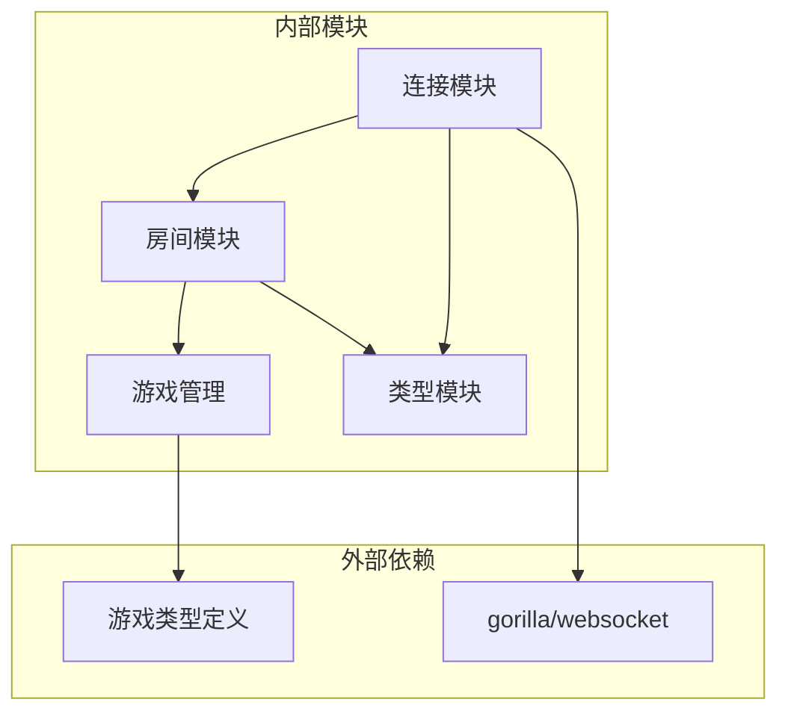

# 玩家管理机制

<cite>
**本文档引用的文件**
- [internal/room/manager.go](file://internal/room/manager.go)
- [internal/room/room.go](file://internal/room/room.go)
- [internal/connection/handler.go](file://internal/connection/handler.go)
- [internal/connection/connection.go](file://internal/connection/connection.go)
- [internal/types/message.go](file://internal/types/message.go)
- [internal/types/broadcast.go](file://internal/types/broadcast.go)
- [internal/types/room_action.go](file://internal/types/room_action.go)
- [internal/game/factory.go](file://internal/game/factory.go)
- [main.go](file://main.go)
</cite>

## 目录
1. [简介](#简介)
2. [项目结构](#项目结构)
3. [核心组件](#核心组件)
4. [架构概览](#架构概览)
5. [详细组件分析](#详细组件分析)
6. [依赖关系分析](#依赖关系分析)
7. [性能考虑](#性能考虑)
8. [故障排除指南](#故障排除指南)
9. [结论](#结论)
10. [附录](#附录)

## 简介

本文件为卡牌游戏服务器的玩家管理机制提供全面的技术文档。系统实现了完整的房间管理、玩家状态跟踪、座位分配和权限控制功能。文档重点涵盖：

- 玩家在房间中的完整生命周期管理
- PlayerRoomTracker全局追踪器的设计与实现
- 玩家状态管理（在线状态、座位状态、游戏参与状态）
- 权限验证机制（房间满员检查、重复加入检测、玩家存在性验证）
- 座位分配算法（座位编号规则、空位查找、座位状态更新）
- 错误处理策略（ErrRoomNotFound、ErrRoomFull、ErrAlreadyInRoom等）
- 实际使用示例与最佳实践

## 项目结构

系统采用模块化设计，主要分为以下层次：



**图表来源**
- [main.go](file://main.go#L10-L14)
- [internal/connection/handler.go](file://internal/connection/handler.go#L19-L158)
- [internal/room/manager.go](file://internal/room/manager.go#L47-L82)
- [internal/room/room.go](file://internal/room/room.go#L35-L57)

**章节来源**
- [main.go](file://main.go#L10-L14)
- [internal/connection/handler.go](file://internal/connection/handler.go#L19-L158)

## 核心组件

### PlayerRoomTracker 全局追踪器

PlayerRoomTracker是系统的核心组件，负责追踪所有玩家的房间归属关系。它采用并发安全设计，确保多线程环境下的一致性和可靠性。



**图表来源**
- [internal/room/manager.go](file://internal/room/manager.go#L17-L45)
- [internal/room/manager.go](file://internal/room/manager.go#L47-L52)
- [internal/room/room.go](file://internal/room/room.go#L14-L27)

### 房间管理系统

房间管理系统提供了完整的房间生命周期管理功能，包括房间创建、查询、删除以及玩家管理。

**章节来源**
- [internal/room/manager.go](file://internal/room/manager.go#L47-L82)
- [internal/room/room.go](file://internal/room/room.go#L35-L57)

## 架构概览

系统采用基于WebSocket的实时通信架构，结合房间管理和全局追踪器实现完整的玩家管理功能。



**图表来源**
- [internal/connection/handler.go](file://internal/connection/handler.go#L19-L88)
- [internal/room/manager.go](file://internal/room/manager.go#L66-L74)
- [internal/room/room.go](file://internal/room/room.go#L59-L96)
- [internal/room/manager.go](file://internal/room/manager.go#L23-L45)

## 详细组件分析

### 玩家加入房间流程

玩家加入房间涉及多个层面的验证和处理：



**图表来源**
- [internal/room/room.go](file://internal/room/room.go#L59-L96)

**章节来源**
- [internal/room/room.go](file://internal/room/room.go#L59-L96)

### 座位分配算法

座位分配采用简单而高效的算法：

1. **座位编号规则**：座位号从0开始，按顺序分配
2. **空位查找**：遍历0到MaxPlayers-1，找到第一个空位
3. **座位状态更新**：同时更新Seats映射和Client结构



**图表来源**
- [internal/room/room.go](file://internal/room/room.go#L79-L87)

**章节来源**
- [internal/room/room.go](file://internal/room/room.go#L79-L87)

### 玩家状态管理

系统维护三种核心状态：

1. **在线状态**：通过connectedPlayers映射跟踪
2. **座位状态**：通过Seats映射跟踪座位分配
3. **游戏参与状态**：通过Ready映射跟踪准备状态



**图表来源**
- [internal/room/room.go](file://internal/room/room.go#L14-L27)
- [internal/room/room.go](file://internal/room/room.go#L391-L402)

**章节来源**
- [internal/room/room.go](file://internal/room/room.go#L14-L27)
- [internal/room/room.go](file://internal/room/room.go#L391-L402)

### 权限验证机制

系统实现了多层次的权限验证：



**图表来源**
- [internal/connection/handler.go](file://internal/connection/handler.go#L455-L473)

**章节来源**
- [internal/connection/handler.go](file://internal/connection/handler.go#L455-L473)

### 断线处理机制

系统支持断线检测和自动重连：



**图表来源**
- [internal/connection/connection.go](file://internal/connection/connection.go#L32-L61)
- [internal/room/room.go](file://internal/room/room.go#L134-L220)

**章节来源**
- [internal/connection/connection.go](file://internal/connection/connection.go#L32-L61)
- [internal/room/room.go](file://internal/room/room.go#L134-L220)

## 依赖关系分析

系统各组件之间的依赖关系清晰明确：



**图表来源**
- [internal/connection/handler.go](file://internal/connection/handler.go#L3-L13)
- [internal/room/room.go](file://internal/room/room.go#L3-L12)
- [internal/game/factory.go](file://internal/game/factory.go#L3-L9)

**章节来源**
- [internal/connection/handler.go](file://internal/connection/handler.go#L3-L13)
- [internal/room/room.go](file://internal/room/room.go#L3-L12)
- [internal/game/factory.go](file://internal/game/factory.go#L3-L9)

## 性能考虑

### 并发安全设计

系统采用读写锁(RWMutex)确保并发安全性：
- 读操作使用RLock，允许多个读者并发访问
- 写操作使用Lock，确保数据一致性
- 广播通道使用缓冲，避免阻塞

### 内存管理

- 房间空闲时自动清理资源
- 断线超时后批量清理离线玩家
- 使用连接池减少内存分配

### 网络优化

- 心跳检测每30秒一次，避免频繁网络交互
- 消息队列缓冲大小适中，平衡内存使用和延迟
- 个性化广播使用函数式接口，减少不必要的数据复制

## 故障排除指南

### 常见错误场景及处理

| 错误类型 | 触发条件 | 处理方案 |
|---------|---------|---------|
| ErrRoomNotFound | 房间ID不存在 | 检查房间ID有效性，重新创建房间 |
| ErrRoomFull | 房间已满员 | 提示用户稍后重试或建议其他房间 |
| ErrAlreadyInRoom | 玩家已在房间中 | 先离开当前房间再加入新房间 |
| ErrPlayerNotFound | 玩家不在房间中 | 验证玩家房间状态，重新加入房间 |
| ErrNoGame | 游戏未开始 | 等待其他玩家准备或检查游戏配置 |

### 调试建议

1. **日志分析**：查看房间创建、加入、离开的日志信息
2. **状态监控**：监控PlayerRoomTracker和房间状态映射
3. **网络诊断**：检查WebSocket连接状态和心跳检测
4. **内存监控**：观察房间资源清理情况

**章节来源**
- [internal/room/manager.go](file://internal/room/manager.go#L9-L15)
- [internal/connection/handler.go](file://internal/connection/handler.go#L423-L429)

## 结论

本玩家管理机制通过精心设计的架构和严格的并发控制，实现了高效、可靠的多人卡牌游戏管理。系统的主要优势包括：

1. **模块化设计**：清晰的职责分离和依赖关系
2. **并发安全**：完善的锁机制和状态管理
3. **扩展性强**：支持多种游戏类型和房间配置
4. **用户体验好**：断线重连、座位分配等人性化功能

建议在生产环境中重点关注：
- 监控系统性能指标
- 定期清理僵尸连接
- 优化消息处理性能
- 增强错误恢复能力

## 附录

### API使用示例

#### 创建房间
```javascript
// 客户端发送
{
  "type": "room.create",
  "data": {
    "game_type": "mahjong"
  }
}

// 服务器响应
{
  "type": "broadcast",
  "data": {
    "event": "room_state_changed",
    "content": {
      "room_id": "room_1",
      "state": "waiting",
      "players": []
    }
  }
}
```

#### 加入房间
```javascript
// 客户端发送
{
  "type": "room.join",
  "room_id": "room_1",
  "data": {
    "room_id": "room_1"
  }
}

// 服务器响应
{
  "type": "broadcast",
  "data": {
    "event": "room_state_changed",
    "content": {
      "message": "玩家 player_abc 加入了房间"
    }
  }
}
```

#### 准备游戏
```javascript
// 客户端发送
{
  "type": "room.action",
  "room_id": "room_1",
  "data": {
    "action": "ready",
    "data": {
      "ready": true
    }
  }
}

// 服务器响应
{
  "type": "broadcast",
  "data": {
    "event": "room_state_changed",
    "content": {
      "message": "玩家 player_abc 已准备"
    }
  }
}
```

### 最佳实践

1. **错误处理**：始终检查并处理所有可能的错误情况
2. **资源清理**：确保连接断开时正确清理房间和追踪器状态
3. **状态同步**：保持PlayerRoomTracker与房间状态的一致性
4. **性能监控**：定期检查系统性能指标和内存使用情况
5. **日志记录**：详细记录关键操作和异常情况便于调试