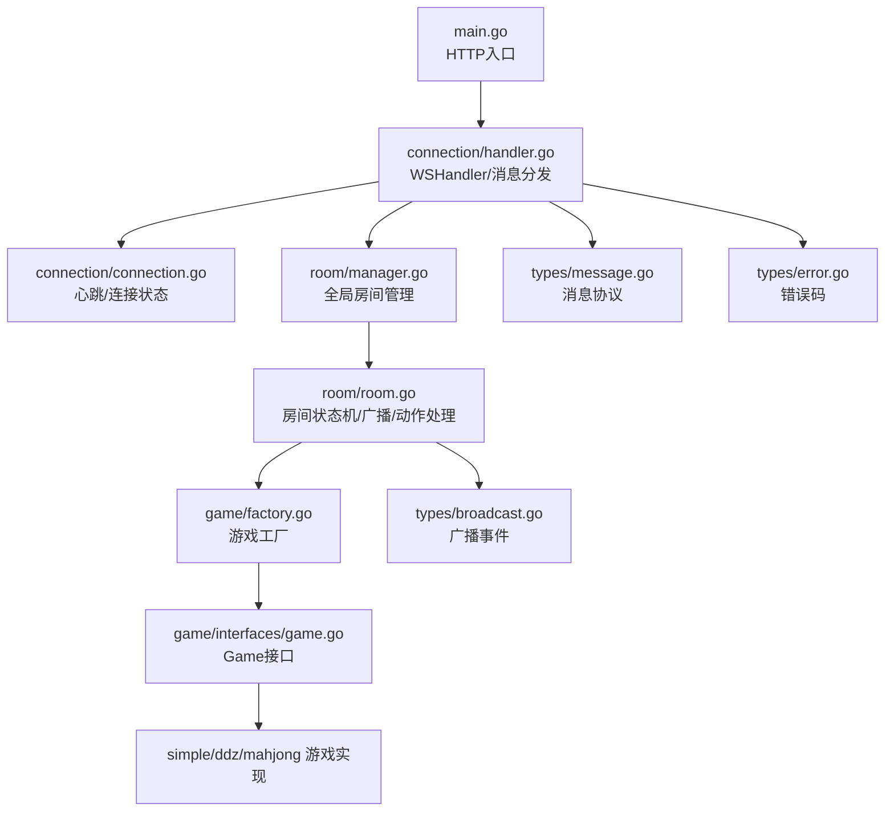
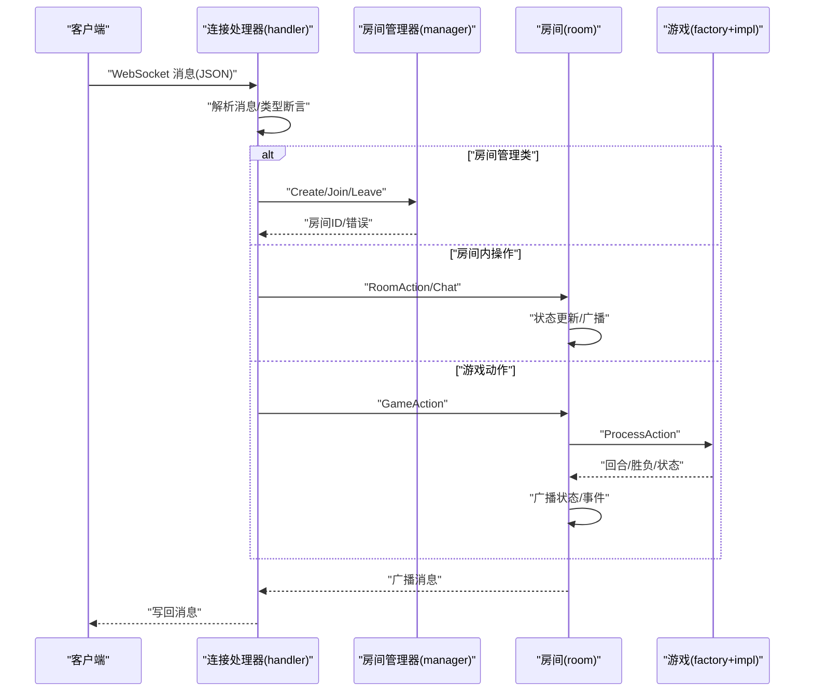
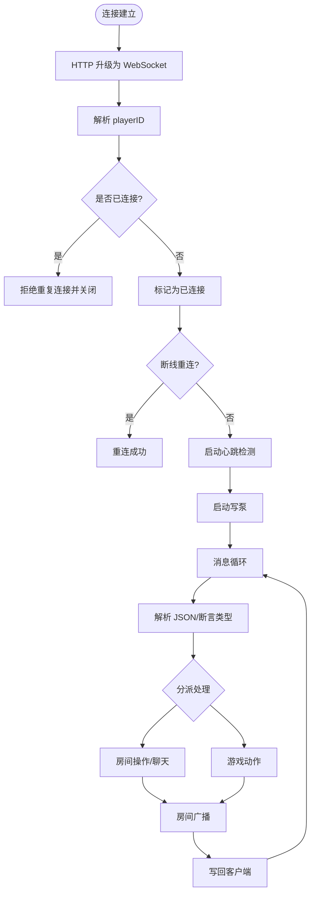
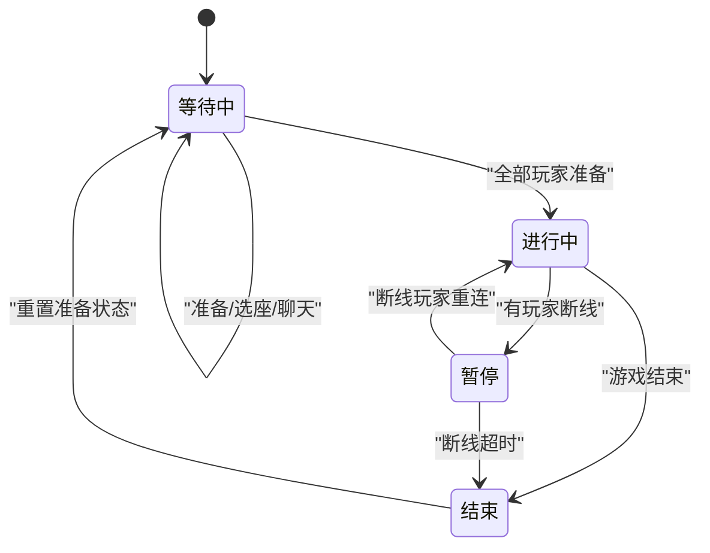
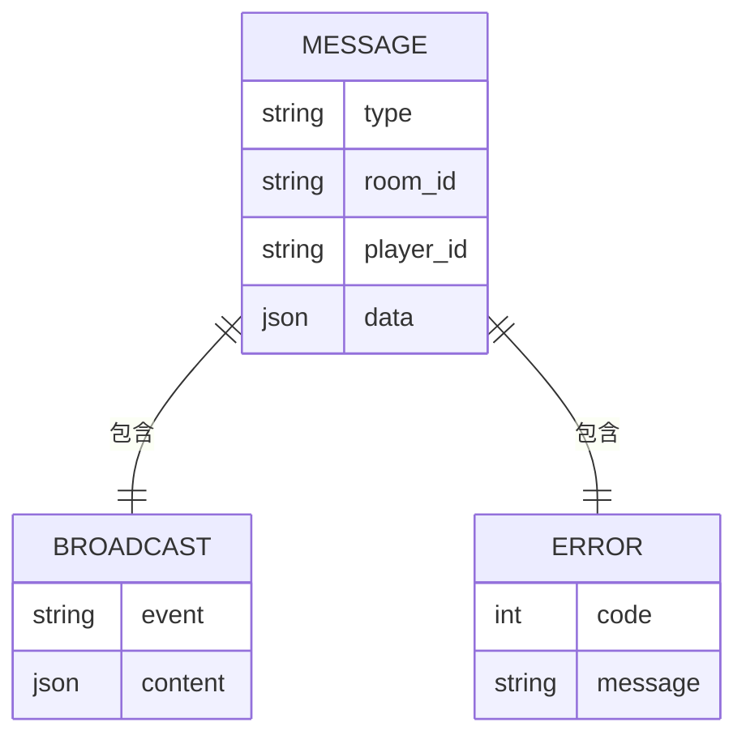
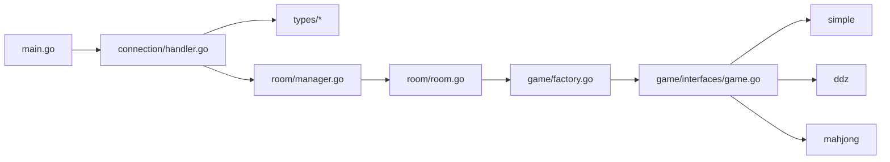
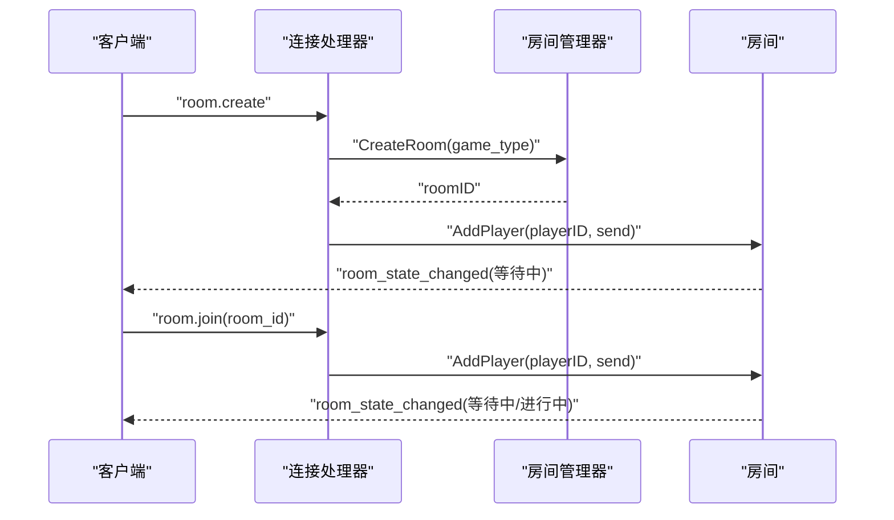
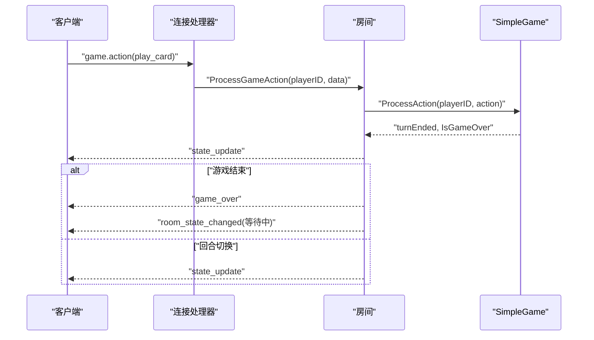
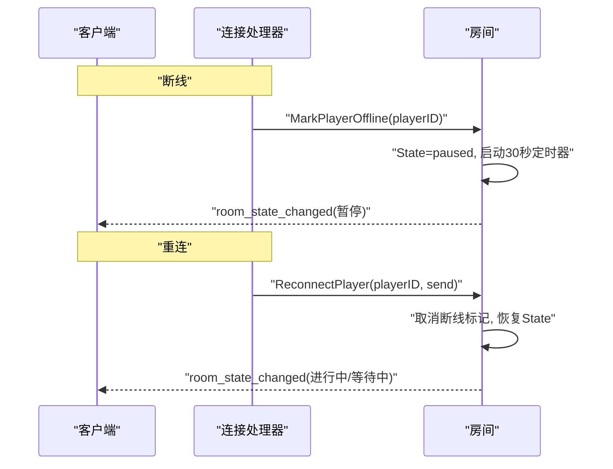

# 数据流设计

<cite>
**本文引用的文件**
- [main.go](file://main.go)
- [connection.go](file://internal/connection/connection.go)
- [handler.go](file://internal/connection/handler.go)
- [manager.go](file://internal/room/manager.go)
- [room.go](file://internal/room/room.go)
- [message.go](file://internal/types/message.go)
- [broadcast.go](file://internal/types/broadcast.go)
- [error.go](file://internal/types/error.go)
- [game_action.go](file://internal/types/game_action.go)
- [room_action.go](file://internal/types/room_action.go)
- [factory.go](file://internal/game/factory.go)
- [interfaces_game.go](file://internal/game/interfaces/game.go)
- [simple_game.go](file://internal/game/simple/game.go)
- [ddz_game.go](file://internal/game/ddz/game.go)
- [mahjong_game.go](file://internal/game/mahjong/game.go)
</cite>

## 目录
1. [引言](#引言)
2. [项目结构](#项目结构)
3. [核心组件](#核心组件)
4. [架构总览](#架构总览)
5. [详细组件分析](#详细组件分析)
6. [依赖关系分析](#依赖关系分析)
7. [性能与并发特性](#性能与并发特性)
8. [一致性与冲突处理](#一致性与冲突处理)
9. [故障排查指南](#故障排查指南)
10. [结论](#结论)
11. [附录：数据流图与处理流程图](#附录数据流图与处理流程图)

## 引言
本文件面向卡牌游戏服务器，聚焦“从客户端 WebSocket 连接建立到消息接收解析，从房间状态管理到游戏状态更新，从消息广播到客户端状态同步”的完整数据路径。文档同时阐述同步数据流与异步事件流、状态一致性保障机制（如状态同步策略与冲突解决）、以及典型场景（房间创建、玩家加入、游戏动作执行）下的数据流转过程。

## 项目结构
系统采用分层与模块化组织：
- 入口层：HTTP 服务监听与 WebSocket 升级
- 连接层：连接生命周期管理、心跳、消息收发泵
- 房间层：房间管理、玩家追踪、房间内状态机与广播
- 游戏层：统一游戏接口与多款游戏实现
- 类型与常量：消息协议、事件、错误码等



图表来源
- [main.go](file://main.go#L10-L14)
- [handler.go](file://internal/connection/handler.go#L19-L158)
- [connection.go](file://internal/connection/connection.go#L14-L61)
- [manager.go](file://internal/room/manager.go#L47-L82)
- [room.go](file://internal/room/room.go#L14-L57)
- [factory.go](file://internal/game/factory.go#L11-L23)
- [interfaces_game.go](file://internal/game/interfaces/game.go#L3-L16)
- [message.go](file://internal/types/message.go#L32-L77)
- [broadcast.go](file://internal/types/broadcast.go#L17-L47)
- [error.go](file://internal/types/error.go#L3-L12)

章节来源
- [main.go](file://main.go#L10-L14)
- [handler.go](file://internal/connection/handler.go#L19-L158)
- [manager.go](file://internal/room/manager.go#L47-L82)
- [room.go](file://internal/room/room.go#L14-L57)
- [factory.go](file://internal/game/factory.go#L11-L23)
- [interfaces_game.go](file://internal/game/interfaces/game.go#L3-L16)
- [message.go](file://internal/types/message.go#L32-L77)
- [broadcast.go](file://internal/types/broadcast.go#L17-L47)
- [error.go](file://internal/types/error.go#L3-L12)

## 核心组件
- WebSocket 入口与升级：负责 HTTP 到 WebSocket 的升级、跨域校验、URL 查询参数解析（player）。
- 连接处理器：维护发送通道、心跳检测、消息循环、消息类型分发、错误反馈。
- 房间管理器：全局房间与玩家追踪，提供创建、查询、移除房间能力。
- 房间实体：房间状态机（等待/进行中/暂停/结束）、玩家集合与座位映射、准备状态、断线标记与定时器、广播通道、个性化广播、游戏动作处理、状态广播。
- 游戏工厂与接口：根据 game_type 选择具体游戏实现，统一 Init/ProcessAction/GetState 等接口。
- 类型与协议：消息结构、事件枚举、错误码、房间/游戏动作类型。

章节来源
- [handler.go](file://internal/connection/handler.go#L15-L158)
- [connection.go](file://internal/connection/connection.go#L14-L61)
- [manager.go](file://internal/room/manager.go#L17-L82)
- [room.go](file://internal/room/room.go#L14-L657)
- [factory.go](file://internal/game/factory.go#L11-L23)
- [interfaces_game.go](file://internal/game/interfaces/game.go#L3-L16)
- [message.go](file://internal/types/message.go#L3-L77)
- [broadcast.go](file://internal/types/broadcast.go#L3-L47)
- [error.go](file://internal/types/error.go#L3-L12)

## 架构总览
系统采用“请求-处理-广播”三段式数据流：
- 请求阶段：客户端通过 WS 发送 JSON 消息；服务端解析为统一 Message 结构，按类型分派至房间或游戏处理。
- 处理阶段：房间状态机与游戏引擎更新内部状态；必要时触发广播事件。
- 广播阶段：房间广播通道异步投递消息至各客户端；个性化广播针对每个玩家生成专属内容。



图表来源
- [handler.go](file://internal/connection/handler.go#L130-L156)
- [manager.go](file://internal/room/manager.go#L54-L82)
- [room.go](file://internal/room/room.go#L296-L523)
- [factory.go](file://internal/game/factory.go#L11-L23)
- [interfaces_game.go](file://internal/game/interfaces/game.go#L4-L16)

## 详细组件分析

### WebSocket 连接与消息分发
- 连接建立：HTTP 升级，允许任意来源；从 URL 查询参数提取 playerID，若缺失则生成随机标识。
- 连接去重：基于全局 map 与互斥锁，防止同一 playerID 多连接。
- 心跳与保活：每 30 秒 Ping，60 秒无响应则关闭；PongHandler 延长读截止。
- 消息循环：读取消息 → JSON 解析 → 类型断言 → 分派到对应处理函数 → 错误统一返回。
- 发送泵：独立 goroutine 从 send 通道拉取消息并写回客户端，避免阻塞。



图表来源
- [handler.go](file://internal/connection/handler.go#L19-L158)
- [connection.go](file://internal/connection/connection.go#L32-L61)

章节来源
- [handler.go](file://internal/connection/handler.go#L19-L158)
- [connection.go](file://internal/connection/connection.go#L14-L61)

### 房间管理与状态机
- 房间管理器：全局房间表与玩家房间追踪，提供创建、查询、移除；并发安全。
- 房间实体：状态机（waiting/playing/paused/gameover），玩家集合、座位映射、准备状态、断线映射、断线定时器、广播通道。
- 房间操作：
  - 准备/取消准备：仅在 waiting 且非 playing 时有效；全部准备后自动开始游戏。
  - 选座：仅在 waiting 且非 playing 时有效；座位占用校验。
  - 聊天：验证玩家在房间内，广播聊天事件。
  - 游戏动作：防抖（100ms）、暂停中禁止、结束后禁止；调用游戏引擎处理，必要时广播状态与事件。
- 个性化广播：针对每个玩家生成专属内容（如手牌），避免泄露隐私。



图表来源
- [room.go](file://internal/room/room.go#L133-L220)
- [room.go](file://internal/room/room.go#L296-L402)
- [room.go](file://internal/room/room.go#L461-L523)

章节来源
- [manager.go](file://internal/room/manager.go#L17-L82)
- [room.go](file://internal/room/room.go#L14-L657)

### 游戏引擎与动作处理
- 工厂模式：根据 game_type 选择具体游戏实现（simple/ddz/mahjong）。
- 统一接口：Init、ProcessAction、AdvanceTurn、GetState、GetStateForPlayer、IsGameOver、Winner、MaxPlayers、MinPlayers。
- 动作类型：
  - 简单游戏：play_card
  - 斗地主：call_landlord、play_cards、pass
  - 麻将：discard、chow、pong、kong、win、pass
- 状态广播：每次动作后广播 state_update；游戏结束广播 game_over 并重置房间状态。

```mermaid
classDiagram
class Game {
+ID() string
+Init(players []string) error
+ProcessAction(playerID, action) (bool, error)
+CurrentTurn() string
+AdvanceTurn()
+GetState() interface{}
+GetStateForPlayer(playerID) interface{}
+IsGameOver() bool
+Winner() string
+MaxPlayers() int
+MinPlayers() int
}
class SimpleGame
class DdzGame
class MahjongGame
Game <|.. SimpleGame
Game <|.. DdzGame
Game <|.. MahjongGame
```

图表来源
- [interfaces_game.go](file://internal/game/interfaces/game.go#L3-L16)
- [simple_game.go](file://internal/game/simple/game.go#L8-L24)
- [ddz_game.go](file://internal/game/ddz/game.go#L20-L50)
- [mahjong_game.go](file://internal/game/mahjong/game.go#L51-L87)

章节来源
- [factory.go](file://internal/game/factory.go#L11-L23)
- [interfaces_game.go](file://internal/game/interfaces/game.go#L3-L16)
- [simple_game.go](file://internal/game/simple/game.go#L37-L65)
- [ddz_game.go](file://internal/game/ddz/game.go#L125-L200)
- [mahjong_game.go](file://internal/game/mahjong/game.go#L142-L200)

### 消息协议与广播
- 消息结构：type、room_id、player_id、data。
- 事件枚举：房间状态变更、游戏开始、游戏结束、状态更新、聊天。
- 错误码：覆盖数据无效、加入失败、房间不存在、已在房间、玩家已连接、玩家不在房间、未实现、内部错误等。



图表来源
- [message.go](file://internal/types/message.go#L32-L77)
- [broadcast.go](file://internal/types/broadcast.go#L17-L47)
- [error.go](file://internal/types/error.go#L3-L12)

章节来源
- [message.go](file://internal/types/message.go#L3-L77)
- [broadcast.go](file://internal/types/broadcast.go#L3-L47)
- [error.go](file://internal/types/error.go#L3-L12)

## 依赖关系分析
- 入口依赖连接层；连接层依赖房间层与类型层；房间层依赖游戏工厂与类型层；游戏工厂依赖具体游戏实现。
- 并发模型：连接层使用互斥锁保护全局连接状态；房间层使用读写锁保护房间状态；广播通道为带缓冲的异步队列。



图表来源
- [main.go](file://main.go#L10-L14)
- [handler.go](file://internal/connection/handler.go#L9-L12)
- [manager.go](file://internal/room/manager.go#L47-L52)
- [room.go](file://internal/room/room.go#L47-L52)
- [factory.go](file://internal/game/factory.go#L11-L23)
- [interfaces_game.go](file://internal/game/interfaces/game.go#L3-L16)

章节来源
- [main.go](file://main.go#L10-L14)
- [handler.go](file://internal/connection/handler.go#L9-L12)
- [manager.go](file://internal/room/manager.go#L47-L52)
- [room.go](file://internal/room/room.go#L47-L52)
- [factory.go](file://internal/game/factory.go#L11-L23)
- [interfaces_game.go](file://internal/game/interfaces/game.go#L3-L16)

## 性能与并发特性
- 并发安全
  - 连接层：全局连接状态 map 使用读写锁；心跳 goroutine 与写泵 goroutine 并行。
  - 房间层：房间状态使用 RWMutex；广播通道带缓冲；个性化广播逐玩家发送。
- 异步广播
  - 房间广播通道容量为 512；写泵 goroutine 非阻塞发送，避免单个客户端阻塞影响整体。
- 防抖与限流
  - 游戏动作 100ms 防抖；写队列满时丢弃消息并告警。
- 心跳与保活
  - 30 秒 Ping，60 秒超时关闭；PongHandler 延长读截止，降低误杀。

章节来源
- [connection.go](file://internal/connection/connection.go#L32-L61)
- [room.go](file://internal/room/room.go#L44-L56)
- [room.go](file://internal/room/room.go#L568-L612)

## 一致性与冲突处理
- 状态一致性
  - 房间状态机严格区分 waiting/playing/paused/gameover；只有 waiting 允许准备/选座；playing 允许游戏动作；paused 仅等待断线重连。
  - 游戏动作处理前进行“是否轮到你”、“是否暂停/结束”等前置校验。
- 冲突解决
  - 准备/选座：仅在 waiting 且非 playing 时生效；座位占用冲突直接报错。
  - 游戏动作：100ms 防抖忽略重复操作；断线期间暂停，重连后恢复。
  - 断线处理：30 秒超时自动结束并清理；重连后恢复游戏。
- 广播一致性
  - 个性化广播确保每个玩家收到专属状态；普通广播跳过断线玩家；写队列满时丢弃并记录告警。

章节来源
- [room.go](file://internal/room/room.go#L296-L402)
- [room.go](file://internal/room/room.go#L461-L523)
- [room.go](file://internal/room/room.go#L133-L220)

## 故障排查指南
- 常见错误与定位
  - 缺少消息类型/数据格式错误：检查客户端消息结构与字段类型。
  - 玩家已在房间/已在其他连接：检查去重逻辑与 URL 参数。
  - 房间不存在/玩家不在房间：确认房间 ID 与玩家房间追踪。
  - 游戏暂停/已结束：确认房间状态；断线导致的暂停需等待重连。
- 日志与告警
  - 连接建立/断开、心跳超时、广播丢弃、panic 恢复均有日志输出，便于定位问题。
- 排查步骤建议
  - 核对消息类型与数据结构（message.go、game_action.go、room_action.go）。
  - 检查房间状态机转换（room.go 状态机与广播）。
  - 关注广播通道与写泵 goroutine 的运行情况。

章节来源
- [error.go](file://internal/types/error.go#L3-L12)
- [handler.go](file://internal/connection/handler.go#L423-L435)
- [room.go](file://internal/room/room.go#L568-L612)

## 结论
本系统通过清晰的分层与严格的协议约束，实现了从连接建立到消息分发、从房间状态管理到游戏状态更新、从广播到客户端同步的完整数据流。并发模型与异步广播确保高吞吐，状态机与防抖机制保障一致性与稳定性。典型场景（房间创建/加入/游戏动作）均遵循统一的处理路径，具备良好的可扩展性与可维护性。

## 附录：数据流图与处理流程图

### 典型场景一：房间创建与加入


图表来源
- [handler.go](file://internal/connection/handler.go#L160-L221)
- [manager.go](file://internal/room/manager.go#L54-L74)
- [room.go](file://internal/room/room.go#L59-L96)

### 典型场景二：游戏动作执行（简单游戏）


图表来源
- [handler.go](file://internal/connection/handler.go#L335-L381)
- [room.go](file://internal/room/room.go#L461-L523)
- [simple_game.go](file://internal/game/simple/game.go#L37-L65)

### 典型场景三：断线与重连


图表来源
- [connection.go](file://internal/connection/connection.go#L32-L61)
- [room.go](file://internal/room/room.go#L133-L168)
- [room.go](file://internal/room/room.go#L222-L257)