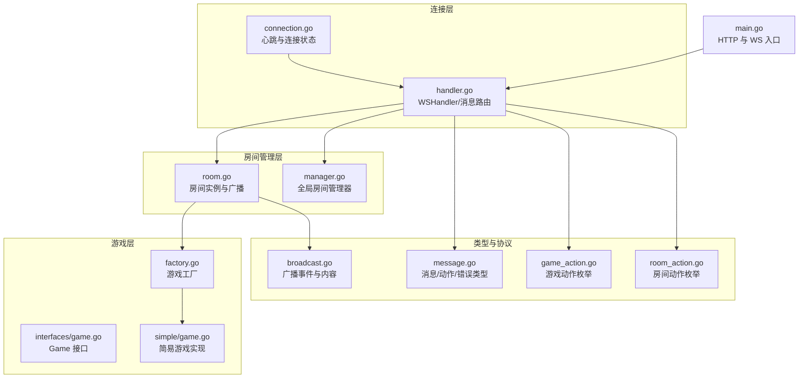
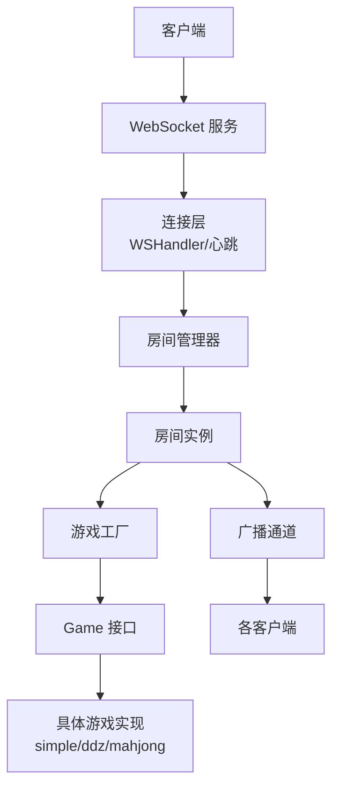
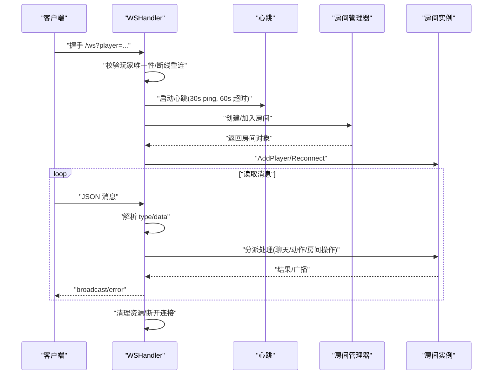
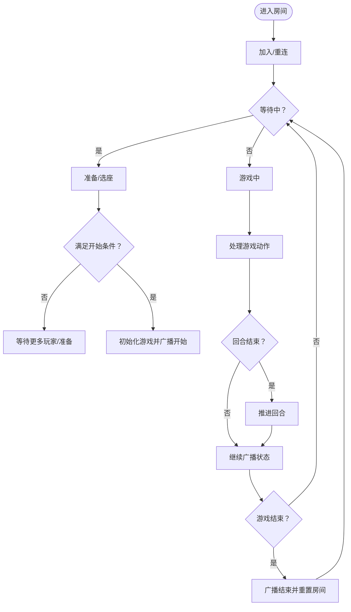
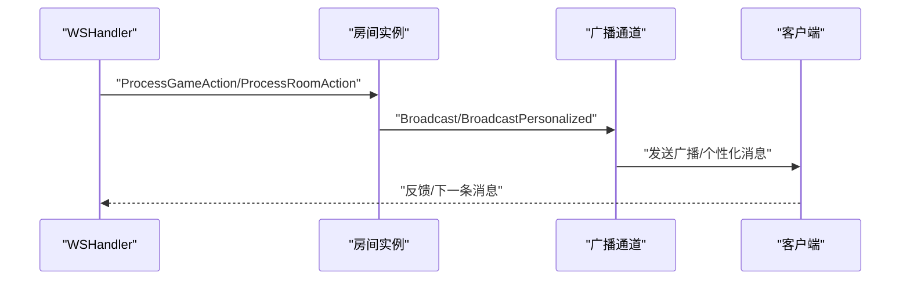
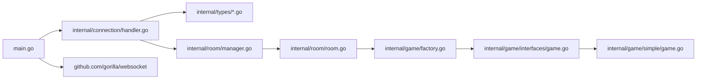

# 架构设计

<cite>
**本文引用的文件**
- [main.go](file://main.go)
- [connection.go](file://internal/connection/connection.go)
- [handler.go](file://internal/connection/handler.go)
- [manager.go](file://internal/room/manager.go)
- [room.go](file://internal/room/room.go)
- [factory.go](file://internal/game/factory.go)
- [game.go（接口）](file://internal/game/interfaces/game.go)
- [message.go](file://internal/types/message.go)
- [broadcast.go](file://internal/types/broadcast.go)
- [game_action.go](file://internal/types/game_action.go)
- [room_action.go](file://internal/types/room_action.go)
- [simple_game.go](file://internal/game/simple/game.go)
- [go.mod](file://go.mod)
- [README.md](file://README.md)
</cite>

## 目录
1. [引言](#引言)
2. [项目结构](#项目结构)
3. [核心组件](#核心组件)
4. [架构总览](#架构总览)
5. [详细组件分析](#详细组件分析)
6. [依赖关系分析](#依赖关系分析)
7. [性能考量](#性能考量)
8. [故障排查指南](#故障排查指南)
9. [结论](#结论)
10. [附录](#附录)

## 引言
本项目是一个基于 Go 与 WebSocket 的多人卡牌游戏服务器，支持多种游戏模式（简易卡牌、斗地主、麻将），提供房间管理、断线重连、聊天与游戏状态广播等能力。本文档从分层设计与模块化组织出发，系统性阐述连接层、业务层、数据层的职责划分；深入解析 WebSocket 连接管理、房间管理系统、游戏工厂模式与消息路由机制；总结所采用的设计模式（工厂模式、观察者模式、策略模式）在系统中的落地方式；并给出数据流与控制流的完整路径，帮助开发者快速理解整体设计与技术决策。

## 项目结构
项目采用“按领域分层 + 模块化”的组织方式：
- 连接层（internal/connection）：负责 WebSocket 握手、心跳、消息解析与路由、写泵发送
- 房间管理层（internal/room）：负责房间生命周期、玩家追踪、广播通道与断线处理
- 游戏层（internal/game）：统一 Game 接口与工厂，按游戏类型实现具体逻辑
- 类型与协议（internal/types）：统一消息结构、事件枚举、动作类型等
- 入口（main.go）：HTTP 服务与 WebSocket 路由入口



**图表来源**
- [main.go](file://main.go#L10-L14)
- [connection.go](file://internal/connection/connection.go#L1-L62)
- [handler.go](file://internal/connection/handler.go#L19-L158)
- [manager.go](file://internal/room/manager.go#L47-L83)
- [room.go](file://internal/room/room.go#L14-L57)
- [factory.go](file://internal/game/factory.go#L11-L23)
- [game.go（接口）](file://internal/game/interfaces/game.go#L3-L22)
- [simple_game.go](file://internal/game/simple/game.go#L17-L19)
- [message.go](file://internal/types/message.go#L32-L77)
- [broadcast.go](file://internal/types/broadcast.go#L17-L47)
- [game_action.go](file://internal/types/game_action.go#L6-L18)
- [room_action.go](file://internal/types/room_action.go#L6-L9)

**章节来源**
- [README.md](file://README.md#L20-L50)
- [main.go](file://main.go#L10-L14)

## 核心组件
- 连接层（WebSocket 与消息路由）
  - WSHandler：升级 HTTP 到 WebSocket，校验玩家身份，处理心跳、断线清理与消息分发
  - 心跳机制：每 30 秒 Ping，60 秒无响应则断开
  - 消息路由：根据消息类型分派至房间创建/加入、聊天、游戏动作、房间动作处理函数
- 房间管理层
  - 全局管理器：创建/获取/移除房间，维护房间映射
  - 房间实例：玩家加入/移除、座位分配、准备状态、断线标记与超时处理、广播通道
  - 广播：普通广播与个性化广播（按玩家生成私密状态）
- 游戏层
  - Game 接口：统一初始化、动作处理、回合推进、状态查询、胜负判定与人数限制
  - 工厂模式：按游戏类型创建具体游戏实例
  - 简易游戏：最小可用示例，演示出牌与胜负判定
- 类型与协议
  - 消息类型与数据结构：统一的 Message、RoomActionData、GameActionData、ErrorData
  - 广播事件：房间状态变更、游戏开始/结束、状态更新、聊天消息
  - 动作枚举：游戏动作与房间动作类型

**章节来源**
- [handler.go](file://internal/connection/handler.go#L19-L158)
- [connection.go](file://internal/connection/connection.go#L32-L61)
- [manager.go](file://internal/room/manager.go#L47-L83)
- [room.go](file://internal/room/room.go#L14-L57)
- [factory.go](file://internal/game/factory.go#L11-L23)
- [game.go（接口）](file://internal/game/interfaces/game.go#L3-L22)
- [simple_game.go](file://internal/game/simple/game.go#L17-L19)
- [message.go](file://internal/types/message.go#L32-L77)
- [broadcast.go](file://internal/types/broadcast.go#L17-L47)
- [game_action.go](file://internal/types/game_action.go#L6-L18)
- [room_action.go](file://internal/types/room_action.go#L6-L9)

## 架构总览
系统采用三层分层与模块化组织：
- 连接层（Transport/Protocol）：负责 WebSocket 握手、心跳、消息解析与路由
- 业务层（Domain/Service）：房间管理、玩家追踪、断线重连、广播与状态同步
- 数据层（Game Engine）：Game 接口与工厂，按游戏类型实现具体逻辑



**图表来源**
- [main.go](file://main.go#L10-L14)
- [handler.go](file://internal/connection/handler.go#L19-L158)
- [manager.go](file://internal/room/manager.go#L47-L83)
- [room.go](file://internal/room/room.go#L14-L57)
- [factory.go](file://internal/game/factory.go#L11-L23)
- [game.go（接口）](file://internal/game/interfaces/game.go#L3-L22)

## 详细组件分析

### 连接层：WebSocket 连接管理与消息路由
- 连接建立与校验
  - 升级 HTTP 到 WebSocket，读取 URL 查询参数作为玩家标识
  - 防止同一玩家 ID 多处连接
  - 断线重连：若房间处于暂停且玩家曾断线，尝试重连并恢复状态
- 心跳与保活
  - 每 30 秒发送 Ping，设置读超时 60 秒，超时自动断开
- 写泵与并发
  - 单独 goroutine 从发送通道拉取消息并写入 WebSocket，避免阻塞读循环
- 消息路由
  - 解析消息类型与数据，分派至房间创建/加入、聊天、游戏动作、房间动作处理函数
  - 统一错误响应格式



**图表来源**
- [handler.go](file://internal/connection/handler.go#L19-L158)
- [connection.go](file://internal/connection/connection.go#L32-L61)
- [manager.go](file://internal/room/manager.go#L54-L83)
- [room.go](file://internal/room/room.go#L59-L96)

**章节来源**
- [handler.go](file://internal/connection/handler.go#L19-L158)
- [connection.go](file://internal/connection/connection.go#L10-L61)

### 房间管理系统：生命周期、座位与断线处理
- 房间生命周期
  - 创建：由管理器生成房间 ID 并实例化房间
  - 获取/移除：按 ID 获取房间或在空房间时移除
- 玩家管理
  - 加入：分配空座位，广播房间状态
  - 离开：释放座位与准备状态，必要时清理房间
  - 重连：断线玩家在暂停状态下恢复连接，必要时恢复游戏
- 断线保护
  - 标记断线玩家，游戏进行中则暂停
  - 30 秒超时后结束游戏并清理断线玩家
- 广播机制
  - 普通广播：向在线玩家发送消息
  - 个性化广播：按玩家生成私密状态并发送



**图表来源**
- [room.go](file://internal/room/room.go#L59-L96)
- [room.go](file://internal/room/room.go#L296-L316)
- [room.go](file://internal/room/room.go#L318-L348)
- [room.go](file://internal/room/room.go#L461-L523)
- [room.go](file://internal/room/room.go#L540-L566)

**章节来源**
- [manager.go](file://internal/room/manager.go#L47-L83)
- [room.go](file://internal/room/room.go#L14-L57)
- [room.go](file://internal/room/room.go#L133-L220)
- [room.go](file://internal/room/room.go#L222-L257)
- [room.go](file://internal/room/room.go#L296-L316)
- [room.go](file://internal/room/room.go#L318-L348)
- [room.go](file://internal/room/room.go#L461-L523)
- [room.go](file://internal/room/room.go#L540-L566)

### 游戏工厂模式与 Game 接口
- 工厂模式
  - 根据 game_type 创建具体游戏实例（simple/ddz/mahjong）
- Game 接口
  - 统一的动作处理、回合推进、状态查询、胜负判定与人数限制
- 简易游戏实现
  - 最小可用示例，演示出牌与胜负判定流程

```mermaid
classDiagram
class Game {
+ID() string
+Init(players []string) error
+ProcessAction(playerID, action) (bool, error)
+CurrentTurn() string
+AdvanceTurn()
+GetState() interface{}
+GetStateForPlayer(playerID) interface{}
+IsGameOver() bool
+Winner() string
+MaxPlayers() int
+MinPlayers() int
}
class SimpleGame {
+Init(players)
+ProcessAction(playerID, action)
+AdvanceTurn()
+GetState()
+GetStateForPlayer(playerID)
+IsGameOver()
+Winner()
+MaxPlayers()
+MinPlayers()
}
class Factory {
+NewGame(gameType) Game
}
Game <|.. SimpleGame : "实现"
Factory --> Game : "创建"
```

**图表来源**
- [game.go（接口）](file://internal/game/interfaces/game.go#L3-L22)
- [simple_game.go](file://internal/game/simple/game.go#L17-L19)
- [factory.go](file://internal/game/factory.go#L11-L23)

**章节来源**
- [factory.go](file://internal/game/factory.go#L11-L23)
- [game.go（接口）](file://internal/game/interfaces/game.go#L3-L22)
- [simple_game.go](file://internal/game/simple/game.go#L17-L19)

### 消息路由与广播机制
- 消息类型与数据结构
  - 统一 Message 结构，包含 type、room_id、player_id、data
  - 动作类型：房间动作（ready/sit）、游戏动作（play_card/play_cards/call_landlord/discard/chow/pong/kong/win）
- 广播事件
  - 房间状态变更、游戏开始/结束、状态更新、聊天消息
- 个性化广播
  - 为每个玩家生成私密状态内容，避免泄露对手手牌



**图表来源**
- [handler.go](file://internal/connection/handler.go#L130-L156)
- [room.go](file://internal/room/room.go#L98-L131)
- [room.go](file://internal/room/room.go#L525-L538)
- [broadcast.go](file://internal/types/broadcast.go#L17-L47)
- [message.go](file://internal/types/message.go#L32-L77)

**章节来源**
- [message.go](file://internal/types/message.go#L32-L77)
- [broadcast.go](file://internal/types/broadcast.go#L17-L47)
- [room.go](file://internal/room/room.go#L98-L131)
- [room.go](file://internal/room/room.go#L525-L538)

## 依赖关系分析
- 外部依赖
  - gorilla/websocket：WebSocket 协议实现
- 内部依赖
  - main.go 依赖 connection 包暴露 WSHandler
  - connection.handler 依赖 room.manager 与 types.message
  - room.room 依赖 game.factory 与 types.broadcast
  - game.factory 依赖各游戏实现包
  - types 包为跨模块共享的数据契约



**图表来源**
- [main.go](file://main.go#L7-L13)
- [handler.go](file://internal/connection/handler.go#L9-L12)
- [manager.go](file://internal/room/manager.go#L3-L7)
- [room.go](file://internal/room/room.go#L3-L12)
- [factory.go](file://internal/game/factory.go#L3-L9)
- [game.go（接口）](file://internal/game/interfaces/game.go#L3-L22)
- [simple_game.go](file://internal/game/simple/game.go#L3-L6)
- [go.mod](file://go.mod#L5-L5)

**章节来源**
- [go.mod](file://go.mod#L5-L5)
- [main.go](file://main.go#L7-L13)

## 性能考量
- 广播通道缓冲
  - 房间广播通道使用较大缓冲，降低高并发下的阻塞风险
- 写泵与非阻塞发送
  - 写泵 goroutine 与 select default 避免单个客户端阻塞影响整体广播
- 心跳与超时
  - 30s ping + 60s 超时，平衡保活与资源消耗
- 防抖与状态更新
  - 游戏动作 100ms 防抖，减少重复操作带来的广播压力
- 个性化广播
  - 仅对在线玩家发送，避免断线玩家造成无效 IO

**章节来源**
- [room.go](file://internal/room/room.go#L44-L44)
- [room.go](file://internal/room/room.go#L568-L612)
- [connection.go](file://internal/connection/connection.go#L47-L58)
- [room.go](file://internal/room/room.go#L476-L482)
- [room.go](file://internal/room/room.go#L576-L611)

## 故障排查指南
- 常见错误类型
  - 玩家已在其他连接：拒绝重复连接
  - 玩家已在房间：需先离开当前房间
  - 房间不存在/房间已满：参数校验失败
  - 玩家不在房间：消息携带房间号与玩家不匹配
  - 游戏暂停/已结束：在暂停或结束后仍尝试操作
- 排查步骤
  - 检查 WS 连接参数（player）与 URL 查询
  - 确认房间状态（waiting/playing/paused/gameover）
  - 查看广播日志与房间状态变更消息
  - 关注断线重连与超时清理逻辑
- 日志定位
  - 连接建立/断开、心跳超时、房间创建/加入/离开、游戏开始/结束、广播发送/丢弃

**章节来源**
- [handler.go](file://internal/connection/handler.go#L35-L44)
- [handler.go](file://internal/connection/handler.go#L160-L221)
- [handler.go](file://internal/connection/handler.go#L223-L282)
- [handler.go](file://internal/connection/handler.go#L284-L333)
- [handler.go](file://internal/connection/handler.go#L335-L381)
- [handler.go](file://internal/connection/handler.go#L383-L421)
- [room.go](file://internal/room/room.go#L133-L168)
- [room.go](file://internal/room/room.go#L170-L220)

## 结论
本系统通过清晰的分层与模块化设计，结合工厂模式、观察者模式（广播）与策略模式（不同游戏实现），实现了可扩展、可维护的卡牌游戏服务器。连接层提供稳定的 WebSocket 通道与消息路由，房间管理层保障房间生命周期与状态一致性，游戏层通过统一接口与工厂实现多游戏模式支持。配合断线重连、防抖与广播优化，系统在性能与可靠性之间取得良好平衡。

## 附录
- 系统边界
  - 外部边界：浏览器/移动端 WebSocket 客户端
  - 内部边界：连接层、房间管理层、游戏层、类型与协议层
- 第三方库集成
  - gorilla/websocket：WebSocket 协议实现
- 设计模式应用
  - 工厂模式：游戏工厂按类型创建实例
  - 观察者模式：房间广播通道向多个订阅者（玩家）推送消息
  - 策略模式：Game 接口定义统一行为，不同游戏实现策略化

**章节来源**
- [README.md](file://README.md#L14-L19)
- [go.mod](file://go.mod#L5-L5)
- [factory.go](file://internal/game/factory.go#L11-L23)
- [room.go](file://internal/room/room.go#L98-L131)
- [game.go（接口）](file://internal/game/interfaces/game.go#L3-L22)