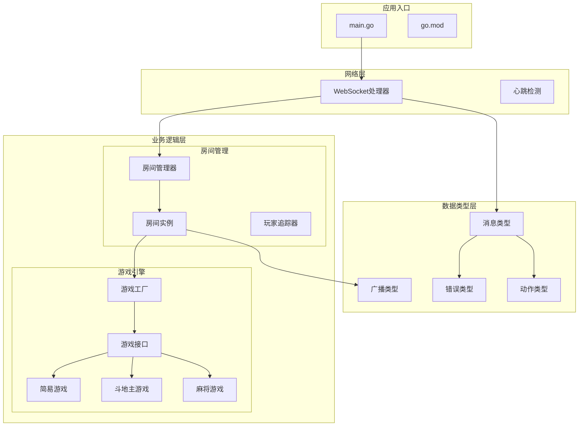
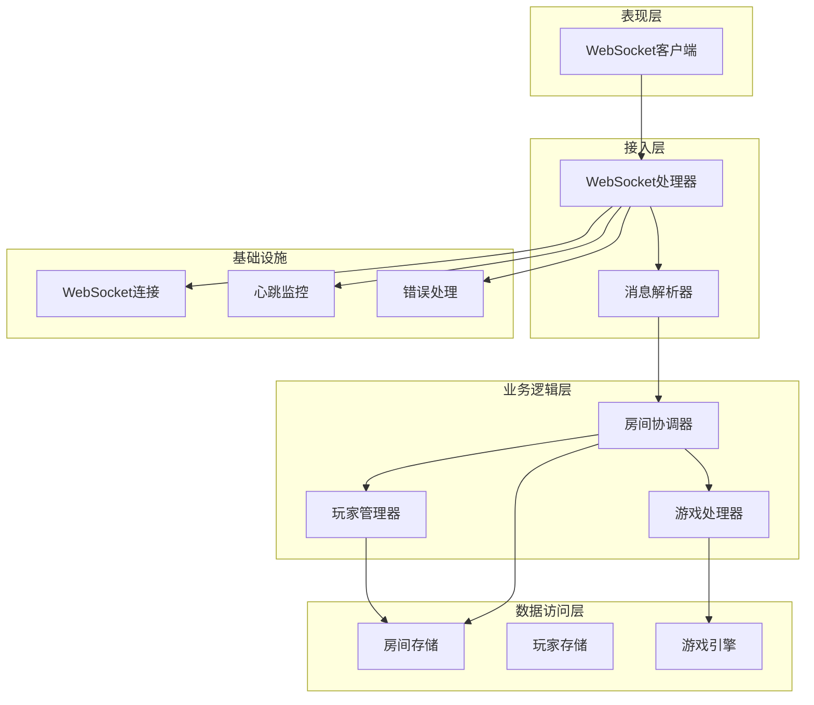
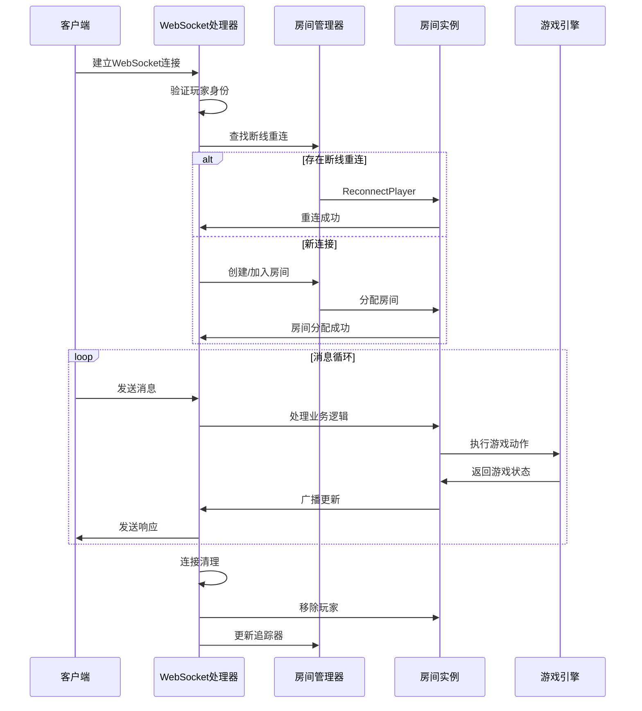
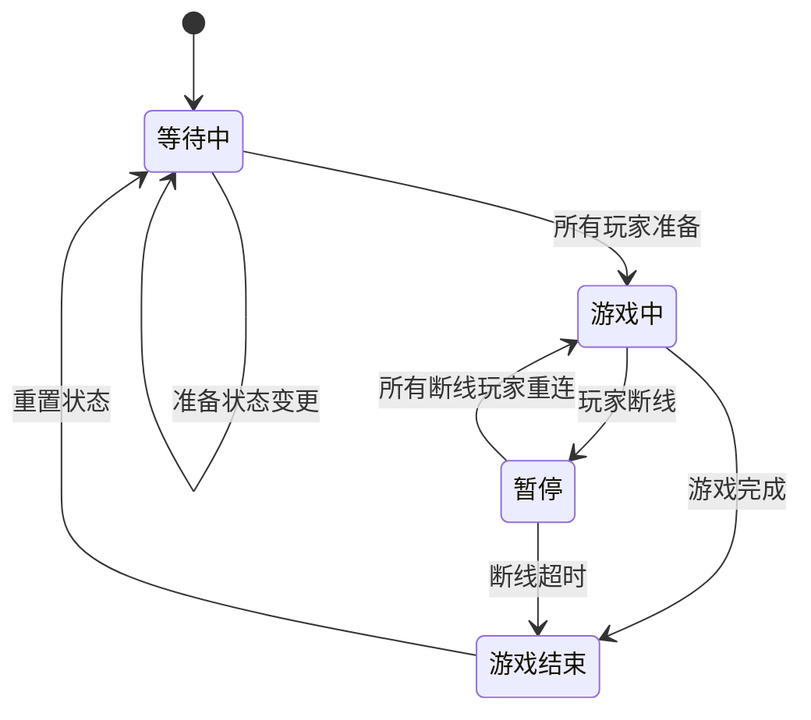
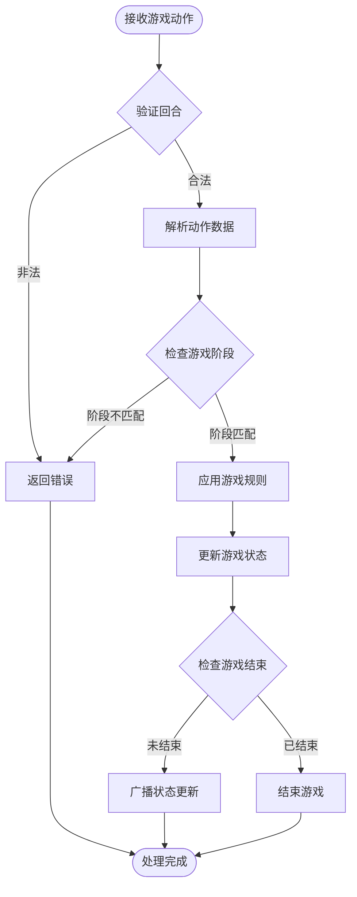
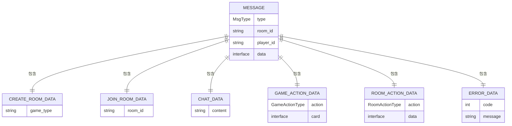
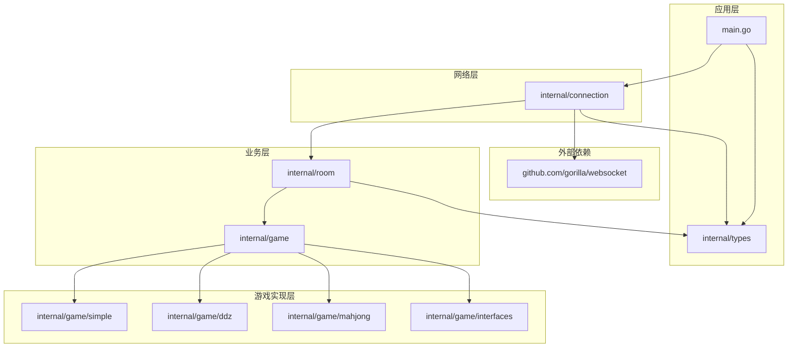

# 模块组织结构

<cite>
**本文档引用的文件**
- [main.go](file://main.go)
- [go.mod](file://go.mod)
- [README.md](file://README.md)
- [internal/connection/connection.go](file://internal/connection/connection.go)
- [internal/connection/handler.go](file://internal/connection/handler.go)
- [internal/room/room.go](file://internal/room/room.go)
- [internal/room/manager.go](file://internal/room/manager.go)
- [internal/game/factory.go](file://internal/game/factory.go)
- [internal/game/interfaces/game.go](file://internal/game/interfaces/game.go)
- [internal/game/simple/game.go](file://internal/game/simple/game.go)
- [internal/game/ddz/game.go](file://internal/game/ddz/game.go)
- [internal/game/mahjong/game.go](file://internal/game/mahjong/game.go)
- [internal/types/message.go](file://internal/types/message.go)
- [internal/types/broadcast.go](file://internal/types/broadcast.go)
- [internal/types/error.go](file://internal/types/error.go)
- [internal/types/room_action.go](file://internal/types/room_action.go)
- [internal/types/game_action.go](file://internal/types/game_action.go)
</cite>

## 目录
1. [简介](#简介)
2. [项目结构](#项目结构)
3. [核心组件](#核心组件)
4. [架构概览](#架构概览)
5. [详细组件分析](#详细组件分析)
6. [依赖分析](#依赖分析)
7. [性能考虑](#性能考虑)
8. [故障排除指南](#故障排除指南)
9. [结论](#结论)
10. [附录](#附录)

## 简介

这是一个基于 Go 语言和 WebSocket 的多人在线卡牌游戏服务器，采用模块化设计架构。项目支持多种卡牌游戏模式，包括斗地主、麻将和简易卡牌游戏，提供实时通信、房间管理、断线重连、聊天系统等功能。

该项目的核心设计理念是通过清晰的模块边界和接口抽象，实现代码的高内聚、低耦合，便于扩展和维护。模块化设计使得不同游戏逻辑可以独立开发和测试，同时通过统一的接口规范实现游戏类型的动态切换。

## 项目结构

项目采用基于功能域的模块化组织方式，主要分为以下核心模块：



**图表来源**
- [main.go](file://main.go#L10-L14)
- [internal/connection/handler.go](file://internal/connection/handler.go#L19-L158)
- [internal/room/manager.go](file://internal/room/manager.go#L47-L82)
- [internal/game/factory.go](file://internal/game/factory.go#L11-L23)

**章节来源**
- [README.md](file://README.md#L20-L50)
- [go.mod](file://go.mod#L1-L6)

## 核心组件

### 模块职责划分

#### internal/connection 模块
负责 WebSocket 连接管理和消息处理，是系统的网络入口点：
- **connection.go**: 提供连接状态管理和心跳检测功能
- **handler.go**: 实现 WebSocket 处理器，负责消息路由和业务逻辑协调

#### internal/room 模块  
负责房间生命周期管理和玩家状态跟踪：
- **manager.go**: 房间管理器，提供房间创建、查找、删除等管理功能
- **room.go**: 房间实例，实现房间状态管理、玩家管理、游戏协调等功能

#### internal/game 模块
提供游戏逻辑抽象和具体游戏实现：
- **interfaces/game.go**: 定义统一的游戏接口规范
- **factory.go**: 游戏工厂，支持动态创建不同类型的游戏玩家
- **simple/**, **ddz/**, **mahjong/**: 各种游戏的具体实现

#### internal/types 模块
定义系统中的数据类型和常量：
- **message.go**: 消息类型定义和数据结构
- **broadcast.go**: 广播事件类型定义
- **error.go**: 错误码定义
- **room_action.go**, **game_action.go**: 动作类型定义

**章节来源**
- [internal/connection/connection.go](file://internal/connection/connection.go#L1-L62)
- [internal/connection/handler.go](file://internal/connection/handler.go#L1-L474)
- [internal/room/manager.go](file://internal/room/manager.go#L1-L83)
- [internal/room/room.go](file://internal/room/room.go#L1-L657)
- [internal/game/interfaces/game.go](file://internal/game/interfaces/game.go#L1-L23)
- [internal/game/factory.go](file://internal/game/factory.go#L1-L24)

## 架构概览

系统采用分层架构设计，通过清晰的模块边界实现关注点分离：



**图表来源**
- [internal/connection/handler.go](file://internal/connection/handler.go#L19-L158)
- [internal/room/room.go](file://internal/room/room.go#L35-L56)
- [internal/game/factory.go](file://internal/game/factory.go#L11-L23)

## 详细组件分析

### WebSocket 连接管理器

WebSocket 连接管理器是整个系统与客户端通信的入口点，负责处理所有网络层面的连接和消息传递。

```mermaid
classDiagram
class WSHandler {
+WSHandler(w http.ResponseWriter, r *http.Request)
-upgrader websocket.Upgrader
-connectedPlayers map[string]bool
-isPlayerConnected(playerID string) bool
-setPlayerConnected(playerID string, connected bool)
-heartbeat(conn *websocket.Conn, playerID string) <-chan struct{}
-writePump(conn *websocket.Conn, send chan types.Message)
}
class HeartbeatManager {
-connectedPlayers map[string]bool
-connectedPlayersMu sync.RWMutex
+heartbeat(conn *websocket.Conn, playerID string) <-chan struct{}
+isPlayerConnected(playerID string) bool
+setPlayerConnected(playerID string, connected bool)
}
class MessageRouter {
+handleCreateRoom(conn *websocket.Conn, send chan types.Message, msg types.Message, roomIDRef *string)
+handleJoinRoom(conn *websocket.Conn, send chan types.Message, msg types.Message, roomIDRef *string)
+handleChat(conn *websocket.Conn, send chan types.Message, msg types.Message)
+handleGameAction(conn *websocket.Conn, send chan types.Message, msg types.Message)
+handleRoomAction(conn *websocket.Conn, send chan types.Message, msg types.Message)
+validatePlayerInRoom(playerID, roomID string) error
}
WSHandler --> HeartbeatManager : "使用"
WSHandler --> MessageRouter : "委托"
MessageRouter --> RoomManager : "调用"
```

**图表来源**
- [internal/connection/handler.go](file://internal/connection/handler.go#L19-L158)
- [internal/connection/connection.go](file://internal/connection/connection.go#L14-L61)

#### 连接生命周期管理

WebSocket 连接的完整生命周期包括建立连接、身份验证、房间分配、消息处理和连接清理等阶段：



**图表来源**
- [internal/connection/handler.go](file://internal/connection/handler.go#L19-L158)
- [internal/room/room.go](file://internal/room/room.go#L222-L257)

**章节来源**
- [internal/connection/handler.go](file://internal/connection/handler.go#L19-L158)
- [internal/connection/connection.go](file://internal/connection/connection.go#L32-L61)

### 房间管理系统

房间管理系统实现了完整的房间生命周期管理，包括房间创建、玩家管理、状态同步等功能。

```mermaid
classDiagram
class RoomManager {
+rooms map[string]*Room
+mu sync.RWMutex
+CreateRoom(gameType string) string
+GetRoom(id string) (*Room, error)
+RemoveRoom(id string)
}
class PlayerRoomTracker {
+playerRooms map[string]string
+mu sync.RWMutex
+GetPlayerRoom(playerID string) (string, bool)
+SetPlayerRoom(playerID, roomID string)
+RemovePlayer(playerID string)
}
class Room {
+ID string
+GameType string
+State RoomState
+Players map[string]*Client
+Seats map[int]string
+Ready map[string]bool
+OfflinePlayers map[string]time.Time
+Game Game
+broadcast chan types.Message
+lastAction map[string]int64
+disconnectTimer *time.Timer
+AddPlayer(playerID string, sendChan chan types.Message) error
+RemovePlayer(playerID string) bool
+ProcessRoomAction(playerID string, action types.RoomActionData) error
+ProcessGameAction(playerID string, data types.GameActionData) error
+Broadcast(msg types.Message)
+BroadcastPersonalized(event types.Event, contentFunc func(playerID string) interface{})
+MarkPlayerOffline(playerID string)
+ReconnectPlayer(playerID string, sendChan chan types.Message) error
}
class Client {
+PlayerID string
+SeatNumber int
+Send chan types.Message
}
RoomManager --> Room : "管理"
RoomManager --> PlayerRoomTracker : "使用"
Room --> Client : "包含"
Room --> Game : "组合"
PlayerRoomTracker --> Room : "追踪"
```

**图表来源**
- [internal/room/manager.go](file://internal/room/manager.go#L47-L82)
- [internal/room/room.go](file://internal/room/room.go#L14-L56)

#### 房间状态管理

房间系统实现了复杂的状态管理机制，支持等待、游戏中、暂停、游戏结束等状态转换：



**图表来源**
- [internal/room/room.go](file://internal/room/room.go#L540-L566)
- [internal/types/message.go](file://internal/types/message.go#L6-L11)

**章节来源**
- [internal/room/manager.go](file://internal/room/manager.go#L17-L82)
- [internal/room/room.go](file://internal/room/room.go#L14-L657)

### 游戏引擎架构

游戏引擎采用策略模式和工厂模式相结合的设计，支持多种游戏类型的动态扩展。

```mermaid
classDiagram
class Game {
<<interface>>
+ID() string
+Init(players []string) error
+ProcessAction(playerID string, action interface{}) (bool, error)
+CurrentTurn() string
+AdvanceTurn()
+GetState() interface{}
+GetStateForPlayer(playerID string) interface{}
+IsGameOver() bool
+Winner() string
+MaxPlayers() int
+MinPlayers() int
}
class GameFactory {
+NewGame(gameType string) (Game, error)
}
class SimpleGame {
-players []string
-turnIndex int
-lastCard int
-hands map[string][]int
-gameOver bool
-winner string
+Init(players []string) error
+ProcessAction(playerID string, action interface{}) (bool, error)
+GetState() interface{}
+GetStateForPlayer(playerID string) interface{}
}
class DdzGame {
-players []string
-playerSeats map[string]int
-hands map[string]Hand
-bottomCards Hand
-landlord string
-calls map[string]int
-phase string
-gameOver bool
-winner string
+Init(players []string) error
+ProcessAction(playerID string, action interface{}) (bool, error)
+GetState() interface{}
+GetStateForPlayer(playerID string) interface{}
}
class MahjongGame {
-players []string
-playerSeats map[string]int
-hands [4]Tiles
-melds [4][]Meld
-discards [4]Tiles
-wall Tiles
-phase string
-gameOver bool
-winner string
+Init(players []string) error
+ProcessAction(playerID string, action interface{}) (bool, error)
+GetState() interface{}
+GetStateForPlayer(playerID string) interface{}
}
GameFactory --> Game : "创建"
Game <|.. SimpleGame : "实现"
Game <|.. DdzGame : "实现"
Game <|.. MahjongGame : "实现"
```

**图表来源**
- [internal/game/interfaces/game.go](file://internal/game/interfaces/game.go#L3-L22)
- [internal/game/factory.go](file://internal/game/factory.go#L11-L23)
- [internal/game/simple/game.go](file://internal/game/simple/game.go#L8-L35)
- [internal/game/ddz/game.go](file://internal/game/ddz/game.go#L20-L73)
- [internal/game/mahjong/game.go](file://internal/game/mahjong/game.go#L52-L132)

#### 游戏动作处理流程

不同游戏类型的动作处理具有相似的模式，但具体的规则实现各不相同：



**图表来源**
- [internal/room/room.go](file://internal/room/room.go#L462-L523)
- [internal/game/interfaces/game.go](file://internal/game/interfaces/game.go#L18-L22)

**章节来源**
- [internal/game/interfaces/game.go](file://internal/game/interfaces/game.go#L1-L23)
- [internal/game/factory.go](file://internal/game/factory.go#L1-L24)
- [internal/game/simple/game.go](file://internal/game/simple/game.go#L1-L102)
- [internal/game/ddz/game.go](file://internal/game/ddz/game.go#L1-L800)
- [internal/game/mahjong/game.go](file://internal/game/mahjong/game.go#L1-L805)

### 数据类型系统

系统定义了完整的数据类型体系，确保消息传递的一致性和类型安全。



**图表来源**
- [internal/types/message.go](file://internal/types/message.go#L32-L77)

**章节来源**
- [internal/types/message.go](file://internal/types/message.go#L1-L78)
- [internal/types/broadcast.go](file://internal/types/broadcast.go#L1-L48)
- [internal/types/error.go](file://internal/types/error.go#L1-L13)
- [internal/types/room_action.go](file://internal/types/room_action.go#L1-L10)
- [internal/types/game_action.go](file://internal/types/game_action.go#L1-L19)

## 依赖分析

系统采用清晰的依赖层次结构，遵循依赖倒置原则：



**图表来源**
- [go.mod](file://go.mod#L5-L5)
- [main.go](file://main.go#L3-L8)
- [internal/connection/handler.go](file://internal/connection/handler.go#L9-L12)

### 模块间接口契约

各模块之间的交互通过明确的接口契约实现松耦合：

| 模块 | 主要接口 | 依赖方向 | 作用 |
|------|----------|----------|------|
| connection | WSHandler, heartbeat | 无 | 网络接入层 |
| room | Room, Manager, PlayerRoomTracker | game接口 | 房间管理 |
| game | Game接口, GameFactory | types | 游戏逻辑 |
| types | 消息类型, 枚举常量 | 无 | 数据定义 |

**章节来源**
- [internal/connection/handler.go](file://internal/connection/handler.go#L9-L12)
- [internal/room/manager.go](file://internal/room/manager.go#L3-L7)
- [internal/game/interfaces/game.go](file://internal/game/interfaces/game.go#L3-L16)
- [internal/types/message.go](file://internal/types/message.go#L13-L30)

## 性能考虑

### 并发模型设计

系统采用 goroutine + channel 的并发模型，确保高性能和低延迟：

- **广播通道**: 房间使用带缓冲的 channel 实现异步广播，避免阻塞主处理流程
- **读写泵**: 独立的读写 goroutine 分离 I/O 操作，提高吞吐量
- **互斥锁**: 关键数据结构使用 RWMutex 实现读写分离，减少锁竞争

### 内存管理优化

- **连接池**: 使用连接池管理 WebSocket 连接，避免频繁创建销毁
- **消息缓冲**: 合理设置消息队列缓冲大小，平衡内存使用和性能
- **垃圾回收**: 避免创建临时对象，减少 GC 压力

### 网络优化策略

- **心跳检测**: 60秒心跳超时机制，及时发现和清理失效连接
- **断线重连**: 30秒断线超时窗口，提供合理的重连机会
- **防抖机制**: 100ms 防抖过滤重复操作，减少无效计算

## 故障排除指南

### 常见问题诊断

#### 连接相关问题
- **连接失败**: 检查 WebSocket 升级配置和 CORS 设置
- **心跳超时**: 验证客户端心跳实现和网络稳定性
- **重复连接**: 确认玩家ID唯一性检查逻辑

#### 房间管理问题
- **房间创建失败**: 检查游戏类型工厂注册和房间管理器状态
- **玩家加入失败**: 验证房间状态和座位分配逻辑
- **断线处理异常**: 检查断线定时器和状态同步机制

#### 游戏逻辑问题
- **动作验证失败**: 确认回合检查和阶段验证逻辑
- **状态同步错误**: 检查广播机制和消息队列处理
- **游戏结束判定**: 验证游戏结束条件和胜负计算

**章节来源**
- [internal/connection/handler.go](file://internal/connection/handler.go#L36-L44)
- [internal/room/room.go](file://internal/room/room.go#L170-L220)
- [internal/types/error.go](file://internal/types/error.go#L3-L12)

## 结论

该卡牌游戏服务器采用成熟的模块化设计，通过清晰的职责划分和接口抽象实现了高度的可扩展性和可维护性。模块化架构的主要优势包括：

1. **代码复用**: 通过统一的接口规范，不同游戏逻辑可以共享基础设施
2. **职责分离**: 网络层、业务层、数据层职责明确，降低耦合度
3. **易于测试**: 模块边界清晰，便于单元测试和集成测试
4. **扩展性强**: 新游戏类型可以通过简单实现接口快速集成
5. **维护友好**: 模块化设计使得代码更易理解和修改

系统在性能方面采用了多项优化策略，包括并发模型设计、内存管理和网络优化，能够满足多玩家在线卡牌游戏的性能要求。通过心跳检测、断线重连等机制，提供了良好的用户体验。

## 附录

### 模块扩展指南

#### 添加新游戏类型步骤
1. 在 `internal/game/` 目录下创建新游戏目录
2. 实现 `interfaces.Game` 接口的所有方法
3. 在 `factory.go` 中注册新的游戏类型
4. 编写单元测试验证游戏逻辑
5. 更新客户端测试页面

#### 模块开发最佳实践
- 保持模块间接口简洁稳定
- 使用错误包装和有意义的错误码
- 实现完善的日志记录机制
- 编写充分的单元测试覆盖
- 注释和文档保持同步更新