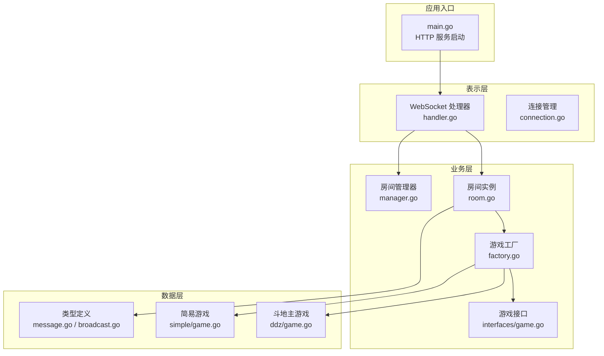
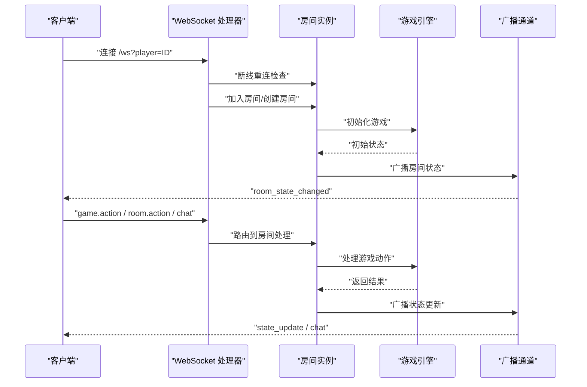
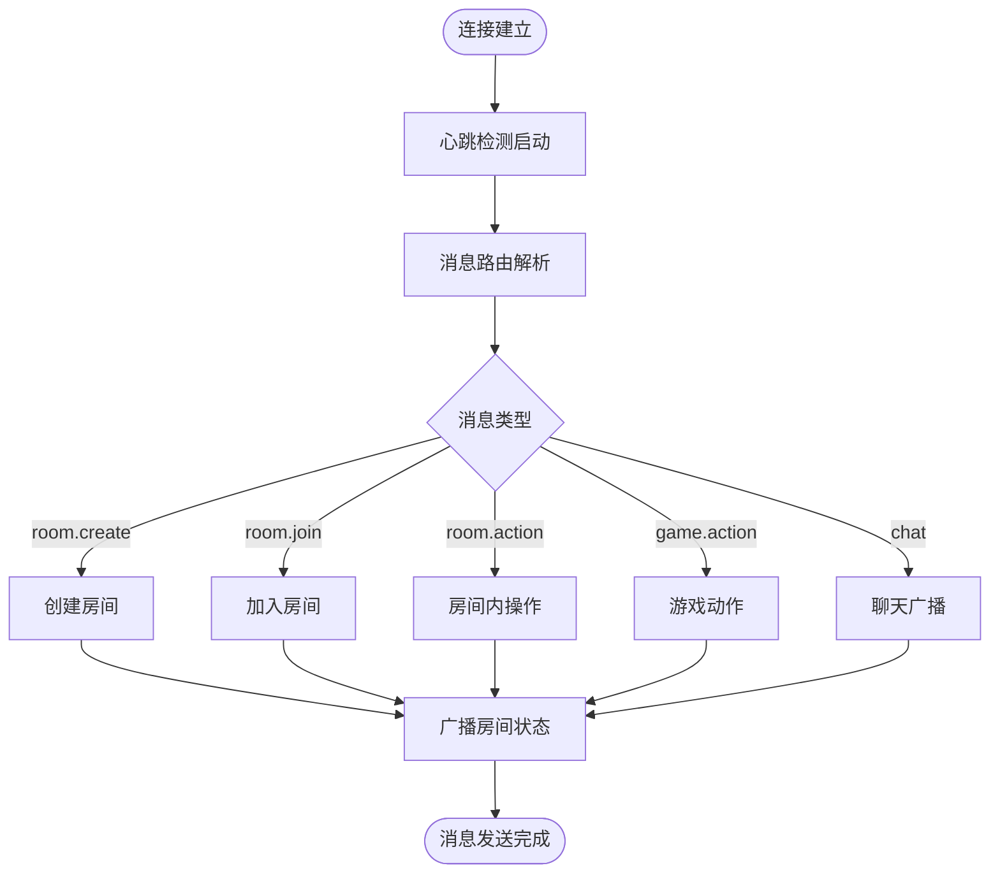
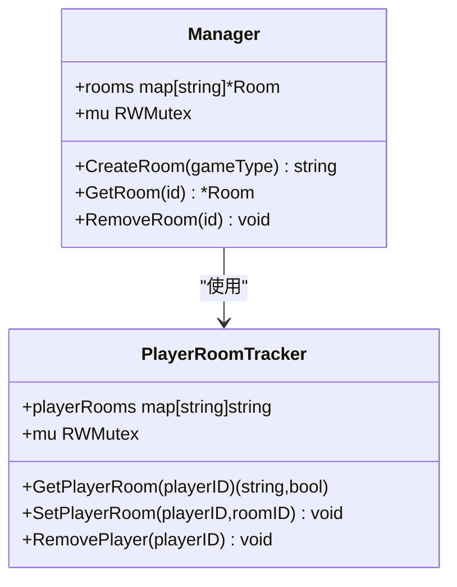
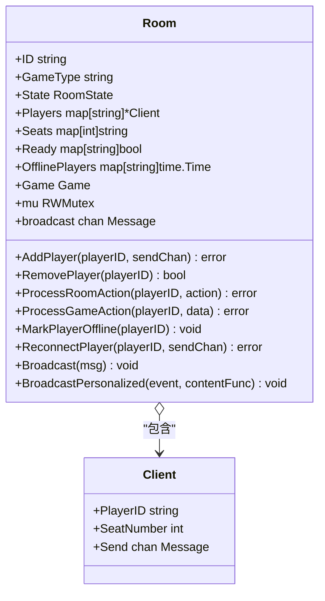
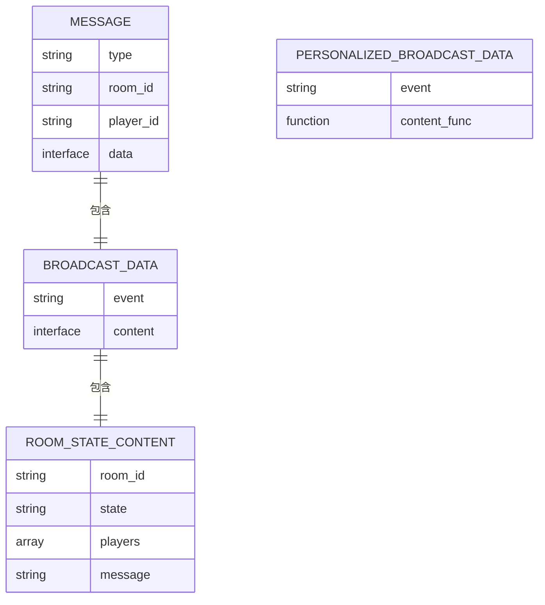
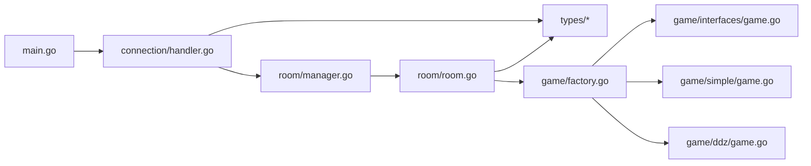

# 系统概览

<cite>
**本文档引用的文件**
- [main.go](file://main.go)
- [connection.go](file://internal/connection/connection.go)
- [handler.go](file://internal/connection/handler.go)
- [manager.go](file://internal/room/manager.go)
- [room.go](file://internal/room/room.go)
- [factory.go](file://internal/game/factory.go)
- [game.go](file://internal/game/interfaces/game.go)
- [message.go](file://internal/types/message.go)
- [broadcast.go](file://internal/types/broadcast.go)
- [simple.go](file://internal/game/simple/game.go)
- [ddz.go](file://internal/game/ddz/game.go)
- [README.md](file://README.md)
</cite>

## 目录
1. [简介](#简介)
2. [项目结构](#项目结构)
3. [核心组件](#核心组件)
4. [架构总览](#架构总览)
5. [详细组件分析](#详细组件分析)
6. [依赖关系分析](#依赖关系分析)
7. [性能考虑](#性能考虑)
8. [故障排查指南](#故障排查指南)
9. [结论](#结论)

## 简介
本项目是一个基于 Go 语言与 WebSocket 的多人在线卡牌游戏服务器，支持斗地主、麻将、简易卡牌等多种游戏模式。系统采用分层架构设计，分为表示层（WebSocket 连接管理）、业务层（房间管理与游戏引擎）、数据层（状态存储与广播），并通过统一的消息协议实现实时通信与状态同步。

## 项目结构
项目采用模块化组织，核心目录与职责如下：
- internal/connection：WebSocket 连接管理与消息处理
- internal/room：房间管理与房间生命周期控制
- internal/game：游戏逻辑实现与工厂
- internal/types：消息与事件类型定义
- docs：产品需求文档
- client.html / ddz-client.html / mahjong-client.html：测试客户端页面
- go.mod / go.sum：依赖管理



图表来源
- [main.go](file://main.go#L10-L14)
- [handler.go](file://internal/connection/handler.go#L19-L158)
- [manager.go](file://internal/room/manager.go#L47-L83)
- [room.go](file://internal/room/room.go#L14-L57)
- [factory.go](file://internal/game/factory.go#L11-L23)
- [game.go](file://internal/game/interfaces/game.go#L3-L16)
- [message.go](file://internal/types/message.go#L32-L38)
- [broadcast.go](file://internal/types/broadcast.go#L17-L26)

章节来源
- [README.md](file://README.md#L20-L50)

## 核心组件
- 表示层（WebSocket 连接）
  - 主要职责：建立 WebSocket 连接、心跳检测、消息解析与路由、错误处理、断线重连支持
  - 关键实现：WSHandler、heartbeat、writePump、消息路由与校验
- 业务层（房间管理与游戏引擎）
  - 主要职责：房间生命周期管理、玩家加入/离开、准备/选座、游戏状态广播、断线处理与超时恢复
  - 关键实现：Room、Room.Manager、Room.ProcessRoomAction、Room.ProcessGameAction
- 数据层（状态存储与广播）
  - 主要职责：统一消息结构、事件广播、房间状态与游戏状态封装
  - 关键实现：types.Message、types.BroadcastData、Room.broadcastRoomStateWithMessage

章节来源
- [connection.go](file://internal/connection/connection.go#L14-L61)
- [handler.go](file://internal/connection/handler.go#L19-L158)
- [room.go](file://internal/room/room.go#L14-L57)
- [manager.go](file://internal/room/manager.go#L47-L83)
- [message.go](file://internal/types/message.go#L32-L38)
- [broadcast.go](file://internal/types/broadcast.go#L17-L26)

## 架构总览
系统采用“请求-处理-广播”模式，WebSocket 连接作为入口，消息经由处理器分派至房间与游戏引擎，最终通过广播通道将状态同步给所有在线玩家。断线场景下，系统支持暂停与超时恢复，保证游戏公平性与用户体验。



图表来源
- [handler.go](file://internal/connection/handler.go#L19-L158)
- [room.go](file://internal/room/room.go#L462-L523)
- [broadcast.go](file://internal/types/broadcast.go#L17-L26)

## 详细组件分析

### 表示层组件分析
- WebSocket 连接管理
  - 心跳检测：每 30 秒发送 Ping，60 秒无响应则关闭连接
  - 玩家去重：同一 playerID 防止重复连接
  - 断线重连：根据房间状态尝试恢复连接
- 消息处理与路由
  - 支持 room.create、room.join、room.action、game.action、chat 等消息类型
  - 统一错误响应与参数校验
- 写泵与广播
  - 异步写入通道，避免阻塞读循环
  - 广播通道按房间维度异步投递消息



图表来源
- [handler.go](file://internal/connection/handler.go#L130-L156)
- [connection.go](file://internal/connection/connection.go#L34-L61)

章节来源
- [connection.go](file://internal/connection/connection.go#L14-L61)
- [handler.go](file://internal/connection/handler.go#L19-L158)

### 业务层组件分析

#### 房间管理器（Room.Manager）
- 全局房间映射与并发安全
- 房间创建、查询、移除
- 玩家房间追踪与并发保护



图表来源
- [manager.go](file://internal/room/manager.go#L47-L83)
- [manager.go](file://internal/room/manager.go#L17-L45)

章节来源
- [manager.go](file://internal/room/manager.go#L47-L83)

#### 房间实例（Room）
- 房间状态：waiting、playing、paused、gameover
- 玩家管理：加入/离开、座位分配、准备状态
- 游戏引擎集成：初始化、动作处理、回合推进
- 广播机制：普通广播与个性化广播（含断线过滤）
- 断线处理：暂停/恢复、超时清理



图表来源
- [room.go](file://internal/room/room.go#L14-L57)
- [room.go](file://internal/room/room.go#L29-L33)

章节来源
- [room.go](file://internal/room/room.go#L14-L57)
- [room.go](file://internal/room/room.go#L295-L523)

#### 游戏工厂与接口（Game.Factory / interfaces.Game）
- 工厂模式：根据 game_type 创建对应游戏实例
- 接口抽象：统一的初始化、动作处理、回合推进、状态查询与胜负判定

```mermaid
classDiagram
class Game {
<<interface>>
+ID() string
+Init(players []string) error
+ProcessAction(playerID, action) (bool,error)
+CurrentTurn() string
+AdvanceTurn() void
+GetState() interface{}
+GetStateForPlayer(playerID string) interface{}
+IsGameOver() bool
+Winner() string
+MaxPlayers() int
+MinPlayers() int
}
class Factory {
+NewGame(gameType) Game
}
class SimpleGame
class DdzGame
Factory --> Game : "创建"
SimpleGame ..|> Game
DdzGame ..|> Game
```

图表来源
- [factory.go](file://internal/game/factory.go#L11-L23)
- [game.go](file://internal/game/interfaces/game.go#L3-L16)
- [simple.go](file://internal/game/simple/game.go#L8-L19)
- [ddz.go](file://internal/game/ddz/game.go#L20-L45)

章节来源
- [factory.go](file://internal/game/factory.go#L11-L23)
- [game.go](file://internal/game/interfaces/game.go#L3-L16)

### 数据层与消息协议
- 统一消息结构：Message.Type、Message.RoomID、Message.PlayerID、Message.Data
- 事件类型：房间状态变更、游戏开始/结束、状态更新、聊天
- 广播数据：BroadcastData、PersonalizedBroadcastData
- 房间状态内容：RoomStateContent、PlayerSeatInfo



图表来源
- [message.go](file://internal/types/message.go#L32-L38)
- [broadcast.go](file://internal/types/broadcast.go#L17-L26)
- [broadcast.go](file://internal/types/broadcast.go#L34-L47)

章节来源
- [message.go](file://internal/types/message.go#L32-L78)
- [broadcast.go](file://internal/types/broadcast.go#L17-L48)

## 依赖关系分析
- 入口依赖：main.go 依赖 internal/connection 提供 WSHandler
- 连接层依赖：handler.go 依赖 room.GlobalManager、types、websocket
- 房间层依赖：room.go 依赖 game.NewGame、types、interfaces.Game
- 游戏层依赖：factory.go 依赖各游戏实现；simple.go、ddz.go 实现 Game 接口
- 类型层依赖：types 包被连接层与房间层广泛使用



图表来源
- [main.go](file://main.go#L7-L11)
- [handler.go](file://internal/connection/handler.go#L9-L12)
- [manager.go](file://internal/room/manager.go#L47-L52)
- [room.go](file://internal/room/room.go#L4-L6)
- [factory.go](file://internal/game/factory.go#L3-L8)

章节来源
- [main.go](file://main.go#L7-L11)
- [handler.go](file://internal/connection/handler.go#L9-L12)
- [room.go](file://internal/room/room.go#L4-L6)

## 性能考虑
- 并发安全：全局追踪与房间管理均使用读写锁，降低锁竞争
- 异步广播：广播通道缓冲与异步发送，避免阻塞主处理循环
- 心跳与超时：60 秒读超时与 30 秒心跳，保障连接健康
- 防抖与限流：100ms 防抖过滤重复操作，广播通道默认缓冲提升吞吐
- 断线处理：断线超时清理，避免僵尸连接占用资源

## 故障排查指南
- 连接问题
  - 心跳超时：检查客户端网络与服务器日志，确认 Ping/Pong 正常
  - 重复连接：同一 playerID 已连接时会被拒绝
- 房间问题
  - 房间不存在：GetRoom 返回错误，检查房间号
  - 房间已满：MaxPlayers 达到上限
  - 玩家不在房间：validatePlayerInRoom 校验失败
- 游戏问题
  - 非法动作：游戏引擎返回错误，检查动作类型与数据格式
  - 游戏暂停：断线导致暂停，等待重连或超时清理
- 广播问题
  - 消息丢失：检查广播通道是否关闭或队列已满
  - 个性化广播：ContentFunc 生成异常需捕获 panic

章节来源
- [connection.go](file://internal/connection/connection.go#L34-L61)
- [handler.go](file://internal/connection/handler.go#L455-L473)
- [room.go](file://internal/room/room.go#L462-L523)

## 结论
本系统通过清晰的分层设计与模块化实现，提供了稳定可靠的多人卡牌游戏服务。WebSocket 实时通信与异步广播机制确保了低延迟与高并发下的状态一致性；断线重连与超时清理提升了用户体验与系统鲁棒性。工厂模式与接口抽象使得新增游戏类型变得简单，便于扩展与维护。