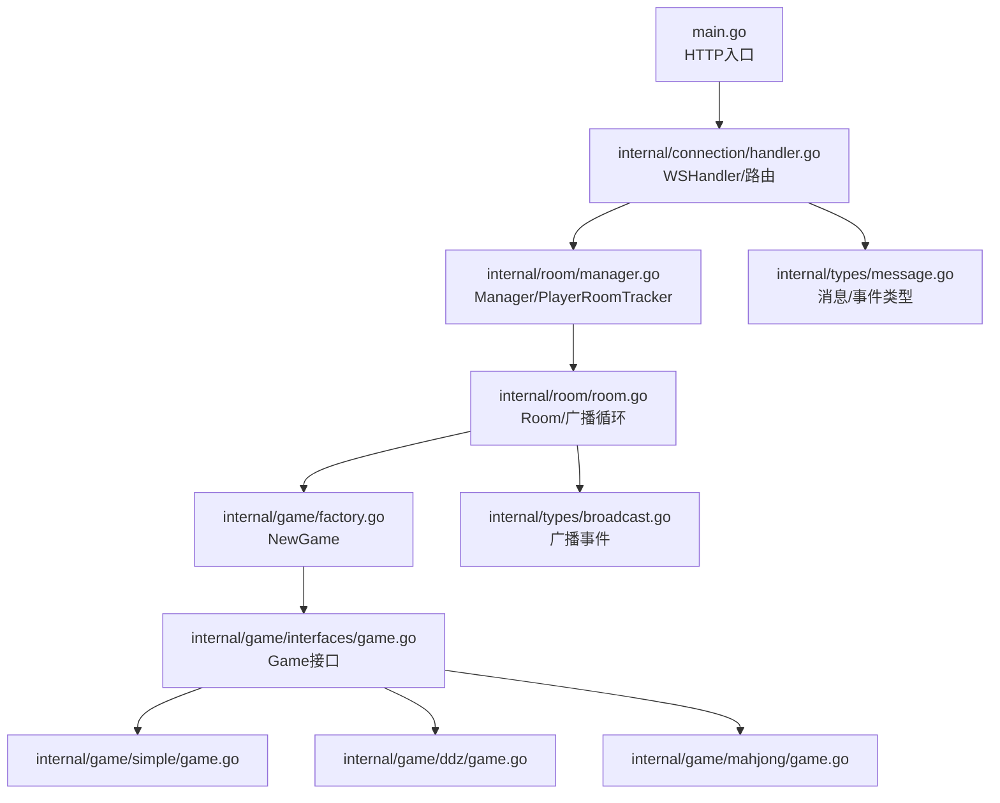
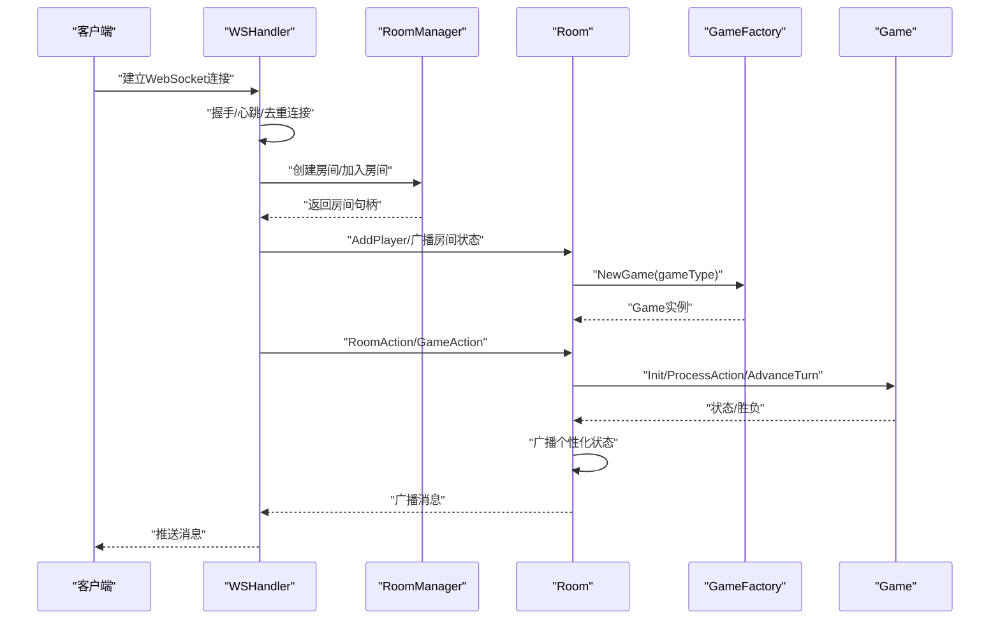
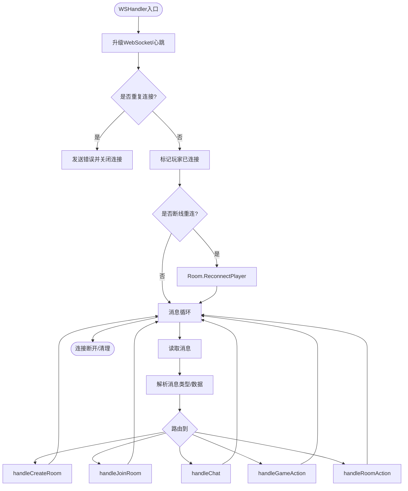
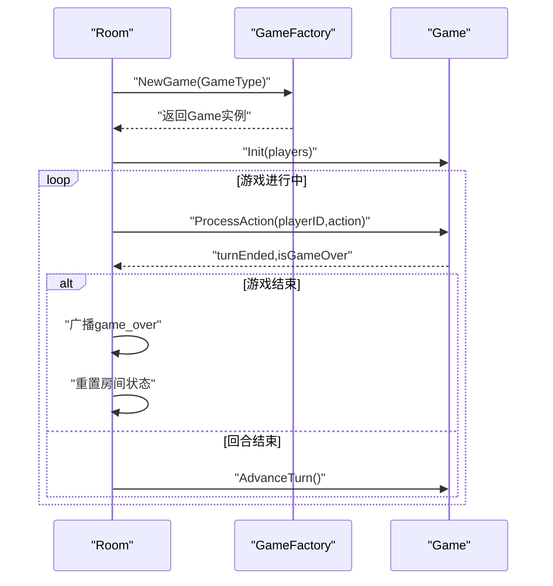
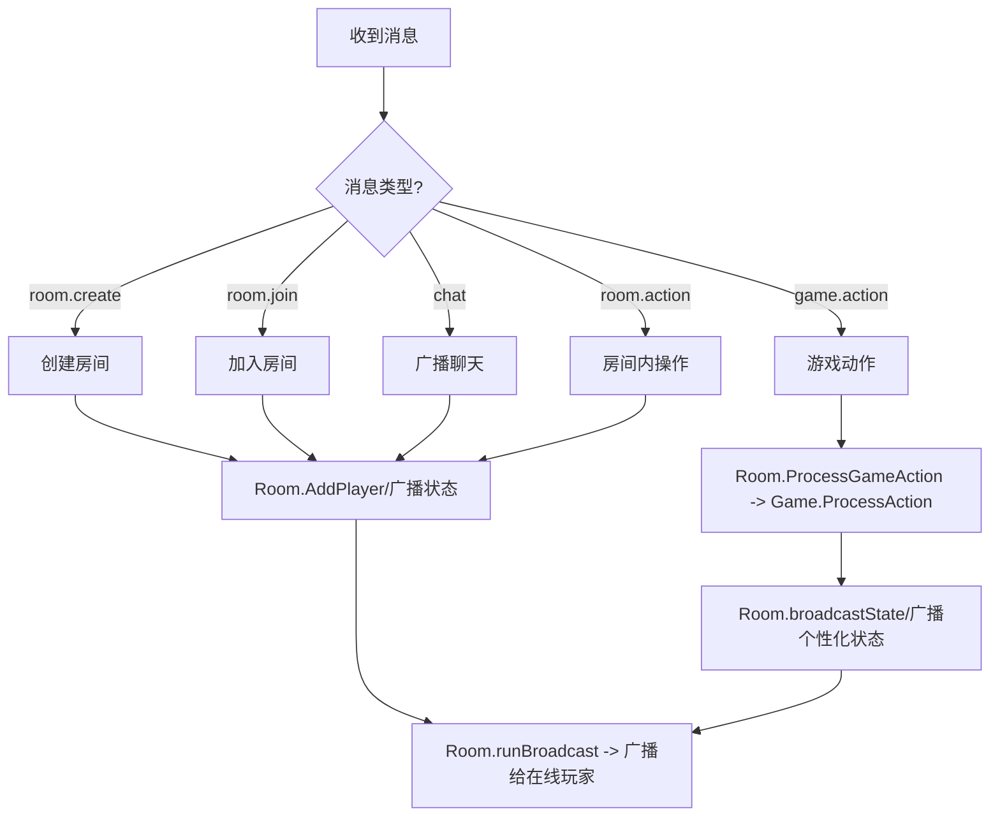
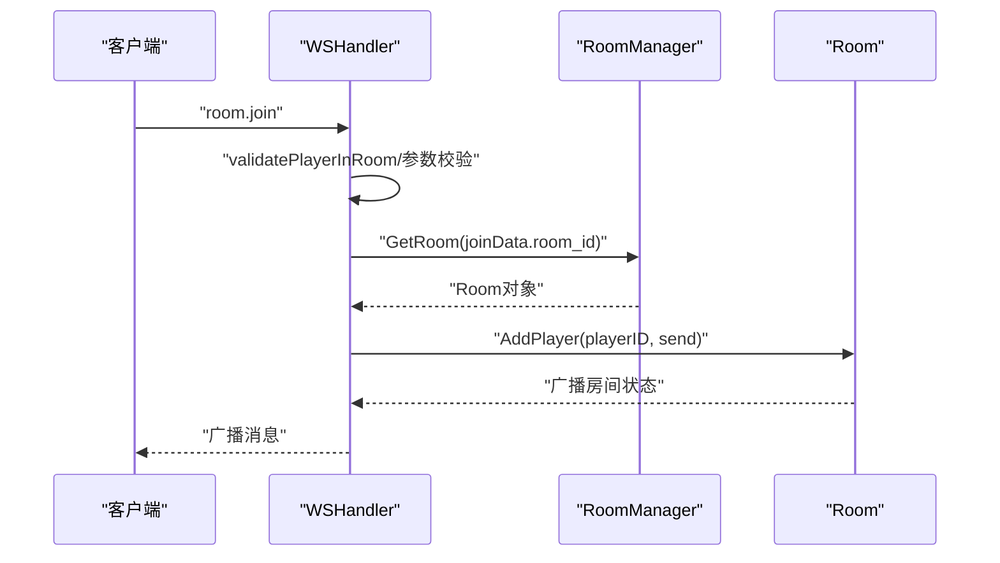
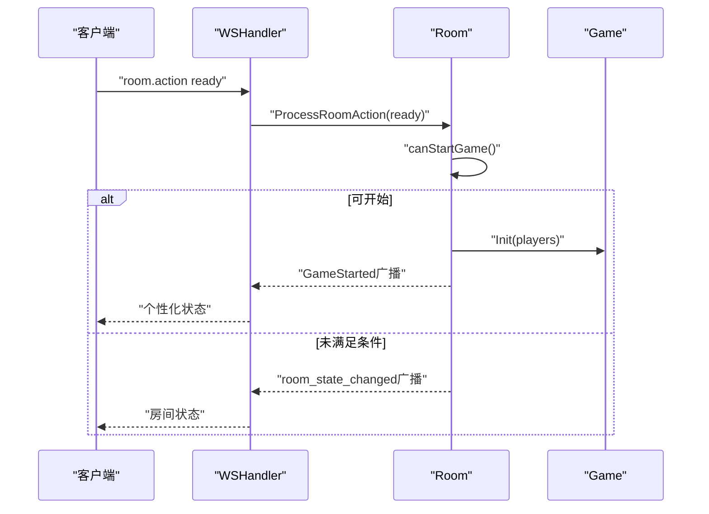
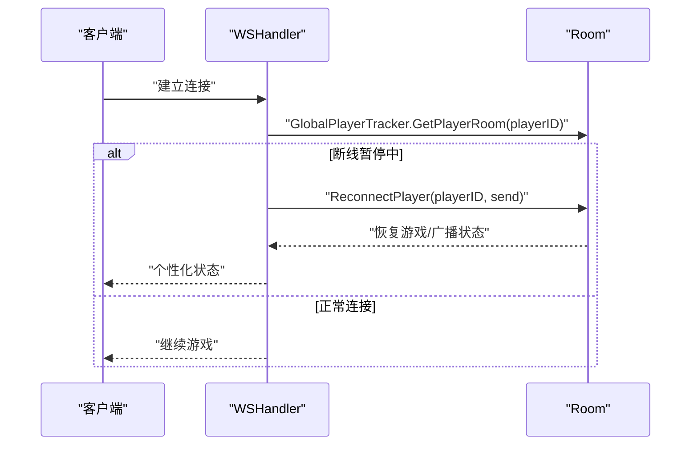
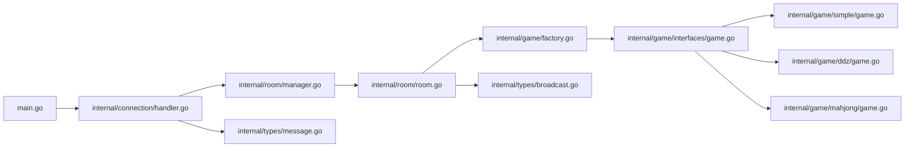

# 组件交互关系

<cite>
**本文引用的文件**
- [main.go](file://main.go)
- [handler.go](file://internal/connection/handler.go)
- [connection.go](file://internal/connection/connection.go)
- [manager.go](file://internal/room/manager.go)
- [room.go](file://internal/room/room.go)
- [factory.go](file://internal/game/factory.go)
- [game.go](file://internal/game/interfaces/game.go)
- [message.go](file://internal/types/message.go)
- [broadcast.go](file://internal/types/broadcast.go)
- [simple_game.go](file://internal/game/simple/game.go)
- [ddz_game.go](file://internal/game/ddz/game.go)
- [mahjong_game.go](file://internal/game/mahjong/game.go)
</cite>

## 目录
1. [简介](#简介)
2. [项目结构](#项目结构)
3. [核心组件](#核心组件)
4. [架构总览](#架构总览)
5. [详细组件分析](#详细组件分析)
6. [依赖关系分析](#依赖关系分析)
7. [性能考量](#性能考量)
8. [故障排查指南](#故障排查指南)
9. [结论](#结论)

## 简介
本文件面向卡牌游戏服务器，聚焦于组件交互关系与消息路由机制，系统性梳理 WebSocket 处理器、房间管理器、游戏工厂与具体游戏实例之间的协作模式，以及从连接建立、消息接收、处理到状态同步的完整流程。文档同时给出关键场景的时序图与流程图，帮助读者快速理解断线重连、玩家加入房间、游戏开始与状态同步等典型交互。

## 项目结构
项目采用按功能域划分的目录组织：
- 入口程序负责启动 HTTP 服务并挂载 WebSocket 路由
- 连接层负责 WebSocket 握手、心跳、消息解析与路由分发
- 房间层负责房间生命周期、玩家管理、广播与游戏状态同步
- 游戏层通过工厂模式创建不同游戏实例，并提供统一接口
- 类型层定义消息、事件与房间状态等通用数据结构



图表来源
- [main.go](file://main.go#L10-L14)
- [handler.go](file://internal/connection/handler.go#L19-L158)
- [manager.go](file://internal/room/manager.go#L47-L82)
- [room.go](file://internal/room/room.go#L35-L57)
- [factory.go](file://internal/game/factory.go#L11-L23)
- [game.go](file://internal/game/interfaces/game.go#L3-L22)
- [message.go](file://internal/types/message.go#L13-L38)
- [broadcast.go](file://internal/types/broadcast.go#L3-L15)

章节来源
- [main.go](file://main.go#L10-L14)
- [handler.go](file://internal/connection/handler.go#L19-L158)
- [manager.go](file://internal/room/manager.go#L47-L82)
- [room.go](file://internal/room/room.go#L35-L57)
- [factory.go](file://internal/game/factory.go#L11-L23)
- [game.go](file://internal/game/interfaces/game.go#L3-L22)
- [message.go](file://internal/types/message.go#L13-L38)
- [broadcast.go](file://internal/types/broadcast.go#L3-L15)

## 核心组件
- WebSocket 处理器（WSHandler）：负责升级 WebSocket、心跳检测、消息解析与路由分发至房间层；处理断线重连、错误反馈与资源清理
- 房间管理器（Manager/PlayerRoomTracker）：全局房间与玩家房间映射的管理，提供创建、获取与删除房间的能力
- 房间（Room）：维护玩家集合、座位、准备状态、离线玩家与定时器；封装广播通道与个性化广播；协调游戏工厂创建游戏实例并处理房间内与游戏内的操作
- 游戏工厂（NewGame）：根据游戏类型创建具体游戏实例（simple/ddz/mahjong），统一对外暴露 Game 接口
- 游戏接口（Game）：抽象所有卡牌游戏的共同能力（初始化、处理动作、回合推进、状态查询、胜负判定等）
- 类型系统（Message/Broadcast/事件）：统一消息结构、事件枚举与房间状态字段

章节来源
- [handler.go](file://internal/connection/handler.go#L19-L158)
- [manager.go](file://internal/room/manager.go#L47-L82)
- [room.go](file://internal/room/room.go#L14-L27)
- [factory.go](file://internal/game/factory.go#L11-L23)
- [game.go](file://internal/game/interfaces/game.go#L3-L22)
- [message.go](file://internal/types/message.go#L32-L77)
- [broadcast.go](file://internal/types/broadcast.go#L17-L47)

## 架构总览
WebSocket 连接建立后，处理器解析消息类型并分派到房间层；房间层通过游戏工厂创建游戏实例，随后将房间内操作与游戏动作交由房间协调处理，最终通过广播通道将状态同步给所有在线玩家。断线重连时，房间层支持标记离线与定时器触发的超时处理。



图表来源
- [handler.go](file://internal/connection/handler.go#L19-L158)
- [manager.go](file://internal/room/manager.go#L54-L74)
- [room.go](file://internal/room/room.go#L35-L57)
- [factory.go](file://internal/game/factory.go#L11-L23)
- [game.go](file://internal/game/interfaces/game.go#L3-L22)

## 详细组件分析

### WebSocket 处理器与房间管理器交互
- 连接建立：升级 WebSocket，校验玩家唯一性，支持断线重连路径
- 消息路由：根据消息类型解析 data，分派到创建房间、加入房间、聊天、游戏动作、房间操作等处理函数
- 错误处理：统一发送错误消息，保证客户端感知
- 资源清理：连接断开时清理玩家房间映射、移除房间或标记离线



图表来源
- [handler.go](file://internal/connection/handler.go#L19-L158)
- [connection.go](file://internal/connection/connection.go#L14-L30)

章节来源
- [handler.go](file://internal/connection/handler.go#L19-L158)
- [connection.go](file://internal/connection/connection.go#L14-L30)

### 房间管理器与房间协作
- 房间管理器提供全局房间表与玩家房间追踪，支持创建、获取与删除房间
- 房间在构造时通过游戏工厂创建具体游戏实例，并启动广播循环
- 房间负责玩家加入/移除、座位分配、准备状态、断线标记与定时器、房间状态广播与个性化状态广播

```mermaid
classDiagram
class Manager {
+CreateRoom(gameType) string
+GetRoom(id) Room
+RemoveRoom(id) void
}
class PlayerRoomTracker {
+GetPlayerRoom(playerID) (string,bool)
+SetPlayerRoom(playerID,roomID) void
+RemovePlayer(playerID) void
}
class Room {
+AddPlayer(playerID,send) error
+RemovePlayer(playerID) bool
+ProcessRoomAction(playerID,action) error
+ProcessGameAction(playerID,data) error
+Broadcast(msg) void
+BroadcastPersonalized(event,contentFunc) void
+MarkPlayerOffline(playerID) void
+ReconnectPlayer(playerID,send) error
}
class GameFactory {
+NewGame(gameType) Game
}
class Game {
+Init(players) error
+ProcessAction(playerID,action) (bool,error)
+AdvanceTurn() void
+GetState() interface{}
+GetStateForPlayer(playerID) interface{}
+IsGameOver() bool
+Winner() string
+MaxPlayers() int
+MinPlayers() int
}
Manager --> Room : "创建/获取/删除"
Room --> GameFactory : "创建Game实例"
GameFactory --> Game : "返回具体游戏"
Room --> Game : "委托处理动作/状态"
```

图表来源
- [manager.go](file://internal/room/manager.go#L47-L82)
- [room.go](file://internal/room/room.go#L14-L27)
- [factory.go](file://internal/game/factory.go#L11-L23)
- [game.go](file://internal/game/interfaces/game.go#L3-L22)

章节来源
- [manager.go](file://internal/room/manager.go#L47-L82)
- [room.go](file://internal/room/room.go#L14-L27)
- [factory.go](file://internal/game/factory.go#L11-L23)
- [game.go](file://internal/game/interfaces/game.go#L3-L22)

### 游戏工厂与具体游戏实例
- 工厂根据 game_type 返回对应游戏实例（simple/ddz/mahjong）
- 房间在创建时调用工厂并持有 Game 实例，后续所有游戏逻辑委托给 Game
- Game 接口统一了初始化、动作处理、回合推进、状态查询与胜负判定



图表来源
- [room.go](file://internal/room/room.go#L47-L52)
- [factory.go](file://internal/game/factory.go#L11-L23)
- [game.go](file://internal/game/interfaces/game.go#L3-L22)

章节来源
- [room.go](file://internal/room/room.go#L47-L52)
- [factory.go](file://internal/game/factory.go#L11-L23)
- [game.go](file://internal/game/interfaces/game.go#L3-L22)

### 消息路由机制与状态同步
- 消息类型定义在类型层，包含房间管理、房间内操作、游戏动作、聊天与广播/错误
- 房间层通过广播通道异步向所有在线玩家发送消息；支持个性化广播，按玩家生成专属内容
- 状态同步在房间开始、房间状态变更、游戏状态更新与游戏结束时触发



图表来源
- [message.go](file://internal/types/message.go#L13-L30)
- [handler.go](file://internal/connection/handler.go#L130-L156)
- [room.go](file://internal/room/room.go#L462-L538)
- [broadcast.go](file://internal/types/broadcast.go#L17-L26)

章节来源
- [message.go](file://internal/types/message.go#L13-L30)
- [handler.go](file://internal/connection/handler.go#L130-L156)
- [room.go](file://internal/room/room.go#L462-L538)
- [broadcast.go](file://internal/types/broadcast.go#L17-L26)

### 典型场景时序图

#### 场景一：玩家加入房间


图表来源
- [handler.go](file://internal/connection/handler.go#L223-L282)
- [manager.go](file://internal/room/manager.go#L66-L74)
- [room.go](file://internal/room/room.go#L59-L96)

章节来源
- [handler.go](file://internal/connection/handler.go#L223-L282)
- [manager.go](file://internal/room/manager.go#L66-L74)
- [room.go](file://internal/room/room.go#L59-L96)

#### 场景二：游戏开始与状态同步


图表来源
- [room.go](file://internal/room/room.go#L296-L348)
- [room.go](file://internal/room/room.go#L540-L566)

章节来源
- [room.go](file://internal/room/room.go#L296-L348)
- [room.go](file://internal/room/room.go#L540-L566)

#### 场景三：玩家断线重连


图表来源
- [handler.go](file://internal/connection/handler.go#L50-L60)
- [room.go](file://internal/room/room.go#L222-L257)

章节来源
- [handler.go](file://internal/connection/handler.go#L50-L60)
- [room.go](file://internal/room/room.go#L222-L257)

## 依赖关系分析
- 入口程序依赖连接层；连接层依赖房间层与类型层；房间层依赖游戏工厂与类型层；游戏工厂依赖具体游戏实现与接口层
- 房间层内部通过广播通道与房间内玩家的发送通道进行异步通信，避免阻塞
- 游戏接口作为抽象层，屏蔽不同游戏的差异，便于扩展新的游戏类型



图表来源
- [main.go](file://main.go#L10-L14)
- [handler.go](file://internal/connection/handler.go#L9-L12)
- [manager.go](file://internal/room/manager.go#L3-L7)
- [room.go](file://internal/room/room.go#L3-L12)
- [factory.go](file://internal/game/factory.go#L3-L9)
- [game.go](file://internal/game/interfaces/game.go#L3-L22)
- [message.go](file://internal/types/message.go#L1-L78)
- [broadcast.go](file://internal/types/broadcast.go#L1-L48)

章节来源
- [main.go](file://main.go#L10-L14)
- [handler.go](file://internal/connection/handler.go#L9-L12)
- [manager.go](file://internal/room/manager.go#L3-L7)
- [room.go](file://internal/room/room.go#L3-L12)
- [factory.go](file://internal/game/factory.go#L3-L9)
- [game.go](file://internal/game/interfaces/game.go#L3-L22)
- [message.go](file://internal/types/message.go#L1-L78)
- [broadcast.go](file://internal/types/broadcast.go#L1-L48)

## 性能考量
- 异步广播：房间使用带缓冲的广播通道，避免单个客户端阻塞影响整体广播
- 个性化广播：通过函数式内容生成，减少重复序列化与内存拷贝
- 心跳与超时：连接层设置读超时与 ping/pong，及时发现异常连接
- 防抖：房间对同一玩家短时间内的重复操作进行防抖，降低无效处理
- 断线超时：暂停状态下对断线玩家设置定时器，超时后清理并结束游戏，避免资源泄漏

章节来源
- [room.go](file://internal/room/room.go#L44-L56)
- [room.go](file://internal/room/room.go#L568-L612)
- [connection.go](file://internal/connection/connection.go#L32-L61)
- [room.go](file://internal/room/room.go#L476-L482)
- [room.go](file://internal/room/room.go#L161-L168)

## 故障排查指南
- 连接失败：检查握手与心跳配置，确认客户端参数（playerID）与服务端去重逻辑
- 房间不存在：确认房间 ID 是否正确，或是否已被清理
- 玩家不在房间：确认房间追踪器中的映射是否正确，或是否已断线清理
- 游戏动作非法：检查当前回合、阶段与动作类型是否符合游戏规则
- 广播失败：关注广播通道关闭与单个客户端队列满的情况，必要时增加缓冲或丢弃策略

章节来源
- [handler.go](file://internal/connection/handler.go#L31-L44)
- [manager.go](file://internal/room/manager.go#L66-L74)
- [room.go](file://internal/room/room.go#L462-L482)
- [room.go](file://internal/room/room.go#L568-L612)

## 结论
本系统通过清晰的职责分离与统一的消息模型，实现了 WebSocket 连接、房间管理与游戏逻辑的解耦协作。房间层作为中枢，既负责玩家与房间状态管理，又通过工厂模式与游戏接口实现对多种游戏类型的统一接入。广播通道与个性化广播机制保障了状态同步的实时性与一致性。针对断线重连、心跳检测与超时清理等关键特性，系统提供了稳健的容错与资源回收策略，适合进一步扩展更多卡牌游戏类型与复杂业务场景。