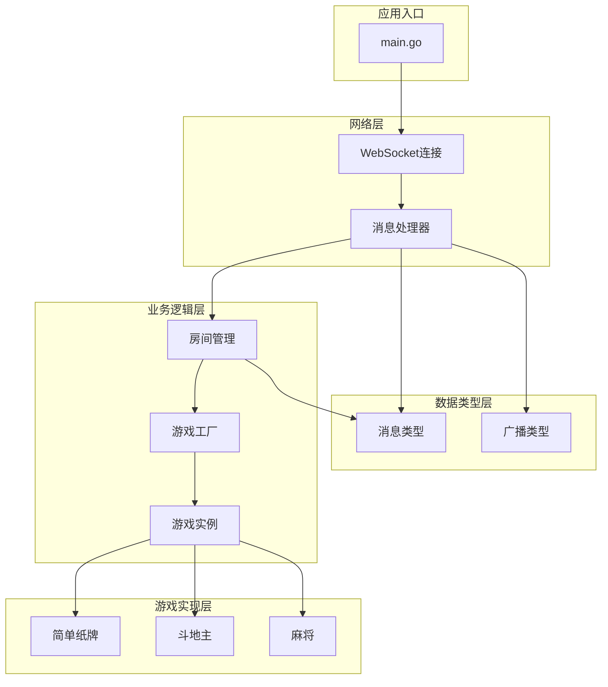
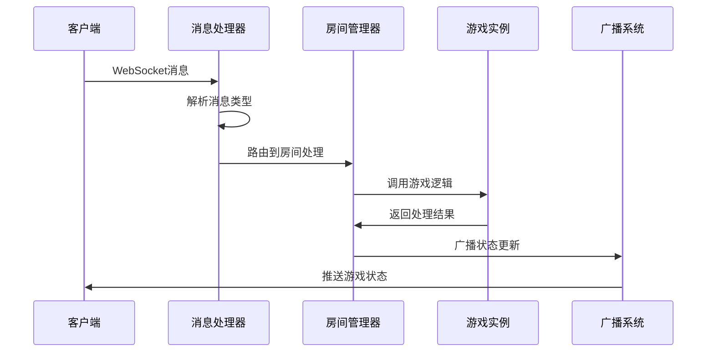
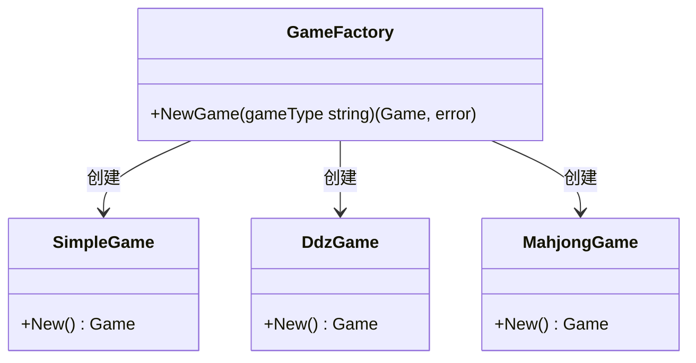
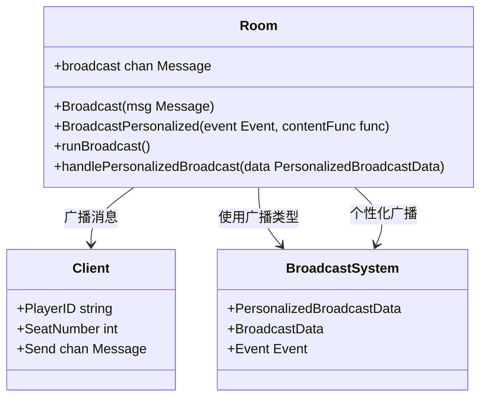
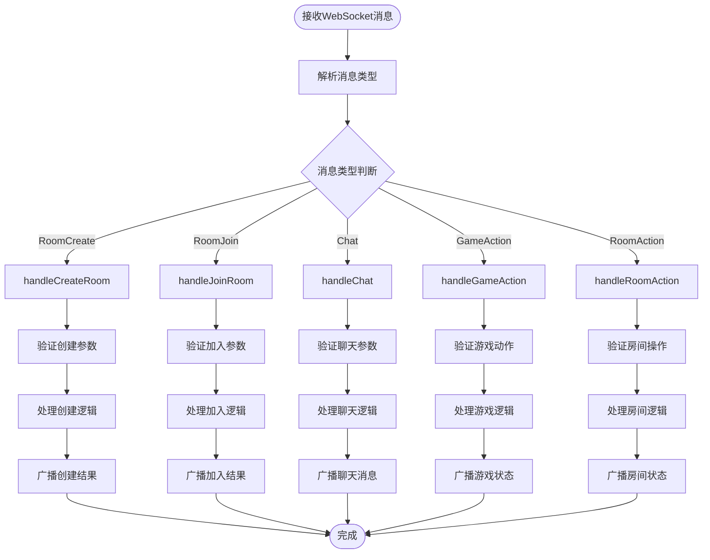
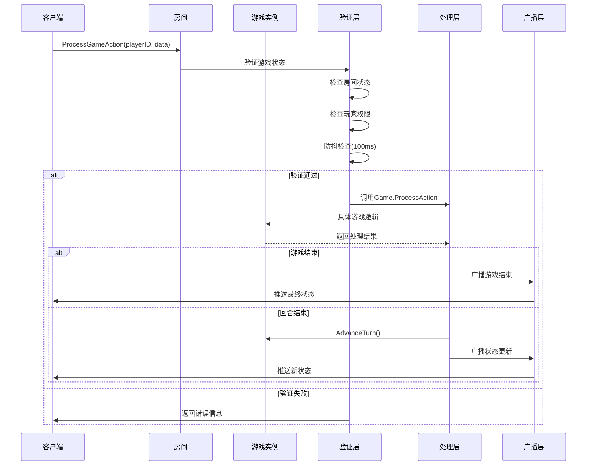
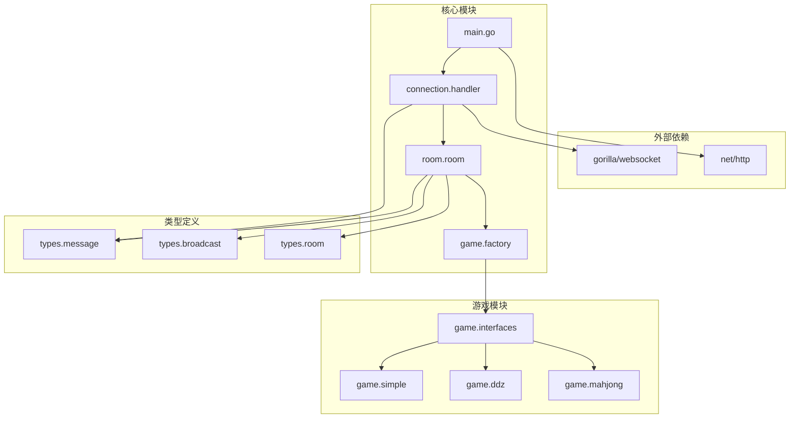

# 设计模式应用

<cite>
**本文档引用的文件**
- [factory.go](file://internal/game/factory.go)
- [game.go](file://internal/game/interfaces/game.go)
- [handler.go](file://internal/connection/handler.go)
- [broadcast.go](file://internal/types/broadcast.go)
- [manager.go](file://internal/room/manager.go)
- [room.go](file://internal/room/room.go)
- [simple_game.go](file://internal/game/simple/game.go)
- [mahjong_game.go](file://internal/game/mahjong/game.go)
- [ddz_game.go](file://internal/game/ddz/game.go)
- [message.go](file://internal/types/message.go)
- [main.go](file://main.go)
</cite>

## 目录
1. [简介](#简介)
2. [项目结构](#项目结构)
3. [核心组件](#核心组件)
4. [架构概览](#架构概览)
5. [设计模式详解](#设计模式详解)
6. [依赖关系分析](#依赖关系分析)
7. [性能考虑](#性能考虑)
8. [故障排除指南](#故障排除指南)
9. [结论](#结论)

## 简介

本项目是一个基于Go语言开发的卡牌游戏服务器，支持多种游戏类型（简单纸牌、斗地主、麻将）。系统采用模块化设计，通过多种设计模式实现了高内聚、低耦合的架构。本文档重点分析项目中应用的设计模式，包括工厂模式、观察者模式、策略模式和责任链模式，并详细说明它们的实现方式、选择原因以及带来的好处。

## 项目结构

项目采用清晰的分层架构，按照功能模块组织代码：



**图表来源**
- [main.go](file://main.go#L10-L14)
- [handler.go](file://internal/connection/handler.go#L19-L158)
- [room.go](file://internal/room/room.go#L35-L57)
- [factory.go](file://internal/game/factory.go#L12-L23)

**章节来源**
- [main.go](file://main.go#L1-L15)
- [handler.go](file://internal/connection/handler.go#L1-L474)

## 核心组件

### 游戏接口抽象

系统通过统一的Game接口抽象所有游戏类型的共同行为：

```mermaid
classDiagram
class Game {
<<interface>>
+ID() string
+Init(players []string) error
+ProcessAction(playerID string, action interface{}) (bool, error)
+CurrentTurn() string
+AdvanceTurn()
+GetState() interface{}
+GetStateForPlayer(playerID string) interface{}
+IsGameOver() bool
+Winner() string
+MaxPlayers() int
+MinPlayers() int
}
class SimpleGame {
-players []string
-turnIndex int
-lastCard int
-hands map[string][]int
-gameOver bool
-winner string
+ID() string
+Init(players []string) error
+ProcessAction(playerID string, action interface{}) (bool, error)
+CurrentTurn() string
+AdvanceTurn()
+GetState() interface{}
+GetStateForPlayer(playerID string) interface{}
+IsGameOver() bool
+Winner() string
+MaxPlayers() int
+MinPlayers() int
}
class DdzGame {
-players []string
-playerSeats map[string]int
-hands map[string]Hand
-bottomCards Hand
-landlord string
-calls map[string]int
-phase string
+ID() string
+Init(players []string) error
+ProcessAction(playerID string, action interface{}) (bool, error)
+CurrentTurn() string
+AdvanceTurn()
+GetState() interface{}
+GetStateForPlayer(playerID string) interface{}
+IsGameOver() bool
+Winner() string
+MaxPlayers() int
+MinPlayers() int
}
class MahjongGame {
-players []string
-playerSeats map[string]int
-hands [4]Tiles
-melds [4][]Meld
-discards [4]Tiles
-wall Tiles
-phase string
+ID() string
+Init(players []string) error
+ProcessAction(playerID string, action interface{}) (bool, error)
+CurrentTurn() string
+AdvanceTurn()
+GetState() interface{}
+GetStateForPlayer(playerID string) interface{}
+IsGameOver() bool
+Winner() string
+MaxPlayers() int
+MinPlayers() int
}
Game <|.. SimpleGame
Game <|.. DdzGame
Game <|.. MahjongGame
```

**图表来源**
- [game.go](file://internal/game/interfaces/game.go#L4-L16)
- [simple_game.go](file://internal/game/simple/game.go#L8-L15)
- [ddz_game.go](file://internal/game/ddz/game.go#L20-L35)
- [mahjong_game.go](file://internal/game/mahjong/game.go#L52-L77)

**章节来源**
- [game.go](file://internal/game/interfaces/game.go#L1-L23)
- [simple_game.go](file://internal/game/simple/game.go#L1-L102)
- [ddz_game.go](file://internal/game/ddz/game.go#L1-L841)
- [mahjong_game.go](file://internal/game/mahjong/game.go#L1-L805)

## 架构概览

系统采用典型的三层架构设计，通过消息驱动的方式实现松耦合的组件交互：



**图表来源**
- [handler.go](file://internal/connection/handler.go#L19-L158)
- [room.go](file://internal/room/room.go#L462-L523)
- [broadcast.go](file://internal/types/broadcast.go#L17-L26)

## 设计模式详解

### 工厂模式：游戏实例创建

#### 实现原理

系统使用工厂模式来创建不同类型的游戏实例，通过统一的工厂函数根据游戏类型参数创建相应的游戏对象。



**图表来源**
- [factory.go](file://internal/game/factory.go#L12-L23)
- [simple_game.go](file://internal/game/simple/game.go#L17-L19)
- [ddz_game.go](file://internal/game/ddz/game.go#L43-L45)
- [mahjong_game.go](file://internal/game/mahjong/game.go#L79-L81)

#### 选择原因

1. **解耦游戏类型与创建逻辑**：客户端只需知道游戏类型字符串，无需了解具体的游戏实现
2. **易于扩展新游戏类型**：新增游戏时只需实现Game接口并更新工厂函数
3. **集中式配置管理**：所有游戏类型的创建逻辑集中在单一位置

#### 实现细节

工厂函数采用简单的switch-case结构，支持以下游戏类型：
- `"simple"`：简单纸牌游戏
- `"ddz"`：斗地主游戏  
- `"mahjong"`：麻将游戏

#### 带来的好处

1. **运行时多态**：通过统一的Game接口实现不同游戏逻辑
2. **配置驱动**：通过游戏类型字符串轻松切换游戏模式
3. **测试友好**：可以轻松替换为测试替身对象

**章节来源**
- [factory.go](file://internal/game/factory.go#L1-L24)

### 观察者模式：消息广播系统

#### 实现原理

系统采用发布-订阅模式实现消息广播，房间作为发布者，所有连接的客户端作为订阅者。



**图表来源**
- [room.go](file://internal/room/room.go#L98-L131)
- [room.go](file://internal/room/room.go#L568-L656)
- [broadcast.go](file://internal/types/broadcast.go#L17-L26)

#### 选择原因

1. **异步处理**：使用channel实现异步消息传递，避免阻塞主线程
2. **内存效率**：通过channel缓冲区避免频繁的内存分配
3. **并发安全**：内置goroutine安全机制

#### 实现细节

1. **普通广播**：使用`Broadcast()`方法发送给所有在线玩家
2. **个性化广播**：使用`BroadcastPersonalized()`为每个玩家生成定制内容
3. **断线处理**：自动跳过断线玩家，确保消息可靠传递

#### 带来的好处

1. **实时性**：消息几乎无延迟地推送到所有客户端
2. **可扩展性**：支持动态增加或移除订阅者
3. **解耦性**：发布者和订阅者之间完全解耦

**章节来源**
- [room.go](file://internal/room/room.go#L98-L131)
- [room.go](file://internal/room/room.go#L568-L656)
- [broadcast.go](file://internal/types/broadcast.go#L1-L48)

### 策略模式：消息处理流程

#### 实现原理

系统使用策略模式处理不同类型的消息，通过消息类型枚举和对应的处理函数实现灵活的消息路由。



**图表来源**
- [handler.go](file://internal/connection/handler.go#L19-L158)
- [handler.go](file://internal/connection/handler.go#L160-L421)

#### 选择原因

1. **可扩展性**：新增消息类型时只需添加新的处理函数
2. **职责分离**：每种消息类型都有专门的处理逻辑
3. **测试便利**：可以独立测试每种消息类型的处理逻辑

#### 实现细节

1. **消息类型枚举**：定义了完整的消息类型集合
2. **参数验证**：每种消息类型都有对应的参数验证逻辑
3. **错误处理**：统一的错误响应机制

#### 带来的好处

1. **清晰的控制流**：消息处理逻辑清晰可见
2. **易于维护**：每种消息类型的处理逻辑独立存在
3. **可测试性**：可以针对每种消息类型编写单元测试

**章节来源**
- [handler.go](file://internal/connection/handler.go#L1-L474)
- [message.go](file://internal/types/message.go#L1-L78)

### 责任链模式：游戏动作处理

#### 实现原理

系统在游戏动作处理中体现了责任链模式的思想，通过多层验证和处理实现复杂的业务逻辑。



**图表来源**
- [room.go](file://internal/room/room.go#L462-L523)
- [room.go](file://internal/room/room.go#L528-L538)

#### 选择原因

1. **复杂业务逻辑**：游戏动作涉及多个验证步骤和处理阶段
2. **可扩展性**：可以在责任链中添加新的验证或处理步骤
3. **错误隔离**：每个环节的错误都可以被单独捕获和处理

#### 实现细节

1. **状态验证**：检查房间是否处于可接受动作的状态
2. **权限验证**：确保当前玩家有权执行该动作
3. **防抖处理**：防止玩家短时间内重复提交相同动作
4. **结果处理**：根据处理结果决定是否广播状态更新

#### 带来的好处

1. **模块化设计**：每个处理环节职责明确
2. **错误处理**：可以精确地定位和处理错误
3. **性能优化**：早期失败可以避免不必要的计算

**章节来源**
- [room.go](file://internal/room/room.go#L462-L523)

## 依赖关系分析

系统采用清晰的依赖层次结构，确保模块间的松耦合：



**图表来源**
- [main.go](file://main.go#L3-L8)
- [handler.go](file://internal/connection/handler.go#L3-L13)
- [room.go](file://internal/room/room.go#L3-L12)

**章节来源**
- [main.go](file://main.go#L1-L15)
- [handler.go](file://internal/connection/handler.go#L1-L474)
- [room.go](file://internal/room/room.go#L1-L657)

## 性能考虑

### 并发模型

系统采用goroutine和channel实现高并发处理：

1. **异步广播**：使用独立goroutine处理消息广播，避免阻塞主处理流程
2. **通道缓冲**：合理设置channel缓冲区大小，平衡内存使用和性能
3. **读写分离**：使用RWMutex实现读多写少场景下的高效访问

### 内存管理

1. **对象池**：通过channel实现消息对象的复用
2. **延迟初始化**：游戏实例按需创建，减少内存占用
3. **及时清理**：房间空闲时及时释放资源

### 网络优化

1. **心跳检测**：防止长时间占用连接资源
2. **批量处理**：合并相似的广播消息
3. **错误恢复**：优雅处理网络异常情况

## 故障排除指南

### 常见问题及解决方案

1. **游戏实例创建失败**
   - 检查游戏类型参数是否正确
   - 确认对应的游戏实现已正确导入

2. **消息处理异常**
   - 验证消息格式是否符合预期
   - 检查消息类型枚举值是否正确

3. **广播消息丢失**
   - 检查channel是否已关闭
   - 确认断线玩家已被正确处理

### 调试建议

1. **启用详细日志**：在开发环境中开启详细的调试日志
2. **监控资源使用**：定期检查内存和CPU使用情况
3. **压力测试**：模拟高并发场景验证系统稳定性

**章节来源**
- [room.go](file://internal/room/room.go#L134-L220)
- [handler.go](file://internal/connection/handler.go#L364-L381)

## 结论

本项目通过精心设计的多种设计模式，成功构建了一个可扩展、可维护、高性能的卡牌游戏服务器。工厂模式确保了游戏实例创建的灵活性，观察者模式实现了高效的实时消息推送，策略模式提供了清晰的消息处理架构，责任链模式保证了复杂业务逻辑的有序执行。

这些设计模式的综合应用不仅提高了系统的代码质量，还为未来的功能扩展奠定了坚实的基础。通过模块化的架构设计和清晰的职责分离，系统具备了良好的可测试性和可维护性，能够适应不断变化的业务需求。