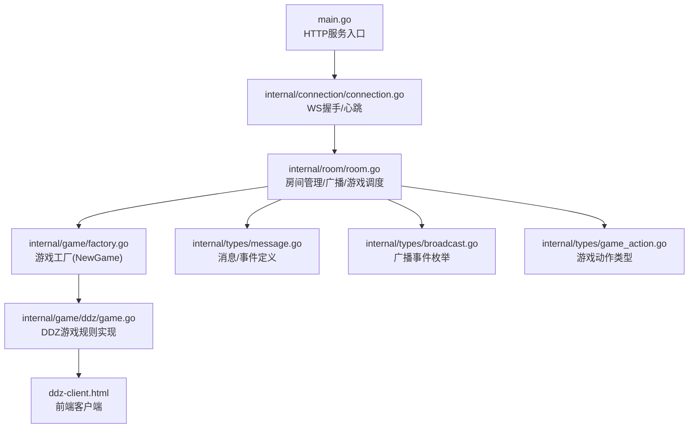
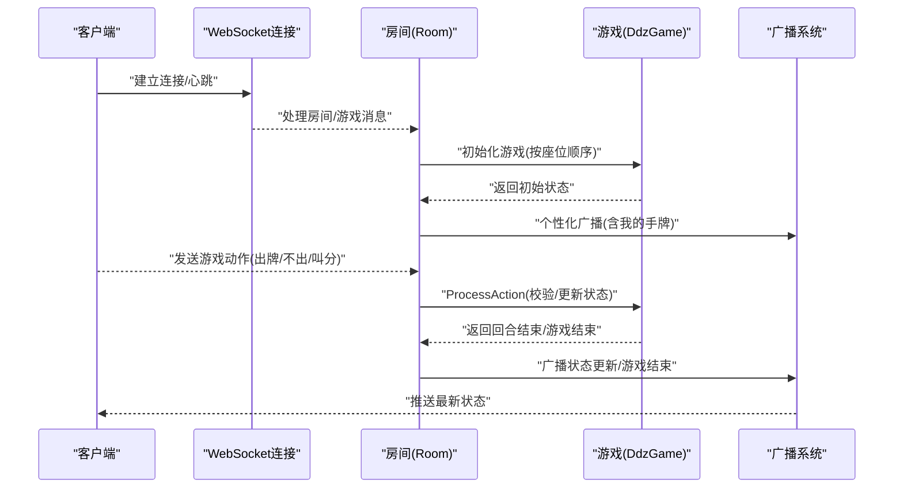
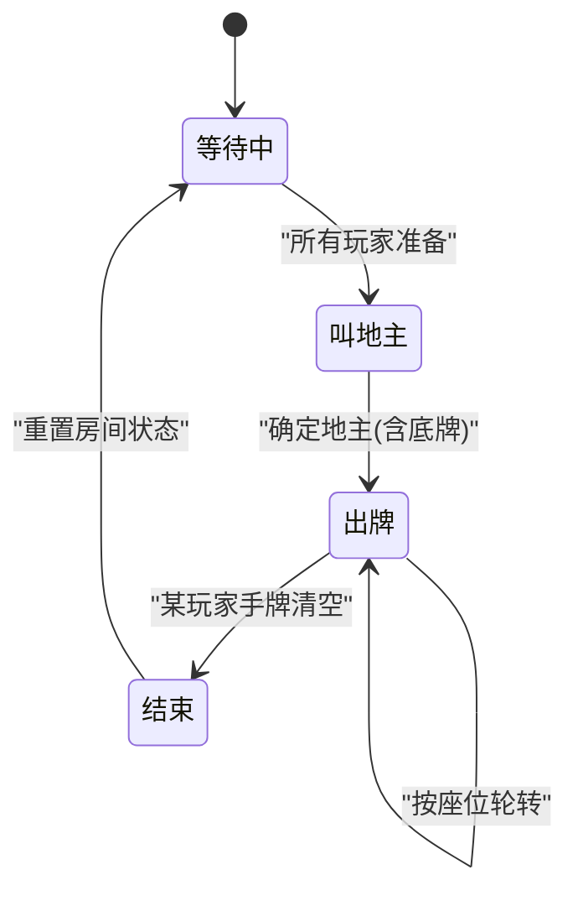
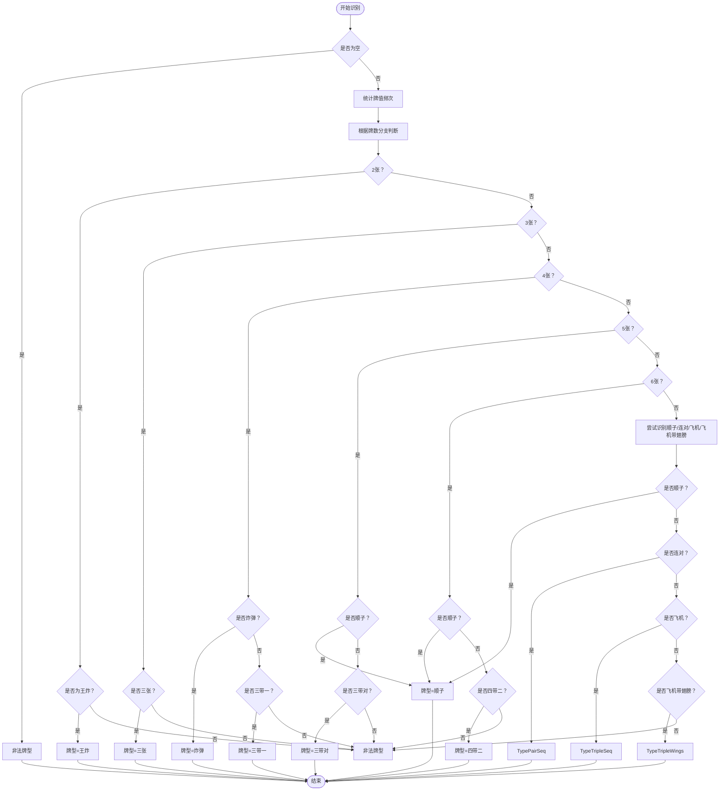
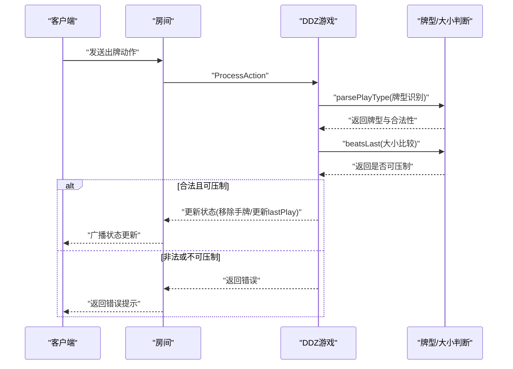
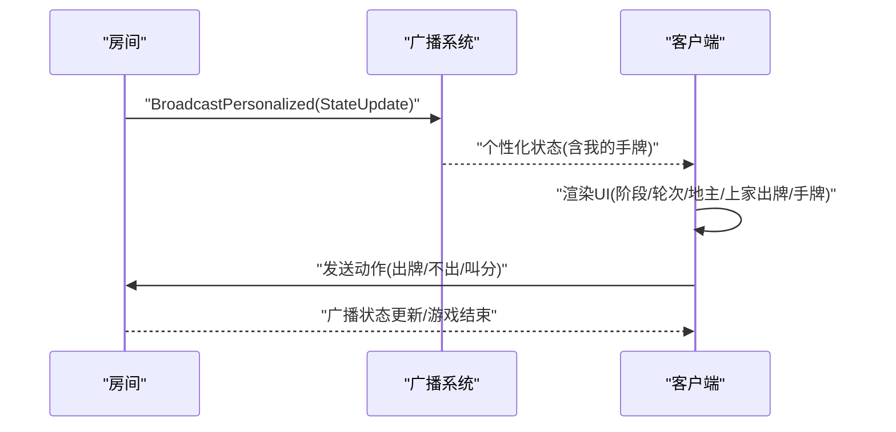
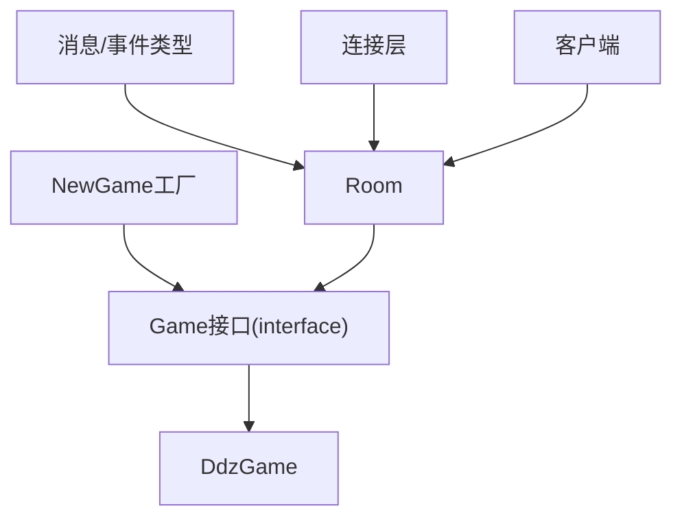

# 斗地主游戏 (DDZ)

<cite>
**本文档引用的文件**
- [internal/game/ddz/game.go](file://internal/game/ddz/game.go)
- [internal/game/interfaces/game.go](file://internal/game/interfaces/game.go)
- [internal/game/factory.go](file://internal/game/factory.go)
- [internal/room/room.go](file://internal/room/room.go)
- [internal/connection/connection.go](file://internal/connection/connection.go)
- [internal/types/message.go](file://internal/types/message.go)
- [internal/types/broadcast.go](file://internal/types/broadcast.go)
- [internal/types/game_action.go](file://internal/types/game_action.go)
- [main.go](file://main.go)
- [ddz-client.html](file://ddz-client.html)
</cite>

## 目录
1. [简介](#简介)
2. [项目结构](#项目结构)
3. [核心组件](#核心组件)
4. [架构总览](#架构总览)
5. [详细组件分析](#详细组件分析)
6. [依赖关系分析](#依赖关系分析)
7. [性能考量](#性能考量)
8. [故障排查指南](#故障排查指南)
9. [结论](#结论)
10. [附录](#附录)

## 简介
本项目是一个基于 WebSocket 的三缺一斗地主（DDZ）多人在线对战游戏。系统支持三名玩家、地主身份确定、底牌分配与出牌规则、牌型识别与合法性校验、连续出牌限制、地主与农民身份转换、分数计算与游戏结束判定、以及完整的游戏状态管理与客户端同步机制。本文档将从规则体系、算法实现、状态管理、序列化与同步、边界处理与性能优化等方面进行全面技术说明。

## 项目结构
项目采用分层设计：
- 顶层入口负责 WebSocket 服务监听
- 连接层负责 WebSocket 握手、心跳与连接状态管理
- 房间层负责房间生命周期、玩家管理、广播与游戏调度
- 游戏层负责具体游戏规则与状态机
- 类型层提供统一的消息、事件与动作定义



图表来源
- [main.go](file://main.go#L10-L14)
- [internal/connection/connection.go](file://internal/connection/connection.go#L32-L61)
- [internal/room/room.go](file://internal/room/room.go#L35-L56)
- [internal/game/factory.go](file://internal/game/factory.go#L11-L23)
- [internal/game/ddz/game.go](file://internal/game/ddz/game.go#L43-L45)
- [internal/types/message.go](file://internal/types/message.go#L32-L78)
- [internal/types/broadcast.go](file://internal/types/broadcast.go#L3-L48)
- [internal/types/game_action.go](file://internal/types/game_action.go#L3-L18)
- [ddz-client.html](file://ddz-client.html#L229-L296)

章节来源
- [main.go](file://main.go#L10-L14)
- [internal/connection/connection.go](file://internal/connection/connection.go#L32-L61)
- [internal/room/room.go](file://internal/room/room.go#L35-L56)
- [internal/game/factory.go](file://internal/game/factory.go#L11-L23)
- [internal/game/ddz/game.go](file://internal/game/ddz/game.go#L43-L45)
- [internal/types/message.go](file://internal/types/message.go#L32-L78)
- [internal/types/broadcast.go](file://internal/types/broadcast.go#L3-L48)
- [internal/types/game_action.go](file://internal/types/game_action.go#L3-L18)
- [ddz-client.html](file://ddz-client.html#L229-L296)

## 核心组件
- 游戏接口与动作封装
  - 游戏接口定义了统一的生命周期与能力：初始化、处理动作、当前轮次、推进轮次、状态查询、胜负判定、最大/最小玩家数等
  - 动作封装为统一的 Action 结构，包含动作类型与数据载荷
- DDZ 游戏实现
  - 游戏状态字段：玩家列表、座位映射、手牌、底牌、地主、叫分记录、当前回合、上一手牌、上家、连续 Pass 计数、阶段、结束标志、赢家
  - 发牌与排序：标准 54 张牌，洗牌后每人 17 张，底牌 3 张
  - 叫地主阶段：每位玩家依次进行 0~3 分的叫分；当有人叫 3 分或一轮循环结束时，最高分者成为地主并获得底牌
  - 出牌阶段：按座位顺序轮流出牌；Pass 连续达到一定次数后，最后出牌人重新获得出牌权；同类型牌型按大小比较，炸弹与王炸可压制其他牌型
  - 结束条件：任一玩家手牌清空即游戏结束；地主胜或农民共同胜
- 房间与广播
  - 房间负责玩家加入/离场、准备状态、座位分配、游戏开始、断线处理与广播
  - 广播支持全房间广播与个性化广播（按玩家维度）
- 连接与心跳
  - WebSocket 握手、心跳检测（60 秒无活动关闭）、防抖（100ms 内重复操作忽略）

章节来源
- [internal/game/interfaces/game.go](file://internal/game/interfaces/game.go#L3-L16)
- [internal/types/game_action.go](file://internal/types/game_action.go#L6-L11)
- [internal/game/ddz/game.go](file://internal/game/ddz/game.go#L20-L35)
- [internal/game/ddz/game.go](file://internal/game/ddz/game.go#L75-L116)
- [internal/game/ddz/game.go](file://internal/game/ddz/game.go#L125-L293)
- [internal/room/room.go](file://internal/room/room.go#L462-L523)
- [internal/connection/connection.go](file://internal/connection/connection.go#L32-L61)

## 架构总览
系统采用“连接层-房间层-游戏层”的分层架构，消息通过 WebSocket 传输，房间负责协调游戏流程与状态广播，游戏层实现具体规则。



图表来源
- [internal/room/room.go](file://internal/room/room.go#L462-L523)
- [internal/game/ddz/game.go](file://internal/game/ddz/game.go#L125-L293)
- [internal/game/ddz/game.go](file://internal/game/ddz/game.go#L299-L351)
- [internal/room/room.go](file://internal/room/room.go#L528-L538)

## 详细组件分析

### 游戏规则与状态机
- 玩家与座位
  - 三名玩家按座位号排序，座位号与玩家 ID 的映射用于轮次控制
- 发牌与底牌
  - 标准 54 张牌（含大小王），洗牌后每人 17 张，底牌 3 张
- 叫地主阶段
  - 每位玩家依次进行 0~3 分的叫分；当有人叫 3 分或一轮循环结束且最高分大于 0 时，最高分者成为地主，并将底牌加入其手牌，进入出牌阶段
- 出牌阶段
  - 按座位顺序轮流出牌；Pass 连续达到一定次数后，最后出牌人重新获得出牌权；同类型牌型按大小比较，炸弹与王炸可压制其他牌型
- 结束条件
  - 任一玩家手牌清空即游戏结束；地主胜或农民共同胜



图表来源
- [internal/room/room.go](file://internal/room/room.go#L540-L566)
- [internal/game/ddz/game.go](file://internal/game/ddz/game.go#L125-L293)
- [internal/game/ddz/game.go](file://internal/game/ddz/game.go#L299-L351)

章节来源
- [internal/game/ddz/game.go](file://internal/game/ddz/game.go#L52-L116)
- [internal/game/ddz/game.go](file://internal/game/ddz/game.go#L125-L293)
- [internal/game/ddz/game.go](file://internal/game/ddz/game.go#L299-L351)

### 牌型识别与合法性校验
- 牌型识别
  - 单张、对子、三张、炸弹、顺子、连对、飞机、三带一、三带对、四带二、飞机带翅膀等
  - 王炸（大小王组合）为最强牌型，可压制其他牌型
- 合法性校验
  - 出牌必须为合法牌型
  - 若非首轮，则必须能压制上家牌型
  - 顺子、连对、飞机等要求牌值连续且不含 2
- 大小比较
  - 王炸 > 炸弹 > 其他牌型
  - 同类型牌型按主牌值比较（如三张、四张、飞机主体的最小牌值或三张牌值）



图表来源
- [internal/game/ddz/game.go](file://internal/game/ddz/game.go#L381-L463)
- [internal/game/ddz/game.go](file://internal/game/ddz/game.go#L506-L682)

章节来源
- [internal/game/ddz/game.go](file://internal/game/ddz/game.go#L381-L463)
- [internal/game/ddz/game.go](file://internal/game/ddz/game.go#L506-L682)

### 出牌验证与大小比较
- 出牌验证
  - 必须为当前回合玩家
  - 出牌数据格式校验
  - 牌型合法性检查
  - 若非首轮，必须能压制上家牌型
- 大小比较
  - 王炸 > 炸弹 > 其他牌型
  - 同类型牌型按主牌值比较
  - 顺子、连对、飞机等长度必须一致，比较最小牌值



图表来源
- [internal/game/ddz/game.go](file://internal/game/ddz/game.go#L125-L293)
- [internal/game/ddz/game.go](file://internal/game/ddz/game.go#L381-L463)
- [internal/game/ddz/game.go](file://internal/game/ddz/game.go#L684-L724)

章节来源
- [internal/game/ddz/game.go](file://internal/game/ddz/game.go#L125-L293)
- [internal/game/ddz/game.go](file://internal/game/ddz/game.go#L684-L724)

### 地主与农民身份转换、分数计算与结束条件
- 地主确定
  - 叫分阶段结束后，最高分者成为地主；若无人叫分则流局
- 底牌处理
  - 地主获得底牌并加入其手牌，随后进入出牌阶段
- 身份转换
  - 游戏过程中地主与农民身份固定，不因胜负而改变
- 结束条件
  - 任一玩家手牌清空即游戏结束；地主胜或农民共同胜
- 分数计算
  - 本实现未提供分数系统，仅记录胜负字符串

章节来源
- [internal/game/ddz/game.go](file://internal/game/ddz/game.go#L152-L173)
- [internal/game/ddz/game.go](file://internal/game/ddz/game.go#L257-L278)

### 游戏状态管理与序列化
- 状态结构
  - 包含阶段、玩家列表、座位映射、地主、当前轮次、上一手牌、游戏结束标志、赢家、手牌数量、底牌值等
- 个性化状态
  - 对每个玩家单独返回其手牌（不暴露他人手牌）
- 序列化与反序列化
  - 通过 Go 的 map/切片结构体序列化为 JSON，前端以统一消息结构接收

```mermaid
classDiagram
class DdzGame {
+players []string
+hands map[string]Hand
+bottomCards Hand
+landlord string
+calls map[string]int
+callTurn int
+outTurn int
+lastPlay Play
+lastPlayer string
+passCount int
+phase string
+gameOver bool
+winner string
+GetState() interface{}
+GetStateForPlayer(playerID) interface{}
+ProcessAction(playerID, action) (bool, error)
}
class Play {
+Type string
+Cards Hand
+Value int
}
class Hand {
+Len() int
+Swap(i, j) void
+Less(i, j) bool
}
DdzGame --> Play : "记录上一手牌"
DdzGame --> Hand : "管理手牌"
```

图表来源
- [internal/game/ddz/game.go](file://internal/game/ddz/game.go#L20-L41)
- [internal/game/ddz/game.go](file://internal/game/ddz/game.go#L299-L351)

章节来源
- [internal/game/ddz/game.go](file://internal/game/ddz/game.go#L299-L351)

### 客户端同步机制
- 广播事件
  - 房间状态变更、游戏开始、状态更新、游戏结束、聊天等
- 个性化广播
  - 每个玩家收到包含其手牌的状态快照
- 前端交互
  - 根据阶段显示操作按钮（叫分/出牌/不出）
  - 展示当前轮次、地主、上家出牌、手牌选择与动画效果



图表来源
- [internal/room/room.go](file://internal/room/room.go#L528-L538)
- [ddz-client.html](file://ddz-client.html#L278-L296)
- [ddz-client.html](file://ddz-client.html#L481-L550)

章节来源
- [internal/room/room.go](file://internal/room/room.go#L528-L538)
- [ddz-client.html](file://ddz-client.html#L278-L296)
- [ddz-client.html](file://ddz-client.html#L481-L550)

## 依赖关系分析
- 接口耦合
  - 房间层依赖游戏接口抽象，便于扩展其他游戏类型
  - 游戏工厂根据类型创建具体游戏实例
- 广播与消息
  - 房间层统一管理广播通道，支持全房间与个性化广播
  - 类型层定义消息与事件枚举，保证前后端一致性
- 连接层
  - WebSocket 连接层提供心跳与连接状态管理，保障长连接稳定性



图表来源
- [internal/game/interfaces/game.go](file://internal/game/interfaces/game.go#L3-L16)
- [internal/game/factory.go](file://internal/game/factory.go#L11-L23)
- [internal/room/room.go](file://internal/room/room.go#L35-L56)
- [internal/types/message.go](file://internal/types/message.go#L32-L78)
- [internal/connection/connection.go](file://internal/connection/connection.go#L32-L61)
- [ddz-client.html](file://ddz-client.html#L229-L296)

章节来源
- [internal/game/interfaces/game.go](file://internal/game/interfaces/game.go#L3-L16)
- [internal/game/factory.go](file://internal/game/factory.go#L11-L23)
- [internal/room/room.go](file://internal/room/room.go#L35-L56)
- [internal/types/message.go](file://internal/types/message.go#L32-L78)
- [internal/connection/connection.go](file://internal/connection/connection.go#L32-L61)
- [ddz-client.html](file://ddz-client.html#L229-L296)

## 性能考量
- 广播通道缓冲
  - 房间广播通道使用带缓冲的 channel，避免阻塞导致消息丢失
- 防抖与背压
  - 房间层对同一玩家短时间内的重复操作进行防抖（100ms）
  - 广播发送采用非阻塞方式，避免单个客户端阻塞影响整体
- 数据结构优化
  - 手牌排序使用自定义比较器，确保牌型识别与大小比较的正确性
  - 牌值映射用于快速统计与判断，减少重复遍历
- 心跳与断线处理
  - 心跳检测与断线超时机制，保障长时间无操作时的连接健康

章节来源
- [internal/room/room.go](file://internal/room/room.go#L44-L46)
- [internal/room/room.go](file://internal/room/room.go#L476-L482)
- [internal/room/room.go](file://internal/room/room.go#L595-L605)
- [internal/connection/connection.go](file://internal/connection/connection.go#L32-L61)
- [internal/game/ddz/game.go](file://internal/game/ddz/game.go#L791-L796)

## 故障排查指南
- 常见错误
  - 不是你的回合：当前玩家与轮次不符
  - 无效的 action 类型：动作类型不在允许范围内
  - 叫分范围错误：0~3 分之外的数值
  - 新回合第一手牌必须出：Pass 仅在非首轮有效
  - 无法压制上家：牌型不合法或大小不符合
  - 无人叫地主：流局处理
- 定位建议
  - 查看房间层的 ProcessGameAction 日志与错误返回
  - 检查游戏层的 ProcessAction 分支与状态更新
  - 确认前端发送的动作数据格式与枚举值
- 恢复策略
  - 断线自动暂停与超时处理，超时后结束游戏并清理房间
  - 心跳异常时主动关闭连接并提示重连

章节来源
- [internal/room/room.go](file://internal/room/room.go#L462-L523)
- [internal/game/ddz/game.go](file://internal/game/ddz/game.go#L125-L293)
- [internal/connection/connection.go](file://internal/connection/connection.go#L32-L61)

## 结论
本项目实现了三缺一斗地主的核心规则与状态机，具备完善的牌型识别、合法性校验与大小比较机制，支持断线处理与心跳保活，通过房间层的广播系统实现客户端的实时同步。系统采用接口抽象与工厂模式，便于扩展其他游戏类型；同时在性能方面采取了缓冲、防抖与非阻塞广播等优化措施。后续可在分数系统、AI 玩家与更丰富的 UI 交互方面进一步增强。

## 附录
- 动作类型
  - 叫地主：call_landlord
  - 出牌：play_cards
  - 不出：pass
- 广播事件
  - 房间状态变更：room_state_changed
  - 游戏开始：game_started
  - 状态更新：state_update
  - 游戏结束：game_over
  - 聊天：chat

章节来源
- [internal/types/game_action.go](file://internal/types/game_action.go#L6-L11)
- [internal/types/broadcast.go](file://internal/types/broadcast.go#L6-L15)