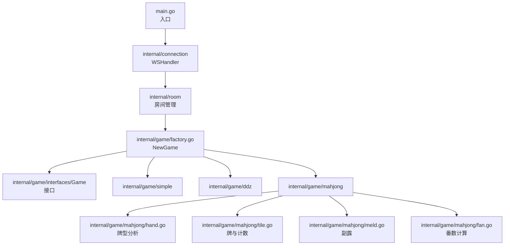
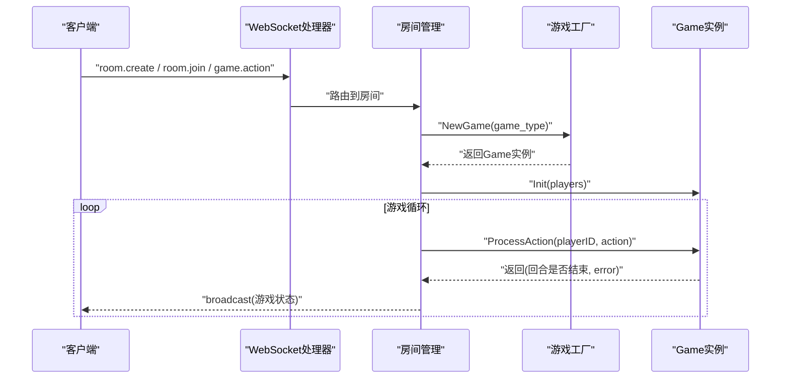
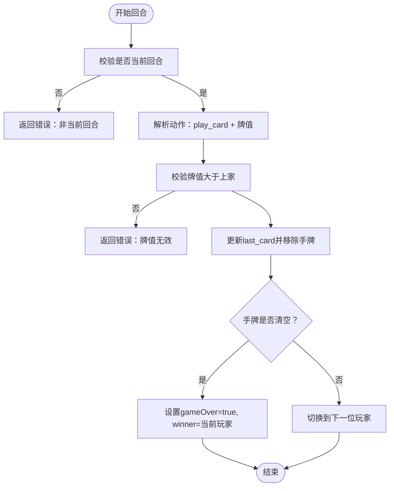
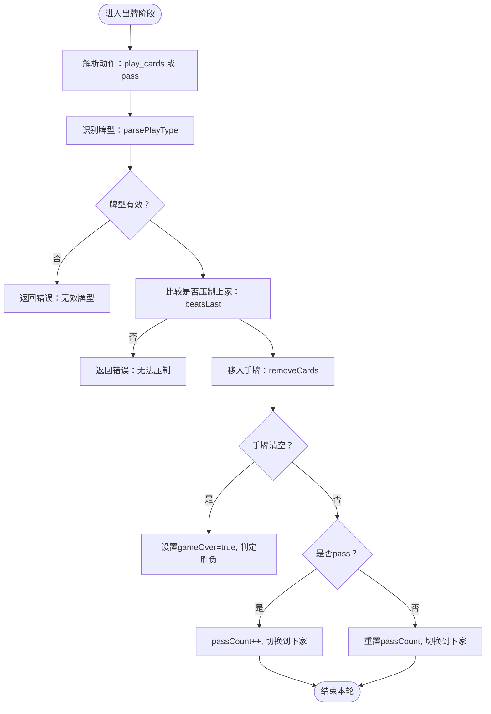
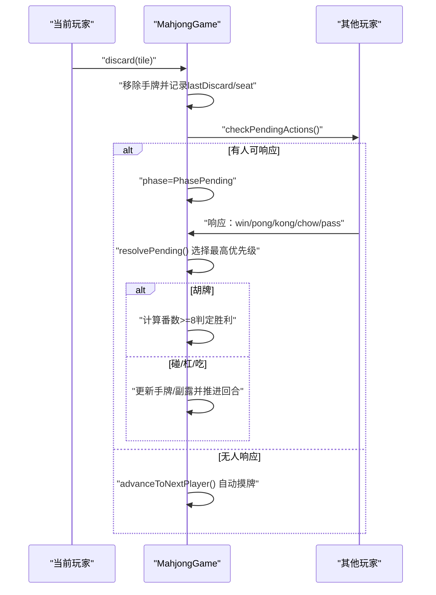
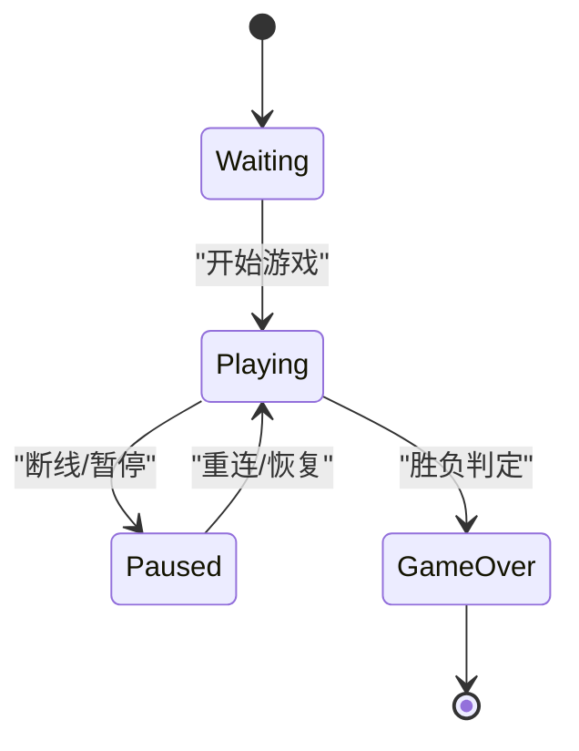

# 游戏实现

<cite>
**本文档引用的文件**
- [internal/game/simple/game.go](file://internal/game/simple/game.go)
- [internal/game/ddz/game.go](file://internal/game/ddz/game.go)
- [internal/game/mahjong/game.go](file://internal/game/mahjong/game.go)
- [internal/game/mahjong/hand.go](file://internal/game/mahjong/hand.go)
- [internal/game/mahjong/tile.go](file://internal/game/mahjong/tile.go)
- [internal/game/mahjong/meld.go](file://internal/game/mahjong/meld.go)
- [internal/game/mahjong/fan.go](file://internal/game/mahjong/fan.go)
- [internal/game/interfaces/game.go](file://internal/game/interfaces/game.go)
- [internal/game/factory.go](file://internal/game/factory.go)
- [internal/types/game_action.go](file://internal/types/game_action.go)
- [internal/types/message.go](file://internal/types/message.go)
- [main.go](file://main.go)
- [README.md](file://README.md)
</cite>

## 目录
1. [简介](#简介)
2. [项目结构](#项目结构)
3. [核心组件](#核心组件)
4. [架构总览](#架构总览)
5. [详细组件分析](#详细组件分析)
6. [依赖关系分析](#依赖关系分析)
7. [性能考量](#性能考量)
8. [故障排查指南](#故障排查指南)
9. [结论](#结论)
10. [附录](#附录)

## 简介
本项目是一个基于 Go 与 WebSocket 的多人在线卡牌游戏服务器，支持多种卡牌游戏模式，包括简易卡牌游戏（simple）、斗地主（ddz）与麻将（mahjong）。系统通过统一的 Game 接口抽象，结合工厂模式实现游戏类型扩展；通过房间管理与消息广播机制，实现玩家交互、状态同步与断线重连等能力。本文档面向开发者与测试人员，系统梳理各游戏的规则设计、算法实现与状态管理，并提供可扩展性与自定义规则建议。

## 项目结构
项目采用模块化分层设计：
- internal/connection：WebSocket 连接与消息处理
- internal/game：游戏逻辑实现与接口
  - interfaces：Game 接口与 Action 结构
  - simple：简易卡牌游戏
  - ddz：斗地主
  - mahjong：麻将
  - factory：游戏工厂
- internal/room：房间管理
- internal/types：消息与动作类型定义
- docs：产品文档（麻将 PRD）
- main.go：HTTP 与 WebSocket 入口



图表来源
- [main.go](file://main.go#L10-L14)
- [internal/game/factory.go](file://internal/game/factory.go#L11-L23)
- [internal/game/interfaces/game.go](file://internal/game/interfaces/game.go#L4-L16)
- [internal/game/simple/game.go](file://internal/game/simple/game.go#L1-L102)
- [internal/game/ddz/game.go](file://internal/game/ddz/game.go#L1-L80)
- [internal/game/mahjong/game.go](file://internal/game/mahjong/game.go#L51-L77)

章节来源
- [README.md](file://README.md#L20-L50)
- [main.go](file://main.go#L10-L14)

## 核心组件
- Game 接口：统一的游戏行为规范，包括初始化、动作处理、回合推进、状态查询与胜负判定。
- Action 结构：统一包装客户端动作类型与数据。
- 游戏工厂：根据游戏类型返回对应 Game 实例。
- 类型系统：消息类型、动作类型、房间状态等统一定义，便于跨游戏复用。

章节来源
- [internal/game/interfaces/game.go](file://internal/game/interfaces/game.go#L4-L22)
- [internal/game/factory.go](file://internal/game/factory.go#L11-L23)
- [internal/types/game_action.go](file://internal/types/game_action.go#L6-L18)
- [internal/types/message.go](file://internal/types/message.go#L13-L30)

## 架构总览
系统通过 WebSocket 提供实时通信，房间管理负责玩家生命周期与状态，游戏工厂按需创建具体游戏实例，Game 接口驱动游戏状态流转与广播。



图表来源
- [internal/game/factory.go](file://internal/game/factory.go#L11-L23)
- [internal/game/interfaces/game.go](file://internal/game/interfaces/game.go#L6-L15)
- [internal/types/message.go](file://internal/types/message.go#L16-L30)

## 详细组件分析

### 简易卡牌游戏（simple）
- 规则要点
  - 2 人对战，轮流出牌，上家出牌后，下家必须出更大的牌。
  - 出完手牌即获胜，游戏结束。
- 数据结构
  - SimpleGame：保存玩家列表、当前回合索引、上家最大牌、手牌映射、胜负状态。
- 关键流程
  - 初始化：为每位玩家发 3 张牌。
  - 出牌校验：仅允许“play_card”类型动作，且牌面值必须大于上家。
  - 胜负判定：手牌清空即获胜。
- 状态管理
  - GetState：返回全局状态（含所有玩家手牌数量与当前回合）。
  - GetStateForPlayer：返回完整状态（可按需隐藏对手手牌）。



图表来源
- [internal/game/simple/game.go](file://internal/game/simple/game.go#L37-L65)

章节来源
- [internal/game/simple/game.go](file://internal/game/simple/game.go#L8-L102)

### 斗地主（ddz）
- 规则要点
  - 3 人游戏，发 54 张牌（含大小王），每人 17 张，底牌 3 张。
  - 叫地主阶段：按座位顺序轮流叫分（0~3），满分为 3 或一轮结束后最高分者成为地主。
  - 出牌阶段：按座位顺序出牌，支持 pass、单牌、对子、三张、炸弹、顺子、连对、飞机、三带一/对、四带二、飞机带翅膀等。
  - 王炸与炸弹可压制除王炸外的所有牌型；同类型牌型按长度与主牌值比较。
- 数据结构
  - Card/Hand：卡牌与手牌集合，实现排序比较。
  - Play：记录牌型、牌组与主牌值。
  - DdzGame：保存玩家座位映射、手牌、底牌、地主、叫分记录、当前阶段、最后出牌、pass 计数等。
- 关键算法
  - 牌型识别：parsePlayType + 多个辅助函数（isStraight、isPairSequence、isTripleSequence、isTripleWithSingle、isTripleWithPair、isQuadWithPair、isTripleSequenceWithWings）。
  - 压制判断：beatsLast，区分王炸、炸弹与其他牌型的比较逻辑。
  - 移除手牌：removeCards，按牌值计数移除。
  - 发牌与排序：dealCards + sort.Sort。
- 状态管理
  - GetState：返回阶段、玩家信息（座位、是否地主、手牌数量）、当前回合、底牌值等。
  - GetStateForPlayer：在基础状态基础上补充该玩家手牌。



图表来源
- [internal/game/ddz/game.go](file://internal/game/ddz/game.go#L175-L290)
- [internal/game/ddz/game.go](file://internal/game/ddz/game.go#L381-L463)
- [internal/game/ddz/game.go](file://internal/game/ddz/game.go#L684-L724)

章节来源
- [internal/game/ddz/game.go](file://internal/game/ddz/game.go#L20-L116)
- [internal/game/ddz/game.go](file://internal/game/ddz/game.go#L125-L293)
- [internal/game/ddz/game.go](file://internal/game/ddz/game.go#L381-L796)

### 麻将（mahjong）
- 规则要点
  - 4 人游戏，庄家 14 张，闲家各 13 张；按座位逆时针出牌。
  - 出牌阶段：当前玩家出一张牌，若他人可胡/碰/杠/吃，则进入等待响应阶段，按优先级与距离选择最优动作。
  - 胡牌条件：标准牌型（4面子+1雀头）、七对子、十三幺；自摸需≥8番。
  - 番数系统：包含多种番种（如清一色、混一色、碰碰胡、字一色、大/小四喜、大/小三元、三暗刻、四暗刻、箭刻、门风刻、圈风刻、幺九刻、自摸、明/暗杠、门前清、无番和等），总番数封顶 88。
- 数据结构
  - Tile/Tiles：牌与牌组，提供解析、计数、排序、移除等操作。
  - Meld/Melds：副露（吃/碰/明杠/暗杠/补杠），含来源玩家与是否暗副露。
  - MahjongGame：保存玩家座位、手牌、副露、牌河、牌墙、当前回合、阶段、等待响应、胜负结果等。
- 关键算法
  - 牌型分析：IsStandardWin、IsSevenPairs、IsThirteenOrphans；CanChow/CanPong/CanKongConcealed/CanKongExtended。
  - 番数计算：CalculateFan + 多个番种判断函数，收集所有面子信息后累加。
  - 吃/碰/杠/胡判定与响应处理：checkPendingActions、resolvePending、各 resolve* 方法。
- 状态管理
  - GetState：返回阶段、当前座位、庄家座位、牌墙剩余、玩家信息（手牌数量、副露、牌河、是否庄家）。
  - GetStateForPlayer：在基础状态基础上补充我的手牌、可执行操作、吃杠选项等。



图表来源
- [internal/game/mahjong/game.go](file://internal/game/mahjong/game.go#L164-L214)
- [internal/game/mahjong/game.go](file://internal/game/mahjong/game.go#L293-L388)
- [internal/game/mahjong/game.go](file://internal/game/mahjong/game.go#L523-L586)

章节来源
- [internal/game/mahjong/game.go](file://internal/game/mahjong/game.go#L51-L132)
- [internal/game/mahjong/hand.go](file://internal/game/mahjong/hand.go#L3-L25)
- [internal/game/mahjong/hand.go](file://internal/game/mahjong/hand.go#L107-L147)
- [internal/game/mahjong/tile.go](file://internal/game/mahjong/tile.go#L35-L90)
- [internal/game/mahjong/meld.go](file://internal/game/mahjong/meld.go#L16-L55)
- [internal/game/mahjong/fan.go](file://internal/game/mahjong/fan.go#L21-L121)

## 依赖关系分析
- 接口与实现
  - Game 接口统一了所有游戏的行为契约，simple/ddz/mahjong 分别实现该接口。
  - 工厂 NewGame 根据字符串类型返回对应 Game 实例，便于扩展新游戏。
- 类型与消息
  - types 包定义了消息类型、动作类型、房间状态等，贯穿连接层与房间层。
- 麻将模块内聚
  - tile.go 提供牌与计数工具；hand.go 提供牌型分析；meld.go 提供副露结构；fan.go 提供番数计算。

```mermaid
classDiagram
class Game {
+ID() string
+Init(players []string) error
+ProcessAction(playerID string, action interface{}) (bool, error)
+CurrentTurn() string
+AdvanceTurn()
+GetState() interface{}
+GetStateForPlayer(playerID string) interface{}
+IsGameOver() bool
+Winner() string
+MaxPlayers() int
+MinPlayers() int
}
class SimpleGame
class DdzGame
class MahjongGame
Game <|.. SimpleGame
Game <|.. DdzGame
Game <|.. MahjongGame
```

图表来源
- [internal/game/interfaces/game.go](file://internal/game/interfaces/game.go#L4-L16)
- [internal/game/simple/game.go](file://internal/game/simple/game.go#L8-L15)
- [internal/game/ddz/game.go](file://internal/game/ddz/game.go#L20-L35)
- [internal/game/mahjong/game.go](file://internal/game/mahjong/game.go#L52-L77)

章节来源
- [internal/game/interfaces/game.go](file://internal/game/interfaces/game.go#L4-L16)
- [internal/game/factory.go](file://internal/game/factory.go#L11-L23)

## 性能考量
- 斗地主
  - 牌型识别使用计数映射与排序，时间复杂度与牌数线性相关；顺子/连对/飞机等判断通过一次遍历与排序实现，整体高效。
  - 手牌移除采用计数匹配，避免多次扫描。
- 麻将
  - 牌计数数组（34 元素）用于快速统计与分解，IsStandardWin 使用递归分解，最坏情况下指数复杂度，但实际手牌规模有限（14 张），可接受。
  - 番数计算按需收集面子信息，避免重复计算。
- 通用
  - 状态查询尽量返回手牌数量而非具体牌面，减少广播体积。
  - 洗牌与发牌使用内置随机与洗牌，保证公平性。

[本节为通用指导，无需特定文件来源]

## 故障排查指南
- 简易卡牌
  - “非当前回合”：确认 CurrentTurn 与 playerID 一致。
  - “无效出牌”：检查动作类型与牌值是否大于上家。
- 斗地主
  - “无效牌型”：核对 parsePlayType 的输入与计数映射。
  - “无法压制”：确认 beatsLast 的类型与长度比较逻辑。
  - “无人叫地主”：检查 call 阶段结束条件与最高分判定。
- 麻将
  - “非当前回合”：确认 currentSeat 与 playerID 对应。
  - “吃/碰/杠/胡不合法”：核对 Can* 与 resolve* 的前置条件。
  - “番数不足”：确认自摸条件与番种叠加是否达到 8。

章节来源
- [internal/game/simple/game.go](file://internal/game/simple/game.go#L37-L65)
- [internal/game/ddz/game.go](file://internal/game/ddz/game.go#L125-L293)
- [internal/game/mahjong/game.go](file://internal/game/mahjong/game.go#L142-L161)

## 结论
本项目通过统一接口与工厂模式实现了多游戏的可扩展架构，配合房间管理与消息广播，提供了稳定的多人卡牌游戏体验。简易游戏验证了基础设施，斗地主展示了复杂牌型识别与压制逻辑，麻将体现了深度的牌型分析与番数系统。未来可在以下方面持续演进：
- 增强断线重连与消息有序保障
- 扩展更多游戏规则与自定义配置
- 优化麻将牌型分解与番数计算的性能边界
- 提供更丰富的测试用例与边界条件覆盖

[本节为总结，无需特定文件来源]

## 附录

### 核心数据结构与职责
- Game 接口：统一行为契约，便于扩展新游戏。
- Action：统一动作封装，便于跨游戏复用。
- SimpleGame：2 人对战，简单出牌与胜负判定。
- DdzGame：3 人斗地主，包含叫分、出牌、炸弹与牌型识别。
- MahjongGame：4 人麻将，包含副露、等待响应、番数计算与胡牌判定。

章节来源
- [internal/game/interfaces/game.go](file://internal/game/interfaces/game.go#L4-L22)
- [internal/game/simple/game.go](file://internal/game/simple/game.go#L8-L15)
- [internal/game/ddz/game.go](file://internal/game/ddz/game.go#L20-L35)
- [internal/game/mahjong/game.go](file://internal/game/mahjong/game.go#L52-L77)

### 游戏状态转换图（概念示意）


[本图为概念示意，无需图表来源]

### 测试用例与边界条件
- 斗地主
  - 牌型识别：单/对/三张/炸弹/顺子/连对/飞机/三带一/对/四带二/飞机带翅膀。
  - 压制比较：长度相同时按主牌值比较，不同类型按长度与主牌值比较。
  - 叫分：满分为 3 或一轮结束后的最高分者成为地主。
- 麻将
  - 牌型：标准牌型、七对子、十三幺。
  - 吃/碰/杠/胡：Can* 与 resolve* 的组合验证。
  - 番数：自摸≥8番，清一色/混一色等番种叠加与封顶。
- 简易卡牌
  - 出牌顺序与牌值递增约束。
  - 手牌清空即获胜。

章节来源
- [internal/game/mahjong/game_test.go](file://internal/game/mahjong/game_test.go#L275-L438)
- [internal/game/mahjong/hand.go](file://internal/game/mahjong/hand.go#L107-L147)
- [internal/game/mahjong/fan.go](file://internal/game/mahjong/fan.go#L21-L121)
- [internal/game/simple/game.go](file://internal/game/simple/game.go#L37-L65)

### 可扩展性与自定义规则
- 新增游戏步骤
  1) 在 internal/game/ 下创建新目录与实现 interfaces.Game。
  2) 在 internal/game/factory.go 中注册新游戏类型。
  3) 在 internal/types/game_action.go 中添加动作类型常量。
- 规则定制
  - 通过修改 Game 实现与状态结构，可灵活调整规则参数（如人数、牌数、番种权重等）。
  - 保持 Action 与消息类型的统一，便于前端适配。

章节来源
- [README.md](file://README.md#L152-L164)
- [internal/game/factory.go](file://internal/game/factory.go#L11-L23)
- [internal/types/game_action.go](file://internal/types/game_action.go#L6-L18)