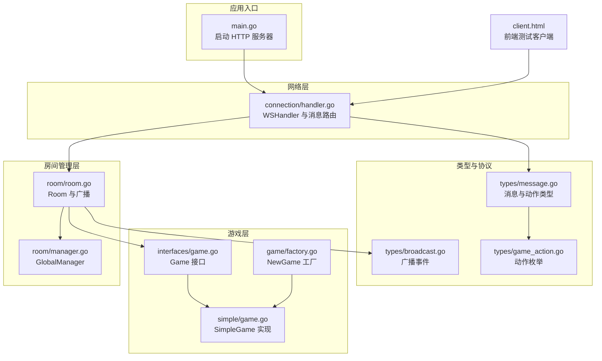
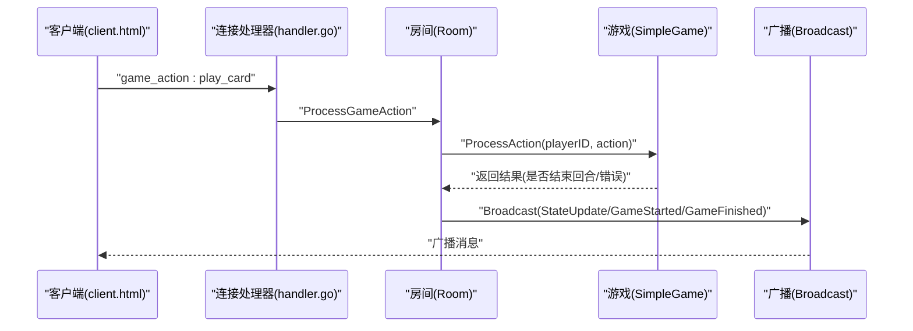
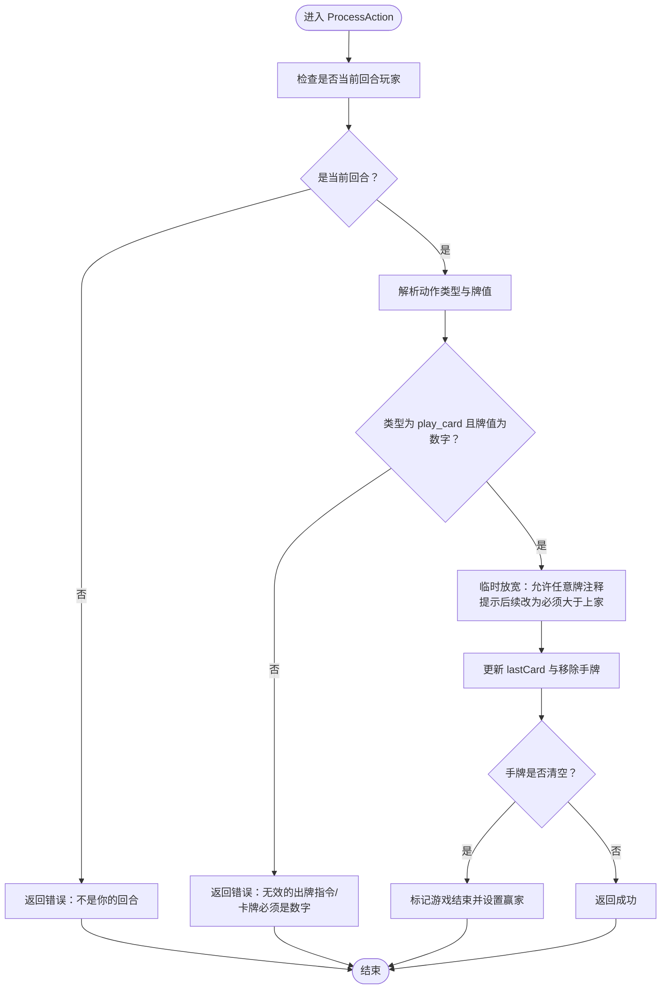
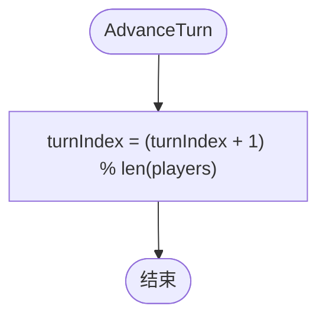
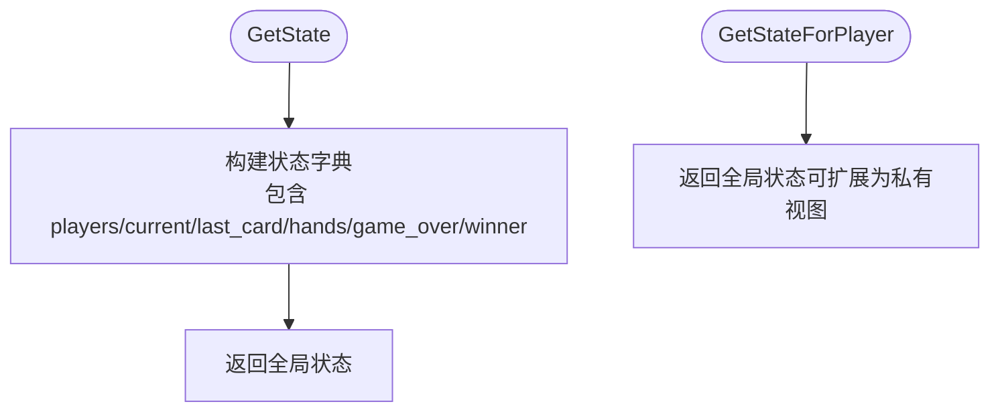
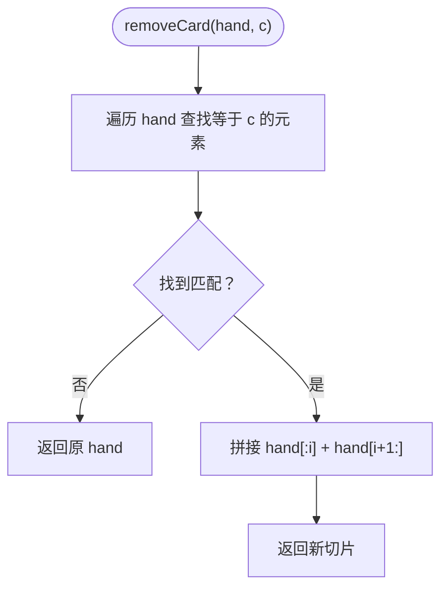
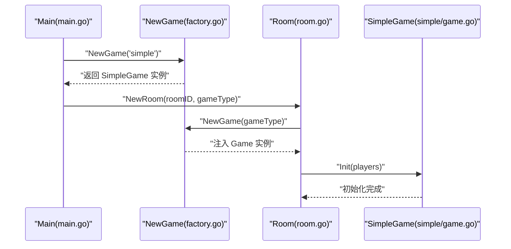
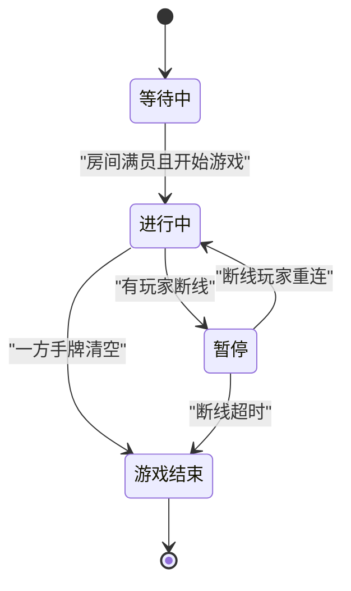
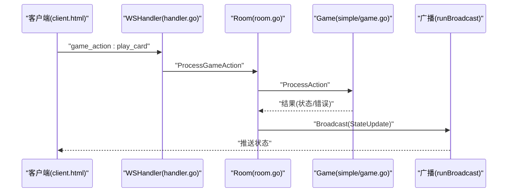
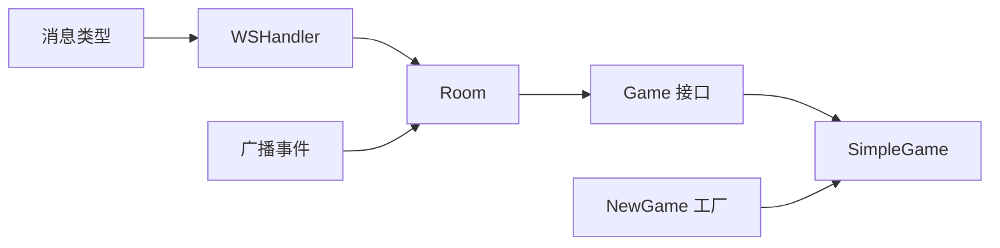

# 简单纸牌游戏 (Simple)

<cite>
**本文引用的文件列表**
- [internal/game/simple/game.go](file://internal/game/simple/game.go)
- [internal/game/interfaces/game.go](file://internal/game/interfaces/game.go)
- [internal/game/factory.go](file://internal/game/factory.go)
- [internal/types/game_action.go](file://internal/types/game_action.go)
- [internal/types/message.go](file://internal/types/message.go)
- [internal/types/broadcast.go](file://internal/types/broadcast.go)
- [internal/connection/handler.go](file://internal/connection/handler.go)
- [internal/room/room.go](file://internal/room/room.go)
- [internal/room/manager.go](file://internal/room/manager.go)
- [main.go](file://main.go)
- [README.md](file://README.md)
- [client.html](file://client.html)
</cite>

## 目录
1. [简介](#简介)
2. [项目结构](#项目结构)
3. [核心组件](#核心组件)
4. [架构总览](#架构总览)
5. [详细组件分析](#详细组件分析)
6. [依赖关系分析](#依赖关系分析)
7. [性能考量](#性能考量)
8. [故障排查指南](#故障排查指南)
9. [结论](#结论)
10. [附录](#附录)

## 简介
本技术文档面向“简单纸牌游戏（Simple）”，围绕其规则设计、状态管理、核心算法与序列化策略进行深入说明。Simple 游戏采用双人对战、按序出牌的机制，支持 WebSocket 实时通信与房间管理，适合快速联调与演示。本文将帮助开发者理解：
- 游戏规则与状态模型
- 核心算法：出牌验证、轮次管理、回合切换
- 状态序列化：全局状态与玩家视角状态
- 手牌移除算法
- 初始化流程、胜负判定与状态转换
- 扩展规则与性能优化建议

## 项目结构
该项目采用模块化设计，核心模块如下：
- 内部模块
  - connection：WebSocket 连接与消息处理
  - room：房间管理与广播
  - game：游戏逻辑与工厂
  - types：消息与动作类型定义
- 外部入口
  - main.go：HTTP 服务器与 WebSocket 端点
  - README.md：功能特性、协议与使用说明
  - client.html：简易游戏前端测试客户端



图表来源
- [main.go](file://main.go#L10-L14)
- [internal/connection/handler.go](file://internal/connection/handler.go#L19-L158)
- [internal/room/room.go](file://internal/room/room.go#L35-L57)
- [internal/room/manager.go](file://internal/room/manager.go#L54-L83)
- [internal/game/interfaces/game.go](file://internal/game/interfaces/game.go#L4-L16)
- [internal/game/simple/game.go](file://internal/game/simple/game.go#L17-L19)
- [internal/game/factory.go](file://internal/game/factory.go#L12-L23)
- [internal/types/message.go](file://internal/types/message.go#L32-L56)
- [internal/types/broadcast.go](file://internal/types/broadcast.go#L17-L26)
- [internal/types/game_action.go](file://internal/types/game_action.go#L6-L18)
- [client.html](file://client.html#L252-L260)

章节来源
- [README.md](file://README.md#L20-L50)
- [main.go](file://main.go#L10-L14)

## 核心组件
- SimpleGame：实现 Game 接口，负责双人对战、出牌验证、轮次推进与状态序列化
- Game 接口：统一的多游戏抽象，定义初始化、动作处理、轮次管理、状态查询与胜负判定
- NewGame 工厂：根据游戏类型返回对应 Game 实例
- 消息与动作类型：统一消息结构、动作枚举与房间/游戏事件

章节来源
- [internal/game/simple/game.go](file://internal/game/simple/game.go#L8-L15)
- [internal/game/interfaces/game.go](file://internal/game/interfaces/game.go#L4-L16)
- [internal/game/factory.go](file://internal/game/factory.go#L12-L23)
- [internal/types/game_action.go](file://internal/types/game_action.go#L6-L18)
- [internal/types/message.go](file://internal/types/message.go#L32-L56)

## 架构总览
WebSocket 客户端通过 /ws 端点连接，消息经由连接处理器分发至房间管理器，房间持有 Game 实例并驱动游戏状态。广播通道保证消息有序与一致性，最终将状态推送给所有客户端。



图表来源
- [internal/connection/handler.go](file://internal/connection/handler.go#L335-L381)
- [internal/room/room.go](file://internal/room/room.go#L98-L131)
- [internal/game/simple/game.go](file://internal/game/simple/game.go#L37-L65)
- [internal/types/broadcast.go](file://internal/types/broadcast.go#L11-L13)

## 详细组件分析

### SimpleGame 设计与状态模型
- 数据结构
  - players：玩家ID数组，长度固定为2
  - turnIndex：当前回合索引（0或1）
  - lastCard：上一张牌值（初始为0）
  - hands：玩家ID到手牌切片的映射
  - gameOver：游戏结束标志
  - winner：获胜者ID
- 规则要点
  - 双人对战，按序出牌
  - 出牌验证逻辑：当前回合玩家、动作类型为 play_card、牌值为数字
  - 临时放宽：允许出任意牌（注释提示后续改为必须大于上家）

```mermaid
classDiagram
class SimpleGame {
+players []string
+turnIndex int
+lastCard int
+hands map[string][]int
+gameOver bool
+winner string
+ID() string
+Init(players []string) error
+ProcessAction(playerID, action) (bool, error)
+CurrentTurn() string
+AdvanceTurn() void
+GetState() interface{}
+GetStateForPlayer(playerID string) interface{}
+IsGameOver() bool
+Winner() string
+MaxPlayers() int
+MinPlayers() int
}
```

图表来源
- [internal/game/simple/game.go](file://internal/game/simple/game.go#L8-L15)

章节来源
- [internal/game/simple/game.go](file://internal/game/simple/game.go#L8-L15)
- [internal/game/simple/game.go](file://internal/game/simple/game.go#L26-L35)
- [internal/game/simple/game.go](file://internal/game/simple/game.go#L37-L65)
- [internal/game/simple/game.go](file://internal/game/simple/game.go#L67-L73)
- [internal/game/simple/game.go](file://internal/game/simple/game.go#L75-L89)
- [internal/game/simple/game.go](file://internal/game/simple/game.go#L94-L101)

### 出牌验证与动作处理（ProcessAction）
- 验证当前回合：非当前回合玩家禁止出牌
- 动作类型校验：必须为 play_card
- 牌值类型校验：必须为数字
- 临时放宽逻辑：当前允许任意出牌（注释提示后续改为必须大于上家）
- 更新状态：更新 lastCard 与玩家手牌；若手牌清空则标记游戏结束并设置赢家



图表来源
- [internal/game/simple/game.go](file://internal/game/simple/game.go#L37-L65)

章节来源
- [internal/game/simple/game.go](file://internal/game/simple/game.go#L37-L65)

### 轮次管理（CurrentTurn 与 AdvanceTurn）
- CurrentTurn：根据 turnIndex 返回当前玩家ID
- AdvanceTurn：turnIndex 循环递增，模玩家数量，实现回合轮转



图表来源
- [internal/game/simple/game.go](file://internal/game/simple/game.go#L67-L73)

章节来源
- [internal/game/simple/game.go](file://internal/game/simple/game.go#L67-L73)

### 状态序列化（GetState 与 GetStateForPlayer）
- GetState：返回全局状态，包含 players、当前玩家、last_card、hands、game_over、winner
- GetStateForPlayer：当前直接返回全局状态（可后续优化为隐藏其他玩家手牌）



图表来源
- [internal/game/simple/game.go](file://internal/game/simple/game.go#L75-L89)

章节来源
- [internal/game/simple/game.go](file://internal/game/simple/game.go#L75-L89)

### 手牌移除算法（removeCard）
- 输入：玩家手牌切片与要移除的牌值
- 算法：遍历查找匹配牌值，找到后拼接前后子切片，返回新切片
- 时间复杂度：O(n)，空间复杂度：O(n)（返回新切片）



图表来源
- [internal/game/simple/game.go](file://internal/game/simple/game.go#L94-L101)

章节来源
- [internal/game/simple/game.go](file://internal/game/simple/game.go#L94-L101)

### 游戏初始化流程
- NewGame 工厂：根据 game_type 返回 SimpleGame 实例
- Room 构造：创建房间并注入 Game 实例
- SimpleGame.Init：设置 players、turnIndex、lastCard、hands（每名玩家初始三张牌）



图表来源
- [internal/game/factory.go](file://internal/game/factory.go#L12-L23)
- [internal/room/room.go](file://internal/room/room.go#L35-L57)
- [internal/game/simple/game.go](file://internal/game/simple/game.go#L26-L35)

章节来源
- [internal/game/factory.go](file://internal/game/factory.go#L12-L23)
- [internal/room/room.go](file://internal/room/room.go#L35-L57)
- [internal/game/simple/game.go](file://internal/game/simple/game.go#L26-L35)

### 胜负判定与状态转换
- 胜负判定：当某玩家手牌清空时，标记游戏结束并设置赢家
- 状态转换：waiting → playing → paused（断线）→ gameover；或 waiting → playing → gameover（正常结束）



图表来源
- [internal/room/room.go](file://internal/room/room.go#L133-L200)
- [internal/game/simple/game.go](file://internal/game/simple/game.go#L59-L63)

章节来源
- [internal/game/simple/game.go](file://internal/game/simple/game.go#L59-L63)
- [internal/room/room.go](file://internal/room/room.go#L133-L200)

### WebSocket 与房间集成
- 连接与消息路由：WSHandler 根据消息类型分派到房间处理
- 房间处理：Room.ProcessGameAction 调用 Game.ProcessAction，并通过广播推送状态
- 广播：Room.Broadcast 与 RunBroadcast 保证消息有序与一致性



图表来源
- [internal/connection/handler.go](file://internal/connection/handler.go#L335-L381)
- [internal/room/room.go](file://internal/room/room.go#L98-L131)
- [internal/game/simple/game.go](file://internal/game/simple/game.go#L37-L65)

章节来源
- [internal/connection/handler.go](file://internal/connection/handler.go#L19-L158)
- [internal/room/room.go](file://internal/room/room.go#L98-L131)

## 依赖关系分析
- SimpleGame 依赖 Game 接口，遵循统一抽象
- NewGame 工厂集中注册游戏类型，便于扩展
- 房间层持有 Game 实例并驱动状态流转
- 消息类型与广播事件贯穿连接层与房间层



图表来源
- [internal/game/interfaces/game.go](file://internal/game/interfaces/game.go#L4-L16)
- [internal/game/simple/game.go](file://internal/game/simple/game.go#L17-L19)
- [internal/game/factory.go](file://internal/game/factory.go#L12-L23)
- [internal/connection/handler.go](file://internal/connection/handler.go#L19-L158)
- [internal/room/room.go](file://internal/room/room.go#L35-L57)
- [internal/types/message.go](file://internal/types/message.go#L32-L56)
- [internal/types/broadcast.go](file://internal/types/broadcast.go#L17-L26)

章节来源
- [internal/game/interfaces/game.go](file://internal/game/interfaces/game.go#L4-L16)
- [internal/game/factory.go](file://internal/game/factory.go#L12-L23)
- [internal/room/room.go](file://internal/room/room.go#L35-L57)
- [internal/connection/handler.go](file://internal/connection/handler.go#L19-L158)

## 性能考量
- 手牌移除：removeCard 为 O(n) 线性扫描，若手牌较大可考虑使用有序结构或哈希集合优化查找与删除
- 广播通道：Room 使用带缓冲的广播通道，有助于削峰填谷；注意在高并发下适当调整缓冲大小
- JSON 序列化：GetState 返回完整状态，建议在需要时对 GetStateForPlayer 进行私有化裁剪，减少传输量
- 轮询与心跳：连接层具备心跳检测，建议结合业务场景设置合理的超时阈值

[本节为通用性能建议，无需特定文件引用]

## 故障排查指南
- “不是你的回合”：确认 CurrentTurn 与 AdvanceTurn 是否正确执行
- “无效的出牌指令/卡牌必须是数字”：检查前端发送的动作类型与牌值格式
- “房间不存在/玩家不在房间中”：确认房间状态与玩家归属
- “创建房间失败/加入房间失败”：检查房间管理器与玩家追踪器状态

章节来源
- [internal/game/simple/game.go](file://internal/game/simple/game.go#L37-L48)
- [internal/connection/handler.go](file://internal/connection/handler.go#L335-L381)
- [internal/room/manager.go](file://internal/room/manager.go#L66-L74)

## 结论
Simple 游戏以简洁的双人对战与顺序出牌为核心，配合统一的 Game 接口与房间管理，实现了清晰的状态流转与消息广播。通过 ProcessAction、CurrentTurn、AdvanceTurn 与状态序列化等关键实现，开发者可在此基础上快速扩展规则与优化性能。

[本节为总结性内容，无需特定文件引用]

## 附录

### 扩展规则指导
- 新增动作类型：在动作枚举中添加新类型，并在连接层与房间层完善解析与处理
- 新增游戏规则：在 SimpleGame.ProcessAction 中增加规则校验分支
- 新增游戏类型：在工厂中注册新类型，并在前端选择与初始化流程中接入

章节来源
- [internal/types/game_action.go](file://internal/types/game_action.go#L6-L18)
- [internal/game/factory.go](file://internal/game/factory.go#L12-L23)
- [internal/connection/handler.go](file://internal/connection/handler.go#L130-L156)

### 前端交互示例
- 前端通过 WebSocket 发送 game_action，携带动作类型与牌值
- 客户端监听广播消息，渲染当前玩家、手牌与状态

章节来源
- [client.html](file://client.html#L252-L260)
- [internal/types/message.go](file://internal/types/message.go#L52-L56)