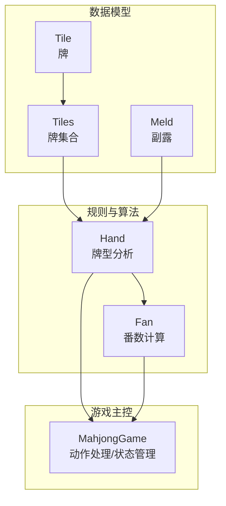
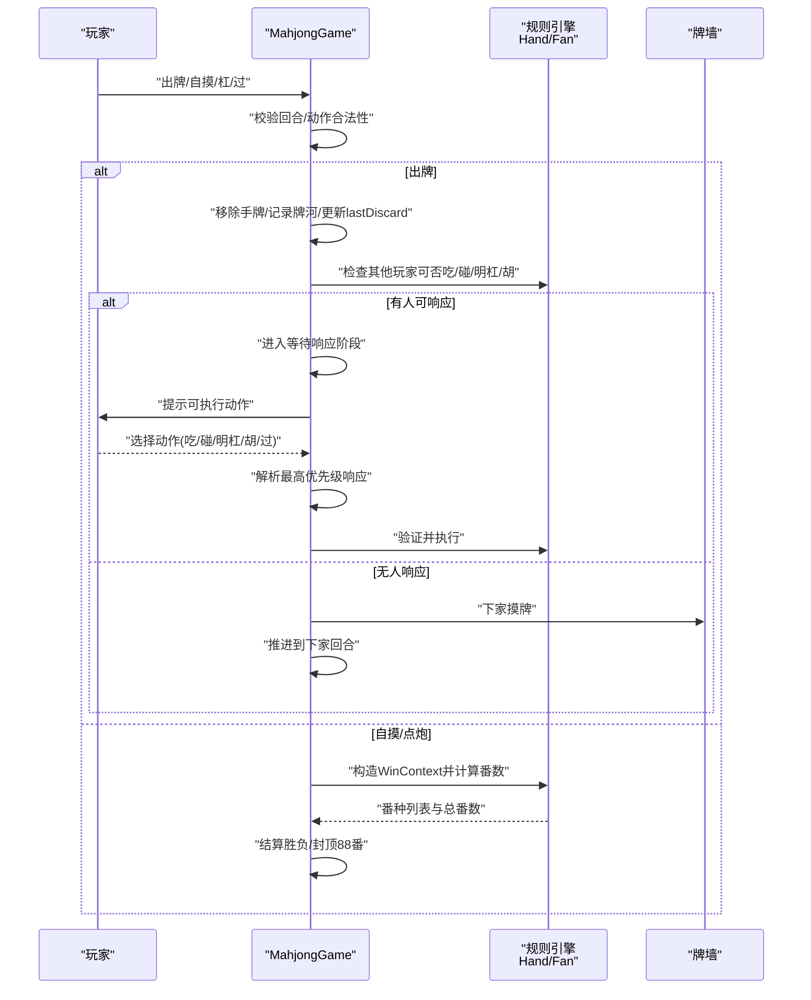
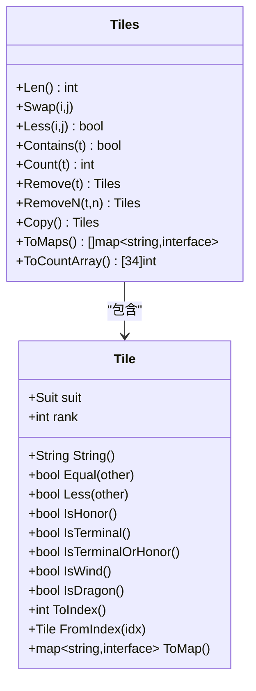
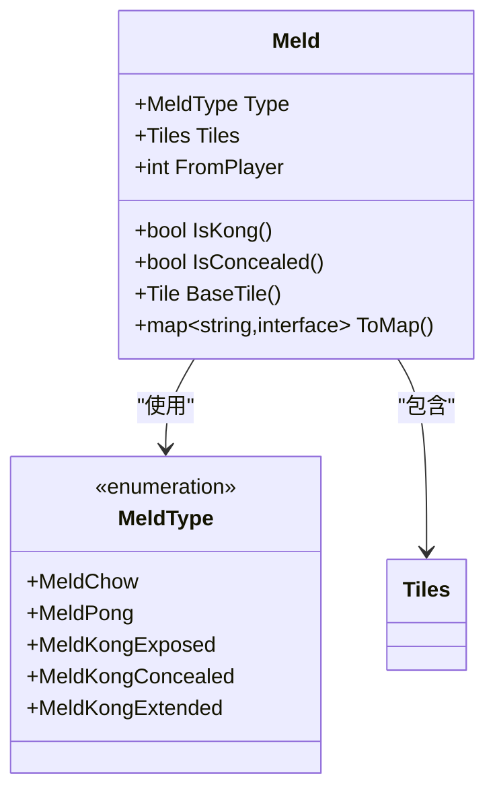
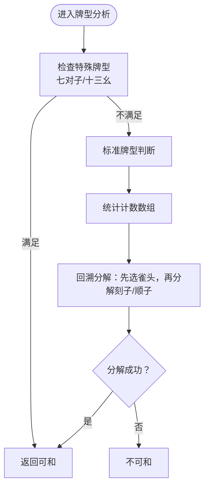
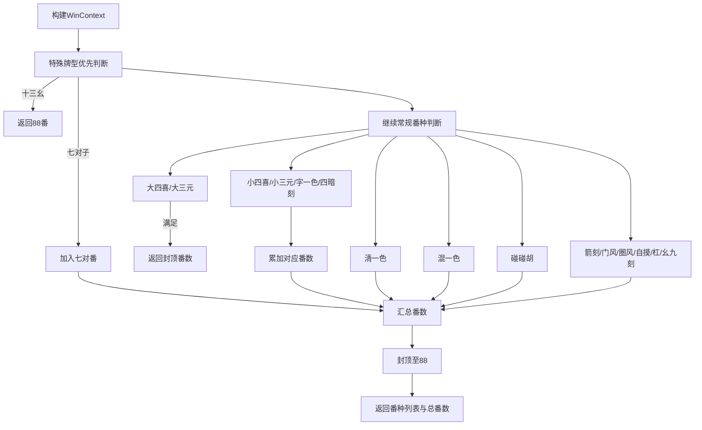
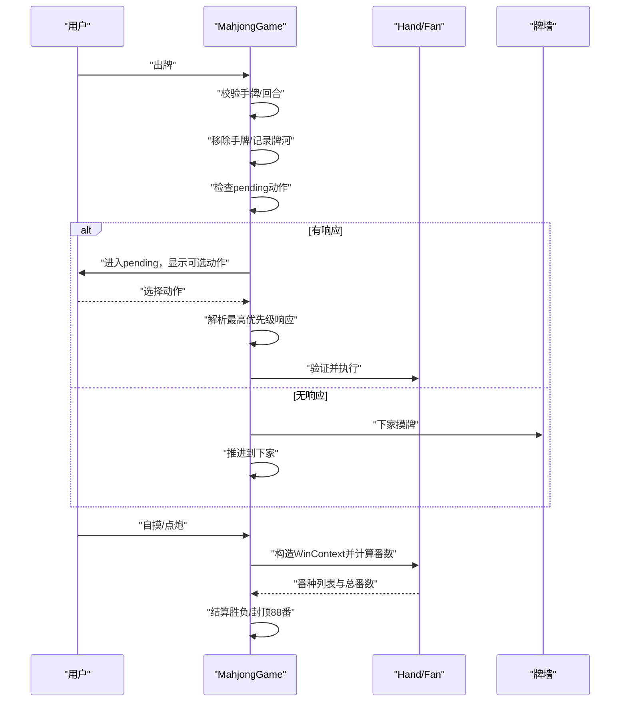
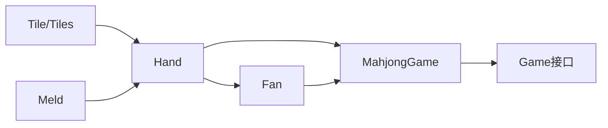

# 麻将游戏 (Mahjong)

<cite>
**本文引用的文件列表**
- [tile.go](file://internal/game/mahjong/tile.go)
- [hand.go](file://internal/game/mahjong/hand.go)
- [meld.go](file://internal/game/mahjong/meld.go)
- [fan.go](file://internal/game/mahjong/fan.go)
- [game.go](file://internal/game/mahjong/game.go)
- [game_test.go](file://internal/game/mahjong/game_test.go)
- [game.go（接口）](file://internal/game/interfaces/game.go)
</cite>

## 目录
1. [简介](#简介)
2. [项目结构](#项目结构)
3. [核心组件](#核心组件)
4. [架构总览](#架构总览)
5. [组件详解](#组件详解)
6. [依赖关系分析](#依赖关系分析)
7. [性能与内存优化](#性能与内存优化)
8. [故障排查指南](#故障排查指南)
9. [结论](#结论)
10. [附录](#附录)

## 简介
本技术文档面向麻将游戏（Mahjong）的核心实现，围绕以下目标展开：
- 深入解析 Tile（牌）、Hand（手牌）、Meld（副露组合）、Fan（番数）的数据结构与算法
- 阐述牌型分析算法：顺子、刻子、杠牌识别与特殊牌型处理
- 详述番数计算系统：和牌条件评分、复合番数、封顶规则与特殊番种判定
- 描述吃碰杠胡逻辑：动作验证、牌面变化、得分计算与游戏状态流转
- 说明手牌管理：排序、组合生成与最优解搜索
- 提供完整规则实现：听牌判断、和牌验证、游戏状态管理
- 给出性能优化策略、内存管理建议与扩展新规则的方法

## 项目结构
麻将模块位于 internal/game/mahjong，采用“按职责分层”的组织方式：
- 数据模型层：Tile、Tiles、Meld
- 规则与算法层：Hand（牌型分析）、Fan（番数计算）
- 游戏主控层：MahjongGame（动作处理、状态管理、番数结算）

图表来源
- [tile.go](file://internal/game/mahjong/tile.go#L35-L90)
- [meld.go](file://internal/game/mahjong/meld.go#L16-L21)
- [hand.go](file://internal/game/mahjong/hand.go#L3-L25)
- [fan.go](file://internal/game/mahjong/fan.go#L3-L19)
- [game.go](file://internal/game/mahjong/game.go#L51-L77)

章节来源
- [tile.go](file://internal/game/mahjong/tile.go#L1-L241)
- [meld.go](file://internal/game/mahjong/meld.go#L1-L65)
- [hand.go](file://internal/game/mahjong/hand.go#L1-L245)
- [fan.go](file://internal/game/mahjong/fan.go#L1-L497)
- [game.go](file://internal/game/mahjong/game.go#L1-L805)

## 核心组件
- Tile/Tiles：表示单张牌与牌集合，提供比较、排序、计数、移除、索引映射等能力，并支持 JSON 解析与序列化
- Meld：表示一组副露（吃/碰/明杠/暗杠/补杠），提供基础牌提取、JSON 序列化与是否杠/暗副露判断
- Hand：提供标准牌型判断（顺子/刻子/将牌）、七对子、十三幺、听牌列表与听牌判断、以及吃碰杠动作可行性判断
- Fan：提供番数计算框架与多种番种判定（清一色、混一色、碰碰胡、箭刻、门风刻、圈风刻、自摸、明/暗杠、幺九刻、大/小四喜、大/小三元、字一色、四暗刻、三暗刻、无番和等），并实现封顶至88番
- MahjongGame：实现完整的麻将流程，包括发牌、出牌、等待响应阶段、吃碰杠胡处理、自摸/点炮结算、状态查询与玩家可见信息过滤

章节来源
- [tile.go](file://internal/game/mahjong/tile.go#L35-L241)
- [meld.go](file://internal/game/mahjong/meld.go#L16-L65)
- [hand.go](file://internal/game/mahjong/hand.go#L3-L245)
- [fan.go](file://internal/game/mahjong/fan.go#L3-L497)
- [game.go](file://internal/game/mahjong/game.go#L51-L805)

## 架构总览
麻将游戏遵循统一的 Game 接口，MahjongGame 实现了初始化、动作处理、状态查询与胜负判定。核心流程如下：

图表来源
- [game.go](file://internal/game/mahjong/game.go#L142-L388)
- [hand.go](file://internal/game/mahjong/hand.go#L3-L25)
- [fan.go](file://internal/game/mahjong/fan.go#L21-L121)

章节来源
- [game.go](file://internal/game/mahjong/game.go#L142-L388)
- [game.go（接口）](file://internal/game/interfaces/game.go#L3-L22)

## 组件详解

### 数据模型：Tile 与 Tiles
- 花色与字牌编号：万、条、筒、字；字牌包含风（1-4）与箭（5-7）
- 关键属性与方法：
  - 字符串化、相等比较、大小比较
  - 是否字牌、是否老头牌（1或9）、是否幺九牌、是否风牌、是否箭牌
  - 索引映射（ToIndex/TileFromIndex）用于计数数组
  - JSON 解析与序列化（ParseTile/ToMap）
  - 牌集合操作：Contains/Count/Remove/RemoveN/Copy/ToMaps/ToCountArray/Sort
  - 新牌堆与洗牌、排序工具

图表来源
- [tile.go](file://internal/game/mahjong/tile.go#L35-L241)

章节来源
- [tile.go](file://internal/game/mahjong/tile.go#L35-L241)

### 副露模型：Meld
- 副露类型：吃（顺子）、碰（刻子）、明杠（点杠）、暗杠、补杠（加杠）
- 关键方法：
  - IsKong/IsConcealed 判断杠与暗副露
  - BaseTile 返回面子基准牌（吃取最小牌，其他取牌本身）
  - ToMap 序列化

图表来源
- [meld.go](file://internal/game/mahjong/meld.go#L3-L21)

章节来源
- [meld.go](file://internal/game/mahjong/meld.go#L16-L65)

### 手牌与牌型分析：Hand
- 核心判断：
  - CanWin：七对子、十三幺、或标准牌型（4面子+1雀头）
  - IsStandardWin：基于计数数组的回溯分解（先选雀头，再分解刻子/顺子）
  - IsSevenPairs：14张七对
  - IsThirteenOrphans：1/9万条筒+东南西北中发白各1张，其中1对
- 听牌与听牌判断：
  - GetWaitingTiles：遍历34种牌，逐一尝试加入形成和牌
  - IsListening：听牌即等待列表非空
- 吃碰杠可行性：
  - CanChow：仅下家可吃，且必须为同花色连续三张
  - CanPong：手牌≥2
  - CanKongExposed：明杠（他人打出手中≥3）
  - CanKongConcealed：暗杠（手牌=4）
  - CanKongExtended：补杠（已碰牌后摸到第4张）

图表来源
- [hand.go](file://internal/game/mahjong/hand.go#L3-L25)
- [hand.go](file://internal/game/mahjong/hand.go#L16-L105)

章节来源
- [hand.go](file://internal/game/mahjong/hand.go#L3-L245)

### 番数计算：Fan
- WinContext：包含手牌（含最后一张）、副露、胡牌牌、是否自摸、庄家/胡牌者/门风/圈风等
- 计算流程：
  - 特殊牌型优先：十三幺（88番）
  - 七对子（24番）
  - 大/小四喜（88/64）、大/小三元（88/64）、字一色（64）、四暗刻（64，自摸）
  - 清一色（24）、三暗刻（16）
  - 混一色（8）
  - 碰碰胡（6）
  - 箭刻（2×n）、门风刻（2）、圈风刻（2）、自摸（1）、明杠（1）、暗杠（1）、幺九刻（1）
  - 若未识别到番，按“无番和”8番处理
  - 总番封顶至88
- 辅助函数：
  - collectAllMelds：聚合手牌与副露的面子信息
  - decomposeHand/decomposeMeldsCollect：将手牌分解为面子+雀头（用于番种分析）
  - countKongs/countYaoJiuKe/capFan：统计杠/幺九刻/封顶

图表来源
- [fan.go](file://internal/game/mahjong/fan.go#L21-L121)
- [fan.go](file://internal/game/mahjong/fan.go#L130-L155)
- [fan.go](file://internal/game/mahjong/fan.go#L486-L496)

章节来源
- [fan.go](file://internal/game/mahjong/fan.go#L3-L497)

### 游戏主控：MahjongGame
- 游戏阶段与动作：
  - 阶段：play（出牌阶段）、pending（等待响应阶段）
  - 动作：discard、chow、pong、kong、win、pass
  - 动作优先级：胡 > 杠 > 碰 > 吃 > 过
- 初始化：洗牌、发牌（庄家14张，闲家13张）、设置庄家与当前玩家
- 出牌阶段：
  - 出牌：移除手牌、记录牌河、更新 lastDiscard/lastDiscardSeat
  - 检查其他玩家可否响应（吃/碰/明杠/胡），若有人可响应进入 pending
  - 否则推进到下家并自动摸牌
- 等待响应阶段：
  - 解析最高优先级响应（同优先级按座次近远）
  - 执行：resolveDiscardWin/resolveExposedKong/resolvePong/resolveChow
  - 自摸/点炮：构造 WinContext，调用 CalculateFan，封顶88番，≥8番才可和
- 状态查询：
  - GetState：全局状态（不暴露他人手牌）
  - GetStateForPlayer：附加我的手牌、可用动作、吃杠选项等

图表来源
- [game.go](file://internal/game/mahjong/game.go#L164-L388)
- [game.go](file://internal/game/mahjong/game.go#L523-L567)
- [game.go](file://internal/game/mahjong/game.go#L616-L651)

章节来源
- [game.go](file://internal/game/mahjong/game.go#L51-L805)

## 依赖关系分析
- 组件内聚与耦合：
  - Hand 依赖 Tile/Tiles 的计数数组与组合生成
  - Fan 依赖 Hand 的分解结果与 Meld 信息
  - MahjongGame 依赖 Hand/Fan 完成和牌验证与番数计算
  - Tile/Tiles 与 Meld 作为底层数据结构被广泛复用
- 外部依赖：
  - Game 接口约束统一行为
  - 日志输出用于调试与追踪

图表来源
- [tile.go](file://internal/game/mahjong/tile.go#L35-L241)
- [meld.go](file://internal/game/mahjong/meld.go#L16-L65)
- [hand.go](file://internal/game/mahjong/hand.go#L3-L25)
- [fan.go](file://internal/game/mahjong/fan.go#L21-L121)
- [game.go](file://internal/game/mahjong/game.go#L51-L77)
- [game.go（接口）](file://internal/game/interfaces/game.go#L3-L22)

章节来源
- [tile.go](file://internal/game/mahjong/tile.go#L35-L241)
- [meld.go](file://internal/game/mahjong/meld.go#L16-L65)
- [hand.go](file://internal/game/mahjong/hand.go#L3-L25)
- [fan.go](file://internal/game/mahjong/fan.go#L21-L121)
- [game.go](file://internal/game/mahjong/game.go#L51-L77)
- [game.go（接口）](file://internal/game/interfaces/game.go#L3-L22)

## 性能与内存优化
- 计数数组优化
  - 使用 ToCountArray 将手牌压缩为34元素数组，避免重复扫描
  - 在 canDecompose/canDecomposeMelds 与 fan 判定时复用计数，减少循环次数
- 递归分解剪枝
  - 先选雀头再分解刻子/顺子，遇到不可能分支及时回溯
  - 顺子尝试仅限于万条筒且 rank≤6 的连续三张
- 数据结构选择
  - Tiles 实现 sort.Interface，便于排序与二分查找
  - Meld 保存基础牌与是否暗副露，便于番种分析
- 内存管理
  - Remove/RemoveN 返回新切片，避免修改原集合
  - Copy 用于深拷贝，确保并发安全与不可变性
- 状态查询优化
  - GetStateForPlayer 仅暴露必要信息，避免传输全量手牌
  - pendingChowData/kongOptions 仅在需要时提供

章节来源
- [tile.go](file://internal/game/mahjong/tile.go#L206-L241)
- [hand.go](file://internal/game/mahjong/hand.go#L27-L105)
- [fan.go](file://internal/game/mahjong/fan.go#L157-L234)
- [game.go](file://internal/game/mahjong/game.go#L655-L755)

## 故障排查指南
- 出牌阶段错误
  - 非当前回合：检查 currentSeat 与 playerSeats 的映射
  - 手牌中无该牌：确认 ParseTile 与 Remove 的一致性
- 等待响应阶段错误
  - 操作非法：核对 actionPriority 与 pendingActions 的匹配
  - 吃牌数据错误：检查 parseChowTiles 与 isValidChowSet
- 和牌判定错误
  - 特殊牌型未识别：核对 IsSevenPairs/IsThirteenOrphans 的条件
  - 标准牌型分解失败：检查 canDecompose/canDecomposeMelds 的递归路径
- 番数异常
  - 无番和：确认未识别到番时的兜底逻辑
  - 封顶异常：检查 capFan 的边界值
- 流局
  - 牌墙为空：检查 advanceToNextPlayer 与 handleDrawGame 的触发

章节来源
- [game.go](file://internal/game/mahjong/game.go#L164-L388)
- [game.go](file://internal/game/mahjong/game.go#L523-L567)
- [fan.go](file://internal/game/mahjong/fan.go#L486-L496)
- [game_test.go](file://internal/game/mahjong/game_test.go#L395-L437)

## 结论
本实现以清晰的数据模型与规则分离为核心，通过计数数组与回溯分解实现高效的牌型分析，结合完善的番数体系与严格的动作优先级，提供了可扩展、可维护的麻将游戏核心。建议在后续迭代中：
- 引入更多番种与规则变体（如国标/日式规则）
- 增强客户端交互与可视化（听牌提示、番种详情）
- 加强并发安全与状态持久化
- 优化大牌型场景下的递归深度与剪枝策略

## 附录
- 测试覆盖要点
  - 牌堆构建与洗牌、牌解析与序列化
  - 手牌操作（Contains/Count/Remove/RemoveN/Copy/ToMaps/ToCountArray）
  - 牌型判断（标准牌型、七对子、十三幺、听牌）
  - 吃碰杠可行性
  - 番数计算（清一色、七对、大/小四喜/三元、字一色、四暗刻、三暗刻、箭刻、门风/圈风刻、自摸、杠、幺九刻、无番和）
  - 游戏流程（初始化、出牌、等待响应、自摸/点炮、状态查询）

章节来源
- [game_test.go](file://internal/game/mahjong/game_test.go#L11-L437)