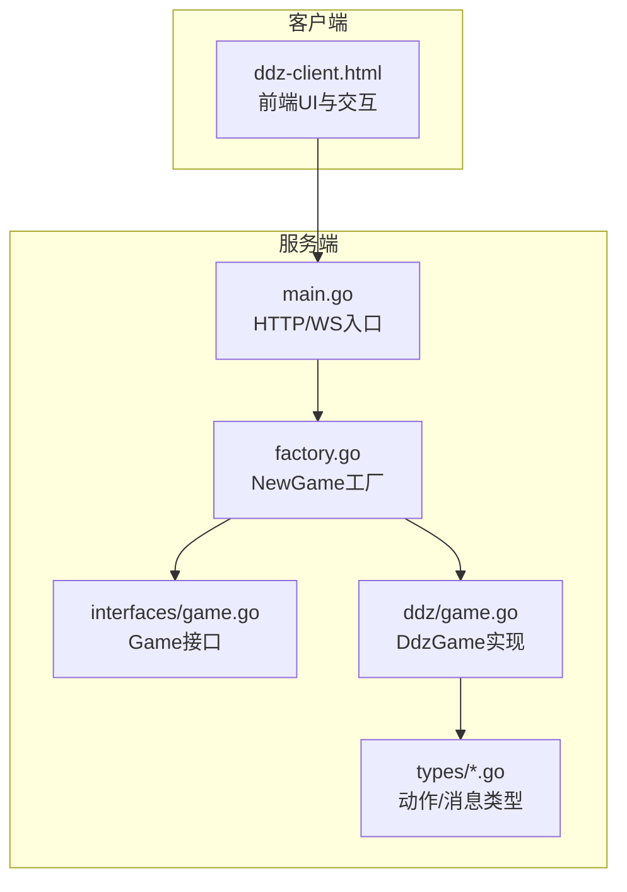
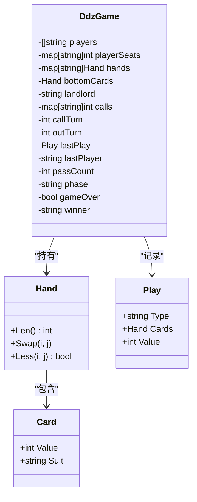
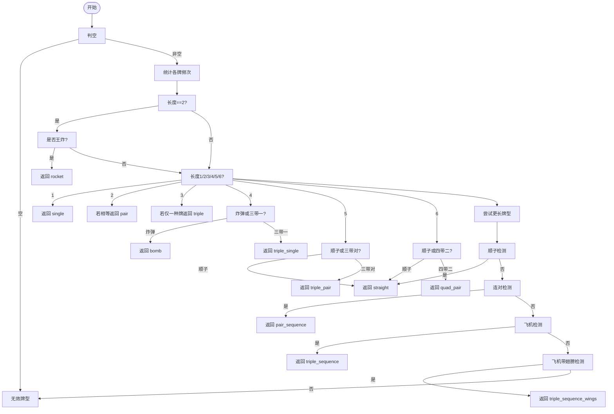
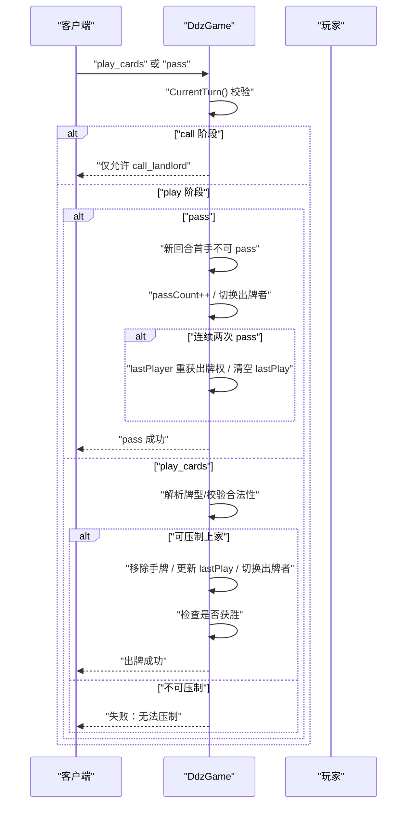
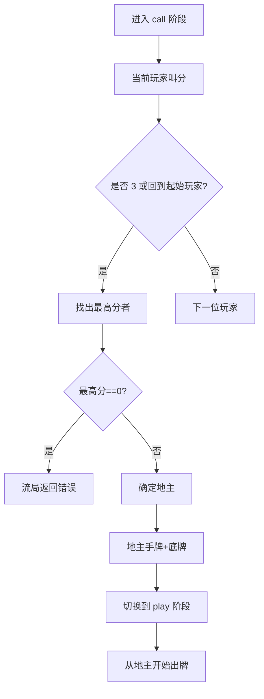
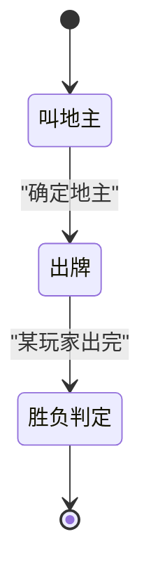
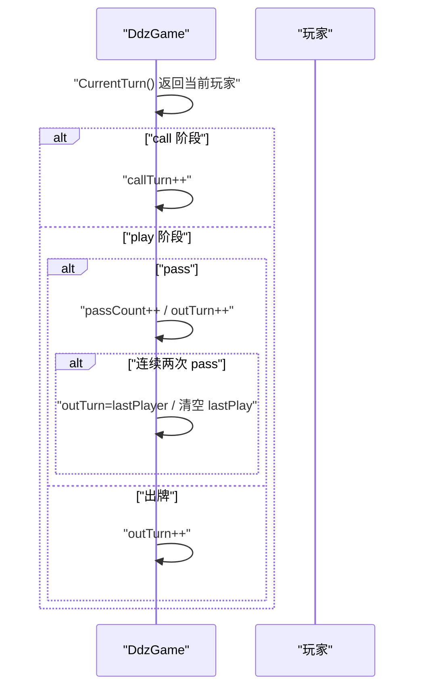
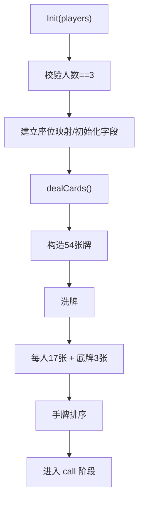
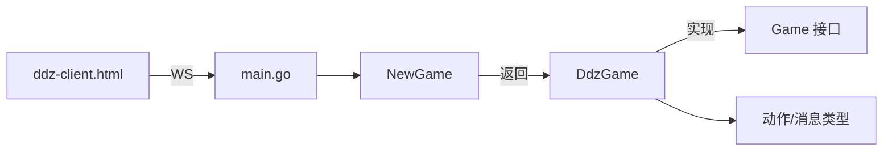

# 斗地主游戏 (DDZ)

<cite>
**本文引用的文件**
- [internal/game/ddz/game.go](file://internal/game/ddz/game.go)
- [internal/game/interfaces/game.go](file://internal/game/interfaces/game.go)
- [internal/game/factory.go](file://internal/game/factory.go)
- [internal/types/game_action.go](file://internal/types/game_action.go)
- [internal/types/message.go](file://internal/types/message.go)
- [main.go](file://main.go)
- [ddz-client.html](file://ddz-client.html)
</cite>

## 目录
1. [简介](#简介)
2. [项目结构](#项目结构)
3. [核心组件](#核心组件)
4. [架构总览](#架构总览)
5. [详细组件分析](#详细组件分析)
6. [依赖关系分析](#依赖关系分析)
7. [性能考量](#性能考量)
8. [故障排查指南](#故障排查指南)
9. [结论](#结论)
10. [附录](#附录)

## 简介
本文件面向斗地主（DDZ）游戏的技术实现，系统性梳理三农民一地主的规则设计与算法实现，覆盖牌型识别、出牌校验、地主确定、轮次推进与状态管理等关键模块。文档同时给出面向扩展的开发建议与性能优化思路，帮助开发者快速理解并迭代该实现。

## 项目结构
- 游戏核心位于 internal/game/ddz，包含 DDZ 的完整逻辑实现。
- 通用接口定义在 internal/game/interfaces，统一 Game 接口规范。
- 工厂函数 internal/game/factory 提供游戏实例化入口。
- 类型与消息协议在 internal/types 下定义，涵盖动作类型与消息结构。
- 客户端前端位于 ddz-client.html，负责用户交互与状态展示。
- 服务端入口 main.go 提供 WebSocket 入口，连接内部处理模块。



图表来源
- [main.go](file://main.go#L10-L14)
- [internal/game/factory.go](file://internal/game/factory.go#L11-L23)
- [internal/game/interfaces/game.go](file://internal/game/interfaces/game.go#L4-L16)
- [internal/game/ddz/game.go](file://internal/game/ddz/game.go#L43-L45)
- [internal/types/game_action.go](file://internal/types/game_action.go#L6-L18)
- [internal/types/message.go](file://internal/types/message.go#L33-L56)
- [ddz-client.html](file://ddz-client.html#L1-L200)

章节来源
- [main.go](file://main.go#L10-L14)
- [internal/game/factory.go](file://internal/game/factory.go#L11-L23)
- [internal/game/interfaces/game.go](file://internal/game/interfaces/game.go#L4-L16)
- [internal/game/ddz/game.go](file://internal/game/ddz/game.go#L43-L45)
- [internal/types/game_action.go](file://internal/types/game_action.go#L6-L18)
- [internal/types/message.go](file://internal/types/message.go#L33-L56)
- [ddz-client.html](file://ddz-client.html#L1-L200)

## 核心组件
- DdzGame：斗地主游戏核心状态与逻辑，包含玩家、手牌、底牌、叫分、出牌、胜负判定等。
- Game 接口：统一的抽象，约束初始化、动作处理、轮次推进、状态查询等能力。
- 工厂 NewGame：根据游戏类型返回对应 Game 实例。
- 动作与消息类型：定义 call_landlord、pass、play_cards 等动作类型及消息结构。

章节来源
- [internal/game/ddz/game.go](file://internal/game/ddz/game.go#L20-L35)
- [internal/game/interfaces/game.go](file://internal/game/interfaces/game.go#L4-L16)
- [internal/game/factory.go](file://internal/game/factory.go#L11-L23)
- [internal/types/game_action.go](file://internal/types/game_action.go#L6-L18)
- [internal/types/message.go](file://internal/types/message.go#L52-L56)

## 架构总览
DDZ 的服务端采用“接口抽象 + 具体实现”的分层设计：
- 接口层：Game 抽象，约束所有卡牌游戏的通用行为。
- 实现层：DdzGame 具体实现，包含发牌、叫地主、出牌、轮次推进、胜负判定等。
- 工厂层：NewGame 根据类型返回具体游戏实例，便于扩展更多游戏。
- 类型层：统一的动作与消息结构，保证前后端交互一致性。
- 前端层：ddz-client.html 负责渲染与交互，通过 WS 与后端通信。

```mermaid
classDiagram
class Game {
+ID() string
+Init(players []string) error
+ProcessAction(playerID, action) (bool, error)
+CurrentTurn() string
+AdvanceTurn()
+GetState() interface{}
+GetStateForPlayer(playerID) interface{}
+IsGameOver() bool
+Winner() string
+MaxPlayers() int
+MinPlayers() int
}
class DdzGame {
-players []string
-playerSeats map[string]int
-hands map[string]Hand
-bottomCards Hand
-landlord string
-calls map[string]int
-callTurn int
-outTurn int
-lastPlay Play
-lastPlayer string
-passCount int
-phase string
-gameOver bool
-winner string
+Init(players []string) error
+ProcessAction(playerID, action) (bool, error)
+CurrentTurn() string
+AdvanceTurn()
+GetState() interface{}
+GetStateForPlayer(playerID) interface{}
+IsGameOver() bool
+Winner() string
+MaxPlayers() int
+MinPlayers() int
}
class Factory {
+NewGame(gameType string) (Game, error)
}
Game <|.. DdzGame : "实现"
Factory --> DdzGame : "创建"
```

图表来源
- [internal/game/interfaces/game.go](file://internal/game/interfaces/game.go#L4-L16)
- [internal/game/ddz/game.go](file://internal/game/ddz/game.go#L43-L45)
- [internal/game/factory.go](file://internal/game/factory.go#L11-L23)

## 详细组件分析

### 数据模型与状态
- Card/Hand/Play：基础牌元数据、手牌集合、一次出牌的描述（类型、牌面、主牌值）。
- DdzGame：维护玩家列表、座位映射、手牌、底牌、地主、叫分记录、当前回合、最后出牌、胜负状态等。



图表来源
- [internal/game/ddz/game.go](file://internal/game/ddz/game.go#L13-L41)
- [internal/game/ddz/game.go](file://internal/game/ddz/game.go#L20-L35)

章节来源
- [internal/game/ddz/game.go](file://internal/game/ddz/game.go#L13-L41)
- [internal/game/ddz/game.go](file://internal/game/ddz/game.go#L20-L35)

### 牌型识别算法
- 解析入口：parsePlayType 对传入手牌进行类型判定，优先处理王炸、单张、对子、三张、炸弹、三带一/对、顺子、连对、飞机、飞机带翅膀、四带二等。
- 关键辅助：
  - isStraight：判断顺子（至少五张，且不含2，且值连续）。
  - isPairSequence：判断连对（偶数张，至少六张，且每种值出现两次，且值连续）。
  - isTripleSequence：判断飞机（三的倍数张，至少六张，且每种值出现三次，且值连续）。
  - isTripleWithSingle/isTripleWithPair：三带一/对。
  - isQuadWithPair：四带二（一对或两单）。
  - isTripleSequenceWithWings：飞机带翅膀（三顺 + 翅膀数量匹配）。
- 主牌值与比较：
  - getMainCardValue：复合牌型取主体牌值（三张/四张/飞机最小值）。
  - getMinCardValue：顺子/连对/飞机取最小牌值。
  - cardValueForSort：排序权重（大王>小王>2>A>K>…>3）。



图表来源
- [internal/game/ddz/game.go](file://internal/game/ddz/game.go#L381-L463)
- [internal/game/ddz/game.go](file://internal/game/ddz/game.go#L506-L538)
- [internal/game/ddz/game.go](file://internal/game/ddz/game.go#L541-L579)
- [internal/game/ddz/game.go](file://internal/game/ddz/game.go#L582-L620)
- [internal/game/ddz/game.go](file://internal/game/ddz/game.go#L623-L643)
- [internal/game/ddz/game.go](file://internal/game/ddz/game.go#L646-L682)

章节来源
- [internal/game/ddz/game.go](file://internal/game/ddz/game.go#L381-L463)
- [internal/game/ddz/game.go](file://internal/game/ddz/game.go#L506-L538)
- [internal/game/ddz/game.go](file://internal/game/ddz/game.go#L541-L579)
- [internal/game/ddz/game.go](file://internal/game/ddz/game.go#L582-L620)
- [internal/game/ddz/game.go](file://internal/game/ddz/game.go#L623-L643)
- [internal/game/ddz/game.go](file://internal/game/ddz/game.go#L646-L682)

### 出牌规则验证与大小比较
- 阶段控制：call 阶段仅允许 call_landlord；play 阶段仅允许 pass 或 play_cards。
- 牌型合法性：通过 parsePlayType 判定。
- 压制校验：beatsLast 比较策略如下：
  - 王炸永远可压。
  - 炸弹可压非王炸。
  - 同类型比较：
    - 三带/四带/飞机带翅膀：取主体牌值比较。
    - 顺子/连对/飞机：长度一致且最小牌值更大。
    - 其他：长度一致且首张牌值更大。
- pass 逻辑：新回合第一手不可 pass；连续两次 pass 后，最后出牌者重获出牌权并清空 lastPlay。



图表来源
- [internal/game/ddz/game.go](file://internal/game/ddz/game.go#L125-L293)
- [internal/game/ddz/game.go](file://internal/game/ddz/game.go#L684-L724)

章节来源
- [internal/game/ddz/game.go](file://internal/game/ddz/game.go#L125-L293)
- [internal/game/ddz/game.go](file://internal/game/ddz/game.go#L684-L724)

### 地主身份确定与农民阵营
- 叫分阶段：三名玩家依次进行，支持 0~3 分；当有人叫 3 或一轮结束后回到起始玩家，则进入结算。
- 结算：最高分者成为地主；若最高分为 0，则流局（当前实现返回错误）。
- 底牌处理：地主手牌加上底牌（3 张），并重新排序。
- 出牌顺序：从地主开始出牌，随后按顺时针轮转。



图表来源
- [internal/game/ddz/game.go](file://internal/game/ddz/game.go#L135-L173)
- [internal/game/ddz/game.go](file://internal/game/ddz/game.go#L166-L171)

章节来源
- [internal/game/ddz/game.go](file://internal/game/ddz/game.go#L135-L173)
- [internal/game/ddz/game.go](file://internal/game/ddz/game.go#L166-L171)

### 游戏状态管理与胜负判定
- 状态字段：phase、landlord、bottomCards、lastPlay、lastPlayer、passCount、gameOver、winner。
- 状态查询：GetState 返回不包含具体手牌的公共状态；GetStateForPlayer 返回包含该玩家手牌的私密状态。
- 胜负判定：
  - 若某玩家出完手牌，标记游戏结束。
  - 地主获胜或农民全部出完获胜；否则保留“进行中”（理论上不会出现）。



图表来源
- [internal/game/ddz/game.go](file://internal/game/ddz/game.go#L300-L334)
- [internal/game/ddz/game.go](file://internal/game/ddz/game.go#L253-L278)

章节来源
- [internal/game/ddz/game.go](file://internal/game/ddz/game.go#L300-L334)
- [internal/game/ddz/game.go](file://internal/game/ddz/game.go#L253-L278)

### AdvancedTurn() 与 CurrentTurn() 的轮次推进
- CurrentTurn：根据当前阶段返回 callTurn 或 outTurn 对应的玩家 ID。
- AdvanceTurn：在该实现中由 ProcessAction 内部控制轮次推进，不单独调用 AdvanceTurn。
- passCount 与 lastPlayer：用于 pass 逻辑与回合结束判断。



图表来源
- [internal/game/ddz/game.go](file://internal/game/ddz/game.go#L118-L123)
- [internal/game/ddz/game.go](file://internal/game/ddz/game.go#L175-L193)
- [internal/game/ddz/game.go](file://internal/game/ddz/game.go#L251-L251)
- [internal/game/ddz/game.go](file://internal/game/ddz/game.go#L295-L297)

章节来源
- [internal/game/ddz/game.go](file://internal/game/ddz/game.go#L118-L123)
- [internal/game/ddz/game.go](file://internal/game/ddz/game.go#L175-L193)
- [internal/game/ddz/game.go](file://internal/game/ddz/game.go#L251-L251)
- [internal/game/ddz/game.go](file://internal/game/ddz/game.go#L295-L297)

### 游戏初始化与发牌
- 初始化：校验玩家数量为 3，建立座位映射，初始化阶段与轮次指针。
- 发牌：构建 54 张标准牌（含大小王），洗牌后每人发 17 张，底牌 3 张，手牌按自定义排序权重排序。
- 叫地主：从座位 0 开始依次叫分，进入结算阶段。



图表来源
- [internal/game/ddz/game.go](file://internal/game/ddz/game.go#L52-L73)
- [internal/game/ddz/game.go](file://internal/game/ddz/game.go#L75-L116)

章节来源
- [internal/game/ddz/game.go](file://internal/game/ddz/game.go#L52-L73)
- [internal/game/ddz/game.go](file://internal/game/ddz/game.go#L75-L116)

## 依赖关系分析
- 工厂 NewGame 根据字符串类型返回 Game 实例，当前支持 ddz/simple/mahjong。
- DdzGame 实现 Game 接口，内部使用内部类型定义的动作与消息结构。
- 前端 ddz-client.html 通过 WS 与后端交互，发送 call_landlord/pass/play_cards 等动作。



图表来源
- [internal/game/factory.go](file://internal/game/factory.go#L11-L23)
- [internal/game/interfaces/game.go](file://internal/game/interfaces/game.go#L4-L16)
- [internal/types/game_action.go](file://internal/types/game_action.go#L6-L18)
- [internal/types/message.go](file://internal/types/message.go#L52-L56)
- [ddz-client.html](file://ddz-client.html#L1-L200)
- [main.go](file://main.go#L10-L14)

章节来源
- [internal/game/factory.go](file://internal/game/factory.go#L11-L23)
- [internal/game/interfaces/game.go](file://internal/game/interfaces/game.go#L4-L16)
- [internal/types/game_action.go](file://internal/types/game_action.go#L6-L18)
- [internal/types/message.go](file://internal/types/message.go#L52-L56)
- [ddz-client.html](file://ddz-client.html#L1-L200)
- [main.go](file://main.go#L10-L14)

## 性能考量
- 发牌与排序：dealCards 中使用切片拷贝与排序，时间复杂度 O(n log n)，n=54；手牌排序 O(17 log 17)。
- 牌型识别：parsePlayType 与各辅助函数均基于哈希表与线性扫描，整体 O(k)（k 为手牌数），常数较小。
- 比较函数：cardValueForSort 将大小王置于高位，避免复杂比较逻辑，提升稳定性。
- 建议优化点：
  - 使用预计算的排序权重数组替代分支判断，减少分支预测开销。
  - 对 countMap 的遍历可改为有序集合以减少排序成本。
  - 在 removeCards 中使用双指针或更高效的差集算法，降低 O(n^2) 风险。
  - 对于高频比较（beatsLast），可缓存上一轮牌型与主牌值，避免重复计算。

[本节为通用性能建议，无需特定文件来源]

## 故障排查指南
- “不是你的回合”：确认 CurrentTurn 与当前玩家一致，检查 call/out 轮次推进逻辑。
- “无效的 action 类型”：确认前端发送的动作类型与后端期望一致（call_landlord/pass/play_cards）。
- “叫分范围 0~3”：前端需限制输入范围，后端再次校验。
- “新回合第一手牌必须出牌，不能 pass”：pass 仅在非首轮后可用。
- “无法压制上家”：检查牌型合法性与大小比较逻辑。
- “无人叫地主，游戏流局”：当前实现返回错误，可在上层逻辑中重开或随机决定。

章节来源
- [internal/game/ddz/game.go](file://internal/game/ddz/game.go#L125-L147)
- [internal/game/ddz/game.go](file://internal/game/ddz/game.go#L175-L197)
- [internal/game/ddz/game.go](file://internal/game/ddz/game.go#L227-L239)
- [internal/game/ddz/game.go](file://internal/game/ddz/game.go#L162-L165)

## 结论
该 DDZ 实现遵循清晰的接口抽象与模块化设计，完成了三农民一地主的核心规则：发牌、叫地主、出牌与胜负判定。牌型识别与大小比较逻辑完备，轮次推进与状态管理清晰。建议在后续迭代中引入更高效的排序与比较策略，并完善流局与异常场景的上层处理。

[本节为总结性内容，无需特定文件来源]

## 附录

### 动作与消息类型对照
- 动作类型：call_landlord、pass、play_cards。
- 消息结构：统一的 Message 与 GameActionData，便于前后端交互。

章节来源
- [internal/types/game_action.go](file://internal/types/game_action.go#L6-L18)
- [internal/types/message.go](file://internal/types/message.go#L52-L56)

### 前端交互要点
- 前端通过 WS 接收状态更新，渲染当前回合、地主、上家出牌、阶段等信息。
- 出牌时将选中的手牌转换为后端期望的数据结构（含 value 字段）。

章节来源
- [ddz-client.html](file://ddz-client.html#L1-L200)
- [internal/types/message.go](file://internal/types/message.go#L52-L56)