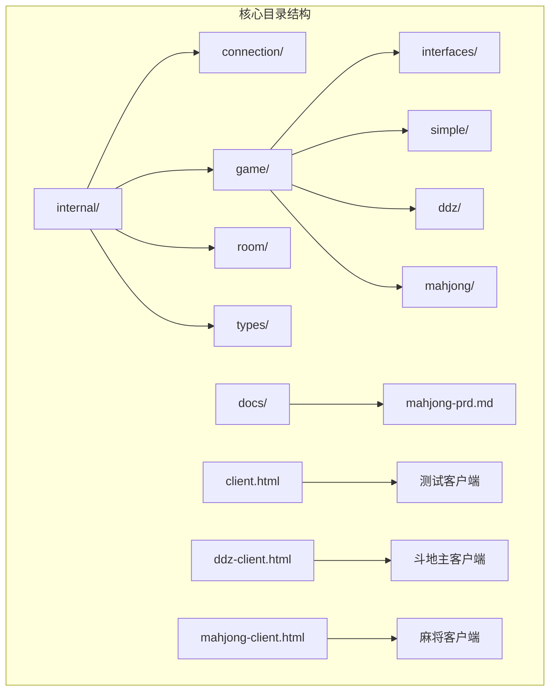
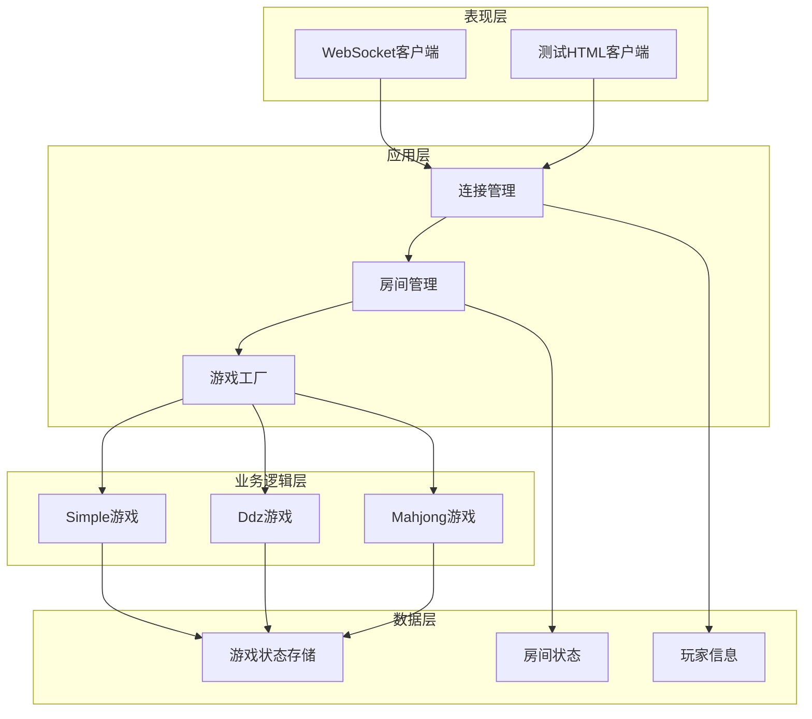
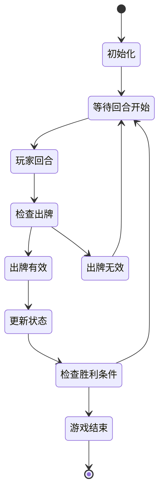
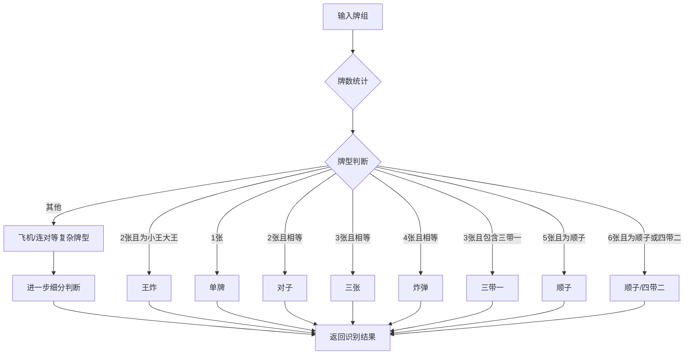
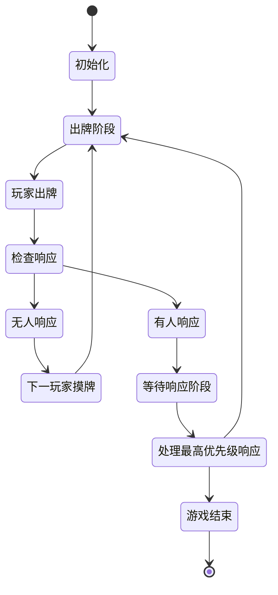
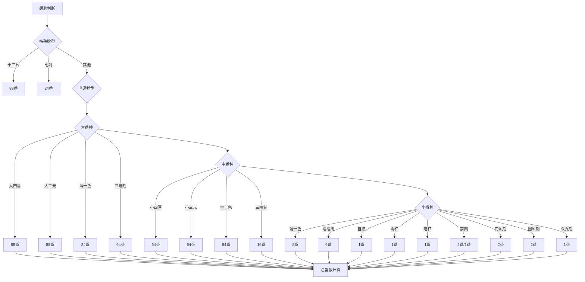
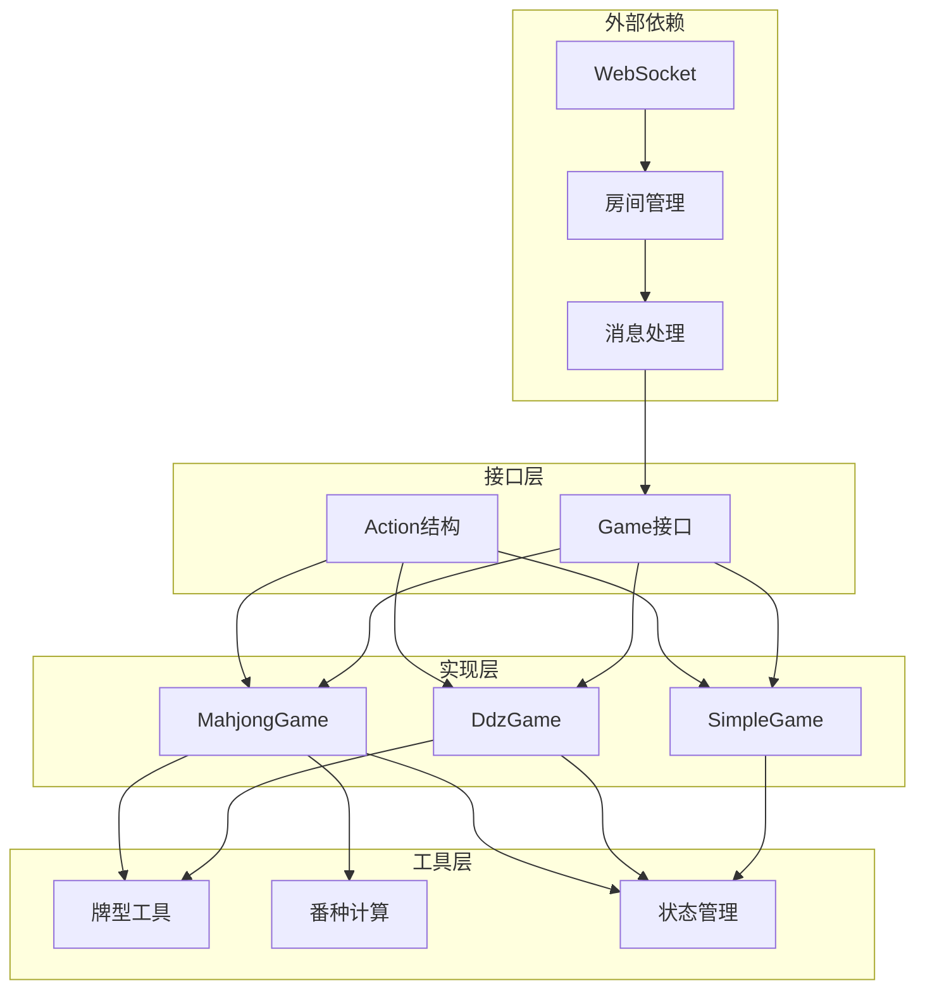
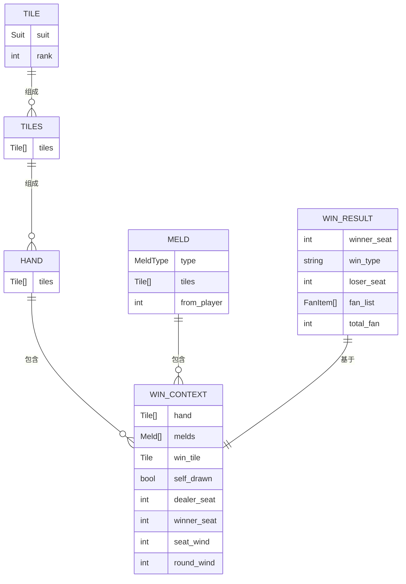

# 游戏实现详解

<cite>
**本文档引用的文件**
- [internal/game/factory.go](file://internal/game/factory.go)
- [internal/game/interfaces/game.go](file://internal/game/interfaces/game.go)
- [internal/game/simple/game.go](file://internal/game/simple/game.go)
- [internal/game/ddz/game.go](file://internal/game/ddz/game.go)
- [internal/game/mahjong/game.go](file://internal/game/mahjong/game.go)
- [internal/game/mahjong/tile.go](file://internal/game/mahjong/tile.go)
- [internal/game/mahjong/hand.go](file://internal/game/mahjong/hand.go)
- [internal/game/mahjong/meld.go](file://internal/game/mahjong/meld.go)
- [internal/game/mahjong/fan.go](file://internal/game/mahjong/fan.go)
- [internal/types/game_action.go](file://internal/types/game_action.go)
- [internal/game/mahjong/game_test.go](file://internal/game/mahjong/game_test.go)
- [main.go](file://main.go)
- [README.md](file://README.md)
</cite>

## 目录
1. [简介](#简介)
2. [项目结构](#项目结构)
3. [核心组件](#核心组件)
4. [架构概览](#架构概览)
5. [详细组件分析](#详细组件分析)
6. [依赖分析](#依赖分析)
7. [性能考虑](#性能考虑)
8. [故障排除指南](#故障排除指南)
9. [结论](#结论)
10. [附录](#附录)

## 简介

这是一个基于 Go 语言和 WebSocket 的多人在线卡牌游戏服务器，支持三种不同的游戏类型：simple 简易纸牌、ddz 斗地主和 mahjong 麻将。该项目采用模块化设计，通过统一的游戏接口抽象实现了多种游戏的可扩展架构。

项目的主要特点包括：
- **多游戏支持**：支持三种不同复杂度的卡牌游戏
- **实时通信**：基于 WebSocket 的全双工实时通信
- **房间管理**：完整的房间创建、管理和状态同步机制
- **断线重连**：游戏中的断线保护和重连恢复
- **扩展性**：清晰的接口设计，易于添加新的游戏类型

## 项目结构

项目采用分层模块化架构，主要目录结构如下：



**图表来源**
- [internal/game/factory.go](file://internal/game/factory.go#L1-L24)
- [internal/game/interfaces/game.go](file://internal/game/interfaces/game.go#L1-L23)

**章节来源**
- [README.md](file://README.md#L20-L50)
- [main.go](file://main.go#L1-L15)

## 核心组件

### 游戏接口抽象

所有游戏都实现了统一的 `Game` 接口，确保了代码的一致性和可扩展性：

```mermaid
classDiagram
class Game {
<<interface>>
+ID() string
+Init(players []string) error
+ProcessAction(playerID string, action interface{}) (bool, error)
+CurrentTurn() string
+AdvanceTurn()
+GetState() interface{}
+GetStateForPlayer(playerID string) interface{}
+IsGameOver() bool
+Winner() string
+MaxPlayers() int
+MinPlayers() int
}
class SimpleGame {
-players []string
-turnIndex int
-lastCard int
-hands map[string][]int
-gameOver bool
-winner string
+ID() string
+Init(players []string) error
+ProcessAction(playerID string, action interface{}) (bool, error)
+CurrentTurn() string
+AdvanceTurn()
+GetState() interface{}
+GetStateForPlayer(playerID string) interface{}
+IsGameOver() bool
+Winner() string
+MaxPlayers() int
+MinPlayers() int
}
class DdzGame {
-players []string
-playerSeats map[string]int
-hands map[string]Hand
-bottomCards Hand
-landlord string
-calls map[string]int
-callTurn int
-outTurn int
-lastPlay Play
-lastPlayer string
-passCount int
-phase string
-gameOver bool
-winner string
+ID() string
+Init(players []string) error
+ProcessAction(playerID string, action interface{}) (bool, error)
+CurrentTurn() string
+AdvanceTurn()
+GetState() interface{}
+GetStateForPlayer(playerID string) interface{}
+IsGameOver() bool
+Winner() string
+MaxPlayers() int
+MinPlayers() int
}
class MahjongGame {
-players []string
-playerSeats map[string]int
-hands [4]Tiles
-melds [4][]Meld
-discards [4]Tiles
-wall Tiles
-dealerSeat int
-currentSeat int
-phase string
-lastDiscard *Tile
-lastDiscardSeat int
-pendingActions map[int][]string
-pendingResponses map[int]*PendingResponse
-pendingChowData map[int]interface{}
-gameOver bool
-winner string
-winResult *WinResult
+ID() string
+Init(players []string) error
+ProcessAction(playerID string, action interface{}) (bool, error)
+CurrentTurn() string
+AdvanceTurn()
+GetState() interface{}
+GetStateForPlayer(playerID string) interface{}
+IsGameOver() bool
+Winner() string
+MaxPlayers() int
+MinPlayers() int
}
Game <|.. SimpleGame
Game <|.. DdzGame
Game <|.. MahjongGame
```

**图表来源**
- [internal/game/interfaces/game.go](file://internal/game/interfaces/game.go#L3-L16)
- [internal/game/simple/game.go](file://internal/game/simple/game.go#L8-L15)
- [internal/game/ddz/game.go](file://internal/game/ddz/game.go#L20-L35)
- [internal/game/mahjong/game.go](file://internal/game/mahjong/game.go#L52-L77)

### 游戏工厂模式

通过工厂模式实现游戏实例的创建和管理：

```mermaid
flowchart TD
A[客户端请求游戏类型] --> B{NewGame函数}
B --> |simple| C[SimpleGame.New()]
B --> |ddz| D[DdzGame.New()]
B --> |mahjong| E[MahjongGame.New()]
B --> |其他| F[返回错误]
C --> G[返回SimpleGame实例]
D --> H[返回DdzGame实例]
E --> I[返回MahjongGame实例]
F --> J[返回unknown game type错误]
```

**图表来源**
- [internal/game/factory.go](file://internal/game/factory.go#L11-L23)

**章节来源**
- [internal/game/factory.go](file://internal/game/factory.go#L1-L24)
- [internal/game/interfaces/game.go](file://internal/game/interfaces/game.go#L1-L23)

## 架构概览

项目采用分层架构设计，各层职责明确：



**图表来源**
- [main.go](file://main.go#L10-L14)
- [internal/game/factory.go](file://internal/game/factory.go#L1-L24)

## 详细组件分析

### Simple 简易纸牌游戏

Simple 游戏是最简单的卡牌对战游戏，适合快速测试和演示：

#### 核心特点
- **2人对战**：固定2名玩家参与
- **简单规则**：出牌必须大于上家，最先出完牌的玩家获胜
- **低复杂度**：使用整数表示牌面，便于测试和演示

#### 状态管理机制



**图表来源**
- [internal/game/simple/game.go](file://internal/game/simple/game.go#L26-L65)

#### 关键算法实现

1. **出牌验证算法**：
   - 检查是否轮到当前玩家
   - 验证出牌指令格式
   - 比较牌面大小（当前实现为宽松验证）

2. **手牌移除算法**：
   ```go
   func removeCard(hand []int, c int) []int {
       for i, v := range hand {
           if v == c {
               return append(hand[:i], hand[i+1:]...)
           }
       }
       return hand
   }
   ```

**章节来源**
- [internal/game/simple/game.go](file://internal/game/simple/game.go#L1-L102)

### Ddz 斗地主游戏

Ddz 游戏实现了经典的斗地主玩法，包含复杂的牌型判断和游戏逻辑：

#### 核心特点
- **3人对战**：地主vs两个农民
- **叫分机制**：三轮叫分确定地主身份
- **复杂牌型**：支持单牌、对子、三张、炸弹、顺子等多种牌型
- **回合制**：轮流出牌，支持跳过功能

#### 牌型识别算法



**图表来源**
- [internal/game/ddz/game.go](file://internal/game/ddz/game.go#L381-L463)

#### 关键算法实现

1. **牌型识别算法**：
   - 使用 `countMap` 统计每张牌的数量
   - 根据牌数和统计结果判断牌型
   - 支持复杂牌型如飞机、连对、四带二等

2. **牌型比较算法**：
   ```go
   func (g *DdzGame) beatsLast(playType string, cards Hand) bool {
       // 王炸无敌
       if playType == "rocket" {
           return true
       }
       
       // 炸弹可以压非王炸
       if playType == "bomb" && g.lastPlay.Type != "rocket" {
           return true
       }
       
       // 同类型牌型比较
       if playType == g.lastPlay.Type {
           // 特殊牌型比较逻辑
           // ...
       }
       
       return false
   }
   ```

3. **发牌算法**：
   - 创建54张标准扑克牌
   - 随机洗牌
   - 按17张/17张/17张分配给三名玩家
   - 剩余3张作为底牌

**章节来源**
- [internal/game/ddz/game.go](file://internal/game/ddz/game.go#L1-L841)

### Mahjong 麻将游戏

Mahjong 游戏实现了国标麻将的简化版本，包含复杂的番种计算和副露系统：

#### 核心特点
- **4人对战**：东南西北方位
- **庄家制度**：固定庄家，庄家多摸一张牌
- **副露系统**：吃、碰、杠、胡的完整流程
- **番种计算**：30种番种的完整计算系统
- **等待响应机制**：复杂的多玩家响应处理

#### 游戏阶段流程



**图表来源**
- [internal/game/mahjong/game.go](file://internal/game/mahjong/game.go#L154-L161)

#### 番种计算系统



**图表来源**
- [internal/game/mahjong/fan.go](file://internal/game/mahjong/fan.go#L21-L121)

#### 关键算法实现

1. **胡牌判断算法**：
   - 支持标准胡牌（4面子+1雀头）
   - 支持七对子牌型
   - 支持十三幺牌型
   - 使用递归分解算法验证牌型有效性

2. **番种计算算法**：
   ```go
   func CalculateFan(ctx *WinContext) ([]*FanItem, int) {
       var fans []*FanItem
       
       // 特殊牌型优先判断
       if IsThirteenOrphans(ctx.Hand) {
           fans = append(fans, &FanItem{Name: "十三幺", Fan: 88})
           return fans, 88
       }
       
       if IsSevenPairs(ctx.Hand) {
           fans = append(fans, &FanItem{Name: "七对", Fan: 24})
       }
       
       // 其他番种判断...
       
       total := capFan(fans)
       return fans, total
   }
   ```

3. **牌型分解算法**：
   ```go
   func canDecompose(counts [34]int, remaining int) bool {
       if remaining == 0 {
           return true
       }
       if remaining%3 != 2 && remaining%3 != 0 {
           return false
       }
       
       // 先选雀头（remaining%3==2）
       if remaining%3 == 2 {
           for i := 0; i < 34; i++ {
               if counts[i] >= 2 {
                   counts[i] -= 2
                   if canDecomposeMelds(counts, remaining-2) {
                       counts[i] += 2
                       return true
                   }
                   counts[i] += 2
               }
           }
           return false
       }
       return canDecomposeMelds(counts, remaining)
   }
   ```

**章节来源**
- [internal/game/mahjong/game.go](file://internal/game/mahjong/game.go#L1-L805)
- [internal/game/mahjong/hand.go](file://internal/game/mahjong/hand.go#L1-L245)
- [internal/game/mahjong/fan.go](file://internal/game/mahjong/fan.go#L1-L497)

## 依赖分析

### 组件耦合关系



**图表来源**
- [internal/game/interfaces/game.go](file://internal/game/interfaces/game.go#L1-L23)
- [internal/game/factory.go](file://internal/game/factory.go#L1-L24)

### 数据结构依赖

#### Mahjong 游戏的数据结构关系



**图表来源**
- [internal/game/mahjong/tile.go](file://internal/game/mahjong/tile.go#L35-L39)
- [internal/game/mahjong/meld.go](file://internal/game/mahjong/meld.go#L16-L21)
- [internal/game/mahjong/fan.go](file://internal/game/mahjong/fan.go#L9-L19)

**章节来源**
- [internal/game/mahjong/tile.go](file://internal/game/mahjong/tile.go#L1-L241)
- [internal/game/mahjong/meld.go](file://internal/game/mahjong/meld.go#L1-L65)
- [internal/game/mahjong/fan.go](file://internal/game/mahjong/fan.go#L1-L497)

## 性能考虑

### 时间复杂度分析

1. **Simple 游戏**
   - 出牌验证：O(n) - 需要遍历手牌查找目标牌
   - 状态更新：O(1) - 基本的变量更新操作
   - 整体复杂度：O(n)

2. **Ddz 游戏**
   - 牌型识别：O(k log k) - k为牌数，主要是排序操作
   - 牌型比较：O(k) - 需要比较牌面大小
   - 发牌过程：O(1) - 固定54张牌的处理
   - 整体复杂度：O(k log k)

3. **Mahjong 游戏**
   - 胡牌判断：O(34^2) - 最坏情况下需要尝试所有牌型组合
   - 番种计算：O(m) - m为番种数量，通常很小
   - 牌型分解：O(34^2) - 递归分解算法
   - 整体复杂度：O(34^2)

### 空间复杂度分析

1. **Simple 游戏**：O(p) - p为玩家数量
2. **Ddz 游戏**：O(p·h) - p为玩家数量，h为平均手牌数
3. **Mahjong 游戏**：O(p·h+m) - p为玩家数量，h为平均手牌数，m为副露数量

### 性能优化建议

1. **缓存机制**：
   - 缓存牌型识别结果
   - 缓存番种计算结果
   - 缓存手牌状态

2. **并发处理**：
   - 使用 goroutine 处理异步操作
   - 实现读写锁优化并发访问
   - 使用 channel 进行异步通信

3. **内存管理**：
   - 复用对象池减少垃圾回收
   - 及时清理不再使用的状态数据
   - 使用切片预分配避免频繁扩容

## 故障排除指南

### 常见问题及解决方案

#### 1. 游戏初始化失败

**问题描述**：游戏初始化时报错，提示玩家数量不正确

**解决方案**：
- 检查玩家数量是否符合游戏要求
- 验证玩家ID的有效性
- 确认房间状态正确

#### 2. 出牌验证失败

**问题描述**：玩家出牌时返回"不是你的回合"或"无效的出牌指令"

**解决方案**：
- 检查当前回合玩家ID
- 验证出牌数据格式
- 确认牌面大小比较逻辑

#### 3. 麻将番种计算异常

**问题描述**：胡牌时番数计算不正确

**解决方案**：
- 检查牌型分解算法
- 验证番种判断逻辑
- 确认封顶规则应用

#### 4. WebSocket 连接问题

**问题描述**：客户端无法连接到服务器

**解决方案**：
- 检查服务器端口监听
- 验证 WebSocket 处理器配置
- 确认 CORS 设置

**章节来源**
- [internal/game/simple/game.go](file://internal/game/simple/game.go#L37-L65)
- [internal/game/ddz/game.go](file://internal/game/ddz/game.go#L125-L293)
- [internal/game/mahjong/game.go](file://internal/game/mahjong/game.go#L142-L161)

## 结论

本项目成功实现了三种不同复杂度的卡牌游戏，展现了良好的架构设计和代码组织能力。通过统一的游戏接口抽象，实现了高度的可扩展性和维护性。

### 主要优势

1. **清晰的架构设计**：分层模块化结构，职责分离明确
2. **统一的接口抽象**：所有游戏遵循相同的接口规范
3. **丰富的功能实现**：从简单到复杂的完整游戏逻辑
4. **良好的扩展性**：易于添加新的游戏类型

### 技术特色

1. **灵活的状态管理**：针对不同游戏特点设计相应的状态模型
2. **完善的算法实现**：复杂的牌型识别和番种计算算法
3. **实时通信支持**：基于 WebSocket 的全双工通信
4. **测试驱动开发**：包含完整的单元测试覆盖

### 改进建议

1. **性能优化**：实现更高效的牌型识别算法
2. **并发安全**：增强多玩家并发场景下的安全性
3. **错误处理**：完善错误处理和恢复机制
4. **监控日志**：增加详细的运行时监控和日志记录

## 附录

### 游戏类型对比表

| 特性 | Simple | Ddz | Mahjong |
|------|--------|-----|---------|
| 玩家数量 | 2 | 3 | 4 |
| 游戏复杂度 | 简单 | 中等 | 复杂 |
| 牌型数量 | 有限 | 多种 | 丰富 |
| 番种数量 | 无 | 无 | 30+ |
| 副露系统 | 无 | 无 | 有 |
| 等待响应 | 无 | 无 | 有 |
| 计算复杂度 | O(n) | O(k log k) | O(34^2) |

### 扩展指南

#### 添加新游戏类型步骤

1. **创建游戏目录**：在 `internal/game/` 下创建新游戏目录
2. **实现接口**：实现 `interfaces.Game` 接口的所有方法
3. **注册工厂**：在 `factory.go` 中注册新游戏类型
4. **编写测试**：添加完整的单元测试
5. **集成客户端**：创建对应的测试客户端

#### 自定义规则开发

1. **规则定义**：明确新规则的逻辑和边界条件
2. **算法实现**：实现相应的算法和数据结构
3. **状态管理**：设计合适的状态存储和更新机制
4. **测试验证**：编写测试用例验证规则正确性
5. **性能评估**：评估新规则对性能的影响

### 适用场景分析

#### Simple 游戏
- **适用场景**：快速原型开发、功能演示、学习教学
- **优势**：实现简单、易于理解、调试方便
- **局限性**：规则过于简单，缺乏挑战性

#### Ddz 游戏
- **适用场景**：休闲娱乐、朋友聚会、简单竞技
- **优势**：规则完整、策略性强、趣味性高
- **局限性**：算法相对复杂，需要更多测试

#### Mahjong 游戏
- **适用场景**：专业竞技、深度策略、文化传承
- **优势**：规则完整、算法复杂、番种丰富
- **局限性**：实现难度高、学习成本大、性能要求高