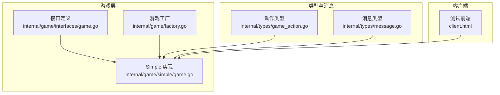
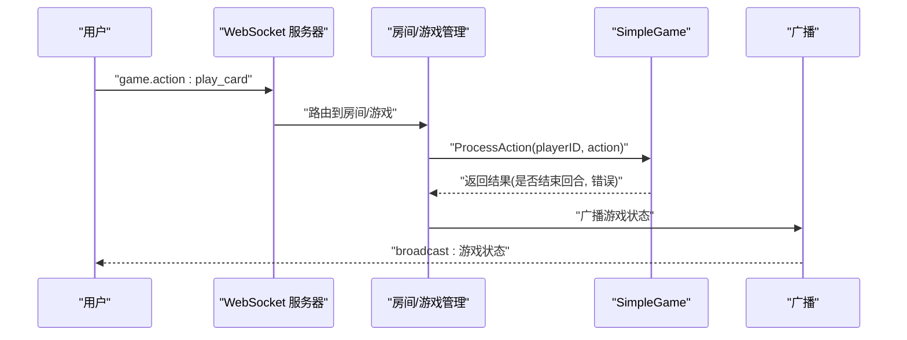
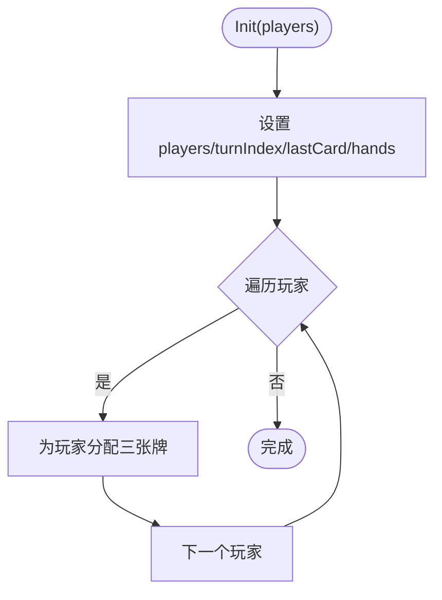
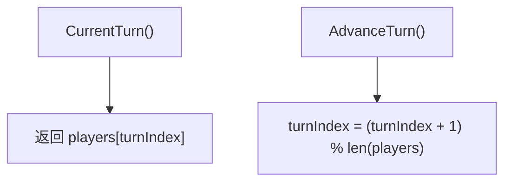
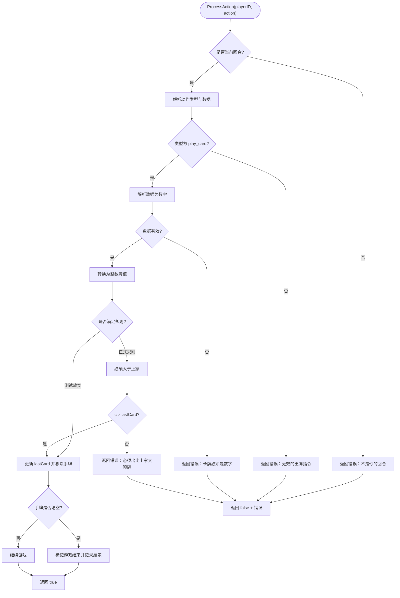
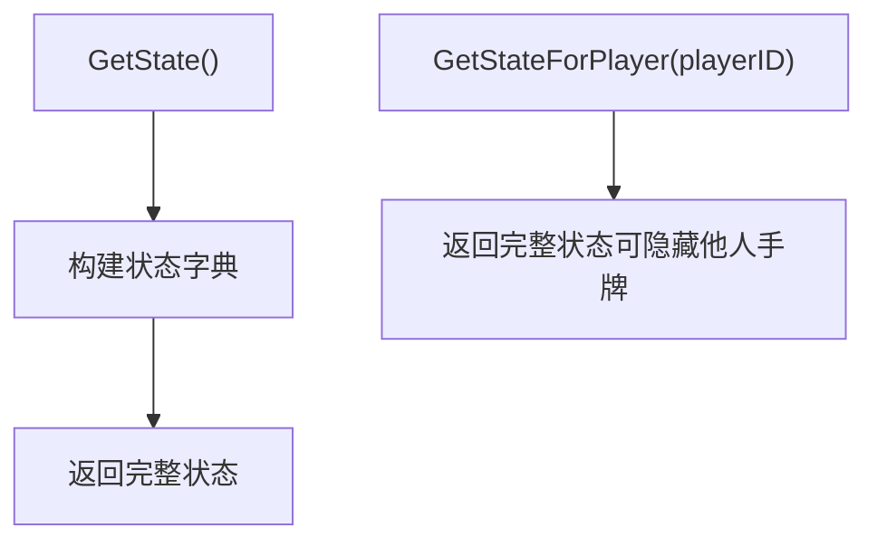

# 简单纸牌游戏 (Simple)

<cite>
**本文引用的文件列表**
- [internal/game/simple/game.go](file://internal/game/simple/game.go)
- [internal/game/interfaces/game.go](file://internal/game/interfaces/game.go)
- [internal/game/factory.go](file://internal/game/factory.go)
- [internal/types/game_action.go](file://internal/types/game_action.go)
- [internal/types/message.go](file://internal/types/message.go)
- [README.md](file://README.md)
- [client.html](file://client.html)
</cite>

## 目录
1. [简介](#简介)
2. [项目结构](#项目结构)
3. [核心组件](#核心组件)
4. [架构总览](#架构总览)
5. [详细组件分析](#详细组件分析)
6. [依赖关系分析](#依赖关系分析)
7. [性能与复杂度](#性能与复杂度)
8. [故障排查指南](#故障排查指南)
9. [结论](#结论)
10. [附录](#附录)

## 简介
简单纸牌游戏（Simple）是一个最小可用的 2 人回合制卡牌对战示例，用于演示房间系统、WebSocket 通信与游戏状态同步。它实现了统一的游戏接口，提供初始化、回合管理、出牌处理、胜负判定以及状态序列化能力。其规则极简：每名玩家初始持有三张牌，按顺序出牌，先打完手牌的玩家获胜；当前实现允许出任意牌（测试期放宽），后续可按正式规则改为必须大于上家。

## 项目结构
- 内部模块
  - internal/game/simple：Simple 游戏实现
  - internal/game/interfaces：游戏接口定义
  - internal/game/factory.go：游戏工厂，按类型创建具体游戏实例
  - internal/types：消息与动作类型定义
- 客户端
  - client.html：简易游戏测试前端，演示如何通过 WebSocket 发送“出牌”动作



图表来源
- [internal/game/simple/game.go](file://internal/game/simple/game.go#L1-L102)
- [internal/game/interfaces/game.go](file://internal/game/interfaces/game.go#L1-L23)
- [internal/game/factory.go](file://internal/game/factory.go#L1-L24)
- [internal/types/game_action.go](file://internal/types/game_action.go#L1-L19)
- [internal/types/message.go](file://internal/types/message.go#L1-L78)
- [client.html](file://client.html#L240-L262)

章节来源
- [README.md](file://README.md#L20-L50)
- [internal/game/simple/game.go](file://internal/game/simple/game.go#L1-L102)
- [internal/game/interfaces/game.go](file://internal/game/interfaces/game.go#L1-L23)
- [internal/game/factory.go](file://internal/game/factory.go#L1-L24)
- [internal/types/game_action.go](file://internal/types/game_action.go#L1-L19)
- [internal/types/message.go](file://internal/types/message.go#L1-L78)
- [client.html](file://client.html#L240-L262)

## 核心组件
- SimpleGame 结构体
  - 字段
    - players：玩家ID数组（长度固定为2）
    - turnIndex：当前回合玩家在数组中的索引
    - lastCard：上一次出牌的牌值
    - hands：玩家ID到手牌切片的映射
    - gameOver：游戏是否结束
    - winner：获胜者ID
  - 方法
    - New()：构造函数
    - ID()/MinPlayers()/MaxPlayers()：游戏标识与人数约束
    - Init()：初始化玩家、手牌与初始状态
    - ProcessAction()：处理出牌动作（回合验证、牌型检查、状态更新）
    - CurrentTurn()/AdvanceTurn()：回合管理
    - GetState()/GetStateForPlayer()：状态序列化
    - IsGameOver()/Winner()：终局查询

章节来源
- [internal/game/simple/game.go](file://internal/game/simple/game.go#L8-L15)
- [internal/game/simple/game.go](file://internal/game/simple/game.go#L17-L19)
- [internal/game/simple/game.go](file://internal/game/simple/game.go#L21-L22)
- [internal/game/simple/game.go](file://internal/game/simple/game.go#L24-L35)
- [internal/game/simple/game.go](file://internal/game/simple/game.go#L37-L65)
- [internal/game/simple/game.go](file://internal/game/simple/game.go#L67-L73)
- [internal/game/simple/game.go](file://internal/game/simple/game.go#L75-L89)
- [internal/game/simple/game.go](file://internal/game/simple/game.go#L91-L92)

## 架构总览
Simple 游戏遵循统一接口设计，通过工厂按字符串类型创建具体游戏实例。客户端通过 WebSocket 发送“game.action”消息，服务器调用对应游戏的 ProcessAction() 处理，并广播状态变化。



图表来源
- [internal/game/factory.go](file://internal/game/factory.go#L12-L23)
- [internal/types/message.go](file://internal/types/message.go#L24-L30)
- [internal/types/game_action.go](file://internal/types/game_action.go#L6-L18)
- [internal/game/simple/game.go](file://internal/game/simple/game.go#L37-L65)
- [client.html](file://client.html#L252-L260)

章节来源
- [internal/game/factory.go](file://internal/game/factory.go#L11-L23)
- [internal/types/message.go](file://internal/types/message.go#L13-L30)
- [internal/types/game_action.go](file://internal/types/game_action.go#L6-L18)
- [internal/game/simple/game.go](file://internal/game/simple/game.go#L37-L65)
- [client.html](file://client.html#L252-L260)

## 详细组件分析

### SimpleGame 结构体与初始化
- 设计要点
  - 使用数组保存玩家顺序，turnIndex 实现循环轮转
  - hands 映射存储每个玩家的手牌，便于 O(n) 删除指定牌
  - lastCard 记录上家出牌，作为后续规则扩展点
- 初始化流程
  - 设置 players、turnIndex、lastCard、hands
  - 为每位玩家分配三张牌：1+i*3, 2+i*3, 3+i*3（保证初始牌互不相同）



图表来源
- [internal/game/simple/game.go](file://internal/game/simple/game.go#L26-L35)

章节来源
- [internal/game/simple/game.go](file://internal/game/simple/game.go#L8-L15)
- [internal/game/simple/game.go](file://internal/game/simple/game.go#L26-L35)

### 回合制管理
- CurrentTurn()
  - 通过 turnIndex 直接取 players 中的当前玩家ID
- AdvanceTurn()
  - 使用模运算实现循环轮转，确保回合在两位玩家间交替



图表来源
- [internal/game/simple/game.go](file://internal/game/simple/game.go#L67-L73)

章节来源
- [internal/game/simple/game.go](file://internal/game/simple/game.go#L67-L73)

### 出牌逻辑与状态更新（ProcessAction）
- 输入校验
  - 验证当前回合玩家ID与调用方一致
  - 校验动作类型为“play_card”
  - 校验数据为数字类型
- 牌型检查（测试期放宽）
  - 当前允许任意出牌（注释中给出正式规则：必须大于上家）
- 状态更新
  - 更新 lastCard 为本次出牌
  - 从玩家手牌中移除该牌
  - 若玩家手牌清空，则标记游戏结束并记录赢家
- 返回值
  - 成功时返回 true；失败返回 false 并携带错误信息



图表来源
- [internal/game/simple/game.go](file://internal/game/simple/game.go#L37-L65)
- [internal/types/game_action.go](file://internal/types/game_action.go#L6-L18)

章节来源
- [internal/game/simple/game.go](file://internal/game/simple/game.go#L37-L65)
- [internal/types/game_action.go](file://internal/types/game_action.go#L6-L18)

### 状态序列化（GetState / GetStateForPlayer）
- GetState()
  - 返回完整游戏状态：玩家列表、当前回合、上家牌、手牌映射、是否结束、赢家
- GetStateForPlayer()
  - 当前直接返回完整状态（可后续优化为隐藏其他玩家手牌）



图表来源
- [internal/game/simple/game.go](file://internal/game/simple/game.go#L75-L89)

章节来源
- [internal/game/simple/game.go](file://internal/game/simple/game.go#L75-L89)

### 游戏规则与测试期临时放宽
- 规则说明（简化版）
  - 2 人对战，每人初始三张牌
  - 按顺序出牌，先打完手牌的玩家获胜
  - 正式规则：每次出牌必须大于上家
- 测试期放宽
  - 当前允许任意出牌，便于快速联调与验证流程
  - 注释提示后续需恢复为“必须大于上家”的校验

章节来源
- [README.md](file://README.md#L113-L118)
- [internal/game/simple/game.go](file://internal/game/simple/game.go#L51-L54)

## 依赖关系分析
- 接口契约
  - SimpleGame 实现 interfaces.Game 接口，确保统一行为
- 工厂模式
  - NewGame 根据字符串类型返回具体游戏实例
- 类型系统
  - GameActionType 提供动作类型常量，与客户端消息类型保持一致
  - Message 类型定义了消息结构，支持“game.action”等消息类型

```mermaid
classDiagram
class Game {
+ID() string
+Init(players []string) error
+ProcessAction(playerID string, action interface{}) (bool, error)
+CurrentTurn() string
+AdvanceTurn()
+GetState() interface{}
+GetStateForPlayer(playerID string) interface{}
+IsGameOver() bool
+Winner() string
+MaxPlayers() int
+MinPlayers() int
}
class SimpleGame {
-players []string
-turnIndex int
-lastCard int
-hands map[string][]int
-gameOver bool
-winner string
+ID() string
+Init(players []string) error
+ProcessAction(playerID string, action interface{}) (bool, error)
+CurrentTurn() string
+AdvanceTurn()
+GetState() interface{}
+GetStateForPlayer(playerID string) interface{}
+IsGameOver() bool
+Winner() string
+MaxPlayers() int
+MinPlayers() int
}
class GameActionType {
<<enumeration>>
+PlayCard
+PlayCards
+Pass
+CallLandlord
+Discard
+Chow
+Pong
+Kong
+Win
}
Game <|.. SimpleGame
GameActionType --> SimpleGame : "动作类型"
```

图表来源
- [internal/game/interfaces/game.go](file://internal/game/interfaces/game.go#L4-L16)
- [internal/game/simple/game.go](file://internal/game/simple/game.go#L8-L15)
- [internal/types/game_action.go](file://internal/types/game_action.go#L4-L18)

章节来源
- [internal/game/interfaces/game.go](file://internal/game/interfaces/game.go#L4-L16)
- [internal/game/simple/game.go](file://internal/game/simple/game.go#L8-L15)
- [internal/types/game_action.go](file://internal/types/game_action.go#L4-L18)

## 性能与复杂度
- 初始化
  - 时间复杂度：O(k)，k 为玩家数量（固定为2）
  - 空间复杂度：O(k*m)，k 为玩家数，m 为每人手牌数（固定为3）
- 出牌处理
  - 时间复杂度：O(m)，m 为玩家手牌数（最坏情况需遍历整个手牌切片删除）
  - 空间复杂度：O(1)（原地修改切片）
- 轮转
  - 时间复杂度：O(1)
- 状态序列化
  - 时间复杂度：O(k*m)，需要复制手牌映射
- 优化建议
  - 手牌删除可用哈希集合或有序结构优化查找与删除
  - 状态序列化可延迟生成或复用对象，减少内存分配
  - GetStateForPlayer 可按需隐藏他人手牌，降低广播负载

[本节为通用性能讨论，无需特定文件来源]

## 故障排查指南
- 常见问题
  - “不是你的回合”：当前玩家ID与 CurrentTurn() 不一致，检查 AdvanceTurn() 是否正确调用
  - “无效的出牌指令”：动作类型非 play_card 或数据格式不符
  - “卡牌必须是数字”：客户端发送的数据类型错误
  - “必须出比上家大的牌”：启用正式规则后触发
- 定位方法
  - 查看 ProcessAction 的输入校验分支
  - 检查客户端发送的“game.action”消息结构
  - 核对工厂 NewGame 的类型映射

章节来源
- [internal/game/simple/game.go](file://internal/game/simple/game.go#L37-L65)
- [internal/types/game_action.go](file://internal/types/game_action.go#L6-L18)
- [client.html](file://client.html#L252-L260)

## 结论
Simple 游戏以极简实现展示了完整的回合制卡牌对战框架：统一接口、工厂创建、消息驱动、状态广播。其核心在于清晰的回合管理与状态更新流程。当前规则为测试期放宽，建议尽快接入正式规则（必须大于上家）。该实现适合快速集成与联调，也可作为扩展更复杂规则的基础模板。

[本节为总结性内容，无需特定文件来源]

## 附录

### 适用场景建议
- 快速联调：验证房间、WebSocket 与广播链路
- 教学示例：展示接口契约与工厂模式
- 规则验证：在测试期放宽规则下验证流程完整性

[本节为通用建议，无需特定文件来源]