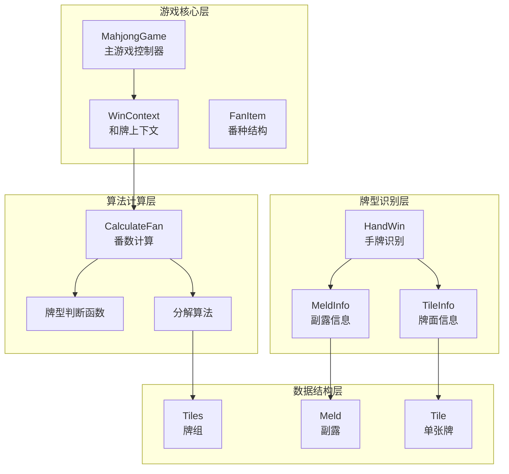
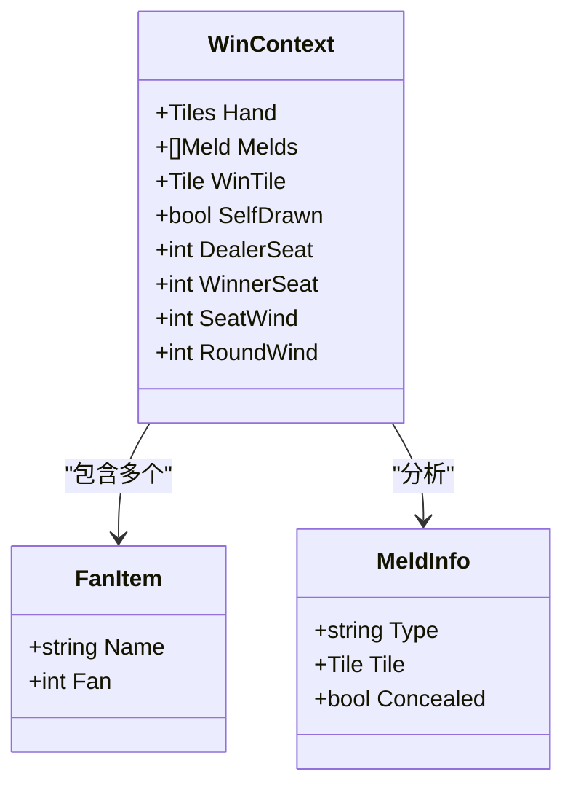
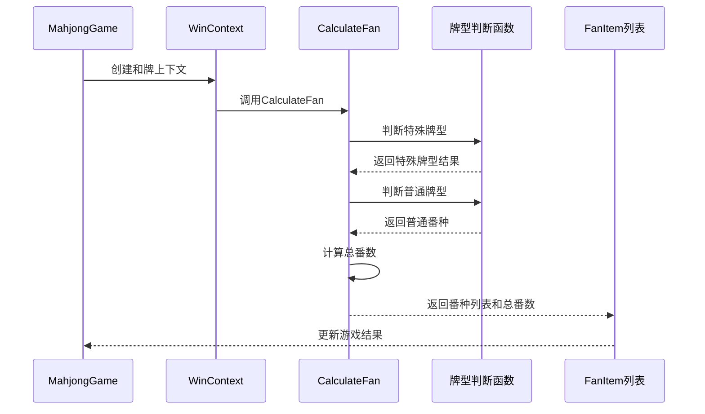
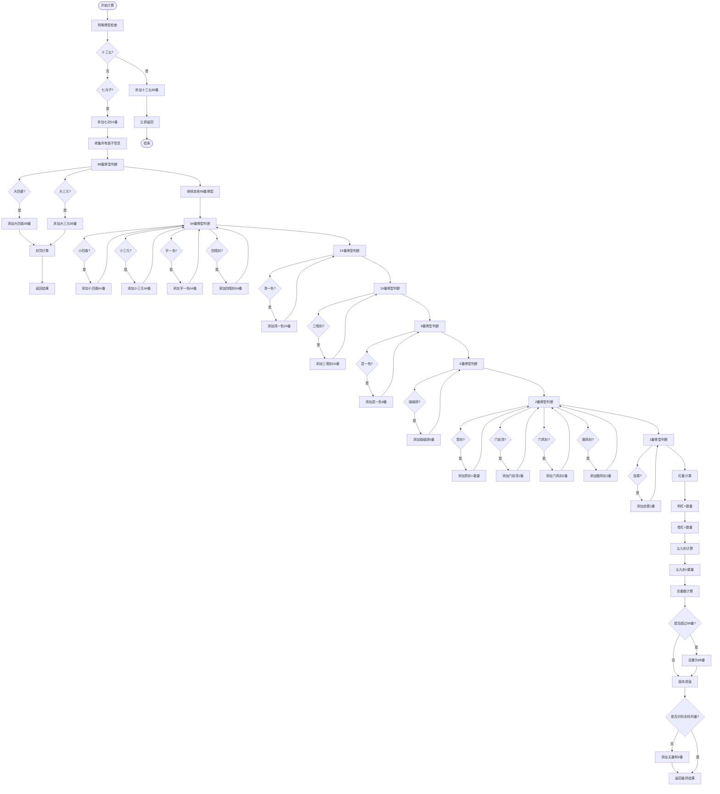
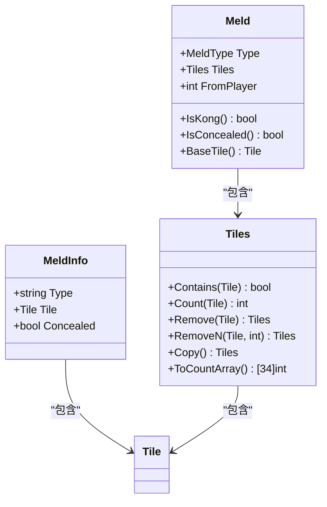
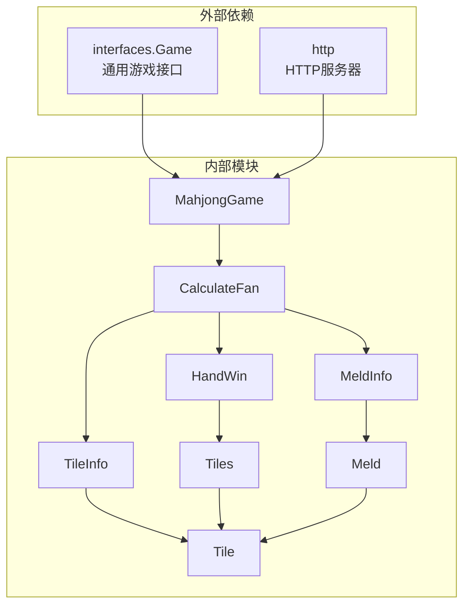

# Fan(番数)计算系统

<cite>
**本文档引用的文件**
- [fan.go](file://internal/game/mahjong/fan.go)
- [game.go](file://internal/game/mahjong/game.go)
- [hand.go](file://internal/game/mahjong/hand.go)
- [tile.go](file://internal/game/mahjong/tile.go)
- [meld.go](file://internal/game/mahjong/meld.go)
- [game_test.go](file://internal/game/mahjong/game_test.go)
- [game.go](file://internal/game/interfaces/game.go)
- [main.go](file://main.go)
</cite>

## 目录
1. [简介](#简介)
2. [项目结构](#项目结构)
3. [核心组件](#核心组件)
4. [架构概览](#架构概览)
5. [详细组件分析](#详细组件分析)
6. [依赖关系分析](#依赖关系分析)
7. [性能考虑](#性能考虑)
8. [故障排除指南](#故障排除指南)
9. [结论](#结论)

## 简介

Fan(番数)计算系统是麻将游戏的核心算法模块，负责计算和牌时的各种番数（得分倍数）。该系统实现了复杂的麻将番数计算规则，包括基本和牌、特殊牌型和复合牌型的计算方法。系统采用模块化设计，将番数计算与游戏逻辑分离，提供了清晰的接口和强大的扩展性。

## 项目结构

麻将游戏系统采用分层架构设计，主要包含以下核心模块：

**图表来源**
- [game.go](file://internal/game/mahjong/game.go#L51-L77)
- [fan.go](file://internal/game/mahjong/fan.go#L3-L19)
- [tile.go](file://internal/game/mahjong/tile.go#L35-L82)

**章节来源**
- [game.go](file://internal/game/mahjong/game.go#L1-L805)
- [fan.go](file://internal/game/mahjong/fan.go#L1-L497)

## 核心组件

### FanItem 结构设计

FanItem 是番数计算系统的核心数据结构，用于表示单个番种及其对应的番数：

**图表来源**
- [fan.go](file://internal/game/mahjong/fan.go#L3-L19)
- [fan.go](file://internal/game/mahjong/fan.go#L123-L128)

FanItem 结构具有以下特点：
- **Name 字段**：番种名称，如"清一色"、"七对"、"自摸"等
- **Fan 字段**：该番种对应的番数倍数
- **不可变性**：番种一旦确定，其名称和番数在计算过程中保持不变

### WinContext 上下文管理

WinContext 提供了番数计算所需的所有环境信息：

| 字段 | 类型 | 描述 | 用途 |
|------|------|------|------|
| Hand | Tiles | 手牌（含胡的那张牌，共14张） | 基础牌型识别 |
| Melds | []Meld | 副露集合 | 面子分析 |
| WinTile | Tile | 胡的那张牌 | 特殊番种判断 |
| SelfDrawn | bool | 是否自摸 | 自摸番种计算 |
| DealerSeat | int | 庄家座位 | 庄家番种判断 |
| WinnerSeat | int | 胡牌者座位 | 门风番种计算 |
| SeatWind | int | 门风（1=东,2=南,3=西,4=北） | 门风刻计算 |
| RoundWind | int | 圈风（1=东,2=南,3=西,4=北） | 圈风刻计算 |

**章节来源**
- [fan.go](file://internal/game/mahjong/fan.go#L9-L19)

## 架构概览

Fan(番数)计算系统采用分层架构，实现了清晰的关注点分离：

**图表来源**
- [game.go](file://internal/game/mahjong/game.go#L221-L232)
- [fan.go](file://internal/game/mahjong/fan.go#L21-L121)

## 详细组件分析

### 番数计算算法

CalculateFan 函数实现了完整的番数计算流程，采用优先级判断策略：

**图表来源**
- [fan.go](file://internal/game/mahjong/fan.go#L21-L121)

### 特殊牌型识别算法

系统实现了多种特殊牌型的识别算法：

#### 十三幺识别算法
十三幺要求手牌包含1/9万条筒各一张，以及东南西北中发白各一张，其中一张作为对子。

#### 七对子识别算法
七对子要求14张手牌形成7个对子，每个对子两张相同的牌。

#### 标准和牌识别算法
标准和牌采用递归分解算法，通过深度优先搜索找到有效的面子组合。

**章节来源**
- [hand.go](file://internal/game/mahjong/hand.go#L107-L147)
- [hand.go](file://internal/game/mahjong/hand.go#L16-L25)

### 面子分析系统

collectAllMelds 函数负责将手牌和副露分解为统一的面子信息：

**图表来源**
- [fan.go](file://internal/game/mahjong/fan.go#L123-L155)
- [meld.go](file://internal/game/mahjong/meld.go#L16-L46)
- [tile.go](file://internal/game/mahjong/tile.go#L135-L213)

**章节来源**
- [fan.go](file://internal/game/mahjong/fan.go#L130-L155)

### 番数累加机制

系统实现了灵活的番数累加机制，支持多番种叠加：

| 番数等级 | 番数倍数 | 牌型示例 | 计算规则 |
|----------|----------|----------|----------|
| 88番 | 88 | 大四喜、大三元 | 优先级最高，立即封顶 |
| 64番 | 64 | 小四喜、小三元、字一色、四暗刻 | 与其他64番叠加 |
| 24番 | 24 | 清一色 | 与其他番种叠加 |
| 16番 | 16 | 三暗刻 | 与其他番种叠加 |
| 8番 | 8 | 混一色 | 与其他番种叠加 |
| 6番 | 6 | 碰碰胡 | 与其他番种叠加 |
| 2番 | 2 | 箭刻、门前清、门风刻、圈风刻 | 可重复计算 |
| 1番 | 1 | 自摸、明杠、暗杠、幺九刻 | 可重复计算 |

**章节来源**
- [fan.go](file://internal/game/mahjong/fan.go#L486-L496)

## 依赖关系分析

### 核心依赖图

**图表来源**
- [game.go](file://internal/game/mahjong/game.go#L1-L25)
- [fan.go](file://internal/game/mahjong/fan.go#L1-L10)
- [tile.go](file://internal/game/mahjong/tile.go#L1-L10)

### 数据结构依赖关系

系统的核心数据结构形成了清晰的层次关系：

1. **基础数据类型**：Tile → Tiles → Meld
2. **业务数据类型**：WinContext → FanItem → MeldInfo
3. **算法依赖**：HandWin → TileInfo → Tiles

**章节来源**
- [tile.go](file://internal/game/mahjong/tile.go#L35-L82)
- [meld.go](file://internal/game/mahjong/meld.go#L16-L46)

## 性能考虑

### 时间复杂度分析

1. **番数计算复杂度**：O(n)，其中n为番种数量
2. **牌型识别复杂度**：标准和牌为O(3^m)，其中m为牌张数
3. **特殊牌型识别**：O(1)到O(m)

### 空间复杂度优化

1. **计数数组优化**：使用固定大小的34元素数组进行牌张统计
2. **递归深度控制**：通过早期返回减少不必要的递归
3. **内存复用**：重用中间计算结果，避免重复分配

### 缓存策略建议

虽然当前实现未包含缓存机制，但可以考虑以下优化：

1. **牌型识别缓存**：缓存已识别的牌型结果
2. **番数计算缓存**：缓存相同上下文下的番数计算结果
3. **递归结果缓存**：缓存递归过程中的中间结果

## 故障排除指南

### 常见问题诊断

#### 番数计算错误
- **症状**：计算结果与预期不符
- **原因**：番种判断顺序错误或条件判断失误
- **解决方案**：检查番种判断函数的逻辑顺序

#### 牌型识别失败
- **症状**：CanWin返回false但实际可以和牌
- **原因**：递归分解算法存在边界条件
- **解决方案**：检查canDecompose和canDecomposeMelds函数

#### 上下文数据错误
- **症状**：WinContext字段值不正确
- **原因**：游戏状态更新时机错误
- **解决方案**：检查MahjongGame中WinContext的创建和更新逻辑

**章节来源**
- [game.go](file://internal/game/mahjong/game.go#L221-L249)
- [game.go](file://internal/game/mahjong/game.go#L390-L432)

### 错误处理机制

系统实现了多层次的错误处理：

1. **输入验证**：对玩家输入和牌数据进行严格验证
2. **状态检查**：确保游戏处于正确的阶段
3. **逻辑校验**：验证和牌条件的合理性
4. **异常捕获**：通过返回错误信息指导客户端处理

**章节来源**
- [game.go](file://internal/game/mahjong/game.go#L143-L161)
- [game.go](file://internal/game/mahjong/game.go#L390-L432)

## 结论

Fan(番数)计算系统展现了优秀的软件工程实践，通过模块化设计、清晰的数据结构和完善的算法实现，成功地将复杂的麻将番数计算逻辑封装在一个易于维护和扩展的系统中。

### 主要优势

1. **清晰的架构设计**：分层架构使得各模块职责明确，便于维护
2. **完整的功能覆盖**：实现了主流麻将番数规则的完整实现
3. **良好的扩展性**：模块化设计为未来功能扩展提供了便利
4. **严格的错误处理**：完善的错误处理机制保证了系统的稳定性

### 改进建议

1. **性能优化**：考虑添加缓存机制以提升计算性能
2. **测试覆盖**：增加更多的单元测试用例
3. **文档完善**：为复杂的算法添加详细的注释说明
4. **配置化**：将番数规则参数化，便于适应不同的麻将规则

该系统为麻将游戏的核心功能提供了坚实的技术基础，为后续的功能扩展和性能优化奠定了良好的基础。