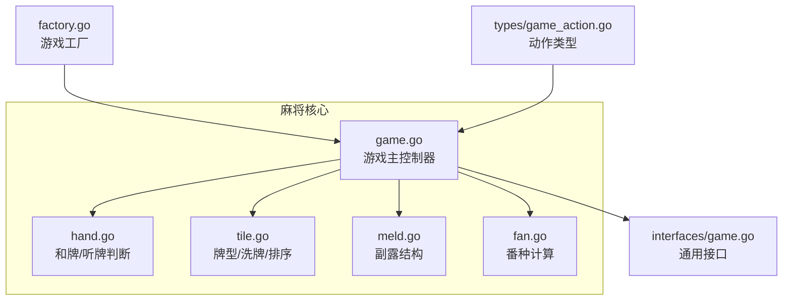
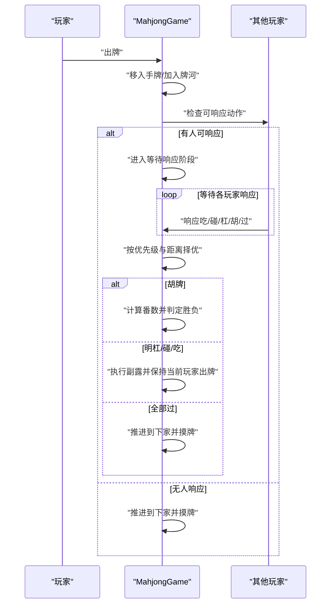
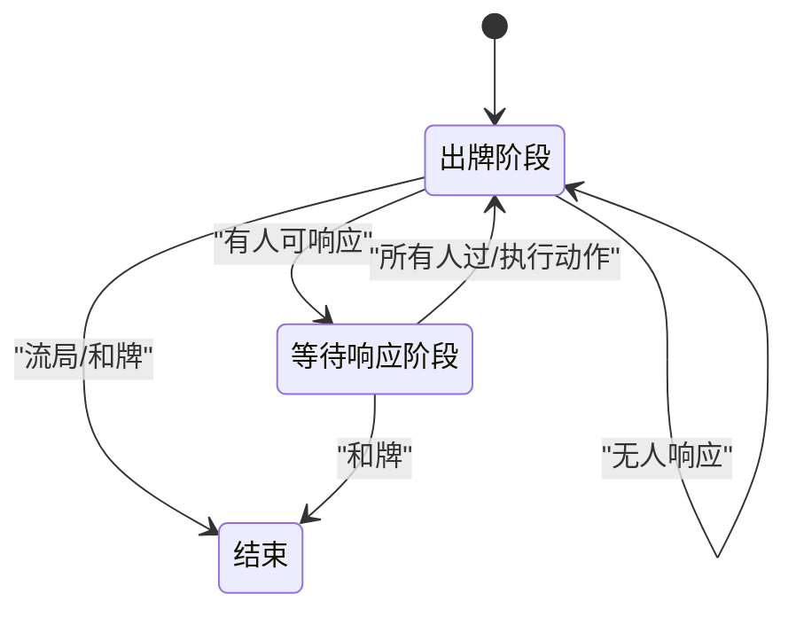
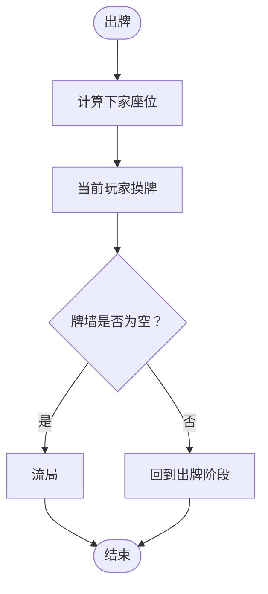
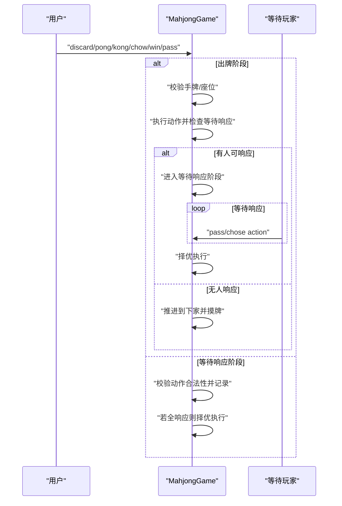
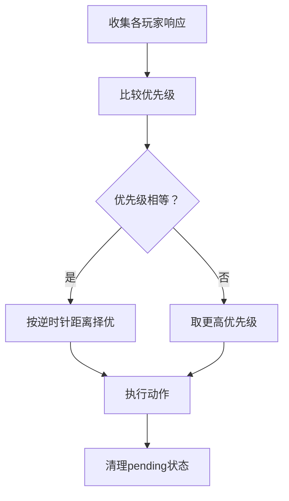
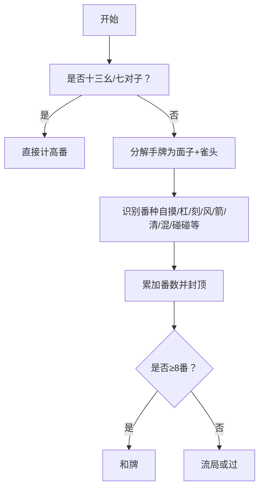
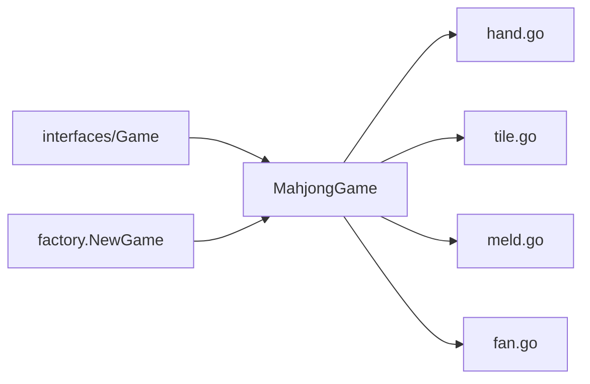

# Game核心逻辑

<cite>
**本文档引用的文件**
- [internal/game/mahjong/game.go](file://internal/game/mahjong/game.go)
- [internal/game/mahjong/hand.go](file://internal/game/mahjong/hand.go)
- [internal/game/mahjong/tile.go](file://internal/game/mahjong/tile.go)
- [internal/game/mahjong/meld.go](file://internal/game/mahjong/meld.go)
- [internal/game/mahjong/fan.go](file://internal/game/mahjong/fan.go)
- [internal/game/interfaces/game.go](file://internal/game/interfaces/game.go)
- [internal/types/game_action.go](file://internal/types/game_action.go)
- [internal/game/factory.go](file://internal/game/factory.go)
- [internal/game/mahjong/game_test.go](file://internal/game/mahjong/game_test.go)
</cite>

## 目录
1. [简介](#简介)
2. [项目结构](#项目结构)
3. [核心组件](#核心组件)
4. [架构概览](#架构概览)
5. [详细组件分析](#详细组件分析)
6. [依赖关系分析](#依赖关系分析)
7. [性能考量](#性能考量)
8. [故障排查指南](#故障排查指南)
9. [结论](#结论)
10. [附录](#附录)

## 简介
本文件面向麻将游戏的核心逻辑，系统性梳理了游戏状态机、座位系统、动作处理流程、等待响应阶段的决策机制、和牌判断与番数计算、流局处理、胜负判定以及性能优化与并发安全建议。文档同时提供可视化图示帮助理解代码结构与交互流程，适合开发者与产品/运营人员快速掌握系统设计与实现细节。

## 项目结构
麻将模块位于 internal/game/mahjong 目录，采用“功能域”组织方式：
- game.go：游戏主控制器，负责状态机、动作处理、阶段切换、状态查询
- hand.go：和牌判断与听牌分析（标准胡、七对子、十三幺、吃碰杠辅助能力）
- tile.go：牌型定义、洗牌发牌、排序与序列化
- meld.go：副露（吃/碰/杠）数据结构与序列化
- fan.go：番种计算与和牌上下文
- interfaces/game.go：游戏通用接口定义
- types/game_action.go：动作类型常量
- factory.go：游戏工厂，支持多游戏类型
- game_test.go：单元测试覆盖牌型、番种与基本流程



图表来源
- [internal/game/mahjong/game.go](file://internal/game/mahjong/game.go#L1-L805)
- [internal/game/mahjong/hand.go](file://internal/game/mahjong/hand.go#L1-L245)
- [internal/game/mahjong/tile.go](file://internal/game/mahjong/tile.go#L1-L241)
- [internal/game/mahjong/meld.go](file://internal/game/mahjong/meld.go#L1-L65)
- [internal/game/mahjong/fan.go](file://internal/game/mahjong/fan.go#L1-L497)
- [internal/game/interfaces/game.go](file://internal/game/interfaces/game.go#L1-L23)
- [internal/types/game_action.go](file://internal/types/game_action.go#L1-L19)
- [internal/game/factory.go](file://internal/game/factory.go#L1-L24)

章节来源
- [internal/game/mahjong/game.go](file://internal/game/mahjong/game.go#L1-L805)
- [internal/game/mahjong/hand.go](file://internal/game/mahjong/hand.go#L1-L245)
- [internal/game/mahjong/tile.go](file://internal/game/mahjong/tile.go#L1-L241)
- [internal/game/mahjong/meld.go](file://internal/game/mahjong/meld.go#L1-L65)
- [internal/game/mahjong/fan.go](file://internal/game/mahjong/fan.go#L1-L497)
- [internal/game/interfaces/game.go](file://internal/game/interfaces/game.go#L1-L23)
- [internal/types/game_action.go](file://internal/types/game_action.go#L1-L19)
- [internal/game/factory.go](file://internal/game/factory.go#L1-L24)

## 核心组件
- 游戏主控制器 MahjongGame：维护玩家、座位、手牌、副露、牌河、牌墙、当前阶段、最后出牌、等待响应等状态；提供初始化、动作处理、状态查询、推进回合等能力
- 牌系统 Tiles/Tile：统一的牌表示、排序、计数、序列化与解析
- 副露系统 Meld：记录吃/碰/明杠/暗杠/补杠及其来源
- 和牌系统 Hand：标准胡牌、七对子、十三幺判断，以及听牌列表生成
- 番种系统 Fan：基于 WinContext 的番种识别与总番计算
- 通用接口 Game：统一的接口契约，便于扩展其他游戏类型

章节来源
- [internal/game/mahjong/game.go](file://internal/game/mahjong/game.go#L51-L77)
- [internal/game/mahjong/tile.go](file://internal/game/mahjong/tile.go#L35-L133)
- [internal/game/mahjong/meld.go](file://internal/game/mahjong/meld.go#L16-L64)
- [internal/game/mahjong/hand.go](file://internal/game/mahjong/hand.go#L3-L244)
- [internal/game/mahjong/fan.go](file://internal/game/mahjong/fan.go#L3-L121)
- [internal/game/interfaces/game.go](file://internal/game/interfaces/game.go#L3-L16)

## 架构概览
麻将游戏遵循“状态机 + 动作处理 + 决策机制”的架构模式：
- 阶段驱动：PhasePlay（出牌阶段）与 PhasePending（等待响应阶段）在出牌后根据其他玩家可否响应而切换
- 座位驱动：庄家固定，轮流出牌；下家可吃，响应按逆时针距离优先
- 动作优先级：胡 > 杠 > 碰 > 吃 > 过
- 番数约束：自摸胡需≥8番，点炮胡同样要求≥8番（若不足则按过处理）



图表来源
- [internal/game/mahjong/game.go](file://internal/game/mahjong/game.go#L165-L388)
- [internal/game/mahjong/hand.go](file://internal/game/mahjong/hand.go#L168-L244)

章节来源
- [internal/game/mahjong/game.go](file://internal/game/mahjong/game.go#L11-L34)
- [internal/game/mahjong/game.go](file://internal/game/mahjong/game.go#L165-L388)

## 详细组件分析

### 游戏状态机与阶段切换
- 阶段常量：PhasePlay（出牌）、PhasePending（等待响应）
- 切换规则：
  - 出牌阶段：仅允许出牌、自摸胡、暗杠/补杠
  - 出牌后检查其他玩家是否可响应（胡/杠/碰/吃），若有则进入等待响应阶段，否则推进到下家并摸牌
  - 等待响应阶段：记录各玩家响应，按优先级与距离择优，执行对应动作或推进到下家



图表来源
- [internal/game/mahjong/game.go](file://internal/game/mahjong/game.go#L12-L34)
- [internal/game/mahjong/game.go](file://internal/game/mahjong/game.go#L202-L213)
- [internal/game/mahjong/game.go](file://internal/game/mahjong/game.go#L340-L388)

章节来源
- [internal/game/mahjong/game.go](file://internal/game/mahjong/game.go#L12-L34)
- [internal/game/mahjong/game.go](file://internal/game/mahjong/game.go#L165-L213)
- [internal/game/mahjong/game.go](file://internal/game/mahjong/game.go#L293-L388)

### 座位系统与轮流出牌
- 座位映射：玩家ID到座位号的映射，初始按玩家顺序分配
- 庄家：固定座位0
- 轮流出牌：出牌后推进到上家（逆时针）；若无人响应，推进到下家并摸牌
- 下家吃牌限制：仅下家可吃上家打出的牌



图表来源
- [internal/game/mahjong/game.go](file://internal/game/mahjong/game.go#L569-L614)
- [internal/game/mahjong/game.go](file://internal/game/mahjong/game.go#L604-L614)

章节来源
- [internal/game/mahjong/game.go](file://internal/game/mahjong/game.go#L52-L108)
- [internal/game/mahjong/game.go](file://internal/game/mahjong/game.go#L569-L614)

### 动作处理流程
- 出牌阶段动作：
  - 出牌：验证手牌存在性，移除并加入牌河，触发等待响应检查
  - 自摸胡：检查和牌条件与番数（≥8番），记录胜者与番数
  - 暗杠/补杠：验证牌数与位置，执行杠并摸一张牌
- 等待响应阶段动作：
  - 验证操作合法性（仅允许pass或在可选范围内）
  - 记录响应，当所有玩家都响应后择优执行
  - 胡牌：将牌加入手牌进行判断，≥8番则和牌，否则按过处理
  - 明杠：移除3张牌，记录副露，摸一张牌，当前玩家继续出牌
  - 碰/吃：移除相应牌，记录副露，当前玩家继续出牌



图表来源
- [internal/game/mahjong/game.go](file://internal/game/mahjong/game.go#L142-L161)
- [internal/game/mahjong/game.go](file://internal/game/mahjong/game.go#L165-L388)

章节来源
- [internal/game/mahjong/game.go](file://internal/game/mahjong/game.go#L142-L161)
- [internal/game/mahjong/game.go](file://internal/game/mahjong/game.go#L165-L388)

### 等待响应阶段的决策机制
- 优先级：胡 > 杠 > 碰 > 吃 > 过
- 距离计算：按逆时针计算到出牌者的距离，同优先级时距离更近者优先
- 响应收集：记录每个玩家的选择，直到全部响应完成



图表来源
- [internal/game/mahjong/game.go](file://internal/game/mahjong/game.go#L340-L388)
- [internal/game/mahjong/game.go](file://internal/game/mahjong/game.go#L611-L614)

章节来源
- [internal/game/mahjong/game.go](file://internal/game/mahjong/game.go#L27-L34)
- [internal/game/mahjong/game.go](file://internal/game/mahjong/game.go#L340-L388)
- [internal/game/mahjong/game.go](file://internal/game/mahjong/game.go#L611-L614)

### 和牌判断与番数计算
- 和牌条件：
  - 标准胡：4面子+1雀头（3n+2张）
  - 七对子：14张7个对子
  - 十三幺：1/9万条筒+东南西北中发白各1张，其中1张做对子
- 番种计算：
  - 优先识别高番牌型（如十三幺、七对等）
  - 其他番种按组合累加，上限封顶88番
  - 自摸、门风刻、圈风刻、箭刻、明/暗杠、幺九刻、清一色、混一色、碰碰胡等
- 胡牌门槛：≥8番（自摸/点炮均同）



图表来源
- [internal/game/mahjong/hand.go](file://internal/game/mahjong/hand.go#L3-L147)
- [internal/game/mahjong/fan.go](file://internal/game/mahjong/fan.go#L21-L121)
- [internal/game/mahjong/game.go](file://internal/game/mahjong/game.go#L216-L249)
- [internal/game/mahjong/game.go](file://internal/game/mahjong/game.go#L390-L432)

章节来源
- [internal/game/mahjong/hand.go](file://internal/game/mahjong/hand.go#L3-L147)
- [internal/game/mahjong/fan.go](file://internal/game/mahjong/fan.go#L21-L121)
- [internal/game/mahjong/game.go](file://internal/game/mahjong/game.go#L216-L249)
- [internal/game/mahjong/game.go](file://internal/game/mahjong/game.go#L390-L432)

### 流局处理机制
- 触发条件：牌墙耗尽且无人和牌
- 结束标志：gameOver=true，winner="流局"

章节来源
- [internal/game/mahjong/game.go](file://internal/game/mahjong/game.go#L604-L614)

### 胜负判定与结束条件
- 自摸和牌：≥8番，记录赢家与番数
- 点炮和牌：≥8番，记录赢家与点炮者
- 流局：牌墙耗尽且无人和牌
- 结束：任一和牌或流局发生

章节来源
- [internal/game/mahjong/game.go](file://internal/game/mahjong/game.go#L216-L249)
- [internal/game/mahjong/game.go](file://internal/game/mahjong/game.go#L390-L432)
- [internal/game/mahjong/game.go](file://internal/game/mahjong/game.go#L604-L614)

### 游戏状态查询接口
- GetState：返回全局状态（阶段、当前玩家、庄家、牌墙剩余、玩家信息、最后出牌、胜负信息）
- GetStateForPlayer：在全局状态基础上补充手牌、可用操作、吃牌可选组合、杠牌可选组合等私密信息

```mermaid
classDiagram
class MahjongGame {
+GetState() interface{}
+GetStateForPlayer(playerID) interface{}
-getAvailableActions(seat) []string
}
class State {
+phase
+current_seat
+dealer_seat
+wall_remaining
+players
+last_discard
+win_result
+game_over
+winner
}
MahjongGame --> State : "构造"
```

图表来源
- [internal/game/mahjong/game.go](file://internal/game/mahjong/game.go#L655-L755)

章节来源
- [internal/game/mahjong/game.go](file://internal/game/mahjong/game.go#L655-L755)

### 数据模型与类关系
```mermaid
classDiagram
class Tile {
+Suit suit
+int rank
+String() string
+Equal(other) bool
+Less(other) bool
+IsHonor() bool
+ToIndex() int
+ToMap() map
}
class Tiles {
+Len() int
+Contains(t) bool
+Count(t) int
+Remove(t) Tiles
+RemoveN(t,n) Tiles
+Copy() Tiles
+ToMaps() []map
+ToCountArray() [34]int
}
class Meld {
+MeldType Type
+Tiles Tiles
+int FromPlayer
+IsKong() bool
+IsConcealed() bool
+BaseTile() Tile
+ToMap() map
}
class MahjongGame {
+players []string
+hands [4]Tiles
+melds [4][]Meld
+discards [4]Tiles
+wall Tiles
+dealerSeat int
+currentSeat int
+phase string
+lastDiscard *Tile
+lastDiscardSeat int
+pendingActions map[int][]string
+pendingResponses map[int]*PendingResponse
+pendingChowData map[int]interface{}
+gameOver bool
+winner string
+winResult *WinResult
}
Tiles --> Tile : "组成"
MahjongGame --> Tiles : "持有"
MahjongGame --> Meld : "副露"
```

图表来源
- [internal/game/mahjong/tile.go](file://internal/game/mahjong/tile.go#L35-L133)
- [internal/game/mahjong/meld.go](file://internal/game/mahjong/meld.go#L16-L64)
- [internal/game/mahjong/game.go](file://internal/game/mahjong/game.go#L51-L77)

章节来源
- [internal/game/mahjong/tile.go](file://internal/game/mahjong/tile.go#L35-L133)
- [internal/game/mahjong/meld.go](file://internal/game/mahjong/meld.go#L16-L64)
- [internal/game/mahjong/game.go](file://internal/game/mahjong/game.go#L51-L77)

## 依赖关系分析
- MahjongGame 依赖 hand.go（和牌判断）、tile.go（牌型/洗牌/排序）、meld.go（副露）、fan.go（番数）
- 接口层 interfaces/game.go 提供统一契约，便于扩展其他游戏类型
- factory.go 通过 NewGame 支持 simple/ddz/mahjong 三种类型



图表来源
- [internal/game/mahjong/game.go](file://internal/game/mahjong/game.go#L1-L10)
- [internal/game/interfaces/game.go](file://internal/game/interfaces/game.go#L3-L16)
- [internal/game/factory.go](file://internal/game/factory.go#L11-L23)

章节来源
- [internal/game/mahjong/game.go](file://internal/game/mahjong/game.go#L1-L10)
- [internal/game/interfaces/game.go](file://internal/game/interfaces/game.go#L3-L16)
- [internal/game/factory.go](file://internal/game/factory.go#L11-L23)

## 性能考量
- 时间复杂度
  - 和牌判断：标准胡牌使用递归分解，最坏情况下随牌数指数增长，但实际麻将手牌规模有限（14张），可接受
  - 听牌列表：遍历34种牌逐一尝试，复杂度O(34×C)，C为手牌长度，整体仍可控
  - 番种计算：按固定顺序识别，复杂度线性于副露与手牌数量
- 空间复杂度
  - Tiles 使用计数数组与排序，空间开销与牌数线性相关
  - pending 状态使用哈希表存储，最大4个玩家，空间常数级
- 优化建议
  - 缓存中间结果：如 CanWin/CanChow/CanPong/CanKong 的结果可缓存避免重复计算
  - 并发安全：当前实现未显式加锁，若引入并发需确保状态访问互斥
  - 日志与调试：保留关键路径日志以便定位性能瓶颈

[本节为通用性能讨论，无需具体文件引用]

## 故障排查指南
- 常见错误与定位
  - 非当前回合出牌：检查 currentSeat 与玩家座位映射
  - 手牌不存在：确认出牌是否来自当前玩家手牌
  - 吃牌非法：验证是否为下家、是否为顺子、手牌是否包含所需牌
  - 胡牌番数不足：检查番种识别与封顶逻辑
  - 牌墙耗尽：确认流局分支是否正确执行
- 单元测试参考
  - 牌型与解析：NewDeck、ParseTile、Tiles 操作
  - 和牌与听牌：IsStandardWin、IsSevenPairs、IsThirteenOrphans、GetWaitingTiles
  - 番种：CalculateFan（清一色、七对等）
  - 基本流程：Init、Discard、GetStateForPlayer、完整流程模拟

章节来源
- [internal/game/mahjong/game_test.go](file://internal/game/mahjong/game_test.go#L11-L438)

## 结论
本麻将核心逻辑以清晰的状态机与动作处理为基础，结合严格的座位与距离优先级机制，实现了标准的麻将对局流程。和牌判断与番种计算覆盖主流牌型，流局与胜负判定逻辑完备。建议在并发场景下加强状态保护，并通过缓存与日志进一步提升性能与可观测性。

[本节为总结性内容，无需具体文件引用]

## 附录
- 动作类型与优先级
  - 出牌阶段：discard、win、kong
  - 等待响应阶段：chow、pong、kong、win、pass
  - 优先级：win > kong > pong > chow > pass
- 关键接口
  - Init、ProcessAction、CurrentTurn、AdvanceTurn、GetState、GetStateForPlayer、IsGameOver、Winner、MaxPlayers、MinPlayers

章节来源
- [internal/types/game_action.go](file://internal/types/game_action.go#L12-L18)
- [internal/game/interfaces/game.go](file://internal/game/interfaces/game.go#L3-L16)
- [internal/game/mahjong/game.go](file://internal/game/mahjong/game.go#L27-L34)