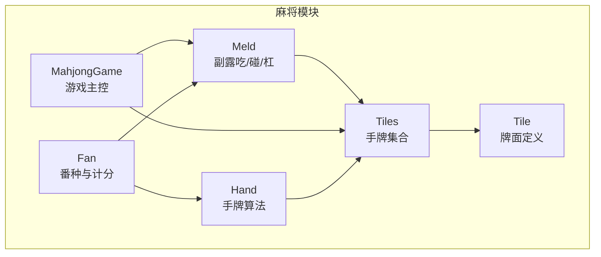
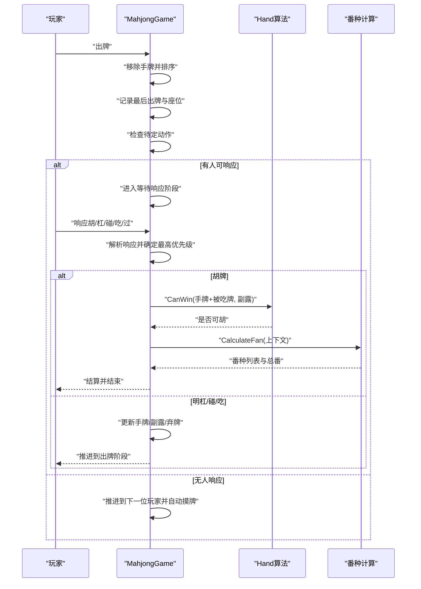
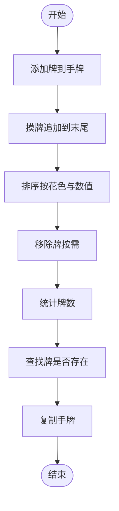
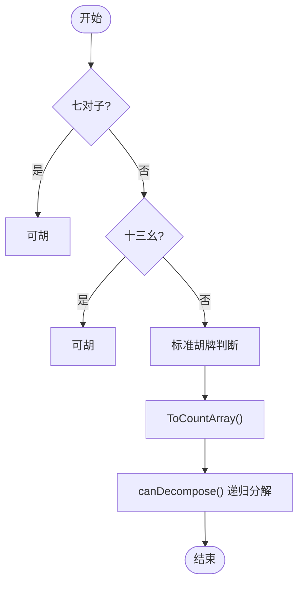
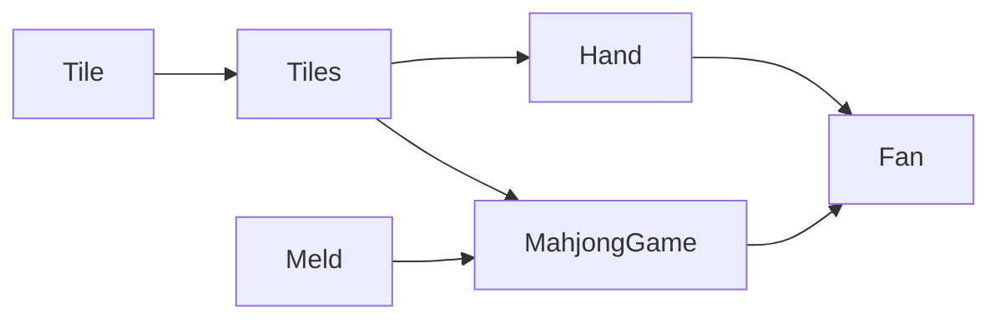

# Hand(手牌)管理

<cite>
**本文引用的文件**
- [tile.go](file://internal/game/mahjong/tile.go)
- [hand.go](file://internal/game/mahjong/hand.go)
- [meld.go](file://internal/game/mahjong/meld.go)
- [game.go](file://internal/game/mahjong/game.go)
- [fan.go](file://internal/game/mahjong/fan.go)
- [game_test.go](file://internal/game/mahjong/game_test.go)
</cite>

## 目录
1. [简介](#简介)
2. [项目结构](#项目结构)
3. [核心组件](#核心组件)
4. [架构概览](#架构概览)
5. [详细组件分析](#详细组件分析)
6. [依赖关系分析](#依赖关系分析)
7. [性能考虑](#性能考虑)
8. [故障排查指南](#故障排查指南)
9. [结论](#结论)
10. [附录](#附录)

## 简介
本文件系统性梳理麻将游戏中“手牌”管理模块的设计与实现，覆盖数据结构、操作算法、排序与查找机制、复制与比较、序列化与反序列化、以及在游戏流程中的使用场景（摸牌、出牌、组合分析）。文档同时提供性能优化建议与内存管理策略，帮助开发者在保证正确性的前提下提升运行效率。

## 项目结构
手牌管理位于麻将游戏模块内部，围绕 Tiles 类型展开，配合 Tile、Meld、MahjongGame、Fan 等类型共同构成完整的麻将逻辑体系。



图表来源
- [tile.go](file://internal/game/mahjong/tile.go#L35-L140)
- [hand.go](file://internal/game/mahjong/hand.go#L1-L245)
- [meld.go](file://internal/game/mahjong/meld.go#L16-L65)
- [game.go](file://internal/game/mahjong/game.go#L51-L132)
- [fan.go](file://internal/game/mahjong/fan.go#L9-L121)

章节来源
- [tile.go](file://internal/game/mahjong/tile.go#L1-L241)
- [hand.go](file://internal/game/mahjong/hand.go#L1-L245)
- [meld.go](file://internal/game/mahjong/meld.go#L1-L65)
- [game.go](file://internal/game/mahjong/game.go#L1-L805)
- [fan.go](file://internal/game/mahjong/fan.go#L1-L497)

## 核心组件
- Tiles：手牌集合，基于切片实现，具备排序、查找、统计、移除、复制等能力，并提供 ToCountArray 便于组合分析。
- Tile：单张牌，包含花色与数值，提供字符串化、相等比较、大小比较、索引转换、JSON序列化与解析等。
- Meld：副露结构，记录类型（吃/碰/明杠/暗杠/补杠）、所含牌、来源玩家等。
- MahjongGame：游戏主控制器，维护各玩家手牌、副露、弃牌、牌墙、当前阶段与待定动作，负责摸牌、出牌、响应处理与状态导出。
- Hand算法：围绕手牌集合提供胡牌判断、听牌分析、吃/碰/杠可行性判断等。
- Fan：番种计算，结合手牌与副露分解结果，计算番数与封顶。

章节来源
- [tile.go](file://internal/game/mahjong/tile.go#L35-L241)
- [hand.go](file://internal/game/mahjong/hand.go#L1-L245)
- [meld.go](file://internal/game/mahjong/meld.go#L16-L65)
- [game.go](file://internal/game/mahjong/game.go#L51-L805)
- [fan.go](file://internal/game/mahjong/fan.go#L9-L497)

## 架构概览
手牌管理贯穿游戏生命周期：
- 初始化：创建136张牌，洗牌，按庄家14张、闲家13张发牌，随后排序。
- 出牌阶段：玩家出牌，系统检测其他玩家是否可胡/杠/碰/吃，进入等待响应阶段。
- 响应阶段：按优先级与座位距离确定最优响应，执行对应动作（胡/杠/碰/吃）。
- 胡牌判定：综合标准胡牌、七对子、十三幺等规则，结合番种计算决定胜负。



图表来源
- [game.go](file://internal/game/mahjong/game.go#L182-L214)
- [game.go](file://internal/game/mahjong/game.go#L293-L388)
- [hand.go](file://internal/game/mahjong/hand.go#L6-L14)
- [fan.go](file://internal/game/mahjong/fan.go#L21-L121)

## 详细组件分析

### 数据结构设计：Tile 与 Tiles
- Tile
  - 字段：花色（万/条/筒/字）、数值（1-9或1-7）。
  - 方法：字符串化、相等比较、小于比较、是否字牌/老头牌/幺九牌/风牌/箭牌、索引转换、JSON映射与解析。
  - 设计要点：通过 ToIndex 将花色与数值映射到0-33的唯一索引，便于计数数组快速统计。
- Tiles
  - 定义：[]Tile 的别名，实现 sort.Interface，支持按花色与数值排序。
  - 方法：Contains、Count、Remove、RemoveN、Copy、ToMaps、ToCountArray、NewDeck、ShuffleDeck、SortTiles。
  - 设计要点：排序基于 Tile.Less；统计使用 ToCountArray 将手牌压缩为34维计数数组，便于组合分析与规则判断。

```mermaid
classDiagram
class Tile {
+Suit suit
+int rank
+String() string
+Equal(other Tile) bool
+Less(other Tile) bool
+IsHonor() bool
+IsTerminal() bool
+IsTerminalOrHonor() bool
+IsWind() bool
+IsDragon() bool
+ToIndex() int
+ToMap() map[string]interface{}
}
class Tiles {
+Len() int
+Swap(i, j) void
+Less(i, j) bool
+Contains(t Tile) bool
+Count(t Tile) int
+Remove(t Tile) Tiles
+RemoveN(t Tile, n int) Tiles
+Copy() Tiles
+ToMaps() []map[string]interface{}
+ToCountArray() [34]int
+NewDeck() Tiles
+ShuffleDeck(deck Tiles) void
+SortTiles(tiles Tiles) void
}
Tiles --> Tile : "包含"
```

图表来源
- [tile.go](file://internal/game/mahjong/tile.go#L35-L241)

章节来源
- [tile.go](file://internal/game/mahjong/tile.go#L35-L241)

### 手牌操作算法
- 添加牌：通过追加到 Tiles 切片实现，通常在摸牌后进行排序以便显示与分析。
- 移除牌：Remove 移除一张，RemoveN 移除 N 张，均返回新切片，保持原切片不变。
- 统计牌数：Count 使用 Equal 比较，遍历统计目标牌出现次数。
- 查找牌：Contains 使用 Equal 比较，判断目标牌是否存在。
- 复制：Copy 返回独立副本，避免共享底层数组导致的副作用。
- 排序：SortTiles 使用 sort.Sort，底层依赖 Tiles.Less，按花色升序、数值升序排列。



图表来源
- [tile.go](file://internal/game/mahjong/tile.go#L163-L195)
- [tile.go](file://internal/game/mahjong/tile.go#L239-L241)

章节来源
- [tile.go](file://internal/game/mahjong/tile.go#L142-L195)

### 排序算法与规则
- 排序键：先按花色（万条筒字），再按数值（1-9或1-7）。
- 实现方式：Tiles 实现 sort.Interface，Less 基于 Tile.Less。
- 使用场景：发牌后立即排序，出牌后重新排序，确保显示一致性与后续分析稳定性。

章节来源
- [tile.go](file://internal/game/mahjong/tile.go#L138-L140)
- [tile.go](file://internal/game/mahjong/tile.go#L52-L57)

### 胡牌与听牌分析
- 胡牌判断：优先判断七对子与十三幺，否则采用标准胡牌算法（4面子+1雀头）。
- 标准胡牌：要求手牌数量满足 3n+2，使用 ToCountArray 与递归分解（先选雀头，再分解刻子/顺子）。
- 听牌：遍历所有34种牌，尝试将每种牌加入当前手牌，若 CanWin 成立则计入听牌列表。



图表来源
- [hand.go](file://internal/game/mahjong/hand.go#L6-L25)
- [hand.go](file://internal/game/mahjong/hand.go#L108-L147)
- [hand.go](file://internal/game/mahjong/hand.go#L16-L51)

章节来源
- [hand.go](file://internal/game/mahjong/hand.go#L6-L147)

### 副露与组合分析
- 副露类型：吃（顺子）、碰（刻子）、明杠、暗杠、补杠。
- 基础牌：吃返回最小牌，碰/杠返回基准牌，便于统一分析。
- 组合分析：番种计算依赖收集所有面子（含手牌分解与副露），并区分明暗刻。

章节来源
- [meld.go](file://internal/game/mahjong/meld.go#L16-L65)
- [fan.go](file://internal/game/mahjong/fan.go#L130-L176)

### 游戏流程中的手牌使用
- 摸牌：从牌墙取牌，追加到手牌末尾（不立即排序，便于标记刚摸的牌），随后根据规则排序。
- 出牌：验证手牌存在性，移除对应牌，更新弃牌堆，触发听牌与副露检查。
- 响应处理：根据最高优先级与座位距离确定最优响应，执行相应动作并推进阶段。

章节来源
- [game.go](file://internal/game/mahjong/game.go#L588-L602)
- [game.go](file://internal/game/mahjong/game.go#L182-L214)
- [game.go](file://internal/game/mahjong/game.go#L340-L388)

### 序列化与反序列化
- JSON映射：Tile 提供 ToMap，Tiles 提供 ToMaps，便于状态导出与客户端交互。
- JSON解析：ParseTile 将客户端传入的 map 解析为 Tile，支持容错与边界校验。
- 状态导出：MahjongGame.GetState/GetStateForPlayer 输出手牌、副露、弃牌、牌墙剩余等信息，含玩家可见与不可见部分。

章节来源
- [tile.go](file://internal/game/mahjong/tile.go#L84-L133)
- [tile.go](file://internal/game/mahjong/tile.go#L197-L204)
- [game.go](file://internal/game/mahjong/game.go#L655-L755)

## 依赖关系分析
- Tiles 依赖 Tile 的比较与索引转换。
- Hand 算法依赖 Tiles 的统计与计数数组。
- MahjongGame 依赖 Tiles 的排序与操作，以及 Hand 算法进行响应检查与胡牌判断。
- Fan 依赖 Hand 的分解结果与 Meld 的信息，进行番种识别与计分。



图表来源
- [tile.go](file://internal/game/mahjong/tile.go#L35-L241)
- [hand.go](file://internal/game/mahjong/hand.go#L1-L245)
- [meld.go](file://internal/game/mahjong/meld.go#L16-L65)
- [game.go](file://internal/game/mahjong/game.go#L51-L805)
- [fan.go](file://internal/game/mahjong/fan.go#L9-L497)

## 性能考虑
- 时间复杂度
  - 排序：Tiles 实现 sort.Interface，平均 O(n log n)，n 为手牌数量（通常13-14）。
  - 统计与查找：Contains/Count/Remove/RemoveN 均为 O(n)，在小规模手牌上开销可忽略。
  - 组合分析：标准胡牌采用递归分解，最坏情况下指数级，但实际麻将牌型约束较强，常数因子较小。
- 空间复杂度
  - ToCountArray 使用固定大小的 [34]int，空间 O(1)。
  - 复制与临时切片在响应检查与听牌分析中产生，注意及时释放。
- 优化建议
  - 在频繁排序的场景（如出牌后），可考虑延迟排序至渲染前，减少重复排序。
  - 听牌分析中，可缓存中间计数数组，避免重复计算。
  - 副露较多时，番种计算可提前剪枝，优先判断高番牌型（如大四喜/大三元）。
  - 使用对象池或复用切片，降低频繁分配带来的 GC 压力。

[本节为通用性能讨论，无需特定文件来源]

## 故障排查指南
- 出牌失败
  - 现象：提示“手牌中没有这张牌”或“不是你的回合”。
  - 排查：确认客户端传入的 Tile 数据经 ParseTile 正确解析；检查当前回合与座位号。
- 响应无效
  - 现象：响应被拒绝或未生效。
  - 排查：确认 pendingActions 中包含该操作；验证响应顺序与优先级。
- 胡牌判定异常
  - 现象：CanWin 返回与预期不符。
  - 排查：核对手牌数量是否满足 3n+2；检查副露是否影响组合；必要时打印中间计数数组。
- 番数计算问题
  - 现象：番种缺失或总番数异常。
  - 排查：确认副露是否正确分解；检查自摸/明杠/暗杠等条件；核对封顶逻辑。

章节来源
- [game.go](file://internal/game/mahjong/game.go#L182-L214)
- [game.go](file://internal/game/mahjong/game.go#L293-L388)
- [hand.go](file://internal/game/mahjong/hand.go#L6-L25)
- [fan.go](file://internal/game/mahjong/fan.go#L21-L121)

## 结论
手牌管理模块以 Tiles 为核心，围绕 Tile 的比较与索引、Meld 的副露信息、Hand 的组合分析与 MahjongGame 的流程控制，构建了完整的麻将逻辑闭环。通过合理的数据结构与算法设计，既保证了规则的正确性，又兼顾了性能与可维护性。建议在高并发场景下进一步优化排序与组合分析的常数因子，并加强状态导出的健壮性。

[本节为总结性内容，无需特定文件来源]

## 附录
- 关键接口路径参考
  - 手牌排序：[tile.go](file://internal/game/mahjong/tile.go#L239-L241)
  - 手牌统计与查找：[tile.go](file://internal/game/mahjong/tile.go#L142-L161)
  - 手牌移除与复制：[tile.go](file://internal/game/mahjong/tile.go#L163-L195)
  - 胡牌判断（标准/七对子/十三幺）：[hand.go](file://internal/game/mahjong/hand.go#L16-L147)
  - 听牌分析：[hand.go](file://internal/game/mahjong/hand.go#L149-L166)
  - 副露类型与基础牌：[meld.go](file://internal/game/mahjong/meld.go#L16-L46)
  - 番种计算入口：[fan.go](file://internal/game/mahjong/fan.go#L21-L121)
  - 游戏初始化与发牌：[game.go](file://internal/game/mahjong/game.go#L89-L132)
  - 出牌与响应处理：[game.go](file://internal/game/mahjong/game.go#L182-L388)