# Meld(面子)系统

<cite>
**本文档引用的文件**
- [meld.go](file://internal/game/mahjong/meld.go)
- [tile.go](file://internal/game/mahjong/tile.go)
- [game.go](file://internal/game/mahjong/game.go)
- [hand.go](file://internal/game/mahjong/hand.go)
- [fan.go](file://internal/game/mahjong/fan.go)
- [game_test.go](file://internal/game/mahjong/game_test.go)
</cite>

## 目录
1. [简介](#简介)
2. [项目结构](#项目结构)
3. [核心组件](#核心组件)
4. [架构概览](#架构概览)
5. [详细组件分析](#详细组件分析)
6. [依赖关系分析](#依赖关系分析)
7. [性能考虑](#性能考虑)
8. [故障排除指南](#故障排除指南)
9. [结论](#结论)

## 简介

Meld(面子)系统是麻将游戏的核心组件之一，负责处理副露（明示的手牌组合）。本文档深入分析了面子的概念、类型识别、数据结构设计以及在游戏中的完整生命周期。

面子系统支持四种基本类型：
- **顺子（Chow）**：同花色连续三张牌
- **刻子（Pong）**：三张相同的牌
- **杠牌（Kong）**：四张相同的牌，包括明杠、暗杠和补杠
- **对子（对子）**：作为雀头的两张相同牌

## 项目结构

Meld系统位于麻将游戏模块内部，与牌面系统、手牌系统和番种计算紧密集成：

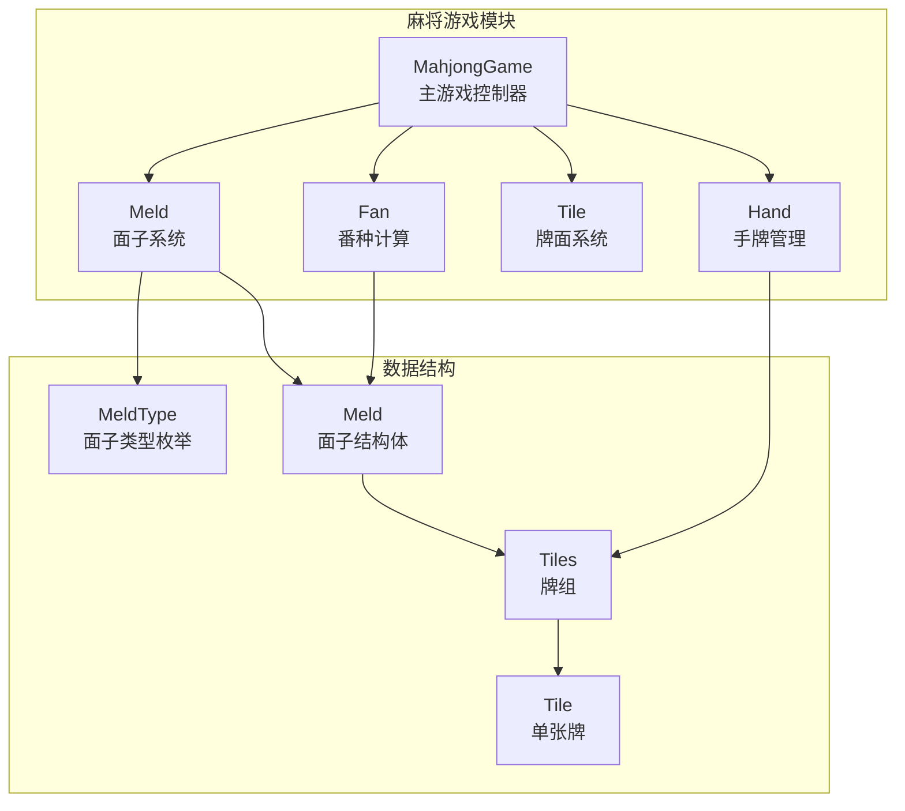

**图表来源**
- [meld.go](file://internal/game/mahjong/meld.go#L1-L65)
- [tile.go](file://internal/game/mahjong/tile.go#L1-L241)
- [game.go](file://internal/game/mahjong/game.go#L1-L805)

**章节来源**
- [meld.go](file://internal/game/mahjong/meld.go#L1-L65)
- [tile.go](file://internal/game/mahjong/tile.go#L1-L241)
- [game.go](file://internal/game/mahjong/game.go#L1-L805)

## 核心组件

### MeldType 枚举类型

面子类型通过整数枚举定义，确保类型安全和序列化兼容：

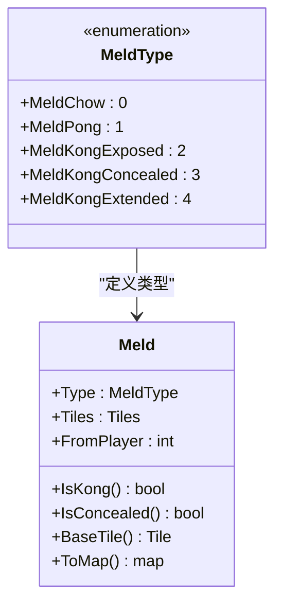

**图表来源**
- [meld.go](file://internal/game/mahjong/meld.go#L3-L21)

### Meld 结构体设计

Meld结构体采用简洁而功能完整的字段设计：

| 字段名 | 类型 | 描述 | 默认值 |
|--------|------|------|--------|
| Type | MeldType | 面子类型标识 | 未定义 |
| Tiles | Tiles | 组成面子的牌集合 | 空切片 |
| FromPlayer | int | 来源玩家座位号 | -1（暗杠专用） |

**章节来源**
- [meld.go](file://internal/game/mahjong/meld.go#L16-L21)

## 架构概览

Meld系统在整个麻将游戏架构中扮演关键角色，连接牌面、手牌和番种计算：

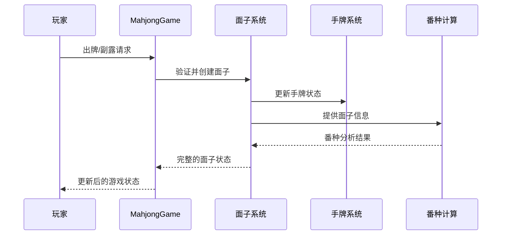

**图表来源**
- [game.go](file://internal/game/mahjong/game.go#L142-L289)
- [meld.go](file://internal/game/mahjong/meld.go#L23-L46)

## 详细组件分析

### 面子类型识别算法

#### 顺子（Chow）识别

顺子识别算法确保牌面连续性和花色一致性：

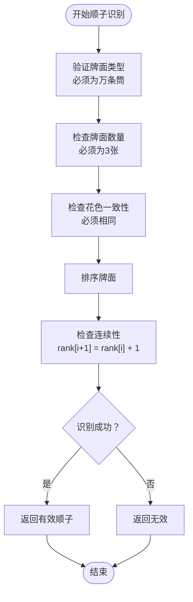

**图表来源**
- [game.go](file://internal/game/mahjong/game.go#L778-L795)
- [hand.go](file://internal/game/mahjong/hand.go#L168-L206)

#### 刻子（Pong）验证

刻子验证基于牌面相同性的精确匹配：

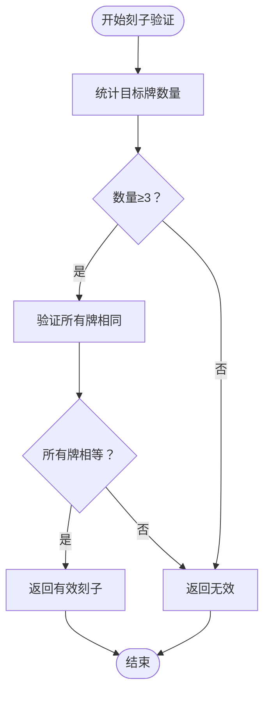

**图表来源**
- [hand.go](file://internal/game/mahjong/hand.go#L208-L211)

#### 杠牌（Kong）完整性判断

杠牌系统支持三种类型，每种都有特定的完整性要求：

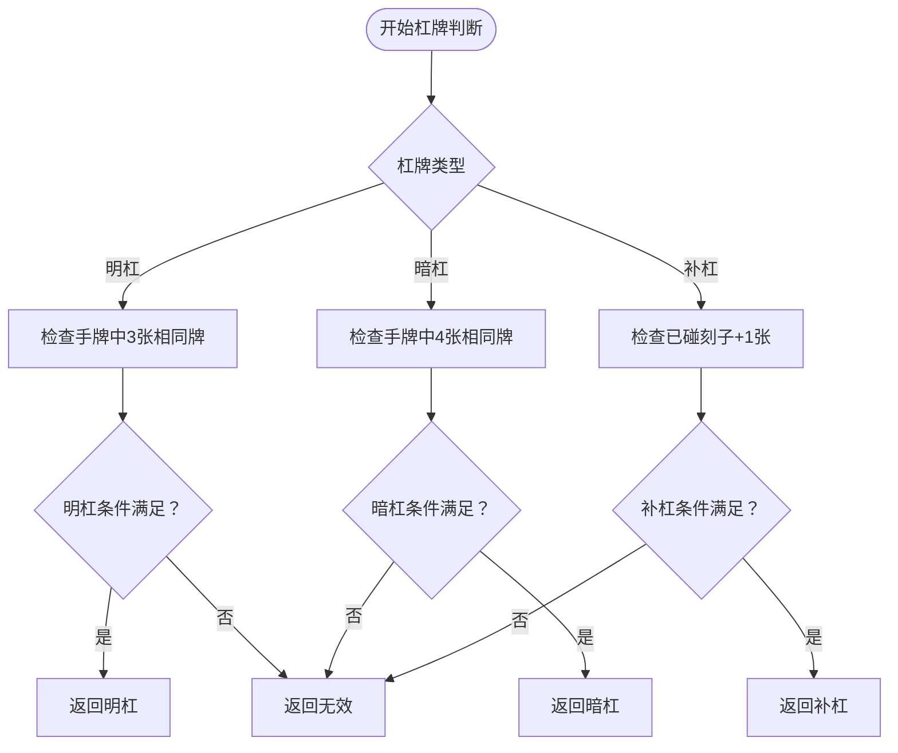

**图表来源**
- [game.go](file://internal/game/mahjong/game.go#L251-L289)
- [hand.go](file://internal/game/mahjong/hand.go#L218-L244)

### 面子创建、修改和删除操作

#### 面子创建流程

面子创建遵循严格的验证和更新流程：

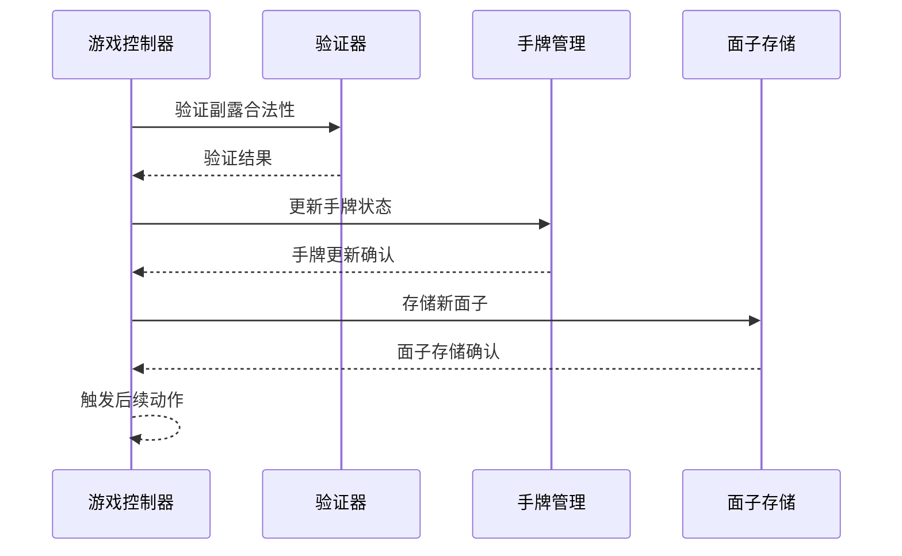

**图表来源**
- [game.go](file://internal/game/mahjong/game.go#L434-L519)

#### 面子修改操作

补杠是唯一支持修改的面子操作：

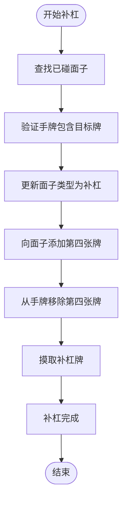

**图表来源**
- [game.go](file://internal/game/mahjong/game.go#L273-L286)

### 面子在游戏中的作用

#### 副露处理机制

副露系统通过以下步骤处理玩家的副露请求：

1. **验证阶段**：检查手牌数量和牌面有效性
2. **执行阶段**：更新手牌和面子状态
3. **清理阶段**：从牌河移除对应牌面
4. **推进阶段**：根据面子类型决定后续动作

#### 组合分析

面子系统与番种计算深度集成，提供完整的牌型分析能力：

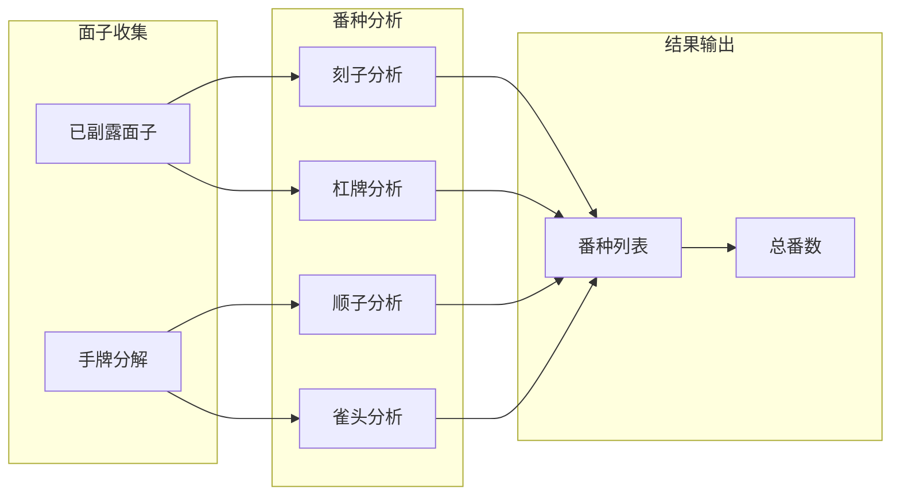

**图表来源**
- [fan.go](file://internal/game/mahjong/fan.go#L131-L155)

**章节来源**
- [game.go](file://internal/game/mahjong/game.go#L434-L519)
- [fan.go](file://internal/game/mahjong/fan.go#L131-L155)

## 依赖关系分析

Meld系统与游戏其他组件存在紧密的依赖关系：

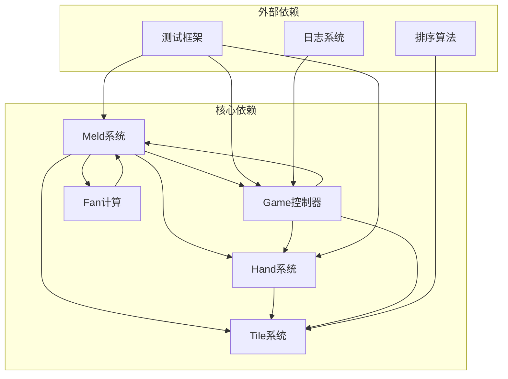

**图表来源**
- [meld.go](file://internal/game/mahjong/meld.go#L1-L65)
- [tile.go](file://internal/game/mahjong/tile.go#L1-L241)
- [game.go](file://internal/game/mahjong/game.go#L1-L805)

**章节来源**
- [meld.go](file://internal/game/mahjong/meld.go#L1-L65)
- [tile.go](file://internal/game/mahjong/tile.go#L1-L241)
- [game.go](file://internal/game/mahjong/game.go#L1-L805)

## 性能考虑

### 时间复杂度分析

- **面子识别**：O(n log n)，主要由排序操作决定
- **面子验证**：O(n)，线性扫描检查
- **番种计算**：O(34^2) = O(1)，固定大小的牌面空间
- **状态查询**：O(1)，直接访问存储的数据

### 空间复杂度优化

- 使用紧凑的34元素计数数组表示牌面
- 面子存储采用切片优化内存使用
- 批量转换操作避免重复分配

## 故障排除指南

### 常见错误场景

#### 面子验证失败

当面子验证失败时，系统会返回具体的错误信息：

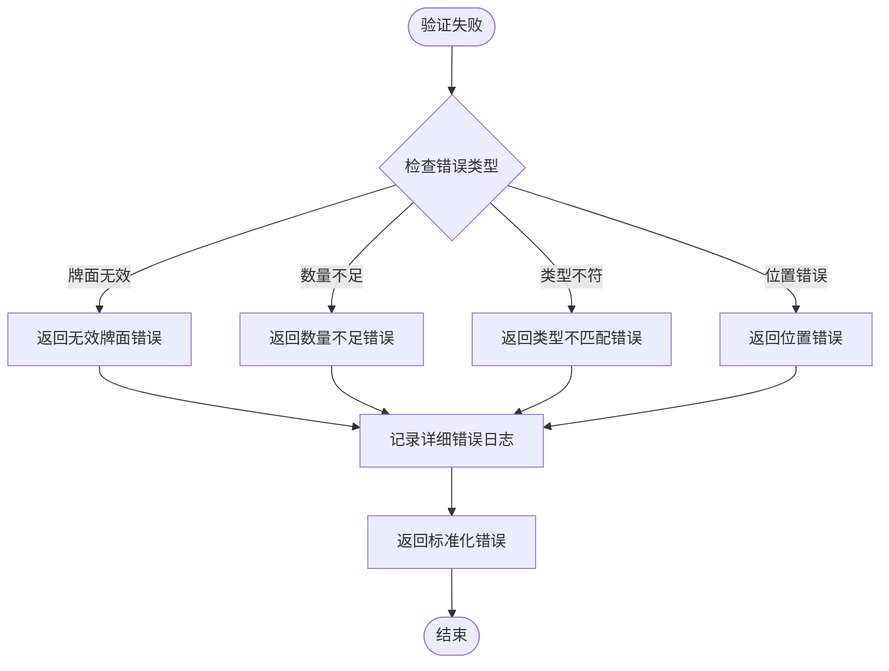

#### 边界情况处理

系统针对各种边界情况提供了完善的处理机制：

- **字牌处理**：字牌不能参与顺子识别
- **花色限制**：顺子必须保持花色一致
- **数量验证**：严格检查面子所需的牌数量
- **座位验证**：确保副露操作符合座位规则

**章节来源**
- [game.go](file://internal/game/mahjong/game.go#L293-L329)
- [hand.go](file://internal/game/mahjong/hand.go#L168-L206)

## 结论

Meld(面子)系统通过精心设计的数据结构和算法，为麻将游戏提供了稳定可靠的副露处理能力。系统的主要优势包括：

1. **类型安全**：通过枚举类型确保面子类型的正确性
2. **算法健壮**：针对各种边界情况提供了完善的处理机制
3. **性能优化**：采用高效的算法和数据结构设计
4. **扩展性强**：模块化设计便于功能扩展和维护

该系统成功地将复杂的麻将规则转化为清晰的代码实现，为游戏的其他组件提供了可靠的基础服务。