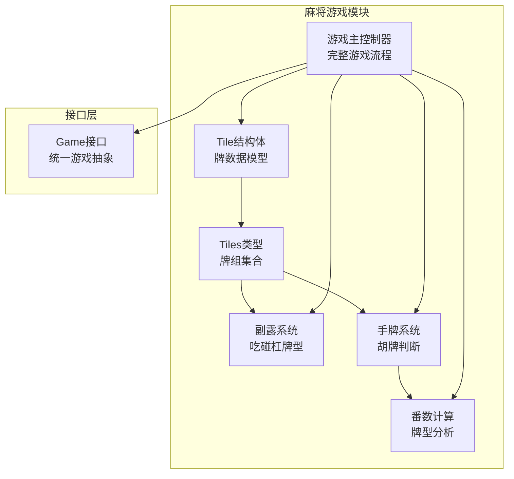
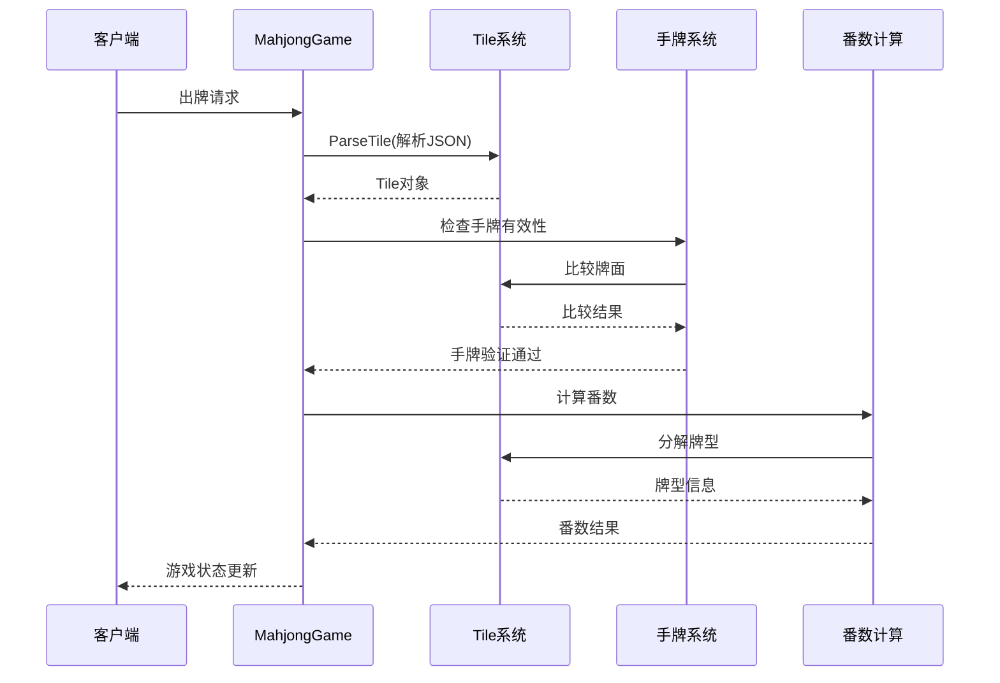
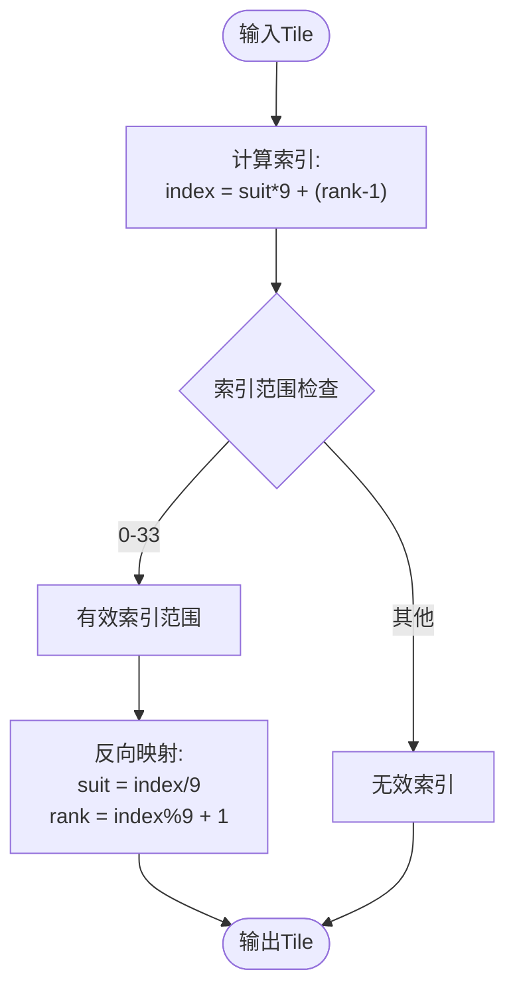
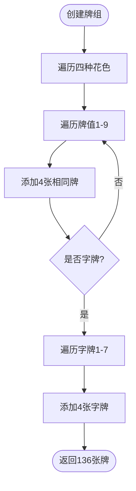
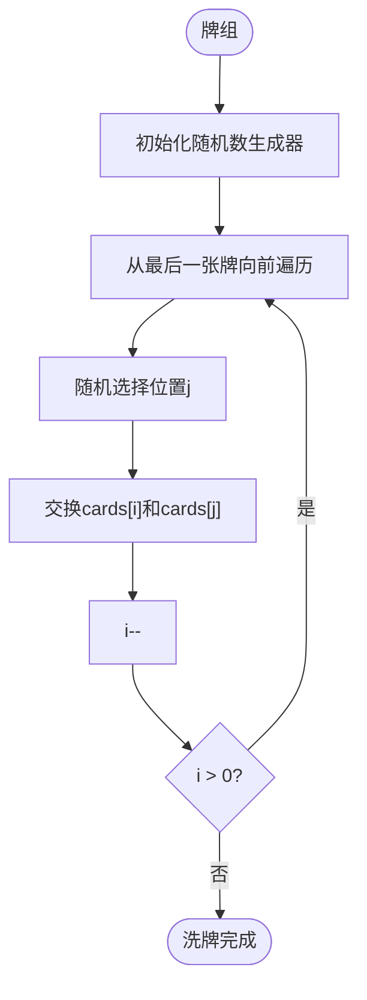
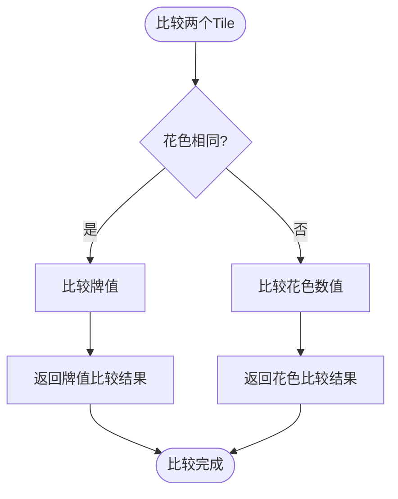
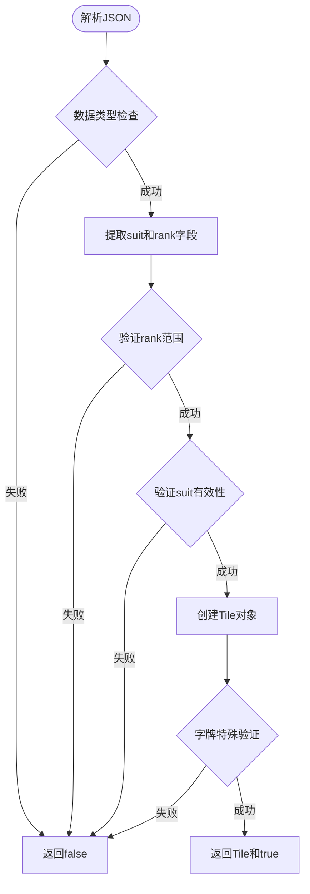
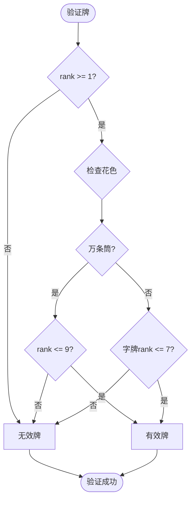
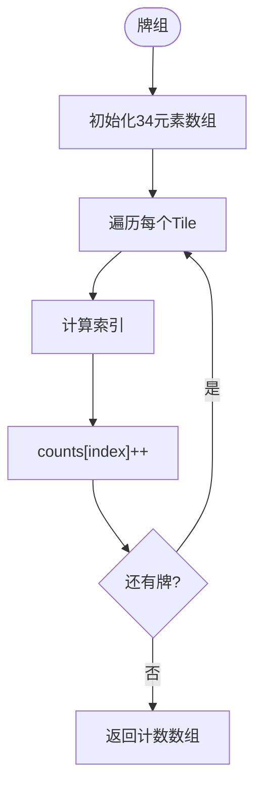
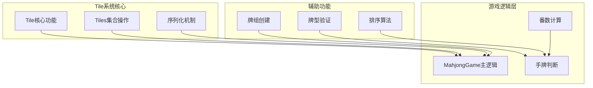

# Tile(牌)系统

<cite>
**本文档引用的文件**
- [tile.go](file://internal/game/mahjong/tile.go)
- [game.go](file://internal/game/mahjong/game.go)
- [hand.go](file://internal/game/mahjong/hand.go)
- [meld.go](file://internal/game/mahjong/meld.go)
- [fan.go](file://internal/game/mahjong/fan.go)
- [game_test.go](file://internal/game/mahjong/game_test.go)
- [game.go](file://internal/game/interfaces/game.go)
</cite>

## 目录
1. [简介](#简介)
2. [项目结构](#项目结构)
3. [核心组件](#核心组件)
4. [架构概览](#架构概览)
5. [详细组件分析](#详细组件分析)
6. [依赖关系分析](#依赖关系分析)
7. [性能考虑](#性能考虑)
8. [故障排除指南](#故障排除指南)
9. [结论](#结论)

## 简介

Tile(牌)系统是麻将游戏的核心数据结构，负责表示和管理麻将牌的各种属性和行为。该系统实现了完整的麻将牌数据模型，包括花色分类、数值编码、牌面表示、序列化机制以及各种牌型验证功能。

## 项目结构

Tile系统位于麻将游戏模块内部，与游戏逻辑紧密集成：



**图表来源**
- [tile.go](file://internal/game/mahjong/tile.go#L35-L82)
- [game.go](file://internal/game/mahjong/game.go#L51-L77)
- [hand.go](file://internal/game/mahjong/hand.go#L3-L25)
- [meld.go](file://internal/game/mahjong/meld.go#L16-L21)
- [fan.go](file://internal/game/mahjong/fan.go#L9-L19)

**章节来源**
- [tile.go](file://internal/game/mahjong/tile.go#L1-L241)
- [game.go](file://internal/game/mahjong/game.go#L1-L805)

## 核心组件

### Tile结构体设计

Tile是麻将牌的核心数据结构，采用简洁而高效的设计：

```mermaid
classDiagram
class Tile {
+Suit suit
+int rank
+String() string
+Equal(other Tile) bool
+Less(other Tile) bool
+IsHonor() bool
+IsTerminal() bool
+IsTerminalOrHonor() bool
+IsWind() bool
+IsDragon() bool
+ToIndex() int
}
class Tiles {
+Len() int
+Swap(i, j) void
+Less(i, j) bool
+Contains(t Tile) bool
+Count(t Tile) int
+Remove(t Tile) Tiles
+RemoveN(t Tile, n int) Tiles
+Copy() Tiles
+ToMaps() []map[string]interface{}
+ToCountArray() [34]int
}
class Suit {
<<enumeration>>
+SuitWan
+SuitTiao
+SuitTong
+SuitZi
}
Tile --> Suit : "使用"
Tiles --> Tile : "包含"
```

**图表来源**
- [tile.go](file://internal/game/mahjong/tile.go#L35-L82)
- [tile.go](file://internal/game/mahjong/tile.go#L135-L241)

### 花色分类系统

系统采用整数枚举来表示四种花色，确保内存效率和快速比较：

| 花色常量 | 数值编码 | 花色名称 | 字符表示 |
|---------|---------|---------|---------|
| SuitWan | 0 | 万 | "wan" |
| SuitTiao | 1 | 条 | "tiao" |
| SuitTong | 2 | 筒 | "tong" |
| SuitZi | 3 | 字 | "zi" |

字牌特殊编号：
- 风牌：1=东, 2=南, 3=西, 4=北
- 箭牌：5=中, 6=发, 7=白

**章节来源**
- [tile.go](file://internal/game/mahjong/tile.go#L10-L33)

## 架构概览

Tile系统在整个麻将游戏架构中扮演着基础数据层的角色：



**图表来源**
- [game.go](file://internal/game/mahjong/game.go#L182-L214)
- [tile.go](file://internal/game/mahjong/tile.go#L92-L133)
- [hand.go](file://internal/game/mahjong/hand.go#L6-L25)

**章节来源**
- [game.go](file://internal/game/mahjong/game.go#L142-L290)

## 详细组件分析

### 数据结构设计

#### Tile结构体字段定义

| 字段名 | 类型 | 描述 | 数值范围 |
|-------|------|------|---------|
| Suit | Suit | 花色标识 | 0-3 |
| Rank | int | 牌值 | 1-9(万条筒), 1-7(字牌) |

#### 索引映射机制

系统使用高效的索引映射来优化牌的存储和查找：



**图表来源**
- [tile.go](file://internal/game/mahjong/tile.go#L76-L82)

**章节来源**
- [tile.go](file://internal/game/mahjong/tile.go#L35-L82)

### 牌的创建和初始化

#### 标准牌组创建

NewDeck函数创建完整的136张麻将牌牌组：



**图表来源**
- [tile.go](file://internal/game/mahjong/tile.go#L215-L231)

#### 洗牌算法

使用Fisher-Yates洗牌算法确保随机性：



**图表来源**
- [tile.go](file://internal/game/mahjong/tile.go#L233-L237)

**章节来源**
- [tile.go](file://internal/game/mahjong/tile.go#L215-L241)

### 牌的比较和排序机制

#### 比较算法

Tile提供了完整的比较接口：



**图表来源**
- [tile.go](file://internal/game/mahjong/tile.go#L52-L57)

#### 排序逻辑

系统实现了稳定的排序算法，确保牌的正确排列顺序。

**章节来源**
- [tile.go](file://internal/game/mahjong/tile.go#L48-L57)
- [tile.go](file://internal/game/mahjong/tile.go#L138-L140)

### 序列化和反序列化机制

#### JSON序列化格式

Tile的JSON序列化采用简洁的键值对格式：

```mermaid
classDiagram
class TileSerialization {
+ToMap() map[string]interface{}
+ParseTile(data interface{}) (Tile, bool)
+ToJSON() string
+FromJSON(json string) (Tile, bool)
}
class TileMap {
+"suit" : string // "wan","tiao","tong","zi"
+"rank" : int // 1-9(万条筒), 1-7(字牌)
}
TileSerialization --> TileMap : "生成"
TileMap --> Tile : "解析"
```

**图表来源**
- [tile.go](file://internal/game/mahjong/tile.go#L84-L90)
- [tile.go](file://internal/game/mahjong/tile.go#L92-L133)

#### 反序列化验证

ParseTile函数实现了严格的验证机制：



**图表来源**
- [tile.go](file://internal/game/mahjong/tile.go#L92-L133)

**章节来源**
- [tile.go](file://internal/game/mahjong/tile.go#L84-L133)

### 牌的验证算法

#### 花色一致性检查

系统提供了多种牌型验证功能：

| 验证方法 | 功能描述 | 实现逻辑 |
|---------|---------|---------|
| IsHonor() | 是否为字牌 | suit == SuitZi |
| IsTerminal() | 是否为老头牌 | 非字牌且rank为1或9 |
| IsWind() | 是否为风牌 | 字牌且rank为1-4 |
| IsDragon() | 是否为箭牌 | 字牌且rank为5-7 |

#### 数值范围验证

验证算法确保牌值在有效范围内：



**图表来源**
- [tile.go](file://internal/game/mahjong/tile.go#L67-L74)

**章节来源**
- [tile.go](file://internal/game/mahjong/tile.go#L67-L74)

### 牌组操作和管理

#### 牌组统计和计数

ToCountArray方法提供了高效的牌组统计功能：



**图表来源**
- [tile.go](file://internal/game/mahjong/tile.go#L206-L213)

#### 牌组操作方法

| 方法名 | 功能描述 | 时间复杂度 |
|-------|---------|-----------|
| Contains | 检查是否包含特定牌 | O(n) |
| Count | 统计特定牌的数量 | O(n) |
| Remove | 移除单张牌 | O(n) |
| RemoveN | 移除n张牌 | O(n) |
| Copy | 复制牌组 | O(n) |

**章节来源**
- [tile.go](file://internal/game/mahjong/tile.go#L142-L195)

### 在游戏中的应用

#### 牌在MahjongGame中的使用

```mermaid
classDiagram
class MahjongGame {
+hands [4]Tiles
+melds [4][]Meld
+discards [4]Tiles
+wall Tiles
+handleDiscard(seat, data) bool
+checkPendingActions() void
}
class Tile {
+Suit suit
+int rank
+ParseTile(data) (Tile, bool)
}
class Tiles {
+Contains(t Tile) bool
+Remove(t Tile) Tiles
+ToMaps() []map[string]interface{}
}
MahjongGame --> Tile : "使用"
MahjongGame --> Tiles : "管理"
Tiles --> Tile : "包含"
```

**图表来源**
- [game.go](file://internal/game/mahjong/game.go#L51-L77)
- [game.go](file://internal/game/mahjong/game.go#L182-L214)

**章节来源**
- [game.go](file://internal/game/mahjong/game.go#L182-L214)

## 依赖关系分析

### 组件间依赖关系



**图表来源**
- [tile.go](file://internal/game/mahjong/tile.go#L1-L241)
- [game.go](file://internal/game/mahjong/game.go#L1-L805)
- [hand.go](file://internal/game/mahjong/hand.go#L1-L245)
- [fan.go](file://internal/game/mahjong/fan.go#L1-L497)

### 外部依赖和接口

Tile系统遵循统一的游戏接口规范：

```mermaid
classDiagram
class GameInterface {
<<interface>>
+ID() string
+Init(players []string) error
+ProcessAction(playerID string, action interface{}) (bool, error)
+GetState() interface{}
+GetStateForPlayer(playerID string) interface{}
}
class MahjongGame {
+ID() string
+Init(players []string) error
+ProcessAction(playerID string, action interface{}) (bool, error)
+GetState() interface{}
+GetStateForPlayer(playerID string) interface{}
}
GameInterface <|-- MahjongGame : "实现"
```

**图表来源**
- [game.go](file://internal/game/interfaces/game.go#L3-L16)
- [game.go](file://internal/game/mahjong/game.go#L79-L87)

**章节来源**
- [game.go](file://internal/game/interfaces/game.go#L1-L23)

## 性能考虑

### 内存优化策略

1. **紧凑的数据结构**：Tile仅包含2个字段，占用最小内存空间
2. **索引映射**：使用整数索引替代字符串比较，提高查找效率
3. **预分配容量**：NewDeck预先分配136个元素的容量，避免动态扩容

### 时间复杂度分析

| 操作 | 时间复杂度 | 优化策略 |
|------|-----------|---------|
| 牌比较 | O(1) | 使用整数比较 |
| 牌索引 | O(1) | 直接数学计算 |
| 牌组排序 | O(n log n) | 使用Go内置排序 |
| 牌组统计 | O(n) | 单次遍历计数 |
| 牌组查找 | O(n) | 线性搜索 |

### 并发安全性

Tile系统在设计上是线程安全的，因为：
- 所有操作都是纯函数式，无共享状态
- 结构体字段都是不可变的
- 排序操作会修改副本而非原对象

## 故障排除指南

### 常见问题和解决方案

#### 牌解析错误

**问题**：ParseTile返回false
**可能原因**：
- JSON格式不正确
- 花色值不在有效范围内
- 牌值小于1或超过最大值

**解决方法**：
1. 检查客户端发送的JSON格式
2. 验证花色字符串是否为"wani"、"tiao"、"tong"或"zi"
3. 确认牌值在有效范围内

#### 牌组操作异常

**问题**：Remove操作返回原牌组
**可能原因**：
- 要移除的牌不存在
- 牌组为空
- 内存分配失败

**解决方法**：
1. 使用Contains方法先检查牌是否存在
2. 确保牌组非空
3. 检查内存使用情况

#### 排序问题

**问题**：牌排序不符合预期
**可能原因**：
- 自定义排序逻辑错误
- 牌组包含无效牌

**解决方法**：
1. 检查Tile.Less方法实现
2. 验证所有牌都在有效范围内

**章节来源**
- [tile.go](file://internal/game/mahjong/tile.go#L92-L133)
- [tile.go](file://internal/game/mahjong/tile.go#L163-L174)

## 结论

Tile(牌)系统通过精心设计的数据结构和算法，为麻将游戏提供了高效、可靠的牌管理基础。系统的主要优势包括：

1. **高效的数据模型**：简洁的Tile结构体和索引映射机制
2. **完整的功能覆盖**：从基本的牌操作到复杂的牌型验证
3. **良好的扩展性**：清晰的接口设计便于功能扩展
4. **严格的验证机制**：确保数据的完整性和一致性

该系统为整个麻将游戏提供了坚实的基础，支持各种复杂的麻将规则和玩法，同时保持了优秀的性能表现。