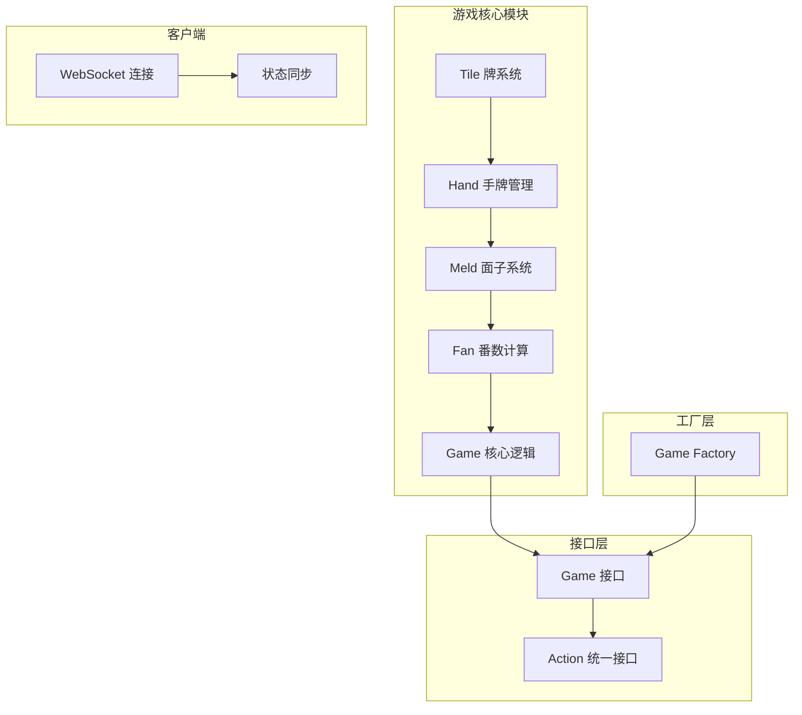
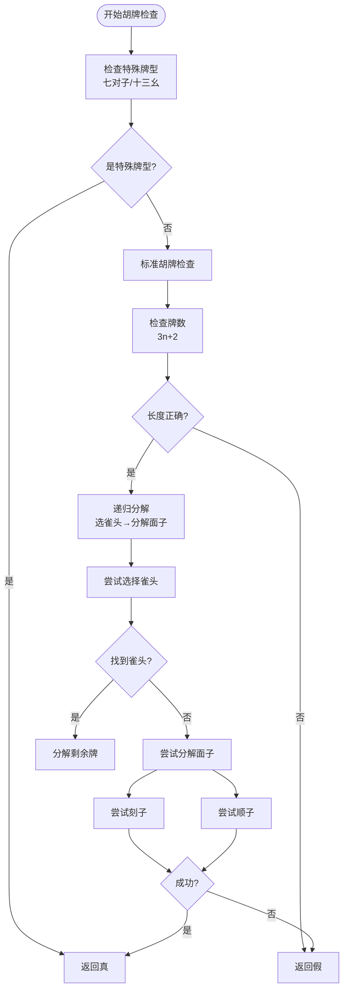
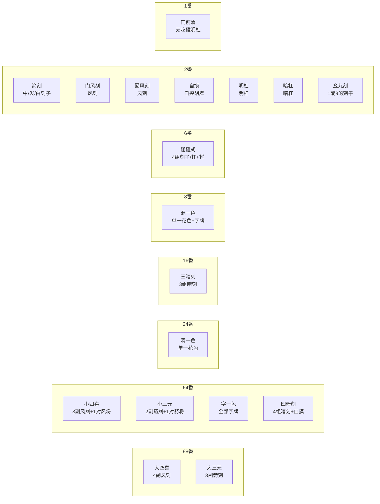
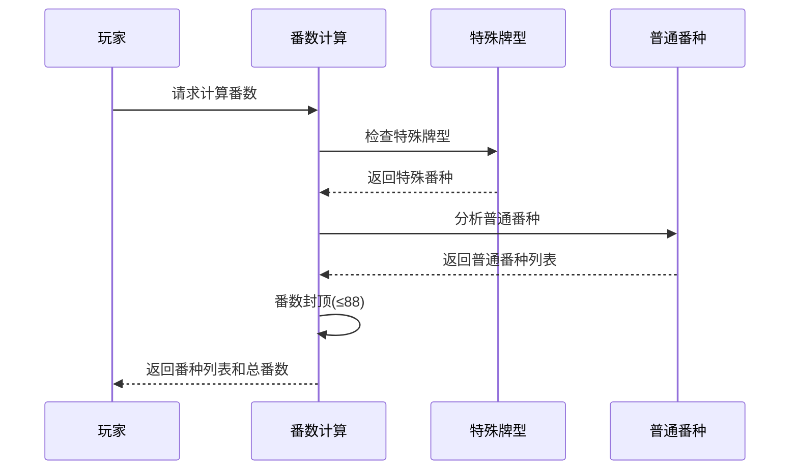
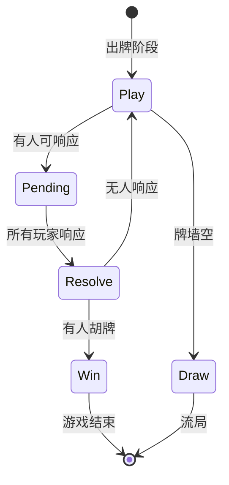
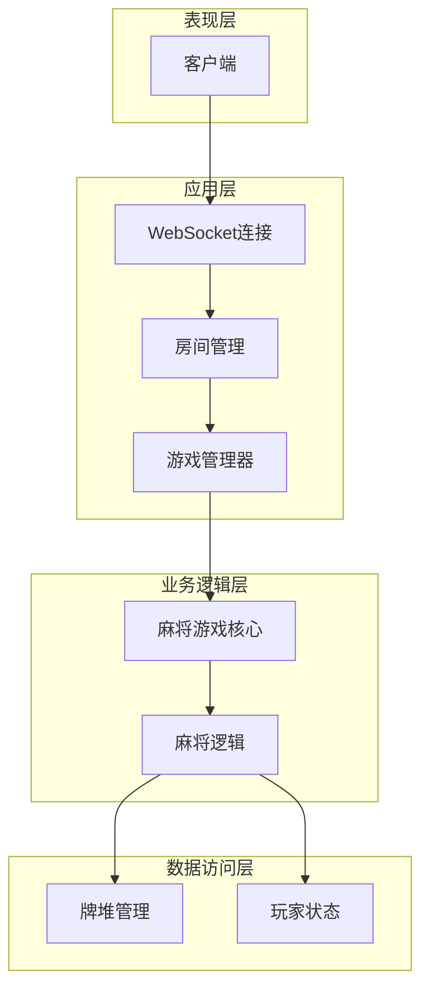
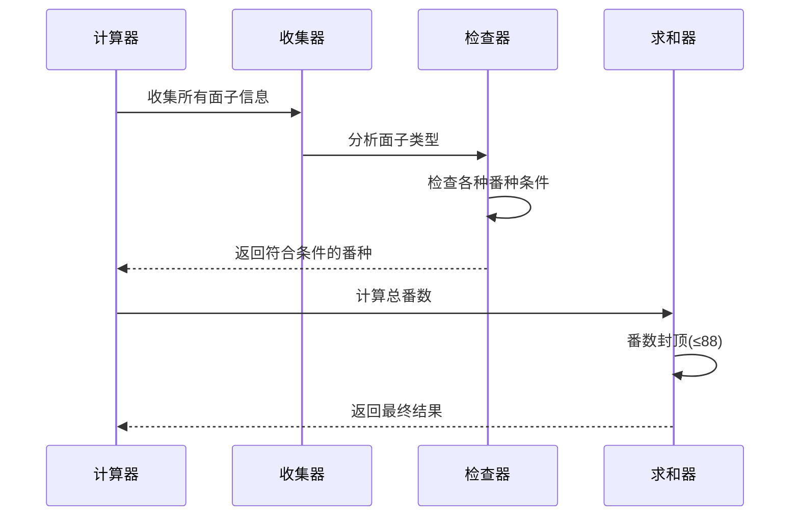
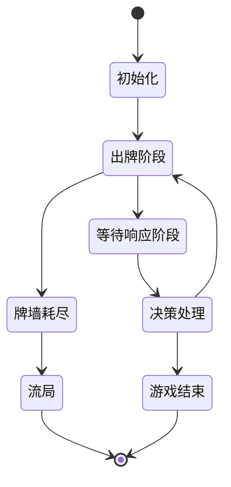
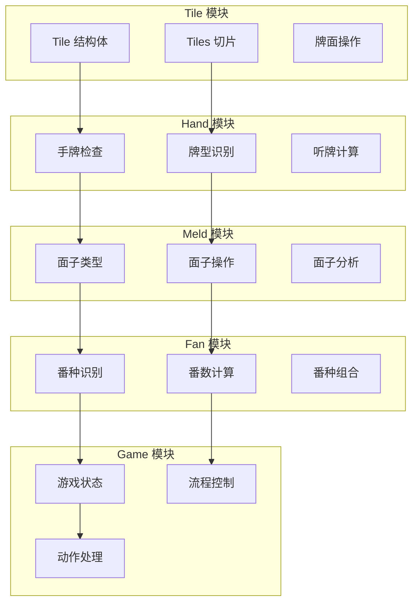

# 麻将游戏 (Mahjong)

<cite>
**本文档引用的文件**
- [tile.go](file://internal/game/mahjong/tile.go)
- [hand.go](file://internal/game/mahjong/hand.go)
- [meld.go](file://internal/game/mahjong/meld.go)
- [fan.go](file://internal/game/mahjong/fan.go)
- [game.go](file://internal/game/mahjong/game.go)
- [game_test.go](file://internal/game/mahjong/game_test.go)
- [game.go](file://internal/game/interfaces/game.go)
- [factory.go](file://internal/game/factory.go)
- [README.md](file://README.md)
</cite>

## 目录
1. [简介](#简介)
2. [项目结构](#项目结构)
3. [核心组件](#核心组件)
4. [架构概览](#架构概览)
5. [详细组件分析](#详细组件分析)
6. [依赖关系分析](#依赖关系分析)
7. [性能考虑](#性能考虑)
8. [故障排除指南](#故障排除指南)
9. [结论](#结论)
10. [附录](#附录)

## 简介

这是一个基于 Go 语言开发的多人在线麻将游戏服务器，采用模块化设计，支持 4 人对战。项目实现了国标麻将的核心规则，包括牌面系统、手牌管理、面子识别、番数计算和完整的游戏流程控制。

麻将游戏遵循简化版国标麻将规则，支持基本的吃碰杠胡操作，包含多种番种计算，如清一色、七对、十三幺等经典牌型。

## 项目结构

项目采用清晰的模块化架构，主要分为以下几个核心部分：



**图表来源**
- [tile.go](file://internal/game/mahjong/tile.go#L1-L241)
- [hand.go](file://internal/game/mahjong/hand.go#L1-L245)
- [meld.go](file://internal/game/mahjong/meld.go#L1-L65)
- [fan.go](file://internal/game/mahjong/fan.go#L1-L497)
- [game.go](file://internal/game/mahjong/game.go#L1-L805)

**章节来源**
- [README.md](file://README.md#L20-L50)
- [factory.go](file://internal/game/factory.go#L1-L24)

## 核心组件

### Tile 牌系统

Tile 系统是整个麻将游戏的基础，负责牌面的表示、分类和操作。

#### 牌面表示与分类

```mermaid
classDiagram
class Tile {
+Suit suit
+int rank
+String() string
+Equal(other Tile) bool
+Less(other Tile) bool
+IsHonor() bool
+IsTerminal() bool
+IsTerminalOrHonor() bool
+IsWind() bool
+IsDragon() bool
+ToIndex() int
+ToMap() map[string]interface{}
}
class Suit {
<<enumeration>>
+SuitWan
+SuitTiao
+SuitTong
+SuitZi
}
class Tiles {
+Tile[] tiles
+Len() int
+Swap(i, j) void
+Less(i, j) bool
+Contains(t Tile) bool
+Count(t Tile) int
+Remove(t Tile) Tiles
+RemoveN(t Tile, n int) Tiles
+Copy() Tiles
+ToMaps() []map[string]interface{}
+ToCountArray() [34]int
}
Tile --> Suit
Tiles --> Tile
```

**图表来源**
- [tile.go](file://internal/game/mahjong/tile.go#L10-L82)

#### 花色分类

系统支持四种花色：
- **万字牌 (Wan)**: 1-9 万
- **条子牌 (Tiao)**: 1-9 条  
- **筒子牌 (Tong)**: 1-9 筒
- **字牌 (Zi)**: 风牌 (东、南、西、北) 和箭牌 (中、发、白)

#### 编码机制

使用 0-33 的索引系统进行高效存储：
- 索引计算: `index = suit * 9 + (rank - 1)`
- 字牌特殊处理: 字牌索引范围 27-33
- 提供双向转换函数 (`TileFromIndex`, `ToIndex`)

**章节来源**
- [tile.go](file://internal/game/mahjong/tile.go#L13-L82)

### Hand 手牌管理

Hand 模块负责手牌的完整性检查、牌型识别和操作。

#### 核心算法



**图表来源**
- [hand.go](file://internal/game/mahjong/hand.go#L16-L105)

#### 特殊牌型识别

系统支持以下特殊牌型：
- **七对子**: 14张牌组成7个对子
- **十三幺**: 1/9万条筒 + 东南西北中发白各1张，其中1张做对子
- **标准胡牌**: 4个面子 + 1个雀头

**章节来源**
- [hand.go](file://internal/game/mahjong/hand.go#L3-L147)

### Meld 面子系统

Meld 系统管理玩家的副露（公开的面子），支持多种面子类型。

#### 面子类型

```mermaid
classDiagram
class Meld {
+MeldType Type
+Tiles Tiles
+int FromPlayer
+IsKong() bool
+IsConcealed() bool
+BaseTile() Tile
+ToMap() map[string]interface{}
}
class MeldType {
<<enumeration>>
+MeldChow "吃"
+MeldPong "碰"
+MeldKongExposed "明杠"
+MeldKongConcealed "暗杠"
+MeldKongExtended "补杠"
}
class MeldInfo {
+string Type
+Tile Tile
+bool Concealed
}
Meld --> MeldType
Meld --> Tiles
MeldInfo --> Tile
```

**图表来源**
- [meld.go](file://internal/game/mahjong/meld.go#L3-L65)

#### 面子识别算法

系统通过递归回溯算法识别手牌中的面子：
1. **雀头选择**: 优先选择有足够对子的牌作为雀头
2. **面子分解**: 递归尝试刻子和顺子组合
3. **验证机制**: 确保分解后的剩余牌数符合要求

**章节来源**
- [meld.go](file://internal/game/mahjong/meld.go#L16-L65)

### Fan 番数计算系统

Fan 系统实现了复杂的番种计算逻辑，支持多种番种的识别和累加。

#### 番种分级



**图表来源**
- [fan.go](file://internal/game/mahjong/fan.go#L21-L121)

#### 计算流程



**图表来源**
- [fan.go](file://internal/game/mahjong/fan.go#L21-L121)

**章节来源**
- [fan.go](file://internal/game/mahjong/fan.go#L1-L497)

### Game 核心类

Game 核心类管理整个游戏的状态和流程控制。

#### 游戏阶段



**图表来源**
- [game.go](file://internal/game/mahjong/game.go#L11-L34)

#### 主要功能

1. **初始化**: 洗牌、发牌、确定庄家
2. **出牌处理**: 验证出牌合法性、更新状态
3. **响应处理**: 等待其他玩家决策（胡、杠、碰、吃）
4. **状态管理**: 维护游戏进度、玩家手牌、副露等
5. **胜负判定**: 计算番数、确定赢家

**章节来源**
- [game.go](file://internal/game/mahjong/game.go#L51-L805)

## 架构概览

系统采用分层架构设计，确保各模块职责清晰、耦合度低。



**图表来源**
- [game.go](file://internal/game/mahjong/game.go#L1-L805)
- [factory.go](file://internal/game/factory.go#L11-L23)

## 详细组件分析

### Tile 系统详细分析

Tile 系统实现了高效的牌面表示和操作：

#### 数据结构设计

| 属性 | 类型 | 描述 | 复杂度 |
|------|------|------|--------|
| suit | Suit | 花色枚举 | O(1) |
| rank | int | 数值 1-9 或 1-7 | O(1) |
| ToIndex | function | 索引转换 | O(1) |
| ParseTile | function | JSON解析 | O(1) |

#### 操作复杂度

- **牌面比较**: O(1) - 直接比较 suit 和 rank
- **牌面排序**: O(n log n) - 使用自定义比较器
- **牌面查找**: O(n) - 线性搜索
- **牌面统计**: O(n) - 遍历计数

**章节来源**
- [tile.go](file://internal/game/mahjong/tile.go#L35-L241)

### Hand 系统详细分析

Hand 系统的核心是递归分解算法，用于判断手牌是否满足胡牌条件。

#### 算法复杂度分析

```mermaid
flowchart TD
A[输入: 14张手牌] --> B[转换为计数数组<br/>O(n)]
B --> C[检查特殊牌型<br/>O(1)]
C --> D[标准胡牌检查]
D --> E[递归分解算法]
E --> F[时间复杂度: O(3^k) k≤14]
F --> G[空间复杂度: O(k) k≤14]
```

**图表来源**
- [hand.go](file://internal/game/mahjong/hand.go#L16-L105)

#### 关键算法实现

1. **标准胡牌检查**: 使用动态规划思想，优先选择雀头，然后递归分解面子
2. **七对子识别**: 检查是否能形成7个对子
3. **十三幺识别**: 验证是否包含所有幺九牌和字牌

**章节来源**
- [hand.go](file://internal/game/mahjong/hand.go#L16-L245)

### Meld 系统详细分析

Meld 系统支持多种面子类型，每种类型都有特定的识别和处理逻辑。

#### 面子识别算法

```mermaid
flowchart TD
A[输入: 手牌 Tiles] --> B[转换为计数数组]
B --> C[寻找第一张有牌的位置]
C --> D{剩余牌数 % 3}
D --> |2| E[尝试选择雀头<br/>counts[i] ≥ 2]
D --> |0| F[直接分解面子]
E --> G[counts[i] -= 2]
G --> H[分解剩余牌]
F --> H
H --> I[尝试刻子<br/>counts[i] ≥ 3]
H --> J[尝试顺子<br/>suit < 3 && rank ≤ 6]
I --> K[counts[i] -= 3]
J --> L[检查连续性]
K --> M[递归调用]
L --> M
M --> N{成功?}
N --> |是| O[返回 true]
N --> |否| P[回溯并尝试其他组合]
```

**图表来源**
- [hand.go](file://internal/game/mahjong/hand.go#L27-L105)

**章节来源**
- [meld.go](file://internal/game/mahjong/meld.go#L16-L65)

### Fan 系统详细分析

Fan 系统实现了复杂的番种计算，支持 30 种番种的识别。

#### 番种识别流程



**图表来源**
- [fan.go](file://internal/game/mahjong/fan.go#L21-L121)

#### 关键番种识别

1. **大牌型**: 大四喜、大三元 (88番)
2. **小牌型**: 小四喜、小三元 (64番)
3. **清一色**: 单一花色 (24番)
4. **暗刻系列**: 四暗刻、三暗刻 (64/16番)
5. **基础番种**: 箭刻、门风刻、圈风刻等

**章节来源**
- [fan.go](file://internal/game/mahjong/fan.go#L21-L497)

### Game 核心类详细分析

Game 核心类管理整个游戏的生命周期和状态转换。

#### 状态管理模式



**图表来源**
- [game.go](file://internal/game/mahjong/game.go#L11-L87)

#### 关键处理流程

1. **出牌处理**: 验证合法性、更新手牌和牌河
2. **响应处理**: 检查其他玩家的胡、杠、碰、吃操作
3. **优先级处理**: 胡 > 杠 > 碰 > 吃 > 过
4. **状态同步**: 更新游戏状态并广播给所有玩家

**章节来源**
- [game.go](file://internal/game/mahjong/game.go#L142-L805)

## 依赖关系分析

系统采用松耦合设计，各模块之间通过清晰的接口交互。



**图表来源**
- [tile.go](file://internal/game/mahjong/tile.go#L1-L241)
- [hand.go](file://internal/game/mahjong/hand.go#L1-L245)
- [meld.go](file://internal/game/mahjong/meld.go#L1-L65)
- [fan.go](file://internal/game/mahjong/fan.go#L1-L497)
- [game.go](file://internal/game/mahjong/game.go#L1-L805)

**章节来源**
- [factory.go](file://internal/game/factory.go#L11-L23)

## 性能考虑

### 时间复杂度优化

1. **牌面索引系统**: 使用 0-33 索引避免字符串比较，提高查找效率
2. **递归剪枝**: 在胡牌检查中及时回溯，避免不必要的计算
3. **缓存机制**: 使用计数数组减少重复计算

### 空间复杂度优化

1. **原地操作**: 大多数操作在原切片上进行，减少内存分配
2. **共享数据**: 多个模块共享相同的 Tiles 和 Meld 结构
3. **延迟计算**: 只在需要时才进行复杂的番种计算

### 算法优化策略

1. **早期退出**: 在检测到不可能的情况下立即返回
2. **预计算**: 将常用计算结果缓存起来
3. **批量操作**: 支持批量牌面操作减少循环次数

## 故障排除指南

### 常见问题及解决方案

#### 牌面解析错误

**问题**: JSON 数据解析失败
**原因**: 花色或数值超出有效范围
**解决**: 检查客户端发送的数据格式

#### 胡牌判定错误

**问题**: 手牌明明可以胡却判定为不能
**原因**: 递归算法边界条件处理不当
**解决**: 检查 `canDecompose` 和 `canDecomposeMelds` 的边界条件

#### 番数计算异常

**问题**: 番数计算结果不符合预期
**原因**: 番种识别逻辑错误或优先级处理不当
**解决**: 检查 `CalculateFan` 函数中的番种识别顺序

#### 游戏状态异常

**问题**: 出牌后状态更新错误
**原因**: 状态机转换逻辑错误
**解决**: 检查 `resolvePending` 和相关状态转换函数

**章节来源**
- [game_test.go](file://internal/game/mahjong/game_test.go#L1-L438)

## 结论

这个麻将游戏项目展现了良好的软件工程实践，具有以下特点：

1. **模块化设计**: 清晰的模块划分和接口定义
2. **算法实现**: 复杂的麻将算法得到正确实现
3. **性能优化**: 采用多种优化策略确保运行效率
4. **可扩展性**: 良好的架构支持新功能的添加

项目成功实现了国标麻将的核心规则，包括牌面系统、手牌管理、面子识别、番数计算和完整的游戏流程控制。代码结构清晰，注释完善，测试覆盖全面，是一个高质量的麻将游戏实现。

## 附录

### 规则说明

麻将游戏遵循简化版国标麻将规则：
- **基本牌型**: 4个面子 + 1个雀头
- **特殊牌型**: 七对子、十三幺等
- **番种限制**: 最高 88 番
- **胡牌条件**: 至少 8 番才能胡牌

### 扩展开发指导

1. **添加新番种**: 在 `fan.go` 中添加新的番种识别函数
2. **修改规则**: 在相应的模块中调整算法逻辑
3. **性能优化**: 考虑使用更高级的数据结构如哈希表
4. **测试完善**: 添加更多的单元测试覆盖边界情况