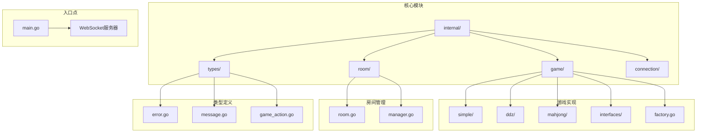
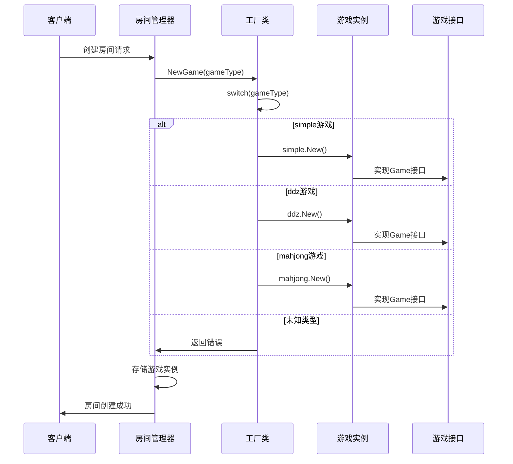
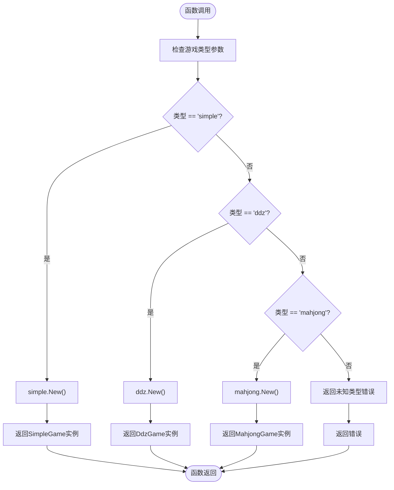
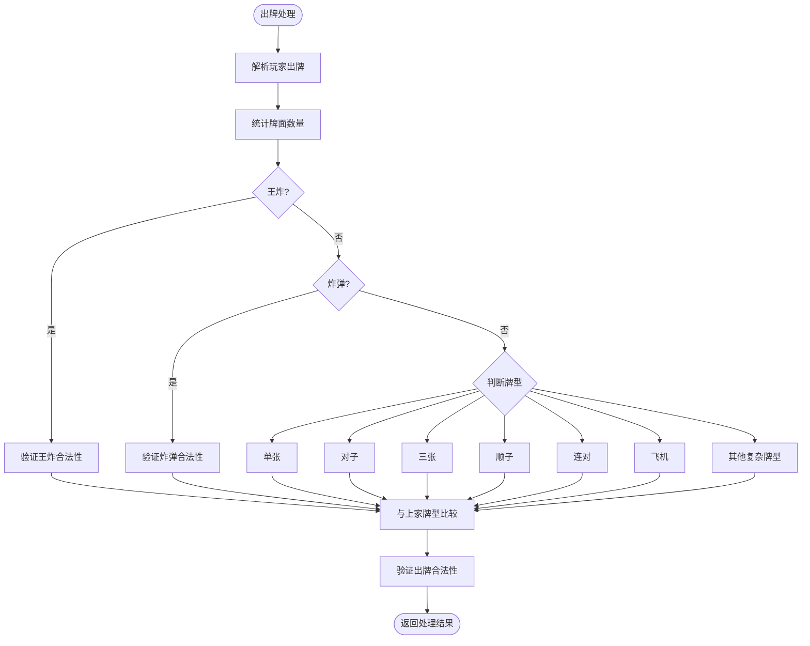
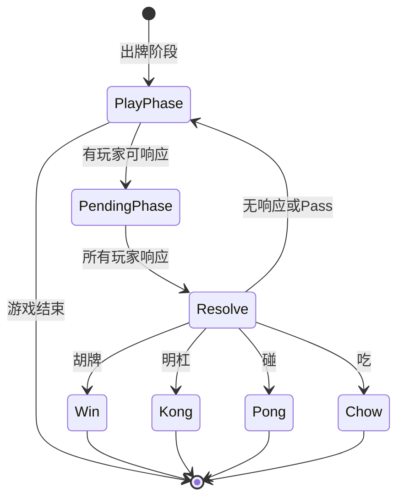
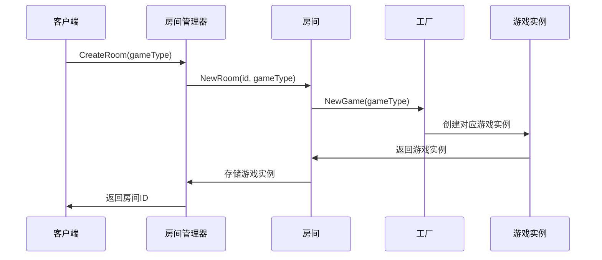
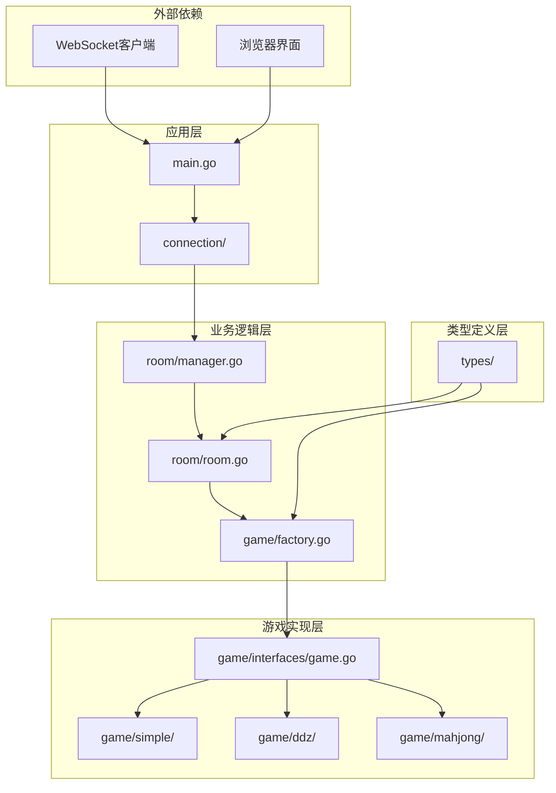

# 游戏工厂模式

<cite>
**本文档引用的文件**
- [factory.go](file://internal/game/factory.go)
- [game.go](file://internal/game/interfaces/game.go)
- [simple_game.go](file://internal/game/simple/game.go)
- [ddz_game.go](file://internal/game/ddz/game.go)
- [mahjong_game.go](file://internal/game/mahjong/game.go)
- [room.go](file://internal/room/room.go)
- [manager.go](file://internal/room/manager.go)
- [main.go](file://main.go)
- [types_error.go](file://internal/types/error.go)
- [types_message.go](file://internal/types/message.go)
- [types_game_action.go](file://internal/types/game_action.go)
</cite>

## 目录
1. [简介](#简介)
2. [项目结构](#项目结构)
3. [核心组件](#核心组件)
4. [架构概览](#架构概览)
5. [详细组件分析](#详细组件分析)
6. [依赖关系分析](#依赖关系分析)
7. [性能考虑](#性能考虑)
8. [故障排除指南](#故障排除指南)
9. [结论](#结论)
10. [附录](#附录)

## 简介

本文档深入分析了卡牌游戏服务器中的工厂模式实现。工厂模式作为一种创建型设计模式，在游戏引擎中发挥着至关重要的作用，它负责根据游戏类型参数动态创建对应的游戏实例，实现了游戏类型的解耦合、可扩展性和代码维护性。

该系统支持三种游戏类型：简单纸牌游戏（simple）、斗地主（ddz）和麻将（mahjong）。工厂类通过NewGame函数实现了统一的游戏创建接口，为上层房间管理和业务逻辑提供了透明的游戏实例创建能力。

## 项目结构

项目采用模块化的目录结构，按照功能域进行组织：



**图表来源**
- [factory.go](file://internal/game/factory.go#L1-L24)
- [room.go](file://internal/room/room.go#L1-L50)
- [main.go](file://main.go#L1-L15)

**章节来源**
- [factory.go](file://internal/game/factory.go#L1-L24)
- [room.go](file://internal/room/room.go#L1-L50)
- [main.go](file://main.go#L1-L15)

## 核心组件

### 工厂类（Game Factory）

工厂类是整个系统的核心，负责根据游戏类型参数创建相应的游戏实例。其设计遵循单一职责原则，专门处理游戏对象的创建逻辑。

```mermaid
classDiagram
class GameFactory {
+NewGame(gameType string) Game, error
-simpleGame SimpleGame
-ddzGame DdzGame
-mahjongGame MahjongGame
}
class GameInterface {
<<interface>>
+ID() string
+Init(players []string) error
+ProcessAction(playerID string, action) (bool, error)
+CurrentTurn() string
+AdvanceTurn() void
+GetState() interface{}
+GetStateForPlayer(playerID string) interface{}
+IsGameOver() bool
+Winner() string
+MaxPlayers() int
+MinPlayers() int
}
class SimpleGame {
+ID() string
+Init(players []string) error
+ProcessAction(playerID string, action) (bool, error)
+CurrentTurn() string
+AdvanceTurn() void
+GetState() interface{}
+GetStateForPlayer(playerID string) interface{}
+IsGameOver() bool
+Winner() string
+MaxPlayers() int
+MinPlayers() int
}
class DdzGame {
+ID() string
+Init(players []string) error
+ProcessAction(playerID string, action) (bool, error)
+CurrentTurn() string
+AdvanceTurn() void
+GetState() interface{}
+GetStateForPlayer(playerID string) interface{}
+IsGameOver() bool
+Winner() string
+MaxPlayers() int
+MinPlayers() int
}
class MahjongGame {
+ID() string
+Init(players []string) error
+ProcessAction(playerID string, action) (bool, error)
+CurrentTurn() string
+AdvanceTurn() void
+GetState() interface{}
+GetStateForPlayer(playerID string) interface{}
+IsGameOver() bool
+Winner() string
+MaxPlayers() int
+MinPlayers() int
}
GameFactory --> GameInterface : creates
SimpleGame ..|> GameInterface
DdzGame ..|> GameInterface
MahjongGame ..|> GameInterface
```

**图表来源**
- [factory.go](file://internal/game/factory.go#L11-L23)
- [game.go](file://internal/game/interfaces/game.go#L3-L16)
- [simple_game.go](file://internal/game/simple/game.go#L8-L15)
- [ddz_game.go](file://internal/game/ddz/game.go#L20-L35)
- [mahjong_game.go](file://internal/game/mahjong/game.go#L51-L77)

### 游戏接口定义

游戏接口定义了所有游戏类型必须实现的标准方法，确保了不同游戏类型之间的统一性和互操作性。

**章节来源**
- [game.go](file://internal/game/interfaces/game.go#L3-L16)

## 架构概览

系统采用分层架构设计，工厂模式位于业务逻辑层，向上提供统一的游戏创建接口，向下封装具体的游戏实现细节。



**图表来源**
- [room.go](file://internal/room/room.go#L35-L57)
- [factory.go](file://internal/game/factory.go#L12-L23)

**章节来源**
- [room.go](file://internal/room/room.go#L35-L57)
- [factory.go](file://internal/game/factory.go#L12-L23)

## 详细组件分析

### 工厂类实现分析

工厂类的实现简洁而高效，采用了简单的switch-case模式来处理不同的游戏类型。

#### NewGame函数实现



**图表来源**
- [factory.go](file://internal/game/factory.go#L12-L23)

#### 错误处理机制

工厂类实现了完善的错误处理机制，对于未知的游戏类型返回明确的错误信息：

**章节来源**
- [factory.go](file://internal/game/factory.go#L12-L23)

### 游戏类型实现分析

#### 简单纸牌游戏（SimpleGame）

SimpleGame是最基础的游戏实现，体现了工厂模式的核心价值。

##### 核心特性
- **固定玩家数量**：严格限制为2名玩家
- **简单规则**：玩家轮流出牌，牌面数值大的获胜
- **状态管理**：维护当前回合、最后出牌、游戏结束状态

##### 关键方法实现

```mermaid
classDiagram
class SimpleGame {
-players []string
-turnIndex int
-lastCard int
-hands map[string][]int
-gameOver bool
-winner string
+ID() string
+Init(players []string) error
+ProcessAction(playerID string, action) (bool, error)
+CurrentTurn() string
+AdvanceTurn() void
+GetState() interface{}
+GetStateForPlayer(playerID string) interface{}
+IsGameOver() bool
+Winner() string
+MaxPlayers() int
+MinPlayers() int
}
```

**图表来源**
- [simple_game.go](file://internal/game/simple/game.go#L8-L15)

**章节来源**
- [simple_game.go](file://internal/game/simple/game.go#L8-L15)

#### 斗地主游戏（DdzGame）

DdzGame实现了复杂的纸牌游戏逻辑，展示了工厂模式在复杂场景下的应用。

##### 核心特性
- **三玩家制**：固定3名玩家，座位编号0-2
- **叫地主机制**：玩家轮流叫分，最高分玩家成为地主
- **多种牌型**：支持单张、对子、三张、顺子、连对、飞机等多种牌型
- **智能牌型识别**：自动识别和验证玩家出牌的合法性

##### 牌型识别算法



**图表来源**
- [ddz_game.go](file://internal/game/ddz/game.go#L381-L463)

**章节来源**
- [ddz_game.go](file://internal/game/ddz/game.go#L381-L463)

#### 麻将游戏（MahjongGame）

MahjongGame是最复杂的游戏实现，体现了工厂模式在最复杂场景下的应用。

##### 核心特性
- **四玩家制**：固定4名玩家，按东南西北方位排列
- **复杂的等待响应机制**：支持胡、杠、碰、吃等多种响应
- **番数计算系统**：完整的麻将番数计算逻辑
- **座位管理系统**：复杂的座位和回合管理

##### 等待响应流程



**图表来源**
- [mahjong_game.go](file://internal/game/mahjong/game.go#L12-L15)

**章节来源**
- [mahjong_game.go](file://internal/game/mahjong/game.go#L12-L15)

### 房间管理集成

房间管理器与工厂模式的集成体现了工厂模式在实际应用中的价值。

#### 房间创建流程



**图表来源**
- [manager.go](file://internal/room/manager.go#L54-L64)
- [room.go](file://internal/room/room.go#L35-L57)

**章节来源**
- [manager.go](file://internal/room/manager.go#L54-L64)
- [room.go](file://internal/room/room.go#L35-L57)

## 依赖关系分析

系统采用了清晰的依赖层次结构，工厂模式作为中间层实现了良好的解耦合。



**图表来源**
- [main.go](file://main.go#L10-L14)
- [room.go](file://internal/room/room.go#L3-L12)
- [factory.go](file://internal/game/factory.go#L3-L8)

**章节来源**
- [main.go](file://main.go#L10-L14)
- [room.go](file://internal/room/room.go#L3-L12)
- [factory.go](file://internal/game/factory.go#L3-L8)

## 性能考虑

### 工厂模式的性能优势

1. **延迟加载**：游戏实例仅在需要时创建，避免了不必要的内存占用
2. **类型安全**：编译时检查确保所有游戏类型都实现相同的接口
3. **缓存友好**：简单switch-case结构具有良好的CPU缓存局部性

### 内存使用优化

- **接口指针**：工厂返回接口指针而非具体类型，减少内存复制
- **状态复用**：游戏实例的状态字段按需初始化，避免浪费
- **垃圾回收友好**：短生命周期的游戏实例便于垃圾回收

## 故障排除指南

### 常见问题及解决方案

#### 1. 未知游戏类型错误

**问题描述**：当传递给工厂的gameType参数不在支持范围内时

**解决方案**：
- 确保传入正确的游戏类型字符串
- 检查客户端发送的数据格式
- 验证游戏类型常量定义

**章节来源**
- [factory.go](file://internal/game/factory.go#L20-L22)

#### 2. 房间创建失败

**问题描述**：房间创建过程中游戏实例创建失败

**解决方案**：
- 检查游戏类型参数的有效性
- 验证游戏初始化逻辑
- 查看服务器日志获取详细错误信息

**章节来源**
- [room.go](file://internal/room/room.go#L47-L51)

#### 3. 游戏状态不一致

**问题描述**：不同游戏类型之间状态管理不一致

**解决方案**：
- 确保所有游戏类型都正确实现Game接口
- 验证状态转换逻辑的一致性
- 检查并发访问的安全性

**章节来源**
- [game.go](file://internal/game/interfaces/game.go#L3-L16)

## 结论

工厂模式在卡牌游戏服务器中的应用展现了其在游戏引擎开发中的巨大价值。通过工厂模式，系统实现了：

1. **解耦合**：上层业务逻辑无需关心具体的游戏实现细节
2. **可扩展性**：轻松添加新的游戏类型而无需修改现有代码
3. **可维护性**：统一的接口定义使得代码更易于理解和维护
4. **类型安全**：编译时检查确保所有游戏类型的一致性

工厂模式的成功实施为系统的长期发展奠定了坚实的基础，使得游戏服务器能够灵活应对不断变化的游戏需求。

## 附录

### 扩展指南：添加新的游戏类型

要添加新的游戏类型到工厂中，需要遵循以下步骤：

#### 步骤1：实现游戏接口

创建新的游戏类型文件，实现Game接口的所有方法：

```go
// 示例：新游戏类型
type NewGame struct {
    // 游戏特定的状态字段
}

func New() interfaces.Game {
    return &NewGame{}
}

// 实现所有Game接口方法...
```

#### 步骤2：更新工厂类

在factory.go中添加新的case分支：

```go
func NewGame(gameType string) (interfaces.Game, error) {
    switch gameType {
    case "simple":
        return simple.New(), nil
    case "ddz":
        return ddz.New(), nil
    case "mahjong":
        return mahjong.New(), nil
    case "newgame": // 新增的case
        return newgame.New(), nil
    default:
        return nil, fmt.Errorf("unknown game type: %s", gameType)
    }
}
```

#### 步骤3：更新房间管理器

在房间管理器中确保支持新的游戏类型：

```go
func NewRoom(id, gameType string) *Room {
    // ... existing code ...
    g, err := game.NewGame(r.GameType)
    if err != nil {
        log.Printf("创建游戏失败 [房间：%s, 游戏类型：%s]: %v", id, gameType, err)
        return nil
    }
    // ... rest of code ...
}
```

#### 步骤4：测试验证

编写单元测试验证新游戏类型的正确性，并确保与现有游戏类型的行为一致。

### 最佳实践建议

1. **保持接口稳定**：避免频繁更改Game接口，确保向后兼容性
2. **错误处理一致性**：所有游戏类型使用相同的错误处理模式
3. **状态管理规范**：遵循统一的状态管理模式和命名约定
4. **并发安全性**：确保游戏逻辑在多线程环境下的安全性
5. **性能监控**：定期监控游戏实例的内存使用和性能表现