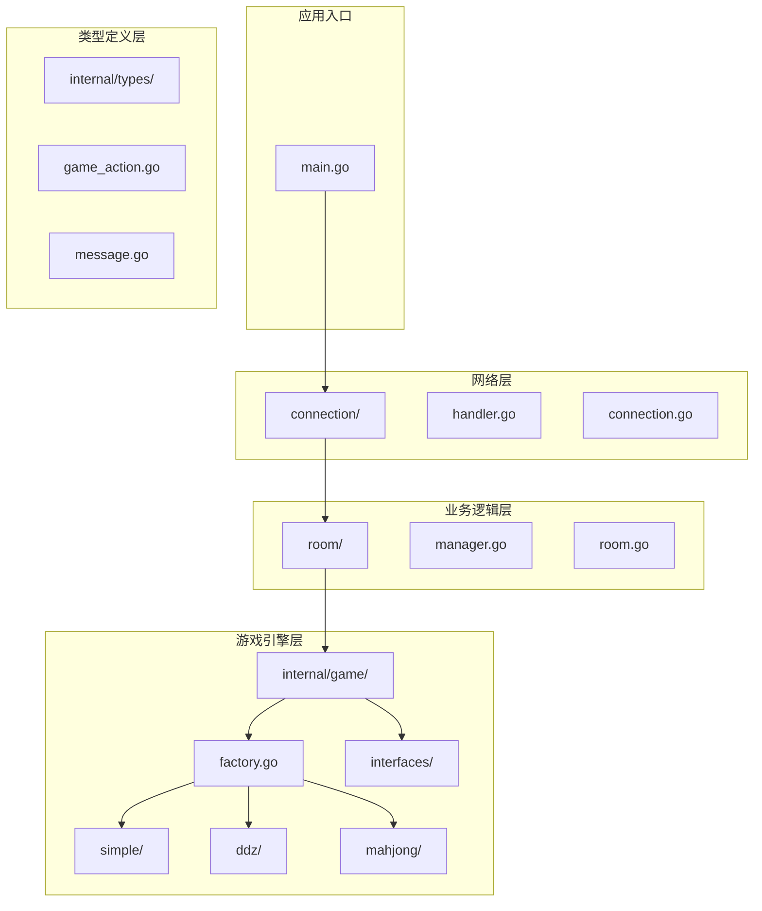
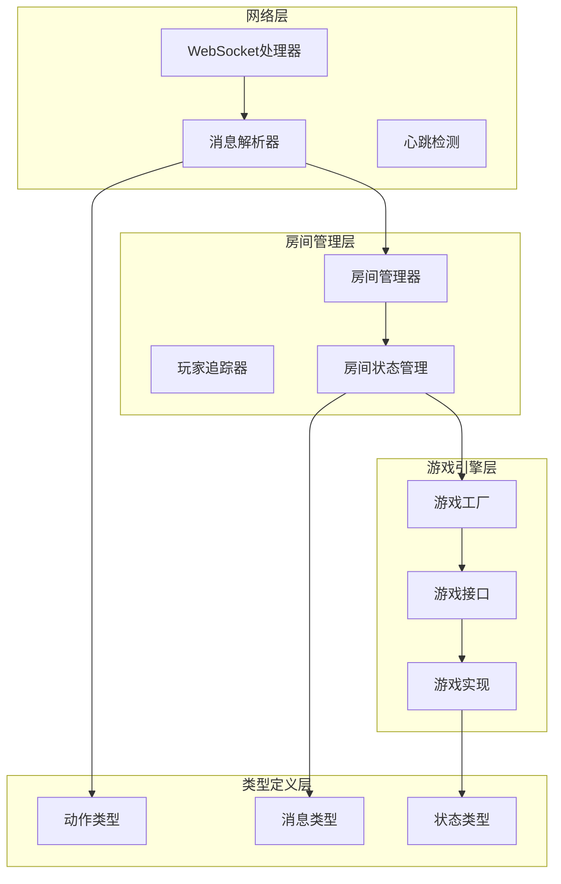
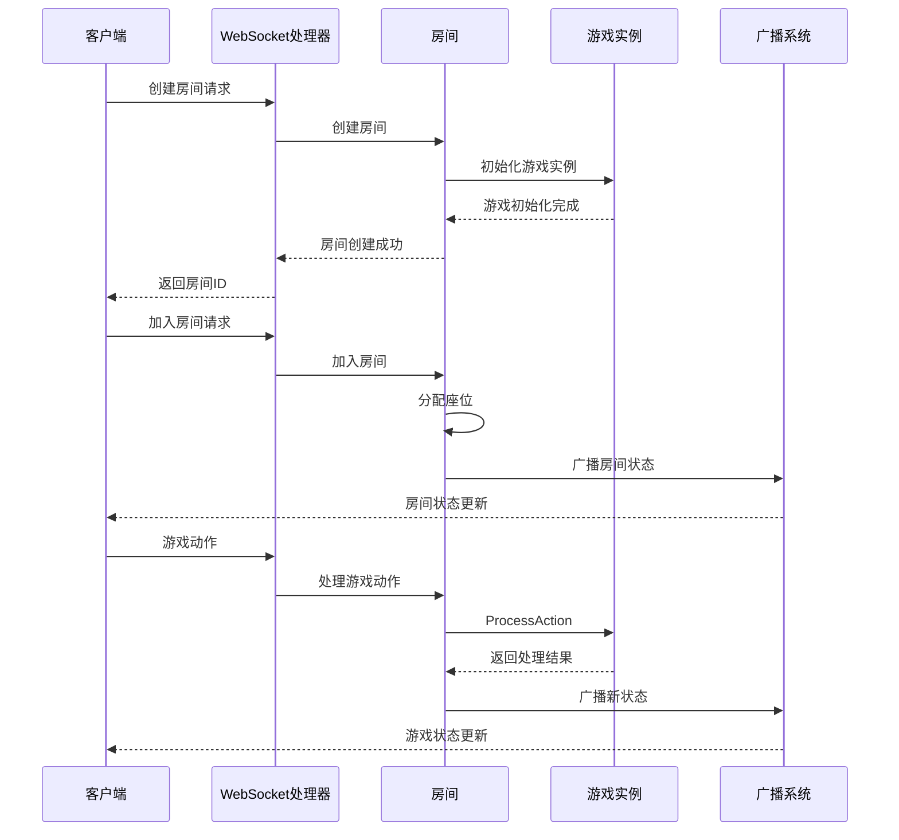
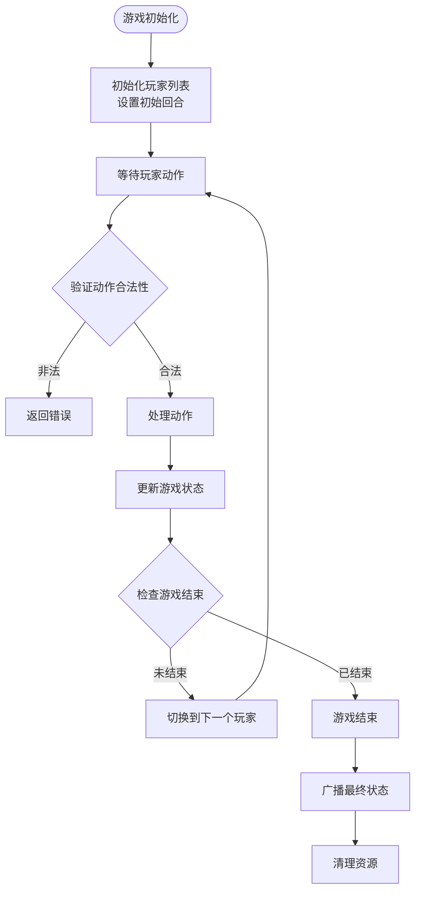
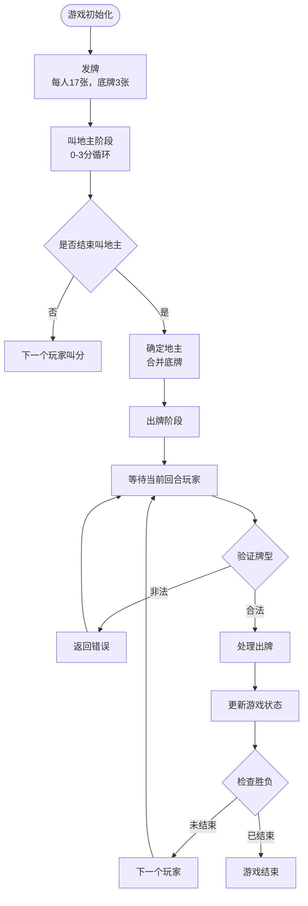
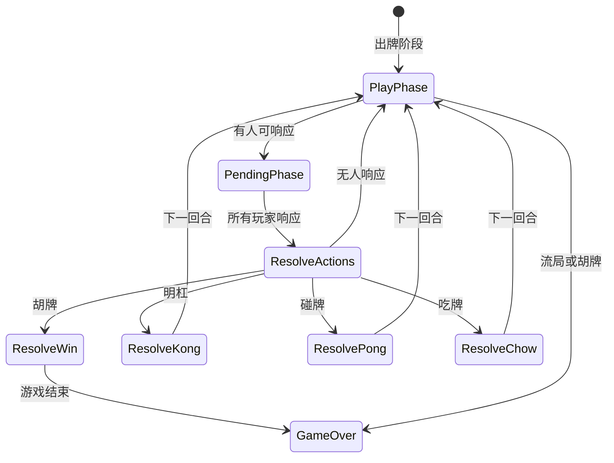
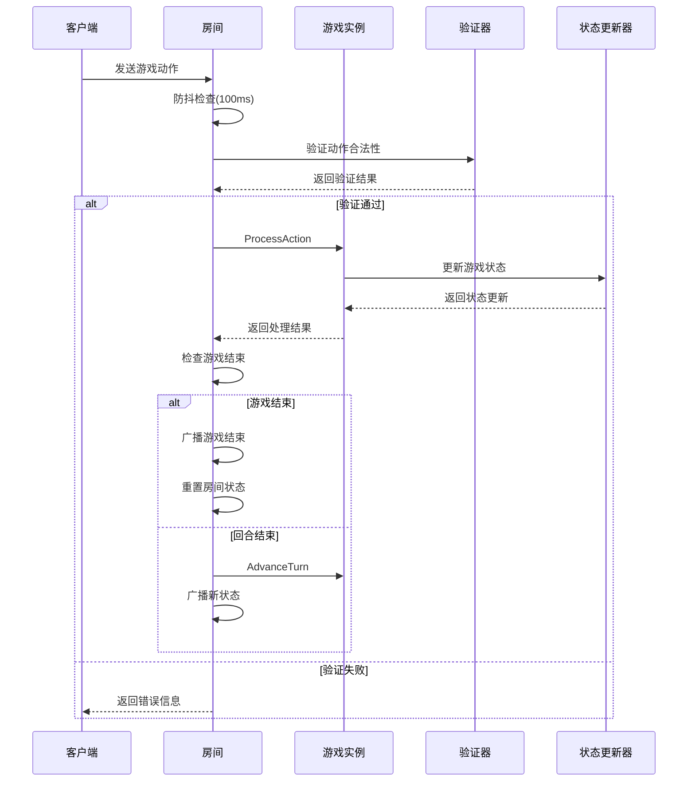
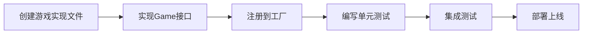
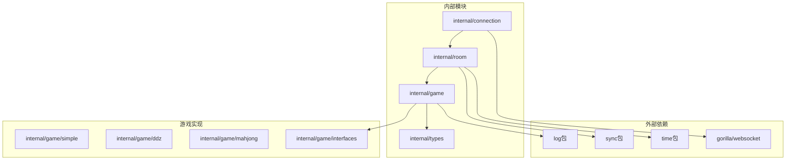

# 游戏引擎

<cite>
**本文档引用的文件**
- [factory.go](file://internal/game/factory.go)
- [game.go](file://internal/game/interfaces/game.go)
- [game.go](file://internal/game/simple/game.go)
- [game.go](file://internal/game/mahjong/game.go)
- [game.go](file://internal/game/ddz/game.go)
- [game_action.go](file://internal/types/game_action.go)
- [message.go](file://internal/types/message.go)
- [manager.go](file://internal/room/manager.go)
- [room.go](file://internal/room/room.go)
- [connection.go](file://internal/connection/connection.go)
- [handler.go](file://internal/connection/handler.go)
- [main.go](file://main.go)
- [game_test.go](file://internal/game/mahjong/game_test.go)
</cite>

## 目录
1. [简介](#简介)
2. [项目结构](#项目结构)
3. [核心组件](#核心组件)
4. [架构概览](#架构概览)
5. [详细组件分析](#详细组件分析)
6. [依赖关系分析](#依赖关系分析)
7. [性能考虑](#性能考虑)
8. [故障排除指南](#故障排除指南)
9. [结论](#结论)
10. [附录](#附录)

## 简介

这是一个基于Go语言开发的卡牌游戏服务器引擎，支持多种卡牌游戏类型，包括简单的纸牌游戏、斗地主和麻将。该引擎采用工厂模式设计，提供了统一的游戏接口规范，实现了游戏状态管理、动作处理和并发控制等功能。

## 项目结构

项目采用模块化的目录结构，按照功能层次组织代码：



**图表来源**
- [main.go](file://main.go#L1-L15)
- [handler.go](file://internal/connection/handler.go#L1-L50)
- [room.go](file://internal/room/room.go#L1-L30)
- [factory.go](file://internal/game/factory.go#L1-L24)

**章节来源**
- [main.go](file://main.go#L1-L15)
- [handler.go](file://internal/connection/handler.go#L1-L50)
- [room.go](file://internal/room/room.go#L1-L30)

## 核心组件

### 工厂模式设计

游戏引擎的核心是工厂模式，负责创建不同类型的游戏实例：

```mermaid
classDiagram
class GameFactory {
+NewGame(gameType string) Game
-simpleGames map[string]Game
-ddzGames map[string]Game
-mahjongGames map[string]Game
}
class Game {
<<interface>>
+ID() string
+Init(players []string) error
+ProcessAction(playerID string, action interface{}) (bool, error)
+CurrentTurn() string
+AdvanceTurn() void
+GetState() interface{}
+GetStateForPlayer(playerID string) interface{}
+IsGameOver() bool
+Winner() string
+MaxPlayers() int
+MinPlayers() int
}
class SimpleGame {
-players []string
-turnIndex int
-lastCard int
-hands map[string][]int
-gameOver bool
-winner string
+ProcessAction(playerID string, action interface{}) (bool, error)
+GetState() interface{}
+GetStateForPlayer(playerID string) interface{}
}
class DdzGame {
-players []string
-hands map[string]Hand
-bottomCards Hand
-landlord string
-phase string
+ProcessAction(playerID string, action interface{}) (bool, error)
+GetState() interface{}
}
class MahjongGame {
-players []string
-hands [4]Tiles
-melds [4][]Meld
-discards [4]Tiles
-wall Tiles
-phase string
-currentSeat int
+ProcessAction(playerID string, action interface{}) (bool, error)
+GetState() interface{}
}
GameFactory --> Game : creates
Game <|.. SimpleGame
Game <|.. DdzGame
Game <|.. MahjongGame
```

**图表来源**
- [factory.go](file://internal/game/factory.go#L11-L23)
- [game.go](file://internal/game/interfaces/game.go#L3-L16)
- [game.go](file://internal/game/simple/game.go#L8-L15)
- [game.go](file://internal/game/ddz/game.go#L20-L35)
- [game.go](file://internal/game/mahjong/game.go#L52-L77)

### 统一接口规范

所有游戏实现都遵循相同的接口规范，确保了系统的可扩展性和一致性：

**章节来源**
- [game.go](file://internal/game/interfaces/game.go#L3-L16)

## 架构概览

系统采用分层架构设计，从底层到高层依次为：网络层、房间管理层、游戏引擎层和类型定义层。



**图表来源**
- [handler.go](file://internal/connection/handler.go#L19-L158)
- [manager.go](file://internal/room/manager.go#L47-L52)
- [room.go](file://internal/room/room.go#L35-L57)
- [factory.go](file://internal/game/factory.go#L11-L23)

## 详细组件分析

### 房间管理系统

房间管理系统负责维护游戏房间的状态和生命周期：



**图表来源**
- [handler.go](file://internal/connection/handler.go#L160-L221)
- [room.go](file://internal/room/room.go#L462-L523)

#### 房间状态管理

房间支持以下状态：
- 等待中（waiting）：可加入、可准备
- 游戏中（playing）：游戏进行中
- 暂停（paused）：有玩家断线
- 游戏结束（gameover）：游戏已完成

**章节来源**
- [room.go](file://internal/room/room.go#L14-L11)
- [room.go](file://internal/room/room.go#L462-L523)

### 游戏状态管理机制

#### 简单游戏状态管理

简单游戏实现了基本的状态跟踪和回合管理：



**图表来源**
- [game.go](file://internal/game/simple/game.go#L26-L65)

#### 斗地主状态管理

斗地主实现了复杂的牌型判断和回合管理：



**图表来源**
- [game.go](file://internal/game/ddz/game.go#L52-L73)
- [game.go](file://internal/game/ddz/game.go#L125-L293)

#### 麻将状态管理

麻将实现了最复杂的状态管理，包括等待响应阶段：



**图表来源**
- [game.go](file://internal/game/mahjong/game.go#L11-L25)
- [game.go](file://internal/game/mahjong/game.go#L142-L161)

**章节来源**
- [game.go](file://internal/game/simple/game.go#L26-L92)
- [game.go](file://internal/game/ddz/game.go#L52-L293)
- [game.go](file://internal/game/mahjong/game.go#L11-L77)

### 游戏动作处理流程

#### 统一动作处理机制

所有游戏都遵循相同的动作处理流程：



**图表来源**
- [room.go](file://internal/room/room.go#L462-L523)
- [room.go](file://internal/room/room.go#L526-L538)

#### 动作类型定义

系统定义了统一的动作类型枚举：

**章节来源**
- [game_action.go](file://internal/types/game_action.go#L6-L18)

### 扩展机制

#### 添加新游戏类型的步骤

要添加新的游戏类型，需要遵循以下步骤：

1. **创建游戏实现文件**：在 `internal/game/` 目录下创建新游戏的实现文件
2. **实现Game接口**：确保新游戏实现所有必需的方法
3. **注册到工厂**：在工厂函数中添加新游戏类型的分支
4. **测试新游戏**：编写单元测试验证游戏逻辑



**图表来源**
- [factory.go](file://internal/game/factory.go#L11-L23)

**章节来源**
- [factory.go](file://internal/game/factory.go#L11-L23)

## 依赖关系分析



**图表来源**
- [handler.go](file://internal/connection/handler.go#L3-L13)
- [room.go](file://internal/room/room.go#L3-L12)
- [game.go](file://internal/game/interfaces/game.go#L1-L3)

**章节来源**
- [handler.go](file://internal/connection/handler.go#L3-L13)
- [room.go](file://internal/room/room.go#L3-L12)

## 性能考虑

### 并发处理

系统采用了多层并发控制机制：

1. **房间级互斥锁**：保护房间状态的原子性访问
2. **全局追踪器互斥锁**：保护玩家房间映射的线程安全
3. **广播通道缓冲**：使用带缓冲的通道避免阻塞

### 内存优化

1. **状态数据结构**：使用紧凑的数据结构存储游戏状态
2. **消息队列**：合理设置消息队列容量，避免内存泄漏
3. **资源清理**：及时清理断线玩家的资源

### 网络优化

1. **心跳检测**：60秒超时机制确保连接健康
2. **防抖机制**：100ms防抖避免重复操作
3. **批量广播**：使用广播通道减少消息发送开销

## 故障排除指南

### 常见问题及解决方案

#### 房间管理问题

| 问题 | 可能原因 | 解决方案 |
|------|----------|----------|
| 房间创建失败 | 游戏类型不支持 | 检查工厂中的游戏类型注册 |
| 玩家加入失败 | 房间已满或正在游戏中 | 检查房间状态和最大玩家数 |
| 玩家断线 | 心跳超时或网络异常 | 检查心跳检测和网络连接 |

#### 游戏逻辑问题

| 问题 | 可能原因 | 解决方案 |
|------|----------|----------|
| 动作验证失败 | 玩家非当前回合 | 检查CurrentTurn方法 |
| 牌型判断错误 | 牌型算法问题 | 检查牌型判断函数 |
| 状态更新异常 | 并发访问冲突 | 检查互斥锁使用 |

**章节来源**
- [room.go](file://internal/room/room.go#L462-L523)
- [manager.go](file://internal/room/manager.go#L9-L15)

## 结论

这个卡牌游戏服务器引擎展现了良好的软件工程实践，采用了工厂模式、接口抽象和分层架构等设计原则。系统具有以下特点：

1. **高度可扩展**：通过工厂模式轻松添加新的游戏类型
2. **强类型安全**：严格的接口定义确保类型安全
3. **并发友好**：完善的并发控制机制
4. **易于维护**：清晰的模块划分和职责分离

## 附录

### 开发者使用指南

#### 创建新游戏类型

1. 在 `internal/game/` 下创建新目录
2. 实现 `Game` 接口的所有方法
3. 在 `factory.go` 中注册新游戏类型
4. 编写完整的单元测试

#### 自定义规则

1. 修改对应游戏的 `ProcessAction` 方法
2. 更新状态查询方法
3. 添加必要的验证逻辑
4. 编写测试用例验证新规则

#### 性能优化建议

1. 优化数据结构选择
2. 减少不必要的对象分配
3. 使用池化技术复用对象
4. 监控内存使用情况