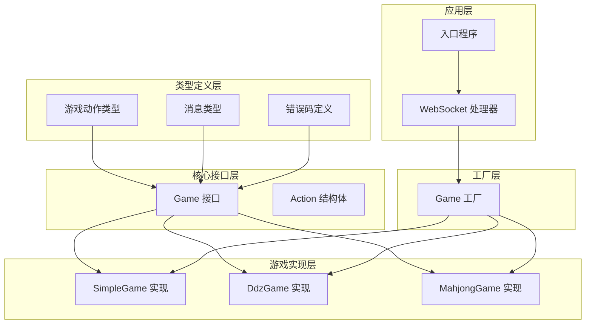
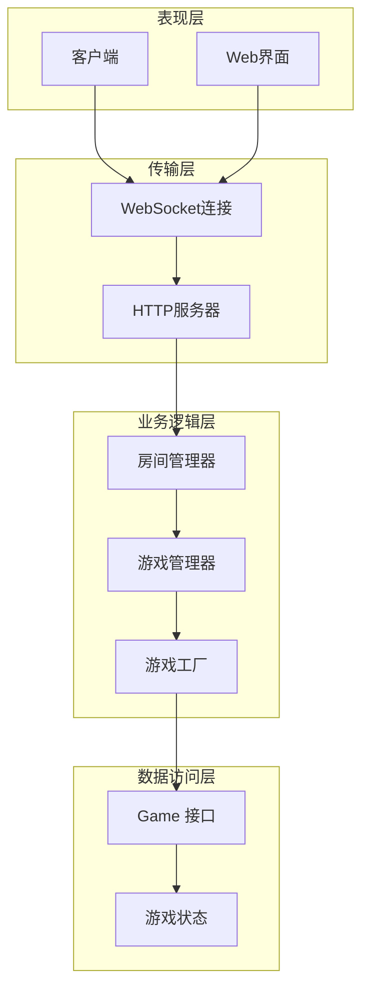
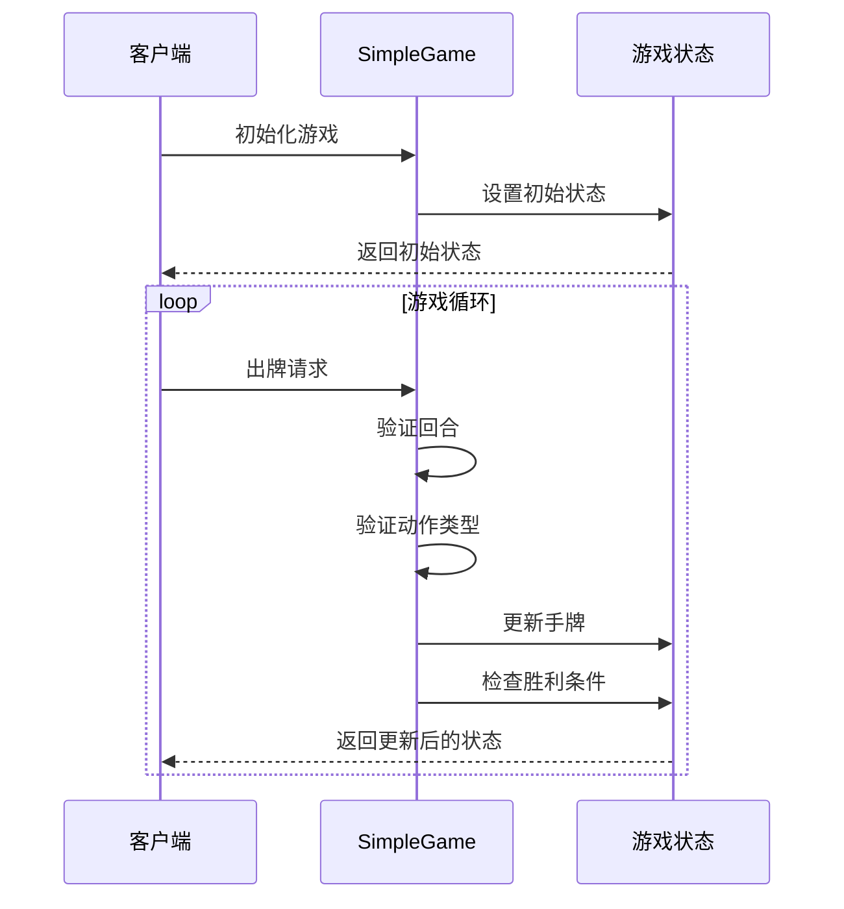
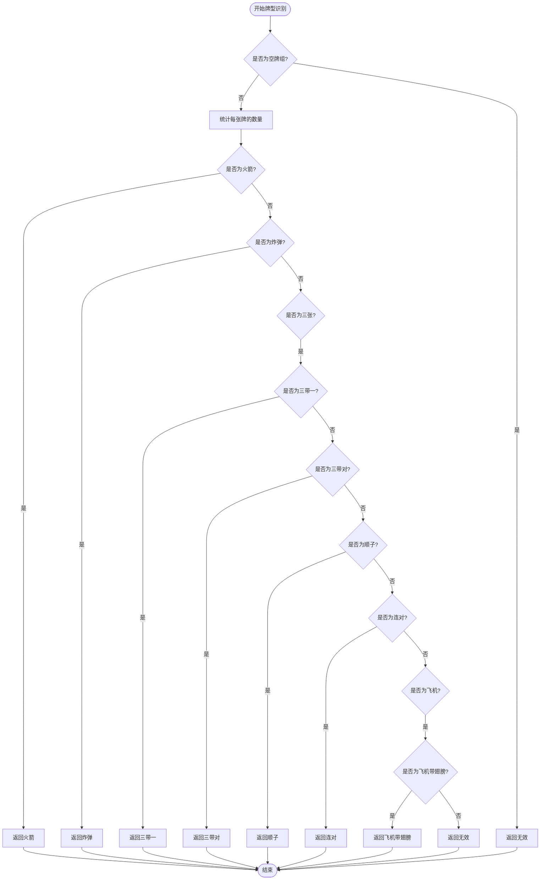
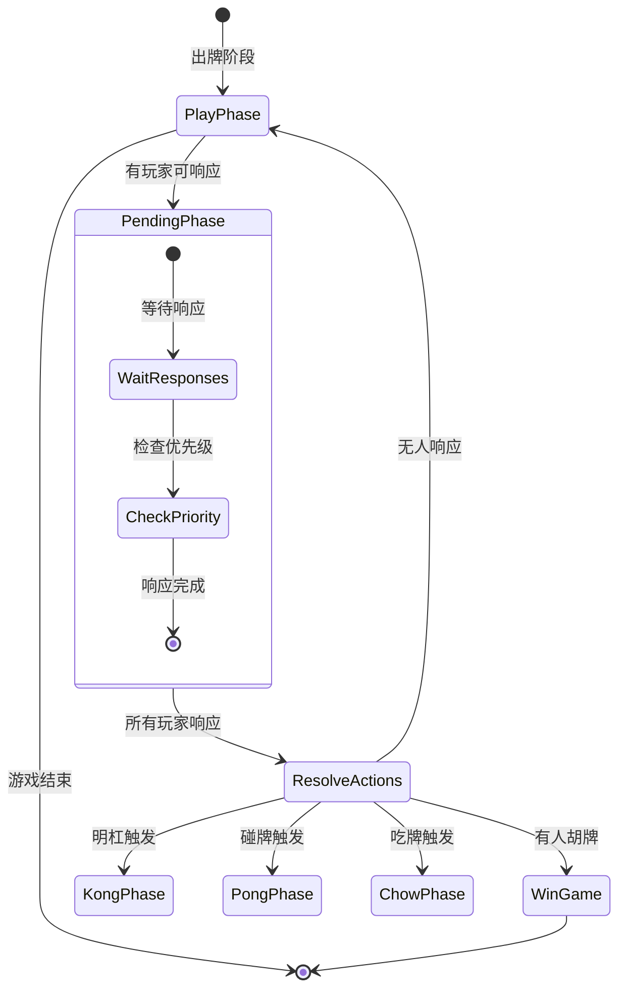
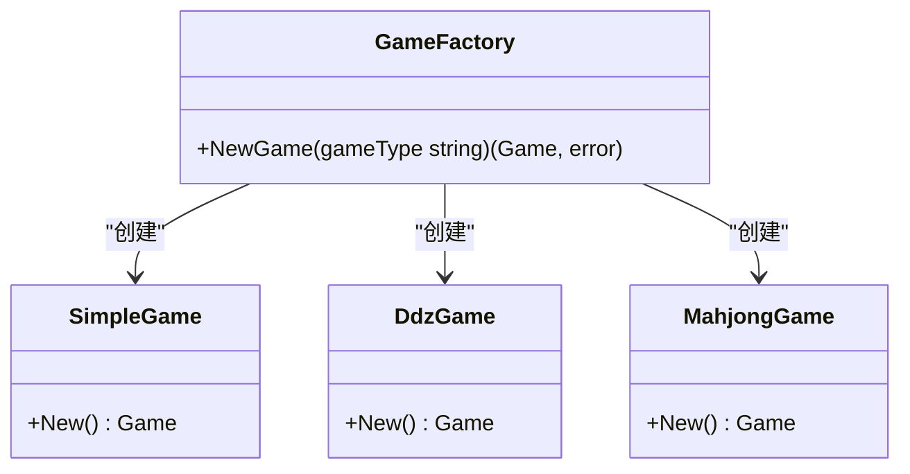
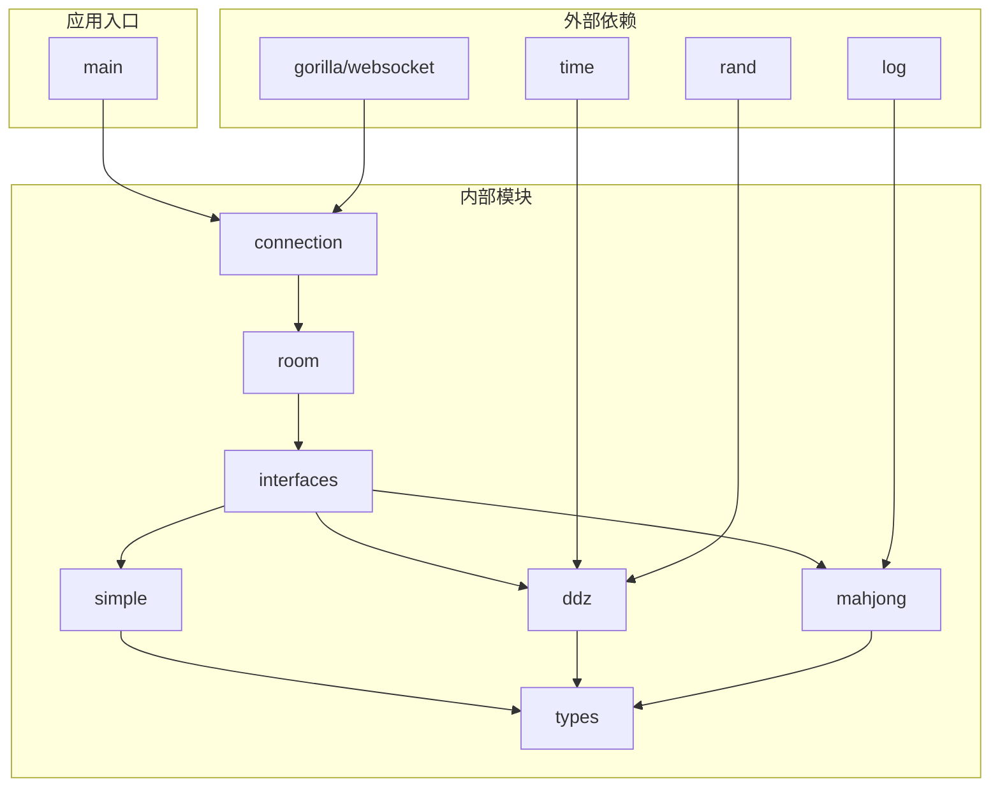

# 统一游戏接口

<cite>
**本文档引用的文件**
- [internal/game/interfaces/game.go](file://internal/game/interfaces/game.go)
- [internal/game/factory.go](file://internal/game/factory.go)
- [internal/game/mahjong/game.go](file://internal/game/mahjong/game.go)
- [internal/game/ddz/game.go](file://internal/game/ddz/game.go)
- [internal/game/simple/game.go](file://internal/game/simple/game.go)
- [internal/types/game_action.go](file://internal/types/game_action.go)
- [internal/types/message.go](file://internal/types/message.go)
- [internal/types/error.go](file://internal/types/error.go)
- [README.md](file://README.md)
- [main.go](file://main.go)
</cite>

## 目录
1. [简介](#简介)
2. [项目结构](#项目结构)
3. [核心组件](#核心组件)
4. [架构概览](#架构概览)
5. [详细组件分析](#详细组件分析)
6. [依赖关系分析](#依赖关系分析)
7. [性能考虑](#性能考虑)
8. [故障排除指南](#故障排除指南)
9. [结论](#结论)
10. [附录](#附录)

## 简介

统一游戏接口是这个卡牌游戏服务器的核心抽象层，它为所有游戏类型提供了标准化的接口规范。该接口设计旨在实现以下目标：

- **统一抽象**：为不同类型的卡牌游戏提供一致的编程模型
- **多态实现**：支持多种游戏规则的灵活实现
- **类型安全**：通过接口约束确保实现的一致性和可靠性
- **扩展性**：便于添加新的游戏类型而无需修改现有代码

该接口目前支持三种游戏类型：简易卡牌游戏、斗地主和麻将，每种游戏都有其独特的规则实现，但都遵循相同的接口规范。

## 项目结构

该项目采用模块化的架构设计，核心结构如下：



**图表来源**
- [internal/game/interfaces/game.go](file://internal/game/interfaces/game.go#L1-L23)
- [internal/game/factory.go](file://internal/game/factory.go#L1-L24)
- [internal/game/simple/game.go](file://internal/game/simple/game.go#L1-L102)
- [internal/game/ddz/game.go](file://internal/game/ddz/game.go#L1-L841)
- [internal/game/mahjong/game.go](file://internal/game/mahjong/game.go#L1-L805)

**章节来源**
- [README.md](file://README.md#L20-L50)
- [main.go](file://main.go#L1-L15)

## 核心组件

### Game 接口设计

Game 接口是整个系统的核心抽象，定义了所有卡牌游戏必须实现的标准方法：

```mermaid
classDiagram
class Game {
<<interface>>
+ID() string
+Init(players []string) error
+ProcessAction(playerID string, action interface{}) (bool, error)
+CurrentTurn() string
+AdvanceTurn()
+GetState() interface{}
+GetStateForPlayer(playerID string) interface{}
+IsGameOver() bool
+Winner() string
+MaxPlayers() int
+MinPlayers() int
}
class SimpleGame {
-players []string
-turnIndex int
-lastCard int
-hands map[string][]int
-gameOver bool
-winner string
+ID() string
+Init(players []string) error
+ProcessAction(playerID string, action interface{}) (bool, error)
+CurrentTurn() string
+AdvanceTurn()
+GetState() interface{}
+GetStateForPlayer(playerID string) interface{}
+IsGameOver() bool
+Winner() string
+MaxPlayers() int
+MinPlayers() int
}
class DdzGame {
-players []string
-playerSeats map[string]int
-hands map[string]Hand
-bottomCards Hand
-landlord string
-calls map[string]int
-callTurn int
-outTurn int
-lastPlay Play
-lastPlayer string
-passCount int
-phase string
-gameOver bool
-winner string
+ID() string
+Init(players []string) error
+ProcessAction(playerID string, action interface{}) (bool, error)
+CurrentTurn() string
+AdvanceTurn()
+GetState() interface{}
+GetStateForPlayer(playerID string) interface{}
+IsGameOver() bool
+Winner() string
+MaxPlayers() int
+MinPlayers() int
}
class MahjongGame {
-players []string
-playerSeats map[string]int
-hands [4]Tiles
-melds [4][]Meld
-discards [4]Tiles
-wall Tiles
-dealerSeat int
-currentSeat int
-phase string
-lastDiscard *Tile
-lastDiscardSeat int
-pendingActions map[int][]string
-pendingResponses map[int]*PendingResponse
-pendingChowData map[int]interface{}
-gameOver bool
-winner string
-winResult *WinResult
+ID() string
+Init(players []string) error
+ProcessAction(playerID string, action interface{}) (bool, error)
+CurrentTurn() string
+AdvanceTurn()
+GetState() interface{}
+GetStateForPlayer(playerID string) interface{}
+IsGameOver() bool
+Winner() string
+MaxPlayers() int
+MinPlayers() int
}
Game <|.. SimpleGame
Game <|.. DdzGame
Game <|.. MahjongGame
```

**图表来源**
- [internal/game/interfaces/game.go](file://internal/game/interfaces/game.go#L4-L16)
- [internal/game/simple/game.go](file://internal/game/simple/game.go#L8-L15)
- [internal/game/ddz/game.go](file://internal/game/ddz/game.go#L20-L35)
- [internal/game/mahjong/game.go](file://internal/game/mahjong/game.go#L52-L77)

### Action 结构体

Action 结构体提供了统一的游戏动作封装：

```mermaid
classDiagram
class Action {
+string Type
+interface{} Data
}
class GameActionType {
<<enumeration>>
+PlayCard
+PlayCards
+Pass
+CallLandlord
+Discard
+Chow
+Pong
+Kong
+Win
}
Action --> GameActionType : "uses"
```

**图表来源**
- [internal/game/interfaces/game.go](file://internal/game/interfaces/game.go#L18-L23)
- [internal/types/game_action.go](file://internal/types/game_action.go#L4-L19)

**章节来源**
- [internal/game/interfaces/game.go](file://internal/game/interfaces/game.go#L1-L23)
- [internal/types/game_action.go](file://internal/types/game_action.go#L1-L19)

## 架构概览

系统采用分层架构设计，实现了清晰的关注点分离：



**图表来源**
- [main.go](file://main.go#L10-L14)
- [internal/game/factory.go](file://internal/game/factory.go#L11-L23)
- [internal/types/message.go](file://internal/types/message.go#L33-L38)

## 详细组件分析

### 简易游戏实现 (SimpleGame)

SimpleGame 是最简单的游戏实现，展示了接口的基本使用方式：

#### 核心功能实现



**图表来源**
- [internal/game/simple/game.go](file://internal/game/simple/game.go#L26-L65)

#### 关键特性

- **简单规则**：2人对战，简单的卡牌比较
- **状态管理**：维护当前回合、最后出牌、手牌等状态
- **类型安全**：严格的数据类型验证

**章节来源**
- [internal/game/simple/game.go](file://internal/game/simple/game.go#L1-L102)

### 斗地主实现 (DdzGame)

DdzGame 实现了复杂的斗地主规则，包括叫分、出牌、牌型判断等功能：

#### 牌型识别算法



**图表来源**
- [internal/game/ddz/game.go](file://internal/game/ddz/game.go#L381-L463)

#### 关键特性

- **复杂规则**：支持完整的斗地主规则
- **智能牌型识别**：自动识别各种牌型
- **回合管理**：精确的叫分和出牌回合控制

**章节来源**
- [internal/game/ddz/game.go](file://internal/game/ddz/game.go#L1-L841)

### 麻将实现 (MahjongGame)

MahjongGame 实现了最复杂的麻将规则，包括吃碰杠胡、番数计算、等待响应等高级功能：

#### 游戏阶段流程



**图表来源**
- [internal/game/mahjong/game.go](file://internal/game/mahjong/game.go#L11-L25)
- [internal/game/mahjong/game.go](file://internal/game/mahjong/game.go#L154-L161)

#### 关键特性

- **高级规则**：完整的麻将规则实现
- **等待响应机制**：支持多玩家同时响应
- **番数计算**：复杂的胡牌番数计算
- **座位系统**：4人座位制管理

**章节来源**
- [internal/game/mahjong/game.go](file://internal/game/mahjong/game.go#L1-L805)

### 游戏工厂 (GameFactory)

GameFactory 提供了统一的游戏创建接口：



**图表来源**
- [internal/game/factory.go](file://internal/game/factory.go#L11-L23)

**章节来源**
- [internal/game/factory.go](file://internal/game/factory.go#L1-L24)

## 依赖关系分析

系统采用了清晰的依赖层次结构：



**图表来源**
- [internal/game/simple/game.go](file://internal/game/simple/game.go#L3-L6)
- [internal/game/ddz/game.go](file://internal/game/ddz/game.go#L3-L11)
- [internal/game/mahjong/game.go](file://internal/game/mahjong/game.go#L3-L9)

**章节来源**
- [internal/game/simple/game.go](file://internal/game/simple/game.go#L1-L102)
- [internal/game/ddz/game.go](file://internal/game/ddz/game.go#L1-L841)
- [internal/game/mahjong/game.go](file://internal/game/mahjong/game.go#L1-L805)

## 性能考虑

### 时间复杂度分析

| 操作 | SimpleGame | DdzGame | MahjongGame |
|------|------------|---------|-------------|
| 初始化 | O(n) | O(1) | O(1) |
| 出牌处理 | O(1) | O(n log n) | O(1) |
| 状态查询 | O(n) | O(n) | O(n) |
| 牌型识别 | - | O(n) | - |

### 内存使用优化

1. **状态共享**：Game 接口返回的状态对象避免了重复数据传输
2. **延迟加载**：玩家特定状态仅在需要时提供
3. **数据结构优化**：使用切片和映射优化查找性能

### 并发安全性

- **接口一致性**：所有实现都遵循相同的并发安全要求
- **状态隔离**：每个游戏实例维护独立的状态
- **无共享可变状态**：减少竞态条件的可能性

## 故障排除指南

### 常见错误类型

| 错误码 | 含义 | 可能原因 | 解决方案 |
|--------|------|----------|----------|
| 400 | 无效数据 | 请求格式错误 | 验证请求格式和数据类型 |
| 403 | 加入失败 | 房间已满或权限不足 | 检查房间状态和玩家权限 |
| 404 | 房间不存在 | 房间ID错误 | 验证房间ID有效性 |
| 409 | 已在房间 | 玩家重复加入 | 检查玩家状态 |
| 410 | 玩家已连接 | 重复连接 | 处理断线重连逻辑 |
| 411 | 玩家不在房间 | 状态不一致 | 同步房间状态 |
| 501 | 未实现 | 功能尚未实现 | 检查接口实现完整性 |
| 500 | 内部错误 | 系统异常 | 查看日志并重启服务 |

### 调试建议

1. **启用日志**：在开发环境中启用详细的日志输出
2. **单元测试**：为每个游戏实现编写充分的测试用例
3. **状态监控**：定期检查游戏状态的一致性
4. **性能分析**：使用Go的pprof工具分析性能瓶颈

**章节来源**
- [internal/types/error.go](file://internal/types/error.go#L1-L13)

## 结论

统一游戏接口设计成功地实现了以下目标：

1. **抽象统一**：为不同游戏提供了统一的编程模型
2. **扩展性强**：易于添加新的游戏类型
3. **类型安全**：通过接口约束确保实现质量
4. **性能优化**：合理的数据结构和算法选择

该接口设计为卡牌游戏服务器提供了坚实的基础，支持多种游戏类型的灵活实现，同时保持了系统的可维护性和可扩展性。

## 附录

### 接口实现指南

#### 新增游戏类型步骤

1. **创建游戏目录**：在 `internal/game/` 下创建新目录
2. **实现接口**：创建 `game.go` 文件并实现 `interfaces.Game` 接口
3. **注册工厂**：在 `factory.go` 中添加新的游戏类型分支
4. **测试验证**：编写单元测试确保功能正确性
5. **文档更新**：更新相关文档和示例代码

#### 最佳实践

1. **状态管理**：保持状态的原子性和一致性
2. **错误处理**：提供清晰的错误信息和适当的错误码
3. **性能优化**：避免不必要的数据复制和转换
4. **测试覆盖**：确保关键路径都有相应的测试用例
5. **文档维护**：及时更新接口文档和使用示例

### 扩展机制

#### 向后兼容性考虑

1. **接口演进**：新增方法时保持向后兼容
2. **默认实现**：为新方法提供合理的默认行为
3. **版本控制**：通过游戏ID版本号管理不同版本
4. **迁移策略**：提供平滑的升级路径

#### 插件式架构

系统支持插件式的扩展机制，可以通过以下方式实现：

1. **动态加载**：支持运行时加载新的游戏实现
2. **配置驱动**：通过配置文件控制游戏类型和参数
3. **接口隔离**：确保新游戏不影响现有功能
4. **测试隔离**：提供独立的测试环境