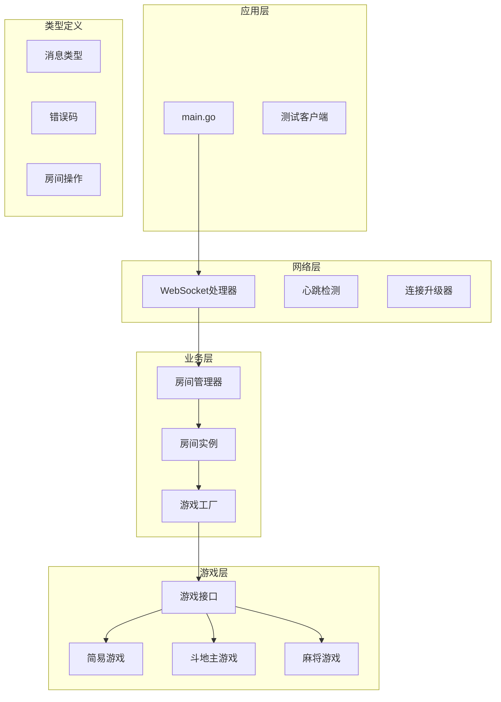
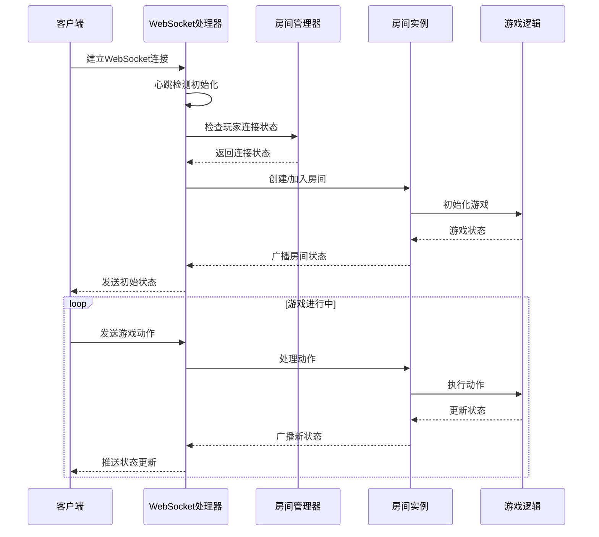
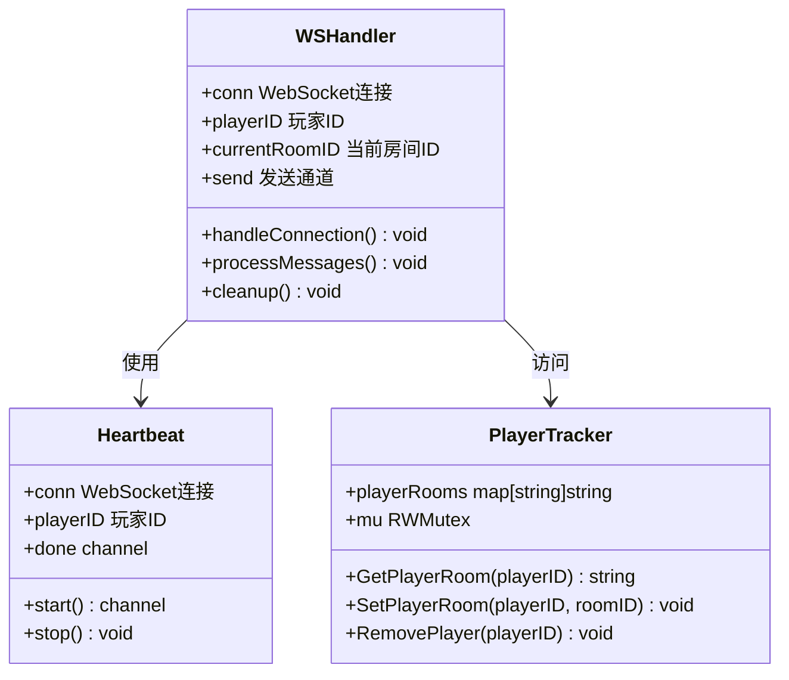
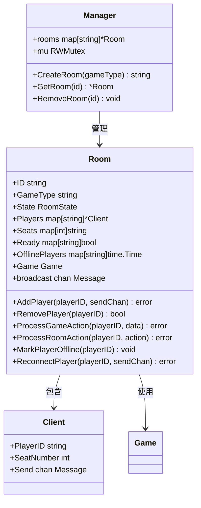

# 故障排查

<cite>
**本文档引用的文件**
- [main.go](file://main.go)
- [connection.go](file://internal/connection/connection.go)
- [handler.go](file://internal/connection/handler.go)
- [manager.go](file://internal/room/manager.go)
- [room.go](file://internal/room/room.go)
- [error.go](file://internal/types/error.go)
- [message.go](file://internal/types/message.go)
- [room_action.go](file://internal/types/room_action.go)
- [factory.go](file://internal/game/factory.go)
- [game.go](file://internal/game/interfaces/game.go)
- [simple.go](file://internal/game/simple/game.go)
- [ddz.go](file://internal/game/ddz/game.go)
- [mahjong.go](file://internal/game/mahjong/game.go)
- [README.md](file://README.md)
</cite>

## 目录
1. [简介](#简介)
2. [项目结构](#项目结构)
3. [核心组件](#核心组件)
4. [架构概览](#架构概览)
5. [详细组件分析](#详细组件分析)
6. [故障排查流程](#故障排查流程)
7. [性能问题诊断](#性能问题诊断)
8. [应急响应流程](#应急响应流程)
9. [维护窗口规划](#维护窗口规划)
10. [故障案例分析](#故障案例分析)
11. [结论](#结论)

## 简介

这是一个基于 Go 和 WebSocket 的多人在线卡牌游戏服务器，支持斗地主、麻将等多种游戏模式。系统采用模块化设计，通过接口抽象实现了可扩展的游戏架构。本文档提供了全面的故障排查和维护指南，帮助运维人员快速定位和解决系统问题。

## 项目结构

系统采用清晰的分层架构设计：

**图表来源**
- [main.go](file://main.go#L1-L15)
- [handler.go](file://internal/connection/handler.go#L19-L158)
- [manager.go](file://internal/room/manager.go#L47-L83)
- [room.go](file://internal/room/room.go#L35-L57)

**章节来源**
- [README.md](file://README.md#L20-L50)

## 核心组件

### WebSocket 连接管理

系统使用 gorilla/websocket 库实现高效的 WebSocket 通信，具备以下特性：

- **连接池管理**：防止同一玩家ID重复连接
- **心跳检测**：60秒无活动自动断开连接
- **断线重连**：支持30秒内的断线恢复
- **消息队列**：使用带缓冲的通道处理消息发送

### 房间管理系统

房间管理器提供完整的房间生命周期管理：

- **全局追踪**：PlayerRoomTracker 追踪玩家所在房间
- **房间状态**：waiting、playing、paused、gameover 四种状态
- **座位管理**：支持2-4人的座位分配
- **准备系统**：玩家准备状态管理

### 游戏工厂模式

通过工厂模式实现游戏类型的动态加载：

- **简单游戏**：2人对战，适合测试
- **斗地主**：3人经典玩法
- **麻将**：4人国标简化版

**章节来源**
- [connection.go](file://internal/connection/connection.go#L10-L62)
- [manager.go](file://internal/room/manager.go#L17-L83)
- [factory.go](file://internal/game/factory.go#L11-L24)

## 架构概览

**图表来源**
- [handler.go](file://internal/connection/handler.go#L19-L158)
- [room.go](file://internal/room/room.go#L462-L523)

## 详细组件分析

### 连接处理组件

连接处理组件负责WebSocket连接的建立、维护和清理：

**图表来源**
- [handler.go](file://internal/connection/handler.go#L19-L158)
- [connection.go](file://internal/connection/connection.go#L10-L62)

### 房间管理组件

房间管理组件提供完整的房间生命周期管理：

**图表来源**
- [room.go](file://internal/room/room.go#L14-L57)
- [manager.go](file://internal/room/manager.go#L47-L83)

**章节来源**
- [handler.go](file://internal/connection/handler.go#L19-L158)
- [room.go](file://internal/room/room.go#L14-L57)

## 故障排查流程

### 连接失败排查

#### 1. WebSocket连接建立失败

**症状表现**：
- 客户端无法连接到 `/ws` 端点
- 服务器日志显示连接错误

**排查步骤**：
1. 检查服务器端口监听状态
2. 验证WebSocket升级过程
3. 检查CORS配置
4. 确认玩家ID参数传递

**根因分析**：
- 端口被占用或防火墙阻止
- WebSocket升级失败
- CORS策略限制
- URL参数缺失

**解决方案**：
- 检查端口占用情况
- 验证网络连通性
- 调整CORS配置
- 确保URL参数正确

#### 2. 心跳检测超时

**症状表现**：
- 连接在60秒内自动断开
- 服务器日志显示心跳超时

**排查步骤**：
1. 检查客户端网络状况
2. 验证心跳包发送频率
3. 检查服务器负载情况

**根因分析**：
- 客户端网络不稳定
- 服务器CPU负载过高
- 网络延迟过大

**解决方案**：
- 优化客户端网络配置
- 增加服务器资源
- 调整心跳检测参数

**章节来源**
- [connection.go](file://internal/connection/connection.go#L32-L62)
- [handler.go](file://internal/connection/handler.go#L95-L101)

### 消息丢失排查

#### 1. 房间状态不同步

**症状表现**：
- 玩家看到的房间状态不一致
- 广播消息发送失败

**排查步骤**：
1. 检查广播通道状态
2. 验证消息队列容量
3. 监控断线玩家处理

**根因分析**：
- 广播通道阻塞
- 消息队列溢出
- 断线玩家消息过滤

**解决方案**：
- 增加广播通道缓冲
- 实施消息队列监控
- 优化断线处理逻辑

#### 2. 游戏动作处理异常

**症状表现**：
- 玩家动作无法执行
- 游戏状态更新失败

**排查步骤**：
1. 检查房间状态验证
2. 验证游戏动作参数
3. 监控游戏逻辑执行

**根因分析**：
- 房间状态不符合要求
- 动作参数格式错误
- 游戏逻辑异常

**解决方案**：
- 实施更严格的参数验证
- 增加错误处理机制
- 优化游戏状态检查

**章节来源**
- [room.go](file://internal/room/room.go#L98-L131)
- [room.go](file://internal/room/room.go#L462-L523)

### 游戏状态异常排查

#### 1. 断线重连问题

**症状表现**：
- 玩家断线后无法重连
- 游戏状态恢复异常

**排查步骤**：
1. 检查断线标记状态
2. 验证重连玩家ID
3. 监控定时器状态

**根因分析**：
- 断线标记未正确设置
- 重连逻辑错误
- 定时器超时处理

**解决方案**：
- 修复断线标记逻辑
- 优化重连验证流程
- 调整超时时间设置

#### 2. 游戏结束判定错误

**症状表现**：
- 游戏无法正常结束
- 胜负判定异常

**排查步骤**：
1. 检查游戏结束条件
2. 验证胜负计算逻辑
3. 监控游戏状态转换

**根因分析**：
- 结束条件判断错误
- 胜负算法异常
- 状态转换逻辑问题

**解决方案**：
- 修正结束条件判断
- 优化胜负计算
- 完善状态转换流程

**章节来源**
- [room.go](file://internal/room/room.go#L133-L220)
- [room.go](file://internal/room/room.go#L494-L522)

## 性能问题诊断

### 慢查询分析

#### 1. 房间查找性能问题

**诊断指标**：
- 房间查找耗时
- 房间数量增长趋势
- 并发访问冲突

**优化建议**：
- 实施房间缓存机制
- 优化房间索引结构
- 减少锁竞争

#### 2. 消息广播性能问题

**诊断指标**：
- 广播通道阻塞率
- 消息发送延迟
- 广播处理吞吐量

**优化建议**：
- 增加广播通道缓冲
- 实施异步广播机制
- 优化消息队列管理

### 资源瓶颈识别

#### 1. 内存使用分析

**监控指标**：
- 连接数统计
- 房间数量监控
- 消息队列长度
- 垃圾回收频率

**优化策略**：
- 实施连接池管理
- 优化房间生命周期
- 监控消息队列峰值

#### 2. CPU使用分析

**监控指标**：
- WebSocket处理CPU
- 游戏逻辑CPU
- 广播处理CPU
- 并发goroutine数

**优化策略**：
- 优化WebSocket处理逻辑
- 减少不必要的计算
- 控制并发goroutine数量

### 并发问题排查

#### 1. 数据竞争检测

**常见问题**：
- 玩家连接状态竞态
- 房间状态修改竞态
- 消息广播竞态

**解决方案**：
- 使用RWMutex保护共享数据
- 实施原子操作
- 优化锁粒度

#### 2. 死锁预防

**预防措施**：
- 统一加锁顺序
- 实施超时机制
- 避免嵌套锁

**章节来源**
- [connection.go](file://internal/connection/connection.go#L10-L30)
- [room.go](file://internal/room/room.go#L23-L26)

## 应急响应流程

### 快速降级策略

#### 1. 服务降级

**降级触发条件**：
- CPU使用率超过80%
- 内存使用率超过85%
- 请求延迟超过阈值

**降级措施**：
- 限制并发连接数
- 关闭非必要功能
- 降低消息广播频率

#### 2. 数据降级

**降级策略**：
- 简化房间状态广播
- 减少日志输出
- 优化数据序列化

### 数据备份策略

#### 1. 实时备份

**备份方案**：
- 房间状态快照
- 玩家连接信息
- 游戏统计数据

**备份频率**：
- 每5分钟全量备份
- 实时增量备份
- 日志文件备份

#### 2. 灾难恢复

**恢复流程**：
- 验证备份完整性
- 恢复房间状态
- 重建玩家连接
- 验证游戏一致性

### 系统重启流程

#### 1. 平滑重启

**重启步骤**：
1. 停止接受新连接
2. 等待现有连接处理完毕
3. 保存房间状态
4. 重启服务进程
5. 恢复房间状态
6. 通知玩家重新连接

#### 2. 紧急重启

**紧急措施**：
- 强制断开所有连接
- 清理资源
- 重启进程
- 恢复基本功能

**章节来源**
- [manager.go](file://internal/room/manager.go#L76-L83)
- [room.go](file://internal/room/room.go#L212-L220)

## 维护窗口规划

### 预防性维护建议

#### 1. 定期检查清单

**每日检查**：
- 服务器运行状态
- 连接数统计
- 错误日志分析
- 磁盘空间监控

**每周检查**：
- 性能指标分析
- 内存使用报告
- 网络连接质量
- 游戏功能测试

**每月检查**：
- 系统升级评估
- 安全漏洞扫描
- 备份完整性验证
- 用户反馈分析

#### 2. 维护窗口安排

**维护时间**：
- 非高峰时段
- 周末夜间
- 季节性维护

**维护内容**：
- 系统更新
- 数据库维护
- 安全加固
- 性能优化

### 监控告警设置

#### 1. 关键指标监控

**系统指标**：
- CPU使用率
- 内存使用率
- 磁盘I/O
- 网络带宽

**业务指标**：
- 连接成功率
- 房间创建成功率
- 游戏动作成功率
- 用户活跃度

#### 2. 告警阈值设置

**严重告警**：
- CPU > 90%
- 内存 > 95%
- 连接失败率 > 5%

**一般告警**：
- CPU > 80%
- 内存 > 90%
- 连接失败率 > 2%

**章节来源**
- [README.md](file://README.md#L166-L178)

## 故障案例分析

### 案例1：WebSocket连接中断

**问题描述**：
用户报告无法连接到游戏服务器，WebSocket连接在建立后立即断开。

**诊断过程**：
1. 检查服务器日志，发现大量连接超时错误
2. 分析连接建立流程，确认WebSocket升级成功
3. 检查心跳检测机制，发现心跳包发送异常
4. 排查网络环境，确认客户端网络稳定

**根因分析**：
服务器端心跳检测逻辑存在bug，导致连接建立后立即触发超时。

**解决方案**：
修复心跳检测逻辑，优化超时时间设置，增加错误处理机制。

**预防措施**：
- 增加心跳检测单元测试
- 实施更严格的连接验证
- 优化错误日志输出

### 案例2：房间状态不一致

**问题描述**：
多个玩家同时进入房间，但看到的房间状态不一致，部分玩家看不到其他玩家。

**诊断过程**：
1. 检查房间广播机制，发现广播通道阻塞
2. 分析消息队列状态，确认队列容量不足
3. 监控断线玩家处理，发现断线标记逻辑错误
4. 检查并发访问，确认存在数据竞争

**根因分析**：
房间广播通道缓冲不足，断线处理逻辑存在竞态条件。

**解决方案**：
增加广播通道缓冲容量，修复断线处理逻辑，优化并发访问控制。

**预防措施**：
- 实施消息队列监控
- 增加并发测试用例
- 优化竞态条件处理

### 案例3：游戏状态异常

**问题描述**：
玩家在游戏中断线后重连，游戏状态显示异常，无法继续游戏。

**诊断过程**：
1. 检查断线重连逻辑，发现重连验证失败
2. 分析定时器状态，确认超时处理异常
3. 监控房间状态转换，发现状态不一致
4. 检查消息广播，确认状态更新丢失

**根因分析**：
断线重连验证逻辑错误，定时器超时处理异常，状态转换不一致。

**解决方案**：
修复断线重连验证，优化定时器超时处理，完善状态转换逻辑。

**预防措施**：
- 增加断线重连测试
- 实施状态一致性检查
- 优化异常处理机制

**章节来源**
- [room.go](file://internal/room/room.go#L133-L220)
- [room.go](file://internal/room/room.go#L222-L257)

## 结论

本故障排查和维护指南提供了系统性的故障诊断方法和解决方案。通过理解系统的架构设计和核心组件，运维人员可以快速定位和解决各种技术问题。

关键要点包括：
- 建立完善的监控告警体系
- 制定标准化的应急响应流程
- 实施预防性维护策略
- 持续优化系统性能

建议定期回顾和更新故障处理流程，结合实际运行情况进行调整，确保系统的稳定性和可靠性。