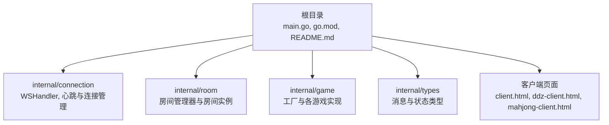
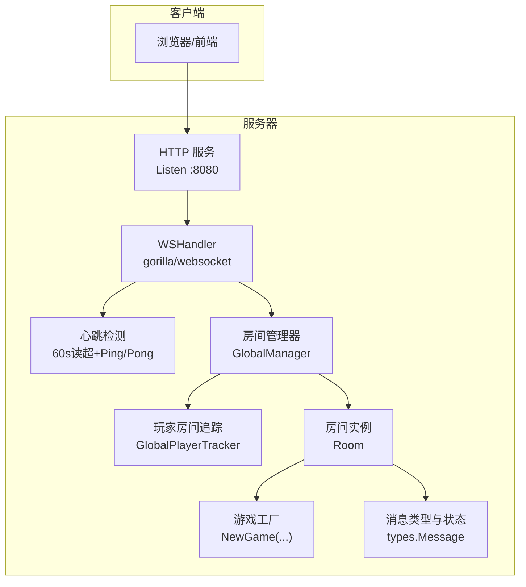
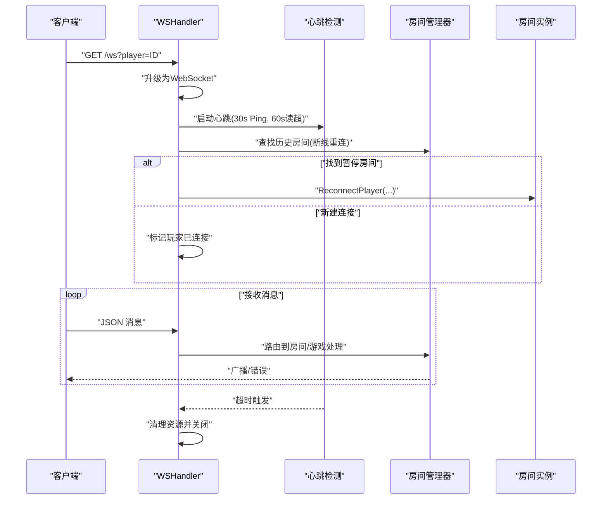
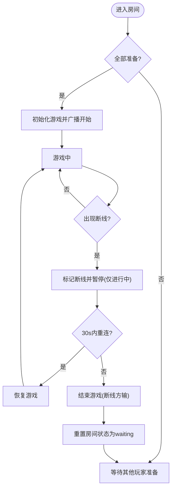
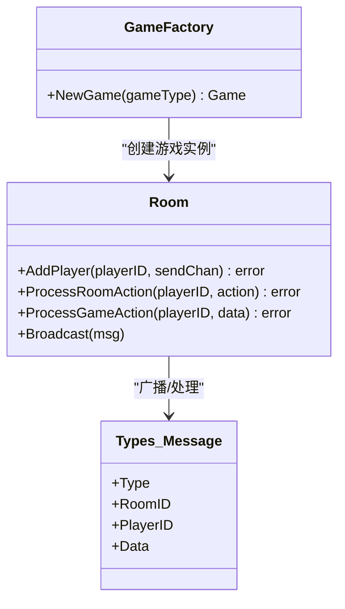
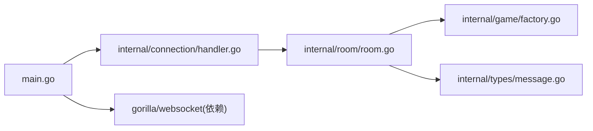

# 环境部署

<cite>
**本文引用的文件**
- [README.md](file://README.md)
- [go.mod](file://go.mod)
- [main.go](file://main.go)
- [internal/connection/connection.go](file://internal/connection/connection.go)
- [internal/connection/handler.go](file://internal/connection/handler.go)
- [internal/room/manager.go](file://internal/room/manager.go)
- [internal/room/room.go](file://internal/room/room.go)
- [internal/types/message.go](file://internal/types/message.go)
- [internal/game/factory.go](file://internal/game/factory.go)
- [client.html](file://client.html)
- [ddz-client.html](file://ddz-client.html)
- [mahjong-client.html](file://mahjong-client.html)
</cite>

## 目录
1. [简介](#简介)
2. [项目结构](#项目结构)
3. [核心组件](#核心组件)
4. [架构总览](#架构总览)
5. [详细组件分析](#详细组件分析)
6. [依赖关系分析](#依赖关系分析)
7. [性能与容量规划](#性能与容量规划)
8. [部署步骤与环境配置](#部署步骤与环境配置)
9. [Docker 容器化部署](#docker-容器化部署)
10. [CI/CD 集成与自动化部署](#cicd-集成与自动化部署)
11. [故障排查指南](#故障排查指南)
12. [结论](#结论)

## 简介
本指南面向生产环境部署，覆盖系统要求、依赖准备、端口与网络配置、完整部署流程、环境变量、Docker 容器化方案、CI/CD 集成以及不同部署场景的最佳实践。项目为基于 Go 与 WebSocket 的多人在线卡牌游戏服务器，支持简易游戏、斗地主与麻将三种游戏模式，采用模块化设计与接口抽象，便于扩展与维护。

## 项目结构
项目采用分层与功能域结合的组织方式：
- 根目录包含入口程序、客户端测试页面与模块清单
- internal 子目录按领域拆分：connection（WebSocket 连接）、room（房间管理）、game（游戏逻辑与工厂）、types（通用类型）
- docs 提供产品需求文档（麻将）

图表来源
- [main.go](file://main.go#L1-L15)
- [internal/connection/handler.go](file://internal/connection/handler.go#L1-L158)
- [internal/room/manager.go](file://internal/room/manager.go#L1-L83)
- [internal/room/room.go](file://internal/room/room.go#L1-L657)
- [internal/game/factory.go](file://internal/game/factory.go#L1-L24)
- [internal/types/message.go](file://internal/types/message.go#L1-L78)

章节来源
- [README.md](file://README.md#L20-L50)
- [main.go](file://main.go#L1-L15)

## 核心组件
- WebSocket 入口与升级：在根路径注册 /ws，使用 gorilla/websocket 升级 HTTP 到 WebSocket
- 连接生命周期与心跳：60 秒读超时 + Pong 处理；每 30 秒 Ping；超时关闭连接
- 房间管理：全局房间管理器与玩家房间追踪；支持断线重连与 30 秒断线保护
- 游戏工厂：根据游戏类型创建对应游戏实例（simple/ddz/mahjong）
- 消息协议：统一消息结构，支持房间管理、房间内操作、游戏动作与广播/错误

章节来源
- [main.go](file://main.go#L10-L14)
- [internal/connection/connection.go](file://internal/connection/connection.go#L32-L61)
- [internal/connection/handler.go](file://internal/connection/handler.go#L15-L18)
- [internal/room/manager.go](file://internal/room/manager.go#L47-L83)
- [internal/room/room.go](file://internal/room/room.go#L14-L57)
- [internal/game/factory.go](file://internal/game/factory.go#L11-L23)
- [internal/types/message.go](file://internal/types/message.go#L32-L78)

## 架构总览
服务器通过 HTTP 监听端口，将 /ws 路径升级为 WebSocket，随后由连接处理器负责握手、鉴权（玩家ID）、心跳、断线重连与消息路由。消息到达后交由房间管理器与房间实例处理，房间再委托游戏工厂创建的游戏实例执行业务逻辑，并通过广播通道向所有在线玩家推送状态。

图表来源
- [main.go](file://main.go#L10-L14)
- [internal/connection/handler.go](file://internal/connection/handler.go#L19-L158)
- [internal/connection/connection.go](file://internal/connection/connection.go#L32-L61)
- [internal/room/manager.go](file://internal/room/manager.go#L47-L83)
- [internal/room/room.go](file://internal/room/room.go#L35-L57)
- [internal/game/factory.go](file://internal/game/factory.go#L11-L23)
- [internal/types/message.go](file://internal/types/message.go#L32-L78)

## 详细组件分析

### WebSocket 连接与心跳
- 升级策略：允许任意来源跨域
- 玩家去重：同一 playerID 防止重复连接
- 心跳：每 30 秒 Ping，60 秒读超，超时关闭连接
- 断线重连：若房间处于暂停且存在旧连接，允许在 30 秒内重连恢复

图表来源
- [internal/connection/handler.go](file://internal/connection/handler.go#L19-L158)
- [internal/connection/connection.go](file://internal/connection/connection.go#L32-L61)
- [internal/room/room.go](file://internal/room/room.go#L223-L257)

章节来源
- [internal/connection/handler.go](file://internal/connection/handler.go#L15-L18)
- [internal/connection/connection.go](file://internal/connection/connection.go#L10-L30)
- [internal/connection/connection.go](file://internal/connection/connection.go#L32-L61)
- [internal/room/room.go](file://internal/room/room.go#L133-L168)

### 房间管理与断线保护
- 房间状态：waiting/playing/paused/gameover
- 玩家准备与选座：准备满员自动开始游戏
- 断线保护：游戏进行中玩家断线标记为离线，30 秒内可重连；超时则判定断线方输并结束游戏
- 广播：普通广播与个性化广播（含防阻塞与丢包告警）

图表来源
- [internal/room/room.go](file://internal/room/room.go#L318-L348)
- [internal/room/room.go](file://internal/room/room.go#L133-L168)
- [internal/room/room.go](file://internal/room/room.go#L170-L220)
- [internal/room/room.go](file://internal/room/room.go#L540-L566)

章节来源
- [internal/room/manager.go](file://internal/room/manager.go#L47-L83)
- [internal/room/room.go](file://internal/room/room.go#L14-L57)
- [internal/room/room.go](file://internal/room/room.go#L296-L316)

### 游戏工厂与消息协议
- 工厂：根据 game_type 返回对应游戏实例
- 消息：统一 Message 结构，支持 room.create/join/action/chat/broadcast/error 等

图表来源
- [internal/game/factory.go](file://internal/game/factory.go#L11-L23)
- [internal/room/room.go](file://internal/room/room.go#L35-L57)
- [internal/types/message.go](file://internal/types/message.go#L32-L78)

章节来源
- [internal/game/factory.go](file://internal/game/factory.go#L1-L24)
- [internal/types/message.go](file://internal/types/message.go#L1-L78)

## 依赖关系分析
- 语言与运行时：Go 1.22
- WebSocket 依赖：gorilla/websocket
- 项目模块：card-game-server

图表来源
- [go.mod](file://go.mod#L1-L6)
- [main.go](file://main.go#L1-L15)
- [internal/connection/handler.go](file://internal/connection/handler.go#L1-L158)
- [internal/room/room.go](file://internal/room/room.go#L1-L657)
- [internal/game/factory.go](file://internal/game/factory.go#L1-L24)
- [internal/types/message.go](file://internal/types/message.go#L1-L78)

章节来源
- [go.mod](file://go.mod#L1-L6)

## 性能与容量规划
- 心跳与超时：30s Ping + 60s 读超，适合高并发长连接场景
- 广播通道：房间广播通道带缓冲，避免单个客户端阻塞影响整体
- 防抖：同一玩家 100ms 内重复操作会被忽略，降低无效压力
- 断线保护：30 秒断线窗口，平衡体验与资源占用

章节来源
- [internal/connection/connection.go](file://internal/connection/connection.go#L32-L61)
- [internal/room/room.go](file://internal/room/room.go#L476-L482)
- [internal/room/room.go](file://internal/room/room.go#L568-L612)

## 部署步骤与环境配置

### 系统要求与依赖准备
- Go 版本：1.22+
- 操作系统：Linux/Windows/macOS（建议 Linux 生产环境）
- 网络：开放 TCP 端口 8080，WebSocket 端点 /ws
- 依赖：gorilla/websocket（由 go.mod 管理）

章节来源
- [README.md](file://README.md#L16-L17)
- [go.mod](file://go.mod#L3-L6)

### 环境变量与配置
- 默认监听地址：:8080
- WebSocket 路径：/ws
- 玩家 ID：通过查询参数 player=ID 指定，未提供时自动生成
- 断线重连：房间暂停状态下允许 30 秒内重连

章节来源
- [main.go](file://main.go#L10-L14)
- [internal/connection/handler.go](file://internal/connection/handler.go#L30-L33)
- [internal/room/room.go](file://internal/room/room.go#L161-L168)

### 端口与防火墙规则
- 服务器监听端口：8080（TCP）
- WebSocket 端点：/ws
- 防火墙建议：放行 8080/TCP；如需反向代理（Nginx/Traefik），请确保 WebSocket 升级透传

章节来源
- [README.md](file://README.md#L67-L83)
- [main.go](file://main.go#L10-L14)

### 本地开发与测试
- 启动命令：go run main.go
- 测试客户端：client.html（简易）、ddz-client.html（斗地主）、mahjong-client.html（麻将）
- 访问方式：http://localhost:8080/client.html 等

章节来源
- [README.md](file://README.md#L52-L76)
- [client.html](file://client.html)
- [ddz-client.html](file://ddz-client.html)
- [mahjong-client.html](file://mahjong-client.html)

### 生产部署流程（单机）
- 获取代码：克隆仓库
- 安装依赖：go mod download
- 编译运行：go run main.go 或构建二进制后运行
- 配置反向代理：Nginx/Traefik 等，确保 /ws 升级透传
- 防火墙放行：8080/TCP
- 监控与日志：stdout/stderr 输出，结合 systemd/systemd-journald 或 Docker 日志收集

章节来源
- [README.md](file://README.md#L54-L65)

## Docker 容器化部署

### Dockerfile 示例
- 基础镜像：官方 Go 镜像（建议使用带 build 工具链的镜像）
- 步骤：复制 go.mod/go.sum、下载依赖、编译、运行
- 注意：不要使用 scratch，除非静态链接；否则需要运行时库

章节来源
- [go.mod](file://go.mod#L1-L6)

### docker-compose 示例
- 服务：card-game-server
- 端口映射：8080:8080
- 环境变量：可通过环境变量注入（如监听地址、日志级别等）
- 健康检查：可基于 /ws 连接或 HTTP 健康端点（如需）

章节来源
- [main.go](file://main.go#L10-L14)

## CI/CD 集成与自动化部署

### 建议流水线步骤
- 代码检出与缓存：缓存 go mod download 结果
- 依赖安装：go mod download
- 构建：go build -o server
- 测试：go test ./...
- 镜像构建：使用 Dockerfile 构建镜像
- 推送镜像：推送到镜像仓库
- 部署：kubectl/docker stack/Ansible 等部署至目标环境

### 关键优化点
- 多阶段构建：减少镜像体积
- 缓存依赖：加速 CI 速度
- 安全扫描：镜像与依赖漏洞扫描
- 蓝绿/滚动发布：降低停机风险

## 故障排查指南
- 连接失败
  - 检查端口 8080 是否被占用
  - 确认 /ws 是否正确升级（反向代理需透传 Upgrade/Connection 头）
  - 查看日志输出，确认 gorilla/websocket 升级错误
- 心跳超时
  - 客户端网络不稳定或 NAT 超时
  - 服务器负载过高导致写阻塞
- 断线重连失败
  - 房间状态非 paused 或已超时
  - 30 秒窗口已过
- 广播阻塞
  - 单个客户端消息队列满，查看丢包告警日志
  - 调整广播通道缓冲或限流

章节来源
- [internal/connection/connection.go](file://internal/connection/connection.go#L32-L61)
- [internal/room/room.go](file://internal/room/room.go#L568-L612)
- [internal/room/room.go](file://internal/room/room.go#L161-L168)

## 结论
本指南提供了从系统要求、依赖准备、部署流程、网络配置到容器化与 CI/CD 的完整方案。生产环境建议配合反向代理、健康检查、日志与监控体系，并针对不同场景（单机/集群/云平台）制定弹性与高可用策略。通过断线保护与心跳机制，系统可在网络波动下保持稳定运行。