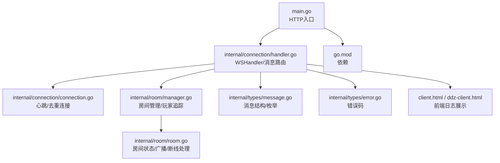
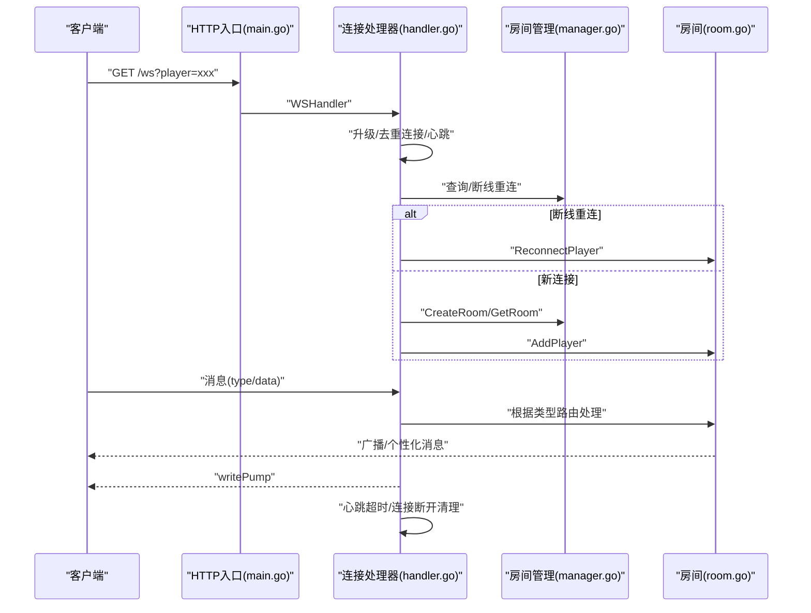
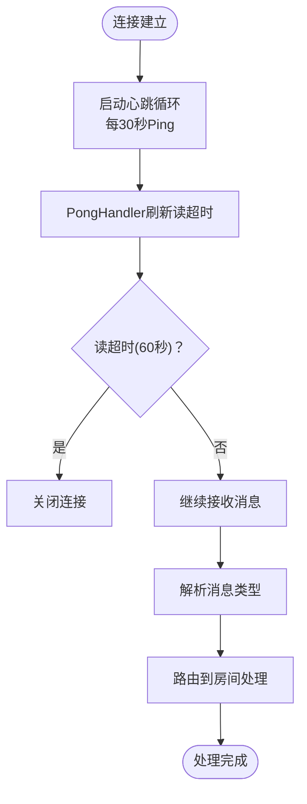
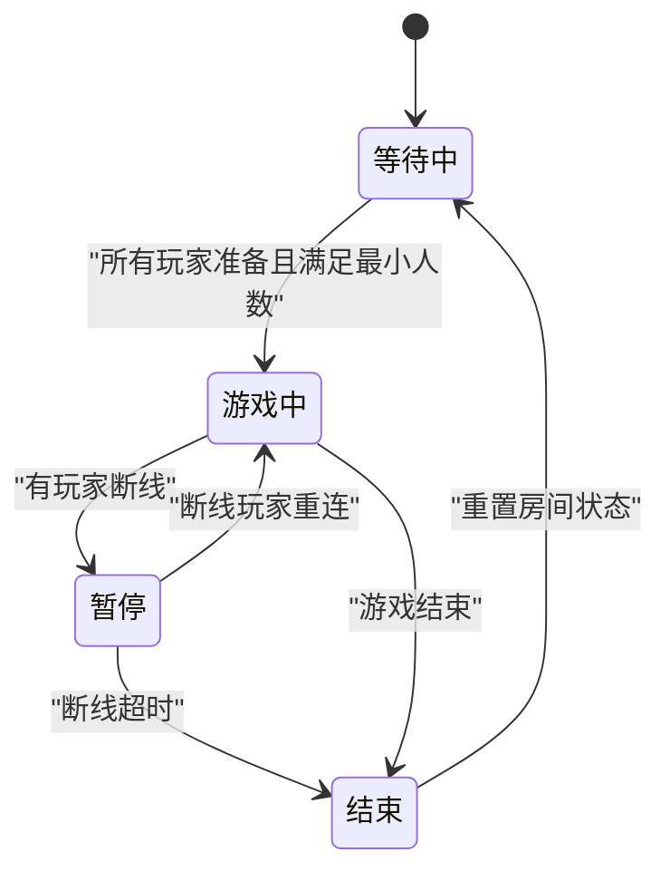
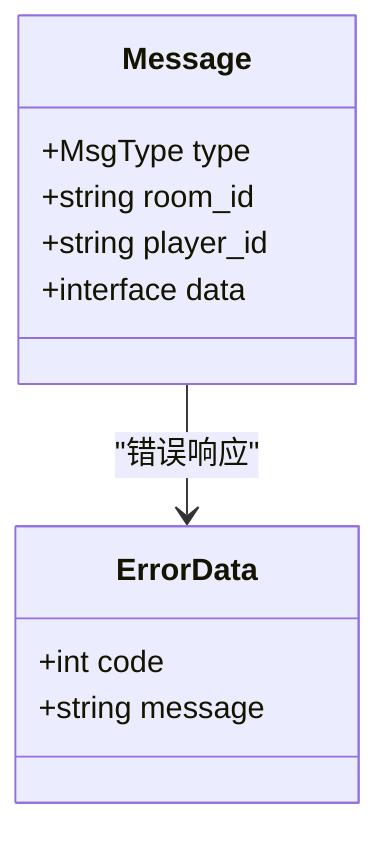
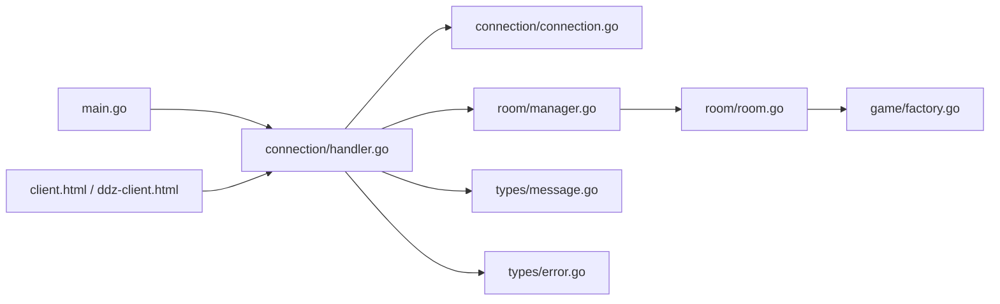

# 监控日志

<cite>
**本文引用的文件**
- [main.go](file://main.go)
- [connection.go](file://internal/connection/connection.go)
- [handler.go](file://internal/connection/handler.go)
- [manager.go](file://internal/room/manager.go)
- [room.go](file://internal/room/room.go)
- [message.go](file://internal/types/message.go)
- [error.go](file://internal/types/error.go)
- [go.mod](file://go.mod)
- [client.html](file://client.html)
- [ddz-client.html](file://ddz-client.html)
</cite>

## 目录
1. [简介](#简介)
2. [项目结构](#项目结构)
3. [核心组件](#核心组件)
4. [架构总览](#架构总览)
5. [详细组件分析](#详细组件分析)
6. [依赖关系分析](#依赖关系分析)
7. [性能与监控要点](#性能与监控要点)
8. [日志收集与管理策略](#日志收集与管理策略)
9. [关键性能指标（KPI）与仪表板](#关键性能指标kpi与仪表板)
10. [告警机制配置](#告警机制配置)
11. [日志分析与问题定位](#日志分析与问题定位)
12. [监控工具集成建议与最佳实践](#监控工具集成建议与最佳实践)
13. [结论](#结论)

## 简介
本指南围绕当前代码库的运行状态监控与日志管理展开，结合现有 WebSocket 连接、房间管理、消息广播与心跳机制，系统性提出连接数统计、内存使用、CPU 负载、WebSocket 健康度监测、日志结构化与轮转、KPI 定义与仪表板、告警阈值与通知渠道、以及日志分析与问题定位方法。文档同时给出与现有代码映射的可视化图示，并提供可落地的监控工具集成建议与最佳实践。

## 项目结构
项目采用按功能域划分的层次化组织：
- 入口层：HTTP 服务入口，注册 WebSocket 路由
- 连接层：WebSocket 升级、心跳、去重连接、断线重连与清理
- 房间管理层：全局房间与玩家追踪，房间生命周期管理
- 房间层：房间状态机、广播通道、断线处理、游戏动作处理
- 类型与常量：统一消息结构、错误码与枚举
- 客户端：前端日志展示与交互

图表来源
- [main.go](file://main.go#L10-L14)
- [handler.go](file://internal/connection/handler.go#L19-L158)
- [connection.go](file://internal/connection/connection.go#L14-L61)
- [manager.go](file://internal/room/manager.go#L47-L82)
- [room.go](file://internal/room/room.go#L14-L657)
- [message.go](file://internal/types/message.go#L32-L78)
- [error.go](file://internal/types/error.go#L3-L12)
- [go.mod](file://go.mod#L1-L6)
- [client.html](file://client.html#L118-L200)
- [ddz-client.html](file://ddz-client.html#L159-L200)

章节来源
- [main.go](file://main.go#L10-L14)
- [handler.go](file://internal/connection/handler.go#L19-L158)
- [connection.go](file://internal/connection/connection.go#L14-L61)
- [manager.go](file://internal/room/manager.go#L47-L82)
- [room.go](file://internal/room/room.go#L14-L657)
- [message.go](file://internal/types/message.go#L32-L78)
- [error.go](file://internal/types/error.go#L3-L12)
- [go.mod](file://go.mod#L1-L6)
- [client.html](file://client.html#L118-L200)
- [ddz-client.html](file://ddz-client.html#L159-L200)

## 核心组件
- HTTP 与 WebSocket 入口：负责路由注册与升级
- 连接处理器：负责握手、去重连接、心跳、消息解析与路由
- 房间管理器：全局房间与玩家追踪，提供房间创建、查询与删除
- 房间：房间状态机、广播通道、断线处理、游戏动作处理
- 类型与错误：统一消息结构、错误码与枚举
- 客户端：前端日志展示与交互

章节来源
- [main.go](file://main.go#L10-L14)
- [handler.go](file://internal/connection/handler.go#L19-L158)
- [connection.go](file://internal/connection/connection.go#L14-L61)
- [manager.go](file://internal/room/manager.go#L47-L82)
- [room.go](file://internal/room/room.go#L14-L657)
- [message.go](file://internal/types/message.go#L32-L78)
- [error.go](file://internal/types/error.go#L3-L12)

## 架构总览
WebSocket 连接建立后，服务端通过消息类型路由到房间管理与游戏逻辑；房间通过广播通道异步向各客户端发送消息；心跳机制保障连接健康；断线重连与断线超时控制保证游戏连续性。

图表来源
- [main.go](file://main.go#L10-L14)
- [handler.go](file://internal/connection/handler.go#L19-L158)
- [manager.go](file://internal/room/manager.go#L54-L82)
- [room.go](file://internal/room/room.go#L223-L257)

## 详细组件分析

### WebSocket 连接与心跳
- 心跳：每 30 秒发送 Ping，读超时 60 秒，超时自动关闭连接
- 去重连接：同一 playerID 不允许重复连接
- 断线重连：断线期间房间暂停，支持重连恢复

图表来源
- [connection.go](file://internal/connection/connection.go#L32-L61)
- [handler.go](file://internal/connection/handler.go#L19-L158)

章节来源
- [connection.go](file://internal/connection/connection.go#L32-L61)
- [handler.go](file://internal/connection/handler.go#L19-L158)

### 房间管理与状态机
- 房间状态：等待中、游戏中、暂停（断线）、结束
- 广播：普通广播与个性化广播，避免阻塞
- 断线处理：断线标记、暂停游戏、30 秒超时清理
- 游戏动作：防抖（100ms），回合切换与状态广播

图表来源
- [room.go](file://internal/room/room.go#L14-L27)
- [room.go](file://internal/room/room.go#L133-L220)
- [room.go](file://internal/room/room.go#L460-L523)

章节来源
- [room.go](file://internal/room/room.go#L14-L27)
- [room.go](file://internal/room/room.go#L133-L220)
- [room.go](file://internal/room/room.go#L460-L523)

### 消息结构与错误码
- 统一消息结构：type、room_id、player_id、data
- 错误码：覆盖数据校验、加入失败、房间不存在、重复连接、未在房间、未实现、内部错误等

图表来源
- [message.go](file://internal/types/message.go#L32-L78)
- [error.go](file://internal/types/error.go#L3-L12)

章节来源
- [message.go](file://internal/types/message.go#L32-L78)
- [error.go](file://internal/types/error.go#L3-L12)

## 依赖关系分析
- 入口依赖连接层，连接层依赖房间管理层与类型定义
- 房间层依赖游戏工厂接口，实现多游戏类型扩展
- 客户端通过前端日志展示服务端日志与事件

图表来源
- [main.go](file://main.go#L10-L14)
- [handler.go](file://internal/connection/handler.go#L19-L158)
- [connection.go](file://internal/connection/connection.go#L14-L61)
- [manager.go](file://internal/room/manager.go#L47-L82)
- [room.go](file://internal/room/room.go#L14-L657)
- [message.go](file://internal/types/message.go#L32-L78)
- [error.go](file://internal/types/error.go#L3-L12)
- [client.html](file://client.html#L118-L200)
- [ddz-client.html](file://ddz-client.html#L159-L200)

章节来源
- [main.go](file://main.go#L10-L14)
- [handler.go](file://internal/connection/handler.go#L19-L158)
- [connection.go](file://internal/connection/connection.go#L14-L61)
- [manager.go](file://internal/room/manager.go#L47-L82)
- [room.go](file://internal/room/room.go#L14-L657)
- [message.go](file://internal/types/message.go#L32-L78)
- [error.go](file://internal/types/error.go#L3-L12)
- [client.html](file://client.html#L118-L200)
- [ddz-client.html](file://ddz-client.html#L159-L200)

## 性能与监控要点
- 连接数统计：基于已连接玩家映射与房间在线人数
- 内存使用：关注广播通道缓冲、房间 Players/Seats/Ready/OfflinePlayers 映射大小
- CPU 负载：消息解析、房间广播、断线超时定时器触发频率
- WebSocket 健康度：心跳 Ping/Pong 成功率、读超时次数、写队列积压

章节来源
- [connection.go](file://internal/connection/connection.go#L10-L30)
- [room.go](file://internal/room/room.go#L14-L657)

## 日志收集与管理策略
- 结构化日志：统一字段（时间、级别、模块、玩家/房间、事件、详情）
- 日志级别：info（连接/断开/状态变更）、warn（队列满/panic）、error（错误码/异常）
- 日志轮转：按大小/时间轮转，保留最近 N 天，压缩旧日志
- 前端日志：客户端页面日志区域用于快速定位用户侧问题

章节来源
- [handler.go](file://internal/connection/handler.go#L19-L158)
- [room.go](file://internal/room/room.go#L405-L459)
- [client.html](file://client.html#L118-L200)
- [ddz-client.html](file://ddz-client.html#L159-L200)

## 关键性能指标（KPI）与仪表板
- 连接数：在线玩家总数、房间内在线人数、断线人数
- 延迟：消息处理延迟（广播/写队列）、心跳往返时间
- 吞吐：消息速率（每秒）、广播速率（每房间每秒）
- 异常率：错误码分布、panic 次数、队列满丢弃次数
- 资源：内存使用、goroutine 数、GC 次数与暂停时间

仪表板建议：
- 实时面板：连接数、在线房间数、平均延迟、异常率
- 历史趋势：消息速率、广播速率、内存/CPU 使用
- 事件看板：断线/重连、房间状态变化、错误码 TopN

章节来源
- [room.go](file://internal/room/room.go#L405-L459)
- [connection.go](file://internal/connection/connection.go#L32-L61)

## 告警机制配置
- 阈值建议：
  - 连接数：单实例峰值超过阈值持续 X 分钟
  - 延迟：P95/P99 超过 Y 毫秒
  - 异常率：错误码占比超过 Z%
  - 队列：广播队列积压超过 W 条
- 规则：滑动窗口统计、多因子聚合
- 通知渠道：IM/邮件/电话分级告警

章节来源
- [room.go](file://internal/room/room.go#L568-L612)
- [connection.go](file://internal/connection/connection.go#L32-L61)

## 日志分析与问题定位
- 错误日志分析：按错误码分类统计，定位常见问题（重复连接、房间不存在、数据格式错误）
- 性能瓶颈识别：观察广播队列满、panic、断线超时频繁触发
- 用户体验监控：断线重连成功率、房间等待时间、消息到达延迟

章节来源
- [error.go](file://internal/types/error.go#L3-L12)
- [room.go](file://internal/room/room.go#L568-L612)
- [handler.go](file://internal/connection/handler.go#L19-L158)

## 监控工具集成建议与最佳实践
- Prometheus + Grafana：采集自定义指标（连接数、消息速率、异常率），构建仪表板
- OpenTelemetry：接入链路追踪，标注玩家/房间维度
- Loki + Promtail：结构化日志采集与检索，支持按玩家/房间过滤
- Alertmanager：基于阈值与规则的告警聚合与通知
- 最佳实践：
  - 为每个请求/连接打标签（player_id、room_id、game_type）
  - 保持日志字段一致，便于检索与聚合
  - 对高并发场景启用采样与降噪
  - 定期巡检广播队列与断线定时器

章节来源
- [room.go](file://internal/room/room.go#L405-L459)
- [handler.go](file://internal/connection/handler.go#L19-L158)

## 结论
当前代码库具备完善的 WebSocket 连接与房间管理能力，日志输出覆盖连接、断线、状态变更与错误场景。建议在此基础上引入结构化日志与指标采集，完善 KPI 与告警体系，结合前端日志展示，形成“可观测—可预警—可定位”的闭环监控方案，持续提升系统稳定性与用户体验。