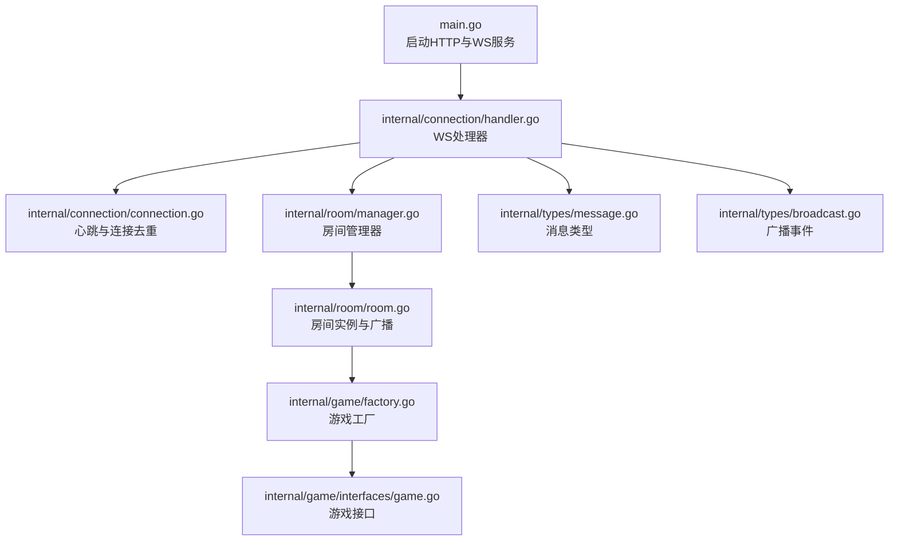
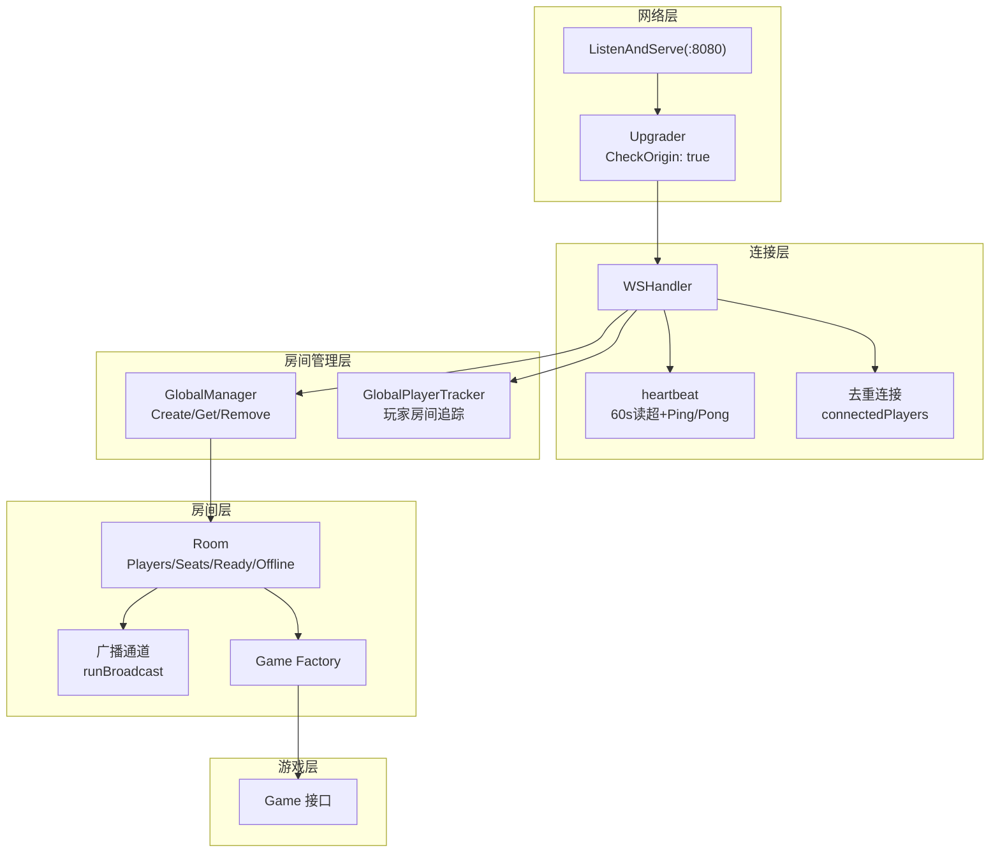
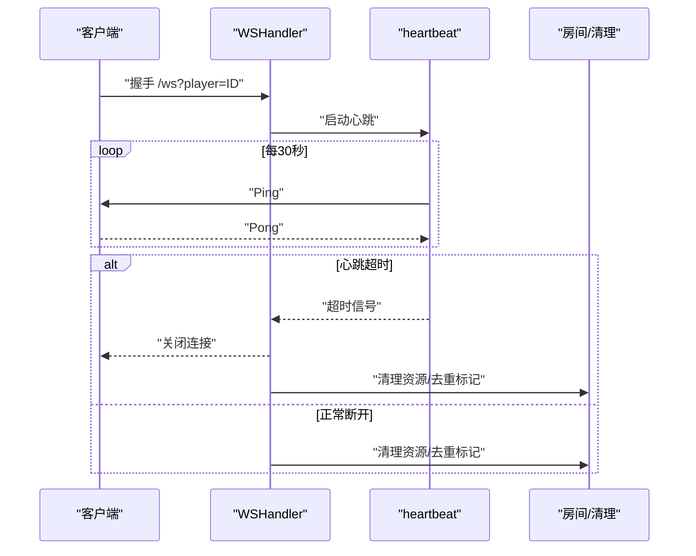
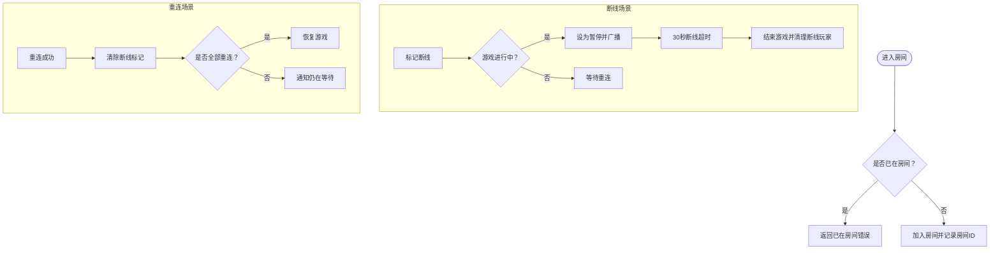
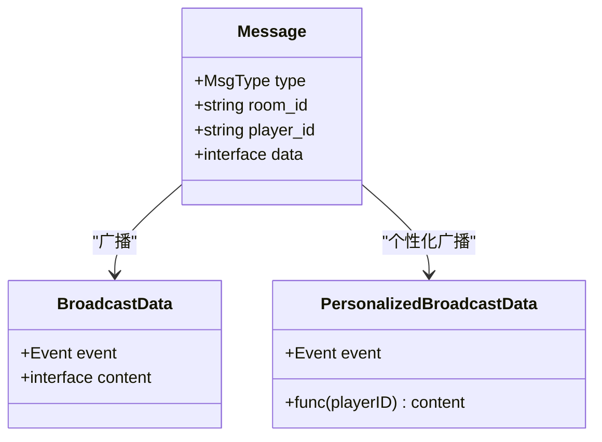
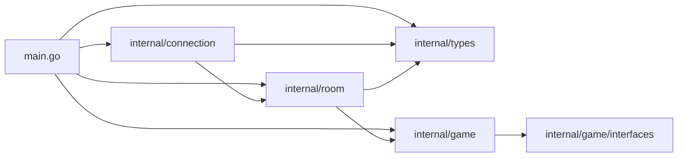

# 部署运维

<cite>
**本文引用的文件**
- [main.go](file://main.go)
- [go.mod](file://go.mod)
- [README.md](file://README.md)
- [internal/connection/connection.go](file://internal/connection/connection.go)
- [internal/connection/handler.go](file://internal/connection/handler.go)
- [internal/room/manager.go](file://internal/room/manager.go)
- [internal/room/room.go](file://internal/room/room.go)
- [internal/types/message.go](file://internal/types/message.go)
- [internal/types/broadcast.go](file://internal/types/broadcast.go)
- [internal/game/factory.go](file://internal/game/factory.go)
- [internal/game/interfaces/game.go](file://internal/game/interfaces/game.go)
- [client.html](file://client.html)
- [ddz-client.html](file://ddz-client.html)
- [mahjong-client.html](file://mahjong-client.html)
</cite>

## 目录
1. [简介](#简介)
2. [项目结构](#项目结构)
3. [核心组件](#核心组件)
4. [架构总览](#架构总览)
5. [详细组件分析](#详细组件分析)
6. [依赖关系分析](#依赖关系分析)
7. [性能与容量规划](#性能与容量规划)
8. [监控与日志](#监控与日志)
9. [负载均衡与高可用](#负载均衡与高可用)
10. [安全配置](#安全配置)
11. [容器化与编排](#容器化与编排)
12. [版本升级与回滚](#版本升级与回滚)
13. [故障排查与应急响应](#故障排查与应急响应)
14. [运维最佳实践](#运维最佳实践)
15. [结论](#结论)

## 简介
本指南面向生产环境部署与运维，覆盖服务器环境准备、依赖安装、应用部署、容器化与编排、性能监控与日志管理、负载均衡与高可用、安全配置、故障排查与应急响应、版本升级与回滚以及运维最佳实践。项目为基于 Go 与 WebSocket 的多人卡牌游戏服务器，支持简易、斗地主、麻将三种游戏模式，并提供房间管理、断线重连、聊天与广播等能力。

## 项目结构
- 入口程序负责启动 HTTP 服务器并在 /ws 提供 WebSocket 服务。
- 连接层负责 WebSocket 握手、心跳、去重连接与断线清理。
- 房间管理层负责全局房间与玩家追踪。
- 房间层负责房间生命周期、玩家座位与准备状态、游戏状态广播与断线处理。
- 类型层定义消息、广播事件与房间状态。
- 游戏工厂与接口定义支持扩展新游戏。



图表来源
- [main.go](file://main.go#L10-L14)
- [internal/connection/handler.go](file://internal/connection/handler.go#L19-L158)
- [internal/connection/connection.go](file://internal/connection/connection.go#L32-L61)
- [internal/room/manager.go](file://internal/room/manager.go#L47-L82)
- [internal/room/room.go](file://internal/room/room.go#L14-L57)
- [internal/game/factory.go](file://internal/game/factory.go#L11-L23)
- [internal/game/interfaces/game.go](file://internal/game/interfaces/game.go#L3-L22)
- [internal/types/message.go](file://internal/types/message.go#L3-L38)
- [internal/types/broadcast.go](file://internal/types/broadcast.go#L3-L20)

章节来源
- [main.go](file://main.go#L10-L14)
- [README.md](file://README.md#L20-L50)

## 核心组件
- 入口与路由
  - 监听端口与路由注册，提供 /ws WebSocket 端点。
- 连接与心跳
  - 握手升级、同玩家ID去重、心跳检测与超时关闭。
- 房间管理
  - 全局房间创建、查询、删除；玩家房间追踪。
- 房间与广播
  - 玩家加入/离场、准备/选座、游戏动作处理、状态广播与断线重连。
- 消息与事件
  - 统一消息结构、房间状态与游戏事件广播。
- 游戏工厂
  - 根据游戏类型创建具体游戏实例。

章节来源
- [main.go](file://main.go#L10-L14)
- [internal/connection/handler.go](file://internal/connection/handler.go#L19-L158)
- [internal/connection/connection.go](file://internal/connection/connection.go#L10-L61)
- [internal/room/manager.go](file://internal/room/manager.go#L17-L82)
- [internal/room/room.go](file://internal/room/room.go#L14-L657)
- [internal/types/message.go](file://internal/types/message.go#L3-L78)
- [internal/types/broadcast.go](file://internal/types/broadcast.go#L3-L48)
- [internal/game/factory.go](file://internal/game/factory.go#L11-L23)

## 架构总览
系统采用单进程多协程模型：入口负责监听与路由，WS处理器负责连接生命周期与消息分发，房间层负责业务状态与广播，游戏层负责规则与状态输出。



图表来源
- [main.go](file://main.go#L10-L14)
- [internal/connection/handler.go](file://internal/connection/handler.go#L15-L158)
- [internal/connection/connection.go](file://internal/connection/connection.go#L32-L61)
- [internal/room/manager.go](file://internal/room/manager.go#L47-L82)
- [internal/room/room.go](file://internal/room/room.go#L14-L57)
- [internal/game/factory.go](file://internal/game/factory.go#L11-L23)
- [internal/game/interfaces/game.go](file://internal/game/interfaces/game.go#L3-L22)

## 详细组件分析

### 连接与心跳
- 心跳机制：每 30 秒发送 Ping，读超 60 秒，超时关闭连接。
- 去重连接：同一 playerID 同时只允许一个连接。
- 断线清理：延迟清理，支持断线重连与超时处理。



图表来源
- [internal/connection/handler.go](file://internal/connection/handler.go#L90-L101)
- [internal/connection/connection.go](file://internal/connection/connection.go#L32-L61)

章节来源
- [internal/connection/handler.go](file://internal/connection/handler.go#L19-L158)
- [internal/connection/connection.go](file://internal/connection/connection.go#L10-L61)

### 房间管理与断线重连
- 房间创建/获取/移除；玩家房间追踪。
- 断线重连：暂停状态下允许重连，超时后结束并清理。
- 广播：异步通道广播，个性化消息支持。



图表来源
- [internal/room/room.go](file://internal/room/room.go#L133-L220)
- [internal/room/room.go](file://internal/room/room.go#L222-L257)
- [internal/room/manager.go](file://internal/room/manager.go#L17-L45)

章节来源
- [internal/room/manager.go](file://internal/room/manager.go#L17-L82)
- [internal/room/room.go](file://internal/room/room.go#L133-L257)

### 消息与广播
- 消息类型：房间创建/加入/离开、房间操作、游戏动作、聊天、广播、错误。
- 广播事件：房间状态变更、游戏开始/结束、状态更新、聊天。
- 个性化广播：按玩家发送隐私状态。



图表来源
- [internal/types/message.go](file://internal/types/message.go#L32-L78)
- [internal/types/broadcast.go](file://internal/types/broadcast.go#L17-L48)

章节来源
- [internal/types/message.go](file://internal/types/message.go#L3-L78)
- [internal/types/broadcast.go](file://internal/types/broadcast.go#L3-L48)

### 游戏工厂与扩展
- 工厂根据 game_type 创建对应游戏实例。
- 新增游戏需实现 Game 接口并在工厂注册。

```mermaid
classDiagram
class Game {
+ID() string
+Init(players []string) error
+ProcessAction(playerID, action) (bool, error)
+CurrentTurn() string
+AdvanceTurn()
+GetState() interface{}
+GetStateForPlayer(playerID) interface{}
+IsGameOver() bool
+Winner() string
+MaxPlayers() int
+MinPlayers() int
}
class GameFactory {
+NewGame(type) Game
}
GameFactory --> Game : "创建实例"
```

图表来源
- [internal/game/interfaces/game.go](file://internal/game/interfaces/game.go#L3-L22)
- [internal/game/factory.go](file://internal/game/factory.go#L11-L23)

章节来源
- [internal/game/factory.go](file://internal/game/factory.go#L11-L23)
- [internal/game/interfaces/game.go](file://internal/game/interfaces/game.go#L3-L22)

## 依赖关系分析
- 语言与运行时：Go 1.22+。
- 第三方库：gorilla/websocket。
- 本地模块：internal/* 子包之间存在清晰的分层依赖。



图表来源
- [main.go](file://main.go#L3-L8)
- [go.mod](file://go.mod#L1-L6)
- [internal/connection/handler.go](file://internal/connection/handler.go#L9-L12)
- [internal/room/room.go](file://internal/room/room.go#L3-L11)
- [internal/game/factory.go](file://internal/game/factory.go#L3-L8)

章节来源
- [go.mod](file://go.mod#L1-L6)

## 性能与容量规划
- 连接与广播
  - 每连接维持一个写泵 goroutine 与心跳 goroutine，房间内广播使用带缓冲通道，注意客户端背压与丢弃策略。
  - 断线超时 30 秒，避免长时间悬挂连接占用资源。
- 心跳与读超
  - 读超 60 秒，建议在反向代理层设置更短的 TCP 空闲超时，确保快速回收。
- 并发与锁
  - 房间与追踪器使用读写锁，避免热点竞争；广播通道默认缓冲较大，需结合实际并发评估。
- 客户端压力
  - 测试客户端位于根路径，生产环境建议独立静态资源与域名，减少首屏与脚本加载压力。
- 优化建议
  - 限流与连接数上限（可在网关层实现）。
  - 为广播通道增加背压与丢弃策略，避免内存膨胀。
  - 对重复操作（如游戏动作）增加防抖（已实现 100ms 防抖）。

章节来源
- [internal/connection/connection.go](file://internal/connection/connection.go#L32-L61)
- [internal/room/room.go](file://internal/room/room.go#L462-L523)

## 监控与日志
- 关键指标建议
  - 连接数、活跃房间数、每房间平均在线人数、广播通道积压、错误率（格式错误、房间不存在、玩家不在房间等）、断线次数与超时比例。
- 日志策略
  - 访问日志：统一接入 Nginx/Apache 或反向代理日志。
  - 应用日志：标准输出，结合 systemd/journald 或容器日志驱动采集。
  - 结构化日志：建议在日志中包含 room_id、player_id、事件类型等上下文字段。
- 告警建议
  - 连接数异常波动、广播通道积压持续升高、错误率突增、断线超时比例上升。
- 监控工具
  - Prometheus + Grafana 或云监控平台，结合日志平台（如 ELK/OTel）实现统一观测。

[本节为通用运维建议，无需特定文件引用]

## 负载均衡与高可用
- 单实例部署
  - 适合小规模或开发测试，注意端口暴露与反向代理。
- 多实例部署
  - 使用反向代理（Nginx/Tengine/HAProxy）做四层/七层负载均衡，启用粘性会话或共享状态。
  - 会话共享：WebSocket 通常要求粘性会话，若需无状态，需引入共享存储或消息总线（如 Redis/消息中间件）同步房间状态与玩家追踪。
- 健康检查
  - 健康探针可探测 /ws 是否可达（握手即健康），或对外提供 /health 接口。
- 扩缩容
  - 基于 CPU/连接数/房间数进行水平扩展，结合反向代理权重与灰度发布。

[本节为通用架构建议，无需特定文件引用]

## 安全配置
- WebSocket 安全
  - 生产环境建议限制来源域名（CheckOrigin），或在反向代理层校验 Origin。
  - 使用 WSS（WebSocket over TLS），证书由反向代理或专用证书服务管理。
- 防火墙与网络
  - 仅开放 8080（或反向代理映射端口），限制源地址白名单。
- 访问控制
  - 在反向代理层实现速率限制、IP 黑名单与风控。
  - 对 /ws 增加鉴权（如 JWT）与会话校验，避免滥用。
- 数据安全
  - 敏感日志脱敏，禁止记录完整消息体；传输加密，防止中间人攻击。

章节来源
- [internal/connection/handler.go](file://internal/connection/handler.go#L15-L17)

## 容器化与编排
- Dockerfile 编写要点
  - 基础镜像：官方 gcr.io/distroless/base 或 alpine:latest。
  - 构建：使用多阶段构建，最终镜像仅包含二进制与必要运行时。
  - 入口命令：直接运行编译产物。
  - 端口：EXPOSE 8080；容器内监听 0.0.0.0:8080。
  - 健康检查：curl -f http://localhost:8080/health 或 WebSocket 探活。
  - 资源限制：CPU/内存限制与启动参数配合。
- Docker Compose 示例要点
  - 服务：web（应用）、nginx（反向代理）、redis（可选共享状态）。
  - 网络：自定义桥接网络，便于服务发现。
  - 挂载：日志卷、配置挂载（如 Nginx 配置）。
- Kubernetes 编排要点
  - Deployment：副本数、滚动更新策略、就绪/存活探针。
  - Service：ClusterIP/LoadBalancer，暴露 80/443 至 8080。
  - Ingress：TLS 终止、WSS 支持、限流与压缩。
  - ConfigMap/Secret：配置与证书管理。
  - HPA：基于连接数或 CPU 自动扩缩容。
- 多实例与会话
  - 若采用粘性会话，确保反向代理启用 sticky session。
  - 若采用无状态，需引入共享存储或消息总线同步房间状态与玩家追踪。

[本节为通用容器化建议，无需特定文件引用]

## 版本升级与回滚
- 升级策略
  - 蓝绿/金丝雀：逐步切流量至新版本，观察指标与日志。
  - 滚动升级：逐批重启，保证最小可用副本数。
- 回滚策略
  - 快速回滚至上一稳定版本，保留旧镜像与配置。
- 发布清单
  - 镜像标签、配置变更、数据库迁移（如有）、健康检查与告警阈值。
- 降级预案
  - 临时关闭新功能开关，回退到上一版本。

[本节为通用发布建议，无需特定文件引用]

## 故障排查与应急响应
- 常见问题定位
  - 连接频繁断开：检查心跳超时、网络抖动、反向代理空闲超时。
  - 广播积压：检查广播通道缓冲、客户端消费速度、丢弃策略。
  - 玩家重复连接：确认去重逻辑与清理流程。
  - 房间状态异常：核对房间状态机与广播消息序列。
- 诊断步骤
  - 查看应用日志与错误码；抓取 /ws 握手与消息序列。
  - 核对房间与玩家追踪状态；验证断线重连与超时逻辑。
  - 检查反向代理与 WSS 配置。
- 应急响应
  - 限流与熔断：临时降低并发，保护核心链路。
  - 降级：关闭非关键功能，优先保障核心游戏流程。
  - 回滚：快速回退至上一稳定版本。

章节来源
- [internal/connection/handler.go](file://internal/connection/handler.go#L31-L88)
- [internal/room/room.go](file://internal/room/room.go#L133-L220)

## 运维最佳实践
- 环境隔离：开发/测试/预发/生产严格分离。
- 配置管理：集中化配置，敏感信息使用密钥管理服务。
- 监控告警：建立 SLO/SLO，关键指标 24/7 监控。
- 日志治理：结构化日志、分级存储、检索与聚合。
- 安全基线：最小权限、定期漏洞扫描、合规审计。
- 文档与演练：发布流程、应急预案、演练计划。

[本节为通用运维建议，无需特定文件引用]

## 结论
本指南提供了从单机到多实例、从单节点到集群的部署与运维全景，结合项目特性给出了心跳、断线重连、房间广播与游戏工厂等关键组件的运维要点。建议在生产环境中配合反向代理、WSS、健康检查与可观测体系，确保稳定性与可扩展性。