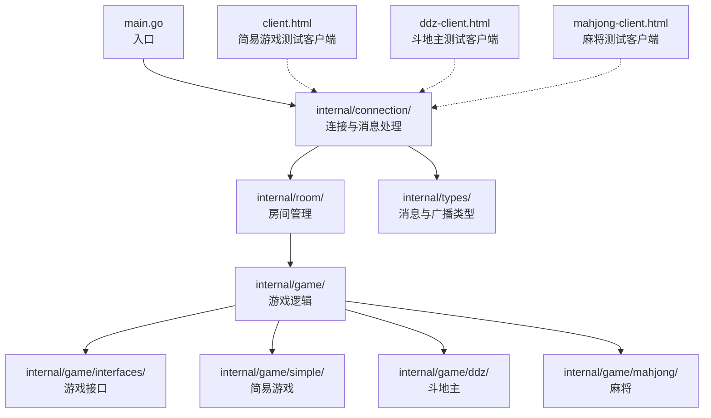
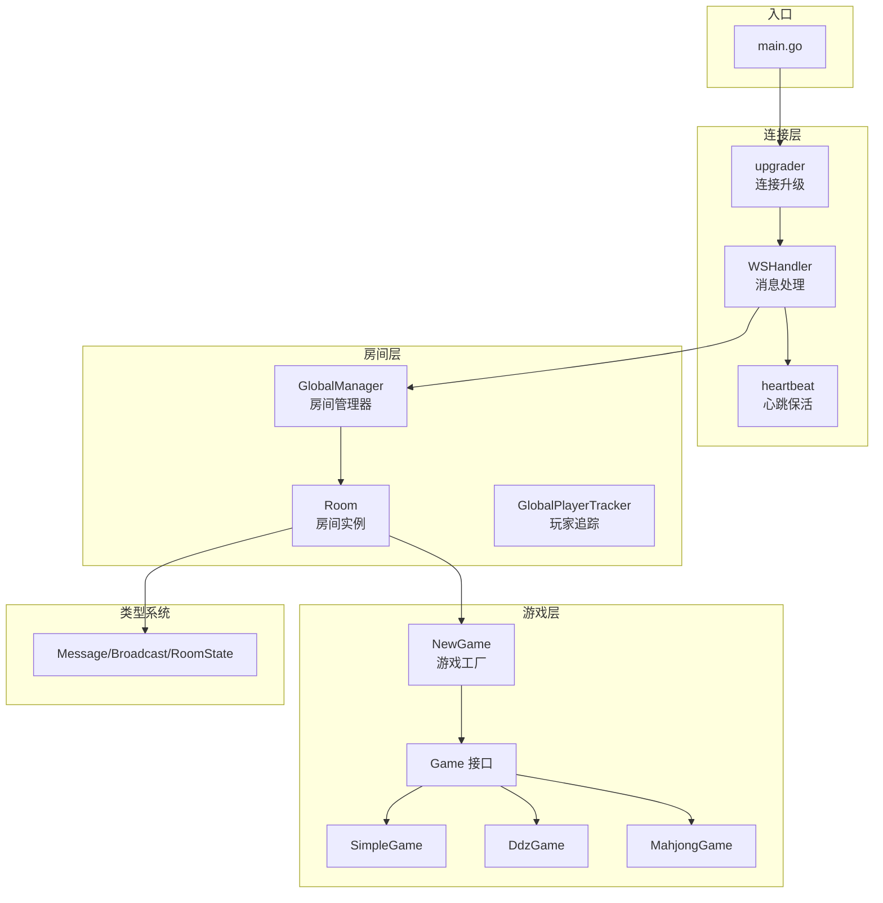
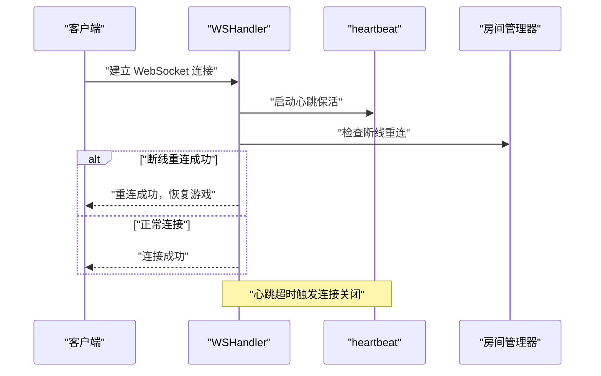
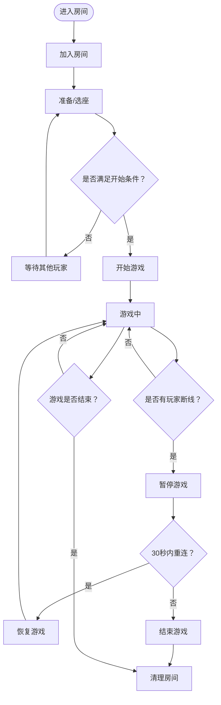
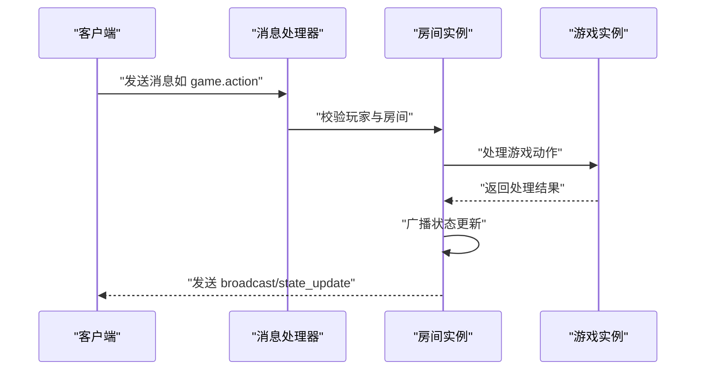
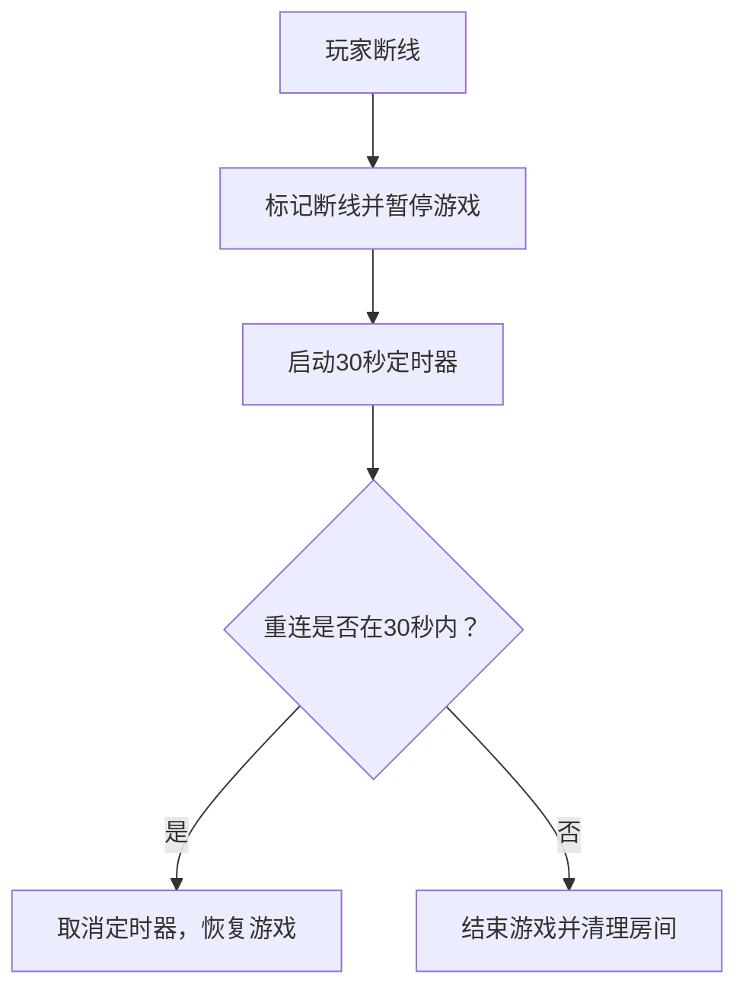
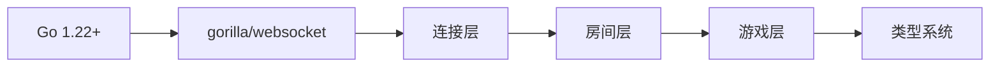

# 项目概述

<cite>
**本文档引用的文件**
- [README.md](file://README.md)
- [main.go](file://main.go)
- [go.mod](file://go.mod)
- [internal/connection/connection.go](file://internal/connection/connection.go)
- [internal/connection/handler.go](file://internal/connection/handler.go)
- [internal/room/manager.go](file://internal/room/manager.go)
- [internal/room/room.go](file://internal/room/room.go)
- [internal/game/factory.go](file://internal/game/factory.go)
- [internal/game/interfaces/game.go](file://internal/game/interfaces/game.go)
- [internal/game/simple/game.go](file://internal/game/simple/game.go)
- [internal/game/ddz/game.go](file://internal/game/ddz/game.go)
- [internal/types/message.go](file://internal/types/message.go)
- [internal/types/broadcast.go](file://internal/types/broadcast.go)
- [client.html](file://client.html)
</cite>

## 目录
1. [简介](#简介)
2. [项目结构](#项目结构)
3. [核心组件](#核心组件)
4. [架构总览](#架构总览)
5. [详细组件分析](#详细组件分析)
6. [依赖关系分析](#依赖关系分析)
7. [性能考虑](#性能考虑)
8. [故障排除指南](#故障排除指南)
9. [结论](#结论)

## 简介
本项目是一个基于 Go 语言开发的 WebSocket 实时卡牌游戏服务器，支持多种卡牌游戏类型（simple、ddz、mahjong）。项目采用模块化设计，通过 gorilla/websocket 库实现全双工实时通信，提供房间管理、断线重连、聊天系统与游戏状态同步等核心能力。服务器在本地 8080 端口运行，WebSocket 端点为 /ws，配套提供了简易游戏、斗地主和麻将的测试客户端页面。

项目目标与特性：
- 多游戏支持：simple（2人）、ddz（3人）、mahjong（4人）
- 实时通信：基于 WebSocket 的全双工通信，心跳保活与断线重连
- 房间管理：创建/加入房间、玩家准备、选座系统
- 断线重连：游戏中断线保护，支持 30 秒内重连恢复
- 聊天系统：房间内实时聊天
- 状态同步：广播机制确保所有玩家状态一致

技术栈选择：
- 语言：Go 1.22+
- 通信协议：WebSocket（gorilla/websocket）
- 架构模式：模块化设计，接口抽象

## 项目结构
项目采用清晰的分层与功能模块划分，便于扩展新的游戏类型与功能。



图表来源
- [main.go](file://main.go#L10-L14)
- [internal/connection/handler.go](file://internal/connection/handler.go#L19-L158)
- [internal/room/manager.go](file://internal/room/manager.go#L47-L83)
- [internal/game/factory.go](file://internal/game/factory.go#L11-L23)
- [internal/types/message.go](file://internal/types/message.go#L32-L78)

章节来源
- [README.md](file://README.md#L20-L50)
- [main.go](file://main.go#L10-L14)

## 核心组件
- WebSocket 连接与消息处理：负责升级 HTTP 连接为 WebSocket，心跳保活，消息路由与错误处理。
- 房间管理：全局房间管理器与房间实例，支持玩家加入/离开、准备/选座、游戏开始与状态广播。
- 游戏工厂：根据游戏类型创建对应的游戏实例，统一接口抽象。
- 类型系统：消息类型、广播事件、房间状态等统一的数据结构定义。
- 测试客户端：提供简易游戏、斗地主、麻将的前端测试页面，便于联调与演示。

章节来源
- [internal/connection/handler.go](file://internal/connection/handler.go#L19-L158)
- [internal/room/manager.go](file://internal/room/manager.go#L47-L83)
- [internal/game/factory.go](file://internal/game/factory.go#L11-L23)
- [internal/types/message.go](file://internal/types/message.go#L32-L78)

## 架构总览
系统采用“入口 -> 连接层 -> 房间层 -> 游戏层”的分层架构，配合广播通道实现状态同步。



图表来源
- [main.go](file://main.go#L10-L14)
- [internal/connection/handler.go](file://internal/connection/handler.go#L15-L18)
- [internal/connection/connection.go](file://internal/connection/connection.go#L32-L61)
- [internal/room/manager.go](file://internal/room/manager.go#L47-L83)
- [internal/room/room.go](file://internal/room/room.go#L35-L57)
- [internal/game/factory.go](file://internal/game/factory.go#L11-L23)
- [internal/game/interfaces/game.go](file://internal/game/interfaces/game.go#L3-L23)
- [internal/types/message.go](file://internal/types/message.go#L3-L11)

## 详细组件分析

### WebSocket 连接与心跳保活
- 连接升级：通过 gorilla/websocket 的 Upgrader 将 HTTP 请求升级为 WebSocket。
- 心跳保活：每 30 秒发送 Ping，读取超时设为 60 秒；超时自动关闭连接。
- 玩家去重：同一 playerID 不允许重复连接，防止并发冲突。
- 断线重连：若玩家处于断线状态且房间处于暂停，允许在 30 秒内重连恢复。



图表来源
- [internal/connection/handler.go](file://internal/connection/handler.go#L19-L158)
- [internal/connection/connection.go](file://internal/connection/connection.go#L32-L61)
- [internal/room/room.go](file://internal/room/room.go#L222-L257)

章节来源
- [internal/connection/handler.go](file://internal/connection/handler.go#L19-L158)
- [internal/connection/connection.go](file://internal/connection/connection.go#L10-L61)

### 房间管理与状态同步
- 房间生命周期：创建房间 -> 玩家加入 -> 准备/选座 -> 游戏开始 -> 游戏结束 -> 房间清理。
- 状态广播：房间内部通过广播通道异步向所有在线玩家发送状态更新，保证一致性。
- 断线处理：游戏中断线标记为离线，暂停游戏等待重连；30 秒超时后结束游戏并清理房间。
- 个性化广播：针对每个玩家生成个性化状态（如手牌），避免信息泄露。



图表来源
- [internal/room/room.go](file://internal/room/room.go#L59-L96)
- [internal/room/room.go](file://internal/room/room.go#L133-L220)
- [internal/room/room.go](file://internal/room/room.go#L296-L316)
- [internal/room/room.go](file://internal/room/room.go#L461-L523)

章节来源
- [internal/room/manager.go](file://internal/room/manager.go#L47-L83)
- [internal/room/room.go](file://internal/room/room.go#L14-L57)

### 游戏工厂与接口抽象
- 接口定义：统一的 Game 接口，规定初始化、动作处理、回合推进、状态查询、胜负判定等能力。
- 工厂模式：根据 game_type 创建对应游戏实例（simple、ddz、mahjong）。
- 扩展性：新增游戏类型只需实现 Game 接口并在工厂中注册。

```mermaid
classDiagram
class Game {
+ID() string
+Init(players []string) error
+ProcessAction(playerID string, action interface{}) (bool, error)
+CurrentTurn() string
+AdvanceTurn()
+GetState() interface{}
+GetStateForPlayer(playerID string) interface{}
+IsGameOver() bool
+Winner() string
+MaxPlayers() int
+MinPlayers() int
}
class SimpleGame {
-players []string
-hands map[string][]int
+Init(players []string) error
+ProcessAction(playerID string, action interface{}) (bool, error)
+GetState() interface{}
+GetStateForPlayer(playerID string) interface{}
}
class DdzGame {
-hands map[string]Hand
-phase string
+Init(players []string) error
+ProcessAction(playerID string, action interface{}) (bool, error)
+GetState() interface{}
+GetStateForPlayer(playerID string) interface{}
}
Game <|.. SimpleGame
Game <|.. DdzGame
```

图表来源
- [internal/game/interfaces/game.go](file://internal/game/interfaces/game.go#L3-L23)
- [internal/game/simple/game.go](file://internal/game/simple/game.go#L8-L15)
- [internal/game/ddz/game.go](file://internal/game/ddz/game.go#L20-L35)

章节来源
- [internal/game/factory.go](file://internal/game/factory.go#L11-L23)
- [internal/game/interfaces/game.go](file://internal/game/interfaces/game.go#L3-L23)

### 消息协议与广播机制
- 消息类型：房间管理（room.create、room.join、room.leave）、房间内操作（room.action）、游戏操作（game.action）、聊天（chat）、服务端响应（broadcast、error）。
- 广播事件：房间状态变更（room_state_changed）、游戏开始（game_started）、游戏结束（game_over）、状态更新（state_update）、聊天（chat）。
- 数据结构：Message、BroadcastData、RoomState、Event 等统一定义。



图表来源
- [internal/connection/handler.go](file://internal/connection/handler.go#L130-L156)
- [internal/room/room.go](file://internal/room/room.go#L461-L523)
- [internal/types/message.go](file://internal/types/message.go#L13-L31)
- [internal/types/broadcast.go](file://internal/types/broadcast.go#L3-L15)

章节来源
- [internal/types/message.go](file://internal/types/message.go#L3-L78)
- [internal/types/broadcast.go](file://internal/types/broadcast.go#L17-L48)

### 断线重连机制
- 断线标记：玩家离线时记录断线时间，房间状态切换为 paused。
- 30 秒超时：最后一个断线玩家超时后结束游戏并清理房间。
- 重连恢复：重连成功后取消定时器，恢复游戏状态并向所有玩家广播。



图表来源
- [internal/room/room.go](file://internal/room/room.go#L133-L168)
- [internal/room/room.go](file://internal/room/room.go#L170-L220)
- [internal/room/room.go](file://internal/room/room.go#L222-L257)

章节来源
- [internal/room/room.go](file://internal/room/room.go#L133-L257)

## 依赖关系分析
- 语言与库：Go 1.22+，gorilla/websocket v1.5.3。
- 模块化依赖：连接层依赖房间层，房间层依赖游戏工厂与游戏接口，类型系统被各层共享。
- 外部集成：WebSocket 客户端通过 /ws 端点接入，测试客户端提供三种游戏类型的演示页面。



图表来源
- [go.mod](file://go.mod#L3-L6)
- [main.go](file://main.go#L3-L8)

章节来源
- [go.mod](file://go.mod#L3-L6)
- [main.go](file://main.go#L3-L8)

## 性能考虑
- 异步广播：房间内部使用带缓冲的广播通道，避免阻塞消息处理。
- 队列容量：广播通道容量为 512，写泵 goroutine 异步发送，防止单个客户端阻塞影响整体。
- 心跳保活：60 秒读取超时与 30 秒 Ping 间隔平衡网络波动与资源消耗。
- 防抖处理：同一玩家 100ms 内重复操作会被忽略，减少无效处理。
- 个性化广播：针对每个玩家生成个性化内容，避免信息泄露同时保持广播效率。

章节来源
- [internal/room/room.go](file://internal/room/room.go#L44-L56)
- [internal/room/room.go](file://internal/room/room.go#L568-L612)
- [internal/room/room.go](file://internal/room/room.go#L476-L482)
- [internal/connection/connection.go](file://internal/connection/connection.go#L32-L61)

## 故障排除指南
- 连接失败：检查 /ws 端点是否可达，确认 gorilla/websocket 是否正确引入。
- 玩家重复连接：同一 playerID 已连接时会被拒绝，需更换 ID 或等待旧连接断开。
- 房间不存在：加入房间时需提供正确的 room_id，否则返回房间不存在错误。
- 游戏动作无效：确保消息格式正确，动作类型与数据结构符合要求。
- 断线超时：若超过 30 秒未重连，游戏将结束并清理房间，需重新创建或加入房间。

章节来源
- [internal/connection/handler.go](file://internal/connection/handler.go#L31-L44)
- [internal/connection/handler.go](file://internal/connection/handler.go#L260-L268)
- [internal/room/room.go](file://internal/room/room.go#L170-L220)

## 结论
本项目通过清晰的分层架构与接口抽象，实现了高性能、可扩展的 WebSocket 卡牌游戏服务器。其模块化设计使得新增游戏类型变得简单，心跳保活与断线重连机制保障了实时性与稳定性，广播通道确保了状态一致性。对于初学者，项目提供了完整的测试客户端与协议说明；对于有经验的开发者，接口与工厂模式为二次开发提供了良好的扩展点。